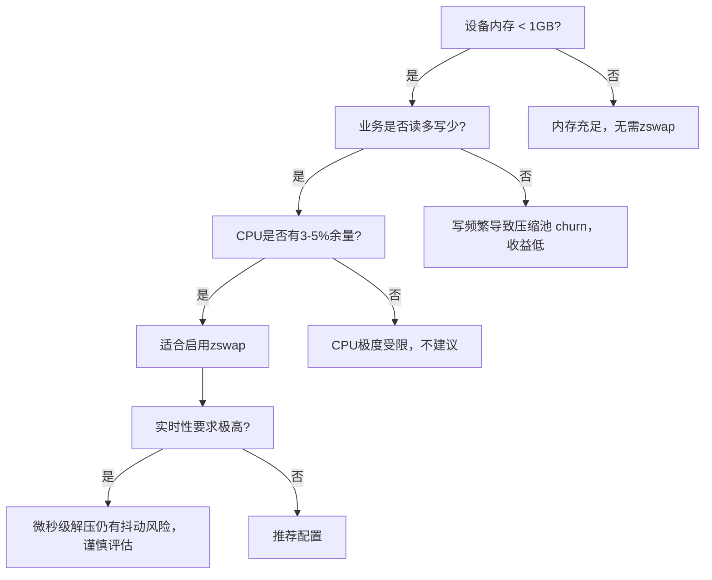

早年间我带过一个项目，一款工业网关设备，板子上只有512MB DDR3内存，跑的是Linux 4.9内核。系统启动后，内核、驱动、协议栈一占，用户空间可用的内存就剩下两百多兆。用户装了两个Python业务进程，内存直接告警。加物理颗粒？硬件早就定板了，改不了。最后我们启用了zswap，配合一块低速的eMMC swap分区，把这个设备从死亡线上拉了回来。

**知识点51 [I][M] 嵌入式场景的实测收益与代价**

这套512MB的设备启用zswap（后端用lz4压缩，zpool类型为zbud）之后，实际等效可用内存大概在650MB左右。怎么来的呢？我们当时跑了三天业务负载，观察`zswap/stored_pages`和`zswap/pool_total_size`这两个debugfs节点，算下来压缩比大概在2.5:1到3:1之间。也就是说，原本要swap出去的冷页，平均三页压缩成一页塞进内存池里。650MB这个数字不是理论值，是我们用`free`和实际OOM触发点反复测出来的——原先跑到380MB就开始频繁换页，启用后可以稳在550MB以上才出现压力。

CPU开销呢？我们用`perf`抓了内核态的`zswap_compress`和`zswap_decompress`两个符号，压缩和解压加一块，在典型业务负载下约占CPU时间的3%到5%。说实话，这个代价放在x86服务器上可能都测不出来噪声，但在一个双核Cortex-A9上，你得掂量掂量。好在我们的业务是读多写少，页面一旦压缩进去，短期内很少被访问，解压的次数远比压缩少。

延迟方面分两种情况。zswap命中——也就是要找的页面恰好在内存压缩池里——这时走zbud/zsmalloc的查找和解压路径，实测在微秒级别，我们测下来平均十几到几十微秒，对大多数嵌入式应用来说感知不强。但如果没命中，页面已经被逐出压缩池写到了后端swap设备，那就走的是常规swap-in路径。我们后端挂的是eMMC，随机读延迟毫秒级，极端情况下跑到十几二十毫秒，这时候业务线程会明显卡住。

所以zswap在嵌入式上并不是万能药。我见过有人不管三七二十一就打开，结果CPU本就不够用的设备上压缩解压抢走了关键线程的时间片，反而更卡。我们后来内部总结了一套决策逻辑：

这个决策树的核心思路是：zswap的本质是用CPU换内存带宽。你的设备得有富余的CPU cycles才值得做这笔买卖。

**知识点52 [I] zswap 与 zram 的选择决策**

很多人问我：zswap和zram到底用哪个？这两个东西名字像，机制也绕，但其实定位完全不同。我给你掰扯清楚。

zswap需要一个**后端swap设备**做靠山。压缩池满了，页面可以被逐出写到swap设备上。换句话说，zswap是站在swap前面的一层缓存，拦截住那些本该写到慢速设备上的页面，先在内存里压一压，能省则省。

zram不一样。zram本身就是一块**内存中的虚拟块设备**，你可以直接在上面创建swap分区，也可以直接当文件系统用。它没有后端——页面压进zram就是在内存里，满了就是满了，要么OOM，要么你还得配别的swap来接盘。

所以选择的逻辑很清晰：

| 场景 | 推荐方案 | 理由 |
|:---|:---|:---|
| 有后端swap设备（eMMC/NAND/NVMe） | **zswap** | 压缩池满了有退路，数据可逐出到后端 |
| 无swap，但急需压缩省内存 | **zram** | 不依赖外部swap，独立工作 |
| 极端小内存，且有swap | **zram + zswap 叠加** | zram做前级压缩swap，zswap守后端 |

最后这个"两者一起用"的策略有点意思。在一些超低内存场景下，你可以把zram配置成高优先级的swap设备，zswap守在后端。页面先走zram做第一轮压缩，如果zram本身也扛不住压力，再fallback到zswap和后端swap。当然，这套组合拳的复杂度不低，得仔细调各层的水位和优先级，别把自己绕进去。对于多数嵌入式项目来说，选一个、配好参数，比堆叠两套机制更靠谱。
