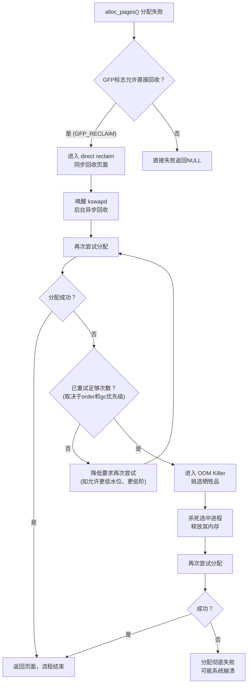

你的设备运行了三天三夜，某个进程突然就被杀掉了。dmesg里跳出来一行刺眼的红色：

```
Out of memory: Kill process 1234 (xxx) score 999 or sacrifice child
```

但你明明还有空闲内存！`free`一看，还剩几百MB呢。这OOM是从哪冒出来的？

其实不是"有内存就不会OOM"。内核在决定走OOM之前，有一整套流程要走完。走完这套流程还拿不到内存，才会动杀戒。理解这套流程，对定位线上问题非常关键。

**知识点53 [I][M] OOM前的完整内存回收流程**

当一个进程调用`alloc_pages()`申请内存时，内核并不是一看没内存就喊OOM。它要经过一个相当完整的"挣扎"过程。这个过程在`__alloc_pages_slowpath()`里实现，我来画个流程图你就明白了：



看清楚了吧？从分配失败到OOM，中间隔着好几道坎。

**第一步是 direct reclaim（直接回收）**。注意这个词——"直接"，意思是就在分配路径上、当前进程的上下文里，同步地去回收内存。它会去扫描LRU链表，把不活跃的页面踢出去，脏页还要先写回磁盘。这一切做完，才能继续往下走。这个过程中，申请内存的进程是挂起等待的。

Direct reclaim之后，内核还会**唤醒kswapd**。kswapd是后台线程，专门负责异步回收。唤醒它是为了让它在后台继续努力，虽然对当前这次分配已经来不及了，但能为后续分配创造空间。

然后内核会**再次尝试分配**。如果还是失败，就会进入一个循环：根据当前状况调整分配参数——比如降低分配阶（order）、允许使用紧急保留内存、或者进一步放宽水位限制——然后再试。这个循环不是无限次的，`__alloc_pages_slowpath()`里有一个重试计数逻辑，主要由分配阶和节点状况决定。

只有当**所有这些都试过了，仍然拿不到内存**，内核才会调用`out_of_memory()`函数，正式启动OOM Killer。

这里有一个关键细节：**不是所有分配失败都会触发OOM**。内核会检查GFP标志。如果你用的是`GFP_ATOMIC`这种不允许睡眠的标志，或者`GFP_NOWAIT`这种连直接回收都不允许的标志，那失败就是失败，直接返回NULL，不会走到OOM。只有带有`GFP_RECLAIM`相关标志、并且经过了完整的回收尝试仍然失败的分配请求，才会触发OOM。

```c
/* mm/page_alloc.c */
static inline struct page *
__alloc_pages_slowpath(gfp_t gfp_mask, unsigned int order,
                        struct alloc_context *ac)
{
    // ... 前面的快速路径已经失败了

    /* 第一步：直接回收 */
    if (direct_reclaim_may_throttle gfp_mask) {
        page = __perform_direct_reclaim(gfp_mask, order, ac);
        if (page)
            return page;  /* 回收后直接拿到了，皆大欢喜 */
    }

    /* 唤醒 kswapd */
    wake_all_kswapds(order, gfp_mask, ac);

    /* 循环重试 */
    for (noreclaim_iter = 0;
         noreclaim_iter <= MAX_RECLAIM_RETRIES;
         noreclaim_iter++) {

        page = get_page_from_freelist(gfp_mask, order, ...);
        if (page)
            return page;

        /* 逐步放宽分配条件 */
        if (noreclaim_iter == MAX_RECLAIM_RETRIES / 2)
            ac->spread_dirty_pages = false;

        /* 再次直接回收 */
        if (!drained) {
            drain_all_pages(...);
            drained = true;
            continue;
        }
    }

    /* 所有路都走不通了，OOM */
    page = __alloc_pages_may_oom(gfp_mask, order, ac, &did_some_progress);
    // ...
}
```

注意代码里的`MAX_RECLAIM_RETRIES`，这个值决定了内核会"挣扎"多少轮。阶数越高的分配（比如order=3的32KB连续页面），重试次数越少，因为大段连续内存本身就是稀缺资源，反复试意义不大。

**知识点54 [I] Direct reclaim：系统变卡的元凶之一**

Direct reclaim这个东西，性能代价相当可观。它是**同步**的——申请内存的进程必须停下来，等内核把页面回收完。回收什么呢？可能是file cache里不活跃的页，这些倒是好办；但如果是dirty page（脏页），那就麻烦了——得先写磁盘。IO一上去，整个系统的延迟就抖动了。

我见过一个案例：一个做实时视频处理的设备，每隔几分钟就卡顿几百毫秒。追查到最后，发现是一个后台统计模块周期性申请大块内存，触发了direct reclaim。回收路径上遇到大量脏页，写回磁盘把IO带宽占满了，视频采集线程被IO阻塞，帧就丢了。把那个模块改成预分配+内存池之后，问题彻底消失。

所以很多时候用户说"系统突然变卡了"，其实背后就是direct reclaim在作怪。它虽然不是OOM，但它是OOM之前的"阵痛"——系统在拼命自救，代价就是延迟暴涨。

