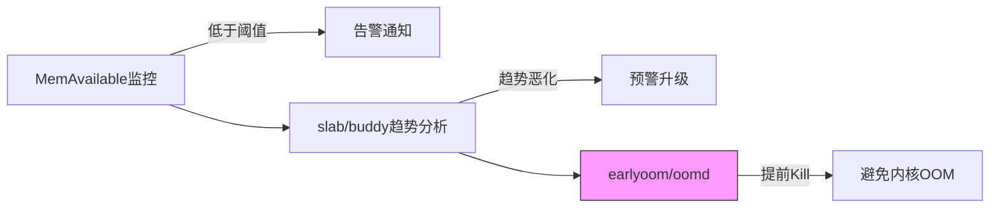

OOM发生了再处理已经晚了。老手的做法是在OOM之前就干掉风险——等内核OOM killer出手的时候，你的系统往往已经卡了好几秒，用户体验早就崩了。这叫"事后灭火"，真正值钱的是"事前防火"。

我见过太多团队把精力放在"怎么让OOM killer别杀我的进程"上，却从来没想过一个问题：能不能根本不走到那一步？答案是可以，而且手段比你想象的成熟。

**知识点61 [I] 三级预防体系**

第一层是**监控**。这事儿不复杂，但很多人没做。`/proc/meminfo`里的`MemAvailable`是最好用的指标——它比`MemFree`靠谱多了，因为它把cache、slab reclaimable这些能回收的内存都算进去了。设个阈值，比如`MemAvailable`低于总内存的5%就告警，PagerDuty一响，人就可以介入了。

```bash
# 一个简单的监控脚本
$ cat /proc/meminfo | grep MemAvailable
MemAvailable:    1234567 kB

# 配合slab和buddy的定期采样
$ cat /proc/slabinfo > /var/log/slab-$(date +%s).log
$ cat /proc/buddyinfo > /var/log/buddy-$(date +%s).log
```

第二层是**趋势分析**。光看一个时间点的`MemAvailable`不够，你得看趋势。slab是不是在疯长？buddyinfo里的高阶页是不是持续为0？这些信号比OOM来得早得多。写个脚本把slabinfo和buddyinfo按时间线画出来，内存泄漏的曲线一目了然。这活儿用个Python脚本+crontab就能跑，投入产出比极高。

```python
# buddyinfo趋势分析示例：高阶连续页是否持续枯竭
# 如果order>=2的页持续为0，说明大页分配即将失败
import re

def parse_buddyinfo(path="/proc/buddyinfo"):
    with open(path) as f:
        for line in f:
            zones = re.findall(r'zone (\w+)\s+((?:\d+\s+)+)', line)
            for zone, counts in zones:
                counts = list(map(int, counts.split()))
                # order 2及以上全为0？报警
                if all(c == 0 for c in counts[2:]):
                    print(f"WARNING: {zone} high-order pages exhausted")
```

第三层才是**自动处理**。监控和预警帮你发现风险，但半夜三点没人看告警的时候，系统得自己能动手。这就是用户空间OOM预防工具的用武之地——它们在内存吃紧但还没走到内核OOM的时候，提前杀掉内存大户，避免系统进入不可挽回的境地。



**知识点62 [I] 用户空间OOM预防工具对比**

说到提前动手的工具，目前主流的有三个：earlyoom、oomd、no-oom。它们的设计哲学差异很大，选错了可能等于白装。

| 工具 | 决策依据 | 触发时机 | 杀谁 | 适用场景 |
|------|---------|---------|------|---------|
| **earlyoom** | `MemAvailable` / `SwapFree`百分比 | 可用内存低于阈值 | 内存占用最大的进程 | 简单直接，通用性强 |
| **oomd** (Meta) | PSI压力指标 + cgroup内存统计 | PSI超过阈值时 | 可配置策略（如先杀cgroup内某类进程） | 复杂系统，需精细化策略 |
| **no-oom** | 可配置多种指标（内存、fd、线程数等） | 自定义规则触发 | 按规则匹配 | 嵌入式/特定约束环境 |

earlyoom是最朴素的一个。它每分钟读一次`/proc/meminfo`，算出可用内存和交换空间的百分比，低于设定的两个阈值就开始按比例选进程杀。逻辑简单粗暴，但管用——很多生产环境跑的就是它，配置两行就搞定。

oomd走另一个路子。它是Meta（Facebook）开源的，基于cgroup v2的PSI指标做决策。PSI能告诉你"因为缺内存，任务被stall了多久"，这比单纯的"还剩多少内存"要精确得多。oomd的策略可以写得很细：哪个cgroup压力大、先杀哪个子cgroup、压力缓解后多久停止——适合大规模部署。

no-oom相对小众，特点是极度可配置。你不光能看内存，还能监控文件描述符数、线程数等各种资源，规则引擎很灵活。在一些资源受限的嵌入式场景里，这种"不按常理出牌"的灵活性反而很有价值。

说到底，如果你的系统只需要"别OOM了就行"，earlyoom足够。如果你跑的是大规模容器集群，oomd的策略能力值回票价。至于选哪个，取决于你的系统复杂度和你愿意投入的配置成本。
