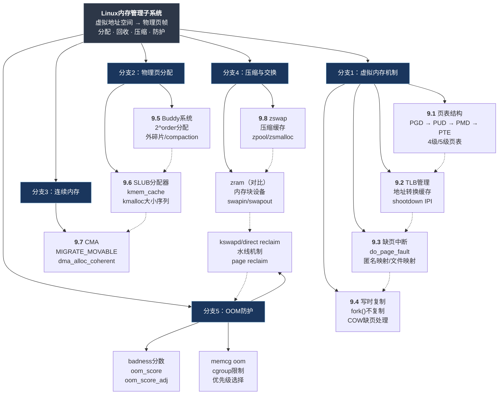

# 9.99 知识图谱与查漏补缺

本篇不引入新内容，而是把第9章散落的知识点串成一张网。建议你在看完前面各节后，把这篇当作"地图"来用——哪里模糊，点哪里。

---

## 知识图谱

第9章的所有知识点，归根结底都围绕一个核心问题：**内核如何在有限的物理内存之上，给进程提供近乎无限的虚拟地址空间，同时保证分配效率和系统稳定。**

图中的虚线表示**依赖或触发关系**：页表命中不了才走TLB miss，TLB miss了才触发缺页，Buddy大块被切割久了产生碎片才需要SLUB做细粒度分配，CMA在Buddy之上做预留，zswap在reclaim路径上拦截swap-out，最终所有防线失守才走到OOM。理解这个"漏斗"结构，比孤立记每个知识点重要得多。

---

## 知识点速查表

| 知识点 | 是什么 | 为什么重要 | 关键文件/命令 | 常见错误 |
|--------|--------|-----------|---------------|----------|
| **页表（4/5级）** | 多级页表将VA翻译成PA，每级一个数组 | 理解MMU工作原理的基石，缺页排查必须懂 | `arch/x86/mm/pgtable.c`, `/proc/<pid>/maps` | 误以为页表项只有PTE一级 |
| **TLB** | CPU芯片内的地址转换缓存，缓存近期VA→PA结果 | TLB miss直接决定内存访问延迟 | `/proc/interrupts`中的`TLB_SHOOTDOWN` | 大批量页表修改后忘了考虑shootdown开销 |
| **缺页中断** | 访问未映射VA时触发的内核异常，do_page_fault处理 | 文件mmap、COW、swap-in都在这发生 | `arch/x86/mm/fault.c` | 把SIGSEGV和缺页中断混为一谈 |
| **COW** | fork时不复制物理页，父子共享只读，写时触发缺页再复制 | 决定fork()速度的关键机制 | `mm/memory.c:do_wp_page()` | 大量COW同时写入会导致突发内存压力和TLB storm |
| **Buddy系统** | 按2^order块管理空闲页，分配时拆分、释放时合并 | 所有页分配的最终底层，`alloc_pages`的本体 | `/proc/buddyinfo`, `mm/page_alloc.c` | 高频分配释放不同order导致外碎片，大块分配失败 |
| **SLUB** | 基于Buddy页做细粒度对象缓存，减少内部碎片 | kmalloc、内核对象分配的 everyday 路径 | `/proc/slabinfo`, `mm/slub.c` | 不注意kmalloc大小序列，选了不高效的size导致内存浪费 |
| **CMA** | 在Buddy中预留一块可迁移区域，供需要连续物理内存的设备使用 | DMA设备、摄像头、GPU驱动的刚需 | `mm/cma.c`, 设备树`reserved-memory`节点 | 预留太大导致Buddy可用内存不足，预留太小dma_alloc失败 |
| **zswap** | swap-out路径上的压缩缓存，先压缩再决定是否写盘 | SSD寿命救星，减少swap设备IO | `mm/zswap.c`, `/sys/kernel/debug/zswap/` | 和zram搞混，不知道zswap在reclaim路径上而zram是独立块设备 |
| **zram** | 内存中的压缩块设备，作为swap分区用 | 无物理swap时的回退方案，嵌入式常用 | `drivers/block/zram/`, `/sys/block/zram0/` | 配置了zram但swapon没开，等于没配 |
| **OOM Killer** | 内存彻底耗尽时，按badness分数选进程杀掉 | 系统最后一道防线，理解它能救命 | `/proc/<pid>/oom_score_adj`, `dmesg` | 把关键daemon的oom_score_adj设太高被误杀 |
| **badness分数** | OOM时计算进程"该被杀程度"的公式 | 决定谁被杀，运维必须懂 | `mm/oom_kill.c:oom_badness()` | 以为rss大的一定先被杀，实际看的是`rss / sqrt(total_vm)`和adj |
| **memcg OOM** | cgroup内存限制触发的OOM，只杀组内进程 | 容器化部署的内存隔离基础 | `/sys/fs/cgroup/memory/`, `memory.limit_in_bytes` | 没开memcg或者limit设太大导致容器互相影响 |
| **watermark** | zone的三条水线（high/low/min），指导kswapd和direct reclaim | 理解系统什么时候开始回收、什么时候阻塞分配 | `/proc/zoneinfo`, `vm.min_free_kbytes` | min_free_kbytes设太大浪费内存，设太小容易触发direct reclaim卡顿 |
| **compaction** | 内存迁移+规整，把分散的空闲页合并成大块 | 解决外碎片的主动手段，CMA分配失败后的挽救 | `/proc/sys/vm/compact_memory`, `migratepages` | compaction期间CPU占用高，误以为系统在空转 |
| **kmalloc大小序列** | kmalloc按固定size阶梯分配（8, 16, 32...192, 256...），向上取整到最近阶梯 | 选错size会浪费最多接近一半的slab空间 | `include/linux/slab.h:kmalloc_caches`, `/proc/slabinfo` | 申请150字节实际占用192字节，批量时差距显著 |

---

## 查漏补缺清单

用下面的清单自测。 `[ ]` 表示还没吃透，`[x]` 表示有把握。建议看完本章后先扫一遍，标记出薄弱环节，然后回到对应章节精读。

### 页表与地址转换

- `[ ]` **知识点1 [E]** 能在纸上画出4级页表的完整查找路径：CR3→PGD→PUD→PMD→PTE→物理页，知道每级索引占VA的哪几位
- `[ ]` **知识点2 [E]** 理解为什么用多级页表而不是单级大数组——节省内存，稀疏地址空间不需要填满头几级
- `[ ]` **知识点3 [M]** 知道5级页表（增加P4D）是为多大地址空间准备的，当前主流硬件是否启用
- `[ ]` **知识点4 [I]** 能区分页表项（PTE）中的标志位：P（Present）、R/W、U/S、A（Accessed）、D（Dirty）
- `[ ]` **知识点5 [M]** 理解页表本身的内存开销：每进程页表可能占几十MB，为什么内核用延迟分配（缺页时才建中间级）

### TLB

- `[ ]` **知识点6 [I]** TLB是CPU芯片内的全相联/组相联缓存，缓存的是"完整VA→PA+权限"的映射结果
- `[ ]` **知识点7 [M]** TLB shootdown的完整流程：CPU0修改页表→发送IPI给其他CPU→其他CPU刷新本地TLB→回ack→CPU0继续
- `[ ]` **知识点8 [M]** 在`/proc/interrupts`中找到`TLB_SHOOTDOWN`计数，能判断 shootdown 是否过于频繁
- `[ ]` **知识点9 [E]** `flush_tlb_mm_range()`和`flush_tlb_all()`的区别，什么时候用局部刷新、什么时候必须全局刷新
- `[ ]` **知识点10 [M]** 大批量`mprotect`/`munmap`操作对TLB性能的影响，以及`hugetlb`为什么能缓解

### 缺页与COW

- `[ ]` **知识点11 [I]** 缺页中断不是panic，是正常机制——mmap文件、栈增长、COW都靠它
- `[ ]` **知识点12 [E]** 能在`dmesg`或`ftrace`中区分"缺页类型"： major fault（磁盘IO）vs minor fault（纯内存操作）
- `[ ]` **知识点13 [I]** COW的核心：`fork()`时页表项设为只读，父子共享物理页，任意一方写时触发`do_wp_page()`复制
- `[ ]` **知识点14 [M]** 大量进程同时COW写入同一块内存（比如fork后立刻修改共享库），会导致"TLB storm"和突发RSS增长
- `[ ]` **知识点15 [E]** `madvise(MADV_DONTFORK/MADV_WIPEONFORK)`在fork时的页表行为差异

### Buddy系统

- `[ ]` **知识点16 [I]** `order`的含义：分配2^order个连续页帧，order=0是1页，order=9是512页（2MB）
- `[ ]` **知识点17 [I]** 能读懂`/proc/buddyinfo`每列的含义，根据输出判断某个zone是否存在外碎片
- `[ ]` **知识点18 [E]** Buddy分配失败时的回退路径：优先fallback zone → 异步compaction → sync compaction → 直接reclaim → OOM
- `[ ]` **知识点19 [M]** `alloc_pages()`的GFP标志如何影响这个回退路径：`GFP_ATOMIC`不做reclaim，`GFP_KERNEL`允许完整回退
- `[ ]` **知识点20 [M]** compaction的两阶段：扫描找已用页（migrate scanner）+ 扫描找空闲页（free scanner），然后成对迁移

### SLUB分配器

- `[ ]` **知识点21 [I]** `kmalloc()`和`kmem_cache_alloc()`的关系：kmalloc基于一组通用的kmem_cache，按size阶梯索引
- `[ ]` **知识点22 [I]** kmalloc的size阶梯：8, 16, 32, 64, 96, 128, 192, 256, 512, 1024... 向上取整
- `[ ]` **知识点23 [E]`kmem_cache_create()`专用cache的优势：避免多对象混放一个slab带来的false sharing和缓存污染
- `[ ]` **知识点24 [M]** `SLUB_DEBUG`的用法：`slub_debug=FPZU`开启完整性检查，定位use-after-free和越界访问
- `[ ]` **知识点25 [I]** `/proc/slabinfo`中`active_objs / num_objs`比值偏低说明什么——该类型对象分配了但很少用，可能缓存了太多slab

### 连续内存（CMA）

- `[ ]` **知识点26 [I]** CMA的本质：在Buddy中预留一块标记为`MIGRATE_MOVABLE`的区域，平时给可移动分配用，需要连续时迁移走
- `[ ]` **知识点27 [M]** 设备树中`reserved-memory`节点的正确配置：size、align、compatible=`shared-dma-pool`
- `[ ]` **知识点28 [M]** CMA分配失败的三板斧：先看`cma=xxx`启动参数是否生效 → 再看`/proc/cmainfo`剩余量 → 最后抓compaction是否成功
- `[ ]` **知识点29 [E]** 为什么CMA依赖`MIGRATE_MOVABLE`：只有可移动页才能被迁移，不可移动页（如内核线性映射）会卡住compaction
- `[ ]` **知识点30 [M]** `dma_alloc_coherent()`的fallback路径：优先CMA → 再尝试直接Buddy（可能失败）→ 最后vmalloc+页表映射（性能差）

### 压缩与交换

- `[ ]` **知识点31 [I]** zswap和zram的核心区别：zswap在swap-out路径上拦截做压缩缓存，不占用独立内存；zram是内存块设备，需预先分配内存
- `[ ]` **知识点32 [M]** zswap的三个关键配置：压缩算法（`lzo/zstd/lz4`）、zpool类型（`zsmalloc/zbud`）、最大池大小（`max_pool_percent`）
- `[ ]` **知识点33 [M]** zswap的`stored_pages / rejected_pages`：reject原因可能是池满、压缩后变大、或者页不可swap
- `[ ]` **知识点34 [I]** `swappiness`（0-200）不是swap百分比，而是page reclaim时匿名页vs文件页的倾向权重
- `[ ]` **知识点35 [M]** 嵌入式系统没物理swap时的经典配置：`zram + swapon` 或者 `zswap + 小swap分区`

### OOM与防护

- `[ ]` **知识点36 [I]** OOM触发条件：所有zone的水线都低于min，且reclaim几乎无进展，`__alloc_pages_may_oom`返回true
- `[ ]` **知识点37 [E]** badness计算公式：`total_vm * (rss / sqrt(total_vm)) * adj`，理解为什么不是纯按RSS排序
- `[ ]` **知识点38 [I]** `oom_score_adj = -1000`的含义：该进程永远不被OOM killer选中，系统守护（init、watchdog）通常设这个值
- `[ ]` **知识点39 [I]** OOM日志解读：能在`dmesg`中定位"Out of memory"行，看出杀了哪个进程、其RSS/VMPeak多少、触发时的系统状态
- `[ ]` **知识点40 [M]** memcg OOM和全局OOM的区别：memcg OOM只杀cgroup内的进程，全局OOM杀系统级最badness的进程

### 内存API选择

- `[ ]` **知识点41 [B]** `kmalloc()` vs `kzalloc()`：后者多做一次`memset(0)`，小对象差别不大，大块时注意性能
- `[ ]` **知识点42 [I]** `vmalloc()`：分配虚拟地址连续但物理不连续的内存，用于大内核缓冲区（如ioremap），TLB开销高于kmalloc
- `[ ]` **知识点43 [I]** `dma_alloc_coherent()`：给DMA设备用的连续/一致性内存，自动处理cache一致性，嵌入式驱动开发必用
- `[ ]` **知识点44 [E]** `alloc_pages(GFP_KERNEL, order)`：直接走Buddy分配2^order个连续物理页，返回`struct page *`
- `[ ]` **知识点45 [I]** 选择决策树：小对象(<KMALLOC_MAX_SIZE)且无需连续 → kmalloc；需物理连续大块 → alloc_pages/CMA；只需虚拟连续 → vmalloc；DMA → dma_alloc_coherent

### 监控与排错

- `[ ]` **知识点46 [B]** `/proc/meminfo`中`MemTotal/MemFree/Available/Buffers/Cached`的区别，`Available`≈`MemFree`+可回收Cache
- `[ ]` **知识点47 [I]** `/proc/vmstat`中的`pgpgin/pgpgout`（swap IO）、`pswpin/pswpout`（swap换入换出页数）
- `[ ]` **知识点48 [M]** `/proc/zoneinfo`中`nr_free_pages`、三档watermark、`pages_high/low/min`的关系
- `[ ]` **知识点49 [I]** `vmstat 1`输出中`si/so`（swap）、`bi/bo`（块IO）、`us/sy/id/wa`的含义，wa高往往意味着swap或direct reclaim
- `[ ]` **知识点50 [M]** `drop_caches`的三档：`1`只drop pagecache，`2`只drop slab（dentries/inodes），`3`两者都drop——生产环境慎用

---

### 附：一眼区分zswap vs zram

| 维度 | zswap | zram |
|------|-------|------|
| 所在层级 | swap子系统内部，reclaim路径上拦截 | 独立块设备，`/dev/zram0` |
| 内存来源 | 透明使用系统内存，无固定预留 | 需`disksize`预分配专属内存 |
| 是否需要swapon | 不需要，对swap子系统透明 | 需要`mkswap + swapon` |
| 数据持久化 | 压缩池满后仍写回真实swap设备 | 压缩数据只存内存，关机即失 |
| 适用场景 | 有物理swap的SSD保护 | 无物理swap的嵌入式系统 |
| 内核配置 | `CONFIG_ZSWAP=y` | `CONFIG_ZRAM=y` |

说实话，我见过太多人同时开了zswap和zram还swapon了物理分区，三层压缩叠加，性能反而更差。选型时记住一个原则：**有SSD用zswap，没swap分区用zram，别叠罗汉。**

---

### 附：kmalloc大小阶梯速查

| 申请大小范围 | 实际分配 | slab name |
|-------------|---------|-----------|
| 1 ~ 8 | 8 | kmalloc-8 |
| 9 ~ 16 | 16 | kmalloc-16 |
| 17 ~ 32 | 32 | kmalloc-32 |
| 33 ~ 64 | 64 | kmalloc-64 |
| 65 ~ 96 | 96 | kmalloc-96 |
| 97 ~ 128 | 128 | kmalloc-128 |
| 129 ~ 192 | 192 | kmalloc-192 |
| 193 ~ 256 | 256 | kmalloc-256 |
| 257 ~ 512 | 512 | kmalloc-512 |
| 513 ~ 1024 | 1024 | kmalloc-1k |
| 1025 ~ 2048 | 2048 | kmalloc-2k |
| 2049 ~ 4096 | 4096 | kmalloc-4k |
| 4097 ~ 8192 | 8192 | kmalloc-8k |
| 8193 ~ 16384 | 16384 | kmalloc-16k |
| 16385 ~ 32768 | 32768 | kmalloc-32k |
| 32769 ~ 65536 | 65536 | kmalloc-64k |

> **陷阱**：申请150字节会占用192字节的slab对象，浪费28%。批量小对象分配时，对齐到最近的阶梯size能显著减少内存 footprint。
