# 9.99 知识图谱与查漏补缺

> "掌握内存管理的关键，不在于记住每个数据结构，而在于理解各组件之间如何协作、如何制约、又如何串联成一条完整的分配链路。"

---

## 一、知识图谱

```mermaid
flowchart TD
    subgraph VM["虚拟内存子系统"]
        VA["虚拟地址 VA"]
        PA["物理地址 PA"]
        PGD["PGD (Page Global Directory)"]
        PUD["PUD (Page Upper Directory)"]
        PMD["PMD (Page Middle Directory)"]
        PTE["PTE (Page Table Entry)"]
        FLAGS["页表标志位"]
        AF["AF (Access Flag)"]
        AP["AP (Access Permission)"]
        UXN["UXN (Unprivileged XN)"]
        PXN["PXN (Privileged XN)"]
        SH["SH (Shareability)"]
    end

    subgraph TLB_SUB["TLB 子系统"]
        TLB["TLB (Translation Lookaside Buffer)"]
        TLB_HIT["TLB Hit → 直接得PA"]
        TLB_MISS["TLB Miss → 遍历页表"]
        TLB_SHOOT["TLB Shootdown"]
        IPI["IPI 广播"]
    end

    subgraph PF["缺页中断处理"]
        DO_PF["do_page_fault()"]
        MAJOR["Major Fault (磁盘IO)"]
        MINOR["Minor Fault (无磁盘IO)"]
        SEGFAULT["Segfault (非法访问)"]
        COW["Copy-On-Write"]
    end

    subgraph KS["内核空间布局"]
        LM["线性映射区 (Linear Map)"]
        VMALLOC["vmalloc区"]
        MODULES["Modules区"]
    end

    subgraph BUDDY["Buddy 分配器"]
        ORDER["Order 概念 (0~MAX_ORDER-1)"]
        BINFO["/proc/buddyinfo"]
        EXTERNAL["外碎片 (External Fragmentation)"]
        MIGRATE["MIGRATE_TYPES"]
        MOVABLE["MIGRATE_MOVABLE"]
        UNMOVABLE["MIGRATE_UNMOVABLE"]
        RECLAIMABLE["MIGRATE_RECLAIMABLE"]
    end

    subgraph COMPACT["内存规整"]
        COMPACTION["Compaction"]
        MIGRATE_PAGES["页面迁移"]
        SCAN["双指针扫描"]
    end

    subgraph SLUB_SUB["SLUB 分配器"]
        KC["kmem_cache"]
        KSIZE["kmalloc 大小序列"]
        SLABINFO["/proc/slabinfo"]
        SLUB_DBG["SLUB_DEBUG"]
        FASTPATH1["Fastpath 1: 本地CPU缓存"]
        FASTPATH2["Fastpath 2: 共享缓存"]
        FASTPATH3["Fastpath 3: Buddy回退"]
        KZ["kzalloc()"]
        KVM["kvmalloc()"]
    end

    subgraph CMA_SUB["CMA 子系统"]
        DT["设备树配置 (linux,cma-default)"]
        CMA_MIGRATE["MIGRATE_CMA → MIGRATE_MOVABLE"]
        CMA_FAIL["分配失败排查"]
    end

    subgraph ZSWAP_SUB["Zswap 子系统"]
        ZPOOL["zpool 后端"]
        ZBUD["zbud/zsmalloc/z3fold"]
        COMP_ALG["压缩算法 (lzo/lz4/zstd)"]
        ZRAM["zram"]
    end

    subgraph OOM_SUB["OOM 机制"]
        TRIGGER["触发条件 (pagefault→reclaim→OOM)"]
        BADNESS["badness() 评分"]
        OOM_SCORE["oom_score_adj=-1000"]
        OOM_LOG["OOM 日志解读"]
        PREVENT1["一级预防: 资源限制 (cgroups)"]
        PREVENT2["二级预防: 监控告警"]
        PREVENT3["三级预防: 保活机制"]
    end

    subgraph API_SEL["内存 API 选择"]
        A_KM["kmalloc() — 物理连续"]
        A_VM["vmalloc() — 虚拟连续"]
        A_DMA["dma_alloc_coherent() — 设备可见"]
        A_PAGES["alloc_pages() — 原始页帧"]
    end

    %% === 核心数据流 ===
    VA -->|"四级遍历"| PGD
    PGD --> PUD
    PUD --> PMD
    PMD --> PTE
    PTE -->|"得PFN+Offset"| PA
    FLAGS --> AF
    FLAGS --> AP
    FLAGS --> UXN
    FLAGS --> PXN
    FLAGS --> SH
    PTE --> FLAGS

    VA --> TLB
    TLB -->|"命中"| TLB_HIT
    TLB -->|"未命中"| TLB_MISS
    TLB_MISS -->|"触发页表遍历"| PGD
    TLB_SHOOT -->|"页表变更后同步"| IPI
    IPI -->|"使远程CPU TLB失效"| TLB

    VA -->|"用户态访问"| DO_PF
    DO_PF -->|"首次访问匿名页"| MINOR
    DO_PF -->|"从swap/readahead加载"| MAJOR
    DO_PF -->|"写COW页触发复制"| COW
    DO_PF -->|"权限检查失败/越界"| SEGFAULT
    COW -->|"分配新页"| BUDDY
    MINOR -->|"需分配物理页"| BUDDY

    LM -->|"pfn_to_page()直接映射"| BUDDY
    VMALLOC -->|"需建立独立页表"| PUD
    MODULES -->|"模块加载区"| VMALLOC

    BUDDY --> ORDER
    BUDDY --> BINFO
    BUDDY --> EXTERNAL
    BUDDY --> MIGRATE
    MIGRATE --> MOVABLE
    MIGRATE --> UNMOVABLE
    MIGRATE --> RECLAIMABLE

    EXTERNAL -->|"高阶分配失败触发"| COMPACTION
    COMPACTION --> SCAN
    SCAN -->|"孤立可移动页"| MIGRATE_PAGES
    MIGRATE_PAGES -->|"迁移到MIGRATE_MOVABLE区域"| MOVABLE
    MOVABLE -->|"释放连续空间"| BUDDY

    BUDDY -->|"大块拆分/供给SLUB"| SLUB_SUB
    KC -->|"管理同类对象"| SLUB_SUB
    SLUB_SUB --> KSIZE
    SLUB_SUB --> SLABINFO
    SLUB_SUB --> SLUB_DBG
    SLUB_SUB --> FASTPATH1
    SLUB_SUB --> FASTPATH2
    SLUB_SUB --> FASTPATH3
    KZ -->|"kmalloc+memzero"| SLUB_SUB
    KVM -->|"kmalloc+vmalloc回退"| SLUB_SUB

    BUDDY -->|"预留连续大块"| CMA_SUB
    DT --> CMA_MIGRATE
    CMA_MIGRATE --> MOVABLE
    CMA_SUB -->|"排查pfn范围/migrate type"| CMA_FAIL

    MAJOR -->|"换入swap页"| ZSWAP_SUB
    ZSWAP_SUB --> ZPOOL
    ZPOOL --> ZBUD
    ZSWAP_SUB --> COMP_ALG
    ZSWAP_SUB -->|"基于swap/压缩缓存"| ZRAM
    ZRAM -->|"基于块设备/内存盘"| ZSWAP_SUB

    BUDDY -->|"所有路径分配失败"| OOM_SUB
    CMA_SUB -->|"预留内存耗尽"| OOM_SUB
    ZSWAP_SUB -->|"写回压力"| OOM_SUB
    TRIGGER --> BADNESS
    BADNESS --> OOM_SCORE
    OOM_SUB --> OOM_LOG
    OOM_SUB --> PREVENT1
    OOM_SUB --> PREVENT2
    OOM_SUB --> PREVENT3

    API_SEL --> A_KM
    API_SEL --> A_VM
    API_SEL --> A_DMA
    API_SEL --> A_PAGES
    A_KM -->|"小对象/频繁分配"| SLUB_SUB
    A_VM -->|"大块/不连续"| VMALLOC
    A_DMA -->|"设备一致性区"| CMA_SUB
    A_PAGES -->|"灵活控制页属性"| BUDDY
```



---

## 二、查漏补缺 Checklist

### 2.1 虚拟内存与页表（第9.1节）

| # | Check Item | 自评 |
|---|-----------|------|
| 1 | 能手绘ARM64四级页表遍历流程：PGD→PUD→PMD→PTE→物理页 | ☐ |
| 2 | 清楚每个页表层级占一页(4KB)，每项8字节，共512项 | ☐ |
| 3 | 知道TTBR0_EL1控制用户空间、TTBR1_EL1控制内核空间 | ☐ |
| 4 | 理解VA[63]决定使用TTBR0还是TTBR1（高地址=内核） | ☐ |
| 5 | 能解释AF标志的作用：首次访问触发Permission Fault，由内核置位 | ☐ |
| 6 | 理解AP[2:1]的组合含义：AP[2]=0允许写，AP[1]=0允许特权态访问 | ☐ |
| 7 | 清楚UXN和PXN的区别：UXN阻止用户态执行，PXN阻止内核态执行 | ☐ |
| 8 | 知道PXN是防止 ret2usr 攻击的关键硬件机制 | ☐ |
| 9 | 理解SH[1:0]的三种配置：Non-shareable/Inner/Outer | ☐ |
| 10 | 能计算给定VA的各层级索引：pgd_index, pud_index, pmd_index, pte_index | ☐ |

### 2.2 TLB与地址转换（第9.1.3节）

| # | Check Item | 自评 |
|---|-----------|------|
| 11 | 清楚TLB是MMU内部的页表缓存，分指令和数据TLB | ☐ |
| 12 | 理解TLB hit时无需遍历页表，直接得PA | ☐ |
| 13 | 知道TLB entry包含ASID字段以区分不同进程的映射 | ☐ |
| 14 | 能解释TLB shootdown的触发场景：munmap/mprotect/page迁移 | ☐ |
| 15 | 理解TLB shootdown通过IPI广播使其他CPU的TLB失效 | ☐ |
| 16 | 知道shootdown是SMP系统的高开销操作，大量触发会影响性能 | ☐ |

### 2.3 缺页中断与内核空间（第9.1.4节）

| # | Check Item | 自评 |
|---|-----------|------|
| 17 | 能区分Major Fault（磁盘IO）和Minor Fault（无磁盘IO） | ☐ |
| 18 | 理解COW机制：fork时父子共享只读页，写时触发缺页分配新页 | ☐ |
| 19 | 知道do_page_fault()的处理流程：查找vma→权限检查→分配/映射页 | ☐ |
| 20 | 清楚Segment Fault的触发条件：访问无vma覆盖区域、权限违规 | ☐ |
| 21 | 理解线性映射区：整个物理内存一一映射到内核空间，pfn_to_page()依赖于此 | ☐ |
| 22 | 清楚vmalloc区特点：虚拟连续但物理不连续，需独立页表 | ☐ |
| 23 | 知道modules区位于vmalloc区域，模块加载受vmalloc空间限制 | ☐ |
| 24 | 能读取/proc/vmallocinfo并理解输出字段 | ☐ |

### 2.4 Buddy系统（第9.2.1节）

| # | Check Item | 自评 |
|---|-----------|------|
| 25 | 理解二进制伙伴的核心思想：相邻两个等大小块可合并为2倍大块 | ☐ |
| 26 | 清楚order的定义：order=0为1页，order=n为2^n页 | ☐ |
| 27 | 知道MAX_ORDER通常为11，即最大连续分配2^10=1024页=4MB | ☐ |
| 28 | 能解读/proc/buddyinfo各列含义：Node→Zone→Order0~10的空闲数 | ☐ |
| 29 | 理解外碎片的成因：大量小对象分配导致虽总空闲足够但无连续大块 | ☐ |
| 30 | 清楚MIGRATE_TYPES的作用：按可移动性分类页面，减少碎片 | ☐ |
| 31 | 知道三种核心类型：MIGRATE_UNMOVABLE/MOVABLE/RECLAIMABLE | ☐ |
| 32 | 理解分配时优先从同类型链表取页，失败时向更低阶类型窃取 | ☐ |

### 2.5 内存规整（第9.2.3节）

| # | Check Item | 自评 |
|---|-----------|------|
| 33 | 理解compaction的目的：通过迁移可移动页，创建高阶连续空间 | ☐ |
| 34 | 清楚双指针扫描：一个从底部扫描可移动页，一个从顶部扫描空闲页 | ☐ |
| 35 | 知道compaction分为同步和异步两种模式 | ☐ |
| 36 | 能解读/proc/sys/vm/compact_*系列sysctl参数 | ☐ |
| 37 | 理解compaction的代价：CPU密集、cache失效、延迟增加 | ☐ |

### 2.6 SLUB分配器（第9.3节）

| # | Check Item | 自评 |
|---|-----------|------|
| 38 | 理解kmem_cache的核心作用：管理同类对象的快速分配与释放 | ☐ |
| 39 | 知道kmalloc大小序列：8, 16, 32, 64, 96, 128... 按几何级增长 | ☐ |
| 40 | 能解读/proc/slabinfo的关键列：active_objs/num_objs/obj_size/order | ☐ |
| 41 | 理解SLUB_DEBUG的用途：检测use-after-free、内存越界、重复释放 | ☐ |
| 42 | 知道开启SLUB_DEBUG的代价：额外内存开销、性能下降 | ☐ |

### 2.7 kmalloc分配路径（第9.3.2节）

| # | Check Item | 自评 |
|---|-----------|------|
| 43 | 清楚kmalloc三级加速路径：①本地cpu_slab→②共享page→③Buddy分配 | ☐ |
| 44 | 理解kzalloc就是kmalloc+memzero，用于零初始化内存 | ☐ |
| 45 | 知道kvmalloc的逻辑：优先kmalloc，失败则回退到vmalloc | ☐ |
| 46 | 理解GFP_KERNEL与GFP_ATOMIC的区别：是否可睡眠/可触发IO | ☐ |

### 2.8 CMA（第9.4节）

| # | Check Item | 自评 |
|---|-----------|------|
| 47 | 理解CMA的设计目标：为设备预留大块连续物理内存 | ☐ |
| 48 | 知道设备树配置参数：size、alignment、linux,cma-default | ☐ |
| 49 | 理解CMA区域初始化为MIGRATE_MOVABLE，可被内核 movable分配使用 | ☐ |
| 50 | 知道CMA分配失败时的排查步骤：检查pfn范围、migrate type、内存压力 | ☐ |
| 51 | 清楚CMA的代价：预留内存无法用于UNMOVABLE分配，降低Buddy灵活性 | ☐ |

### 2.9 zswap（第9.5节）

| # | Check Item | 自评 |
|---|-----------|------|
| 52 | 能清晰区分zswap和zram：zswap是swap缓存层，zram是内存块设备 | ☐ |
| 53 | 理解zswap的pool配置：zpool后端类型（zbud/zsmalloc/z3fold） | ☐ |
| 54 | 知道常见压缩算法选择：lzo（速度优先）、lz4（均衡）、zstd（压缩比） | ☐ |
| 55 | 理解zswap适合嵌入式场景的原因：无需额外swap分区，减少flash磨损 | ☐ |

### 2.10 OOM机制（第9.6节）

| # | Check Item | 自评 |
|---|-----------|------|
| 56 | 理解OOM的触发链：page fault→内存 reclaim→所有尝试失败→OOM killer | ☐ |
| 57 | 清楚badness()评分的核心因素：RSS、运行时间、oom_score_adj | ☐ |
| 58 | 知道oom_score_adj=-1000的含义：进程获得最低评分，OOM killer永不选中 | ☐ |
| 59 | 能解读OOM killer日志的关键字段：pid、uid、vmRSS、score、adj | ☐ |
| 60 | 掌握三级预防策略：cgroups限制→监控告警→关键进程保活（adj=-1000） | ☐ |

### 2.11 内存API选择

| # | Check Item | 自评 |
|---|-----------|------|
| 61 | kmalloc适用场景：小对象(<128KB)、需物理连续、频繁分配释放 | ☐ |
| 62 | vmalloc适用场景：大块内存(>128KB)、不需物理连续、可容忍TLB开销 | ☐ |
| 63 | dma_alloc_coherent适用场景：设备一致性内存、需物理连续且设备可见 | ☐ |
| 64 | alloc_pages适用场景：需直接操作页帧、设置特殊页属性、绕过slub | ☐ |
| 65 | 能根据使用场景（大小、连续要求、调用上下文）选择正确的分配API | ☐ |

---

## 三、关键数字速查表

| 参数 | 数值 | 含义 |
|------|------|------|
| 页大小 | 4KB / 16KB / 64KB | ARM64支持多种配置 |
| 页表项大小 | 8字节 (ARM64 LPAE) | 每页512项 |
| 4级页表覆盖 | 48位VA = 256TB | 每级9位索引 |
| MAX_ORDER | 11 | 最大2^10 = 1024页 = 4MB (4KB页时) |
| kmalloc最大值 | 4MB (实际依赖SLUB和配置) | /proc/slabinfo查看 |
| vmalloc区域大小 | 128TB~256TB | 内核配置决定 |
| CMA对齐要求 | 页大小对齐 | 通常以MB为单位预留 |
| oom_score_adj范围 | -1000 ~ +1000 | -1000=永不选中 |
| SLUB cpu_slab缓存 | per-CPU | 无锁快速路径 |
| zswap压缩比 | 2:1 ~ 3:1 | 视数据特征而定 |

---

## 四、诊断命令速查

```bash
# 页表/Buddy/内存概况
cat /proc/meminfo
cat /proc/buddyinfo
cat /proc/pagetypeinfo
cat /proc/vmstat | grep -E "pgalloc|pgfree|pgscan|pgsteal|compact"

# SLUB相关
cat /proc/slabinfo
cat /sys/kernel/slab/*/objs_per_slab
cat /sys/kernel/slab/*/object_size

# vmalloc区域
cat /proc/vmallocinfo | head -50

# CMA
cat /proc/cmainfo
dmesg | grep -i cma

# zswap
cat /sys/kernel/debug/zswap/stats
cat /sys/module/zswap/parameters/*

# OOM历史
dmesg | grep -i "out of memory"
cat /var/log/syslog | grep "oom-killer"

# 进程内存
cat /proc/<pid>/smaps
cat /proc/<pid>/status | grep -E "VmRSS|VmSize|VmSwap"
echo -17 > /proc/<pid>/oom_score_adj   # 保护关键进程
```

---

## 五、常见面试/排查问题自测

1. **TLB shootdown在什么场景下触发？如何减少其开销？**
2. **COW在fork和mmap中的实现有何异同？**
3. **为什么vmalloc分配的内存不能用于DMA？**
4. **Buddy的外碎片和SLUB的内碎片分别指什么？如何权衡？**
5. **compaction双指针扫描的具体算法是什么？什么时候会失败？**
6. **kmalloc的三级路径分别在什么条件下fallback？**
7. **CMA区域被 movable 分配占用后，如何为设备驱动腾出空间？**
8. **zswap的writeback和zram的swapin在路径上有何区别？**
9. **badness()评分中，为什么运行时长的进程得分更低？**
10. **一个系统同时触发compaction和OOM，说明什么问题？**

---

> **本章总结**：Linux内存管理是一个由虚拟内存、物理分配器、缓存层、回收机制和OOM保护共同构成的复杂体系。从用户态VA到物理PA的每一步转换，从Buddy的大块分配到SLUB的对象级管理，每个组件都在"速度、空间、确定性"三角中做出权衡。理解这些权衡，是排查内存问题和做出正确架构决策的基础。
