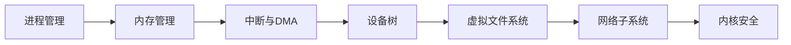

# 03-Linux内核与驱动

[B→M]

---

Linux 内核与驱动 是嵌入式 Linux 知识体系的核心。理解进程调度、内存管理、中断处理、设备驱动模型和网络子系统，是掌握嵌入式系统的必经之路。

---

## <strong>模块概览</strong>

本模块涵盖 Linux 内核的核心子系统：

| 章节 | 主题 | 难度 |
|------|------|------|
| 进程管理 | 调度器、CFS、RT、上下文切换 | [B→I] |
| 内存管理 | MMU、页表、slab、CMA、DMA | [I→E] |
| 中断与DMA | 顶/底半部、MSI、DMA映射 | [B→I] |
| 虚拟文件系统 | VFS、inode、dentry、挂载 | [I→E] |
| 网络子系统 | 协议栈、SKB、Netfilter、socket | [I→E] |
| 设备树 | DTS、资源分配、驱动绑定 | [I] |
| 电源管理 | Runtime PM、DVFS、休眠唤醒 | [E] |
| 内核安全 | SELinux、IMA、seccomp-bpf | [E→M] |

 

---

## <strong>学习路径</strong>

 

---

## <strong>小结</strong>

| 要点 | 内容 |
|------|------|
| 核心目标 | 理解 Linux 内核核心子系统的工作原理 |
| 关键能力 | 阅读内核源码、调试内核问题、编写设备驱动 |
| 前置知识 | C 语言、数据结构、操作系统原理、硬件基础 |

---
