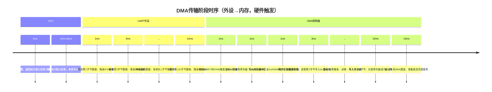

# 4 DMA基础认知

> 📊 **本节难度等级：** <span class="badge-b">**B级**</span>

---

### <strong>DMA：直接内存访问（Direct Memory Access）的简称</strong>

<span class="red">DMA</span>，即直接内存访问（Direct Memory Access），是嵌入式系统中一种“外设与内存之间直接进行数据搬运的硬件机制”
——简单来说，就是不需要CPU全程参与，由专门的硬件（<span class="red">DMA</span>控制器）独立完成“外设寄存器”到“内存缓冲区”或“内存到外设”的数据批量传输。

这里需要先澄清一个入门常见误区：<span class="red">DMA</span>不是“软件功能”，而是“硬件模块”（和CPU、<span class="green">GPIO</span>控制器一样是芯片上的独立硬件），驱动程序的作用只是“配置DMA控制器的工作参数”，真正的数据搬运由硬件自动完成。

为了让定义更直观，我们先看一个没有<span class="red">DMA</span>的“CPU搬运数据”场景（以<span class="green">UART</span>接收1000字节数据为例）：
1.  <span class="green">UART</span>接收1字节数据后，触发中断；
2.  CPU暂停当前工作，进入<span class="red">中断处理</span>函数；
3.  CPU从<span class="green">UART</span>的接收数据寄存器（DR）中读取1字节，写入内存缓冲区；
4.  CPU退出中断，恢复之前的工作；
5.  重复步骤1-4，直到1000字节全部接收完成。

这个过程中，CPU需要被中断1000次，每次都要“暂停-切换上下文-搬运-恢复”，几乎全程被“数据搬运”绑定，根本无法执行其他核心任务（如传感器数据计算、电机控制）。
而<span class="red">DMA</span>的出现就是为了解决这个问题——让DMA控制器代替CPU完成这1000次数据搬运，CPU全程可以专注于自己的核心工作。<br>

### <strong>核心价值：解放CPU，实现“外设-内存”批量数据直传（对比CPU搬运）</strong>

<span class="red">DMA</span>的核心价值可以用“解放CPU、提升系统吞吐量”八个字概括，
具体体现在三个维度，我们通过“<span class="green">UART</span>接收1000字节数据”的场景对比来直观感受：

| 对比维度                | 无DMA（CPU搬运）                          | 有DMA（硬件搬运）                          | 价值体现                     |
|-------------------------|-------------------------------------------|-------------------------------------------|------------------------------|
| CPU参与度               | 全程参与：每字节都需中断+CPU读写           | 仅初始化参与：仅配置DMA参数，不参与搬运    | 解放CPU，可执行其他核心任务  |
| 中断触发次数            | 1000次（每字节触发1次中断）                | 2次（传输开始1次、传输完成1次）            | 减少中断开销，降低CPU负载    |
| 数据传输效率            | 低（上下文切换耗时占比高）                 | 高（硬件直传，无软件上下文切换）           | 提升批量数据传输吞吐量       |
| 适用场景                | 小数据量（如1-4字节的传感器单次采样）      | 大数据量（如UART大报文、SD卡读写、LCD显示）| 适配工业级大数据传输需求     |

为了更清晰展示两者的工作流程差异，我们用流程图对比：

无<span class="red">DMA</span>的CPU搬运流程：

有<span class="red">DMA</span>的硬件搬运流程：

从流程对比可以看出：有<span class="red">DMA</span>时，CPU只在“初始化配置”和“传输完成”两个节点参与，中间1000次数据搬运完全由DMA硬件完成
——这就像工厂里的“流水线”代替“工人手动搬运”，效率提升的核心在于“专业硬件做专业事”。

除了“解放CPU”，<span class="red">DMA</span>还有两个隐藏价值在嵌入式场景中至关重要：
1.  降低系统延迟：
CPU搬运时，若正在执行高优先级任务（如电机控制），会阻塞数据接收，导致数据丢失；而<span class="red">DMA</span>搬运不受CPU任务优先级影响，硬件级别的传输稳定性更高。
2.  简化驱动逻辑：
对于大数据量传输（如SD卡读写1MB文件），若用CPU搬运需要写复杂的循环+中断逻辑；而用<span class="red">DMA</span>只需配置一次参数，等待传输完成即可，驱动代码更简洁。<br>

### <strong>基础类比：快递员（DMA）帮你搬快递（数据），你（CPU）专注工作</strong>

为了让入门者彻底理解<span class="red">DMA</span>的价值，我们用生活中的“搬快递”场景做类比，把抽象的硬件机制转化为具象的生活场景：

| 嵌入式系统中的角色       | 生活场景中的角色       | 工作内容描述                                                                 |
|--------------------------|------------------------|------------------------------------------------------------------------------|
| CPU                      | 你（上班族）           | 核心任务是“处理工作”（如写报告、做分析），搬快递（数据搬运）是“非核心杂活”   |
| 外设（UART/SD卡）        | 快递站                 | 有一批快递（数据）需要送到你家（内存缓冲区）                                 |
| DMA控制器                | 快递员                 | 专门负责“搬快递”的专业人员，不需要你全程陪同，搬完后打电话通知你（触发中断） |
| 内存缓冲区               | 你家的快递柜           | 存放快递（数据）的地方                                                       |

没有<span class="red">DMA</span>的场景：快递站每到1个快递就给你打电话（触发中断），你放下工作去门口取快递（CPU读取数据），然后放到快递柜（写入内存），再回去工作——如此反复1000次，你的工作被彻底打断，效率极低。

有<span class="red">DMA</span>的场景：你早上出门前给快递员（DMA）留个纸条（驱动配置参数），告诉TA“快递站有1000个快递，全部放到我家快递柜（内存地址0x80000000）”，然后你就专心上班（CPU执行核心任务）；快递员搬完所有快递后，给你打一个电话（传输完成中断），你下班回家确认即可——全程你的工作几乎不受影响。

这个类比完美对应<span class="red">DMA</span>的核心逻辑：专业的硬件（快递员）做专业的杂活（数据搬运），让核心硬件（CPU）专注于核心任务。<br>

### <strong>新手常见认知误区澄清（扩充小节，原因：基础认知需规避入门陷阱）</strong>

无 <span class="red">DMA</span><br>
有 <span class="red">DMA</span><br>
考虑到入门者容易对<span class="red">DMA</span>产生误解，这里新增“认知误区”小节，帮助大家建立准确的基础认知：
1.  误区1：<span class="red">DMA</span>可以替代CPU完成所有工作？
    错误。<span class="red">DMA</span>只能做“数据搬运”这一件事，无法执行计算、判断等逻辑（如解析<span class="green">UART</span>报文的协议头）；数据搬运完成后，仍需CPU处理后续逻辑（如通知应用层读取数据）。
2.  误区2：所有场景都需要用<span class="red">DMA</span>？  
    错误。小数据量传输（如读取温湿度传感器的1字节数据）用<span class="red">DMA</span>反而“小题大做”——配置DMA的时间比CPU直接搬运还长，此时CPU直接读取更高效。
3.  误区3：<span class="red">DMA</span>传输不需要CPU参与任何工作？ 
    错误。<span class="red">DMA</span>需要CPU先配置“传输参数”（如源地址、目标地址、传输长度），就像快递员需要你先告诉TA“快递放哪”一样；传输完成后，CPU也需要处理“传输完成中断”（如检查数据是否完整）。<br>

### <strong>DMA控制器：通道（多外设并行传输）、寄存器（地址/长度配置）</strong>

<span class="red">DMA</span>的核心硬件是DMA控制器（DMA Controller），它是一个独立于CPU的“数据搬运专用硬件”，就像工厂里的“智能搬运机器人”
——机器人的“手臂”（通道）负责对接不同设备，“控制面板”（寄存器）负责设定搬运规则。
入门者无需掌握控制器的芯片级电路设计，但必须明确其两个核心功能模块：通道和寄存器。

（1）通道：多外设的“并行搬运通道”
<span class="red">DMA</span>通道是“外设与DMA控制器之间的连接链路”，每个通道对应一个或一组外设（如<span class="green">UART</span>1、SD卡、ADC），
核心作用是实现多外设的并行数据传输——就像快递站的“多条配送路线”，不同路线对应不同小区（外设），可以同时配送（传输数据）而不干扰。

举个STM32F103芯片的<span class="red">DMA</span>通道分配实例（嵌入式入门最常用芯片）：
| DMA控制器 | 通道编号 | 支持的外设（部分）                | 典型应用场景                  |
|-----------|----------|-----------------------------------|-------------------------------|
| DMA1      | 通道0    | ADC1、TIM2_CH3、SPI1_RX           | ADC采样数据传输到内存         |
| DMA1      | 通道1    | SPI1_TX、TIM2_CH4                 | SPI发送数据（内存到外设）     |
| DMA1      | 通道4    | UART1_RX、TIM1_CH1                | UART接收大报文（外设到内存）  |
| DMA1      | 通道5    | UART1_TX、TIM1_CH2                | UART发送大报文（内存到外设）  |
| DMA2      | 通道2    | SDIO（SD卡接口）                  | SD卡读写数据（外设与内存互传）|

从实例可以看出两个关键特性：
1.  通道与外设绑定：
每个通道有固定的“外设对接清单”，不是所有通道都支持任意外设（如<span class="green">UART</span>1_RX只能用<span class="red">DMA</span>1通道4）
——驱动开发时需查芯片手册确认“通道-外设”对应关系，这是入门常踩的坑。
2.  并行传输能力：
<span class="red">DMA</span>1的通道0（ADC传输）和通道4（<span class="green">UART</span>接收）可以同时工作，因为它们是独立的硬件通道
——这就像两条独立的流水线，效率远高于“一条流水线串行处理”。

为了直观展示通道的工作逻辑，用架构图说明：
┌───┐
│ CPU  │
└┬──┘
   │ 配置参数
   ▼
┌───────────────────┐
│         <span class="red">DMA</span>控制器 (DMA1)             │
│  ┌───┐ ┌───┐  ┌───┐   │
│  │ CH0  │ │ CH1  │  │ CH4  │   │
│  │对接  │ │对接  │  │对接  │   │
│  │ADC1  │ │<span class="green">SPI</span>1  │  │UART1 │   │
│  └─┬─┘ └┬──┘  └┬──┘   │
│     │        │          │         │
│     └────┼─────┘         │
│               │                     │
│           ┌─▼─┐                 │
│           │  CTRL│                 │
│           │控制器│                 │
│           │ 核心 │                 │
│           └─┬─┘                 │
└───────┼───────────┘
                │
    ┌─────┼──────┐
    │          │            │
    ▼          ▼            ▼
┌────┐ ┌────┐ ┌────┐
│ BUF0   │ │ BUF1   │ │ BUF4   │
│ 存ADC  │ │ 存<span class="green">SPI</span>  │ │ 存UART │
│ 数据   │ │ 发送   │ │ 接收   │
│        │ │ 数据   │ │ 数据   │
└────┘ └────┘ └────┘
    ▲           ▲           ▲
    │           │           │
    │           │           │
┌─┴─┐   ┌─┴─┐   ┌─┴─┐
│ ADC1 │   │ <span class="green">SPI</span>1 │   │ UART1│
│采样  │   │发送  │   │接收  │
│传感器│   │数据  │   │报文  │
└───┘   └───┘   └───┘

（2）寄存器：<span class="red">DMA</span>的“控制面板”
<span class="red">DMA</span>控制器的所有工作规则（传输方向、地址、长度等）都通过“寄存器”配置——寄存器是芯片上的硬件存储单元，驱动程序通过写入特定数值来“告诉DMA怎么工作”，就像给快递员的“配送单”（写清收件地址、数量、路线）。

入门者无需记忆所有寄存器，只需掌握3类核心寄存器的作用（以STM32F103的<span class="red">DMA</span>通道寄存器为例）：
1.  控制寄存器（如<span class="red">DMA</span>_CCRx）：DMA的“总开关+工作模式配置”，核心配置项包括：
    - 传输方向：外设→内存、内存→外设、内存→内存（如<span class="green">UART</span>接收是“外设→内存”）；
    - 通道使能：开启或关闭当前通道（如写入1开启通道，0关闭）；
    - 中断使能：配置是否在“传输完成”“传输错误”时触发中断（如开启传输完成中断，通知CPU处理数据）。
2.  地址寄存器（如<span class="red">DMA</span>_CPARx、DMA_CMARx）：存储“数据搬运的起点和终点”：
    - 外设地址寄存器（<span class="red">DMA</span>_CPARx）：存外设寄存器地址（如<span class="green">UART</span>1的接收数据寄存器地址0x40013804）；
    - 内存地址寄存器（<span class="red">DMA</span>_CMARx）：存内存缓冲区地址（如0x20000000，SRAM中的一块区域）。
3.  长度寄存器（如<span class="red">DMA</span>_CNDTRx）：存储“需要搬运的数据长度”（单位：字节或半字），如写入1000表示需要传输1000字节数据——传输过程中该寄存器会自动减1，减到0时表示传输完成。

举个“<span class="green">UART</span>1接收1000字节数据”的寄存器配置实例：
| 寄存器         | 配置值                  | 含义说明                                  |
|----------------|-------------------------|-------------------------------------------|
| DMA_CCR4       | 0x0000002C              | 外设→内存、开启中断、使能通道            |
| DMA_CPAR4      | 0x40013804              | 外设地址：UART1的接收数据寄存器（DR）地址 |
| DMA_CMAR4      | 0x20000000              | 内存地址：SRAM中的缓冲区地址              |
| DMA_CNDTR4     | 0x000003E8              | 传输长度：1000字节（十六进制0x3E8=1000）  |<br>

### <strong>传输三要素：源地址（外设寄存器）、目标地址（内存缓冲区）、传输长度</strong>

<span class="red">DMA</span>的所有数据传输都离不开“源地址、目标地址、传输长度”这三个核心参数
——这就像快递配送的“起点、终点、包裹数量”，缺少任何一个都无法完成搬运。
入门者必须明确每个要素的“具体含义”和“实战中如何确定”。

（1）三要素的核心定义与实战确定方法
| 要素         | 核心定义                       | 实战确定方法（以STM32F103为例）                         | 实例（UART接收场景）          
|--------------|--------------------------------|---------------------------------------------------------|----------------------------------
| 源地址       | 数据搬运的“起点地址”，       | 1. 外设地址：查芯片手册的“外设寄存器映射表”；         | 源地址=UART1_DR地址（0x40013804） 
|              | 可以是外设寄存器地址或内存地址 | 2. 内存地址：驱动中分配的缓冲区地址                     |
| 目标地址     | 数据搬运的“终点地址”，       | 同“源地址”确定方法，需注意传输方向                    | 目标地址=SRAM缓冲区地址（0x20000000） |
|              | 同源地址，支持外设或内存       | （如外设→内存时，目标是内存）                          |
| 传输长度     | 需要搬运的数据总字节数         | 1. 固定长度：如传感器每次采样4字节；                    | 传输长度=1000字节（大报文长度） |
|              |（或半字、字，由配置决定）      | 2. 动态长度：如UART报文长度由协议头指定 

这里需要澄清两个入门常见误区：
- 误区1：源地址和目标地址必须一个是外设、一个是内存？
  错误。<span class="red">DMA</span>支持“内存→内存”传输（如将SRAM中的数据复制到另一个SRAM区域），此时源地址和目标地址都是内存地址——这种场景常用于数据快速复制（如LCD显示时复制帧缓冲区）。
- 误区2：传输长度必须是固定值？
  错误。动态长度场景可通过“中断+重新配置长度”实现，如<span class="green">UART</span>接收时，先配置长度为1000字节，传输完成后若还有数据，重新写入新的长度继续传输。

（2）传输方向与三要素的关联
传输方向直接决定“源地址和目标地址的类型”，嵌入式场景中主要有三种方向，对应不同的三要素配置：
1.  外设→内存（最常用）：如<span class="green">UART</span>接收、ADC采样、SD卡读取——源地址是外设寄存器，目标地址是内存缓冲区；
2.  内存→外设（次常用）：如UART发送、<span class="green">SPI</span>发送、LCD显示——源地址是内存缓冲区，目标地址是外设寄存器；
3.  内存→内存（特殊场景）：如数据复制、缓冲区备份——源地址和目标地址都是内存地址。

用表格总结方向与三要素的关联：
| 传输方向       | 源地址类型       | 目标地址类型     | 典型场景                  |
|----------------|------------------|------------------|---------------------------|
| 外设→内存      | 外设寄存器地址   | 内存缓冲区地址   | UART接收大报文、ADC采样   |
| 内存→外设      | 内存缓冲区地址   | 外设寄存器地址   | UART发送大报文、LCD显示   |
| 内存→内存      | 源内存缓冲区地址 | 目标内存缓冲区地址 | 数据快速复制、帧缓冲区备份 |<br>

### <strong>传输触发方式：软件触发（驱动启动）、硬件触发（外设事件）</strong>

<span class="red">DMA</span>的传输不会“自动开始”，需要通过“触发信号”启动
——就像快递员需要“收到配送指令”才会开始工作，触发信号就是<span class="red">DMA</span>的“配送指令”。
嵌入式场景中主要有两种触发方式，分别适配不同的传输需求。

（1）软件触发：驱动主动“下令”启动传输
软件触发是指驱动程序通过写入寄存器（如设置<span class="red">DMA</span>_CCRx的使能位）主动启动DMA传输，核心特点是“按需启动”，由软件控制传输的开始时机——就像你打电话叫快递员上门取件，什么时候打电话（启动传输）由你决定。

核心特性与适用场景
- 触发方式：驱动调用API（如STM32 HAL库的`HAL_<span class="red">DMA</span>_Start()`）或直接写入寄存器，设置“通道使能”位为1，DMA立即开始传输；
- 传输特点：触发一次，传输一次（传输长度减到0后自动停止，需重新触发才会再次传输）；
- 适用场景：单次、固定长度的传输（如传感器单次采样4字节数据，驱动触发一次传输即可）。

软件触发流程（以传感器采样为例）
←如图左一

（2）硬件触发：外设“主动请求”启动传输
硬件触发是指由外设的特定事件（如<span class="green">UART</span>收到数据、ADC采样完成）自动触发<span class="red">DMA</span>传输，核心特点是“外设驱动传输”，无需软件持续干预——就像快递站有了“自动取件机”，快递到了（外设事件）自动通知快递员取件（触发DMA），不用你每次打电话。

核心特性与适用场景
- 触发方式：先在<span class="red">DMA</span>控制器中配置“触发源”（如将DMA1通道4的触发源设为<span class="green">UART</span>1_RX），当UART1收到数据时，会自动发送触发信号给DMA，启动传输；
- 传输特点：只要外设持续产生事件，<span class="red">DMA</span>会重复传输（直到传输长度减到0或通道被禁用）；
- 适用场景：连续、动态的传输（如<span class="green">UART</span>持续接收大报文，每收到1字节就触发<span class="red">DMA</span>搬运，无需软件干预）。

硬件触发关键前提
硬件触发需要满足两个前提，否则无法正常工作（入门高频踩坑点）：
1.  <span class="red">DMA</span>通道与触发源绑定：不是所有通道都支持任意外设的触发源（如STM32F103的<span class="green">UART</span>1_RX只能触发DMA1通道4），需查芯片手册的“DMA触发源映射表”；
2.  外设事件使能：外设需要开启“触发<span class="red">DMA</span>”的功能（如<span class="green">UART</span>需设置“RXNE触发DMA”位，确保收到数据后发送触发信号）。

硬件触发流程（以<span class="green">UART</span>接收为例）
←如图左二

（3）两种触发方式的对比与实战选择
| 对比维度       | 软件触发                          | 硬件触发                          | 实战选择建议                          |
|----------------|-----------------------------------|-----------------------------------|---------------------------------------|
| 触发时机控制   | 软件主动控制（驱动决定何时启动）  | 外设事件控制（硬件自动触发）      | 单次传输用软件触发，连续传输用硬件触发 |
| 配置复杂度     | 低（只需配置三要素+使能通道）    | 高（需配置触发源+外设事件使能）  | 简单场景用软件触发，复杂连续传输用硬件触发 |
| 传输效率       | 低（软件触发有延迟）              | 高（硬件触发无软件延迟）          | 高实时性场景（如工业串口通信）用硬件触发 |
| 典型应用       | 传感器单次采样、LCD单帧更新       | UART连续接收、SD卡持续读写、ADC连续采样 | 按传输的“连续性”和“实时性”需求选择 |<br>

### <strong>DMA的工作流程本质是“驱动配置参数→DMA硬件执行→CPU收尾处理”的线性链路，无论复杂场景（如内存到内存批量复制）还是简单场景（如UART接收数据），核心都离不开“配置、传输、完成”三个阶段。
为了让入门者快速掌握，我们以嵌入式最常用的“<span class="green">UART</span>接收100字节数据（外设→内存，硬件触发）”为实战场景，拆解每个阶段的具体动作、角色分工和关键注意点。</strong>


### <strong>配置：驱动设置DMA传输参数（地址、长度、方向）</strong>

配置阶段是“<span class="red">DMA</span>工作的前置准备”，核心由驱动程序完成
——就像快递员出发前，你（驱动）必须告诉TA“取件地址（源地址）、送货地址（目标地址）、取件数量（传输长度）、触发取件的条件（触发方式）”。

这一阶段CPU全程参与，但动作简单且一次性完成，不占用过多资源。

核心配置动作（以STM32F103 <span class="green">UART</span>1接收为例）
配置阶段需完成4个关键动作，每个动作都对应“<span class="red">DMA</span>核心组成要素”的落地，入门者可通过“要素→动作”的对应关系记忆：
1. 选通道
- 查手册确认 <span class="green">UART</span>1_RX 对应 <span class="red">DMA</span>1 通道4，驱动指定该通道。
2. 设三要素
- 源地址：<span class="green">UART</span>1 数据寄存器（外设）
- 目标地址：SRAM 缓冲区（内存）
- 传输长度：100 字节
3. 配模式
- 方向：外设 → 内存
- 触发：硬件触发（<span class="green">UART</span> 接收事件）
- 中断：传输完成中断使能
4. 启触发
- 配置 <span class="green">UART</span>1 控制寄存器，使能 RXNE 触发 <span class="red">DMA</span>。
关键寄存器速查
- 源地址：`<span class="green">UART</span>1_DR` (0x40013804)
- 目标地址：`SRAM_BUF` (0x20000000)
- 长度：`0x64`
- 通道：<span class="red">DMA</span>1_CH4

配置阶段的关键注意点
1.  通道与外设必须匹配：这是入门最常踩的坑
——若给<span class="green">UART</span>1_RX配置<span class="red">DMA</span>1通道0（实际对应ADC1），即使其他参数正确，DMA也无法响应UART的触发信号，需提前查芯片手册的“DMA通道-外设映射表”；
2.  地址必须是物理地址：<span class="red">DMA</span>直接操作硬件，使用的是“物理地址”（如0x40013804），而非Linux内核的“虚拟地址”
——驱动中需通过`<span class="green">ioremap</span>`将物理地址映射为虚拟地址后再配置（后续驱动章节会详细讲，此处仅明确“地址类型”）；
3.  传输长度需留冗余：
若<span class="green">UART</span>实际接收100字节，配置长度时建议设为128字节（而非刚好100），避免因报文长度波动导致“传输未完成就停止”，后续可通过软件判断实际接收长度。<br>

### <strong>传输：DMA控制器独立完成数据搬运（CPU空闲）</strong>

传输阶段是<span class="red">DMA</span>的“核心工作环节”，由DMA控制器独立执行，CPU在此阶段可完全脱离，专注于自己的核心任务（如传感器数据计算、电机控制）——这就像快递员收到指令后，全程自主取件、送货，你（CPU）不用再干预，安心做自己的工作。

传输阶段的动态过程（<span class="green">UART</span>接收100字节场景）
结合时序图，我们拆解传输阶段的每一步动作，明确<span class="red">DMA</span>、<span class="green">UART</span>、CPU的角色分工：


从时序图可看出传输阶段的3个核心特性：
1.  <span class="red">DMA</span>自主工作：
一旦收到<span class="green">UART</span>的触发信号，<span class="red">DMA</span>会自动执行“读外设→写内存→长度减1”的闭环操作，无需CPU发任何指令；
2.  CPU完全空闲：
传输的10ms内，CPU一直在执行核心任务（电机控制），未被中断或阻塞——这是<span class="red">DMA</span>“解放CPU”价值的直接体现；
3.  触发信号与传输同步：
硬件触发场景下，<span class="red">DMA</span>传输与外设事件（<span class="green">UART</span>收数据）完全同步，每收到1字节就触发一次小传输，避免数据积压在UART的FIFO中导致溢出。

传输阶段的常见疑问解答
- 疑问1：传输过程中CPU能干预吗？
  可以。若CPU有紧急任务（如紧急停机），可通过写入<span class="red">DMA</span>控制寄存器的“通道禁用”位，强制停止DMA传输——但实战中尽量避免中途干预，以免导致数据不完整。
- 疑问2：<span class="red">DMA</span>传输数据会出错吗？
  可能。常见错误有“地址越界”（内存缓冲区太小）、“传输超时”（外设未及时发数据），此时<span class="red">DMA</span>会触发“传输错误中断”，通知CPU处理（如打印错误日志、重新配置）。
- 疑问3：内存→内存传输的流程和这一样吗？
  类似。区别是“触发方式”常用软件触发（驱动主动启动），且传输时无需外设参与，<span class="red">DMA</span>直接从源内存地址读取数据写入目标内存地址。<br>

### <strong>完成：DMA发送传输状态信号（后续与中断协同的关键）</strong>

传输阶段结束后，<span class="red">DMA</span>不会“默默完成”，而是通过“信号通知”让CPU参与“收尾工作”
——就像快递员送完所有快递后，给你打个电话（触发中断），告诉你“快递已放快递柜，请来确认”。

这一阶段CPU重新参与，但仅做“非数据搬运”的收尾动作，开销极小。

完成阶段的核心动作（三步闭环）
1.  <span class="red">DMA</span>触发状态信号：当传输长度寄存器减至0（100字节传输完成），DMA会自动做三件事：  
    - 关闭当前<span class="red">DMA</span>通道（避免重复传输）；  
    - 置位“传输完成标志位”（寄存器状态位，供驱动查询）；  
    - 若配置了“传输完成中断”，则向CPU发送中断请求。
2.  CPU处理中断（核心收尾）：CPU收到中断请求后，暂停当前任务，进入“DMA传输完成<span class="red">中断处理</span>函数”，执行3类典型收尾动作：  
    - 状态校验：读取<span class="red">DMA</span>状态寄存器，确认是“传输完成”还是“传输错误”（避免误处理错误场景）；  
    - 数据处理：通知应用层“数据已接收完成”，或直接在驱动中做简单校验（如检查<span class="green">UART</span>报文的帧头/帧尾）；  
    - 准备下次传输：若需要持续接收数据（如工业串口通信），重新配置<span class="red">DMA</span>传输长度，开启通道等待下一次触发。
3.  CPU恢复核心任务：<span class="red">中断处理</span>完成后，CPU退出中断函数，继续执行之前的核心任务（如电机控制），DMA回到“待机状态”，等待下一次配置。

完成阶段与中断的协同关系（入门重点）
入门者常疑惑“<span class="red">DMA</span>完成后为什么要触发中断？”——核心原因是“CPU无法实时监控DMA状态”：  
- 若不触发中断，CPU需通过“轮询”（反复读取<span class="red">DMA</span>状态寄存器）确认传输是否完成，这会占用CPU资源（类似“每隔1分钟给快递员打电话问进度”）；  
- 触发中断时，CPU“按需处理”，只有收到通知才参与，完全不占用额外资源（类似“快递员主动打电话”）。  

因此，“<span class="red">DMA</span>传输+中断通知”是嵌入式场景的“黄金组合”：DMA负责“高效搬运”，中断负责“精准通知”，二者协同实现“低CPU开销+高传输效率”。

完成阶段的实战验证（入门调试技巧）
传输完成后，可通过两个简单方法验证流程是否正常（开发板端操作）：  
1.  读取<span class="red">DMA</span>状态寄存器：通过`devmem`命令读取DMA状态寄存器，确认“传输完成标志位”是否置1（以STM32F103 DMA1状态寄存器为例）：  
    ```bash
    # 读取DMA1状态寄存器（地址0x40020008）
    devmem 0x40020008 32
    # 若返回值的第12位为1（对应通道4完成），表示传输完成
    ```
2.  查看内存缓冲区数据：通过`devmem`命令读取目标内存缓冲区，确认数据是否正确接收：  
    ```bash
    # 读取内存地址0x20000000开始的100字节数据
    devmem 0x20000000 32  # 读取前4字节，对应UART接收的前4个字符
    ```<br>

### <strong>实战小案例：一句话总结“UART接收100字节”全流程</strong>

为了让入门者形成完整认知，我们用“一句话串联三阶段”，对应实际开发中的逻辑：  
“驱动程序给<span class="red">DMA</span>1通道4配置参数（<span class="green">UART</span>1_RX地址0x40013804、内存地址0x20000000、长度100字节、硬件触发），UART收到数据后触发DMA自主搬运，100字节传完后DMA触发中断，CPU在中断函数中校验数据并通知应用层，随后恢复电机控制任务。”<br>

---
