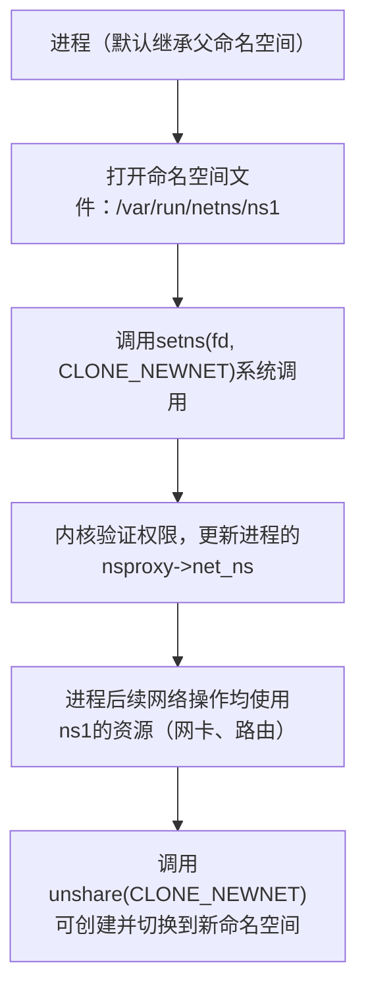

# 网络命名空间：资源隔离的实现

> 📊 **本节难度等级：** <span class="badge-i">**I级**</span>

---

### <strong>网络命名空间是Linux内核提供的“网络资源虚拟化”机制，通过为进程分配独立的网络命名空间，使其拥有专属的网络设备、路由表、端口号等资源，不同命名空间的网络环境完全隔离（如同运行在独立的网络栈中）。
嵌入式场景中，常用于容器（如Docker轻量容器）、虚拟化（如KVM虚拟机）及多租户网关设备。</strong>


### <strong>1. 核心作用：容器、虚拟化场景的网络环境隔离</strong>

命名空间的核心价值是“隔离而不独占”，在嵌入式有限资源下实现多场景网络独立，典型应用场景：
- 容器隔离：
物联网网关中运行多个容器（如数据采集容器、边缘计算容器），每个容器分配独立命名空间，避免端口冲突（如两个容器都可使用8080端口），且一个容器的网络故障不影响其他容器；
- 多租户隔离：
工业网关为不同客户的设备提供接入服务，通过命名空间隔离不同客户的路由表与防火墙规则，确保客户间网络数据不可见；
- 测试环境隔离：
驱动开发时，在独立命名空间中测试网卡驱动，避免影响主机网络（如测试断网重连逻辑时，主机仍可正常联网）。<br>

### <strong>2. 基础操作：ip netns命令创建与管理命名空间</strong>

`ip netns`是用户层管理网络命名空间的核心命令，从创建到销毁的完整操作流程如下（以嵌入式Ubuntu系统为例）：

（1）命名空间创建与基础操作
```bash
# 1. 创建命名空间（命名为ns1，嵌入式场景建议按功能命名如ns_camera/ns_gateway）
ip netns add ns1
# 验证：查看所有命名空间
ip netns list
# 预期输出：ns1

# 2. 进入命名空间执行命令（查看ns1的网络设备，默认只有lo回环设备）
ip netns exec ns1 ip link show
# 预期输出：1: lo: <LOOPBACK> mtu 65536 qdisc noop state DOWN mode DEFAULT group default qlen 1000
#           link/loopback 00:00:00:00:00:00 brd 00:00:00:00:00:00

# 3. 启动命名空间的lo设备（回环设备默认未启用）
ip netns exec ns1 ip link set lo up
# 验证：查看lo状态
ip netns exec ns1 ip link show lo
# 预期输出：1: lo: <LOOPBACK,UP,LOWER_UP> mtu 65536 qdisc noqueue state UNKNOWN mode DEFAULT group default qlen 1000

# 4. 销毁命名空间（不再使用时释放资源，嵌入式小内存场景必做）
ip netns delete ns1
ip netns list  # 无输出，确认销毁
```

（2）跨命名空间网络通信（嵌入式常用场景）
嵌入式场景中，常需“主机与命名空间”或“两个命名空间”通信，需通过`veth`虚拟网卡（成对出现，类似网线连接两个命名空间）实现：
```bash
# 1. 创建veth对（veth0和veth1，成对绑定）
ip link add veth0 type veth peer name veth1

# 2. 将veth1移入ns1命名空间
ip link set veth1 netns ns1

# 3. 为两个veth网卡配置IP（同一网段）
ip addr add 192.168.100.1/24 dev veth0
ip netns exec ns1 ip addr add 192.168.100.2/24 dev veth1

# 4. 启动两个veth网卡
ip link set veth0 up
ip netns exec ns1 ip link set veth1 up

# 5. 测试通信（主机ping命名空间内的veth1）
ping 192.168.100.2 -c 2
# 预期输出：
# 64 bytes from 192.168.100.2: icmp_seq=1 ttl=64 time=0.123 ms
# 64 bytes from 192.168.100.2: icmp_seq=2 ttl=64 time=0.156 ms

# 6. 查看命名空间路由表（验证独立路由）
ip netns exec ns1 ip route
# 预期输出：192.168.100.0/24 dev veth1 proto kernel scope link src 192.168.100.2
```<br>

### <strong>3. 内核原理：struct net的数据结构与命名空间切换机制</strong>

命名空间的内核实现核心是`struct net`结构体（定义于`include/linux/net.h`），
每个命名空间对应一个`struct net`实例，存储该命名空间的所有网络资源。

（1）核心数据结构：struct net关键字段
`struct net`是网络命名空间的“资源容器”，关键字段如下（嵌入式开发需关注前4项）：
| 字段名               | 类型                  | 核心作用                                                                 |
|----------------------|-----------------------|--------------------------------------------------------------------------|
| `dev_base_head`      | `struct list_head`    | 网络设备链表（该命名空间的所有网卡，如lo、veth1）                        |
| `rt_tables`          | `struct rt_table *[]` | 路由表数组（每个协议族对应一张路由表，如IPv4对应rt_tables[AF_INET]）     |
| `nsproxy`            | `struct nsproxy *`    | 关联的命名空间代理（与进程的命名空间管理关联）                           |
| `nsid`               | `int`                 | 命名空间唯一ID（用户层通过`ip netns`命令查询的ID对应此字段）             |
| `netns_count`        | `atomic_t`            | 引用计数（记录使用该命名空间的进程数，为0时可销毁）                     |

- 代码片段（内核中获取当前进程的命名空间）：
  ```c
  #include <linux/net.h>
  #include <linux/sched.h>
  
  // 获取当前进程的网络命名空间
  struct net *current_net = current->nsproxy->net_ns;
  // 遍历该命名空间的网络设备
  struct net_device *dev;
  list_for_each_entry(dev, &current_net->dev_base_head, dev_list) {
      printk(KERN_INFO "netns device: %s\n", dev->name); // 打印设备名如lo、veth1
  }
  ```

（2）命名空间切换机制
进程默认继承父进程的命名空间，通过`setns()`系统调用可切换到指定命名空间，核心流程如下：


- 嵌入式验证：通过`ps`查看进程命名空间ID，确认切换效果：
  ```bash
  # 1. 查看当前shell进程的命名空间ID（net字段）
  ps -o pid,netns $$
  # 预期输出：  PID NETNS
  #        1234 4026531957（默认命名空间ID）
  
  # 2. 进入ns1命名空间并查看ID
  ip netns exec ns1 bash
  ps -o pid,netns $$
  # 预期输出：  PID NETNS
  #        1235 4026532000（ns1命名空间ID，与默认不同）
  ```<br>

---
