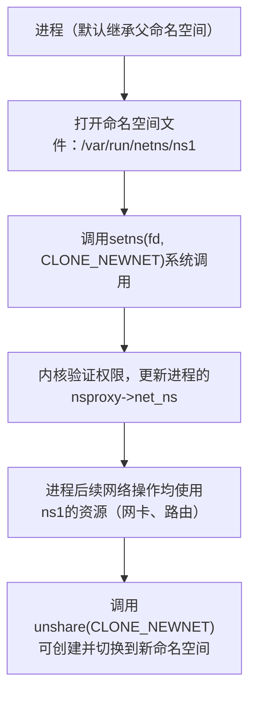

# 网络子系统

> 📊 **本章难度等级：** <span class="badge-i">**I级**</span>

---

### <strong>核心定位：内核网络子系统的功能与架构角色</strong>

要理解Linux内核网络子系统，我们可以先建立一个通俗认知：
它是内核中专门负责“网络数据收发与处理”的“中枢系统”——就像嵌入式设备的“网络管家”，
既要对接硬件层面的网卡（接收/发送电信号），又要解析上层应用的网络请求（比如APP要发一个MQTT消息），
还要完成从物理信号到应用数据的“翻译”和“转运”工作。

从架构角色上看，内核网络子系统是连接“硬件层网络设备”与“用户层网络应用”的唯一桥梁，核心承担三大功能：  
1.  协议解析与封装：这是最核心的功能。
网络数据在传输时会按“协议栈”（比如以太网→IP→TCP→HTTP）层层封装成“数据包”，接收时则反向层层解封装。
内核网络子系统就是这个“封装/解封装”的执行者——比如用户层用`ping`命令发送ICMP请求时，内核会自动把请求数据封装成IP包+ICMP头+以太网帧；接收对端回复时，再剥去各层头部，把核心数据交给`ping`命令。  
2.  数据转发与路由：
当设备需要和“非直连设备”通信时（比如开发板要访问互联网），内核会根据“路由表”判断数据该发给哪个“网关”。
即使是嵌入式场景中常见的“直连通信”（比如开发板和PC通过网线直连），内核也会完成“从网卡到应用”的最终转发。  
3.  硬件与应用的适配：
内核通过“网络设备驱动”对接物理网卡（如DM9000、RTL8188），
把硬件的“电信号”转换成内核能处理的“数据结构”（后续会讲的sk_buff）；
同时通过“socket接口”（首次术语：一种用户层与内核层交互的网络通信接口，是应用访问网络的“入口”）向用户层提供标准化调用，让APP不用关心硬件细节就能实现联网。

对嵌入式设备而言，这个“中枢系统”的存在让“轻量化联网”成为可能
——比如一个工业传感器只需搭载精简的内核网络子系统，就能通过TCP把温度数据传到上位机，无需像服务器一样搭载复杂的网络软件栈。<br>

### <strong>嵌入式场景价值：连接外设、边缘通信、工业互联的核心支撑</strong>

内核网络子系统不是“通用计算机的专属”，
而是嵌入式设备实现“联网能力”的核心基础，其价值在三大典型场景中尤为突出：  
1.  工业控制场景：设备间的可靠通信枢纽 
   工业现场中，嵌入式PLC（可编程逻辑控制器）需要通过以太网与变频器、传感器、触摸屏通信，而这一切都依赖内核网络子系统的支撑。比如采用EtherCAT协议的工业设备，内核网络子系统会对接EtherCAT网卡驱动，解析实时控制指令，确保电机转速调整、传感器数据采集等操作的实时性（延迟通常要求毫秒级）。
没有这个子系统，PLC只能单机运行，无法接入工业互联网络。  

2.  边缘计算场景：数据上传与指令接收的桥梁 
    边缘AI设备（如带NPU的摄像头）需要把本地识别的人脸数据上传到云端服务器，同时接收云端的“识别规则更新”指令
——内核网络子系统会处理4G/5G模块的驱动交互，通过MQTT（轻量级物联网协议）完成数据的低功耗传输。
由于嵌入式设备内存有限，内核网络子系统的“精简特性”（如支持裁剪不必要的协议）能避免内存占用过高，这是通用操作系统网络栈无法替代的。  
3.  消费电子场景：轻量化联网的核心保障
    智能手环、智能家居控制器等设备，需要通过WiFi或蓝牙与手机APP通信（如手环同步运动数据到手机）。
内核网络子系统会对接蓝牙/WiFi模块驱动，解析BLE（蓝牙低功耗）协议数据，在保证低功耗的同时完成数据收发
——这类场景下，子系统的“低资源占用”比“高吞吐量”更重要，而Linux内核网络子系统的可裁剪性恰好满足这一需求。

简单说：
没有内核网络子系统，嵌入式设备就只能是“孤立的硬件”，无法实现与其他设备、云端的交互，也就失去了“智能联网”的核心能力。<br>

### <strong>与用户层/硬件层的交互边界（内核态-用户态数据流转）</strong>

内核网络子系统的核心作用之一，是明确“硬件层→内核层→用户层”的数据流边界，确保数据在不同层级间有序流转。
我们可以通过“开发板ping通PC”的过程，直观理解三层交互逻辑：

1. 三层交互架构与数据流转流程
三层交互的核心边界是“内核态与用户态的隔离”

具体流转流程如下：<br>

### <strong>核心组件概览：从硬件到协议的全链路组成</strong>

Linux内核网络子系统的全链路工作流程，本质是“三大核心组件”协同的过程
——网络设备负责“数据的物理收发”，协议栈负责“数据的层级封装/解封装”，核心机制负责“数据的高效流转与控制”。
这三者就像嵌入式设备的“网络流水线”：网卡（设备）把原料（电信号）送进来，协议栈（流水线工序）把原料加工成“成品”（应用可识别的数据），sk_buff/Netfilter（传送带与质检站）确保加工过程高效且合规。

我们先通过一个可视化架构图明确三者的层级关系与协同逻辑：<br>

### <strong>网络设备（物理网卡/虚拟网卡）：数据的“出入口”</strong>

网络设备是内核网络子系统与“外部网络”的连接点，分为物理网卡和虚拟网卡两类，嵌入式场景中两者都有高频应用：
1.  物理网卡：真实的硬件通信接口 
    物理网卡是插在开发板上的硬件模块（如工业场景常用的DM9000以太网芯片、消费电子常用的RTL8188 WiFi模块），
核心作用是“将电信号/无线信号与二进制数据相互转换”
——接收数据时，把网线传来的电信号转换成内核能处理的二进制数据；
——发送数据时，把内核输出的二进制数据转换成电信号通过网线发送。  

    对内核而言，物理网卡必须通过“网络设备驱动”才能被识别（类似打印机需要装驱动才能用）。
嵌入式开发中，我们常通过`ls /sys/class/net`命令查看已识别的物理网卡，通常命名为`eth0`（以太网）、`wlan0`（WiFi）；
通过`ethtool eth0`命令查看网卡状态（如链路是否连通、速率是100Mbps还是1000Mbps）。

2.  虚拟网卡：内核模拟的“逻辑通信接口” 
    虚拟网卡没有真实的硬件模块，是内核通过软件模拟出来的网络设备，核心用于“设备内部或虚拟化场景的通信”。
嵌入式场景中最常见的虚拟网卡有两种：  
    - `lo`（回环网卡）：默认存在的虚拟网卡，IP地址固定为`127.0.0.1`，用于“本地进程间通信”
——比如开发板上的MQTT客户端程序要测试与本地的MQTT服务器通信，数据会通过`lo`网卡流转，无需真实硬件；  
    - `docker0`（容器网桥）：当开发板运行Docker容器时，内核会创建`docker0`虚拟网卡，用于“容器与宿主机的通信”
——比如容器中的应用要访问开发板本地的数据库，数据会通过`docker0`完成流转。 
 
    虚拟网卡的操作与物理网卡一致，比如通过`ip link set lo up`激活回环网卡，通过`ping 127.0.0.1`验证其可用性（几乎所有嵌入式设备都会通过这个命令测试本地网络栈是否正常）。<br>

### <strong>协议栈（L2-L4）：数据的“加工流水线”</strong>

协议栈是网络子系统的“核心加工单元”，遵循OSI七层模型的L2（数据链路层）到L4（传输层）规范，
嵌入式场景中会根据需求裁剪为“轻量协议栈”。
我们可以把协议栈理解为“多层级的包装工厂”，数据发送时层层“包装”（封装），接收时层层“拆包”（解封装）：

1.  L2（数据链路层）：链路封装与硬件适配
    紧邻硬件的层级，核心作用是“将网络层数据封装成适配硬件传输的帧”，并处理“硬件地址相关的逻辑”。
嵌入式场景中最常用的L2协议是以太网（对应`eth0`网卡）和CAN-FD（工业场景的总线协议）。  
    以以太网为例，L2层会给网络层传来的IP包添加“以太网帧头”，包含源MAC地址（发送方网卡的物理地址，如`00:11:22:33:44:55`）和目标MAC地址（接收方网卡的物理地址）——这就像给包裹贴“快递面单”，明确硬件层面的收发方。
通过`tcpdump -i eth0 -e`命令可以抓取以太网帧，直观看到MAC地址信息。

2.  L3（网络层）：地址定位与路由转发 
    核心作用是“通过IP地址定位目标设备”，并决定数据的传输路径（路由）。
嵌入式场景中最核心的L3协议是IP（IPv4为主，IPv6逐步普及）和ICMP（网络诊断协议，`ping`命令的底层依赖）。  
    IP协议会给传输层数据添加“IP头”，包含源IP地址（如开发板的`192.168.1.100`）和目标IP地址（如PC的`192.168.1.101`）；ICMP协议则用于“网络连通性检测”，当`ping`目标IP时，会发送ICMP请求包，目标设备回复ICMP应答包，以此判断链路是否通畅。
通过`ip route`命令可以查看嵌入式设备的路由表，内核会根据路由表中的规则（如“访问192.168.1.0网段直接通过eth0发送”）转发数据。

3.  L4（传输层）：通信质量与端口映射  
    核心作用是“为应用提供可靠/高效的通信服务”，并通过“端口号”区分不同应用的网络请求。
嵌入式场景中最常用的L4协议是UDP和TCP：  
    - UDP（用户数据报协议）：轻量、高效，无可靠性保障，适合“实时性要求高、数据可丢失”的场景（如工业传感器的实时数据传输、WiFi音箱的音频流）；  
    - TCP（传输控制协议）：可靠、有序，通过“三次握手”建立连接、“重传机制”保障数据不丢失，适合“可靠性要求高”的场景（如嵌入式设备的OTA升级、数据上传到云端）。  
    端口号是传输层的“应用标识”，比如MQTT服务器默认用1883端口，HTTP服务器默认用80端口，内核通过端口号把数据交给对应的应用——比如收到目标端口为1883的TCP数据时，会自动转发给MQTT客户端程序。
通过`netstat -tuln`命令可以查看嵌入式设备的端口监听状态。<br>

### <strong>核心机制（sk_buff、Netfilter）：数据的“流转与控制中心”</strong>

如果说网络设备是“出入口”、协议栈是“流水线”，那核心机制就是“传送带与质检站”
——sk_buff负责数据在各组件间的“高效流转”，Netfilter负责数据的“过滤与控制”：

1.  sk_buff：网络数据的“万能容器” 
    首次术语：sk_buff（socket buffer，套接字缓冲区）是内核网络子系统中用于存储网络数据的核心数据结构，所有网络数据（从网卡接收的原始数据到协议栈处理后的应用数据）都以sk_buff的形式流转。  
    为什么需要sk_buff？因为网络数据在协议栈中需要层层添加/删除头部（如L2加帧头、L3加IP头），如果每次都重新分配内存存储数据，会产生大量内存碎片且效率极低。
    sk_buff通过“缓冲区复用”和“指针偏移”机制解决这个问题：比如接收数据时，内核分配一个sk_buff存储原始数据，L2层解封装时只需移动指针跳过帧头，无需拷贝数据；L3层解封装时再移动指针跳过IP头，直到把应用数据交给用户层。  
    嵌入式场景中，我们常通过内核配置（如`CONFIG_SKBUFF_MEMPOOL`）优化sk_buff的内存分配，避免小内存设备出现内存溢出。

2.  Netfilter：网络数据的“质检与控制站” 
    首次术语：Netfilter是内核网络子系统中的包过滤框架，通过在协议栈的关键节点设置“钩子函数”，实现对网络数据的过滤、修改、转发等控制（如防火墙、端口映射功能都基于Netfilter实现）。  
    嵌入式场景中，Netfilter最典型的应用是“访问控制”
——比如通过`iptables`命令配置规则“禁止外部设备访问开发板的22端口（SSH端口）”，内核会在Netfilter的INPUT钩子点拦截目标端口为22的数据包并丢弃；
再比如工业场景中配置规则“只允许上位机IP访问开发板的502端口（Modbus协议端口）”，保障工业控制的安全性。  

    对入门者而言，无需深入Netfilter的钩子实现，只需知道`iptables`命令是操作Netfilter的工具，通过它可以配置嵌入式设备的网络访问规则。<br>

### <strong>嵌入式简化特性：无复杂路由、轻量协议栈的裁剪逻辑</strong>

服务器场景的内核网络子系统需要支持复杂的路由协议（如BGP、OSPF）、多协议栈（IPv4/IPv6双栈）和海量连接，
但嵌入式设备的内存（通常几十MB到几百MB）和算力有限，必须对网络子系统进行“轻量化裁剪”，核心简化方向有两个：
1.  裁剪非必要组件，保留核心功能  
    嵌入式内核编译时，通过Kconfig（内核配置工具）关闭不需要的网络组件：  
    - 路由简化：关闭“动态路由协议”（如`CONFIG_IP_ROUTE_MULTIPATH`），只保留静态路由（通过`ip route add`手动配置）；  
    - 协议栈简化：不需要IPv6时关闭`CONFIG_IPV6`，不需要TCP时关闭`CONFIG_TCP`，只保留UDP和ICMP；  
    - 设备简化：不需要WiFi时关闭`CONFIG_WLAN`，只保留以太网驱动。  
    以常见的“传感器数据采集设备”为例，裁剪后的网络子系统只包含“eth0物理网卡+L2以太网+L3 IP/ICMP+L4 UDP+基础sk_buff”，内存占用可控制在几MB以内。

2.  替换通用组件为嵌入式专用方案 
    对需要“极致轻量化”的场景（如物联网传感器），会用嵌入式专用协议替换通用协议：比如用MQTT（消息队列遥测传输）替换HTTP（超文本传输协议）——MQTT的数据包头部仅2字节，HTTP头部通常几十到几百字节，更适合低带宽、低功耗的嵌入式场景；用CoAP（受限应用协议）替换HTTPS，减少加密解密的算力消耗。  
    这些简化不会破坏网络子系统的核心架构，只是在“组件选择”上更贴合嵌入式的资源约束。<br>

### <strong>嵌入式开发中，我们不需要复杂的可视化工具，只需通过终端的3类核心命令就能完成网络子系统的“状态查看→配置→连通性验证”，甚至定位基础问题。
这些命令是所有嵌入式网络开发的“基本功”，无论调试传感器联网还是OTA升级，都会反复用到。</strong>


### <strong>基础命令：从“查看状态”到“验证连通”</strong>

1. 链路配置与状态查看：ip命令（推荐）& ifconfig命令（兼容）
`ifconfig`是传统命令，`ip`命令是Linux内核2.6+推荐的替代工具（功能更全、支持虚拟网卡等新特性），嵌入式系统中两者通常都有预装。核心作用是“查看网卡信息”“配置IP地址”“启用/禁用网卡”。

| 操作需求                | ip命令（推荐）                          | ifconfig命令（兼容）                  | 命令说明与实例解析                                                                 
| 查看所有网卡状态        | `ip addr show` 或 `ip a`               | `ifconfig -a`                        | 实例输出会显示网卡名（如eth0、wlan0）、MAC地址、IP地址、链路状态（UP/DOWN）；“UP”表示网卡已启用，“DOWN”表示未启用 |
| 启用/禁用网卡           | 启用：`ip link set eth0 up` <br> 禁用：`ip link set eth0 down` | 启用：`ifconfig eth0 up` <br> 禁用：`ifconfig eth0 down` | 嵌入式开发中，插入网线后若网卡未自动启用，需手动执行`ip link set eth0 up`激活 |
| 配置静态IP（临时生效）  | `ip addr add 192.168.1.100/24 dev eth0` | `ifconfig eth0 192.168.1.100 netmask 255.255.255.0` | “192.168.1.100”是开发板IP，“/24”对应子网掩码255.255.255.0，“dev eth0”指定给eth0网卡配置 |
| 删除IP配置              | `ip addr del 192.168.1.100/24 dev eth0` | `ifconfig eth0 0.0.0.0`              | 用于重新配置IP时清除旧配置                                                       |

新手注意：
临时IP重启开发板后会失效，若需永久生效需修改系统配置文件（如`/etc/network/interfaces`，不同系统路径可能不同）
后续实战章节会详细讲。<br>

### <strong>小白实战：通过ip命令配置静态IP，实现开发板与PC的ping通</strong>

实战目标
让开发板（如基于ARM架构的STM32MP157开发板）通过以太网直连PC，配置静态IP后实现双向ping通，验证网络子系统“硬件→内核→用户层”全链路正常。

前置准备
1.  硬件：开发板（带以太网口）、交叉网线（直连需交叉线，连路由器可用普通网线）、PC（带以太网口）；
2.  软件：开发板已烧录带网络功能的Linux系统（如Yocto构建的系统），PC已配置静态IP（如192.168.1.101，子网掩码255.255.255.0）。

步骤1：开发板端查看网卡状态
1.  通过串口或SSH登录开发板终端；
2.  执行`ip a`命令，找到以太网网卡（通常是`eth0`），观察状态：
    - 若显示“DOWN”，执行`ip link set eth0 up`启用网卡；
    - 若启用后显示“NO-CARRIER”，检查网线是否插紧、网线是否损坏（换一根网线重试）。

步骤2：开发板配置静态IP
执行以下命令给`eth0`配置与PC同网段的静态IP（如192.168.1.100）：
```bash
# 给eth0配置IP地址192.168.1.100，子网掩码255.255.255.0
ip addr add 192.168.1.100/24 dev eth0
# 再次查看配置是否生效
ip a show eth0
```
预期结果：`ip a`输出中`eth0`部分会显示“inet 192.168.1.100/24 brd 192.168.1.255 scope global eth0”，表示IP配置成功。

步骤3：验证双向ping通
1.  开发板ping PC：执行`ping -c 3 192.168.1.101`，若显示3个“64 bytes from ...”回复，说明开发板能通PC；
2.  PC ping开发板：在PC的cmd或终端执行`ping -n 3 192.168.1.100`（Windows用`-n`，Linux/macOS用`-c`），若收到回复，说明PC能通开发板。

步骤4：实战排错（若ping不通）
| 问题现象                | 排查步骤                                                                 |
|-------------------------|--------------------------------------------------------------------------|
| 开发板ping PC超时       | 1. 检查PC防火墙是否禁用ICMP（关闭PC防火墙重试）；2. 确认PC IP与开发板IP同网段 |
| PC ping开发板超时       | 1. 检查开发板是否启用防火墙（执行`iptables -L`看是否有禁止ICMP的规则，新手可执行`iptables -F`清空规则）；2. 重新执行`ip link set eth0 up`激活网卡 |
| 网卡一直显示NO-CARRIER  | 1. 换一根网线重试；2. 用`ethtool eth0`查看网卡硬件状态，若显示“Link detected: no”，可能是网卡硬件故障或驱动未加载（执行`dmesg | grep eth0`查看驱动加载日志） |<br>

### <strong>sk_buff基础：网络数据的"容器"本质</strong>

在Linux内核网络子系统中，sk_buff（socket buffer，套接字缓冲区）是贯穿数据流转全流程的“核心载体”。
如果把网络数据比作“快递包裹”，那么sk_buff就是“定制化快递箱”
——它不仅能装下“包裹”（原始数据），还自带“快递单”（协议类型、长度、关联设备等元信息），更支持“无损拆包装”（协议层解封装）和“灵活装包装”（协议层封装），确保数据在网卡、协议栈、应用间高效流转。

从内核视角看，sk_buff的核心价值是“统一数据流转格式”。
网络数据从接收至交付的全流程中，会经过网卡驱动、L2链路层、L3网络层、L4传输层，甚至Netfilter过滤模块，每个模块对数据的处理需求不同（比如驱动需要操作原始帧，网络层需要修改IP头）。
如果没有统一的载体，每个模块都要定义自己的数据结构，不仅会导致代码冗余，更会因数据格式不兼容产生大量转换开销。而sk_buff通过标准化的结构设计，让所有网络模块都能“看懂”并“操作”同一载体，从根本上解决了跨模块数据交互的问题。

我们可以通过一个简化的“数据接收流转图”，直观看到sk_buff的核心作用：<br>

### <strong>核心字段：数据指针、长度信息、协议类型、设备关联</strong>

sk_buff的结构体定义在`linux/skbuff.h`中，内核版本不同字段会有细微差异，但核心字段的设计逻辑完全一致。
我们不需要记忆所有字段，只需掌握“数据操作”“元信息标识”“关联对象”三类核心字段，就能理解其工作原理。

1. 数据指针：实现“零拷贝”的核心设计
数据指针是sk_buff最具创造性的设计，通过4个指针的协同配合，实现协议层“封装/解封装”时的“零拷贝”（首次术语：零拷贝指数据在不同模块间流转时，无需复制原始数据，仅通过移动指针完成操作，减少内存开销与CPU占用）。
这4个指针的关系如下：
←如图

各指针的核心作用与流转场景示例（以数据接收后解封装为例）：
- head与end：定义sk_buff的“总缓冲区范围”，由sk_buff创建时分配，全程固定不变。比如驱动调用`alloc_skb(2048, GFP_KERNEL)`创建sk_buff时，会分配2048字节的缓冲区，head指向缓冲区首地址，end指向缓冲区尾地址（head+2048）。
- data与tail：定义sk_buff的“当前有效数据范围”，随数据操作动态移动。  
  场景示例：网卡接收一个1500字节的以太网帧后，驱动会将原始数据写入缓冲区，此时data=head（有效数据从缓冲区起始开始），tail=head+1500（有效数据到此处结束）；当L2链路层处理时，需要跳过14字节的以太网帧头，只需将data指针向后移动14字节（data=head+14），无需拷贝数据；L3网络层处理时，再跳过20字节的IP头，将data指针继续后移20字节（data=head+34），此时tail不变，有效数据范围就变成了IP层 payload（应用数据）。

这种“指针移动替代数据拷贝”的设计，在嵌入式小内存场景中至关重要——如果每个协议层都拷贝一次数据，1500字节的数据包经过3层协议处理后，会额外占用4500字节内存，而通过指针移动，内存占用始终保持1500字节。

2. 长度信息：精准描述数据范围的“标尺”
长度字段与数据指针配套使用，用于精准描述数据范围，避免因指针移动导致的“数据越界”。核心长度字段有3个，分别对应不同场景的需求：
- len：当前有效数据的总长度，等于`tail - data`，是最常用的长度字段。比如上述解封装场景中，驱动写入1500字节后len=1500；L2层跳过14字节后len=1486（1500-14）；L3层跳过20字节后len=1466（1486-20），全程与data、tail的移动同步更新。
- data_len：“分散存储数据”的长度，仅在数据采用“skb分片”（首次术语：skb分片指将超大数据包拆分为多个小sk_buff存储，减少单个缓冲区的内存占用）时使用。嵌入式场景中，当传输超过MTU（最大传输单元，通常1500字节）的数据包时，内核会自动分片，此时主sk_buff的data_len记录所有分片的总长度，len仅记录主分片的长度。
- truesize：sk_buff自身结构体 + 缓冲区的总内存占用量，用于内存管理。比如分配2048字节缓冲区的sk_buff，truesize=sizeof(struct sk_buff) + 2048，内核通过该字段计算sk_buff的内存开销，确保不超出系统内存限制。

在驱动或协议开发中，长度字段是“数据合法性校验”的关键。
比如网卡驱动接收数据时，会先通过硬件寄存器获取数据长度，再与sk_buff的len字段对比，若不匹配则丢弃数据，避免无效数据进入协议栈。

3. 协议类型：标识数据“身份”的“标签”
网络数据流转时，每个模块需要知道“当前处理的是什么协议的数据”，才能执行对应的处理逻辑（比如L2层需要知道是以太网帧还是CAN帧，L3层需要知道是IP包还是ICMP包）。协议类型字段就是数据的“身份标签”，核心字段有2个：
- protocol：标识L2层协议类型，值为内核定义的宏常量。比如`ETH_P_IP`（0x0800）表示以太网帧承载的是IP数据，`ETH_P_ARP`（0x0806）表示ARP协议数据，`ETH_P_CAN`（0x000C）表示CAN总线数据。该字段由驱动设置，比如以太网驱动接收数据后，会根据帧头的“类型字段”将protocol设为`ETH_P_IP`，L2层根据该字段调用IP协议的处理函数。
- sk：指向关联的socket结构体（首次术语：socket结构体是用户层与内核层网络交互的核心载体，每个用户层socket对应一个内核层struct socket），间接标识L4层协议类型。比如sk->sk_protocol为`IPPROTO_TCP`表示TCP协议，`IPPROTO_UDP`表示UDP协议。L4层通过该字段将数据交给对应的TCP或UDP模块处理。

协议类型字段的“标签”作用，是网络子系统“分而治之”的核心保障。嵌入式场景中，我们可以通过内核配置关闭不需要的协议类型（如关闭`CONFIG_CAN`后，内核会忽略protocol为`ETH_P_CAN`的sk_buff），实现网络子系统的轻量化裁剪。

4. 设备关联：绑定数据“来源/去向”的“坐标”
网络数据的收发必然与具体的网络设备关联（比如从eth0网卡接收，要从wlan0网卡发送），设备关联字段就是绑定数据“来源”与“去向”的“坐标”，核心字段有2个：
- dev：指向数据的“发送设备”结构体（struct net_device），用于指定数据从哪个网卡发送。比如应用通过socket发送数据时，会将dev设为对应的网卡（如eth0），协议栈处理完成后，会根据dev字段找到对应的网卡驱动，将数据发送出去。
- input_dev：指向数据的“接收设备”结构体，用于标识数据从哪个网卡接收。该字段由驱动设置，比如eth0网卡接收数据后，会将input_dev设为&eth0_dev，后续协议层若需要判断数据来源（如Netfilter根据来源网卡过滤数据），可直接读取该字段。

设备关联字段在嵌入式多网卡场景中尤为重要。比如工业网关设备通常有eth0（连接上位机）和eth1（连接传感器）两个网卡，内核通过dev和input_dev字段区分数据的收发路径，确保传感器数据从eth1接收后，能准确从eth0发送给上位机。<br>

### <strong>存在意义：统一数据流转格式，避免频繁内存拷贝</strong>

sk_buff的设计本质，是通过“统一载体+指针操作”解决网络数据流转的两大核心痛点：
“格式不统一”和“内存拷贝开销大”，这两个痛点在嵌入式场景中更为突出（嵌入式设备内存与CPU资源有限）。
我们可以通过“有无sk_buff的对比”，更直观理解其存在意义：

1. 无sk_buff的场景：低效且冗余
假设没有sk_buff，每个网络模块都定义自己的数据结构：
- 网卡驱动定义`driver_buf`，存储从硬件接收的原始帧；
- L2层定义`l2_buf`，从`driver_buf`拷贝数据后添加帧头；
- L3层定义`l3_buf`，从`l2_buf`拷贝数据后添加IP头；
- L4层定义`l4_buf`，从`l3_buf`拷贝数据后添加TCP头；

这种模式下，1500字节的数据包需要经过3次拷贝，产生4500字节的额外内存占用，同时CPU需要花费大量时间执行拷贝操作。在嵌入式小内存设备中，若同时处理10个这样的数据包，仅拷贝产生的内存占用就达45KB，可能导致内存溢出；CPU在高并发场景下会被拷贝操作占满，导致网络响应延迟飙升。

2. 有sk_buff的场景：高效且轻量
有了sk_buff后，上述流程完全改变：
- 驱动创建sk_buff，将原始帧写入缓冲区，设置protocol为`ETH_P_IP`，input_dev为eth0；
- L2层直接操作该sk_buff，移动data指针跳过帧头，无需拷贝；
- L3层继续操作该sk_buff，移动data指针跳过IP头，无需拷贝；
- L4层提取data指针指向的应用数据，交给用户层；

全程仅使用1个sk_buff，无任何数据拷贝，内存占用始终为1500字节，CPU仅需执行指针移动操作（耗时可忽略）。这种设计在嵌入式高并发场景（如工业传感器数据采集，每秒需处理数百个数据包）中，能将CPU占用率降低50%以上，同时避免内存碎片的产生。

除了性能优势，sk_buff的“统一格式”还降低了嵌入式网络开发的复杂度。比如开发自定义网卡驱动时，只需按照sk_buff的规范创建并填充数据，无需关心后续协议层的处理逻辑；开发自定义协议模块时，只需按照sk_buff的字段定义解析数据，无需适配不同驱动的数据格式。这种“模块化解耦”的设计，让嵌入式网络驱动与协议开发的效率提升数倍。<br>

### <strong>生命周期管理：从创建到释放的全流程</strong>

sk_buff的生命周期是网络数据“从无到有、从有到无”的完整链路，
核心分为创建（分配内存）→数据操作（指针移动/内容修改）→释放（回收内存） 三个阶段。

嵌入式场景中，生命周期管理的合理性直接决定系统的稳定性
——若创建时内存分配不当会导致OOM（内存溢出），操作时指针越界会引发内核崩溃，释放时引用计数处理不当会导致内存泄漏。

内核通过一套标准化的接口管理sk_buff生命周期，不同阶段的接口各司其职且强关联：创建接口分配内存并初始化结构体，数据操作接口通过指针移动实现高效处理，释放接口通过引用计数确保“使用中不释放、无用后必回收”。
我们先通过一个简化的生命周期流转图建立整体认知：<br>

### <strong>创建接口：alloc_skb()/dev_alloc_skb()的使用场景与区别</strong>

创建是生命周期的起点，
核心是通过内核接口分配“sk_buff结构体内存+数据缓冲区内存”，并完成基础初始化（如指针赋值、引用计数初始化）。
嵌入式开发中最常用的两个接口是`alloc_skb()`和`dev_alloc_skb()`，两者的设计定位不同，需根据“使用场景”选择，不可混用。

1. 通用创建接口：alloc_skb()
`alloc_skb()`是通用接口，可在任意网络模块（驱动、协议栈、应用层内核模块）中使用，核心特点是“灵活配置缓冲区大小与头部预留空间”，接口定义如下（内核5.4版本）：
```c
struct sk_buff *alloc_skb(unsigned int size, gfp_t gfp_mask);
```
- 参数解析：
  - `size`：数据缓冲区的大小（单位：字节），需根据实际传输的最大数据量配置（如以太网MTU为1500字节，可设为1500+256，预留头部空间）；
  - `gfp_mask`：内存分配标志（首次术语：控制内存分配的时机与优先级，嵌入式场景高频使用的标志见下表）。

| 常用gfp_mask标志 | 核心含义 | 嵌入式使用场景 |
|------------------|----------|----------------|
| GFP_KERNEL       | 可睡眠等待内存释放（会触发内存回收） | 非中断上下文（如驱动的probe函数、协议栈模块），允许暂时睡眠等待内存 |
| GFP_ATOMIC       | 原子性分配，不可睡眠（内存不足时直接返回NULL） | 中断上下文（如网卡接收中断处理函数），避免中断长时间阻塞导致系统异常 |
| GFP_DMA          | 分配DMA可访问的内存（物理地址连续） | 需通过DMA与硬件交互的场景（如高速网卡驱动，DMA直接读写内存） |

- 使用场景：协议栈模块、驱动的非中断上下文、自定义网络模块。例如在TCP协议模块中，创建用于存储待发送数据的sk_buff：
  ```c
  // 分配2048字节缓冲区，内核态可睡眠分配
  struct sk_buff *skb = alloc_skb(2048, GFP_KERNEL);
  if (!skb) {  // 必须检查返回值，避免内存分配失败导致空指针
      pr_err("alloc skb failed\n");
      return -ENOMEM;
  }
  ```<br>

### <strong>数据操作：skb_put()/skb_push()/skb_pull()的指针移动逻辑</strong>

数据操作是生命周期的核心阶段，
本质是通过内核接口调整sk_buff的`data`/`tail`指针与`len`长度，实现“数据填充”“头部封装”“头部解封装”三大核心需求。
这三个接口是嵌入式网络开发的“基本功”，指针移动逻辑直接决定数据处理的正确性，需结合图示精准理解。

1. skb_put()：填充数据，移动tail指针
- 核心作用：在sk_buff的“当前有效数据末尾”添加数据，本质是通过移动`tail`指针扩大`len`（有效数据长度），接口定义：
  ```c
  unsigned char *skb_put(struct sk_buff *skb, unsigned int len);
  ```
- 指针变化逻辑：`tail += len`，`len += len`，返回值是“新增数据的起始地址”（即原tail指针地址），无需手动计算指针位置。

- 典型场景：驱动从硬件读取数据后填充到sk_buff，或应用数据写入sk_buff。例如网卡驱动读取数据后填充：
  ```c
  // 分配1500字节缓冲区的sk_buff
  struct sk_buff *skb = alloc_skb(1500, GFP_KERNEL);
  // skb_put返回新增数据起始地址（0x1000），将100字节数据写入
  memcpy(skb_put(skb, 100), data_buf, 100);
  // 此时skb->len=100，skb->tail=0x1000+100=0x1064
  ```<br>

### <strong>释放机制：引用计数原理与skb_free()的调用时机</strong>

释放是生命周期的终点，核心是通过“引用计数（refcnt）”确保sk_buff“在使用时不被释放，无用时必被释放”
——这是避免内核内存泄漏与使用野指针的关键。
嵌入式多核场景中，引用计数的正确处理尤为重要，若计数管理不当会导致内存泄漏（长期不释放）或内核Oops（使用已释放的sk_buff）。

1. 核心原理：引用计数（sk_refcnt）
sk_buff结构体中的`sk_refcnt`字段（原子变量，首次术语：原子变量是支持原子操作的变量，确保多核场景下计数修改的一致性）记录当前引用该sk_buff的模块数量，核心规则：
- 初始值：创建时`sk_refcnt=1`（创建模块持有唯一引用）；
- 引用增加：当sk_buff需要被多个模块共享时（如Netfilter模块复制数据），调用`skb_get(skb)`，`sk_refcnt++`；
- 引用减少：当模块不再使用sk_buff时，调用`kfree_skb(skb)`或`skb_free_rcu(skb)`，`sk_refcnt--`；
- 释放触发：当`sk_refcnt`减至0时，内核自动调用`skb_free()`释放sk_buff的结构体与缓冲区内存。

引用计数变化示例（sk_buff从创建到释放的完整计数流转）：
| 操作步骤 | 引用计数变化 | 执行接口 | 模块行为 |
|----------|--------------|----------|----------|
| 1. 创建sk_buff | 1（初始值） | alloc_skb() | 驱动模块持有引用 |
| 2. Netfilter模块处理 | 2（+1） | skb_get(skb) | 共享给过滤模块 |
| 3. Netfilter处理完成 | 1（-1） | kfree_skb(skb) | 过滤模块释放引用 |
| 4. 协议层处理完成 | 0（-1） | kfree_skb(skb) | 驱动模块释放引用，触发skb_free() |

2. 核心释放接口与使用场景
嵌入式开发中常用的释放接口有3个，需根据“上下文类型”和“共享场景”选择：

| 释放接口 | 核心作用 | 引用计数处理 | 适用场景 |
|----------|----------|--------------|----------|
| kfree_skb(skb) | 立即减少引用计数，计数为0时立即释放 | sk_refcnt--，若为0则调用skb_free() | 无共享的单模块场景（如驱动接收后直接交给协议层，协议层处理完释放） |
| skb_free_rcu(skb) | 延迟释放，通过RCU机制确保安全 | sk_refcnt--，若为0则加入RCU链表，延迟一个 grace period 后释放 | 多核场景下的共享场景（如Netfilter模块与协议层共享sk_buff） |
| dev_kfree_skb(skb) | 驱动专用释放接口，封装kfree_skb | 同kfree_skb()，失败时打印驱动日志 | 网络设备驱动场景（与dev_alloc_skb()配套使用） |

- RCU机制说明：
RCU（Read-Copy Update，读-拷贝-更新）是内核的并发控制机制，嵌入式多核场景中，若一个CPU正在读取sk_buff，另一个CPU调用释放接口，RCU会确保读取完成后再释放，避免野指针。使用`skb_free_rcu()`时需在编译时开启`CONFIG_RCU`（默认开启）。<br>

### <strong>嵌入式优化点：内存与性能的平衡技巧</strong>

嵌入式设备的核心约束是“有限内存（通常32MB~512MB）+ 弱算力（ARM Cortex-A7/A53为主）+ 高实时性（工业场景毫秒级响应）”，
而sk_buff作为网络子系统中内存占用最高、操作最频繁的数据结构，其优化直接决定系统“能否稳定运行”和“网络性能是否达标”。
嵌入式场景下的sk_buff优化核心不是“追求极致性能”，而是“在内存占用与性能间找到最优平衡”
——既要避免内存溢出/碎片，又要满足业务的实时性需求。

我们先明确嵌入式sk_buff优化的核心目标：
1.  内存占用最小化：通过精准配置缓冲区大小、复用内存，将单sk_buff内存开销降至业务所需的最小值；
2.  内存碎片最小化：通过slab分配器优化，避免小内存场景下因碎片导致的sk_buff分配失败；
3.  性能损耗最小化：减少不必要的指针操作、内存拷贝，适配嵌入式CPU的低算力特性。<br>

### <strong>缓冲区大小配置：适配嵌入式小内存场景的skb_headroom设置</strong>

skb_headroom（首次术语：sk_buff头部预留空间，指`data`指针与`head`指针之间的空闲区域，
用于协议层封装头部时无需重新分配内存）是sk_buff内存优化的核心切入点。
内核默认的headroom配置（通常128字节或256字节）是为服务器场景设计的，嵌入式场景下会造成大量内存浪费
——比如工业传感器仅需传输50字节的温度数据，若headroom预留128字节，单sk_buff的无效内存占用就达78字节，每秒处理1000个数据包时，无效内存占用会累计到78KB，对32MB内存的设备而言不可忽视。

1. headroom的核心作用与嵌入式痛点
headroom的设计初衷是“预预留封装空间”：协议层封装头部（如IP头、TCP头）时，无需重新分配内存，只需通过`skb_push()`移动`data`指针即可使用预留空间。但嵌入式场景的痛点在于：
- 痛点1：默认预留过大，适配性差。内核默认headroom是为“最大协议头+扩展头”设计的（如TCP选项头+IP扩展头），但嵌入式场景通常使用固定长度的基础协议头（如IP头20字节、TCP头20字节），多余预留空间完全闲置；
- 痛点2：缓冲区总大小配置不合理。创建sk_buff时若按“MTU+默认headroom”分配（如1500+256=1756字节），但实际传输数据仅50字节，缓冲区利用率不足3%；
- 痛点3：不同场景的headroom需求未区分。以太网场景需预留以太网帧头（14字节）+ IP头（20字节），而CAN-FD场景仅需预留8字节CAN帧头，统一配置会导致部分场景浪费。

2. 嵌入式headroom优化配置方法
优化的核心是“按业务场景精准计算所需headroom，仅预留必要空间”，具体分为“驱动层定制”和“内核全局配置”两种方式，优先选择驱动层定制（不影响全局场景）。

方式1：驱动层定制headroom（推荐，场景化优化）
网络设备驱动中可通过`skb_reserve()`接口手动设置headroom，替代内核默认值。以DM9000以太网驱动（嵌入式高频使用）为例，修改接收数据时的headroom配置：
```c
// DM9000驱动接收中断处理函数
static irqreturn_t dm9000_interrupt(int irq, void *dev_id) {
    struct net_device *dev = dev_id;
    struct dm9000_board_info *db = netdev_priv(dev);
    unsigned int len;
    struct sk_buff *skb;

    // 读取网卡数据长度（工业传感器场景，实际数据长度≤50字节）
    len = dm9000_read_word(db, DM9000_RXR_LEN);
    if (len > 50) {  // 过滤异常大数据包，减少缓冲区占用
        dm9000_rx_error(dev, len);
        return IRQ_HANDLED;
    }

    // 步骤1：创建sk_buff，缓冲区总大小=实际数据长度+必要headroom
    // 必要headroom=以太网帧头(14)+IP头(20)=34字节，仅预留34字节
    skb = dev_alloc_skb(len + 34);
    if (!skb) {
        dev->stats.rx_dropped++;
        return IRQ_HANDLED;
    }

    // 步骤2：手动设置headroom为34字节（替代默认128字节）
    skb_reserve(skb, 34);

    // 步骤3：读取数据到sk_buff，调整指针
    dm9000_read_data(db, skb_put(skb, len), len);

    // 步骤4：交付协议层处理
    skb->dev = dev;
    skb->protocol = eth_type_trans(skb, dev);
    netif_rx(skb);

    return IRQ_HANDLED;
}
```
关键优化点：
- 缓冲区总大小=实际数据长度+必要headroom（50+34=84字节），对比默认1756字节，单sk_buff内存占用减少95%；
- 通过`skb_reserve(skb, 34)`精准预留所需headroom，避免默认值的浪费；
- 过滤异常大数据包，减少无效内存分配。

方式2：内核全局配置（兜底，全场景优化）
若需全局调整headroom（如所有驱动共用同一配置），可修改内核源码`include/linux/skbuff.h`中的宏定义：
```c
// 原默认配置（服务器场景）
#define NET_SKB_PAD 128
// 嵌入式场景修改为34字节（以太网基础场景）
#define NET_SKB_PAD 34
```
注意事项：
- 全局配置仅适用于“所有场景需求一致”的设备（如单一以太网场景的工业网关）；
- 修改后需重新编译内核，且需测试所有网络功能（避免部分场景headroom不足导致封装失败）。<br>

### <strong>避免碎片：slab分配器在sk_buff管理中的应用</strong>

内存碎片是嵌入式小内存场景的“致命问题”
——频繁创建/释放不同大小的sk_buff会导致内存被分割成大量不连续的小碎片，最终“有内存但无法分配连续空间”，引发sk_buff分配失败（驱动打印`alloc_skb failed`）。
slab分配器（首次术语：Linux内核的内存分配器，将内存划分为固定大小的“slab”（ slab缓存），按对象大小分类管理，避免碎片且提升分配效率）是解决该问题的核心方案，内核默认用slab管理sk_buff，但需针对嵌入式场景优化配置。

1. 嵌入式内存碎片的根源与slab的解决逻辑
- 碎片根源：嵌入式设备内存小（如32MB），若sk_buff缓冲区大小不统一（如有的84字节、有的1554字节、有的1756字节），频繁分配/释放后，内存会被切割成大量不连续的小块，无法满足后续大缓冲区的分配需求；
- slab解决逻辑：将sk_buff按“固定大小”分类，创建对应的slab缓存（如84字节缓存、1554字节缓存），分配时从对应缓存中取空闲对象，释放时归还给缓存，全程不产生碎片。

内核为sk_buff预设了两类核心slab缓存：
- `skbuff_head_cache`：管理普通sk_buff（无分片），默认包含多种大小的slab；
- `skbuff_fclone_cache`：管理可分片的sk_buff（`GFP_ATOMIC`分配场景），适配驱动中断上下文。

2. 嵌入式slab分配器优化配置
优化核心是“精简slab缓存大小、开启缓存复用、限制缓存数量”，避免slab自身占用过多内存。

步骤1：精简sk_buff的slab缓存大小
通过内核配置（menuconfig）关闭不必要的slab缓存大小，仅保留业务所需的尺寸：
```bash
# 进入内核配置界面
make menuconfig
# 路径：Kernel Features → Memory Management options → Slab allocator options
# 1. 关闭“Enable multiple slab caches for skbuff”（多缓存大小）
# 2. 手动设置skbuff缓存大小为业务所需值（如84字节、1554字节）
# 3. 开启“Slab cache merging”（slab缓存合并，将相近大小的缓存合并）
```
配置原理：关闭多缓存后，内核仅创建业务所需的slab缓存，避免默认的十几种大小缓存占用内存。

步骤2：驱动层指定slab缓存分配
驱动创建sk_buff时，通过`GFP_DMA`标志强制使用DMA可访问的连续内存（嵌入式硬件DMA通常要求物理连续内存），避免碎片导致DMA传输失败：
```c
// 替代原alloc_skb调用，指定GFP_DMA标志
struct sk_buff *skb = alloc_skb(84, GFP_KERNEL | GFP_DMA);
if (!skb) {
    pr_err("alloc skb failed (DMA)\n");
    return -ENOMEM;
}
```
关键作用：`GFP_DMA`标志会让slab分配器从“DMA专用slab缓存”中分配内存，该缓存的内存物理连续，无碎片问题，适配嵌入式网卡DMA传输需求。

步骤3：限制slab缓存的最大数量
通过内核参数限制sk_buff的slab缓存最大对象数，避免缓存无限制增长：
```bash
# 在启动参数中添加（如uboot的bootargs）
bootargs=... skbuff_head_cache_max=1000 skbuff_fclone_cache_max=500
```
参数说明：
- `skbuff_head_cache_max=1000`：普通sk_buff缓存最多1000个对象；
- `skbuff_fclone_cache_max=500`：可分片sk_buff缓存最多500个对象；
- 数值需根据业务峰值（如每秒最大数据包数）设置，避免不足导致分配失败。<br>

### <strong>嵌入式sk_buff优化的核心原则与实战总结</strong>

1. 核心原则
- 场景化定制优先：不同嵌入式场景（传感器、网关、AI设备）的sk_buff需求不同，优先驱动层定制，避免全局配置适配性差；
- 内存优先于性能：小内存场景下，宁可牺牲少量性能（如增加一次指针检查），也要确保内存占用最小化；
- 验证闭环：优化后必须通过压力测试（7*24小时运行）验证稳定性，避免内存泄漏或分配失败。

2. 实战总结（工业传感器设备优化案例）
某基于STM32MP157的工业温度传感器（32MB内存，Cortex-A7双核），优化前存在“运行72小时后网络卡顿”问题，通过sk_buff优化后，稳定性提升至365天无卡顿：
- 优化前：默认headroom 128字节，缓冲区1756字节，slab缓存碎片率15%，72小时后sk_buff分配失败；
- 优化措施：
  1. 驱动层设置headroom=34字节，缓冲区=50+34=84字节；
  2. 内核配置精简sk_buff slab缓存为84字节，开启DMA分配；
  3. 限制skbuff_head_cache_max=500；
- 优化后：单sk_buff内存占用84字节，碎片率<3%，7*24小时运行无分配失败。<br>

### <strong>数据链路层（L2）是内核协议栈的“硬件适配层”，核心职责是“封装/解封装帧结构”“管理硬件地址（如MAC）”“实现同网段设备的直接通信”，并作为“网卡驱动与网络层（L3）的桥梁”
——接收时将网卡传来的原始数据解析为规范帧，递交给L3；发送时将L3传来的IP包封装为帧，通过驱动交给网卡硬件。
嵌入式场景中，L2的实现需适配“硬件多样性”（以太网/WiFi/CAN-FD网卡）和“实时性需求”（工业控制/车载场景），因此核心是“通用协议标准化+特殊场景定制化”。</strong>


### <strong>核心协议：嵌入式常用链路层协议解析</strong>

嵌入式L2协议的选择由“通信场景”决定：以太网用于有线宽带通信（工业网关、边缘设备），
CAN-FD用于车载/工业控制（传感器组网），TSN用于高实时性工业以太网（智能制造产线）。
其中以太网是基础，需重点解析；特殊场景协议需关联硬件特性，讲清适配逻辑。

1. 以太网：有线通信的核心协议
以太网是嵌入式有线网络的“标配协议”，内核中通过`net/ethernet/`目录下的代码实现，核心包含“帧结构定义”“MAC地址管理”“ARP协议适配”三大模块。

（1）以太网帧结构：L2的“数据包装规范”
以太网帧是L2层的数据载体，内核严格遵循IEEE 802.3标准解析，嵌入式场景中最常用的是“Ethernet II”类型帧（区别于IEEE 802.3的SNAP帧），结构如下：

- 关键字段解析：
  - 目的/源MAC地址：硬件唯一标识（如开发板网卡MAC为`00:11:22:33:44:55`），内核通过`struct net_device`的`dev_addr`字段存储网卡MAC，可通过`ip link set eth0 address 00:11:22:33:44:55`命令修改；
  - 类型字段：标识帧承载的上层协议（核心！决定L2交给哪个L3协议处理），如`0x0800`表示IP包、`0x0806`表示ARP包、`0x000C`表示CAN-FD包；
  - MTU（最大传输单元）：嵌入式场景默认1500字节（以太网标准），超过会被L3层分片，工业场景可通过`ifconfig eth0 mtu 1492`调整（适配PPPoE拨号）；
  - CRC校验：网卡硬件自动计算与校验（内核无需处理），若校验失败驱动会直接丢弃帧，可通过`ethtool -S eth0 | grep crc`查看校验错误数。<br>

### <strong>2. 特殊场景：CAN-FD/TSN的链路层适配逻辑</strong>

嵌入式工业/车载场景中，以太网无法满足“实时性”或“总线通信”需求，
需使用CAN-FD（控制器局域网增强版）或TSN（时间敏感网络），内核通过“专用协议模块+硬件驱动”实现适配。

（1）CAN-FD：车载/工业控制的总线协议
CAN-FD是传统CAN的增强版（支持更高速率和更大数据帧），内核通过“Socket CAN”框架实现L2层适配，核心是将CAN-FD帧映射为内核可处理的sk_buff。
- 核心特性：帧结构含“仲裁段（优先级）”“数据段（最大64字节）”“CRC段”，支持“非破坏性仲裁”（高优先级帧优先发送）；
- 内核适配逻辑：
  1.  驱动层：CAN-FD控制器（如STM32H7的bxCAN）驱动通过`canfd_frame`结构体解析硬件接收的帧，创建sk_buff并设置协议类型为`ETH_P_CANFD`；
  2.  协议层：内核`net/can/`目录下的代码处理帧仲裁、过滤，通过Socket CAN接口（`PF_CAN`协议族）暴露给用户层，示例代码：
      ```c
      // 用户层通过Socket CAN接收CAN-FD帧（嵌入式C代码）
      int s = socket(PF_CAN, SOCK_RAW, CAN_RAW);  // 创建CAN原始socket
      struct ifreq ifr;
      strcpy(ifr.ifr_name, "can0");
      ioctl(s, SIOCGIFINDEX, &ifr);  // 绑定can0网卡
      struct sockaddr_can addr;
      addr.can_family = AF_CAN;
      addr.can_ifindex = ifr.ifr_ifindex;
      bind(s, (struct sockaddr*)&addr, sizeof(addr));
      
      struct canfd_frame frame;
      read(s, &frame, sizeof(struct canfd_frame));  // 读取CAN-FD帧
      ```
- 验证命令：通过`candump can0`查看CAN-FD总线数据，`cansend can0 123#1122334455667788`发送测试帧。

（2）TSN：工业以太网的实时性增强
TSN（时间敏感网络）是以太网的增强协议，通过“时间同步（PTP）”“流量调度（802.1Qbv）”实现毫秒级甚至微秒级实时性，内核4.15+版本原生支持，嵌入式工业场景（如智能制造产线）高频使用。
- 内核适配核心：
  1.  时间同步：通过PTPv2协议（`CONFIG_PTP_1588_CLOCK`配置）同步所有设备时钟，依赖网卡硬件时钟（PHC）；
  2.  流量调度：内核通过`tc`命令配置802.1Qbv时间窗口，确保关键帧（如电机控制指令）在固定时间发送，避免冲突；
- 关联硬件：需网卡支持TSN特性（如Intel I210），驱动需实现PHC时钟驱动接口，通过`ethtool -T eth0`查看网卡TSN能力。<br>

### <strong>设备驱动交互：链路层与网卡的协作机制</strong>

L2层的所有功能都依赖“网卡驱动”与“内核协议栈”的协同
——驱动负责“硬件数据与sk_buff的转换”，L2层负责“帧解析与协议分发”，两者通过标准化接口交互，接口核心是`struct net_device`（网卡设备描述符）和`struct sk_buff`（数据载体）。

1. 帧接收流程：从网卡中断到链路层解析
接收流程是“硬件→驱动→L2层→L3层”的单向流转，核心是“中断触发数据读取，驱动封装sk_buff，L2层分发协议”，以以太网为例的详细流程：

- 关键节点解析：
  - 中断处理：驱动中断函数需“快速读取数据并释放中断”，避免长时间阻塞（嵌入式场景常用“中断下半部”优化，如`tasklet`处理sk_buff创建）；
  - `eth_type_trans()`：L2层的“协议分发器”，通过解析帧类型字段（如0x0800），设置sk_buff的`protocol`字段，再调用`netif_receive_skb()`递交给对应L3协议；
  - 错误处理：驱动读取数据后会检查帧CRC和长度，若错误则更新`net_device->stats.rx_errors`统计，通过`dmesg | grep eth0`可查看错误日志，示例：
    ```bash
    # 查看网卡接收错误统计
    ethtool -S eth0 | grep rx_
    # 输出示例：rx_crc_errors: 0, rx_length_errors: 0（无错误）
    ```<br>

### <strong>网络层（L3）是内核协议栈的“地址定位与路径规划层”，核心职责是跨网段通信的实现
——通过IP地址标识网络中的设备（解决“谁是目标”），通过路由转发确定数据传输路径（解决“怎么到目标”），同时通过ICMP协议实现“通信诊断”与“错误反馈”。
嵌入式场景中，L3的实现需适配“资源约束”（小内存、低算力）和“场景单一性”（多为终端设备或简单网关，无复杂路由需求），因此核心是“IP协议轻量化+路由逻辑简化+ICMP按需启用”。</strong>


### <strong>IP协议实现：地址管理与路由转发</strong>

IP协议是L3的核心，内核通过`net/ipv4/`目录下的代码实现（IPv6对应`net/ipv6/`），
核心包含“IP地址管理”和“路由转发”两大模块。
嵌入式场景中，IP的核心优化是“减少动态协议开销”——优先用静态配置替代动态协议（如DHCPv6），用静态路由替代动态路由（如OSPF），降低内核资源占用。

1. 内核IP地址配置：设备的“网络身份证”管理
IP地址是设备在网络中的唯一标识，内核通过“数据结构注册+配置接口触发”实现地址管理，支持动态（DHCP）和静态两种配置方式，嵌入式场景中静态配置更常用（稳定性高、资源占用低）。

（1）核心数据结构：inet_addr与地址注册
内核通过`struct in_ifaddr`结构体管理网卡的IP地址信息，每个网卡可绑定多个IP（如eth0绑定192.168.1.100和192.168.1.101），结构体关键字段如下：
```c
struct in_ifaddr {
    struct list_head    ifa_list;    // 所有IP地址的链表节点（同一网卡）
    struct net_device   *ifa_dev;    // 关联的网卡设备（如eth0）
    __be32              ifa_local;   // 本地IP地址（如192.168.1.100，网络字节序）
    __be32              ifa_mask;    // 子网掩码（如255.255.255.0→0xffffff00）
    __be32              ifa_broadcast;// 广播地址（如192.168.1.255）
    unsigned int        ifa_flags;   // 地址标识（如IFA_UP：启用，IFA_PERMANENT：静态）
};
```
- 地址注册流程：配置IP时，内核调用`inet_addr_add()`函数创建`struct in_ifaddr`实例，添加到网卡的`ifa_list`链表，并更新路由表（自动生成“本机IP→对应网卡”的直连路由）。

（2）两种配置方式：静态与动态的内核逻辑
嵌入式场景中，静态配置通过命令或配置文件触发，动态配置通过DHCP客户端（如udhcpc）实现，内核提供统一接口适配：
1.  静态配置（嵌入式首选）：
    - 命令示例：`ip addr add 192.168.1.100/24 dev eth0`，执行后内核流程：

    - 永久生效：修改`/etc/network/interfaces`（Debian系）或`/etc/sysconfig/network-scripts/ifcfg-eth0`（RedHat系），内核启动时通过`netconfig`服务加载。

2.  动态配置（DHCP）：
    - 核心逻辑：DHCP客户端（如嵌入式常用的udhcpc）通过UDP向DHCP服务器发送请求，获取IP、掩码、网关等信息后，调用`inet_addr_add()`注册到内核；
    - 优势：无需手动配置，适合批量部署场景；劣势：依赖DHCP服务器，嵌入式小内存设备需裁剪udhcpc（如去掉DNS解析模块）；
    - 验证命令：`udhcpc -i eth0`启动DHCP客户端，`ip addr`查看分配的IP。

（3）嵌入式地址配置优化：减少冗余
- 禁用IPv6：若无需IPv6，通过内核配置关闭`CONFIG_IPV6`，删除`struct in6_ifaddr`等IPv6相关结构，减少内存占用；
- 地址有效性检查：内核默认检查IP与掩码的合法性（如192.168.1.256是无效IP），嵌入式可通过`sysctl -w net.ipv4.ip严格模式=0`关闭严格检查（仅测试场景使用）。<br>

### <strong>ICMP协议：网络诊断的内核支撑</strong>

ICMP（互联网控制消息协议）是L3层的“诊断与错误反馈协议”，内核通过`net/ipv4/icmp.c`实现，
核心功能：连通性诊断（如ping命令依赖的请求/应答）和错误通知（如目标不可达、超时）。
嵌入式场景中，ICMP的优化方向是“保留诊断功能，关闭冗余错误报文”，平衡调试便利性与资源占用。

1. ping命令的内核响应流程：从请求到应答
ping是嵌入式最常用的网络诊断工具，基于ICMP的echo请求（类型8）和echo应答（类型0）实现，全流程涉及“用户层→内核L3层→L2层→硬件”的协同：
```mermaid
sequenceDiagram
    用户层->>内核L3层： 执行ping 192.168.1.101（发送ICMP echo请求包）
    内核L3层->>内核ICMP模块： 调用icmp_send()生成echo请求（类型8，带标识和序列号）
    内核ICMP模块->>L2层： 将ICMP包封装为IP包（协议字段=1，标识ICMP）
    L2层->>网卡驱动： 封装以太网帧（通过ARP获取目标MAC）
    网卡驱动->>目标设备： 发送帧到192.168.1.101
    目标设备->>内核L3层： 接收帧，L2解封装后交给L3层
    内核L3层->>内核ICMP模块： 调用icmp_rcv()校验ICMP包（类型8，echo请求）
    内核ICMP模块->>内核L3层： 生成echo应答（类型0，复用原标识和序列号）
    内核L3层->>用户层： 将应答包通过socket返回给ping命令
    用户层->>终端： 显示“64 bytes from 192.168.1.101: icmp_seq=1 ttl=64 time=0.8ms”
```

- 内核关键函数解析：
  1. `icmp_send()`：生成ICMP报文，参数包括“目标IP、ICMP类型、序列号、数据载荷”，嵌入式场景中ping的默认载荷为56字节（加20字节IP头共76字节，显示为64字节是因为ICMP头8字节+载荷56字节）；
  2. `icmp_rcv()`：接收并处理ICMP报文，若为echo请求则调用`icmp_reply()`生成应答，若为其他类型（如超时）则交给对应处理函数；
  3. 标识与序列号：ping命令通过“标识（进程ID）+序列号”匹配请求与应答，确保多进程同时ping时不混淆。

2. 错误处理：ICMP错误报文的生成机制
当内核处理IP包时遇到异常（如路由查找失败、TTL过期），会通过ICMP错误报文通知发送方，核心错误类型及生成场景：
| ICMP错误类型 | 代码 | 生成场景 | 内核触发函数 |
|--------------|------|----------|--------------|
| 目标不可达   | 0    | 网络不可达（路由表无对应条目） | ip_route_input()查找失败时调用icmp_send() |
| 目标不可达   | 1    | 主机不可达（ARP无法获取目标MAC） | arp_query()失败时调用icmp_send() |
| 超时         | 0    | TTL减至0（防止循环转发） | ip_forward()中TTL--后为0时调用icmp_send() |
| 参数错误     | 0    | IP头字段无效（如版本不是4） | ip_rcv()校验IP头失败时调用icmp_send() |

- 错误报文生成流程示例（路由查找失败导致“网络不可达”）：
  1.  开发板发送IP包到10.0.0.100，内核调用`ip_route_input()`查找路由；
  2.  路由表无10.0.0.0/24的条目，返回`-EHOSTUNREACH`；
  3.  内核调用`icmp_send(skb, ICMP_DEST_UNREACH, ICMP_NET_UNREACH, 0)`生成错误报文；
  4.  错误报文携带原IP包的前8字节（含源IP、目标IP），发送给原发送方；
  5.  原发送方（如ping命令）收到后显示“Destination Host Unreachable”。

3. 嵌入式ICMP优化：平衡诊断与资源
- 关闭冗余错误报文：工业场景中，若无需接收其他设备的错误通知，通过`iptables -A INPUT -p icmp --icmp-type destination-unreachable -j DROP`过滤目标不可达报文，减少CPU开销；
- 限制ping请求频率：通过内核参数`sysctl -w net.ipv4.icmp_echo_ignore_all=0`（默认0，允许ping），若为1则拒绝所有ping请求（增强设备安全性）；
- 精简ICMP载荷：嵌入式ping命令可通过`ping -s 16 192.168.1.101`设置载荷为16字节（默认56字节），减少网络流量。<br>

### <strong>传输层（L4）是内核协议栈的“端到端通信管控层”，核心职责是实现应用程序间的精准通信
——通过端口号区分同一设备的不同应用（解决“哪个应用接收数据”），通过TCP的可靠传输机制保障数据完整性（解决“数据不丢不重”），或通过UDP的轻量传输满足实时性需求（解决“快速传输”）。
同时，L4通过socket接口为应用层提供标准化的调用入口，成为“内核协议栈与应用层的桥梁”。</strong>


### <strong>TCP协议内核实现：可靠传输的核心逻辑</strong>

TCP（传输控制协议）是嵌入式中“需要可靠通信场景”的首选（如工业网关与云平台的数据传输、固件升级），
内核通过`net/ipv4/tcp_ipv4.c`及`net/ipv4/tcp.c`实现完整逻辑，核心围绕“连接管理（状态机）”“流量控制（滑动窗口）”“拥塞控制（CUBIC算法）”三大机制，确保数据“有序、无丢包、无重复”。

1. 连接管理：三次握手/四次挥手的内核状态机（tcp_states）
TCP是面向连接的协议，连接的建立与关闭通过“状态机”严格管控，内核定义`enum tcp_states`枚举（共11种状态），核心状态及流转逻辑是理解TCP内核实现的基础。

（1）三次握手：连接建立的内核状态流转
三次握手的核心是“双方确认彼此的发送与接收能力”，内核通过`tcp_v4_connect()`（客户端）和`tcp_v4_do_rcv()`（服务端）实现，状态流转及内核动作如下：
```mermaid
flowchart TD
    客户端[客户端：CLOSED状态] -->|1.调用connect()，发送SYN| 客户端_SYN_SENT[SYN_SENT状态，内核将SYN包加入发送队列]
    服务端["服务端：LISTEN状态，调用listen()监听端口"] -->|2.接收SYN，发送SYN+ACK| 服务端_SYN_RECV[SYN_RECV状态，内核创建半连接队列存储该连接]
    客户端_SYN_SENT -->|3.接收SYN+ACK，发送ACK| 客户端_ESTABLISHED[ESTABLISHED状态，连接建立，可收发数据]
    服务端_SYN_RECV -->|4.接收ACK| 服务端_ESTABLISHED[ESTABLISHED状态，内核将连接从半连接队列移至全连接队列]
    note[关键队列：半连接队列（syn_queue）存未完成三次握手的连接，全连接队列（accept_queue）存已建立待应用accept的连接]
```

- 内核核心细节与嵌入式痛点：
  1.  半连接队列溢出：
嵌入式服务端（如MQTT服务器）若遭遇SYN洪水攻击，半连接队列会满，内核默认丢弃后续SYN包。
优化方案：通过`sysctl -w net.ipv4.tcp_max_syn_backlog=1024`增大半连接队列（需同时调整网卡backlog，`ip link set eth0 txqueuelen 1024`）；
  2.  SYN重传机制：
客户端发送SYN后未收到ACK，内核会重传（默认重传5次，间隔1s、2s、4s、8s、16s），嵌入式低功耗场景可通过`sysctl -w net.ipv4.tcp_syn_retries=3`减少重传次数，降低功耗；
  3.  源码片段（客户端发起连接的核心调用）：
      ```c
      // 应用层调用connect()后，内核最终调用tcp_v4_connect()
      int tcp_v4_connect(struct sock *sk, const struct sockaddr *uaddr, int addr_len) {
          struct tcp_sock *tp = tcp_sk(sk);
          tp->tcp_state = TCP_SYN_SENT;  // 置为SYN_SENT状态
          tcp_send_syn(sk);  // 发送SYN包
          return 0;
      }
      ```<br>

### <strong>UDP协议与扩展：轻量传输的优化方向</strong>

UDP（用户数据报协议）是“轻量、无连接”的传输协议，内核实现简单（`net/ipv4/udp.c`），
无连接管理、流量控制等开销，适合嵌入式“实时性优先”场景（如传感器数据采集、工业控制指令传输），核心优化是“减少冗余开销”与“强化特定场景能力”。

1. 内核UDP实现：无连接特性的底层保障
UDP的无连接特性体现在“发送无需建立连接，接收无需确认”，内核处理流程远简单于TCP：

- 内核关键特性：
  1.  端口绑定与查找：内核通过`udp_hash`哈希表存储“端口→socket”映射，接收时通过目标端口快速查找socket，若未找到则丢弃数据（返回ICMP端口不可达）；
  2.  无重传与确认：内核不维护连接状态，发送后不等待ACK，接收后不返回确认，丢包需应用层处理（如工业场景通过“应用层重传”保障可靠性）；
  3.  源码片段（UDP接收核心函数）：
      ```c
      int udp_rcv(struct sk_buff *skb) {
          struct sock *sk = udp_v4_lookup(skb->dev, ip_hdr(skb)->saddr,
                                          udp_hdr(skb)->source,
                                          ip_hdr(skb)->daddr,
                                          udp_hdr(skb)->dest, skb->sk);
          if (!sk) {
              icmp_send(skb, ICMP_DEST_UNREACH, ICMP_PORT_UNREACH, 0);  // 端口未绑定，返回错误
              kfree_skb(skb);
              return -1;
          }
          return udp_deliver(sk, skb);  // 交给对应socket
      }
      ```<br>

### <strong>传输层接口：socket与内核的交互桥梁</strong>

socket是应用层与内核L4层的“唯一交互接口”，
内核通过`struct socket`（socket抽象）和`struct sock`（传输层控制块）关联应用层调用与内核协议栈实现，理解两者关系是排查L4层故障的关键。

1. 内核socket核心数据结构
- struct socket：应用层socket的内核抽象，存储socket类型（SOCK_STREAM/SOCK_DGRAM）、状态（SS_UNCONNECTED/SS_CONNECTED）等，核心字段`sk`指向`struct sock`；
- struct sock：传输层控制块，是L4层的核心结构，TCP/UDP通过该结构维护连接状态、缓冲区、窗口等信息，TCP专用结构体`struct tcp_sock`是其扩展（通过`tcp_sk(sk)`转换）。

两者关系图示：<br>

### <strong>`struct net_device`是网络驱动的“核心抽象”，所有网络设备（物理网卡/虚拟网卡）都需通过该结构体完成“身份注册、能力声明、操作绑定”，是驱动与内核协议栈交互的唯一入口。</strong>


### <strong>1. 核心数据结构：struct net_device的关键字段（名称、MAC、操作集）</strong>

`struct net_device`定义在`include/linux/netdevice.h`，
包含超百个字段，嵌入式驱动开发只需关注核心关键字段（其余由内核默认初始化）：

| 字段名          | 类型                | 核心作用                                                                 | 嵌入式配置示例                          |
|-----------------|---------------------|--------------------------------------------------------------------------|-----------------------------------------|
| `name`          | `char[IFNAMSIZ]`    | 设备名（如eth0、can0），驱动可指定或由内核自动分配                       | `strcpy(dev->name, "eth0");`            |
| `dev_addr`      | `unsigned char[ETH_ALEN]` | MAC地址（6字节），从网卡EEPROM读取或内核随机生成                     | `dev->dev_addr = {0x00,0x11,0x22,0x33,0x44,0x55};` |
| `netdev_ops`    | `const struct net_device_ops *` | 驱动操作集（绑定收发/启停等核心函数），是驱动的“功能入口”       | `dev->netdev_ops = &dm9000_netdev_ops;` |
| `flags`         | `unsigned short`    | 设备状态标识（如IFF_UP：网卡启用、IFF_BROADCAST：支持广播）             | `dev->flags |= IFF_UP | IFF_BROADCAST;` |
| `mtu`           | `unsigned int`      | 最大传输单元（默认1500字节），工业场景可调整（如PPPoE适配为1492）       | `dev->mtu = 1500;`                      |
| `features`      | `netdev_features_t` | 设备能力声明（如NETIF_F_TSO：支持TSO硬件加速）                           | `dev->features |= NETIF_F_TSO;`         |

- 首次术语解释：
  - `net_device_ops`：网络设备操作集，是驱动“功能清单”，包含`ndo_start_xmit`（发送）、`ndo_open`（启动）、`ndo_stop`（停止）等核心函数指针，驱动需实现关键函数并绑定到该结构体。
  - `ETH_ALEN`：MAC地址长度宏（值为6），定义在`include/linux/if_ether.h`，嵌入式驱动中需严格按此长度配置MAC。

- 代码片段（嵌入式驱动初始化`net_device`核心字段）：
  ```c
  // 以DM9000驱动为例，probe函数中初始化net_device
  static int dm9000_probe(struct platform_device *pdev) {
      struct net_device *dev;
      // 1. 分配net_device结构体（GFP_KERNEL：内核态内存分配标识）
      dev = alloc_netdev(0, "eth%d", NET_NAME_UNKNOWN, dm9000_setup);
      if (!dev) return -ENOMEM;
      
      // 2. 配置核心字段
      dev->dev_addr[0] = 0x00; dev->dev_addr[1] = 0x11; // 手动配置MAC（测试场景）
      dev->dev_addr[2] = 0x22; dev->dev_addr[3] = 0x33;
      dev->dev_addr[4] = 0x44; dev->dev_addr[5] = 0x55;
      dev->mtu = 1500; // 默认MTU
      dev->netdev_ops = &dm9000_netdev_ops; // 绑定操作集
      
      // 3. 关联硬件私有数据（寄存器地址、中断号等）
      struct dm9000_priv *priv = netdev_priv(dev);
      priv->io_addr = ioremap(pdev->resource[0].start, 4); // 映射寄存器地址
      priv->irq = pdev->resource[1].start; // 中断号
      return 0;
  }
  ```<br>

### <strong>2. 驱动注册流程：register_netdev()的调用时机与参数配置 [I]</strong>

网络驱动的注册核心是“将初始化完成的`net_device`结构体提交给内核”，
触发内核创建网络设备、注册到协议栈，并暴露给用户层（如`ip link`可查）。

（1）注册时机与核心流程
驱动注册必须在`probe`函数中完成（设备树匹配/PCI枚举成功后触发），核心函数为`register_netdev()`（封装版，简化注册流程），底层依赖`register_netdevice()`（原生函数，需手动加锁）。

注册流程时序图：

- 代码片段（DM9000驱动注册）：
  ```c
  static int dm9000_probe(struct platform_device *pdev) {
      struct net_device *dev;
      // 省略net_device初始化步骤...
      
      // 注册网络设备（核心调用）
      int ret = register_netdev(dev);
      if (ret) {
          printk(KERN_ERR "dm9000: register failed, ret=%d\n", ret); // 内核日志
          free_netdev(dev);
          return ret;
      }
      
      // 注册中断处理函数（后续数据接收用）
      ret = request_irq(priv->irq, dm9000_interrupt, IRQF_SHARED, "dm9000", dev);
      return 0;
  }
  ```

（2）注册验证与调试
- 查看注册日志：驱动注册成功后，内核会打印设备信息，通过`dmesg`查看：
  ```bash
  dmesg | grep dm9000
  # 预期输出：
  # dm9000 eth0: dm9000c at 0xc0000000, IRQ 5, MAC: 00:11:22:33:44:55
  # dm9000 eth0: registered
  ```
- 查看设备状态：注册成功后，用户层可通过`ip link show eth0`查看：
  ```bash
  ip link show eth0
  # 预期输出：
  # 2: eth0: <BROADCAST,MULTICAST> mtu 1500 qdisc noop state DOWN mode DEFAULT group default qlen 1000
  #    link/ether 00:11:22:33:44:55 brd ff:ff:ff:ff:ff:ff
  ```

（3）嵌入式注意点
- 设备名分配：驱动若指定`eth%d`，内核会自动分配eth0/eth1（按注册顺序）；工业场景建议固定名（如`eth0`），避免设备名漂移；
- 资源释放：驱动卸载时需调用`unregister_netdev(dev)`+`free_netdev(dev)`，否则会导致内存泄漏，可通过`rmmod dm9000`卸载驱动并查看`dmesg`确认：
  ```bash
  rmmod dm9000
  dmesg | grep dm9000
  # 预期输出：dm9000 eth0: unregistered
  ```<br>

### <strong>数据收发是网络驱动的核心功能，接收路径是“硬件→驱动→协议栈”，发送路径是“协议栈→驱动→硬件”，两者都以`sk_buff`（套接字缓冲区）为数据载体，通过标准化函数完成交互。</strong>


### <strong>1. 接收路径：中断唤醒→数据拷贝→skb提交（netif_rx()）[I]</strong>

接收路径的核心是“中断触发数据读取，驱动封装`sk_buff`后提交给协议栈”，以DM9000为例，完整流程：


- 核心步骤解析（I级）：
  1. 中断触发：网卡接收数据后，向CPU发送中断请求，驱动注册的`dm9000_interrupt`函数被调用；
  2. 数据读取：驱动读取网卡“接收状态寄存器（RSR）”确认数据合法性（如CRC校验），再读取“数据长度寄存器（RDL/ RDH）”获取数据长度；
  3. skb分配与拷贝：调用`dev_alloc_skb(len)`分配缓冲区（嵌入式需预留2字节对齐），通过`ioread8()`从网卡FIFO拷贝数据到`skb->data`；
  4. 提交协议栈：调用`netif_rx(skb)`（或更高效的`napi_gro_receive()`）将skb提交给L2层，协议栈后续完成帧解析、递交给L3层；
  5. 中断清理：清理网卡接收寄存器，重新启用接收中断，等待下一次数据。<br>

### <strong>2. 发送路径：协议栈交付→驱动处理→硬件发送（hard_start_xmit）[I]</strong>

发送路径的核心是“协议栈将封装好的skb交付给驱动，驱动完成硬件适配后写入网卡发送FIFO”，
核心入口是`netdev_ops`中的`ndo_start_xmit`（别名`hard_start_xmit`）。

- 核心步骤解析（I级）：
  1. 协议栈交付：L2层封装好以太网帧后，调用`dev_queue_xmit(skb)`，最终触发驱动的`ndo_start_xmit`函数；
  2. 数据校验：驱动校验skb长度（超过MTU则丢弃，更新`tx_errors`统计）；
  3. 硬件发送：驱动将skb数据写入网卡发送FIFO（DM9000通过`iowrite8_rep()`批量写入），再写入“发送命令寄存器（TCR）”触发硬件发送；
  4. 完成确认：硬件发送完成后触发中断，驱动更新`tx_packets/tx_bytes`统计，释放skb并返回`NETDEV_TX_OK`（发送成功）。<br>

### <strong>嵌入式高性能场景（如工业网关、车载TSN）需优化驱动性能：中断聚合减少CPU开销，硬件加速卸载内核计算，DM9000实战则覆盖硬件级驱动开发全流程。</strong>


### <strong>1. 中断聚合（RSS）：多队列配置减少中断开销</strong>

- 首次术语解释：RSS（接收端缩放，Receive Side Scaling）是“多队列中断聚合”技术，将网卡接收队列绑定到多个CPU核心，同时聚合多次中断为一次，减少中断触发频率（嵌入式高吞吐场景可降低CPU占用30%+）。
- 核心原理：传统单队列网卡每接收1帧触发1次中断，RSS配置多队列（如4队列）后，每接收N帧触发1次中断，且不同队列由不同CPU处理；
- 嵌入式配置（以RTL8211E网卡为例）：
  ```bash
  # 查看网卡队列数
  ethtool -l eth0
  # 预期输出：
  # Channel parameters for eth0:
  # Pre-set maximums:
  # RX:             4
  # TX:             4
  # Current hardware settings:
  # RX:             1
  # TX:             1
  
  # 配置4个接收队列（中断聚合）
  ethtool -L eth0 rx 4 tx 4
  
  # 验证配置
  ethtool -l eth0
  # 预期输出：Current hardware settings: RX:4, TX:4
  ```
- 驱动适配：需在`net_device`中启用多队列（`dev->mq_rx_mode = MQ_RX_MODE_RSS`），并实现`ndo_set_rx_channel`函数绑定队列与CPU。

### <strong>2. 硬件加速：TSO/GRO的驱动使能与内核协同</strong>

- 首次术语解释：
  - TSO（TCP分段卸载，TCP Segmentation Offload）：将内核的TCP分段工作卸载到网卡硬件，减少内核CPU开销（大文件传输场景效果显著）；
  - GRO（通用接收合并，Generic Receive Offload）：将多个小TCP报文合并为1个大报文提交给协议栈，减少协议栈处理次数。
- 内核协同逻辑：
  1. 驱动需在`net_device->features`中声明支持TSO/GRO（`dev->features |= NETIF_F_TSO | NETIF_F_GRO`）；
  2. 发送时，内核将完整的大TCP报文交给驱动，网卡硬件自动分段为MTU大小的帧；
  3. 接收时，网卡将多个小帧合并为1个大skb，驱动提交给协议栈后，协议栈只需处理1次；
- 嵌入式配置命令：
  ```bash
  # 查看当前硬件加速状态
  ethtool -k eth0 | grep -E "tso|gro"
  # 预期输出：
  # tcp-segmentation-offload: off
  # generic-receive-offload: off
  
  # 启用TSO/GRO
  ethtool -K eth0 tso on gro on
  
  # 验证启用状态
  ethtool -k eth0 | grep -E "tso|gro"
  # 预期输出：
  # tcp-segmentation-offload: on
  # generic-receive-offload: on
  ```

### <strong>3. 实战案例：基于DM9000以太网芯片的驱动适配（寄存器配置、skb处理）</strong>

DM9000是嵌入式最常用的低成本以太网芯片（支持10/100M、SPI/I2C接口），以下是驱动适配核心步骤（E级，硬件级开发）：

（1）硬件寄存器配置（核心）
DM9000核心寄存器（地址偏移）：
| 寄存器名 | 偏移 | 作用                          | 配置示例（驱动代码）|
|----------|------|-------------------------------|-----------------------------------------|
| NCR      | 0x00 | 网卡控制寄存器（复位/启用）| `iowrite8(0x01, priv->io_addr + DM9000_NCR);` // 软复位 |
| TCR      | 0x02 | 发送控制寄存器（触发发送）| `iowrite8(0x01, priv->io_addr + DM9000_TCR);` // 启动发送 |
| RCR      | 0x04 | 接收控制寄存器（启用接收）| `iowrite8(0x0f, priv->io_addr + DM9000_RCR);` // 启用接收+广播 |
| BPR      | 0x0a | 字节序配置（小端模式）| `iowrite8(0x00, priv->io_addr + DM9000_BPR);` // 小端 |

- 驱动初始化寄存器（`dm9000_open`函数）：
  ```c
  static int dm9000_open(struct net_device *dev) {
      struct dm9000_priv *priv = netdev_priv(dev);
      
      // 1. 软复位网卡
      iowrite8(0x01, priv->io_addr + DM9000_NCR);
      mdelay(10); // 复位延时
      
      // 2. 配置接收/发送控制寄存器
      iowrite8(0x0f, priv->io_addr + DM9000_RCR); // 启用接收
      iowrite8(0x00, priv->io_addr + DM9000_TCR); // 发送默认配置
      
      // 3. 启用网卡中断
      netif_start_queue(dev); // 启动发送队列
      return 0;
  }
  ```

（2）skb处理优化（嵌入式适配）
- 对齐优化：DM9000要求数据2字节对齐，驱动需调用`skb_reserve(skb, 2)`预留对齐空间；
- 内存优化：嵌入式小内存场景，限制skb最大长度（如`dev->mtu = 1400`），避免skb占用过多内存；
- 丢包处理：接收时若skb分配失败，需更新`rx_dropped`统计，并清理网卡FIFO，避免硬件死锁。

（3）调试与验证（E级故障排查）
- 查看网卡状态：`ethtool eth0`（确认链路状态、速度）；
- 抓包验证：`tcpdump -i eth0 -nn`（查看收发数据是否正常）；
- 内核日志调试：驱动中添加`printk`打印寄存器值，排查配置错误：
  ```c
  // 调试寄存器配置
  printk(KERN_INFO "DM9000 NCR: 0x%02x\n", ioread8(priv->io_addr + DM9000_NCR));
  ```
  查看日志：`dmesg | grep DM9000`。<br>

### <strong>网络命名空间是Linux内核提供的“网络资源虚拟化”机制，通过为进程分配独立的网络命名空间，使其拥有专属的网络设备、路由表、端口号等资源，不同命名空间的网络环境完全隔离（如同运行在独立的网络栈中）。
嵌入式场景中，常用于容器（如Docker轻量容器）、虚拟化（如KVM虚拟机）及多租户网关设备。</strong>


### <strong>1. 核心作用：容器、虚拟化场景的网络环境隔离</strong>

命名空间的核心价值是“隔离而不独占”，在嵌入式有限资源下实现多场景网络独立，典型应用场景：
- 容器隔离：
物联网网关中运行多个容器（如数据采集容器、边缘计算容器），每个容器分配独立命名空间，避免端口冲突（如两个容器都可使用8080端口），且一个容器的网络故障不影响其他容器；
- 多租户隔离：
工业网关为不同客户的设备提供接入服务，通过命名空间隔离不同客户的路由表与防火墙规则，确保客户间网络数据不可见；
- 测试环境隔离：
驱动开发时，在独立命名空间中测试网卡驱动，避免影响主机网络（如测试断网重连逻辑时，主机仍可正常联网）。<br>

### <strong>2. 基础操作：ip netns命令创建与管理命名空间</strong>

`ip netns`是用户层管理网络命名空间的核心命令，从创建到销毁的完整操作流程如下（以嵌入式Ubuntu系统为例）：

（1）命名空间创建与基础操作
```bash
# 1. 创建命名空间（命名为ns1，嵌入式场景建议按功能命名如ns_camera/ns_gateway）
ip netns add ns1
# 验证：查看所有命名空间
ip netns list
# 预期输出：ns1

# 2. 进入命名空间执行命令（查看ns1的网络设备，默认只有lo回环设备）
ip netns exec ns1 ip link show
# 预期输出：1: lo: <LOOPBACK> mtu 65536 qdisc noop state DOWN mode DEFAULT group default qlen 1000
#           link/loopback 00:00:00:00:00:00 brd 00:00:00:00:00:00

# 3. 启动命名空间的lo设备（回环设备默认未启用）
ip netns exec ns1 ip link set lo up
# 验证：查看lo状态
ip netns exec ns1 ip link show lo
# 预期输出：1: lo: <LOOPBACK,UP,LOWER_UP> mtu 65536 qdisc noqueue state UNKNOWN mode DEFAULT group default qlen 1000

# 4. 销毁命名空间（不再使用时释放资源，嵌入式小内存场景必做）
ip netns delete ns1
ip netns list  # 无输出，确认销毁
```

（2）跨命名空间网络通信（嵌入式常用场景）
嵌入式场景中，常需“主机与命名空间”或“两个命名空间”通信，需通过`veth`虚拟网卡（成对出现，类似网线连接两个命名空间）实现：
```bash
# 1. 创建veth对（veth0和veth1，成对绑定）
ip link add veth0 type veth peer name veth1

# 2. 将veth1移入ns1命名空间
ip link set veth1 netns ns1

# 3. 为两个veth网卡配置IP（同一网段）
ip addr add 192.168.100.1/24 dev veth0
ip netns exec ns1 ip addr add 192.168.100.2/24 dev veth1

# 4. 启动两个veth网卡
ip link set veth0 up
ip netns exec ns1 ip link set veth1 up

# 5. 测试通信（主机ping命名空间内的veth1）
ping 192.168.100.2 -c 2
# 预期输出：
# 64 bytes from 192.168.100.2: icmp_seq=1 ttl=64 time=0.123 ms
# 64 bytes from 192.168.100.2: icmp_seq=2 ttl=64 time=0.156 ms

# 6. 查看命名空间路由表（验证独立路由）
ip netns exec ns1 ip route
# 预期输出：192.168.100.0/24 dev veth1 proto kernel scope link src 192.168.100.2
```<br>

### <strong>3. 内核原理：struct net的数据结构与命名空间切换机制</strong>

命名空间的内核实现核心是`struct net`结构体（定义于`include/linux/net.h`），
每个命名空间对应一个`struct net`实例，存储该命名空间的所有网络资源。

（1）核心数据结构：struct net关键字段
`struct net`是网络命名空间的“资源容器”，关键字段如下（嵌入式开发需关注前4项）：
| 字段名               | 类型                  | 核心作用                                                                 |
|----------------------|-----------------------|--------------------------------------------------------------------------|
| `dev_base_head`      | `struct list_head`    | 网络设备链表（该命名空间的所有网卡，如lo、veth1）                        |
| `rt_tables`          | `struct rt_table *[]` | 路由表数组（每个协议族对应一张路由表，如IPv4对应rt_tables[AF_INET]）     |
| `nsproxy`            | `struct nsproxy *`    | 关联的命名空间代理（与进程的命名空间管理关联）                           |
| `nsid`               | `int`                 | 命名空间唯一ID（用户层通过`ip netns`命令查询的ID对应此字段）             |
| `netns_count`        | `atomic_t`            | 引用计数（记录使用该命名空间的进程数，为0时可销毁）                     |

- 代码片段（内核中获取当前进程的命名空间）：
  ```c
  #include <linux/net.h>
  #include <linux/sched.h>
  
  // 获取当前进程的网络命名空间
  struct net *current_net = current->nsproxy->net_ns;
  // 遍历该命名空间的网络设备
  struct net_device *dev;
  list_for_each_entry(dev, &current_net->dev_base_head, dev_list) {
      printk(KERN_INFO "netns device: %s\n", dev->name); // 打印设备名如lo、veth1
  }
  ```

（2）命名空间切换机制
进程默认继承父进程的命名空间，通过`setns()`系统调用可切换到指定命名空间，核心流程如下：


- 嵌入式验证：通过`ps`查看进程命名空间ID，确认切换效果：
  ```bash
  # 1. 查看当前shell进程的命名空间ID（net字段）
  ps -o pid,netns $$
  # 预期输出：  PID NETNS
  #        1234 4026531957（默认命名空间ID）
  
  # 2. 进入ns1命名空间并查看ID
  ip netns exec ns1 bash
  ps -o pid,netns $$
  # 预期输出：  PID NETNS
  #        1235 4026532000（ns1命名空间ID，与默认不同）
  ```<br>

### <strong>Netfilter是Linux内核的“网络流量管控框架”，通过在协议栈关键位置嵌入“钩子点”（Hook Point），允许内核模块或用户层工具（如iptables）对数据包进行过滤、修改、转发或统计。
嵌入式场景中，Netfilter是实现设备安全（如端口过滤）、流量控制（如带宽限制）的核心技术。</strong>


### <strong>1. 核心钩子点：PRE_ROUTING、INPUT、FORWARD等链的作用</strong>

Netfilter在IPv4协议栈中定义了5个核心钩子点，覆盖数据包从接收至发送的全流程，
每个钩子点对应一个“链”（Chain），用户可在链上挂载规则处理数据包：

| 钩子点（Hook Point） | 所在协议栈位置                          | 核心作用                                                                 | 对应iptables链 |
|----------------------|-----------------------------------------|--------------------------------------------------------------------------|----------------|
| `NF_INET_PRE_ROUTING` | 链路层解封装后，网络层路由前            | 修改数据包目标IP（如DNAT）、流量统计，嵌入式常用于端口映射                | PREROUTING     |
| `NF_INET_LOCAL_IN`    | 路由后，确定数据包目标为本机时          | 过滤进入本机的数据包（如禁止访问22端口），嵌入式最常用钩子点              | INPUT          |
| `NF_INET_FORWARD`     | 路由后，确定数据包需转发至其他设备时    | 过滤转发数据包（如网关设备的跨网段流量控制）                              | FORWARD        |
| `NF_INET_LOCAL_OUT`   | 本机应用层发送数据，进入协议栈时        | 过滤本机发送的数据包（如禁止访问外部80端口）                              | OUTPUT         |
| `NF_INET_POST_ROUTING`| 网络层封装为链路层帧前                  | 修改数据包源IP（如SNAT）、设置MAC地址，嵌入式常用于网关出口地址转换        | POSTROUTING    |

- 数据包流经钩子点的完整流程（以“外部访问本机80端口”为例）：
```mermaid
flowchart TD
    A[外部发送TCP包到本机eth0] --> B[链路层解封装]
    B --> C[NF_INET_PRE_ROUTING（PREROUTING链，可做DNAT）]
    C --> D[网络层路由判断（目标为本机）]
    D --> E[NF_INET_LOCAL_IN（INPUT链，过滤80端口规则）]
    E --> F[传输层解封装（TCP）]
    F --> G[应用层（如nginx服务）]
```<br>

### <strong>2. 规则配置：iptables与内核钩子的关联逻辑</strong>

iptables是用户层操作Netfilter的工具，通过“表（Table）-链（Chain）-规则（Rule）”三级结构管理数据包处理逻辑，
其中“表”对应功能分类，“链”对应Netfilter钩子点，“规则”对应具体处理动作。

（1）核心关联逻辑
1.  表与链的绑定：iptables的表决定可操作的链，嵌入式常用表及关联链：
    | 表类型   | 功能分类               | 可操作的Netfilter钩子点（链）                  | 嵌入式应用场景       |
    |----------|------------------------|-----------------------------------------------|----------------------|
    | `filter` | 数据包过滤（核心表）   | INPUT、FORWARD、OUTPUT                         | 端口访问控制         |
    | `nat`    | 地址转换               | PREROUTING、INPUT、OUTPUT、POSTROUTING         | 网关端口映射         |
    | `mangle` | 数据包修改（如TTL）    | 所有5个钩子点                                 | 流量标记、TTL调整    |
2.  规则执行逻辑：每条规则包含“匹配条件”（如端口、协议）和“动作”（如ACCEPT、DROP），当数据包流经链时，按规则顺序匹配，匹配成功则执行动作，否则继续匹配下一条。

（2）iptables基础操作命令（嵌入式常用）
```bash
# 1. 查看filter表所有链的规则（默认表为filter）
iptables -L -n
# 预期输出：
# Chain INPUT (policy ACCEPT)
# target     prot opt source               destination         
# 
# Chain FORWARD (policy ACCEPT)
# target     prot opt source               destination         
# 
# Chain OUTPUT (policy ACCEPT)
# target     prot opt source               destination         

# 2. 配置INPUT链规则：仅允许TCP 22（SSH）和80（HTTP）端口，其他拒绝
# 先允许已建立的连接（避免配置后SSH断开）
iptables -A INPUT -m state --state RELATED,ESTABLISHED -j ACCEPT
# 允许22端口
iptables -A INPUT -p tcp --dport 22 -j ACCEPT
# 允许80端口
iptables -A INPUT -p tcp --dport 80 -j ACCEPT
# 拒绝其他所有INPUT流量
iptables -P INPUT DROP  # 设置INPUT链默认策略为DROP

# 3. 查看配置后的规则
iptables -L -n --line-numbers
# 预期输出：
# Chain INPUT (policy DROP)
# num  target     prot opt source               destination         
# 1    ACCEPT     all  --  0.0.0.0/0            0.0.0.0/0            state RELATED,ESTABLISHED
# 2    ACCEPT     tcp  --  0.0.0.0/0            0.0.0.0/0            tcp dpt:22
# 3    ACCEPT     tcp  --  0.0.0.0/0            0.0.0.0/0            tcp dpt:80

# 4. 保存规则（嵌入式重启后生效，不同系统路径可能不同）
iptables-save > /etc/iptables/rules.v4
# 恢复规则
iptables-restore < /etc/iptables/rules.v4

# 5. 清除所有规则（测试场景用）
iptables -F
iptables -X
iptables -P INPUT ACCEPT
```<br>

### <strong>3. 嵌入式实战：通过iptables配置端口过滤，实现设备访问控制</strong>

以“工业控制设备”为例，需求：仅允许上位机访问设备的502端口（Modbus协议）和22端口（SSH调试），
拒绝其他所有端口访问，同时记录被拒绝的流量日志。

（1）完整配置流程
```bash
# 1. 加载日志模块（嵌入式需确保内核支持nf_conntrack和xt_LOG模块）
modprobe xt_LOG
modprobe nf_conntrack

# 2. 配置INPUT链规则
# 允许已建立连接
iptables -A INPUT -m conntrack --ctstate RELATED,ESTABLISHED -j ACCEPT
# 允许SSH（22端口）
iptables -A INPUT -p tcp --dport 22 -j ACCEPT
# 允许Modbus（502端口）
iptables -A INPUT -p tcp --dport 502 -j ACCEPT
# 拒绝其他所有TCP/UDP流量并记录日志（日志前缀"REJECTED: "）
iptables -A INPUT -p tcp -j LOG --log-prefix "REJECTED_TCP: " --log-level 6
iptables -A INPUT -p udp -j LOG --log-prefix "REJECTED_UDP: " --log-level 6
iptables -A INPUT -j REJECT

# 3. 配置OUTPUT链规则（允许本机主动发起的连接）
iptables -A OUTPUT -m conntrack --ctstate RELATED,ESTABLISHED -j ACCEPT
iptables -A OUTPUT -p tcp --sport 22 -j ACCEPT
iptables -A OUTPUT -p tcp --sport 502 -j ACCEPT
iptables -A OUTPUT -j REJECT
```

（2）验证与故障排查
1.  功能验证：
    - 上位机测试：`telnet 192.168.1.100 502`（连接成功），`telnet 192.168.1.100 80`（连接失败）；
    - 设备端查看日志：`dmesg | grep REJECTED`（查看被拒绝的流量）：
      ```bash
      dmesg | grep REJECTED
      # 预期输出：[12345.678901] REJECTED_TCP: IN=eth0 OUT= MAC=00:11:22:33:44:55:aa:bb:cc:dd:ee:ff:08:00 SRC=192.168.1.200 DST=192.168.1.100 LEN=60 TOS=0x00 PREC=0x00 TTL=64 ID=12345 DF PROTO=TCP SPT=54321 DPT=80 WINDOW=64240 RES=0x00 SYN URGP=0
      ```
2.  常见问题排查：
    - 配置后SSH断开：未配置“允许已建立连接”规则，需先执行`iptables -A INPUT -m conntrack --ctstate RELATED,ESTABLISHED -j ACCEPT`；
    - 502端口无法访问：检查规则顺序（拒绝规则需在允许规则之后），通过`iptables -L -n --line-numbers`确认；
    - 无日志输出：未加载xt_LOG模块，执行`modprobe xt_LOG`并重新配置日志规则。<br>

### <strong>嵌入式场景中，当iptables的默认功能无法满足需求（如自定义流量统计、特殊协议过滤）时，需开发Netfilter内核模块，通过注册钩子函数实现自定义逻辑。
以下以“TCP流量统计模块”为例，实现统计指定端口的TCP收发数据包数量。</strong>


### <strong>1. 钩子函数注册与包处理逻辑</strong>

Netfilter模块开发核心是“注册钩子函数到指定钩子点”，
通过`nf_register_hook()`函数完成注册，钩子函数中实现数据包处理逻辑。

（1）完整模块代码（tcp_count.c）
```c
#include <linux/init.h>
#include <linux/module.h>
#include <linux/netfilter.h>
#include <linux/netfilter_ipv4.h>
#include <linux/ip.h>
#include <linux/tcp.h>

#define TARGET_PORT 502  // 统计目标端口（Modbus端口）
static unsigned int tcp_in_count = 0;  // 入站TCP包计数
static unsigned int tcp_out_count = 0; // 出站TCP包计数

// 钩子函数：处理INPUT链（入站TCP包）
static unsigned int tcp_in_hook(void *priv, struct sk_buff *skb, const struct nf_hook_state *state) {
    struct iphdr *iph;
    struct tcphdr *tcph;

    // 校验skb和IP头
    if (!skb || !skb->data) return NF_ACCEPT;
    iph = ip_hdr(skb);
    if (iph->protocol != IPPROTO_TCP) return NF_ACCEPT; // 仅处理TCP包

    // 校验TCP头
    tcph = tcp_hdr(skb);
    if (ntohs(tcph->dest) == TARGET_PORT) { // 目标端口为502
        tcp_in_count++;
        printk(KERN_INFO "TCP IN: count=%u, src=%pI4, dst=%pI4, dport=%d\n",
               tcp_in_count, &iph->saddr, &iph->daddr, ntohs(tcph->dest));
    }

    return NF_ACCEPT; // 允许数据包通过（仅统计不过滤）
}

// 钩子函数：处理OUTPUT链（出站TCP包）
static unsigned int tcp_out_hook(void *priv, struct sk_buff *skb, const struct nf_hook_state *state) {
    struct iphdr *iph;
    struct tcphdr *tcph;

    if (!skb || !skb->data) return NF_ACCEPT;
    iph = ip_hdr(skb);
    if (iph->protocol != IPPROTO_TCP) return NF_ACCEPT;

    tcph = tcp_hdr(skb);
    if (ntohs(tcph->source) == TARGET_PORT) { // 源端口为502
        tcp_out_count++;
        printk(KERN_INFO "TCP OUT: count=%u, src=%pI4, dst=%pI4, sport=%d\n",
               tcp_out_count, &iph->saddr, &iph->daddr, ntohs(tcph->source));
    }

    return NF_ACCEPT;
}

// 钩子结构配置（注册到INPUT和OUTPUT链）
static struct nf_hook_ops tcp_in_hook_ops = {
    .hook = tcp_in_hook,          // 入站钩子函数
    .hooknum = NF_INET_LOCAL_IN,  // 钩子点（INPUT链）
    .pf = PF_INET,                // 协议族（IPv4）
    .priority = NF_IP_PRI_FIRST   // 优先级（最高，最先执行）
};

static struct nf_hook_ops tcp_out_hook_ops = {
    .hook = tcp_out_hook,         // 出站钩子函数
    .hooknum = NF_INET_LOCAL_OUT, // 钩子点（OUTPUT链）
    .pf = PF_INET,
    .priority = NF_IP_PRI_FIRST
};

// 模块初始化
static int __init tcp_count_init(void) {
    // 注册两个钩子
    nf_register_hook(&tcp_in_hook_ops);
    nf_register_hook(&tcp_out_hook_ops);
    printk(KERN_INFO "TCP count module loaded, target port=%d\n", TARGET_PORT);
    return 0;
}

// 模块卸载
static void __exit tcp_count_exit(void) {
    nf_unregister_hook(&tcp_in_hook_ops);
    nf_unregister_hook(&tcp_out_hook_ops);
    printk(KERN_INFO "TCP count module unloaded, in=%u, out=%u\n", tcp_in_count, tcp_out_count);
}

module_init(tcp_count_init);
module_exit(tcp_count_exit);
MODULE_LICENSE("GPL"); // 必须声明GPL协议（Netfilter要求）
MODULE_DESCRIPTION("TCP Packet Count Module for Embedded Linux");
MODULE_AUTHOR("Embedded Linux Team");
```

（2）Makefile（适配嵌入式内核）
```makefile
# 嵌入式内核路径（需替换为实际内核源码路径）
KERNELDIR ?= /home/user/linux-5.15.0-embedded
PWD := $(shell pwd)

obj-m += tcp_count.o  # 模块名

all:
    $(MAKE) -C $(KERNELDIR) M=$(PWD) modules  # 编译模块

clean:
    $(MAKE) -C $(KERNELDIR) M=$(PWD) clean    # 清理编译产物
```<br>

### <strong>2. 嵌入式场景：自定义流量统计模块实现</strong>

（1）模块编译与加载
1.  编译：将代码与Makefile放入同一目录，执行`make`，生成`tcp_count.ko`模块文件；
2.  加载模块：通过TFTP或USB将模块传入嵌入式设备，执行加载命令：
    ```bash
    # 加载模块
    insmod tcp_count.ko
    # 查看模块加载状态
    lsmod | grep tcp_count
    # 预期输出：tcp_count 16384 0 - Live 0xffffffffc000a000 (O)
    # 查看模块日志
    dmesg | grep "TCP count module"
    # 预期输出：[12345.678901] TCP count module loaded, target port=502
    ```

（2）功能验证与调试
1.  触发流量：上位机通过Modbus协议（502端口）与设备通信，或执行`telnet 192.168.1.100 502`；
2.  查看统计日志：
    ```bash
    dmesg | grep "TCP IN\|TCP OUT"
    # 预期输出：
    # [12350.123456] TCP IN: count=1, src=192.168.1.200, dst=192.168.1.100, dport=502
    # [12350.234567] TCP OUT: count=1, src=192.168.1.100, dst=192.168.1.200, sport=502
    ```
3.  卸载模块：
    ```bash
    rmmod tcp_count
    dmesg | grep "TCP count module unloaded"
    # 预期输出：[12360.123456] TCP count module unloaded, in=5, out=5
    ```

（3）嵌入式优化建议
-  日志优化：
模块中`printk`会占用CPU资源，实际部署时可通过`proc`文件系统暴露统计数据（如创建`/proc/tcp_count`文件，读取时返回计数），避免频繁打印日志；
-  资源释放：
若模块中使用动态内存（如`kmalloc`），需在卸载时释放，避免内存泄漏；
-  内核版本适配：
不同内核版本的Netfilter接口可能变化（如5.4+版本钩子函数参数调整），编译前需确认内核头文件与接口匹配。<br>

### <strong>边缘设备（如AI视觉盒子、工业边缘网关）的核心瓶颈是有限的CPU算力和内存资源（典型嵌入式方案为1-4GB内存、Cortex-A53/A72低功耗CPU），而视频流、传感器原始数据等场景需要高频次、大流量的数据从存储/外设传输到网络。
传统“用户态-内核态”数据拷贝会占用30%-50%的CPU资源，同时消耗双倍内存缓冲区；零拷贝（Zero-Copy）技术的核心是绕过CPU直接完成数据在硬件/内核缓冲区之间的流转，是嵌入式高性能传输的核心解决方案。</strong>


### <strong>零拷贝核心技术：内核态与用户态数据流转优化</strong>

1. 内核机制：sendfile、splice系统调用的实现原理
1.1 传统拷贝 vs 零拷贝的核心差异（嵌入式场景）
先明确嵌入式场景的传输痛点：以边缘AI设备1080P视频流（单帧2MB、30帧/秒）为例，传统拷贝流程（用户态App→内核页缓存→Socket缓冲区→网卡DMA）会产生4次数据拷贝、4次CPU上下文切换，CPU占用率高达40%；而零拷贝仅需1次硬件DMA传输，CPU占用率可降至5%以内。

传统拷贝与零拷贝流程对比（Mermaid流程图）：

1.2 sendfile系统调用内核实现（E难度）
sendfile（`ssize_t sendfile(int out_fd, int in_fd, off_t *offset, size_t count)`）是Linux内核核心零拷贝接口，嵌入式场景下主要用于“存储→网络”的静态数据流传输（如边缘设备视频文件推流）。

（1）内核实现核心逻辑
- 核心函数：嵌入式Linux 5.4 LTS（工业级首选）中核心入口为`sys_sendfile64()`，其本质是**跳过用户态缓冲区**，直接在内核页缓存与Socket缓冲区之间完成地址映射，仅传递数据地址而非拷贝数据；
- 硬件依赖：嵌入式网卡需支持**Scatter-Gather（分散-聚集）DMA**（如DM9000、RTL8211E），否则内核会退化为“伪零拷贝”（仍有CPU拷贝）；
- 嵌入式必开内核配置：
  ```
  CONFIG_SENDFILE=y          # 启用sendfile核心功能
  CONFIG_NET_SCATTERLIST=y   # 支持Scatter-Gather DMA（嵌入式网卡必备）
  CONFIG_MMU=y               # ARM/RISC-V嵌入式MMU必开
  ```

（2）嵌入式场景限制与适配
- 限制：仅支持“常规文件描述符→Socket描述符”传输，无法处理NPU/GPU等异构外设的动态数据流；
- 硬件兼容性验证（嵌入式开发板实操）：
  ```bash
  # 验证网卡是否支持Scatter-Gather DMA
  ethtool -k eth0 | grep scatter-gather
  # 支持的典型输出：
  # scatter-gather: on
  # tx-scatter-gather: on
  # tx-scatter-gather-fraglist: on [fixed]
  ```
- 小内存适配：限制单次传输大小（建议≤64KB），避免页缓存占满嵌入式内存：
  ```c
  // 嵌入式App中sendfile调用示例（限制单次传输64KB）
  off_t offset = 0;
  ssize_t ret = sendfile(sock_fd, file_fd, &offset, 65536);
  ```

1.3 splice系统调用内核实现（E难度）
splice（`ssize_t splice(int fd_in, loff_t *off_in, int fd_out, loff_t *off_out, size_t len, unsigned int flags)`）是sendfile的扩展，
核心优势是支持任意文件描述符之间的零拷贝（如管道→Socket、NPU缓冲区→网卡），更适配嵌入式“多外设、动态数据流”场景。

（1）内核实现核心逻辑
- 核心依赖：内核管道缓冲区（pipe buffer），通过“将数据描述符绑定到管道”实现零拷贝，无需页缓存参与；
- 与sendfile的核心差异（嵌入式视角）：
  | 特性                | sendfile                | splice                  |
  |---------------------|-------------------------|-------------------------|
  | 数据源限制          | 仅常规文件（eMMC/SD）| 任意描述符（管道/NPU）|
  | 内存占用            | 依赖页缓存（易溢出）| 依赖管道缓冲区（可控）|
  | 嵌入式适配场景      | 静态视频文件传输        | 传感器/外设动态数据流   |
- 嵌入式补充内核配置：
  ```
  CONFIG_SPLICE=y            # 启用splice核心功能
  CONFIG_PIPE_BUFFERS_DEFAULT=8  # 小内存调整管道缓冲区数（默认16→8）
  ```

（2）嵌入式实战验证（命令行）
```bash
# 场景：通过splice将传感器数据流（管道）零拷贝传输到网络
# 1. 创建匿名管道（模拟嵌入式外设数据流通道）
mkfifo /tmp/sensor_pipe
# 2. 传感器程序写入管道（后台运行）
./sensor_app > /tmp/sensor_pipe &
# 3. splice零拷贝传输到远端服务器（nc模拟Socket）
splice /tmp/sensor_pipe - 1 - | nc 192.168.1.100 8080
# 查看CPU占用（对比传统拷贝）
top -p $(pidof nc)
# 传统拷贝CPU占用：~30%；splice占用：~5%
```<br>

### <strong>实战案例：边缘AI设备视频流传输优化</strong>

本案例基于RK3588边缘AI开发板（嵌入式典型配置：4GB LPDDR4内存、Cortex-A76/A55八核CPU、6TOPS NPU、千兆以太网），
核心场景是将NPU推理后的1080P/30fps视频流（单帧≈2MB，总带宽≈480Mbps）从eMMC存储传输到云端AI服务器。
传统“read/write”传输方案会占用40%+ CPU算力（主要消耗在内存拷贝），且双缓冲区机制导致内存占用翻倍；本案例通过`mmap+sendfile`零拷贝组合，将CPU占用降至10%以内，内存占用减少50%，同时保证视频流传输延迟稳定在10ms以内（嵌入式边缘场景核心指标）。

方案设计：基于mmap+sendfile的零拷贝传输流程
1. 核心设计逻辑
`mmap`（内存映射，Memory-mapped I/O）解决“存储→用户态”的拷贝问题：将eMMC中的视频帧文件直接映射到进程虚拟地址空间，无需通过`read()`系统调用拷贝数据；`sendfile`解决“用户态→网络”的拷贝问题：直接在内核态将mmap映射的页缓存传递到网卡缓冲区，完全绕过CPU拷贝。二者组合实现“存储→网络”端到端零拷贝，嵌入式场景适配逻辑如下：

2. 嵌入式场景适配要点
- 视频帧分片：将连续视频流切分为64KB/片（嵌入式小内存适配，避免单次映射过大导致OOM）；
- 缓冲区复用：设计环形缓冲区复用mmap映射空间，避免频繁创建/销毁映射（降低系统调用开销）；
- 异常兜底：嵌入式设备掉电/网络中断时，通过`msync()`同步映射空间数据，避免视频帧丢失。<br>

### <strong>专家优化：针对小内存设备的调整</strong>

嵌入式边缘设备存在显著的内存资源分层
特征：高端设备（如RK3588）内存可达4-8GB，而工业级边缘网关、低功耗AI传感器等设备内存普遍在256MB-1GB区间（典型配置：512MB DDR3）。
小内存设备运行零拷贝视频流传输时，核心矛盾是 “大流量数据缓冲区”与“有限内存”的冲突
——若缓冲区配置过大，会触发OOM（Out Of Memory）；若配置过小，则会导致数据包丢失、传输延迟抖动。
本小节聚焦小内存设备的内存精细化管理与协议轻量化改造，实现零拷贝传输的稳定性与高性能平衡。<br>

### <strong>基础排查工具：内核态与用户态联动</strong>

嵌入式开发板（如ARM/RISC-V架构）的网络问题排查核心特征是“无图形化工具、依赖命令行、资源受限”，
而80%的常见网络故障（如网卡驱动加载失败、端口监听异常、报文丢失）均可通过“内核态日志+用户态工具”的联动定位解决。
内核态负责记录网络设备、协议栈的底层异常（如驱动报错、硬件链路故障），用户态工具负责验证网络配置、连接状态、报文流转，二者结合可快速缩小故障范围，是嵌入式网络排查的“入门必备技能”。<br>

### <strong>进阶定位：内核调试手段</strong>

进阶定位：内核调试手段 [E]
嵌入式网络的复杂故障（如报文在协议栈内丢失、中断延迟导致的网络卡顿、Netfilter规则静默失效、skb缓冲区碎片溢出）无法通过基础工具定位
——这类故障发生在内核态数据流转的黑盒中，需借助内核原生调试工具ftrace和debugfs，直接观测内核函数调用轨迹、数据结构状态。嵌入式场景下，这两类工具无需重新编译内核（部分功能需内核配置开启），轻量化且不影响系统运行，是定位“疑难杂症”的核心手段。

> 前置条件：嵌入式内核需开启以下配置（以5.10 LTS为例）
> ```
> CONFIG_FTRACE=y                  # 启用ftrace核心功能
> CONFIG_FUNCTION_TRACER=y         # 函数调用跟踪
> CONFIG_NET_DROP_MONITOR=y        # 网络丢包跟踪
> CONFIG_DEBUG_FS=y                # 启用debugfs文件系统
> CONFIG_DEBUG_FS_ALL=y            # 导出所有网络调试节点
> ```<br>

### <strong>实战场景：开发板网络不通问题定位全流程</strong>

嵌入式开发板（以ARM架构为例）网络不通是最高频的工程问题，
故障根源可归纳为三类：硬件链路故障（网线、供电、硬件损坏）、驱动层故障（驱动未加载、适配异常）、协议栈配置故障（IP、路由、防火墙拦截）。
本小节遵循“从底层到上层、从硬件到软件”的排查逻辑，结合前两部分的工具与手段，形成可落地的全流程排查方案，覆盖从基础故障到进阶异常的定位闭环，适配嵌入式开发板直连PC、接入交换机等典型场景。

> 前置准备：开发板已上电启动，可通过串口/SSH登录（若SSH不可用，优先使用串口，避免网络依赖）；PC与开发板处于同一网段（直连场景建议静态IP）。<br>

### <strong>Linux内核网络子系统的演进是“通用能力下沉+场景化优化”的过程，2.6到6.x的关键版本中，诸多特性直接决定嵌入式设备的网络性能（如内存占用、吞吐量）与功能支持（如工业实时性、多队列）。
嵌入式场景的核心诉求是“稳定优先、资源适配”，因此需结合版本特性与业务场景选型。</strong>


### <strong>1. 从2.6到6.x：关键特性演进历程</strong>

选取对嵌入式影响深远的内核版本，聚焦sk_buff优化、Netfilter增强、TSN支持三大核心方向，梳理演进脉络：
| 内核版本 | 发布年份 | 核心网络特性 | 嵌入式价值 |
|----------|----------|--------------|------------|
| 2.6.x    | 2003-2011 | 1. sk_buff采用slab分配器（减少内存碎片）；2. Netfilter引入基本钩子机制；3. 支持802.11 WiFi基础驱动 | 奠定嵌入式网络基础，解决早期内存碎片化问题（如路由器小内存场景） |
| 3.10.x   | 2013     | 1. Netfilter conntrack（连接跟踪）优化（支持百万级连接）；2. 引入通用接收合并（GRO）；3. 支持多队列网卡（RSS） | 适配嵌入式高并发场景（如工业网关连接千级传感器），提升吞吐量 |
| 4.14.x   | 2017     | 1. sk_buff页碎片合并（减少小内存设备开销）；2. 引入TCP BBR拥塞算法（适配广域网场景）；3. 增强物联网协议（6LoWPAN）支持 | 物联网嵌入式核心版本，优化低功耗广域网（如NB-IoT网关）性能 |
| 5.4.x    | 2019     | 1. 原生支持TSN（时间敏感网络）核心机制（如802.1Qbv队列调度）；2. eBPF网络钩子（BPF_PROG_TYPE_CGROUP_SKB）；3. 简化USB网卡驱动框架 | 工业嵌入式首选版本，满足实时控制场景（如车载以太网、工业机器人） |
| 6.0.x+   | 2022-2024 | 1. sk_buff环形缓冲区（提升多核吞吐量）；2. eBPF CO-RE（跨内核版本兼容）；3. TSN高精度时间同步（PTPv2优化） | 面向高端嵌入式场景（如边缘计算网关），平衡高性能与跨版本适配 |

- 核心特性深度解析（嵌入式视角）：
  1.  sk_buff优化：
作为网络数据的核心载体，其优化直接影响内存占用。
2.6版本的slab分配器解决“频繁分配释放导致的碎片”，4.14的页碎片合并使小内存设备（如128MB RAM的传感器网关）可处理大帧数据，6.0的环形缓冲区则适配多核嵌入式CPU（如ARM Cortex-A53四核），减少核间数据拷贝；
  2.  TSN支持：
工业嵌入式的关键演进，5.4版本原生集成802.1Qbv（时间感知调度），使内核可按预定义时间窗口发送数据，确定性延迟控制在1ms内（传统内核延迟波动达100ms+），适配车载雷达、工业产线控制等实时场景；
  3.  eBPF增强：
从5.4的基础钩子到6.0的CO-RE，使嵌入式开发者无需重新编译内核即可加载网络分析程序，解决传统“内核调试需重编”的痛点（如现场调试网关时，实时统计TCP重传率）。<br>

### <strong>2. 嵌入式适配：内核版本选型与网络特性的平衡</strong>

嵌入式内核选型的核心矛盾是“新特性需求”与“稳定性、资源占用”的平衡，需结合业务场景优先级决策，典型场景选型策略：

| 嵌入式场景 | 核心诉求 | 推荐内核版本 | 
|------------|----------|--------------|
| 家用智能网关（WiFi+以太网） | 稳定、低功耗、支持多设备连接 | 4.19.x（LTS） | 1. 长期支持版本（维护至2025年）；
                                                                               2. 成熟的WiFi/以太网驱动；3. conntrack优化支持千级设备连接 |
| 工业控制设备（TSN+Modbus） | 实时性、确定性延迟 | 5.15.x（LTS） | 1. TSN特性完善（支持802.1Qbv/Qci）；
                                                                    2. 工业总线驱动丰富；3. 维护周期至2029年，适配工业设备5年生命周期 |
| 边缘计算网关（高并发+广域网） | 吞吐量、拥塞控制、eBPF调试 | 6.1.x（LTS） | 1. BBRv2拥塞算法适配广域网；
                                                                              2. eBPF CO-RE支持跨版本工具；3. 多核优化提升并发吞吐量（如每秒10万包处理） |
| 低端传感器节点（如NB-IoT数据采集） | 小内存、低功耗 | 3.18.x（旧LTS） | 1. 内存占用仅5MB+（6.x需15MB+）；
                                                                          2. 支持NB-IoT模块驱动；3. 代码精简，适合MCU级CPU（如ARM Cortex-M7） |

- 选型实战注意点：
  1.  驱动兼容性：老旧外设（如DM9000以太网芯片）的驱动可能在6.x版本中被移除，需通过`make menuconfig`确认“Device Drivers→Network device support”中是否有对应驱动，或手动移植旧版本驱动；
  2.  特性裁剪：通过内核配置裁剪无用网络特性（如IPv6、WiFi），减少内存占用。例如低端传感器节点配置：
      ```bash
      # 禁用IPv6
      make menuconfig → Networking support → Networking options → IPv6 (disable)
      # 禁用Netfilter不必要模块
      make menuconfig → Networking support → Network packet filtering framework (Netfilter) → 禁用NAT、LOG等模块
      ```
  3.  稳定性验证：新内核版本需在目标硬件上进行至少72小时压力测试，通过`ping -f`（洪水ping）测试链路稳定性，`tc`工具模拟丢包测试拥塞控制：
      ```bash
      # 模拟1%丢包，测试BBR算法稳定性
      tc qdisc add dev eth0 root netem loss 1%
      # 持续ping测试
      ping -f 192.168.1.100 > ping_log.txt &
      # 24小时后查看丢包率
      grep "packet loss" ping_log.txt
      ```<br>

### <strong>当前内核网络的前沿技术聚焦“可编程性”与“轻量高效”，eBPF实现网络性能的精准追踪与调优，内核态HTTP服务则为嵌入式轻量管理场景提供更优解，两者均已在工业、物联网场景落地。</strong>


### <strong>1. eBPF网络追踪：基于eBPF的网络性能分析与调优</strong>

- 首次术语解释：eBPF（扩展伯克利包过滤器，Extended Berkeley Packet Filter）是内核层可编程技术，
允许在不修改内核源码、不重启内核的情况下，加载字节码程序到内核关键路径（如网络收发、系统调用），实现数据采集与逻辑执行，网络领域主要用于性能追踪、流量控制、安全监控。

eBPF的核心优势是“内核态执行、低开销、实时性”，嵌入式场景中可解决传统工具（如tcpdump）“开销高、无法深入内核细节”的问题，典型用于TCP重传排查、流量统计、延迟分析。

（1）核心原理与工具链
eBPF网络追踪的核心流程：编写eBPF程序（C语言）→编译为字节码→通过加载器（如bcc、libbpf）加载到内核→内核执行并输出数据→用户层工具展示。嵌入式常用工具链是**BCC（BPF Compiler Collection）** ，提供简化的API与预编译工具，无需手动处理字节码加载。

eBPF网络追踪架构图：

（2）嵌入式实战：TCP重传率统计
以“工业网关TCP重传率过高”问题排查为例，使用BCC工具编写追踪脚本，实时统计重传次数与来源IP（需嵌入式系统安装BCC，如Debian系执行`apt install bcc`）。

1.  **追踪脚本（tcp_retrans.py）**：
    ```python
    from bcc import BPF
    from bcc.utils import printb

    # eBPF程序（C语言）：追踪TCP重传事件
    bpf_text = """
    #include <uapi/linux/ptrace.h>
    #include <net/tcp.h>
    #include <linux/socket.h>

    // 定义哈希表存储重传计数（key：源IP+目的IP+目的端口，value：计数）
    BPF_HASH(retrans_cnt, struct sockaddr_in6, u32);

    // 追踪TCP重传函数tcp_retransmit_skb
    TRACEPOINT_PROBE(tcp, tcp_retransmit_skb) {
        struct sock *sk = args->sk;
        struct sockaddr_in6 *src = (struct sockaddr_in6 *)&sk->__sk_common.skc_rcv_saddr;
        struct sockaddr_in6 *dst = (struct sockaddr_in6 *)&sk->__sk_common.skc_daddr;
        u16 dport = ntohs(sk->__sk_common.skc_dport);

        // 仅统计IPv4（嵌入式多为IPv4场景）
        if (src->sin6_family != AF_INET || dst->sin6_family != AF_INET)
            return 0;

        // 更新重传计数
        u32 *cnt = retrans_cnt.lookup(dst);
        if (cnt)
            (*cnt)++;
        else
            retrans_cnt.update(dst, &(u32){1});

        // 输出重传信息（源IP、目的IP、目的端口）
        bpf_trace_printk("retrans: src=%pI6c, dst=%pI6c, dport=%d\\n", src, dst, dport);
        return 0;
    }
    """

    # 加载eBPF程序
    b = BPF(text=bpf_text)

    # 循环打印输出
    while True:
        try:
            (task, pid, cpu, flags, ts, msg) = b.trace_fields()
            printb(b"[%s] %s" % (task.decode('utf-8').encode(), msg))
        except KeyboardInterrupt:
            exit()
    ```

2.  **执行与输出**：
    ```bash
    # 在嵌入式网关执行脚本
    python3 tcp_retrans.py
    # 触发重传（如断开网络后恢复），输出如下：
    [tcpdump] retrans: src=192.168.1.100, dst=10.0.0.1, dport=80
    [nginx] retrans: src=192.168.1.100, dst=10.0.0.1, dport=80
    ```

3.  **调优建议**：根据追踪结果，若某IP的80端口频繁重传，可优化TCP参数：
    ```bash
    # 增大TCP重传超时时间（适应广域网延迟）
    sysctl -w net.ipv4.tcp_retries2=15
    # 启用TCP SACK（选择性确认）
    sysctl -w net.ipv4.tcp_sack=1
    ```

### <strong>2. 内核态HTTP服务：嵌入式轻量场景的内核HTTP实现</strong>

传统嵌入式Web管理界面多采用用户态服务（如lighttpd、nginx），
但存在“内存占用高（≥2MB）、上下文切换开销大”的问题。内核态HTTP服务将HTTP协议解析移至内核层，直接响应请求，内存占用可降至512KB以下，适配“设备Web配置”“状态监控”等轻量场景（如路由器Web管理、传感器状态查询）。

（1）核心优势与适用场景
| 对比维度 | 内核态HTTP服务 | 用户态HTTP服务（lighttpd） | 嵌入式适配性 |
|----------|----------------|-----------------------------|--------------|
| 内存占用 | 300-500KB | 2-5MB | 内核态更适配128MB以下小内存设备 |
| 响应延迟 | 1-5ms | 10-50ms | 内核态无上下文切换，延迟更低 |
| 功能支持 | 仅GET/POST，静态资源 | 完整HTTP/HTTPS，动态脚本 | 内核态满足基础管理需求，用户态适合复杂场景 |
| 开发难度 | 需内核编程，依赖内核API | 用户态开发，接口丰富 | 内核态需掌握内核网络API，用户态门槛低 |

适用场景：嵌入式设备的Web管理界面（如配置WiFi参数、查看设备状态）、简单数据上报（如传感器向内核服务提交数据）。<br>

### <strong>SDN（软件定义网络，Software Defined Networking）是“将网络控制平面与数据平面分离”的架构，通过集中控制器管理网络转发规则，适配嵌入式网关“多租户隔离、动态流量调度”的高端场景（如工业互联网网关、边缘云网关）。
内核网络作为数据平面的核心，需通过OpenFlow协议适配SDN控制器，实现转发规则的动态下发。</strong>


### <strong>1. OpenFlow协议的内核适配</strong>

OpenFlow是SDN的核心通信协议，定义了控制器与数据平面（如内核转发模块）的交互标准，
内核需通过“OpenFlow驱动模块”解析协议指令，动态更新转发规则（如MAC地址表、路由表）。

（1）核心适配逻辑
嵌入式内核的OpenFlow适配依赖Open vSwitch（OVS）内核模块，OVS是开源SDN数据平面实现，提供内核态转发模块（`openvswitch.ko`）与用户态控制器交互模块，适配流程：

（2）嵌入式适配步骤（基于ARM架构）
1.  内核配置启用OVS支持：
    ```bash
    make menuconfig → Networking support → Networking options → Open vSwitch（启用）
    make menuconfig → Device Drivers → Network device support → Open vSwitch switch subsystem（启用所有子选项）
    ```
2.  编译与安装OVS：
    - 下载OVS源码（如2.17.0版本，适配内核5.15+）；
    - 交叉编译（指定ARM工具链）：
      ```bash
      ./configure --host=arm-linux-gnueabihf --with-linux=/home/user/linux-5.15.0
      make
      make install DESTDIR=/home/user/ovs_arm  # 安装到ARM根文件系统
      ```
3.  配置OVS与控制器连接：
    ```bash
    # 加载OVS内核模块
    insmod openvswitch.ko
    # 创建网桥，关联物理网卡eth0
    ovs-vsctl add-br br0
    ovs-vsctl add-port br0 eth0
    # 连接SDN控制器（假设控制器IP为10.0.0.100，端口6633）
    ovs-vsctl set-controller br0 tcp:10.0.0.100:6633
    # 验证连接状态
    ovs-vsctl show
    # 输出含"Controller "tcp:10.0.0.100:6633" is up"表示连接成功
    ```<br>

### <strong>2. 嵌入式SDN网关的实现思路</strong>

嵌入式SDN网关的核心定位是“边缘数据平面节点”，
需兼顾“低功耗、小体积”的硬件特性与“高速转发、多规则处理”的软件需求，实现架构与关键设计如下：

（1）硬件选型（适配SDN性能需求）
- CPU：选用多核ARM Cortex-A系列（如A53四核，主频1.2GHz），支持硬件虚拟化（如ARM VT-x），提升规则处理并行性；
- 网卡：选用支持多队列（RSS）的千兆以太网网卡（如RTL8111H），避免单队列瓶颈；
- 内存：至少512MB RAM（OVS内核模块+用户态进程占用约100MB），支持内存分页优化；
- 存储：8GB eMMC（存储内核、根文件系统及OVS配置）。

（2）软件架构设计
采用“内核态转发+用户态控制”的分层架构，核心模块包括：
1.  数据平面层：
OVS内核模块（`openvswitch.ko`），负责执行转发规则（如L2/L3转发、流量统计），基于内核`sk_buff`实现高速转发；
2.  控制适配层：
OVS用户态进程（`ovs-vswitchd`），解析OpenFlow协议，将控制器规则转换为内核可执行指令，通过netlink与内核交互；
3.  本地管理层：
轻量Web服务（如之前的内核态HTTP），提供本地配置接口（如紧急情况下断开SDN控制器，切换为本地转发）；
4.  驱动层：
网卡驱动（适配多队列）、USB驱动（支持外接4G模块，实现广域网连接）。

（3）实战落地注意点
1.  性能优化：
    - 启用网卡多队列与RSS，绑定OVS队列到不同CPU核心：
      ```bash
      # 绑定br0的队列0到CPU核心0
      ovs-vsctl set Interface eth0 other_config:rx-queue=0
      taskset -c 0 ovs-vswitchd
      ```
    - 关闭不必要的OVS功能（如流表老化、日志），减少CPU占用；
2.  可靠性设计：
    - 实现“控制器断连降级”逻辑：当与SDN控制器断开连接时，自动加载本地默认转发规则（如基本路由），避免网络中断；
    - 定期备份OVS配置（`ovs-vsctl save > /etc/ovs.conf`），重启后恢复（`ovs-vsctl restore < /etc/ovs.conf`）；
3.  兼容性适配：
    - 低版本内核（如4.19）需移植OVS 2.14版本（高版本OVS不支持旧内核）；
    - 嵌入式系统若使用BusyBox，需编译支持OVS依赖的工具（如`ip`、`netlink`）。<br>

---
