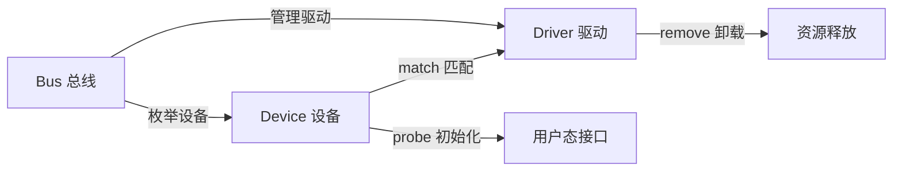
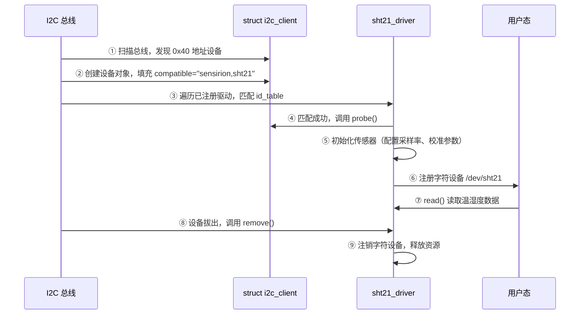
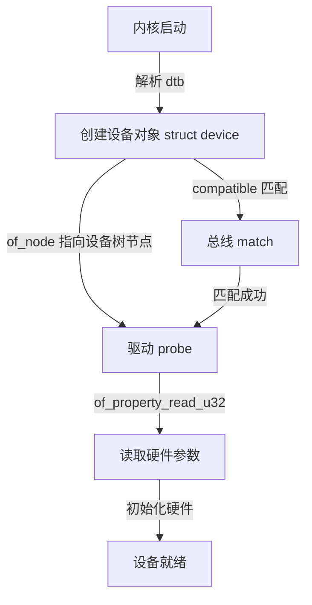

# 驱动模型基础认知 [B→I]

> **本节学习目标**：
> - 理解<span class="red">驱动模型</span>的核心概念与价值
> - 掌握 <span class="green">sysfs</span> 的基本使用方法
> - 了解 Bus / Device / Driver 的三角关系
> - 区分<span class="red">内核态</span>驱动与用户态程序的本质差异

---
## 驱动模型的核心定义与价值

---
### <strong>驱动模型的核心定义：内核的硬件抽象与管理框架</strong>

<span class="red">Linux 驱动模型（Device Driver Model）</span> 是一套标准化的硬件抽象规范 + 内核基础设施。<br>
它通过 <span class="green">"总线 - 设备 - 驱动"</span> 的分层架构，<br>
将硬件的通用操作与差异化操作分离，<br>
为内核提供统一的设备管理接口。<br>

简单说，它不是某一个具体的驱动程序，<br>
而是所有驱动程序都必须遵守的 <span class="green">"游戏规则"</span> 和 <span class="green">"公共基础设施"</span>。<br>
内核提供了这套规则和基础设施，<br>
厂商只需要按照规则填写自己的硬件差异化部分，<br>
就能让设备在 Linux 系统上运行。<br>

它的本质是内核与硬件之间的 <span class="blue">"翻译层 + 管理层"</span>：<br>
* 向下：统一管理所有硬件资源（中断、IO 内存、<span class="red">DMA</span> 等）<br>
* 向上：为内核核心和应用层提供统一的设备访问接口<br>
* 中间：定义了总线、设备、驱动三者之间的交互协议<br>

最关键的一点：写驱动其实就是 <span class="blue">"填结构体 + 调 API"</span>。<br>

---
### <strong>驱动模型解决的内核痛点：设备管理混乱与代码复用问题</strong>

在 <span class="red">驱动模型</span> 出现之前，<br>
<span class="red">Linux 内核</span>的设备管理处于<span class="blue">"碎片化"状态</span>。<br>
尤其是 <span class="green">2.4</span> 及更早版本的内核，这个问题尤为突出。<br>

我们可以通过一个嵌入式开发的典型场景理解这种混乱：<br>
假设某项目需要适配两款 <span class="green">I2C</span> 接口的温湿度传感器<br>（A 厂商 <span class="green">SHT21</span> 和 B 厂商 <span class="green">HTU21D</span>），<br>
在无统一<span class="red">驱动模型</span>的时代，<br>
开发者需要为两款传感器编写完全独立的驱动程序<br>
——即使它们的通信协议、数据解析逻辑 <span class="blue">90% 一致</span>，<br>
也必须重复编写 <span class="green">I2C 总线初始化</span>、设备探测、数据读写等核心代码。<br>

这种模式带来两个致命问题：<br>

<span class="orange"><strong>1. 代码冗余率极高</strong></span><br>
不同厂商的同类型设备（如 <span class="green">SPI</span> 闪存、<span class="green">UART</span> 芯片）驱动，<br>
都要重复实现总线交互、资源申请等通用逻辑，<br>
内核源码中充斥大量"复制粘贴"的代码。<br>
比如 <span class="green">2.4</span> 内核中仅串口驱动就有数十套相似但不兼容的实现，<br>
维护者需要为每个驱动单独修复漏洞。<br>

<span class="orange"><strong>2. 设备管理无统一标准</strong></span><br>
内核无法统一识别、分类硬件设备，<br>
比如无法通过一个接口查询<span class="blue">"当前系统有哪些 I2C 设备"</span>，<br>
也无法统一释放设备占用的内存、中断等资源，<br>
导致设备卸载时容易出现资源泄漏，<br>
甚至引发内核崩溃（<span class="green">Oops</span>）。<br>

<span class="red">驱动模型</span>的出现彻底解决了这一问题：<br>
它通过定义统一的<span class="blue">"总线-设备-驱动"交互规范</span>，<br>
将通用逻辑（如总线枚举、资源管理）抽离为内核核心模块，<br>
厂商只需编写"硬件适配层"代码（如传感器的具体数据解析逻辑）。<br>

还是以 <span class="green">SHT21</span> 和 <span class="green">HTU21D</span> 为例，<br>
基于 <span class="green">I2C</span> 驱动模型开发时，<br>
两者可共用内核提供的 <span class="green">I2C 总线核心代码</span>，<br>
仅需分别实现 <span class="green">`probe`</span>（设备探测）和 <span class="green">`read_data`</span>（数据解析）等差异化函数，<br>
代码复用率提升至 <span class="blue">90% 以上</span>。<br>

为了更直观呈现痛点与解决方案，可参考下表：<br>

| 维度 | 无驱动模型（2.4 内核及之前） | 有驱动模型（2.6 内核及之后） |
| --- | --- | --- |
| 同类型设备驱动复用率 | ＜30%（重复编写总线、资源管理逻辑） | ＞80%（共用总线核心，仅写硬件适配代码） |
| 设备管理方式 | 无统一接口，驱动各自维护设备信息 | 统一通过 sysfs、lspci 等工具查询设备状态 |
| 资源释放可靠性 | 手动释放，易泄漏（如中断号、IO 内存未释放） | 内核统一管理，自动回收（如 devres 机制） |
| 漏洞修复成本 | 需修改所有同类设备驱动 | 仅修改总线核心代码，所有适配驱动自动受益 |

---
### <strong>驱动模型的核心目标：实现"硬件无关性"与"热插拔支持"</strong>

<span class="red">驱动模型</span> 的核心设计目标，<br>
是让 <span class="red">Linux 内核</span>摆脱对具体硬件的依赖，<br>
同时适配嵌入式场景中频繁的设备动态接入需求。<br>
这两个目标分别对应<span class="blue">"静态兼容性"和"动态可用性"</span>。<br>

<span class="orange"><strong>1. 硬件无关性：内核与硬件的"解耦"</strong></span><br>

硬件无关性是指内核核心代码（如<span class="red">进程调度</span>、内存管理）无需修改，<br>
即可适配不同架构（如 <span class="green">ARM</span>、<span class="green">RISC-V</span>、<span class="green">x86</span>）和不同厂商的硬件设备。<br>

其实现逻辑是<span class="blue">"分层设计"</span>：<br>
<span class="red">驱动模型</span>作为内核核心与硬件之间的"中间层"，<br>
定义了标准化的交互接口<br>
——内核核心只需要调用驱动模型提供的接口<br>（如 <span class="green">`device_register`</span> 注册设备），<br>
无需关心硬件是<span class="blue">"ARM 架构的 GPIO"</span>还是<span class="blue">"RISC-V 架构的 GPIO"</span>；<br>
而驱动程序则负责将硬件的具体操作（如寄存器读写）<br>
转换为<span class="red">驱动模型</span>的标准接口。<br>

举个嵌入式开发中的实际案例：<br>
某工业控制器最初基于 <span class="green">ARMv7</span> 架构开发，<br>
使用 <span class="green">GPIO</span> 驱动控制继电器；<br>
后期因成本优化改为 <span class="green">RISC-V</span> 架构的芯片。<br>
由于采用了<span class="red">驱动模型</span>，开发者无需修改内核核心代码，<br>
也无需重构应用层控制逻辑，<br>
仅需替换 <span class="green">GPIO</span> 驱动的<span class="blue">"硬件适配层"</span><br>
——修改 <span class="green">GPIO</span> 寄存器的基地址和位操作方式，<br>
即可实现继电器控制功能的无缝迁移。<br>

这种<span class="blue">"内核不变、驱动适配"</span>的模式，<br>
正是嵌入式设备"跨平台移植"的核心保障。<br>

<span class="orange"><strong>2. 热插拔支持：动态设备的"安全管理"</strong></span><br>

热插拔（<span class="green">Hot Plug</span>）是嵌入式场景的核心需求之一，<br>
比如工业现场的 <span class="green">USB</span> 数据采集器、车载系统的 <span class="green">SD</span> 卡、<br>
物联网设备的外接传感器等，<br>
都需要支持<span class="blue">"带电插入/拔出"</span>而不影响系统稳定性。<br>

在无<span class="red">驱动模型</span>的时代，<br>
热插拔几乎无法实现——驱动无法实时感知设备的接入/拔出，<br>
强行插拔会导致总线数据混乱，<br>
甚至触发内核 <span class="green">panic</span>。<br>

<span class="red">驱动模型</span>通过<span class="blue">"总线监听 + 事件通知"</span>机制实现热插拔支持：<br>
总线控制器（如 <span class="green">USB</span>、<span class="green">I2C</span> 控制器）实时监听总线上的设备信号<br>（如 USB 的 D+D- 电平变化），<br>
当检测到设备接入时，<br>
通过驱动模型的 <span class="green">`uevent`</span> 机制通知内核；<br>
内核则调用总线对应的 <span class="green">`probe`</span> 函数加载驱动，<br>
完成设备初始化；<br>
当设备拔出时，<br>
内核调用 <span class="green">`remove`</span> 函数卸载驱动，<br>
释放设备占用的中断、内存等资源。<br>

实际操作中，我们可以通过 <span class="green">`dmesg`</span> 命令观察热插拔过程的日志（以 USB U盘为例）：<br>

```bash
# 插入USB U盘时的内核日志
[1234.567890] usb 1-1: new high-speed USB device number 2 using ehci-platform
[1234.712345] usb-storage 1-1:1.0: USB Mass Storage device detected
[1234.723456] scsi host0: usb-storage 1-1:1.0
[1235.734567] scsi 0:0:0:0: Direct-Access     SanDisk  Cruzer Blade     1.26 PQ: 0 ANSI: 6
[1235.745678] sd 0:0:0:0: [sda] 31258624 512-byte logical blocks: (16.0 GB/14.9 GiB)
[1235.756789] sd 0:0:0:0: [sda] Write Protect is off
[1235.767890] sd 0:0:0:0: [sda] Mode Sense: 43 00 00 00
[1235.778901] sd 0:0:0:0: [sda] Write cache: disabled, read cache: enabled
[1236.789012]  sda: sda1
[1236.790123] sd 0:0:0:0: [sda] Attached SCSI removable disk
```

从日志中可以清晰看到<span class="red">驱动模型</span>的<span class="blue">"自动调度"逻辑</span>：<br>
<span class="green">USB</span> 总线检测到设备 → 匹配 USB 存储驱动 → 创建 SCSI 主机 → 注册块设备 → 挂载文件系统，<br>
全程无需用户手动干预。<br>

---
### <strong>新手视角：驱动模型 = 内核的"硬件设备管理中台"</strong>

对于入门者而言，<br>
无需一开始深入源码理解<span class="red">驱动模型</span>的实现细节，<br>
可通过<span class="blue">"企业中台"</span>的类比快速建立认知：<br>
在企业管理中，"中台"负责整合资源、制定标准，<br>
让业务部门（如销售、研发）无需重复建设基础能力。<br>

而驱动模型就是 Linux 内核的<span class="red">"硬件设备管理中台"</span>：<br>

<span class="orange"><strong>1. 资源整合与分配</strong></span><br>
统一管理系统的硬件资源<br>（如中断号、<span class="green">IO 内存</span>、<span class="green">DMA</span> 通道），<br>
避免不同设备"争抢资源"。<br>
比如当两个设备同时申请中断号 10 时，<br>
<span class="red">驱动模型</span>会拒绝后申请的设备，<br>
并通过 <span class="green">`dmesg`</span> 输出错误日志，<br>
帮助开发者定位冲突。<br>

<span class="orange"><strong>2. 标准制定与适配</strong></span><br>
定义"总线-设备-驱动"的交互标准，<br>
让内核核心（相当于企业的"总部"）<br>
和驱动程序（相当于企业的"业务部门"）<br>
都能通过标准化接口协作。<br>
比如内核核心只需调用 <span class="green">`driver_register`</span> 接口即可注册驱动，<br>
无需关心驱动是控制 LED 还是传感器。<br>

<span class="orange"><strong>3. 状态监控与调度</strong></span><br>
实时监控设备的运行状态（如是否在线、是否出现错误），<br>
并协调内核其他子系统（如电源管理、<span class="red">内存管理</span>）<br>
为设备提供支持。<br>
比如当设备进入休眠时，<br>
<span class="red">驱动模型</span>会通知电源管理子系统关闭设备供电，<br>
实现功耗优化。<br>

用一个简单的比喻总结：<br>
如果把内核看作一个"智能大厦"，<br>
那么<span class="red">驱动模型</span>就是大厦的<span class="blue">"物业中台"</span><br>
——它管理着大厦的水电（硬件资源），<br>
制定了入驻商户（设备）的接入规则，<br>
监控着每个商户的运行状态，<br>
让大厦（内核）能够稳定、高效地运转。<br>

---
## 驱动模型与用户态程序的本质区别

---
### <strong>驱动程序（内核态运行）与应用程序（用户态运行）的所有差异，都源于处理器特权级的底层隔离</strong>

这是 Linux 为保障系统稳定性设计的核心安全机制。<br>
嵌入式开发中常见的<span class="blue">"用户态操作 GPIO 失败"</span><br><span class="blue">"驱动越界导致内核崩溃"</span>等问题，<br>
本质都是对这种隔离机制理解不足。<br>
我们从"特权级根源 → 资源访问差异 → 交互接口边界 → 故障影响区别"逐步拆解，<br>
最后通过实操命令验证这些差异。<br>

---
### <strong>内核态驱动的特权级与资源访问特性</strong>

现代处理器（如 <span class="green">ARM</span>、<span class="green">RISC-V</span>、<span class="green">x86</span>）<br>
都通过<span class="red">"特权级划分"</span>实现权限隔离，<br>
这是驱动与应用程序本质差异的根源。<br>
以嵌入式最常用的 <span class="green">ARMv8</span> 架构为例，<br>
特权级分为 <span class="green">EL0</span>（最低）到 <span class="green">EL3</span>（最高），其中：<br>

* <span class="green">驱动程序</span> 运行在 <span class="green">EL1</span>（内核态），<br>
  拥有处理器的核心控制权，<br>
  相当于<span class="blue">"嵌入式设备的管理员"</span>。<br>
* <span class="green">应用程序</span> 运行在 <span class="green">EL0</span>（用户态），<br>
  权限被严格限制，<br>
  相当于<span class="blue">"设备的普通使用者"</span>。<br>

这种特权级差异直接决定了两资源访问能力的天壤之别。<br>
我们用嵌入式开发最常见的<span class="blue">"GPIO 控制"</span>场景举例说明：<br>

<span class="orange"><strong>1. <span class="red">内核态</span>驱动：直接操作硬件与内核核心资源</strong></span><br>

驱动可以直接访问硬件寄存器、物理内存、中断控制器等核心资源，<br>
无需"中转"。<br>
比如控制 LED 对应的 <span class="green">GPIO</span> 引脚时，<br>
驱动通过 <span class="green">`ioremap`</span> 函数<br>
将 GPIO 控制器的物理地址（如 <span class="green">`0x300B0000`</span>）<br>
映射为内核虚拟地址，<br>
随后直接通过指针操作寄存器完成电平控制：<br>

```c
// 驱动中的 GPIO 控制代码（内核态）
void gpio_led_on(void)
{
    void __iomem *gpio_base;  // 内核虚拟地址指针

    // 1. 映射 GPIO 物理地址到内核虚拟地址
    gpio_base = ioremap(0x300B0000, 0x1000);
    if (!gpio_base)
        return;

    // 2. 直接写寄存器：设置 GPIO 方向为输出
    writel(0x1, gpio_base + 0x04);

    // 3. 直接写寄存器：输出高电平（LED 亮）
    writel(0x1, gpio_base + 0x08);

    // 4. 解除映射（实际用 devres 机制自动释放）
    iounmap(gpio_base);
}
```

同时，驱动能直接调用内核核心 API，<br>
比如 <span class="green">`request_irq`</span> 注册中断、<br>
<span class="green">`devm_kzalloc`</span> 申请内核内存、<br>
<span class="green">`printk`</span> 输出调试日志<br>
——这些 API 对<span class="red">用户态</span>完全屏蔽，<br>
因为误用会直接破坏系统稳定性。<br>

<span class="orange"><strong>2. <span class="red">用户态</span>程序：权限受限，无法直接访问硬件</strong></span><br>

<span class="red">用户态</span>程序被处理器强制限制权限，<br>
既不能直接访问物理内存，<br>
也不能操作硬件寄存器。<br>
如果尝试用类似驱动的代码直接操作 <span class="green">GPIO</span> 物理地址，<br>
运行时会被处理器拦截并抛出<span class="blue">"段错误"</span>，<br>
这是操作系统的"安全防护"：<br>

```c
// 错误的用户态 GPIO 控制代码（会崩溃）
#include <stdio.h>
int main(void)
{
    volatile unsigned int *gpio_base =
        (volatile unsigned int *)0x300B0000;
    *gpio_base = 0x1;  // 直接写物理地址：非法操作
    return 0;
}
```

编译后运行的结果必然是：<br>

```bash
./user_gpio_test
Segmentation fault (core dumped)  # 处理器拦截非法访问
```

这种限制的核心目的是<span class="blue">"故障隔离"</span><br>
——<span class="red">用户态</span>程序即使出错，最多自身崩溃，<br>
不会影响内核和其他程序；<br>
而驱动运行在核心层，<br>
一旦出错可能导致整个系统崩溃（如内核 <span class="green">Oops/Panic</span>）。<br>

为了更直观呈现差异，<br>
我们整理嵌入式场景的核心对比表：<br>

| 对比维度 | 内核态驱动（驱动模型） | 用户态程序（如 APP、Shell 脚本） |
| --- | --- | --- |
| 运行特权级 | ARM EL1 / x86 Ring0（最高特权） | ARM EL0 / x86 Ring3（最低特权） |
| 硬件访问方式 | 直接操作寄存器/总线/中断 | 仅通过驱动提供的标准化接口间接访问 |
| 内存访问范围 | 全物理内存 + 内核虚拟地址空间 | 仅内核分配的用户虚拟地址空间（MMU 隔离） |
| 核心 API 调用权限 | 可调用所有内核 API（如 request_irq） | 仅可调用系统调用（如 open/read/write） |
| 故障影响范围 | 可能导致内核崩溃，系统重启 | 仅自身崩溃，不影响系统稳定性 |

---
### <strong>驱动与应用程序的接口边界：sysfs / ioctl 等用户-内核交互方式</strong>

<span class="red">用户态</span>程序无法直接操作硬件，<br>
必须通过驱动模型定义的<span class="red">"标准化接口"</span>与硬件交互<br>
——这些接口相当于<span class="red">内核态</span>与用户态之间的"桥梁"，<br>
嵌入式开发中最常用的有三类，<br>
分别适配不同场景：<br>

<span class="orange"><strong>1. <span class="green">sysfs</span> 接口："文件化"极简交互（适合简单外设控制）</strong></span><br>

<span class="green">sysfs</span> 是驱动模型的核心组件，<br>
它将硬件设备、驱动、总线等内核对象<br>
以<span class="blue">"文件目录"</span>的形式挂载到 <span class="green">`/sys`</span> 目录，<br>
<span class="red">用户态</span>通过"读/写文件"的方式与硬件交互。<br>

<span class="orange"><strong>2. <span class="green">ioctl</span> 接口："命令式"灵活交互（适合复杂硬件配置）</strong></span><br>

当需要<span class="blue">"自定义控制命令"</span>时<br>（如 <span class="green">I2C</span> 传感器配置采样率、摄像头设置分辨率），<br>
<span class="green">sysfs</span> 的"读/写"语义无法满足需求，<br>
此时需要用 <span class="green">ioctl</span>（输入/输出控制）接口。<br>

<span class="orange"><strong>3. 系统调用接口："标准化"通用交互（适合块/网络设备）</strong></span><br>

对于块设备（如 <span class="green">eMMC</span>、<span class="green">SD</span> 卡）、<br>
网络设备（如以太网口）等标准设备，<br>
<span class="red">驱动模型</span>直接复用 Linux 的系统调用接口，<br>
<span class="red">用户态</span>无需关注驱动细节。<br>

---
### <strong>实操：通过 lsmod / modinfo / dmesg 查看驱动基本信息</strong>

驱动与<span class="red">用户态</span>程序的运行状态查询方式完全不同，<br>
以下三个命令是嵌入式驱动调试的<span class="red">"入门三板斧"</span>，<br>
能快速判断驱动是否正常加载、是否存在错误：<br>

<span class="orange"><strong>1. lsmod：查看已加载的驱动模块</strong></span><br>

驱动通常以"内核模块（<span class="green">.ko</span> 文件）"的形式存在，<br>
<span class="green">`lsmod`</span> 可以列出当前系统中所有已加载的驱动：<br>

```bash
lsmod
# 输出示例：
# Module                  Size  Used by
# sht21_drv              16384  0
# i2c_dev                20480  1
# gpio_chip              24576  0
```

关键字段解读：<span class="green">`Used by`</span> 表示该驱动被多少个模块依赖<br>
——如果依赖驱动未加载，当前驱动会加载失败。<br>

<span class="orange"><strong>2. modinfo：查看驱动模块的详细信息</strong></span><br>

<span class="green">`modinfo`</span> 可以查看驱动的版本、作者、依赖关系、参数等元数据：<br>

```bash
modinfo sht21_drv.ko
# 输出示例：
# filename:       /lib/modules/5.15.0-sunxi/sht21_drv.ko
# author:         Embedded Linux Engineer
# description:    SHT21 I2C Temp&Humidity Sensor Driver
# version:        1.0
# depends:        i2c_dev
# vermagic:       5.15.0-sunxi SMP preempt mod_unload aarch64
```

关键字段解读：<span class="green">`vermagic`</span> 表示驱动编译的内核版本和架构<br>
——如果目标板内核版本与 <span class="green">`vermagic`</span> 不匹配，<br>
驱动会加载失败（提示"invalid module format"）。<br>

<span class="orange"><strong>3. <span class="green">dmesg</span>：查看内核日志（驱动调试最常用）</strong></span><br>

<span class="green">`dmesg`</span> 可以查看内核启动日志和驱动运行日志，<br>
是定位驱动问题的<span class="blue">"终极武器"</span>：<br>

```bash
dmesg | grep -i "sht21\|error\|fail"
# 输出示例：
[  123.456789] sht21_drv: probe of 1-0048 failed: i2c transfer error
[  128.901234] sht21_drv: probe of 1-0048 succeeded
[  130.123456] sht21_drv: sample rate set to 10Hz
```

关键日志解读：<span class="green">`probe`</span> 函数是驱动模型的核心<br>
——总线枚举到设备后，<br>
会调用驱动的 <span class="green">`probe`</span> 函数初始化硬件，<br>
日志中的 <span class="blue">"succeeded / failed"</span> 直接反映驱动是否正常适配硬件。<br>

---
## 嵌入式驱动的分类与模型适配场景

---
### <strong>嵌入式驱动的分类并非"随意划分"，而是基于硬件设备的功能特性、数据交互方式形成的行业共识</strong>

最核心的分类是<span class="red">"字符设备驱动、块设备驱动、网络设备驱动"</span>三大类。<br>
不同类型的驱动对应完全不同的内核模型，<br>
适配场景和开发难度差异极大。<br>
嵌入式开发中<span class="blue">"选对驱动类型"</span>是项目落地的第一步，<br>
比如把 <span class="green">SD</span> 卡（块设备）按字符设备驱动开发，<br>
会导致读写效率暴跌；<br>
把以太网口（网络设备）按字符设备开发，<br>
会无法兼容 <span class="green">TCP/IP</span> 协议栈。<br>
我们从"三大类核心差异 → 适配逻辑 → 实战案例对比"逐步展开，<br>
最后用命令验证分类结果。<br>

---
### <strong>字符设备 / 块设备 / 网络设备的模型差异</strong>

字符设备、块设备、网络设备的核心差异，<br>
体现在数据交互方式、硬件特性、内核适配框架三个维度，<br>
这直接决定了驱动的开发模式。<br>
嵌入式开发中 <span class="blue">90% 以上</span>的驱动属于这三类。<br>
我们先明确每类的核心定义与典型设备，<br>
再通过表格对比差异：<br>

<span class="orange"><strong>1. 三大类驱动的核心定义与典型设备</strong></span><br>

* <span class="blue">「字符设备驱动」</span>：<br>
  最基础、最常用的驱动类型，<br>
  数据交互采用<span class="blue">"字节流"</span>方式<br>（按顺序读写，类似读写字节数组），<br>
  无固定数据块大小。<br>
  适配"功能单一、数据实时性要求高"的硬件，<br>
  典型设备包括：<span class="green">LED</span>、串口（<span class="green">UART</span>）、<br>
  键盘、鼠标、<span class="green">ADC</span>（模数转换）、<br>
  <span class="green">GPIO</span> 控制器、简单传感器（如光敏电阻）。<br>

* <span class="blue">「块设备驱动」</span>：<br>
  数据交互采用<span class="blue">"固定大小块"</span>方式<br>（如 512 字节 / 4KB 扇区），<br>
  内核会为其分配缓存（页缓存）提升读写效率，<br>
  适配"存储类硬件"。<br>
  典型设备包括：<span class="green">eMMC</span>、<span class="green">SD</span> 卡、<br>
  <span class="green">NAND / NOR</span> 闪存、<span class="green">U盘</span>、<br>
  机械硬盘（嵌入式中少见）、<span class="green">UFS</span>（高端嵌入式设备）。<br>

* <span class="blue">「网络设备驱动」</span>：<br>
  最特殊的一类驱动，<br>
  不通过"设备文件"与用户态交互（无 <span class="green">`/dev/xxx`</span> 对应），<br>
  而是通过内核网络协议栈（<span class="green">TCP/IP</span>、<span class="green">UDP</span>）<br>
  与用户态的 <span class="green">`socket`</span> 接口通信，<br>
  适配"数据通信类硬件"。<br>
  典型设备包括：以太网控制器（如 <span class="green">DM9000</span>、<span class="green">AX88796</span>）、<br>
  <span class="green">WiFi</span> 模块（如 <span class="green">RTL8188CUS</span>）、<br>
  蓝牙模块（如 <span class="green">BCM43438</span>）、<br>
  <span class="green">4G / 5G</span> 模块（如 <span class="green">EC20</span>）。<br>

<span class="orange"><strong>2. 三大类<span class="red">驱动模型</span>核心差异对比</strong></span><br>

| 对比维度 | 字符设备驱动 | 块设备驱动 | 网络设备驱动 |
| --- | --- | --- | --- |
| 数据交互单位 | 字节流（无固定大小，如 1 字节控制 LED） | 固定块（如 512 字节扇区，适配存储特性） | 数据包（如以太网帧，适配通信协议） |
| 内核核心框架 | `cdev` + `file_operations` | `gendisk` + `block_device_operations` | `net_device` + `net_device_ops` |
| 用户态交互接口 | 设备文件（如 `/dev/led`）+ 系统调用 | 设备文件（如 `/dev/mmcblk0`）+ 系统调用 | 协议栈接口（如 `socket`、`ifconfig`） |
| 核心特性 | 实时性强，无缓存（默认） | 有页缓存，提升存储读写效率 | 依赖协议栈，支持多协议封装 |
| 典型适配场景 | 简单控制类、单字节读写类硬件 | 存储类硬件（需批量读写） | 数据通信类硬件（需协议交互） |
| 驱动开发关键 | 实现 `read` / `write` / `ioctl` 回调 | 实现 `request` / `make_request` 回调 | 实现 `hard_start_xmit`（发送）回调 |

---
### <strong>简单外设与复杂总线设备的模型选择逻辑</strong>

嵌入式硬件按"连接方式"可分为<span class="red">"简单独立外设"</span>和<span class="red">"复杂总线外设"</span>。<br>
<span class="red">驱动模型</span>的选择核心是匹配硬件的连接复杂度与功能特性<br>
——简单外设用"基础分类模型"直接适配，<br>
复杂总线外设需结合<span class="blue">"总线驱动模型"</span>（如 <span class="green">I2C</span>、<span class="green">SPI</span>、<span class="green">PCIe</span>）<br>
复用总线逻辑，避免重复开发。<br>

<span class="orange"><strong>1. 简单独立外设：直接适配基础分类模型</strong></span><br>

简单独立外设指<span class="blue">"不依赖共享总线，通过独立 GPIO、中断线连接"</span>的硬件。<br>
其功能单一，交互逻辑简单，<br>
无需总线的"设备枚举、仲裁"能力，<br>
直接用字符 / 块设备的基础模型即可。<br>

典型场景：<span class="green">GPIO</span> 控制的 LED、按键、蜂鸣器；<br>
独立 <span class="green">UART</span> 串口（无总线共享）；<br>
简单 <span class="green">ADC</span>（仅需读取电压值）。<br>

选择逻辑：这类设备的核心是"单一功能交互"，<br>
基础模型的 <span class="green">`file_operations`</span> 等框架已足够覆盖，<br>
无需引入复杂总线逻辑。<br>
比如 LED 驱动，仅需实现 <span class="green">`write`</span> 回调<br>（接收用户态的 1/0 控制亮灭），<br>
用字符设备模型开发，代码量仅 50-100 行，<br>
高效且简洁。<br>

<span class="orange"><strong>2. 复杂总线外设：结合"总线模型 + 基础分类模型"适配</strong></span><br>

复杂总线外设指<span class="blue">"通过共享总线（如 I2C、SPI、PCIe、CAN）连接"</span>的硬件。<br>
这类设备存在"多设备共享总线资源"<br>"需要总线仲裁""硬件信息标准化"等需求，<br>
必须基于对应的"总线<span class="red">驱动模型</span>"开发<br>
——总线模型负责"设备枚举、总线通信、资源管理"，<br>
基础分类模型负责"功能交互（如读数据）"。<br>

典型场景：<span class="green">I2C</span> 接口的温湿度传感器（<span class="green">SHT21</span>）、<br>
<span class="green">SPI</span> 接口的闪存（<span class="green">W25Q64</span>）、<br>
<span class="green">PCIe</span> 接口的网卡、<span class="green">CAN</span> 总线的车载传感器。<br>

选择逻辑：总线模型解决"共享资源管理"的通用问题，<br>
基础分类模型解决"设备功能"的差异化问题。<br>
比如 <span class="green">I2C</span> 传感器驱动，<br>
内核的 <span class="green">I2C</span> 总线模型已实现"总线仲裁、I2C 时序生成、设备枚举"等通用逻辑，<br>
开发者仅需基于 <span class="green">`i2c_driver`</span> 框架<br>
实现"传感器数据解析"的差异化逻辑，<br>
代码复用率提升 <span class="blue">80% 以上</span>。<br>

<span class="blue">关键原则：</span>有标准总线的设备，<br>
优先适配对应的总线<span class="red">驱动模型</span>，<br>
避免自行开发总线通信逻辑（易出错且兼容性差）。<br>

---
### <strong>案例：LED（字符设备）与 I2C 传感器（总线设备）的模型适配对比</strong>

为了更直观理解"分类与适配"的关系，<br>
我们以嵌入式开发最常见的<span class="blue">"LED 驱动"</span>（字符设备 + 简单外设）<br>
和<span class="blue">"I2C 温湿度传感器驱动"</span>（字符设备 + I2C 总线设备）为例，<br>
从"硬件特性 → 模型选择原因 → 驱动核心逻辑"三个维度对比：<br>

| 对比维度 | LED 驱动（字符设备 + 简单外设） | I2C 传感器驱动（字符设备 + I2C 总线设备） |
| --- | --- | --- |
| 硬件连接特性 | 独立 GPIO 引脚 + 电源，无共享资源 | 共享 I2C 总线（SCL / SDA），多设备可挂载 |
| 模型选择核心原因 | 功能单一（仅亮灭 / 亮度），字节流交互 | 需 I2C 总线仲裁，依赖总线通信时序 |
| 内核模型组合 | 纯字符设备模型 | I2C 总线模型（`i2c_driver`）+ 字符设备模型 |
| 驱动核心逻辑 | 1. 注册字符设备与设备文件；<br>2. 实现 `write` 回调：控制 GPIO 电平；<br>3. 实现 `read` 回调：返回当前 GPIO 电平。 | 1. 注册 I2C 驱动，指定设备兼容名（匹配设备树 `compatible`）；<br>2. 实现 `probe` 回调：初始化 I2C 通信，注册字符设备；<br>3. 实现 `read` 回调：通过 `i2c_transfer` 读传感器数据，返回给用户态。 |
| 代码量与复杂度 | 50-100 行，无总线逻辑，简单易调试 | 150-200 行，复用 I2C 总线逻辑，需处理总线错误 |
| 关键 API 依赖 | `cdev_init` / `gpio_set_value` | `i2c_add_driver` / `i2c_transfer` |

从案例可见：<br>
* <span class="blue">LED 驱动</span> 仅需"字符设备模型"，<br>
  因为硬件简单、功能单一，无需总线管理。<br>
* <span class="blue">I2C 传感器驱动</span> 需"字符设备模型 + I2C 总线模型"，<br>
  因为硬件依赖共享总线，<br>
  需总线模型处理枚举和通信，<br>
  字符设备模型处理<span class="red">用户态</span>交互。<br>

这正是嵌入式驱动<span class="blue">"分类适配"的核心逻辑</span>：<br>
模型选择始终服务于硬件特性，<br>
而非单纯追求"分类标签"。<br>

---
### <strong>实操：通过命令查看嵌入式驱动的分类与总线关联</strong>

入门者可通过内核提供的文件系统接口，<br>
直观查看系统中驱动的分类及总线关联，<br>
验证上述分类逻辑：<br>

<span class="orange"><strong>1. 查看字符 / 块设备分类：ls /dev + 设备类型标识</strong></span><br>

<span class="green">`/dev`</span> 目录下的设备文件用"主设备号 + 次设备号"标识类型，<br>
可通过 <span class="green">`ls -l`</span> 查看：<br>

```bash
ls -l /dev | head -20
# 输出示例：
# crw-rw-rw- 1 root root 1,   3 Jan  1 00:00 null      # c = 字符设备
# brw-rw---- 1 root root 8,   0 Jan  1 00:00 sda       # b = 块设备
# crw------- 1 root root 4,   0 Jan  1 00:00 tty0      # c = 字符设备
```

<span class="orange"><strong>2. 查看总线关联：/sys/bus/*/devices/ + /sys/class/*/</strong></span><br>

驱动模型将设备按总线分类存储在 <span class="green">`/sys/bus/`</span> 目录下，<br>
按功能分类存储在 <span class="green">`/sys/class/`</span> 目录下：<br>

```bash
# 查看 I2C 总线设备
ls /sys/bus/i2c/devices/
# 输出示例：0-0048  0-0049  1-0050  # "总线号-设备地址"

# 查看字符设备分类
ls /sys/class/leds/
# 输出示例：green_led  red_led  # LED 设备
```

<span class="orange"><strong>3. 查看网络设备分类：ip link 或 ifconfig</strong></span><br>

网络设备无 <span class="green">`/dev`</span> 文件，通过网络工具查看：<br>

```bash
ip link show
# 输出示例：
# 2: eth0: <BROADCAST,MULTICAST,UP,LOWER_UP> mtu 1500 ...
# 3: wlan0: <BROADCAST,MULTICAST> mtu 1500 ...
```

---
## 驱动模型的核心组成要素

---
### <strong>驱动模型的核心功能，是通过"设备（Device）- 驱动（Driver）- 总线（Bus）"三大要素的协同，实现"硬件自动识别、驱动精准匹配、资源统一管理"</strong>

这三大要素就像<span class="red">"硬件设备的身份证、操作手册、招聘平台"</span>，<br>
三者缺一不可。<br>
嵌入式开发中"驱动加载后找不到设备""设备枚举失败"等问题，<br>
本质都是这三大要素的协同出现异常。<br>
我们从"三大要素定义 → 三角关系逻辑 → <span class="red">设备树</span>辅助角色 → 实操验证"逐步拆解。<br>

---
### <strong>设备（device）、驱动（driver）、总线（bus）的三角关系</strong>

<span class="red">"设备-驱动-总线"</span>是驱动模型的"铁三角"，<br>
三者的协同逻辑可类比"公司招聘场景"：<br>
* 总线是<span class="blue">"HR 部门"</span>，负责筛选简历（设备信息）、匹配岗位（驱动能力）。<br>
* 设备是<span class="blue">"求职者"</span>，携带自身资质（硬件参数、资源需求）。<br>
* 驱动是<span class="blue">"岗位要求"</span>，明确能操作的硬件类型、具备的功能。<br>

三者的核心关系是：<br>
总线负责枚举设备、匹配驱动，<br>
驱动负责初始化设备并提供操作接口。<br>



<span class="orange"><strong>1. 三大要素的核心定义与嵌入式实例</strong></span><br>

先明确每个要素的本质与嵌入式场景中的具体形态，<br>
避免混淆概念：<br>

* <span class="blue">「设备（Device）」</span>：<br>
  硬件在 kernel 中的"数字化表示"，<br>
  核心是<span class="blue">"告诉内核我是谁、我需要什么资源"</span>。<br>
  典型实例：<span class="green">`struct platform_device`</span>（平台设备）、<br>
  <span class="green">`struct i2c_client`</span>（I2C 设备）、<br>
  <span class="green">`struct pci_dev`</span>（PCIe 设备）。<br>
  关键信息：硬件地址（如 I2C 地址 <span class="green">`0x48`</span>）、<br>
  中断号、内存资源、设备树 <span class="green">`compatible`</span> 字符串。<br>

* <span class="blue">「驱动（Driver）」</span>：<br>
  驱动是"操作硬件的代码模板"，<br>
  核心是<span class="blue">"我能操作哪类设备、怎么操作"</span>。<br>
  典型实例：<span class="green">`struct platform_driver`</span>（平台驱动）、<br>
  <span class="green">`struct i2c_driver`</span>（I2C 驱动）、<br>
  <span class="green">`struct pci_driver`</span>（PCIe 驱动）。<br>
  关键接口：<span class="green">`probe()`</span>（设备匹配后初始化）、<br>
  <span class="green">`remove()`</span>（设备卸载时清理）、<br>
  <span class="green">`id_table`</span>（支持的设备列表）。<br>

* <span class="blue">「总线（Bus）」</span>：<br>
  总线是"匹配平台"，<br>
  核心是<span class="blue">"怎么撮合设备与驱动"</span>。<br>
  典型实例：<span class="green">`struct bus_type platform_bus_type`</span>（平台总线）、<br>
  <span class="green">`struct bus_type i2c_bus_type`</span>（I2C 总线）。<br>
  关键机制：<span class="green">`match()`</span>（匹配规则，如设备树 compatible 匹配）、<br>
  <span class="green">`uevent`</span>（热插拔事件通知）。<br>

<span class="orange"><strong>2. 三角关系的协同流程（以 <span class="green">I2C</span> 传感器为例）</strong></span><br>

三大要素的协同是<span class="blue">"动态匹配 → 初始化 → 工作"</span>的过程。<br>
我们以"I2C 温湿度传感器 <span class="green">SHT21</span>"的加载流程为例：<br>



<span class="orange"><strong>3. 三大要素的核心差异对比</strong></span><br>

| 要素 | 核心功能 | 存在形态（内核结构体） | 关键标识 |
| --- | --- | --- | --- |
| 设备 | "我是谁"（身份声明） | `struct device` / `struct platform_device` / `struct i2c_client` | 设备树 compatible、总线地址、中断号 |
| 驱动 | "我能做什么"（能力声明） | `struct device_driver` / `struct platform_driver` / `struct i2c_driver` | id_table、of_match_table、probe / remove |
| 总线 | "怎么匹配"（撮合规则） | `struct bus_type` | match() 函数、uevent 机制 |

---
### <strong>设备树在驱动模型中的角色：硬件信息与驱动的"翻译官"</strong>

在早期 Linux 内核（<span class="green">2.6</span> 及之前），<br>
设备信息是<span class="blue">"硬编码"</span>在驱动中的<br>
——比如 <span class="green">I2C</span> 传感器的地址 <span class="green">`0x48`</span>、<br>
中断号 <span class="green">`15`</span> 直接写死在驱动代码里。<br>

这种方式的致命问题是<span class="blue">"硬件改动需改驱动"</span>：<br>
如果传感器地址从 <span class="green">`0x48`</span> 改为 <span class="green">`0x49`</span>，<br>
或中断号从 <span class="green">`15`</span> 改为 <span class="green">`16`</span>，<br>
必须重新编译驱动。<br>

<span class="red">设备树（Device Tree）</span> 的出现，<br>
彻底解决了"硬件信息与驱动耦合"的问题。<br>
它的核心角色是<span class="blue">"硬件信息的标准化载体"</span>，<br>
相当于"硬件的说明书"，<br>
将硬件信息从驱动中剥离出来，<br>
实现<span class="blue">"驱动不变，换硬件只改设备树"</span>。<br>

```dts
// 串口设备树节点示例
uart0: serial@50000000 {
    compatible = "samsung,s3c2440-uart";
    reg = <0x50000000 0x10>;
    interrupts = <10>;
    clock-frequency = <18000000>;
};
```

<span class="orange"><strong><span class="red">设备树</span>与驱动模型的协同逻辑</strong></span><br>

<span class="red">设备树</span>不直接参与"设备-驱动-总线"的匹配，<br>
而是给"设备"提供"身份标识和资源信息"，<br>
协同流程如下：<br>



① 内核启动时解析<span class="red">设备树</span>，<br>
根据节点的"父总线属性"<br>（如 <span class="green">`i2c0`</span> 节点下的子节点属于 I2C 设备）<br>
创建对应的 <span class="green">`struct device`</span>。<br>
② 设备对象的 <span class="green">`of_node`</span> 指针指向设备树节点，<br>
驱动的 <span class="green">`probe()`</span> 函数<br>
通过 <span class="green">`of_property_read_u32()`</span> 等 API 读取设备属性。<br>
③ 总线的 <span class="green">`match()`</span> 函数<br>
通过设备树的 <span class="green">`compatible`</span> 字符串匹配驱动<br>（如设备树写 <span class="green">`compatible = "sensirion,sht21"`</span>，<br>
驱动的 <span class="green">`of_match_table`</span> 包含相同字符串即匹配成功）。<br>

---
### <strong>基础工具：用 lspci / lsusb 查看总线设备匹配状态</strong>

嵌入式开发中，我们通过内核提供的工具和文件系统接口，<br>
可直观查看<span class="red">"总线-设备-驱动"</span>的匹配状态，<br>
快速定位匹配问题。<br>
需要注意的是：<span class="green">`lspci`</span> 用于 <span class="green">PCIe</span> 总线设备，<br>
<span class="green">`lsusb`</span> 用于 <span class="green">USB</span> 总线设备，<br>
而嵌入式常用的 <span class="green">I2C / SPI</span> 等总线，<br>
需通过 <span class="green">`/sys/bus`</span> 目录查看。<br>

<span class="orange"><strong>1. 查看 <span class="green">PCIe</span> / USB 总线设备（通用嵌入式设备）</strong></span><br>

对于搭载 <span class="green">PCIe</span>（如高端开发板的网卡）<br>
或 <span class="green">USB</span>（如外接 U盘、摄像头）的嵌入式设备，<br>
可直接用 <span class="green">`lspci`</span> / <span class="green">`lsusb`</span> 查看设备信息及驱动匹配状态：<br>

* <span class="blue">「PCIe 设备查询：lspci」</span>：<br>
  输出 <span class="green">PCIe</span> 总线的设备信息，<br>
  包括设备 ID、厂商 ID、匹配的驱动<br>（<span class="green">`Kernel driver in use`</span> 字段）：<br>

```bash
lspci -v
# 输出示例：
# 01:00.0 Ethernet controller: Realtek Semiconductor Co., Ltd. RTL8111/8168/8411 PCI Express Gigabit Ethernet Controller (rev 15)
#     Kernel driver in use: r8169  # 匹配的驱动为 r8169
#     Kernel modules: r8169
```

若 <span class="green">"Kernel driver in use"</span> 为空，<br>
说明设备未匹配到驱动，<br>
需检查驱动是否加载<br>
或设备 ID 是否在驱动的匹配列表中。<br>

* <span class="blue">「USB 设备查询：lsusb」</span>：<br>
  输出 <span class="green">USB</span> 总线的设备信息，<br>
  包括设备 ID、厂商信息，<br>
  结合 <span class="green">`lsusb -t`</span> 可查看总线拓扑：<br>

```bash
lsusb
# 输出示例：
# Bus 001 Device 002: ID 0781:5583 SanDisk Corp. Ultra Fit

lsusb -t
# 输出示例：
# /:  Bus 01.Port 1: Dev 1, Class=root_hub, Driver=ehci-platform/1p, 480M
#     |__ Port 1: Dev 2, If 0, Class=Mass Storage, Driver=usb-storage, 480M
```

<span class="orange"><strong>2. 查看 <span class="green">I2C</span> / SPI 总线设备（嵌入式专用总线）</strong></span><br>

<span class="green">I2C / SPI</span> 是嵌入式最常用的总线，<br>
需通过 <span class="green">`/sys/bus`</span> 目录查看设备与驱动的匹配状态：<br>

* <span class="blue">「查看 I2C 总线设备」</span>：<br>

```bash
# 1. 查看系统中的 I2C 总线
ls /sys/bus/i2c/devices | grep i2c-
# 输出示例：i2c-0  i2c-1

# 2. 查看 I2C 总线 1 上的设备（如 1-0048：总线 1，地址 0x48 的设备）
ls /sys/bus/i2c/devices/i2c-1/
# 输出示例：1-0048  power  subsystem  uevent

# 3. 查看该设备匹配的驱动（通过 symlink 链接判断）
ls -l /sys/bus/i2c/devices/1-0048/driver
# 输出示例：
# lrwxrwxrwx ... /sys/bus/i2c/devices/1-0048/driver -> ../../../../bus/i2c/drivers/sht21_drv
```

输出可见：<br>
<span class="green">I2C</span> 总线 1 上的设备 <span class="green">1-0048</span>（<span class="green">SHT21</span> 传感器）<br>
已匹配到 <span class="green">`sht21_drv`</span> 驱动，匹配成功。<br>

* <span class="blue">「查看驱动支持的设备」</span>：<br>

```bash
# 查看 sht21_drv 驱动支持的所有设备
cat /sys/bus/i2c/drivers/sht21_drv/modalias
# 输出示例：i2c:vendor,sht21
```

---
## 小结

| 概念 | 一句话总结 |
| --- | --- |
| 驱动模型 | 内核管理硬件的"对象化索引系统" |
| 设备 | 硬件在 kernel 中的数字化表示，声明"我是谁" |
| 驱动 | 操作硬件的代码模板，声明"我能做什么" |
| 总线 | 匹配平台，负责"怎么撮合设备与驱动" |
| sysfs | `/sys` 下可读的实时硬件地图 |
| kobject | 驱动模型的最小原子，提供引用计数、sysfs 映射、uevent 通知 |
| 字符设备 | 字节流交互，cdev + file_operations |
| 块设备 | 固定块交互，gendisk + block_device_operations |
| 网络设备 | 数据包交互，net_device + sk_buff |
| 设备树 | 硬件信息的标准化载体，实现"驱动不变，换硬件只改设备树" |

---
## 练习

1. 在 `/sys/bus/platform/devices/` 目录下查看有哪些平台设备？<br>
2. 尝试用 `cat /sys/bus/usb/devices/*/product` 查看已连接的 <span class="green">USB</span> 设备名称。<br>
3. 为什么<span class="red">驱动模型</span>需要 "Bus / Device / Driver" 三角关系？缺了哪个会出什么问题？<br>
4. 对比字符设备和块设备的差异，为什么 SD 卡不能按字符设备开发？<br>
5. <span class="red">设备树</span>的 `compatible` 字符串在驱动匹配中起什么作用？<br>
