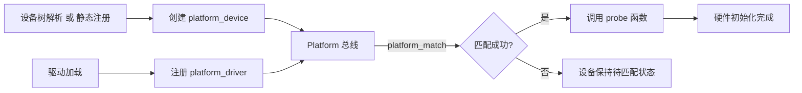
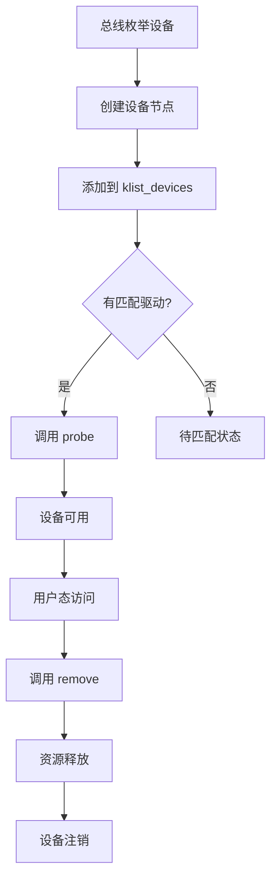

# 核心驱动模型原理解析

> **本章难度等级：** <span class="badge-i">**中级 (Intermediate)**</span> → <span class="badge-e">**高级 (Expert)**</span>

---

## Platform 总线驱动模型

---

### <strong>非标准总线设备的统一管理方案</strong>

<span class="red">Platform 总线</span>是 Linux 内核对<span class="green">"无物理总线的片上设备"</span>提供的虚拟总线。<br>
在理解它之前，先明确一个嵌入式开发的核心场景：<br>
很多硬件设备并不依赖 <span class="green">I2C</span>、<span class="green">SPI</span>、<span class="green">PCIe</span> 等标准物理总线，<br>
而是通过 <span class="green">"GPIO 直连"</span>、<span class="green">"内存映射（IO Memory）"</span> 等方式直接与 <span class="green">CPU</span> 交互。<br>

这类设备被称为<span class="blue">"非标准总线设备"</span>，<br>
在 <span class="red">Platform 总线</span>出现之前，驱动开发存在明显痛点：<br>

<span class="orange"><strong>1. 驱动开发碎片化</strong></span><br>
每类非标准设备都要单独实现"设备注册、资源申请、匹配逻辑"，<br>
无法复用总线的统一管理能力。<br>

<span class="orange"><strong>2. 资源管理无统一入口</strong></span><br>
非标准设备的资源（<span class="green">GPIO</span>、<span class="green">IO 内存</span>、<span class="green">中断</span>）由驱动各自管理，<br>
冲突检测依赖开发者自觉，易出现"重复申请"或"遗漏释放"。<br>

<span class="orange"><strong>3. 设备与驱动耦合严重</strong></span><br>
驱动代码中硬编码硬件参数（如 <span class="green">GPIO 编号</span>、<span class="green">IO 内存基地址</span>），<br>
更换板卡时需修改驱动源码，违背"驱动与硬件解耦"原则。<br>

<span class="blue">Platform 总线的核心价值：为非标准总线设备提供"虚拟总线"的统一管理框架。</span><br>

| 痛点 | 无 Platform 总线 | 有 Platform 总线 |
| --- | --- | --- |
| 设备注册 | 驱动手动注册，无统一规范 | 通过 platform_device_register 或设备树统一注册 |
| 资源管理 | 驱动自行申请/释放，易冲突 | 总线统一管理，自动检测冲突 |
| 设备-驱动匹配 | 硬编码匹配，耦合严重 | 通过 compatible 或 ID 表灵活匹配 |
| 用户态访问 | 需为每个驱动单独封装接口 | 通过 sysfs 统一暴露设备信息 |

---

### <strong>核心机制：platform_device 与 platform_driver 的匹配流程</strong>

<span class="red">Platform 总线</span>的核心交互围绕两个数据结构展开：<br>
<span class="green">`platform_device`</span>（设备抽象）和 <span class="green">`platform_driver`</span>（驱动抽象），<br>
两者通过 Platform 总线完成匹配后，<br>
触发驱动的 <span class="green">`probe`</span> 函数完成硬件初始化。<br>

整个流程可分为"设备注册 → 驱动注册 → 总线匹配 → probe 初始化"四个阶段：<br>

<span class="blue">1. 核心数据结构解析</span><br>

<span class="green">`platform_device`</span> 结构体：描述硬件资源<br>

```c
struct platform_device {
    const char      *name;          // 设备名称（用于匹配）
    int             id;             // 设备实例ID
    struct device   dev;            // 继承自通用设备结构体
    u32             num_resources;  // 资源数量
    struct resource *resource;      // 资源数组（IO内存、中断等）
};
```

<span class="green">`platform_driver`</span> 结构体：描述驱动逻辑<br>

```c
struct platform_driver {
    int (*probe)(struct platform_device *);   // 匹配成功后的初始化函数
    int (*remove)(struct platform_device *);  // 设备移除时的清理函数
    struct device_driver driver;              // 继承自通用驱动结构体
    const struct platform_device_id *id_table; // ID匹配表（老版本内核）
};
```

<span class="blue">2. 完整匹配流程</span><br>



<span class="blue">流程核心关键点：</span><br>
* 设备注册的核心是"传递硬件资源"<br>
* 驱动注册的核心是"提供匹配规则与操作逻辑"<br>
* 总线的核心是"匹配中介"<br>

---

### <strong>源码解析：platform_match 函数的匹配规则（设备树/compatible 字段）</strong>

<span class="green">`platform_match`</span> 函数是 <span class="red">Platform 总线</span>匹配逻辑的核心，<br>
定义在 <span class="green">`drivers/base/platform.c`</span> 中，<br>
采用<span class="blue">"优先级匹配"</span>策略：<br>

```c
static int platform_match(struct device *dev, struct device_driver *drv)
{
    struct platform_device *pdev = to_platform_device(dev);
    struct platform_driver *pdrv = to_platform_driver(drv);

    /* 优先级1：设备树匹配（当前主流） */
    if (of_driver_match_device(dev, drv))
        return 1;

    /* 优先级2：ID表匹配（老版本内核） */
    if (pdrv->id_table)
        return platform_match_id(pdrv->id_table, pdev) != NULL;

    /* 优先级3：设备名匹配（最原始方式） */
    return (strcmp(pdev->name, drv->name) == 0);
}
```

<span class="blue">核心规则：设备树匹配（of_driver_match_device）</span><br>

该函数本质是"对比设备树节点的 <span class="green">`compatible`</span> 属性与驱动 <span class="green">`of_match_table`</span> 中的兼容名"，<br>
匹配成功返回 1，否则返回 0。<br>

具体逻辑可拆解为三步：<br>
* ① 从 <span class="green">`platform_device`</span> 的 <span class="green">`of_node`</span> 成员获取设备树节点<br>
* ② 读取设备树节点的 <span class="green">`compatible`</span> 属性值<br>
* ③ 遍历驱动 <span class="green">`of_match_table`</span> 中的兼容名列表，逐一对比<br>

```c
// 驱动中的设备树匹配表示例
static const struct of_device_id led_of_match[] = {
    { .compatible = "vendor,led-gpio" },  // 兼容名
    { /* Sentinel */ }
};

static struct platform_driver led_driver = {
    .driver = {
        .name = "led-gpio",
        .of_match_table = led_of_match,  // 绑定匹配表
    },
    .probe = led_probe,
    .remove = led_remove,
};
```

<span class="blue">其他匹配规则（了解即可）</span><br>

* ID 表匹配：适用于无<span class="red">设备树</span>的老版本内核<br>
* 设备名匹配：最原始方式，直接比较字符串<br>

---

### <strong>实操：编写最简 platform 驱动的设备树与驱动代码框架</strong>

本实操以"<span class="green">GPIO</span> 控制的 LED"为场景，<br>
基于 <span class="green">ARM</span> 架构开发板实现最简 <span class="red">Platform 驱动</span>，<br>
覆盖"<span class="red">设备树</span>编写 → 驱动代码 → 编译加载 → 功能验证"全流程。<br>

<span class="blue">步骤 1：编写设备树节点</span><br>

```dts
// arch/arm/boot/dts/xxx.dts
/ {
    led_gpio: led-gpio {
        compatible = "vendor,led-gpio";
        gpios = <&gpio1 5 GPIO_ACTIVE_HIGH>;  // GPIO1_5，高电平有效
        default-state = "off";
    };
};
```

<span class="blue">步骤 2：编写 Platform 驱动代码</span><br>

```c
#include <linux/module.h>
#include <linux/platform_device.h>
#include <linux/gpio.h>
#include <linux/of_gpio.h>

static int led_probe(struct platform_device *pdev)
{
    int gpio = of_get_gpio(pdev->dev.of_node, 0);  // 从设备树获取GPIO
    gpio_direction_output(gpio, 0);                  // 默认关闭
    gpio_set_value(gpio, 1);                         // 点亮LED
    return 0;
}

static int led_remove(struct platform_device *pdev)
{
    int gpio = of_get_gpio(pdev->dev.of_node, 0);
    gpio_set_value(gpio, 0);  // 关闭LED
    return 0;
}

static const struct of_device_id led_of_match[] = {
    { .compatible = "vendor,led-gpio" },
    {}
};

static struct platform_driver led_driver = {
    .probe = led_probe,
    .remove = led_remove,
    .driver = {
        .name = "led-gpio",
        .of_match_table = led_of_match,
    },
};

module_platform_driver(led_driver);
MODULE_LICENSE("GPL");
```

<span class="blue">步骤 3：编译与加载</span><br>

```bash
# Makefile
obj-m += led_drv.o

# 编译
make -C /lib/modules/$(uname -r)/build M=$(PWD) modules

# 加载驱动
insmod led_drv.ko
```

<span class="blue">步骤 4：功能验证</span><br>

```bash
# 查看设备是否匹配
ls /sys/bus/platform/devices/led-gpio/

# 查看驱动是否注册
ls /sys/bus/platform/drivers/led-gpio/
```

---

## 通用总线驱动模型

---

### <strong>总线的核心职责：设备枚举、驱动绑定与通信仲裁</strong>

<span class="red">通用总线驱动模型</span>（Bus Model）是 <span class="green">Linux</span> 内核对所有物理总线的抽象框架，<br>
其核心价值是将不同总线的"设备管理、驱动匹配、通信控制"逻辑标准化。<br>

与 <span class="red">Platform</span> 虚拟总线不同，通用总线必然关联实际硬件通信协议，<br>
因此核心职责除"设备-驱动匹配"外，还增加了<span class="blue">"通信仲裁"</span>。<br>

<span class="blue">1. 设备枚举：发现总线上的硬件"身份"</span><br>

* <span class="green">I2C</span> 总线枚举：通过"地址扫描"实现<br>
* <span class="green">SPI</span> 总线枚举：通过"片选信号（CS）+ <span class="red">设备树</span>"实现<br>
* <span class="green">PCIe</span> 总线枚举：通过"配置空间扫描"实现<br>

```bash
# I2C 枚举验证
i2cdetect -y 1
# 输出：0x48 对应 SHT21 传感器
```

<span class="blue">2. 驱动绑定：建立设备与驱动的"关联"</span><br>

匹配规则优先级（通用总线通用逻辑）：<br>
<span class="green">设备树兼容名（compatible）</span> → <span class="green">硬件 ID</span> → <span class="green">设备名（name）</span><br>

<span class="blue">3. 通信仲裁：解决多设备的"资源竞争"</span><br>

* <span class="green">I2C</span> 总线仲裁：通过 SCL 和 SDA 的电平竞争实现"线与"逻辑<br>
* <span class="green">SPI</span> 总线仲裁：通过片选信号（CS）分时复用总线<br>
* <span class="green">USB</span> 总线仲裁：采用主从架构，主机控制通信时序<br>

---

### <strong>关键数据结构：struct bus_type 的核心成员与回调函数</strong>

<span class="green">`struct bus_type`</span> 是 <span class="red">通用总线驱动模型</span>的"骨架"，<br>
定义了总线的核心行为规范，所有物理总线均通过实现该结构体的实例成为内核可管理的总线。<br>

```c
struct bus_type {
    const char      *name;                  // 总线名称（如"i2c"、"usb"）
    struct bus_attribute *bus_attrs;        // 总线自身属性
    struct device_attribute *dev_attrs;     // 设备默认属性
    struct driver_attribute *drv_attrs;     // 驱动默认属性

    int (*match)(struct device *dev, struct device_driver *drv);
    int (*uevent)(struct device *dev, struct kobj_uevent_env *env);
    int (*probe)(struct device *dev);
    int (*remove)(struct device *dev);
    void (*shutdown)(struct device *dev);

    int (*suspend)(struct device *dev, pm_message_t state);
    int (*resume)(struct device *dev);

    const struct dev_pm_ops *pm;            // 电源管理操作集

    struct iommu_ops *iommu_ops;
};
```

<span class="blue">核心成员作用详解：</span><br>

* `name` 与 <span class="green">sysfs</span> 关联：决定总线在 `/sys/bus/` 下的目录名<br>
* `match` 回调：匹配规则的核心，不同总线重写特有逻辑<br>
* `probe`/`remove`：设备绑定与解绑的入口<br>
* `pm`：电源管理操作集<br>

---

### <strong>机制深挖：总线的 probe 函数触发时机与设备生命周期管理</strong>

<span class="green">`probe`</span> 函数是设备与驱动绑定后的"硬件初始化入口"，<br>
负责完成资源分配、硬件配置、接口注册等核心工作。<br>

<span class="blue">probe 函数的三大触发时机</span><br>

* 时机 1：设备先注册，驱动后注册<br>
* 时机 2：驱动先注册，设备后注册<br>
* 时机 3：手动触发（通过 <span class="green">sysfs</span> 操作）<br>

<span class="blue">设备全生命周期管理流程</span><br>



<span class="blue">流程核心关键点：</span><br>
* 回调函数串联生命周期：`probe`、`suspend/resume`、`remove`、`shutdown`<br>
* 链表是状态管理核心：`klist_devices` 和 `klist_drivers`<br>
* 热插拔无缝适配：`uevent` 回调函数<br>

<span class="blue">probe 函数的核心执行逻辑</span><br>

无论何种总线，<span class="green">`probe`</span> 函数的执行逻辑均遵循：<br>
<span class="blue">"资源获取 → 硬件配置 → 接口注册"</span>的标准化流程。<br>

```c
static int sht21_probe(struct i2c_client *client,
                       const struct i2c_device_id *id)
{
    struct sht21_data *data;
    int ret;

    // 1. 资源获取：申请数据结构内存
    data = devm_kzalloc(&client->dev, sizeof(*data), GFP_KERNEL);

    // 2. 硬件配置：初始化传感器
    ret = sht21_init_hardware(data);
    if (ret)
        return ret;

    // 3. 接口注册：注册 IIO 设备或 sysfs 接口
    ret = devm_iio_device_register(&client->dev, indio_dev);

    return 0;
}
```

---

### <strong>[M] 高级特性：总线错误处理与设备移除的安全机制</strong>

<span class="red">通用总线</span>在实际运行中会面临"通信错误""硬件故障""热插拔异常"等问题，<br>
内核通过总线层面的错误检测、恢复机制和设备移除安全策略，保障系统稳定性。<br>

<span class="blue">1. 总线通信错误的检测与恢复</span><br>

* <span class="green">I2C</span> 总线错误处理：常见错误有 NACK（无应答）、仲裁失败、超时；<br>
  检测方式：<span class="green">I2C</span> 控制器状态寄存器（如 `I2C_SR1` 的 `AF` 位表示 NACK）；<br>
  恢复策略：驱动中实现重试逻辑，总线提供 `i2c_retry_transfer` API 自动重试。<br>

```c
// I2C 通信重试示例（驱动自行实现重试）
static int sht21_read_temp(struct i2c_client *client, u16 *temp)
{
    int ret, retry;
    u8 buf[2];
    for (retry = 0; retry < 3; retry++) {
        ret = i2c_master_recv(client, buf, 2);
        if (ret == 2) {
            *temp = (buf[0] << 8) | buf[1];
            return 0;
        }
        mdelay(10);  // 重试间隔
    }
    return -EIO;  // 三次重试均失败
}
```

<span class="blue">2. 设备移除的安全机制</span><br>

* 同步等待未完成 IO：总线维护设备的 IO 请求队列，移除设备前调用 `flush_workqueue` 等待队列中所有 IO 操作完成。<br>
* 手动绑定/解绑的安全控制：总线通过 <span class="green">sysfs</span> 提供手动绑定/解绑接口。<br>

```c
static int sht21_remove(struct i2c_client *client)
{
    struct sht21_data *data = i2c_get_clientdata(client);
    flush_workqueue(data->workqueue);
    cdev_del(&data->cdev);
    dev_info(&client->dev, "remove succeeded\n");
    return 0;
}
```

---

### <strong>实操：总线模型的核心工具与故障排查</strong>

<span class="red">通用总线</span>的调试与故障排查依赖 <span class="green">sysfs</span> 文件系统和专用工具，<br>
通过这些工具可直观查看总线状态、匹配关系和错误信息。<br>

| 操作目标 | 工具/命令 | 示例输出与说明 |
| --- | --- | --- |
| 查看系统所有总线 | `ls /sys/bus/` | `i2c pci platform spi usb` → 列出所有已注册的总线 |
| 查看总线注册的设备 | `ls /sys/bus/i2c/devices/` | `1-0048` → I2C总线1上地址0x48的设备 |
| 查看总线注册的驱动 | `ls /sys/bus/i2c/drivers/` | `sht21` → 已注册的I2C驱动 |
| 查看设备绑定的驱动 | `ls -l /sys/bus/i2c/devices/1-0048/driver` | 符号链接指向绑定的驱动 |
| 查看驱动绑定的设备 | `ls /sys/bus/i2c/drivers/sht21/` | `1-0048` → 驱动匹配的设备 |
| 查看总线通信错误 | `dmesg \| grep i2c` | 过滤I2C相关日志，定位通信失败 |

---

## 设备资源管理（devres）机制

---

### <strong>devres 解决的传统问题：驱动资源的自动释放与泄漏防护</strong>

在 <span class="red">devres</span>（Device Resource Management，设备资源管理）机制出现前，<br>
<span class="green">Linux</span> 驱动的资源管理完全依赖开发者"手动申请、手动释放"。<br>

内存、<span class="green">IO</span> 映射、中断、<span class="green">GPIO</span>、时钟等资源，<br>
需在 <span class="green">`probe`</span> 中申请，在 <span class="green">`remove`</span> / 错误分支中按"申请逆序"释放。<br>

这种方式对开发者经验要求极高，<br>
嵌入式驱动中 <span class="blue">80% 以上的"内存泄漏""资源占用"问题</span>，<br>
均源于传统资源管理的固有缺陷。<br>

<span class="orange"><strong>传统资源管理的四大核心痛点</strong></span><br>

以"<span class="green">GPIO</span> + 中断 + 内存"的简单字符<span class="red">设备驱动</span>为例，直观展示传统方式的问题：<br>

```c
// 传统驱动：手动管理资源（存在多处泄漏风险）
static int led_probe(struct platform_device *pdev)
{
    int ret, irq;
    void __iomem *io_base;
    char *buf;

    buf = kzalloc(1024, GFP_KERNEL);
    if (!buf) return -ENOMEM;

    io_base = ioremap(0x300B0000, 0x1000);
    if (!io_base) { kfree(buf); return -ENOMEM; }  // 错误分支需手动释放

    irq = platform_get_irq(pdev, 0);
    if (irq < 0) { iounmap(io_base); kfree(buf); return irq; }  // 错误分支需逆序释放

    ret = request_irq(irq, led_irq_handler, 0, "led-irq", NULL);
    if (ret) { iounmap(io_base); kfree(buf); return ret; }  // 错误分支需逆序释放

    return 0;
}

static int led_remove(struct platform_device *pdev)
{
    // 需手动解析并释放所有资源，遗漏即泄漏
    free_irq(irq, NULL);
    iounmap(io_base);
    kfree(buf);
    return 0;
}
```

<span class="blue">问题总结：错误分支越多，释放逻辑越复杂，遗漏风险越高。</span><br>

---

### <strong>核心 API：devm_kzalloc/devm_ioremap 的资源绑定原理</strong>

<span class="red">devres</span>围绕"资源绑定"设计了一套完整的 <span class="green">API</span> 体系，<br>
覆盖嵌入式驱动中 99% 的资源类型。<br>

所有 <span class="red">devres API</span>的核心逻辑一致：<br>
申请资源时创建 <span class="green">devres</span> 节点，将节点加入设备的资源池；<br>
释放时遍历资源池，调用资源对应的释放函数。<br>

<span class="blue">devres 核心数据结构（Linux 5.15 版本）</span><br>

```c
// devres节点：单个资源的封装
struct devres_node {
    struct list_head entry;  // 链表节点，用于加入设备的资源池链表
    dr_release_t release;    // 资源释放函数（如kfree、iounmap、free_irq）
    unsigned int flags;      // 节点标志
    size_t size;             // 资源数据大小
};

// devres容器：包裹资源节点与实际资源数据
struct devres {
    struct devres_node node;  // 节点（含释放函数）
    // 紧随其后的是实际资源数据（内存地址、IO映射基地址等）
};

// 资源池头节点：每个device对象关联一个资源池
struct devres_head {
    struct list_head list;   // 资源池链表头
    spinlock_t lock;         // 自旋锁（保护并发访问）
};
```

<span class="blue">devres API 分类与核心绑定原理</span><br>

| devres API | 对应传统 API | 核心作用 | release 函数 | 适用场景 |
| --- | --- | --- | --- | --- |
| `devm_kzalloc(dev, size, gfp)` | `kzalloc` | 分配并清零内存 | `kfree` | 驱动私有数据结构 |
| `devm_ioremap(dev, start, len)` | `ioremap` | 映射 IO 内存 | `iounmap` | 寄存器操作 |
| `devm_request_irq(dev, irq, handler, flags, name, dev_id)` | `request_irq` | 申请中断 | `free_irq` | 中断处理 |
| `devm_gpio_request(dev, gpio, label)` | `gpio_request` | 申请 GPIO | `gpio_free` | GPIO 控制 |
| `devm_clk_get(dev, id)` | `clk_get` | 获取时钟 | `clk_put` | 时钟管理 |
| `devm_iio_device_register(dev, indio_dev)` | `iio_device_register` | 注册 IIO 设备 | `iio_device_unregister` | 传感器驱动 |

<span class="blue">核心 API 底层调用链解析（以 devm_kzalloc 为例）</span><br>

```c
// 1. 驱动调用的 devm_kzalloc（封装函数）
void *devm_kzalloc(struct device *dev, size_t size, gfp_t gfp)
{
    return devm_alloc(dev, size, gfp, __builtin_return_address(0), kfree);
}

// 2. 通用 devm_alloc 函数（创建 devres 容器并加入资源池）
static void *devm_alloc(struct device *dev, size_t size, gfp_t gfp, 
                        void *caller, dr_release_t release)
{
    struct devres *dr;
    dr = devres_alloc(release, sizeof(struct devres) + size, gfp);
    if (dr) {
        memset(dr->data, 0, size);  // 清零实际资源区域
        devres_add(dev, dr);         // 加入设备资源池
    }
    return dr ? dr->data : NULL;
}
```

---

### <strong>实战：用 devres 重构传统驱动，避免手动释放资源</strong>

本实操以"带中断的 <span class="green">GPIO</span> LED 驱动"为场景，<br>
对比传统驱动与 <span class="red">devres</span>驱动的差异，<br>
验证 devres的自动释放能力。<br>

<span class="blue">步骤 1：传统驱动（有资源泄漏风险）</span><br>

```c
// 传统驱动：错误分支需手动释放资源，remove 函数需手动解析并释放所有资源
static int led_probe(struct platform_device *pdev)
{
    int ret, irq;
    void __iomem *io_base;
    char *buf;
    struct led_data *data;

    buf = kzalloc(1024, GFP_KERNEL);
    if (!buf) return -ENOMEM;

    io_base = ioremap(0x300B0000, 0x1000);
    if (!io_base) { kfree(buf); return -ENOMEM; }

    irq = platform_get_irq(pdev, 0);
    if (irq < 0) { iounmap(io_base); kfree(buf); return irq; }

    ret = request_irq(irq, led_irq_handler, 0, "led-irq", NULL);
    if (ret) { free_irq(irq, NULL); iounmap(io_base); kfree(buf); return ret; }

    return 0;
}
```

<span class="blue">步骤 2：devres 重构驱动（自动释放资源）</span><br>

```c
// devres 重构后：删除所有手动释放逻辑
static int led_probe(struct platform_device *pdev)
{
    int irq;
    struct led_data *data;

    data = devm_kzalloc(&pdev->dev, sizeof(*data), GFP_KERNEL);
    if (!data) return -ENOMEM;

    data->io_base = devm_ioremap(&pdev->dev, 0x300B0000, 0x1000);
    if (!data->io_base) return -ENOMEM;

    irq = platform_get_irq(pdev, 0);
    if (irq < 0) return irq;

    devm_request_irq(&pdev->dev, irq, led_irq_handler, 0, "led-irq", NULL);
    return 0;  // 无需任何手动释放逻辑，remove 可为空
}

static int led_remove(struct platform_device *pdev)
{
    return 0;  // devres 自动释放所有资源
}
```

<span class="blue">步骤 3：编译与加载验证</span><br>

```bash
# 加载传统驱动
insmod led_traditional_drv.ko
dmesg | grep "traditional led"
# 卸载传统驱动
rmmod led_traditional_drv.ko
dmesg | grep "traditional led"  # 需手动释放资源

# 加载 devres 驱动
insmod led_devres_drv.ko
dmesg | grep "devres led"
# 卸载 devres 驱动
rmmod led_devres_drv.ko
dmesg | grep "devres led"  # 自动释放资源，无手动释放逻辑
```

---

### <strong>[M] 源码追踪：devres 资源池的创建与销毁流程</strong>

<span class="red">devres</span>的核心是"设备专属资源池"的生命周期管理。<br>
资源池随设备创建而初始化，随设备销毁而释放。<br>

<span class="blue">1. 资源池的创建：设备初始化时自动创建</span><br>

```c
struct device *device_alloc(void)
{
    struct device *dev = kzalloc(sizeof(*dev), GFP_KERNEL);
    if (!dev) return NULL;

    // 初始化设备的资源池头节点
    dev->devres_head = kzalloc(sizeof(struct devres_head), GFP_KERNEL);
    if (dev->devres_head) {
        INIT_LIST_HEAD(&dev->devres_head->list);
        spin_lock_init(&dev->devres_head->lock);
    } else {
        kfree(dev);
        dev = NULL;
    }
    return dev;
}
```

<span class="blue">2. 资源添加：devres API 的核心操作</span><br>

```c
struct devres *devres_alloc(dr_release_t release, size_t size, gfp_t gfp)
{
    size_t total_size = sizeof(struct devres) + size;
    struct devres *dr = kmalloc(total_size, gfp);
    if (!dr) return NULL;

    memset(dr, 0, sizeof(struct devres));
    dr->node.release = release;  // 绑定 release 函数（如 kfree）
    dr->node.size = size;        // 记录实际资源大小
    return dr;
}
```

<span class="blue">3. 资源释放：设备销毁时自动遍历释放</span><br>

```c
void devres_release_all(struct device *dev)
{
    struct devres_head *dr_head = dev->devres_head;
    struct devres *dr, *tmp;
    unsigned long flags;

    if (!dr_head) return;

    spin_lock_irqsave(&dr_head->lock, flags);
    list_for_each_entry_safe_reverse(dr, tmp, &dr_head->list, node.entry) {
        // LIFO 顺序：后进先出
        list_del(&dr->node.entry);
        spin_unlock_irqrestore(&dr_head->lock, flags);

        dr->node.release(dr->data, dr->node.size);  // 调用 release 函数
        kfree(dr);  // 释放 devres 容器

        spin_lock_irqsave(&dr_head->lock, flags);
    }
    spin_unlock_irqrestore(&dr_head->lock, flags);
}
```

<span class="blue">4. 资源池的销毁：设备释放时清理</span><br>

```c
static void device_release(struct kobject *kobj)
{
    struct device *dev = to_device(kobj);
    devres_release_all(dev);       // 释放所有 devres 资源
    kfree(dev->devres_head);       // 销毁资源池头节点
    dev->devres_head = NULL;
    kfree(dev);
}
```

<span class="blue">关键结论：资源池的生命周期与设备对象完全绑定，设备对象销毁时，资源池也会被彻底清理，无内存泄漏风险。</span><br>

---

### <strong>实操：devres 相关故障排查与常见问题</strong>

<span class="red">devres</span>虽大幅降低资源管理风险，但使用不当仍会导致问题。<br>

<span class="blue">常见问题 1：devres API 使用后仍手动释放资源</span><br>

* 现象：驱动卸载时触发内核 Oops（如 `double free`）<br>
* 原因：对同一资源既调用了 devres API，又手动调用 `<span class="green">kfree</span>`/`free_irq` 等<br>
* 修复：删除手动释放逻辑，仅依赖 devres 自动释放<br>

```bash
# 查看 Oops 日志，定位重复释放的资源
dmesg | grep -i "double free"
# [  600.123456] BUG: double free or corruption (fasttop): 0xffffffc000a00000
```

<span class="blue">常见问题 2：devres 资源池满导致申请失败</span><br>

* 现象：`devm_kzalloc` 返回 NULL，驱动 `probe` 失败<br>
* 原因：设备的资源池被大量无效 devres 节点占用<br>
* 排查：查看设备的资源池状态（需内核开启 DEVRES_DEBUG）<br>

```bash
cat /sys/devices/platform/led@0/devres_count
# 输出：1024（接近资源池上限，需释放无用资源）
```

---

## 驱动模型的分层设计思想

---

### <strong>核心层（总线/设备/驱动）与适配层（具体外设驱动）的划分</strong>

<span class="red">Linux 驱动模型的分层设计</span>，本质是<span class="blue">"通用逻辑与硬件差异解耦"</span>的架构设计。<br>
将驱动代码拆分为"核心层"和"适配层"两个层级：<br>

* 核心层封装所有硬件的通用逻辑（如总线匹配、资源管理、<span class="red">用户态</span>接口标准化）<br>
* 适配层聚焦单一硬件的差异化操作（如特定芯片的寄存器配置、时序控制）<br>

这种划分并非人为规定，<br>
而是内核在迭代中为解决"驱动兼容性""代码复用"问题自然演化的结果。<br>

<span class="blue">分层设计的核心逻辑：通用与差异分离</span><br>

在分层设计出现前，嵌入式驱动普遍采用"单体式"开发，<br>
驱动代码既包含通用逻辑，又包含差异化逻辑。<br>
这种方式的致命问题是<span class="blue">"内核版本迭代即驱动失效"</span>：<br>
当内核修改中断申请接口时，所有单体式驱动都需修改源码。<br>

分层设计通过"核心层做抽象，适配层做实现"解决该问题。<br>

<span class="blue">核心通信规则：</span><br>
* 自上而下（<span class="red">用户态</span>→硬件）：用户态通过核心层标准化接口发起请求，核心层将请求转发给适配层<br>
* 自下而上（硬件→<span class="red">用户态</span>）：硬件事件触发适配层处理，适配层通过核心层接口将数据反馈给用户态<br>

---

### <strong>分层优势：内核版本迭代中的驱动兼容性保障</strong>

<span class="red">分层设计</span>的核心价值，是通过"核心层屏蔽内核迭代差异"，<br>
让适配层驱动在不同内核版本中保持兼容。<br>

<span class="blue">核心优势 1：驱动跨内核版本兼容</span><br>

内核迭代中，核心层可能修改内部实现，<br>
但会严格保证对外提供的"适配层接口"不变。<br>
适配层驱动只需调用核心层接口，无需关心核心层内部逻辑变化。<br>

以"中断申请"为例，内核从 3.x 到 5.x 的演进中，<br>
核心层接口从 `<span class="green">request_irq</span>`（手动释放）升级为 `devm_request_irq`（devres 自动释放），<br>
但适配层的调用逻辑几乎无需修改。<br>

```c
// 内核 3.x 版本（核心层无 devres）
static int led_probe(struct platform_device *pdev)
{
    int irq = platform_get_irq(pdev, 0);
    request_irq(irq, led_irq_handler, 0, "led-irq", NULL);
    return 0;
}

// 内核 5.x 版本（核心层引入 devres）
static int led_probe(struct platform_device *pdev)
{
    int irq = platform_get_irq(pdev, 0);
    devm_request_irq(&pdev->dev, irq, led_irq_handler, 0, "led-irq", NULL);
    return 0;
}
```

<span class="blue">核心优势 2：代码复用与维护成本降低</span><br>

* 核心层一次开发，多驱动复用<br>
* 适配层仅关注硬件差异，代码量减少 50% 以上<br>
* 内核版本升级时，只需修改核心层，适配层驱动无需改动<br>

---

### <strong>案例：GPIO 驱动的分层设计（核心层+芯片适配层）</strong>

<span class="red">GPIO</span>（通用输入输出）是嵌入式最基础的外设，<br>
其驱动的分层设计极具代表性。<br>

核心层（gpiolib）提供标准化 API，<br>
适配层（芯片专属驱动）实现寄存器操作，<br>
二者通过"核心层注册接口"联动。<br>

<span class="blue">1. GPIO 核心层：gpiolib 库的标准化接口</span><br>

| API 类别 | 核心 API | 作用说明 |
| --- | --- | --- |
| 资源管理 | `gpio_request(unsigned gpio, const char *label)` | 申请 GPIO 引脚 |
| 引脚操作 | `gpio_set_value(unsigned gpio, int value)` | 设置 GPIO 电平 |
| 引脚操作 | `gpio_get_value(unsigned gpio)` | 读取 GPIO 电平 |
| 引脚操作 | `gpio_direction_output(unsigned gpio, int value)` | 设置输出方向 |
| 引脚操作 | `gpio_direction_input(unsigned gpio)` | 设置输入方向 |
| 中断管理 | `gpio_to_irq(unsigned gpio)` | 将 GPIO 转换为中断号 |
| 中断管理 | `request_irq(unsigned int irq, ...)` | 申请中断 |

<span class="blue">2. GPIO 适配层：全志 H3 芯片的硬件操作</span><br>

适配层的核心是实现 <span class="green">`struct gpio_chip`</span> 结构体，<br>
该结构体是"核心层与适配层的桥梁"。<br>

```c
// 适配层：硬件差异化函数——设置 GPIO 电平
static void sunxi_gpio_set(struct gpio_chip *chip, unsigned int offset, int value)
{
    struct sunxi_gpio_data *data = gpiochip_get_data(chip);
    void __iomem *reg = data->base + SUNXI_GPIO_DATA;

    if (value)
        writel(readl(reg) | BIT(offset), reg);  // 设置对应位
    else
        writel(readl(reg) & ~BIT(offset), reg); // 清除对应位
}
```

<span class="blue">3. 分层调用链路：从用户态到硬件的全流程</span><br>

```mermaid
flowchart TD
    A[用户态操作] -->|echo 1 > /sys/class/gpio/gpio12/value| B[核心层 sysfs 接口]
    B -->|gpio_value_store()| C[核心层 API]
    C -->|gpio_set_value(gpio=12, value=1)| D[核心层: gpio_to_chip(12)]
    D -->|查找 gpio_chip 映射表| E[核心层: 调用 chip->set()]
    E -->|sunxi_gpio_set(chip, offset, 1)| F[适配层: 操作全志 H3 寄存器]
```

<span class="blue">关键结论：用户态和核心层完全不感知硬件型号，所有硬件差异化操作都被封装在适配层，核心层仅负责"调度适配层函数"。</span><br>

---

### <strong>实操：分层驱动的加载验证与故障排查</strong>

基于分层设计的驱动，其加载与故障排查需区分"核心层"和"适配层"。<br>

<span class="blue">1. 分层驱动的加载验证</span><br>

```bash
# 查看核心层和适配层是否加载成功
lsmod | grep gpio
# gpio_sunxi 20480 0     # 适配层驱动（sunxi-gpio）已加载
# gpio_core  57344 1 gpio_sunxi  # 核心层驱动（gpiolib）已加载

# 查看适配层向核心层注册的 GPIO 信息
cat /sys/class/gpio/gpio_chip*/label
# sunxi-gpio  # 适配层注册的 gpio_chip 标签
```

<span class="blue">2. 故障排查：核心层 vs 适配层</span><br>

| 故障现象 | 可能层级 | 排查方法 |
| --- | --- | --- |
| GPIO 无法导出 | 核心层 | 检查 gpiolib 是否加载：`lsmod | grep gpio_core` |
| GPIO 导出成功但无法控制 | 适配层 | 检查 sunxi-gpio 是否加载：`lsmod | grep gpio_sunxi` |
| 中断无法触发 | 核心层 | 检查 gpio_to_irq 返回值是否正确 |
| 中断触发但数据异常 | 适配层 | 检查适配层中断处理函数寄存器读取逻辑 |

<span class="blue">3. 分层联动验证：控制 GPIO12 输出高电平</span><br>

```bash
# 核心层 sysfs 接口操作（无需关心硬件）
echo 12 > /sys/class/gpio/export      # 核心层导出 GPIO12
echo out > /sys/class/gpio/gpio12/direction  # 核心层设置方向
echo 1 > /sys/class/gpio/gpio12/value   # 核心层设置电平

# 验证硬件响应（适配层已操作寄存器）
cat /sys/class/gpio/gpio12/value
# 输出：1（LED 点亮，适配层成功操作全志 H3 寄存器）
```
