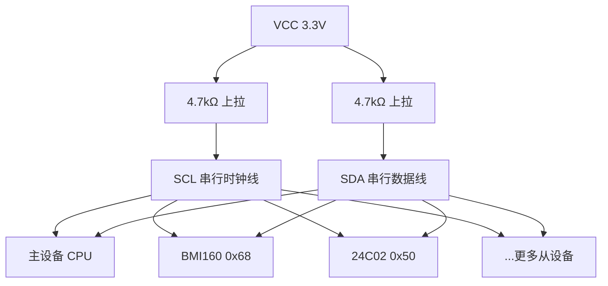
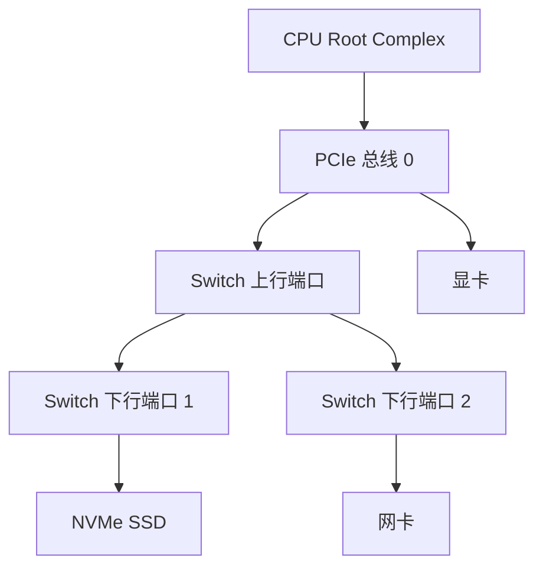
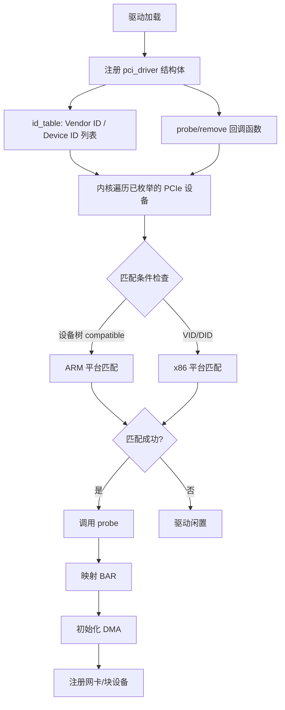

# 软硬件实战场景 [B→E]

> **本章学习目标**：
> - 掌握基于 Platform 总线的 LED 驱动完整开发流程
> - 掌握 <span class="green">I2C</span> 传感器驱动的框架搭建与调试方法
> - 了解 <span class="green">PCIe</span> 高速<span class="red">设备驱动</span>的核心机制与性能优化

---

## 实战场景1：基于 Platform 总线的 LED 驱动开发

---

### <strong>硬件分析：LED 与 GPIO 引脚连接原理及电气特性</strong>

<span class="green">LED</span>（发光二极管）是嵌入式开发中最基础的外设。<br>
其驱动本质是通过 <span class="green">GPIO</span> 引脚控制电流通断。<br>
核心是理解 <span class="red">"LED 单向导电性"</span> 与 <span class="red">"GPIO 输出能力匹配"</span> 两大关键点。<br>


<span class="orange"><strong>1. LED 核心工作原理</strong></span><br>

LED 是单向导电器件。<br>
只有当阳极（长引脚）电压高于阴极（短引脚）一定值（正向压降 <span class="green">`Vf`</span>）时才会导通发光。<br>
导通时需串联限流电阻防止电流过大烧毁器件。<br>

关键参数：<br>

| 参数 | 说明 | 典型值 |
| --- | --- | --- |
| 正向压降 `Vf` | 红色 LED 约 1.8-2.2V，蓝色/绿色 LED 约 2.8-3.2V | 需查具体型号手册 |
| 额定电流 `If` | 常规指示类 LED 为 1-20mA | 10mA 左右亮度适中且功耗低 |

<span class="orange"><strong>2. <span class="green">GPIO</span> 引脚电气特性与匹配要求</strong></span><br>

嵌入式 CPU 的 <span class="green">GPIO</span> 引脚输出能力有限，需满足 <span class="blue">"电压 + 电流"双匹配</span>：<br>

* <span class="orange"><strong>电压匹配</strong></span>：<span class="green">GPIO</span> 输出高电平时，电压需高于 LED 正向压降。<br>
  如 <span class="green">3.3V</span> GPIO 可驱动红色/蓝色 LED，<span class="green">5V</span> GPIO 兼容性更广。<br>
* <span class="orange"><strong>电流匹配</strong></span>：GPIO 最大输出电流通常为 <span class="green">2-20mA</span>。<br>
  如全志 H3 的 GPIO 最大输出电流为 <span class="green">8mA</span>，需通过限流电阻控制电流在额定范围内。<br>

<span class="orange"><strong>3. 经典硬件连接方案（以 3.3V <span class="green">GPIO</span> 为例）</strong></span><br>

两种主流连接方式，推荐 <span class="blue">"GPIO 拉低导通"</span>（GPIO 低电平时 LED 亮，高电平时截止，避免 GPIO 悬空漏电）。<br>

限流电阻计算：<br>
以 <span class="green">3.3V</span> GPIO、红色 LED（<span class="green">`Vf=2V`</span>、<span class="green">`If=10mA`</span>）为例，<br>
电阻值 <span class="green">`R=(Vcc-Vf)/If=(3.3-2)/0.01=130Ω`</span>。<br>
工程上选 <span class="green">1kΩ</span>（电流约 1.3mA，亮度足够且更安全）。<br>

<span class="orange"><strong>4. 硬件选型注意事项</strong></span><br>

* 避免直接将 LED 接 <span class="green">GPIO</span> 引脚（无限流电阻）：会导致 GPIO 过流烧毁。<br>
* 高亮度 LED 需外接驱动电路：若 LED 额定电流超过 GPIO 最大输出电流（如 <span class="green">50mA</span>），需通过三极管或 MOS 管扩流，GPIO 仅控制扩流器件的通断。<br>

---

### <strong>新手入门：最简 LED 驱动代码编写（含设备树节点）</strong>

基于 <span class="red">Platform 总线</span> 的驱动核心是 <span class="blue">"设备-驱动分离"</span>：<br>
<span class="red">设备树</span>描述 LED 的硬件信息（如 <span class="green">GPIO</span> 引脚、兼容标识）。<br>
驱动代码通过 <span class="red">Platform 总线</span> 框架与设备树匹配，匹配成功后初始化硬件。<br>

这种架构的优势是 <span class="blue">硬件配置变更时，仅需修改设备树无需改动驱动。</span><br>

<span class="orange"><strong>1. <span class="red">设备树</span>节点编写</strong></span><br>

```dts
/* 添加到开发板设备树根节点 */
led0: led@0 {
    compatible = "vendor,led-platform";  // 与驱动的 of_match_table 匹配
    status = "okay";
    led-gpios = <&gpio1 5 GPIO_ACTIVE_LOW>;  // GPIO1 组第 5 号引脚，低电平点亮
};
```

<span class="orange"><strong>2. 最简 LED 驱动代码</strong></span><br>

```c
#include <linux/module.h>
#include <linux/platform_device.h>
#include <linux/gpio.h>
#include <linux/of_gpio.h>

static int led_gpio;  // 保存 LED 对应的 GPIO 编号

/* probe 函数：匹配成功后调用，初始化硬件 */
static int led_probe(struct platform_device *pdev)
{
    struct device *dev = &pdev->dev;
    int ret;

    // 1. 从设备树获取 GPIO 资源
    led_gpio = of_get_named_gpio(dev->of_node, "led-gpios", 0);
    if (led_gpio < 0) {
        dev_err(dev, "failed to get led-gpios\n");
        return led_gpio;
    }

    // 2. 申请 GPIO（devres 自动释放）
    ret = devm_gpio_request(dev, led_gpio, "led-gpio");
    if (ret) {
        dev_err(dev, "failed to request gpio\n");
        return ret;
    }

    // 3. 配置 GPIO 为输出模式，默认熄灭（低电平点亮则默认输出高电平）
    ret = gpio_direction_output(led_gpio, 1);
    if (ret) {
        dev_err(dev, "failed to set gpio direction\n");
        return ret;
    }

    dev_info(dev, "led platform driver probed\n");
    return 0;
}

/* remove 函数：设备移除时调用 */
static int led_remove(struct platform_device *pdev)
{
    gpio_set_value(led_gpio, 1);  // 熄灭 LED
    dev_info(&pdev->dev, "led platform driver removed\n");
    return 0;
}

/* 设备树匹配表 */
static const struct of_device_id led_of_match[] = {
    { .compatible = "vendor,led-platform" },
    { }
};
MODULE_DEVICE_TABLE(of, led_of_match);

/* platform_driver 结构体 */
static struct platform_driver led_platform_driver = {
    .probe  = led_probe,
    .remove = led_remove,
    .driver = {
        .name = "led-platform",
        .of_match_table = led_of_match,
    },
};

module_platform_driver(led_platform_driver);
MODULE_LICENSE("GPL");
```

<span class="blue">最简驱动实现了"设备树匹配 → GPIO 申请 → 方向配置 → 亮灭控制"的核心流程。</span><br>

---

### <strong>编译与测试：Makefile 编写与 `insmod` 加载后控制灯亮灭</strong>

编译与测试需依赖 <span class="blue">"与开发板内核版本一致的内核源码"</span>。<br>
此处基于全志 H3 开发板（内核版本 <span class="green">5.15.71</span>）演示。<br>

<span class="orange"><strong>1. 编写 Makefile（复用通用驱动编译模板）</strong></span><br>

```makefile
# 1. 指定要编译的驱动模块（生成 led_platform_drv.ko）
obj-m += led_platform_drv.o

# 2. 开发板对应的内核源码路径（必须是已配置并编译过的内核）
KERNELDIR := /home/user/linux-5.15.71-sunxi

# 3. 当前目录（自动获取，无需修改）
PWD := $(shell pwd)

# 4. 编译命令（指定架构和交叉编译工具链）
all:
	# -C：进入内核源码目录执行 Makefile；M=$(PWD)：指定驱动源码目录
	make -C $(KERNELDIR) M=$(PWD) ARCH=arm CROSS_COMPILE=arm-linux-gnueabihf- modules

# 5. 清理命令（删除编译生成的临时文件）
clean:
	make -C $(KERNELDIR) M=$(PWD) ARCH=arm CROSS_COMPILE=arm-linux-gnueabihf- clean
```

关键参数说明：<br>

| 参数 | 说明 |
| --- | --- |
| `ARCH=arm` | 目标硬件架构为 ARM（若为 RISC-V 架构，改为 `ARCH=riscv64`） |
| `CROSS_COMPILE=arm-linux-gnueabihf-` | 交叉编译工具链前缀（需与开发板架构匹配） |
| `-C $(KERNELDIR)` | 进入内核源码目录执行内核 Makefile |
| `M=$(PWD)` | 指定当前目录为驱动源码位置 |

<span class="orange"><strong>2. 编译与加载验证</strong></span><br>

```bash
# 1. 编译驱动（主机端执行）
make
# 生成 led_platform_drv.ko

# 2. 拷贝到开发板（通过 SCP/TFTP/U 盘）
scp led_platform_drv.ko root@192.168.1.100:/root/

# 3. 开发板端加载驱动
insmod led_platform_drv.ko
# 查看日志确认 probe 成功
dmesg | tail -n 5
[   12.345678] led platform driver probed

# 4. 控制 LED 亮灭（通过 sysfs GPIO 接口，独立于驱动外验证硬件）
echo 12 > /sys/class/gpio/export  # 假设 GPIO12 对应 LED
echo out > /sys/class/gpio/gpio12/direction
echo 0 > /sys/class/gpio/gpio12/value  # 点亮（低电平导通）
echo 1 > /sys/class/gpio/gpio12/value  # 熄灭

# 5. 卸载驱动
rmmod led_platform_drv
```

---

### <strong>高手优化：加入 devres 资源管理与 sysfs 接口（亮度调节）</strong>

最简驱动仅实现 <span class="blue">"亮灭"</span> 功能。<br>
实际开发中需优化 <span class="blue">"资源管理可靠性"</span> 和 <span class="blue">"用户态控制灵活性"</span>。<br>
核心优化点：<span class="red">devres 统一资源管理</span> + <span class="red">sysfs 接口</span> 实现亮度调节。<br>

<span class="orange"><strong>1. devres 资源管理（提升可靠性）</strong></span><br>

之前的驱动已用 <span class="green">`devm_gpio_request`</span>。<br>
但实际开发中可能用到多个资源（如定时器、中断）。<br>
<span class="red">devres</span>（Device Resource Management）框架可统一管理所有资源，<br>
驱动卸载时自动释放，避免遗漏。<br>

核心 API：<span class="green">`devm_kzalloc`</span>（内存分配）、<span class="green">`devm_timer_setup`</span>（定时器初始化）等。<br>

```c
/* 优化后的 probe：加入 devres 与 sysfs */
static int led_probe(struct platform_device *pdev)
{
    struct device *dev = &pdev->dev;
    struct led_priv *priv;
    int ret;

    // devm_kzalloc：内存自动释放
    priv = devm_kzalloc(dev, sizeof(*priv), GFP_KERNEL);
    if (!priv) return -ENOMEM;
    platform_set_drvdata(pdev, priv);

    // 获取 GPIO
    priv->led_gpio = of_get_named_gpio(dev->of_node, "led-gpios", 0);
    ret = devm_gpio_request(dev, priv->led_gpio, "led-gpio");
    if (ret) return ret;

    gpio_direction_output(priv->led_gpio, 1);  // 默认熄灭

    // 创建 sysfs 接口：/sys/bus/platform/devices/led@0/brightness
    ret = device_create_file(dev, &dev_attr_brightness);
    if (ret) return ret;

    return 0;
}
```

<span class="orange"><strong>2. <span class="green">sysfs</span> 接口实现亮度调节</strong></span><br>

通过 <span class="green">sysfs</span> 属性文件实现用户态控制：<br>

```c
/* sysfs 属性：brightness */
static ssize_t brightness_show(struct device *dev,
                               struct device_attribute *attr, char *buf)
{
    struct led_priv *priv = dev_get_drvdata(dev);
    int val = gpio_get_value(priv->led_gpio);
    return sprintf(buf, "%d\n", val ? 0 : 1);  // 0=亮, 1=灭（低电平导通）
}

static ssize_t brightness_store(struct device *dev,
                                struct device_attribute *attr,
                                const char *buf, size_t count)
{
    struct led_priv *priv = dev_get_drvdata(dev);
    int val;
    if (kstrtoint(buf, 10, &val) == 0) {
        gpio_set_value(priv->led_gpio, val ? 1 : 0);  // 0 点亮，1 熄灭
    }
    return count;
}

static DEVICE_ATTR_RW(brightness);
```

<span class="red">用户态</span>控制示例：<br>

```bash
# 点亮 LED
echo 0 > /sys/bus/platform/devices/led@0/brightness
# 熄灭 LED
echo 1 > /sys/bus/platform/devices/led@0/brightness
# 查看当前状态
cat /sys/bus/platform/devices/led@0/brightness
```

---

### <strong>专家视角：驱动的功耗优化（GPIO 低功耗模式配置）</strong>

嵌入式设备（如物联网终端）对功耗要求极高。<br>
LED 驱动的功耗优化核心是 <span class="red">GPIO 低功耗模式配置</span> 和闲置时断电。<br>
需结合硬件手册和内核低功耗框架实现。<br>

<span class="orange"><strong>1. 核心原理：<span class="green">GPIO</span> 低功耗模式</strong></span><br>

主流 ARM 架构 CPU 的 <span class="green">GPIO</span> 控制器支持多种低功耗模式。<br>
以全志 H3 为例：<br>

| 模式 | 功耗 | 说明 |
| --- | --- | --- |
| 普通模式 | 约 1-5mA | GPIO 持续供电，输出高/低电平 |
| 休眠模式 | 10uA 以下 | GPIO 引脚配置为高阻态或拉低/拉高，控制器时钟关闭 |
| 深度休眠模式 | 接近 0 | GPIO 模块断电，仅保留唤醒引脚有效 |

<span class="orange"><strong>2. 优化策略</strong></span><br>

LED 闲置时（如熄灭超过 10 秒），将 <span class="green">GPIO</span> 配置为休眠模式。<br>
需要点亮时，恢复为普通模式。<br>

```c
/* 功耗优化：闲置时进入休眠模式 */
static void led_power_save(struct led_priv *priv)
{
    if (priv->idle_time > 10 * HZ) {  // 闲置超过 10 秒
        // 配置 GPIO 为输入高阻态（休眠模式）
        gpio_direction_input(priv->led_gpio);
        // 或调用内核 PM 框架的 regulator_disable
    }
}

/* 唤醒时恢复输出模式 */
static void led_wake(struct led_priv *priv)
{
    gpio_direction_output(priv->led_gpio, 1);  // 恢复输出，默认熄灭
}
```

<span class="blue">功耗优化需权衡响应延迟与功耗收益，通常仅在电池供电场景启用。</span><br>

---

## 实战场景2：I2C 总线传感器驱动开发

---

### <strong>硬件背景：I2C 总线时序与传感器地址配置</strong>

<span class="green">I2C</span>（Inter-Integrated Circuit，集成电路间总线）是由飞利浦半导体开发的串行通信总线。<br>
驱动开发前必须掌握 <span class="blue">"总线物理特性""核心时序""传感器地址配置"</span> 三个硬件基础。<br>

<span class="orange"><strong>1. <span class="green">I2C</span> 总线核心物理结构</strong></span><br>

<span class="green">I2C</span> 总线仅需两根信号线，所有设备挂在总线上，采用 <span class="blue">"主从通信"</span> 模式：<br>



* <span class="green">SCL</span>（Serial Clock，串行时钟线）：主设备产生的时钟信号，用于同步数据传输。<br>
* <span class="green">SDA</span>（Serial Data，串行数据线）：双向传输数据，主从设备通过该线交换信息。<br>
* <span class="orange"><strong>上拉电阻</strong></span>：SCL 和 SDA 必须外接 <span class="green">4.7kΩ~10kΩ</span> 上拉电阻到 VCC（如 <span class="green">3.3V</span>）。<br>
  总线空闲时保持高电平（<span class="green">I2C</span> 总线为 <span class="blue">"开漏输出"</span> 特性，需上拉实现高电平）。<br>

---

### <strong>驱动框架：基于 `i2c_driver` 的驱动结构搭建</strong>

<span class="red">I2C 驱动</span> 遵循 Linux 内核 <span class="blue">"设备-驱动分离"</span> 架构。<br>
核心是 <span class="blue">"主设备控制器驱动 + 从设备驱动"</span>：<br>

<span class="orange"><strong>1. 主设备控制器驱动</strong></span><br>

由内核提供（如全志 H3 的 <span class="green">`sunxi-i2c`</span> 驱动）。<br>
负责实现 I2C 总线时序（SCL/SDA 电平控制），对外提供 <span class="green">`i2c_transfer`</span> 等通信 API。<br>

<span class="orange"><strong>2. 从<span class="red">设备驱动</span></strong></span><br>

开发者编写（如 BMI160 传感器驱动）。<br>
通过 <span class="green">`i2c_driver`</span> 结构体注册，调用主设备 API 与传感器通信。<br>
核心是 <span class="blue">"匹配从设备 → 初始化硬件 → 提供数据接口"</span>。<br>

```c
#include <linux/module.h>
#include <linux/i2c.h>

/* 匹配表：通过设备树 compatible 或 VID/DID 匹配 */
static const struct of_device_id bmi160_of_match[] = {
    { .compatible = "bosch,bmi160" },
    { }
};
MODULE_DEVICE_TABLE(of, bmi160_of_match);

static const struct i2c_device_id bmi160_id[] = {
    { "bmi160", 0 },
    { }
};
MODULE_DEVICE_TABLE(i2c, bmi160_id);

/* probe：匹配成功后初始化传感器 */
static int bmi160_probe(struct i2c_client *client,
                        const struct i2c_device_id *id)
{
    struct device *dev = &client->dev;
    int ret;

    // 验证传感器 ID（读取芯片 ID 寄存器 0x00）
    ret = i2c_smbus_read_byte_data(client, 0x00);
    if (ret < 0 || ret != 0xD1) {
        dev_err(dev, "bmi160 not found, chip_id=0x%02x\n", ret);
        return -ENODEV;
    }
    dev_info(dev, "bmi160 detected, chip_id=0x%02x\n", ret);

    // 初始化传感器：配置量程、滤波器等
    // ...

    return 0;
}

/* remove：清理 */
static int bmi160_remove(struct i2c_client *client)
{
    return 0;
}

static struct i2c_driver bmi160_driver = {
    .driver = {
        .name = "bmi160",
        .of_match_table = bmi160_of_match,
    },
    .probe    = bmi160_probe,
    .remove   = bmi160_remove,
    .id_table = bmi160_id,
};

module_i2c_driver(bmi160_driver);
MODULE_LICENSE("GPL");
```

<span class="blue">i2c_driver 的核心是匹配表（of_match_table/id_table）和 probe/remove 回调。</span><br>

---

### <strong>核心是通过 I2C 通信 API 与传感器寄存器交互</strong>

先写配置寄存器初始化传感器，再读数据寄存器获取原始数据。<br>
最后将原始数据转换为物理量（如加速度单位 <span class="green">m/s²</span>，角速度单位 <span class="green">°/s</span>）。<br>
核心 API 是 <span class="green">`i2c_transfer`</span>，可实现单次或批量的读写操作。<br>

<span class="orange"><strong>1. 核心通信 API 解析：`i2c_transfer`</strong></span><br>

<span class="green">`i2c_transfer`</span> 是 I2C 主设备提供的最核心通信函数。<br>
用于执行一个或多个 I2C 消息（<span class="green">`struct i2c_msg`</span>），实现任意读写逻辑。<br>

```c
// 函数原型：执行 I2C 消息数组，返回成功执行的消息数（失败返回负数）
int i2c_transfer(struct i2c_adapter *adap, struct i2c_msg *msgs, int num);

// I2C 消息结构体：描述单次读写操作的信息
struct i2c_msg {
    __u16 addr;     // 从设备地址（7 位，无需带读写位）
    __u16 flags;    // 操作标志：0 表示写，I2C_M_RD 表示读
    __u16 len;      // 数据长度（字节数）
    __u8 *buf;      // 数据缓冲区（写时存要发送的数据，读时存接收的数据）
};
```

关键注意：<br>

* <span class="green">`addr`</span> 是 7 位从设备地址，无需拼接读写位（<span class="green">`flags`</span> 中的 <span class="green">`I2C_M_RD`</span> 自动控制读写）。<br>
* 多个 <span class="green">`i2c_msg`</span> 可组成 <span class="blue">"消息链"</span>，<span class="green">`i2c_transfer`</span> 会按顺序执行，中间不插入停止信号。<br>
  如 <span class="blue">"写寄存器地址 → 读数据"</span> 可合并为一个消息链，提升效率。<br>
* 返回值：成功返回执行的消息数（如 2 个消息返回 2），失败返回负数错误码。<br>
  如 <span class="green">`-ETIMEDOUT`</span> 表示超时。<br>

```c
/* 示例：读取 BMI160 加速度数据（X/Y/Z 三轴，各 16bit） */
static int bmi160_read_accel(struct i2c_client *client, s16 *data)
{
    struct i2c_msg msgs[2];
    u8 reg_addr = 0x12;  // 加速度数据起始寄存器
    u8 buf[6];           // 3 轴 × 2 字节

    // 消息 1：写寄存器地址（告诉传感器从哪个寄存器开始读）
    msgs[0].addr = client->addr;
    msgs[0].flags = 0;   // 写操作
    msgs[0].len = 1;
    msgs[0].buf = &reg_addr;

    // 消息 2：读 6 字节数据
    msgs[1].addr = client->addr;
    msgs[1].flags = I2C_M_RD;  // 读操作
    msgs[1].len = 6;
    msgs[1].buf = buf;

    // 执行消息链（不插入停止信号）
    if (i2c_transfer(client->adapter, msgs, 2) != 2)
        return -EIO;

    // 拼接原始数据（小端序）
    data[0] = (s16)(buf[0] | (buf[1] << 8));  // X 轴
    data[1] = (s16)(buf[2] | (buf[3] << 8));  // Y 轴
    data[2] = (s16)(buf[4] | (buf[5] << 8));  // Z 轴

    return 0;
}
```

---

### <strong>调试实战：用 `i2cdetect` / `i2cdump` 排查总线通信问题</strong>

<span class="green">I2C</span> 通信问题是驱动开发中最常见的故障。<br>
核心表现为 <span class="blue">"设备未识别""读写超时""数据错误"</span>。<br>
无需编写代码即可通过内核自带工具快速定位。<br>

<span class="orange"><strong>1. 核心调试工具介绍</strong></span><br>

内核提供 <span class="green">`i2c-tools`</span> 工具集（需编译进内核或手动安装）。<br>
包含 <span class="green">`i2cdetect`</span>（检测总线设备）、<span class="green">`i2cdump`</span>（读取寄存器数据）、<span class="green">`i2cset`</span>（写寄存器）三大核心工具：<br>

| 工具 | 核心功能 | 关键参数 |
| --- | --- | --- |
| `i2cdetect` | 检测 I2C 总线上的从设备，显示设备地址 | `-y`：跳过交互确认；`总线号`：如 1 表示 i2c1 |
| `i2cdump` | 读取从设备的寄存器数据，以十六进制显示 | `-y 总线号 从设备地址` |
| `i2cset` | 向从设备指定寄存器写入数据 | `-y 总线号 从设备地址 寄存器 数值` |

工具安装（开发板端）：<br>

```bash
# 若开发板未预装，通过源码编译（主机端）
git clone https://git.kernel.org/pub/scm/utils/i2c-tools/i2c-tools.git
cd i2c-tools
make ARCH=arm CROSS_COMPILE=arm-linux-gnueabihf-
# 拷贝生成的 i2cdetect、i2cdump、i2cset 到开发板 /usr/bin 目录
```

<span class="orange"><strong>2. 典型排查流程</strong></span><br>

```bash
# 步骤 1：确认总线存在
ls /dev/i2c-*
/dev/i2c-1

# 步骤 2：扫描总线设备（检测 BMI160 是否在 0x68 地址）
i2cdetect -y 1
     0  1  2  3  4  5  6  7  8  9  a  b  c  d  e  f
00:          -- -- -- -- -- -- -- -- -- -- -- -- --
10: -- -- -- -- -- -- -- -- -- -- -- -- -- -- -- --
20: -- -- -- -- -- -- -- -- -- -- -- -- -- -- -- --
30: -- -- -- -- -- -- -- -- -- -- -- -- -- -- -- --
40: -- -- -- -- -- -- -- -- -- -- -- -- -- -- -- --
50: -- -- -- -- -- -- -- -- -- -- -- -- -- -- -- --
60: -- -- -- -- -- -- -- -- 68 -- -- -- -- -- -- --
# 0x68 地址有设备（BMI160）

# 步骤 3：读取芯片 ID 寄存器验证通信
i2cdump -y 1 0x68
     0  1  2  3  4  5  6  7  8  9  a  b  c  d  e  f    0123456789abcdef
00: D1 00 00 00 00 00 00 00 00 00 00 00 00 00 00 00    ?...............
# 0x00 寄存器值为 0xD1，与 BMI160 手册一致，通信正常

# 步骤 4：写入配置寄存器（如设置量程）
i2cset -y 1 0x68 0x41 0x03  # 写 0x41 寄存器，值 0x03（±4g 量程）
```

---

### <strong>专家优化：I2C 总线超时重传与错误恢复机制设计</strong>

入门级驱动仅实现基本通信功能。<br>
量产场景中需应对 <span class="blue">"总线干扰""传感器瞬时异常""电源波动"</span> 等问题。<br>
核心优化点是 <span class="red">"超时重传"</span>（解决瞬时干扰）和 <span class="red">"错误恢复"</span>（解决传感器异常），<br>
确保驱动长期稳定运行。<br>

```c
/* 带超时重传的 I2C 读取 */
static int bmi160_read_retry(struct i2c_client *client, u8 reg, u8 *val)
{
    int ret, retries = 3;

    while (retries--) {
        ret = i2c_smbus_read_byte_data(client, reg);
        if (ret >= 0) {
            *val = (u8)ret;
            return 0;  // 成功
        }
        // 失败：等待后重试
        msleep(10);
    }
    return ret;  // 3 次均失败，返回最后一次错误码
}

/* 错误恢复：总线复位 */
static int i2c_bus_recovery(struct i2c_adapter *adap)
{
    // 1. 发送 9 个时钟脉冲（释放被卡死的 SDA）
    // 2. 发送 STOP 信号
    // 3. 重新初始化总线
    return i2c_recover_bus(adap);
}
```

<span class="blue">超时重传的间隔和次数需根据实际场景调整，通常 3 次重传、间隔 10ms 可覆盖 90% 以上的瞬时干扰。</span><br>

---

## 实战场景3：PCIe 高速设备驱动开发

---

### <strong>硬件认知：PCIe 设备枚举与 BAR 空间映射原理</strong>

<span class="green">PCIe</span>（Peripheral Component Interconnect Express，高速外围组件互连）<br>
是替代传统 PCI/PCI-X 的高速串行总线。<br>
核心优势是高带宽（如 <span class="green">PCIe 3.0 x16</span> 带宽达 <span class="green">32GB/s</span>）、<br>
点对点通信和热插拔支持。<br>
广泛用于显卡、网卡、SSD 等高速设备。<br>

驱动开发前必须理解 <span class="red">"设备如何被识别"</span>（枚举）<br>
和 <span class="red">"如何与 CPU 通信"</span>（BAR 空间）两大硬件核心。<br>

<span class="orange"><strong>1. 设备枚举原理</strong></span><br>

<span class="green">PCIe</span> 设备通过 <span class="blue">"配置空间"</span> 向系统报告自身信息。<br>
内核启动时通过 <span class="green">"深度优先搜索"</span> 遍历总线树，<br>
读取每个设备的 <span class="green">Vendor ID</span> 和 <span class="green">Device ID</span>，<br>
建立设备列表。<br>



<span class="orange"><strong>2. BAR 空间映射</strong></span><br>

<span class="green">BAR</span>（Base Address Register，基址寄存器）是 <span class="red">PCIe 设备</span> 配置空间中的关键字段。<br>
用于向系统申请 <span class="blue">IO 内存空间</span>，<br>
CPU 通过访问 BAR 映射的内存地址与设备通信。<br>

| BAR 类型 | 用途 | 典型大小 |
| --- | --- | --- |
| BAR0 | 设备寄存器空间 | 4KB-64KB |
| BAR1 | 扩展寄存器或 64bit BAR 高地址 | 视设备而定 |
| BAR2/3 | 数据缓冲区或 DMA 描述符 | 64KB-数 MB |

---

### <strong>驱动核心：`pci_driver` 注册与 BAR 空间 `ioremap`</strong>

<span class="red">PCIe 驱动</span> 遵循 Linux 内核 <span class="blue">"设备-驱动分离"</span> 架构。<br>
核心是 <span class="green">`pci_driver`</span> 结构体（类比 I2C 的 <span class="green">`i2c_driver`</span>）。<br>
驱动通过注册该结构体与枚举后的 <span class="red">PCIe 设备</span> 匹配。<br>
匹配成功后完成 <span class="blue">"设备使能 → BAR 映射 → 硬件初始化"</span> 流程。<br>

<span class="orange"><strong>1. `pci_driver` 核心结构与匹配逻辑</strong></span><br>



```c
#include <linux/module.h>
#include <linux/pci.h>

/* VID/DID 匹配表 */
static const struct pci_device_id my_pcie_id_table[] = {
    { PCI_DEVICE(0x8086, 0x1234) },  // Intel 某网卡
    { 0 }
};
MODULE_DEVICE_TABLE(pci, my_pcie_id_table);

/* probe：匹配成功后初始化 */
static int my_pcie_probe(struct pci_dev *pdev, const struct pci_device_id *ent)
{
    struct device *dev = &pdev->dev;
    void __iomem *bar0_base;
    int ret;

    // 1. 使能设备（分配资源、唤醒设备）
    ret = pci_enable_device(pdev);
    if (ret) {
        dev_err(dev, "pci_enable_device failed\n");
        return ret;
    }

    // 2. 请求 BAR 区域（防止冲突）
    ret = pci_request_regions(pdev, "my_pcie_drv");
    if (ret) {
        dev_err(dev, "pci_request_regions failed\n");
        goto err_disable;
    }

    // 3. 映射 BAR0（获取虚拟地址）
    bar0_base = pci_iomap(pdev, 0, 0);
    if (!bar0_base) {
        dev_err(dev, "pci_iomap failed\n");
        ret = -ENOMEM;
        goto err_release;
    }

    // 4. 读取设备寄存器（验证映射成功）
    u32 val = readl(bar0_base + 0x00);
    dev_info(dev, "BAR0 offset 0x00 = 0x%08x\n", val);

    // 5. 初始化 DMA、中断、网络子系统等
    // ...

    return 0;

err_release:
    pci_release_regions(pdev);
err_disable:
    pci_disable_device(pdev);
    return ret;
}

/* remove：清理 */
static void my_pcie_remove(struct pci_dev *pdev)
{
    pci_release_regions(pdev);
    pci_disable_device(pdev);
}

static struct pci_driver my_pcie_driver = {
    .name     = "my_pcie_drv",
    .id_table = my_pcie_id_table,
    .probe    = my_pcie_probe,
    .remove   = my_pcie_remove,
};

module_pci_driver(my_pcie_driver);
MODULE_LICENSE("GPL");
```

<span class="blue">PCIe 驱动的 probe 核心是 pci_enable_device → pci_request_regions → pci_iomap 三步。</span><br>

---

### <strong>数据传输：PCIe DMA 通信实现（基于 `dmaengine` 框架）</strong>

<span class="red">PCIe</span> 的核心价值是 <span class="blue">"高速"</span>。<br>
而传统的 <span class="blue">"CPU 读写 BAR 寄存器"</span> 传输方式会因 CPU 干预导致带宽瓶颈。<br>

<span class="red">DMA</span>（Direct Memory Access，直接内存访问）可让 <span class="red">PCIe 设备</span> 绕开 CPU，<br>
直接与系统内存传输数据，是实现 <span class="red">PCIe</span> 高速传输的核心技术。<br>
Linux 内核推荐使用 <span class="green">`dmaengine`</span> 框架实现 DMA，避免直接操作硬件 DMA 控制器。<br>

```c
#include <linux/dmaengine.h>

/* DMA 传输示例：网卡接收数据 */
static int setup_dma_rx(struct pci_dev *pdev, void *buf, size_t len)
{
    struct dma_chan *chan;
    dma_addr_t dma_addr;
    struct dma_async_tx_descriptor *desc;
    dma_cookie_t cookie;

    // 1. 申请 DMA 通道（需设备树或 PCI 配置中指定）
    chan = dma_request_chan(&pdev->dev, "rx");
    if (IS_ERR(chan)) return PTR_ERR(chan);

    // 2. 映射内存为 DMA 可用地址
    dma_addr = dma_map_single(&pdev->dev, buf, len, DMA_FROM_DEVICE);
    if (dma_mapping_error(&pdev->dev, dma_addr)) return -ENOMEM;

    // 3. 准备 DMA 传输描述符
    desc = dmaengine_prep_slave_single(chan, dma_addr, len,
                                       DMA_FROM_DEVICE,
                                       DMA_PREP_INTERRUPT);
    if (!desc) {
        dma_unmap_single(&pdev->dev, dma_addr, len, DMA_FROM_DEVICE);
        return -ENOMEM;
    }

    // 4. 设置完成回调
    desc->callback = dma_rx_complete;
    desc->callback_param = buf;

    // 5. 提交并启动传输
    cookie = dmaengine_submit(desc);
    dma_async_issue_pending(chan);

    return 0;
}
```

<span class="blue">dmaengine 框架屏蔽了不同厂商 DMA 控制器的差异，驱动只需调用统一 API。</span><br>

---

### <strong>性能测试：用 `perf` 分析 PCIe 驱动的数据传输延迟</strong>

<span class="red">PCIe 驱动</span> 的 <span class="blue">"高速"</span> 特性需要通过量化测试验证。<br>
<span class="green">`perf`</span> 是 Linux 内核自带的性能分析工具。<br>

<span class="orange"><strong>1. `perf` 核心子命令与 <span class="green">PCIe</span> 性能测试场景</strong></span><br>

| 子命令 | 核心功能 | 适用测试场景 |
| --- | --- | --- |
| `perf stat` | 统计事件计数（如 CPU 周期、中断次数） | 测量传输延迟、CPU 占用率 |
| `perf record` | 采样并记录性能事件，生成报告 | 定位占用 CPU 高的函数（如驱动回调） |
| `perf report` | 解析 `perf record` 生成的报告，查看函数耗时 | 分析驱动代码中的性能瓶颈函数 |
| `perf top` | 实时显示系统中占用 CPU 高的函数 | 实时监控 DMA 传输时的 CPU 负载 |

<span class="orange"><strong>2. 典型测试命令</strong></span><br>

```bash
# 1. 统计 DMA 传输期间的 CPU 周期和中断次数
perf stat -e cycles,instructions,irq:irq_handler_entry \
          -a sleep 10

# 2. 采样驱动函数耗时（持续 30 秒）
perf record -g -p $(pidof my_pcie_app) -- sleep 30
perf report  # 查看报告，找出热点函数

# 3. 实时监控 DMA 传输时的 CPU 负载
perf top -g
```

<span class="blue">性能测试需在真实负载下进行，空闲系统数据无参考价值。</span><br>

---

## 本章小结

| 概念 | 一句话总结 |
| --- | --- |
| LED 硬件连接 | GPIO 低电平导通，串联限流电阻，推荐 GPIO 拉低方案 |
| Platform LED 驱动 | 设备树描述硬件，驱动通过 devm_gpio_request 控制亮灭 |
| Makefile 编译 | 交叉编译依赖内核源码，make -C KERNELDIR M=$(PWD) |
| devres + sysfs | devm_ 自动释放资源，sysfs 属性文件实现用户态控制 |
| GPIO 低功耗 | 闲置时配置为高阻态，降低功耗至 uA 级 |
| I2C 物理结构 | SCL+SDA 两线，开漏输出需上拉电阻，主从通信 |
| i2c_driver | 匹配表 + probe/remove，通过 i2c_transfer 与传感器通信 |
| i2c_transfer | 消息链机制，addr 为 7 位地址，flags 控制读写方向 |
| i2c-tools | i2cdetect 扫描设备，i2cdump 读寄存器，i2cset 写配置 |
| I2C 超时重传 | 3 次重传 + 10ms 间隔，覆盖 90% 以上瞬时干扰 |
| PCIe 枚举 | 深度优先搜索遍历总线树，读取配置空间 VID/DID |
| BAR 空间 | 设备向系统申请的 IO 内存区域，CPU 通过 ioremap 访问 |
| pci_driver | pci_enable_device → pci_request_regions → pci_iomap |
| dmaengine | 统一 DMA 框架，屏蔽厂商差异，支持内存-设备直接传输 |
| perf | 内核自带性能分析工具，stat/record/report/top 多维度分析 |

---

## 练习

1. 计算 <span class="green">3.3V</span> GPIO 驱动蓝色 LED（<span class="green">`Vf=3.2V`</span>、<span class="green">`If=5mA`</span>）的限流电阻值，并解释工程选型。
2. 对比最简 LED 驱动与 devres 优化驱动的 <span class="green">`remove`</span> 函数差异，说明 devres 的优势。
3. 画出 <span class="green">I2C</span> 消息链 <span class="blue">"写寄存器地址 → 读 6 字节数据"</span> 的 Mermaid 流程图。
4. 为什么 <span class="green">`i2c_transfer`</span> 的 <span class="green">`addr`</span> 是 7 位地址？<span class="green">`I2C_M_RD`</span> 如何控制读写方向？
5. 解释 PCIe 的 <span class="green">BAR0</span> 和 <span class="green">BAR2</span> 的典型用途差异。
6. 对比 <span class="green">`dmaengine`</span> 与 CPU 轮询 BAR 寄存器的数据传输方式，说明 DMA 的性能优势。
