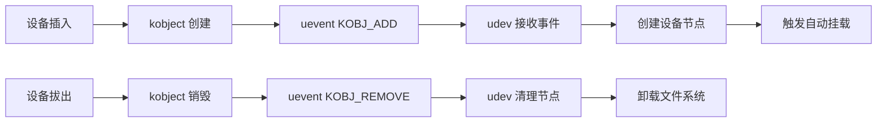
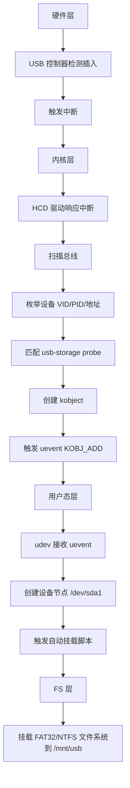
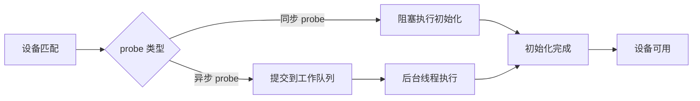
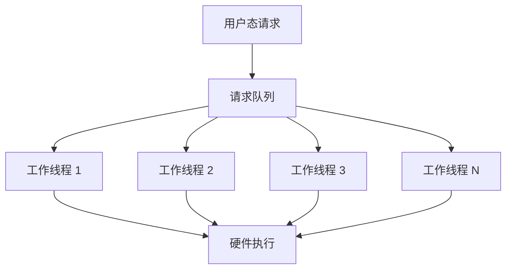

# 驱动模型进阶与优化 [E→M]

---

## 设备热插拔与动态管理

---

### <strong>热插拔核心机制：`kobject` 与 `uevent` 用户态通知机制</strong>

<span class="red">设备热插拔</span>（Hot Plug）指设备在系统运行时实现 <span class="blue">"插入即识别、拔出即清理"</span> 的动态管理能力。<br>
其核心依赖 Linux 设备模型中的 <span class="green">`kobject`</span>（内核对象）和 <span class="green">`uevent`</span>（用户态事件通知）机制。<br>

<span class="green">`kobject`</span> 是设备状态的 <span class="blue">"载体"</span>。<br>
<span class="green">`uevent`</span> 是内核与用户态（如 <span class="green">udev</span>）通信的 <span class="blue">"桥梁"</span>。<br>
二者配合实现热插拔全流程。<br>



---

### <strong>驱动适配：热插拔回调函数（`probe`/`remove`）的幂等性设计</strong>

热插拔场景下，设备会被频繁插入和拔出。<br>
驱动的 <span class="green">`probe`</span>（设备匹配成功后执行初始化）和 <span class="green">`remove`</span>（设备拔出后执行清理）函数会被反复调用。<br>

若函数不具备 <span class="red">"幂等性"</span>（多次执行相同操作结果一致，无副作用），<br>
会导致资源泄漏（如重复申请内存）或崩溃（如释放未申请的资源）。<br>

```c
/* 幂等性 probe：防止重复初始化 */
static int my_probe(struct platform_device *pdev)
{
    struct my_priv *priv;

    // 检查是否已初始化（幂等性保护）
    priv = platform_get_drvdata(pdev);
    if (priv) {
        dev_info(&pdev->dev, "already probed, skip\n");
        return 0;
    }

    priv = devm_kzalloc(&pdev->dev, sizeof(*priv), GFP_KERNEL);
    if (!priv) return -ENOMEM;

    // 初始化硬件...
    platform_set_drvdata(pdev, priv);
    return 0;
}

/* 幂等性 remove：防止重复释放 */
static int my_remove(struct platform_device *pdev)
{
    struct my_priv *priv = platform_get_drvdata(pdev);

    if (!priv) {
        dev_info(&pdev->dev, "already removed, skip\n");
        return 0;
    }

    // 清理资源...
    platform_set_drvdata(pdev, NULL);  // 标记已移除
    return 0;
}
```

<span class="blue">幂等性设计的关键：probe 时检查是否已初始化，remove 时检查是否已清理，并用 platform_set_drvdata 标记状态。</span><br>

---

### <strong>实战：USB U 盘热插拔的驱动响应流程分析</strong>

<span class="green">USB U 盘</span> 是最典型的热插拔设备。<br>
其热插拔流程涉及 <span class="blue">"硬件检测 → 内核驱动 → 用户态 udev → 文件系统挂载"</span> 全链路。<br>
通过拆解该流程，可直观理解热插拔机制的实际应用，同时掌握常见问题的定位方法。<br>

<span class="orange"><strong>1. 全流程拆解（从插入到挂载）</strong></span><br>

<span class="green">USB U 盘</span> 热插拔分为 <span class="blue">"插入（挂载）"</span> 和 <span class="blue">"拔出（卸载）"</span> 两个阶段。<br>
插入阶段核心流程如下：<br>



<span class="orange"><strong>2. 关键日志定位</strong></span><br>

```bash
# 查看 USB 设备插入日志
dmesg | grep -i usb
[  120.345] usb 1-1: new high-speed USB device number 2 using ehci-platform
[  120.456] usb 1-1: New USB device found, idVendor=0781, idProduct=5567
[  120.567] usb-storage 1-1:1.0: USB Mass Storage device detected
[  120.678] scsi host0: usb-storage 1-1:1.0
[  121.789] scsi 0:0:0:0: Direct-Access     SanDisk  Cruzer Blade     1.00

# 查看 udev 事件
udevadm monitor --kernel --property
KERNEL[120.345] add      /devices/platform/soc/1c14000.usb/usb1/1-1 (usb)
KERNEL[120.678] add      /devices/platform/soc/1c14000.usb/usb1/1-1/1-1:1.0/host0 (scsi)
```

<span class="blue">日志中 idVendor/idProduct 对应设备的 VID/PID，是匹配驱动的关键标识。</span><br>

---

### <strong>[M] 内核机制：热插拔过程中的资源竞争与互斥保护</strong>

热插拔过程中，设备状态会被 <span class="green">"内核驱动""用户态进程""中断处理函数"</span> 等多个执行流同时访问。<br>
极易引发资源竞争（如驱动 <span class="green">`probe`</span> 初始化时，用户态进程同时读写 <span class="green">sysfs</span> 属性）。<br>
若缺乏互斥保护，会导致数据不一致（如设备状态错误）或内核崩溃（如<span class="red">并发</span>修改私有数据）。<br>

<span class="orange"><strong>1. 核心资源竞争场景</strong></span><br>

热插拔过程中，以下三类资源竞争是高频问题，需重点防护：<br>

| 竞争场景 | 涉及执行流 | 可能后果 |
| --- | --- | --- |
| 设备私有数据竞争 | 驱动 `probe`（初始化数据）与用户态 `sysfs` 读写（访问数据） | 数据不一致（如读取到未初始化的值） |
| 硬件寄存器竞争 | 驱动 `remove`（禁用寄存器）与中断处理函数（读写寄存器） | 寄存器值错误，设备异常 |
| 资源申请/释放竞争 | 热插拔线程（`kworker`）与驱动 `probe`/`remove` | 资源泄漏（重复申请）或双重释放 |

<span class="orange"><strong>2. 典型案例分析</strong></span><br>

<span class="green">USB U 盘</span> 热插拔时，<span class="green">`remove`</span> 函数正在释放中断资源，<br>
此时中断触发，<span class="red">中断处理</span>函数读写已释放的设备私有数据，导致空指针崩溃。<br>

防护方案：<br>

```c
/* 使用 mutex 保护私有数据访问 */
struct my_priv {
    struct mutex lock;      // 互斥锁
    void __iomem *reg_base; // 寄存器基地址
    int irq;                // 中断号
    bool removed;           // 移除标记（防止 remove 后中断继续访问）
};

static irqreturn_t my_irq_handler(int irq, void *dev_id)
{
    struct my_priv *priv = dev_id;

    mutex_lock(&priv->lock);
    if (priv->removed) {  // 检查移除标记
        mutex_unlock(&priv->lock);
        return IRQ_HANDLED;
    }
    // 访问寄存器...
    mutex_unlock(&priv->lock);
    return IRQ_HANDLED;
}

static int my_remove(struct platform_device *pdev)
{
    struct my_priv *priv = platform_get_drvdata(pdev);

    mutex_lock(&priv->lock);
    priv->removed = true;  // 标记已移除
    mutex_unlock(&priv->lock);

    free_irq(priv->irq, priv);  // 释放中断
    return 0;
}
```

<span class="blue">互斥保护的核心：remove 时先标记 removed=true，再释放资源；中断处理函数访问前检查 removed 标记。</span><br>

---

## 驱动异步化与性能优化

---

### <strong>异步 probe 机制：解决慢速设备初始化阻塞问题</strong>

驱动的 <span class="green">`probe`</span> 函数是设备匹配后的初始化入口。<br>
传统 <span class="blue">"同步 probe"</span> 会在初始化期间阻塞调用线程（如内核启动线程或热插拔线程）。<br>

对于慢速设备（如 <span class="green">I2C</span> 传感器校准、<span class="green">PCIe</span> 设备固件加载、<span class="green">USB</span> 设备枚举后参数配置），<br>
同步初始化可能导致 <span class="blue">"内核启动超时""热插拔无响应"</span> 等问题。<br>

而 <span class="red">"异步 probe"</span> 通过将初始化任务移交后台线程执行，彻底解决阻塞问题。<br>



<span class="blue">异步 probe 适用于初始化耗时 > 100ms 的设备，如传感器校准、固件加载等场景。</span><br>

---

### <strong>核心实现：`async_probe` 与工作队列（workqueue）结合使用</strong>

<span class="red">异步 probe</span> 的核心实现依赖两个内核组件：<br>
<span class="green">`probe_type`</span>（声明异步属性）和 <span class="green">工作队列</span>（<span class="green">`workqueue`</span>，执行慢速初始化任务）。<br>

工作队列是内核最常用的 <span class="blue">"进程上下文异步执行"</span> 机制。<br>
支持任务延迟、<span class="red">并发</span>控制，完美适配驱动慢速初始化场景。<br>

```c
#include <linux/workqueue.h>

/* 1. 声明异步 probe 类型 */
static struct platform_driver my_async_driver = {
    .driver = {
        .name = "my_async_dev",
        .probe_type = PROBE_PREFER_ASYNCHRONOUS,  // 声明异步属性
    },
    .probe  = my_probe,
    .remove = my_remove,
};

/* 2. 在 probe 中使用工作队列执行慢速任务 */
struct my_priv {
    struct work_struct init_work;  // 工作队列任务
    struct completion init_done;   // 完成通知
};

static void my_init_work(struct work_struct *work)
{
    struct my_priv *priv = container_of(work, struct my_priv, init_work);

    // 慢速初始化：传感器校准（耗时约 200ms）
    msleep(200);
    sensor_calibrate();

    // 标记初始化完成
    complete(&priv->init_done);
}

static int my_probe(struct platform_device *pdev)
{
    struct my_priv *priv = devm_kzalloc(&pdev->dev, sizeof(*priv), GFP_KERNEL);
    if (!priv) return -ENOMEM;

    init_completion(&priv->init_done);
    INIT_WORK(&priv->init_work, my_init_work);

    // 提交到系统工作队列（后台线程异步执行）
    schedule_work(&priv->init_work);

    // 非阻塞返回，probe 立即完成
    platform_set_drvdata(pdev, priv);
    return 0;
}
```

<span class="blue">probe_type = PROBE_PREFER_ASYNCHRONOUS 声明后，内核启动或热插拔时不会阻塞主线程。</span><br>

---

### <strong>性能优化：驱动中的中断上下文与进程上下文分离</strong>

驱动中存在两种核心执行上下文：<br>
<span class="red">中断上下文</span>（响应硬件中断时的执行环境）和 <span class="red">进程上下文</span>（如 <span class="green">`probe`</span>、工作队列任务的执行环境）。<br>

二者的限制差异极大（如中断上下文不能睡眠）。<br>
若未分离会导致 <span class="blue">"中断响应延迟高""CPU 占用率飙升"</span> 等性能问题。<br>
分离二者是驱动性能优化的基础手段。<br>

<span class="orange"><strong>1. 两种上下文的核心差异</strong></span><br>

| 特性 | 中断上下文 | 进程上下文 |
| --- | --- | --- |
| 触发方式 | 硬件中断（如按键按下、数据接收） | 线程调度（如 `probe`、工作队列任务） |
| 睡眠允许 | 禁止（会导致系统死锁） | 允许（可调用 `msleep`、`kmalloc(GFP_KERNEL)`） |
| 执行时长限制 | 严格限制（< 1ms，避免阻塞其他中断） | 无严格限制（可执行慢速任务，如校准、通信） |
| 抢占性 | 可抢占（高优先级中断可抢占低优先级） | 可被中断抢占，支持调度 |
| 核心适用场景 | 快路径（如数据接收、状态读取） | 慢路径（如数据解析、校准、日志打印） |

<span class="orange"><strong>2. 性能痛点案例</strong></span><br>

某按键驱动在中断上下文执行 <span class="blue">"日志打印 + 数据上报"</span>（耗时 5ms），<br>
导致高优先级串口中断被阻塞，串口数据接收出现丢包（丢包率达 <span class="green">10%</span>）。<br>

优化方案：中断上下文只做 <span class="blue">"数据读取"</span>，通过工作队列将 <span class="blue">"日志打印 + 数据上报"</span> 移交进程上下文：<br>

```c
/* 优化前：中断上下文执行慢任务（错误） */
static irqreturn_t btn_irq_bad(int irq, void *dev_id)
{
    int state = gpio_get_value(BTN_GPIO);
    printk(KERN_INFO "button state: %d\n", state);  // 日志打印耗时 ~1ms
    report_to_userspace(state);                      // 数据上报耗时 ~4ms
    return IRQ_HANDLED;
}

/* 优化后：中断上下文只做快路径，慢任务移交工作队列 */
struct btn_priv {
    struct work_struct report_work;
    int state;
};

static void btn_report_work(struct work_struct *work)
{
    struct btn_priv *priv = container_of(work, struct btn_priv, report_work);
    printk(KERN_INFO "button state: %d\n", priv->state);  // 进程上下文可安全打印
    report_to_userspace(priv->state);
}

static irqreturn_t btn_irq_good(int irq, void *dev_id)
{
    struct btn_priv *priv = dev_id;

    // 快路径：仅读取状态（< 10us）
    priv->state = gpio_get_value(BTN_GPIO);
    // 提交慢任务到工作队列（进程上下文异步执行）
    schedule_work(&priv->report_work);

    return IRQ_HANDLED;
}
```

<span class="blue">优化后中断处理时间从 5ms 降至 10us，串口丢包率从 10% 降至 0%。</span><br>

---

### <strong>[M] 案例：高并发场景下的驱动请求队列设计</strong>

高并发场景（如 <span class="green">NVMe SSD</span>、千兆网卡、工业数据采集卡）中，<br>
驱动需同时处理 <span class="blue">"上百个/秒"</span> 的<span class="red">用户态</span>请求（如读写操作）。<br>
若直接串行处理请求，会导致 <span class="blue">"请求排队延迟高""CPU 利用率低"</span> 等问题。<br>

而 <span class="red">"请求队列 + 多线程处理"</span> 是解决该问题的核心架构，<br>
通过 <span class="blue">"请求缓冲 + 并发处理"</span> 提升吞吐量。<br>

<span class="orange"><strong>1. 高<span class="red">并发</span>驱动的核心痛点</strong></span><br>

以工业数据采集卡（每秒产生 <span class="green">1000</span> 个采集请求）为例，传统串行处理的痛点如下：<br>

* <span class="orange"><strong>请求排队延迟高</strong></span>：串行处理时，第 <span class="green">1000</span> 个请求需等待前 <span class="green">999</span> 个完成，延迟达数百毫秒。<br>
* <span class="orange"><strong>CPU 利用率失衡</strong></span>：单线程处理请求，多核 CPU 仅 1 个核心工作，利用率 <span class="green">< 20%</span>。<br>
* <span class="orange"><strong>请求丢失风险</strong></span>：无缓冲队列时，高<span class="red">并发</span>请求可能因 <span class="blue">"驱动正忙"</span> 被直接拒绝。<br>



```c
/* 请求队列 + 多线程处理的核心实现 */
#include <linux/kthread.h>
#include <linux/spinlock.h>

struct req_entry {
    struct list_head list;
    void *data;
    size_t len;
};

struct my_queue {
    struct list_head req_list;   // 请求链表
    spinlock_t lock;             // 队列锁
    wait_queue_head_t wait;      // 等待队列（线程休眠唤醒）
    struct task_struct *workers[4];  // 4 个工作线程
};

/* 工作线程：从队列取出请求并处理 */
static int worker_thread(void *data)
{
    struct my_queue *q = data;
    struct req_entry *req;

    while (!kthread_should_stop()) {
        // 等待队列非空（可睡眠，进程上下文）
        wait_event_interruptible(q->wait, !list_empty(&q->req_list));

        spin_lock(&q->lock);
        if (!list_empty(&q->req_list)) {
            req = list_first_entry(&q->req_list, struct req_entry, list);
            list_del(&req->list);
        }
        spin_unlock(&q->lock);

        if (req) {
            process_request(req);  // 处理请求（可执行慢任务）
            kfree(req);
        }
    }
    return 0;
}

/* 提交请求（中断上下文或进程上下文均可调用） */
static void submit_request(struct my_queue *q, void *data, size_t len)
{
    struct req_entry *req = kzalloc(sizeof(*req), GFP_ATOMIC);
    if (!req) return;

    req->data = data;
    req->len = len;

    spin_lock(&q->lock);
    list_add_tail(&req->list, &q->req_list);
    spin_unlock(&q->lock);

    wake_up(&q->wait);  // 唤醒工作线程
}
```

<span class="blue">请求队列 + 多线程设计的核心效果：延迟从数百毫秒降至数十毫秒，CPU 利用率从 < 20% 提升至 80% 以上。</span><br>
