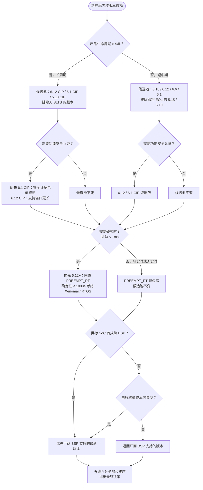
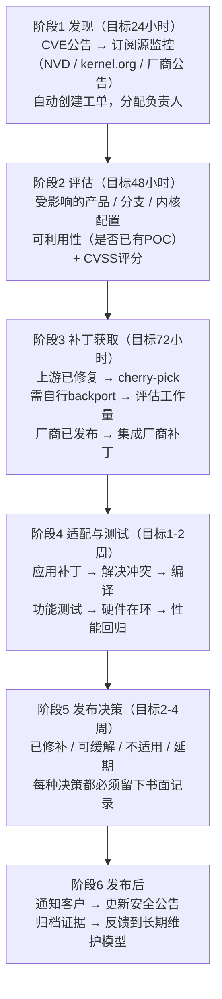

# 16.2 内核版本选型决策

> 所属章节：第16章 内核版本与启动架构设计
>
> 难度：[E] | 预计阅读时间：90分钟

---

> 本节覆盖：五维评估模型（生命周期/BSP/实时/认证/团队）的评分标准与加权计算、三个产品的完整选型推演、六个 LTS 版本的选型视角剖析、四层决策树，以及选定版本之后的 backport 策略与 CVE 响应流程。
>
> 16.1 建立了版本生态的全景认知——有哪些版本、各自维护到什么时候。本节把认知变成决策：给出一套可在技术评审会上辩护的选型方法论，并用三个约束完全不同的产品完整走一遍。

## 16.2.1 五维评估模型详解
---

<!-- 【待补图】三个产品对比信息图（★必要，建议生图）
生图提示词:信息图风格：三列布局——工业 PLC（工厂图标）/IoT 摄像头（家居图标）/机器人（机械臂图标），每列列出关键参数（生命周期/认证/实时/团队）。配色克制，中文标注。 -->

<!-- 【待补图】五维评估雷达图（★必要，建议生图）
生图提示词:雷达图：5 个轴（生命周期/BSP/实时/认证/团队），三个产品（A/B/C）用不同颜色线条绘制，直观显示差异。可用 Excel/Python matplotlib 生成。白底，中文标注。 -->

### 开篇：三个产品的内核版本选择困境

你是某硬件公司的Linux平台技术负责人，同时负责三款差异化产品的内核选型。公司CTO在季度技术评审会上给你提出了一个看似简单却暗藏陷阱的问题："我们到底应该用哪个Linux内核版本？"

**产品A：工业PLC控制器**
- 预期生命周期：15年（典型的工业自动化设备寿命）
- 功能安全认证：需要IEC 61508 SIL 2认证
- 硬件平台：NXP i.MX RT1170 + Cortex-A55核心板
- 实时性要求：循环周期1ms，抖动<50us
- 团队配置：5人嵌入式团队，1人有内核经验

**产品B：消费级IoT摄像头**
- 预期生命周期：3年（消费电子产品迭代速度）
- 功能安全认证：无
- 硬件平台：全志T113（平头哥RISC-V核心）
- 实时性要求：软实时（视频编码延迟<100ms即可）
- 团队配置：8人团队，3人有Linux经验，追求快速上市

**产品C：协作机器人控制器**
- 预期生命周期：8年（机器人行业标准）
- 功能安全认证：ISO 10218（机器人安全）+ IEC 61508 SIL 1
- 硬件平台：瑞萨RA8D1 + 外部DDR
- 实时性要求：硬实时，关节控制周期250us，抖动<10us
- 团队配置：12人团队，2名专职内核工程师

三款产品，三种完全不同的约束组合。选6.18最新LTS？选6.12 CIP SLTS？还是选5.10最稳定的老版本？每个选择背后都有深刻的技术、商业和团队维度的trade-off。

**这不是一个"哪个版本最好"的问题，而是"哪个版本最适合你的产品特征"的问题。**

本节给出一个经过多个工业项目验证的**五维评估模型**，配合一棵**四层决策树**，并走完三个产品的完整选型过程，展示这套方法论在真实约束下如何运作。

---

### 五维评估模型：超越"选最新LTS"的系统性方法论

> 💡 内核版本选型是一个多目标优化问题，需要在五个维度之间做trade-off。没有"最优"版本，只有"最适合"的版本。

#### 为什么需要五维模型？

很多团队在选型时只看一个维度——版本号是不是最新的。这种单维度思维导致的结果往往是：

- 选了最新版本，发现SoC厂商的BSP还没跟上，自己花三个月移植驱动
- 选了LTS版本，但没注意EOL时间，产品上市一年内核就停止维护了
- 选了社区维护的版本，发现需要功能安全认证时找不到支持证据

**五维评估模型**将选型问题拆解为五个独立维度，每个维度有明确的评分标准，最终通过加权计算得到一个量化的推荐排序。这种方法的核心优势在于：

1. **可视化**：将隐性经验转化为显性的评分数字
2. **可辩护**：每个评分都有明确依据，可以在技术评审会上解释
3. **可复用**：同一套方法适用于不同产品，只需调整权重
4. **可演进**：随着产品需求变化，重新评估即可调整方向

#### 五维模型概览

| 维度 | 英文标识 | 典型权重范围 | 核心问题 |
|------|---------|-------------|---------|
| **生命周期匹配** | LIFECYCLE | 25%-35% | 内核支持是否覆盖产品全生命周期？ |
| **BSP可用性** | BSP | 20%-30% | SoC厂商是否支持你选的内核？ |
| **实时需求** | REALTIME | 10%-20% | 需要PREEMPT_RT还是Xenomai，或不需要？ |
| **认证要求** | CERT | 10%-20% | 功能安全认证对内核版本有什么约束？ |
| **团队资源** | TEAM | 10%-15% | 团队有维护这个版本的能力吗？ |

**加权总分 = LIFECYCLE × w₁ + BSP × w₂ + REALTIME × w₃ + CERT × w₄ + TEAM × w₅**

每个维度评分1-5分，1分为严重不匹配，5分为完美匹配。最终加权得分4.0以上为强烈推荐，3.0-4.0为条件推荐，3.0以下为不推荐。

---

#### 维度一：生命周期匹配（LIFECYCLE）

这是五个维度中权重最高的一个，因为内核生命周期与产品生命周期的不匹配是最昂贵的错误——它意味着在产品生命中期被迫进行高风险的内核升级，或者在缺乏安全补丁的情况下运行，两者都是不可接受的。

##### 评分标准

| 评分 | 条件 | 含义 |
|------|------|------|
| **5分** | 内核EOL ≥ 产品EOL + 3年缓冲 | 完全覆盖，有充足升级窗口 |
| **4分** | 内核EOL ≥ 产品EOL + 1年缓冲 | 基本覆盖，需关注末期维护 |
| **3分** | 内核EOL ≈ 产品EOL（±6个月） | 临界匹配，EOL同步带来风险 |
| **2分** | 内核EOL < 产品EOL - 6个月 | 不匹配，产品退役前内核先停止维护 |
| **1分** | 内核已EOL或即将在1年内EOL | 严重不匹配，安全风险极高 |

##### 缓冲期的工程含义

为什么需要缓冲期？因为在产品生命周期的最后阶段，通常还有以下活动需要内核支持：

- **尾货生产**：最后一批设备生产可能需要6-12个月
- **现场维护**：已部署设备需要安全补丁和bug修复
- **固件更新**：即使硬件停产，OTA更新通道仍需维护
- **认证维持**：某些认证需要持续的安全更新证据

**推荐缓冲期**：

| 产品类型 | 最小缓冲期 | 原因 |
|---------|-----------|------|
| 消费电子（2-3年） | 6个月 | 迭代快，EOL后可快速切换新平台 |
| 工业设备（5-10年） | 1-2年 | 认证维持、现场维护需求 |
| 基础设施（10-15年） | 2-3年 | 升级窗口稀缺，认证周期长 |

##### 内核生命周期来源的层级

不同来源的内核支持承诺可靠性不同，评估时需要区分：

| 支持来源 | 可靠性等级 | 支持周期 | 适用场景 |
|---------|-----------|---------|---------|
| **上游LTS**（kernel.org） | ★★★★☆ | 2-4年 | 通用产品，有升级能力 |
| **CIP SLTS** | ★★★★★ | 10年 | 工业/基础设施长周期产品 |
| **厂商BSP维护** | ★★★☆☆ | 厂商决定（通常3-5年） | 厂商锁定平台 |
| **商业支持**（Timesys等）| ★★★★☆ | 可购买延长 | 有预算的商业产品 |
| **自主维护** | ★★☆☆☆ | 团队能力决定 | 有大内核团队的公司 |

> ⚠️ 不要把"上游LTS"和"CIP SLTS"混淆。上游LTS的6.12支持到2028年底（约4年），但CIP SLTS的6.12支持到2035年6月（约10年）。同一个版本号，不同的支持来源，生命周期差异巨大。

##### 计算示例

**产品A（工业PLC，15年寿命）选6.12 LTS**：
- 上游LTS EOL：2028年12月（距离2026年9月约2.3年）
- 产品EOL：2040年（15年寿命）
- 匹配结果：内核EOL远早于产品EOL → 仅看上游LTS是1分
- 但如果选CIP SLTS 6.12：支持到2035年6月 → 仍不够15年，需规划中期升级
- **CIP SLTS 6.12评分**：内核支持10年，产品需15年 → 仍需要在第8-10年升级 → 3分

**产品B（IoT摄像头，3年寿命）选6.18 LTS**：
- 上游LTS EOL：2028年12月
- 产品EOL：2028年（3年寿命）
- 匹配结果：内核EOL > 产品EOL + 1年 → **5分**

---

#### 维度二：BSP可用性（BSP）

BSP（Board Support Package）是嵌入式Linux的命脉。一个内核版本理论上再好，如果SoC厂商不提供对应的BSP支持，你也可能需要投入数月时间自行移植驱动。这个维度评估的是"选择的内核版本在目标硬件上的可用程度"。

##### BSP支持的三种状态

| 状态 | 定义 | 风险等级 | 典型工作量 |
|------|------|---------|-----------|
| **主线支持** | 驱动已合入linux-stable主线，无需厂商补丁 | 低 | 零额外工作 |
| **厂商BSP** | SoC厂商提供基于特定内核版本的完整BSP | 中 | 集成工作量1-4周 |
| **社区移植** | 依赖社区（如Armbian/OpenEmbedded）的移植 | 中高 | 调试工作量2-8周 |
| **无支持** | 没有现成BSP，需自行移植 | 极高 | 3-12个月 |

##### BSP评估检查清单（20项）

以下检查清单来自多个工业项目的实际经验，每一项都可能导致选型方向的改变：

**核心功能（必须全部满足）**：

| # | 检查项 | 检查方法 | 不通过的影响 |
|---|--------|---------|-------------|
| 1 | CPU核心启动（SMP） | 确认设备树包含所有CPU节点 | 多核无法使用 |
| 2 | 内存控制器初始化 | 检查DDR初始化代码和参数 | 系统无法启动 |
| 3 | 时钟/电源管理 | 确认cpufreq/clk驱动可用 | 性能/功耗异常 |
| 4 | 串口调试输出 | 早期printk能输出到UART | 无法调试启动问题 |
| 5 | 存储控制器驱动 | eMMC/SD/NAND驱动可用 | 无法加载rootfs |

**外设支持（按需评估）**：

| # | 检查项 | 检查方法 | 不通过的影响 |
|---|--------|---------|-------------|
| 6 | 以太网/MAC驱动 | 确认网络接口可用 | 无法联网 |
| 7 | USB控制器驱动 | Host/Device/OTG模式 | USB外设不可用 |
| 8 | 显示接口（LCD/HDMI/DSI） | 确认DRM驱动和模式配置 | 无显示输出 |
| 9 | GPU/VPU加速 | 确认是否有开源/闭源驱动 | 图形/视频性能差 |
| 10 | 音频编解码器 | ALSA驱动可用性 | 无音频功能 |
| 11 | CAN总线接口 | SocketCAN驱动支持 | 工业通信不可用 |
| 12 | 定时器/PWM | 确认PWM和timer驱动 | 实时控制受限 |
| 13 | ADC/DAC | IIO子系统驱动 | 模拟信号采集不可用 |
| 14 | GPIO/中断 | pinctrl和irqchip驱动 | 基本I/O不可用 |
| 15 | DMA控制器 | dmaengine驱动 | 外设性能受限 |

**软件生态（影响长期维护）**：

| # | 检查项 | 检查方法 | 不通过的影响 |
|---|--------|---------|-------------|
| 16 | Yocto/Buildroot支持 | 确认有对应的layer/recipe | 构建系统需自行开发 |
| 17 | U-Boot版本匹配 | SPL/U-Boot支持目标内核版本 | 无法启动 |
| 18 | 设备树源码（DTS）可用 | 厂商提供完整DTS或主线已合入 | 需自行编写DTS |
| 19 | 内核配置片段（defconfig） | 有参考config或defconfig | 需从零配置内核 |
| 20 | 厂商补丁管理策略 | 厂商是否有upstreaming计划 | 长期维护困难 |

##### BSP评分标准

| 评分 | 条件 |
|------|------|
| **5分** | 20项全部通过，主线支持成熟 |
| **4分** | 核心5项全部通过，外设≥80%通过，有厂商BSP |
| **3分** | 核心5项通过，外设50-80%，需部分自行开发 |
| **2分** | 核心5项部分失败，需大量移植工作 |
| **1分** | 核心功能缺失，无法在该版本上启动 |

> 💡 在BSP评估阶段，一个非常有用的工具是`git log --oneline --grep="你的SoC型号"`在linux-stable仓库中搜索提交记录。这能直观地看到主线对你目标SoC的支持程度。

##### 厂商BSP锁定效应

这是嵌入式Linux最现实的一面——**大多数SoC厂商的BSP锁定在特定内核版本上**。例如：

| SoC厂商 | 典型BSP版本 | 升级灵活性 |
|---------|------------|-----------|
| NXP（i.MX系列）| 通常提供6.1/6.6 BSP | 较好，有LTS跟踪 |
| 瑞萨（RZ/G系列）| CIP SLTS对齐（5.10/6.1/6.12）| 很好，参与CIP项目 |
| TI（Sitara系列）| 通常提供5.10/6.1 BSP | 一般，升级较慢 |
| 全志（Allwinner）| 社区支持为主 | 依赖社区，不稳定 |
|  Rockchip | 主线支持较好 | 较好 |
| 高通 | 通常为Android ACK版本 | 差，高度定制 |

**厂商BSP锁定带来的约束**：

1. **版本跳跃成本**：从厂商BSP版本升级到新LTS，需要rebase所有厂商补丁
2. **补丁质量差异**：有些厂商的补丁是"upstream-ready"的，有些是hack式的
3. **测试覆盖**：厂商BSP通常在特定硬件配置上充分测试，偏离这个配置风险增大
4. **安全更新延迟**：厂商BSP的安全补丁通常滞后于上游LTS数周到数月

> ⚠️ 只看版本号选最新、忽略 BSP 成熟度，是最常见的选型踩坑方式。一个真实案例：某团队为新产品选了 6.12 LTS（最新 CIP SLTS），但目标 SoC（某国产 RISC-V 芯片）的厂商 BSP 只支持到 5.15。结果团队花了 4 个月移植驱动，产品上市延期，竞争对手抢先占领市场。BSP 评估必须在版本选择之前完成。

---

#### 维度三：实时需求（REALTIME）

实时性是内核选型中最容易产生误解的维度。"我们需要实时"这句话背后可能意味着完全不同的技术需求。

##### 实时性的三个层级

| 层级 | 延迟要求 | 适用场景 | 技术方案 |
|------|---------|---------|---------|
| **软实时** | 毫秒级（1-100ms）| 音视频处理、数据采集 | Linux + SCHED_FIFO |
| **硬实时** | 微秒级（10-1000us）| 运动控制、机器人关节 | PREEMPT_RT |
| **确定性实时** | 亚微秒级（<10us）| 精密运动控制、汽车ECU | Xenomai / RTOS |

##### PREEMPT_RT主线化后的选型影响

Linux 6.12是里程碑版本——**PREEMPT_RT首次完全内置到主线内核**，不再需要打补丁。这一变化对选型有深远影响：

| 内核版本 | PREEMPT_RT状态 | 选型影响 |
|---------|---------------|---------|
| **≥ 6.12** | 主线内置，编译时启用CONFIG_PREEMPT_RT | 推荐用于新实时项目 |
| **6.1 - 6.6** | 需打RT补丁（由RT维护团队提供） | 可用但需额外维护 |
| **5.10 - 5.15** | 需打RT补丁，CIP SLTS提供RT分支 | 成熟稳定，工业验证 |
| **< 5.10** | RT补丁可能不再维护 | 不推荐新设计 |

**PREEMPT_RT的实际延迟表现**（基于公开基准测试数据）：

| 内核配置 | 典型延迟 | 最差情况延迟 | 适用场景 |
|---------|---------|-------------|---------|
| No forced preemption（server） | 10-100ms | 数百ms | 服务器/非实时 |
| Voluntary kernel preemption | 1-10ms | 50-100ms | 桌面/轻度交互 |
| Preemptible kernel | 100us - 1ms | 5-10ms | 软实时 |
| **PREEMPT_RT** | **10-100us** | **50-200us** | **硬实时** |

##### Xenomai双核方案

当PREEMPT_RT的延迟仍然不够时（如要求<10us抖动），Xenomai是一个备选方案：

| 方案 | 延迟能力 | 复杂度 | 与Linux关系 |
|------|---------|--------|------------|
| PREEMPT_RT | 10-100us | 低（内核配置项） | 单内核 |
| Xenomai 3（Cobalt）| < 5us | 高（需打补丁、特殊API） | 双内核（co-kernel）|
| Xenomai 4（EVL）| < 5us | 中高 | 单内核但需core |

**Xenomai的选型注意事项**：

1. **API锁定**：Xenomai应用使用特殊API（如rt_task_create），与标准POSIX不完全兼容
2. **内核版本绑定**：Xenomai通常只支持特定内核版本，升级受限
3. **维护资源**：Xenomai社区比Linux小得多，长期支持存在不确定性
4. **调试复杂度**：双内核架构的调试比单内核困难得多

##### 实时需求评分标准

| 评分 | 条件 |
|------|------|
| **5分** | 版本内置PREEMPT_RT，且延迟验证通过 |
| **4分** | 有RT补丁可用且维护活跃，延迟验证通过 |
| **3分** | 有RT方案但需额外工作，延迟可能达标 |
| **2分** | 实时方案不成熟或需大量移植 |
| **1分** | 无实时支持，或已知延迟不达标 |

---

#### 维度四：认证要求（CERT）

功能安全认证是内核选型中最容易被低估的维度。很多工程师认为"认证是文档工作，选什么内核都能认证"——这是一个代价高昂的错误。

##### 功能安全标准与Linux内核的关系

| 标准 | 适用行业 | ASIL/SIL等级 | Linux适用性 |
|------|---------|-------------|------------|
| **IEC 61508** | 通用工业 | SIL 1-4 | SIL 1-2可用，SIL 3+需特殊架构 |
| **ISO 26262** | 汽车 | ASIL A-D | ASIL B可用，ASIL D需冗余架构 |
| **IEC 62304** | 医疗设备 | Class A-C | Class A-B可用 |
| **EN 50128** | 铁路 | SIL 0-4 | SIL 1-2可用 |
| **DO-178C** | 航空 | Level A-E | Linux通常不用于高安全等级 |

##### 认证对内核版本的核心约束

**约束1：确定性行为**
功能安全认证要求系统行为可预测。Linux内核的复杂性使其难以完全证明确定性，因此需要：
- 裁剪内核到最小功能集（减少不可预测性来源）
- 禁用动态加载（避免运行时变化）
- 固定内核配置，禁止运行时修改

**约束2：变更控制**
一旦内核通过认证，任何变更都需要重新评估。这意味着：
- **认证后不能随意升级内核版本**
- 安全补丁需要逐一评估影响
- 内核配置变更需要文档化和评审

**约束3：证据收集**
认证过程需要提供以下证据：
- 内核源代码的可追溯性
- 测试覆盖率报告
- 安全分析（FMEA/FTA）
- 变更历史记录

##### 商业认证内核选项

| 供应商 | 产品 | 认证等级 | 支持的版本 | 成本 |
|--------|------|---------|-----------|------|
| **Siemens/Mentor** | SAFECheck | IEC 61508 SIL 3 | 定制版本 | 高（需商务洽谈）|
| **Wind River** | Linux + Safety Profile | IEC 61508 SIL 3 | 5.10/6.1 | 高 |
| **Green Hills** | INTEGRITY（非Linux）| 各种 | N/A | 极高 |
| **CIP SLTS** | 开源 + 认证证据 | IEC 61508 SIL 1 | 5.10/6.1/6.12 | 免费 |

> 💡 CIP SLTS项目正在构建功能安全认证所需的安全证据包（safety evidence package），包括安全手册、FMEA分析、测试覆盖数据等。这对于需要通过IEC 61508 SIL 1-2的工业产品是一个极具价值的免费资源。

##### CIP SLTS的安全证据包

CIP项目为其SLTS内核提供以下认证支持材料：

| 材料 | 内容 | 价值 |
|------|------|------|
| **安全手册** | 内核的安全使用指南 | 认证必备文档 |
| **配置指南** | 推荐的内核配置选项 | 减少认证范围 |
| **测试套件** | 自动化测试覆盖 | 证据支持 |
| **CVE分析** | 已知漏洞和安全补丁追踪 | 安全评估 |
| **变更记录** | 所有SLTS补丁的详细记录 | 变更控制证据 |

##### 认证维度评分标准

| 评分 | 条件 |
|------|------|
| **5分** | 有商业认证支持（如Wind River），版本与认证绑定 |
| **4分** | CIP SLTS可用，有安全证据包，目标SIL 1-2 |
| **3分** | 需自行收集认证证据，有社区支持 |
| **2分** | 认证路径不明确，需大量投入 |
| **1分** | 认证要求与Linux不匹配（如SIL 3+无商业支持）|

> ⚠️ 功能安全认证选错内核版本的代价是按"年"计算的：某医疗设备团队选了 6.6 LTS（非 CIP SLTS），花 18 个月完成 IEC 62304 Class B 认证，认证完成 6 个月后 6.6 EOL。团队被迫重新选择内核并启动重新认证，额外消耗 12 个月和大量资金。**需要认证的产品，务必选择有超长期支持（CIP SLTS 或商业认证版本）的内核**——认证后不能随意升级。

---

#### 维度五：团队资源（TEAM）

团队资源是最诚实也最容易被忽视的维度。一个理论上完美的内核版本，如果你的团队没有能力维护它，那它就是错误的选择。

##### 维护能力自评

| 能力项 | 全职内核工程师 | 兼职/有经验 | 无经验 |
|--------|--------------|------------|--------|
| **上游LTS跟踪** | 可自行rebase和测试 | 可应用补丁但需指导 | 依赖厂商/社区 |
| **backport能力** | 可cherry-pick复杂补丁 | 可应用简单补丁 | 无法自行backport |
| **驱动调试** | 可调试和修复驱动问题 | 可在指导下定位问题 | 依赖厂商支持 |
| **性能调优** | 可进行内核级优化 | 可应用已知优化 | 无法自行优化 |
| **CVE响应** | 可独立评估和修复 | 可应用厂商补丁 | 被动等待更新 |

##### 团队资源评估要素

| 评估项 | 高能力团队（4-5分） | 中能力团队（2-3分） | 低能力团队（1-2分） |
|--------|-------------------|-------------------|-------------------|
| **专职内核人员** | ≥2人全职 | 1人全职或2人兼职 | 无专职人员 |
| **内核backport经验** | 有多个版本的backport记录 | 偶尔做过简单backport | 从未做过 |
| **硬件调试环境** | Board Farm + CI/CD | 开发板 + 手动测试 | 仅开发板 |
| **工具链熟练度** | 可自定义工具链 | 可使用Yocto/Buildroot | 仅使用现成SDK |
| **培训预算** | 每年可送1-2人参加培训 | 偶尔的内部培训 | 无培训预算 |

##### 团队资源评分标准

| 评分 | 条件 |
|------|------|
| **5分** | 有专职内核团队，可自行维护任意版本 |
| **4分** | 有经验丰富的内核工程师，可处理大部分维护工作 |
| **3分** | 有Linux经验但非内核专家，需依赖外部支持 |
| **2分** | 有限的Linux经验，需厂商/社区大量支持 |
| **1分** | 无Linux内核经验，完全依赖外部 |

> ⚠️ 选了需要大量维护的版本、却没有匹配的 backport 能力，是另一个常见错误。即使 LTS 版本也需要定期应用安全补丁、处理 CVE、应对硬件兼容性问题；团队没有 backport 能力时，每一个安全补丁都是一场噩梦。资源有限的团队选择 CIP SLTS（发布频率低、补丁经过充分测试）是更务实的选择。

---

#### 加权计算方法与权重分配

五维评估的最终得分通过加权计算。关键在于：**不同产品类型的权重分配不同**。

##### 三种典型权重配置

**配置A：工业长周期产品（如产品A）**

| 维度 | 权重 | 理由 |
|------|------|------|
| LIFECYCLE | 30% | 15年寿命，生命周期匹配最重要 |
| BSP | 25% | 工业硬件平台通常有特殊外设 |
| CERT | 20% | SIL认证是硬性要求 |
| REALTIME | 15% | 1ms周期需要硬实时 |
| TEAM | 10% | 小团队，需降低维护负担 |

**配置B：消费电子短周期产品（如产品B）**

| 维度 | 权重 | 理由 |
|------|------|------|
| BSP | 30% | 快速上市，BSP成熟度最重要 |
| TEAM | 25% | 资源有限，需最小维护 |
| LIFECYCLE | 20% | 3年寿命，大多数LTS都能覆盖 |
| REALTIME | 15% | 软实时需求 |
| CERT | 10% | 无认证需求 |

**配置C：机器人控制器（如产品C）**

| 维度 | 权重 | 理由 |
|------|------|------|
| REALTIME | 30% | 250us周期是核心KPI |
| BSP | 25% | 需要完整的运动控制外设 |
| LIFECYCLE | 20% | 8年寿命，需要长期支持 |
| CERT | 15% | SIL 1认证需求 |
| TEAM | 10% | 有专职内核工程师 |

##### 评分卡模板（空白，读者可填写）

| 维度 | 权重（%） | 产品A评分 | 产品A加权 | 产品B评分 | 产品B加权 | 产品C评分 | 产品C加权 |
|------|----------|----------|----------|----------|----------|----------|----------|
| LIFECYCLE | ___% | _/5 | | _/5 | | _/5 | |
| BSP | ___% | _/5 | | _/5 | | _/5 | |
| REALTIME | ___% | _/5 | | _/5 | | _/5 | |
| CERT | ___% | _/5 | | _/5 | | _/5 | |
| TEAM | ___% | _/5 | | _/5 | | _/5 | |
| **总分** | 100% | | | | | | |

---

#### 五维评估完整案例：产品A（工业PLC）

让我们用五维模型评估产品A在三个候选版本上的表现。

**产品A约束回顾**：15年寿命、SIL 2认证、1ms硬实时、NXP i.MX平台、5人团队（1人有内核经验）

**候选版本**：6.12 CIP SLTS、6.1 CIP SLTS、5.10 CIP SLTS

##### 评估表1：产品A × 6.12 CIP SLTS

| 维度 | 权重 | 评分 | 理由 | 加权得分 |
|------|------|------|------|---------|
| LIFECYCLE | 30% | 3 | CIP支持到2035，产品需到2040，差5年 | 0.90 |
| BSP | 25% | 4 | NXP i.MX对6.12有较好支持，CIP对齐 | 1.00 |
| REALTIME | 15% | 5 | 6.12内置PREEMPT_RT | 0.75 |
| CERT | 20% | 4 | CIP SLTS提供安全证据，SIL 2可达 | 0.80 |
| TEAM | 10% | 3 | CIP SLTS降低维护负担，但需学习 | 0.30 |
| **合计** | 100% | | **加权总分：3.75** | |

##### 评估表2：产品A × 6.1 CIP SLTS

| 维度 | 权重 | 评分 | 理由 | 加权得分 |
|------|------|------|------|---------|
| LIFECYCLE | 30% | 2 | CIP支持到2033，产品需到2040，差7年 | 0.60 |
| BSP | 25% | 5 | NXP对6.1 BSP最成熟，经过充分验证 | 1.25 |
| REALTIME | 15% | 4 | 有RT补丁，维护到2033 | 0.60 |
| CERT | 20% | 5 | 最成熟的CIP SLTS安全证据包 | 1.00 |
| TEAM | 10% | 4 | 成熟生态，文档丰富 | 0.40 |
| **合计** | 100% | | **加权总分：3.85** | |

##### 评估表3：产品A × 5.10 CIP SLTS

| 维度 | 权重 | 评分 | 理由 | 加权得分 |
|------|------|------|------|---------|
| LIFECYCLE | 30% | 2 | CIP支持到2031，产品需到2040，差9年 | 0.60 |
| BSP | 25% | 4 | NXP 5.10 BSP成熟但特性老旧 | 1.00 |
| REALTIME | 15% | 4 | RT补丁成熟稳定 | 0.60 |
| CERT | 20% | 4 | 安全证据包可用 | 0.80 |
| TEAM | 10% | 4 | 成熟稳定，维护负担低 | 0.40 |
| **合计** | 100% | | **加权总分：3.40** | |

**产品A结论**：6.1 CIP SLTS（3.85分）> 6.12 CIP SLTS（3.75分）> 5.10 CIP SLTS（3.40分）。虽然6.12在实时性上更优，但6.1的BSP成熟度和认证支持更胜一筹。对于15年寿命的产品，即使6.1也需要在第8年左右规划升级。

---

#### 选型实战：模拟技术评审会议

为了让你更直观地理解五维评估模型在实际工作中的应用方式，下面模拟一个真实的技术评审会议场景。

**场景设定**：产品D——智能电网边缘网关
- 预期生命周期：12年
- 功能安全认证：IEC 61508 SIL 1（电力行业要求）
- 硬件平台：瑞萨RZ/G2L（Cortex-A55 dual）
- 实时性要求：软实时（数据采集周期10ms）
- 团队配置：6人团队，1名兼职内核工程师
- 特殊约束：需要支持IEC 61850（电力通信协议），需要硬件加密加速

**参会人员**：系统架构师（主持）、内核工程师、产品经理、测试负责人

---

**系统架构师**："好，今天我们用五维模型来评估产品D的内核版本。先确定权重配置——这是一个12年寿命的电力设备，需要SIL 1认证。大家看权重这样分配是否合适？"

在白板上写下：

| 维度 | 权重 | 理由 |
|------|------|------|
| LIFECYCLE | 30% | 12年寿命，必须覆盖 |
| BSP | 25% | RZ/G2L需要完整外设支持 |
| CERT | 20% | SIL 1认证是准入门槛 |
| REALTIME | 15% | 10ms周期，软实时即可 |
| TEAM | 10% | 仅1名兼职内核工程师 |

**内核工程师**："我同意这个权重。但我需要补充一个点——RZ/G2L的BSP状态。瑞萨官方对6.1和6.12都有支持，但6.12的RZ/G2L BSP刚发布不到半年，而6.1的BSP已经跑了两年多。从稳定性角度，6.1更可靠。"

**产品经理**："12年寿命...如果选6.1 CIP SLTS，支持到2033年，那我们的产品还有9年没覆盖。这意味着什么？"

**系统架构师**："好问题。这意味着在第7-8年，我们需要进行一次内核大版本升级。这是一个计划内的事件，不是意外。CIP SLTS的设计就是这样的——10年支持，然后升级到下一个SLTS。对于12年产品，这种中期升级是不可避免的。"

**测试负责人**："升级的成本和风险呢？"

**系统架构师**："这需要纳入产品生命周期成本。一般来说，一次内核大版本升级需要：3-6个月工程时间、回归测试、可能的认证重新评估。预算上预留50-100万人民币比较合理。"

**内核工程师**："从BSP角度，我需要确认6.1的IEC 61850协议栈支持。Linux上的libiec61850对内核版本没有硬性要求，但我们需要确认网络协议栈的稳定性。另外，RZ/G2L的硬件加密加速（SCE9）在6.1上的驱动已经验证过了。"

**系统架构师**："好，那我们来评分。候选版本锁定为6.1 CIP SLTS和6.12 CIP SLTS。"

##### 产品D评估过程

**6.1 CIP SLTS评估**：

| 维度 | 权重 | 评分 | 评估依据 | 加权得分 |
|------|------|------|---------|---------|
| LIFECYCLE | 30% | 3 | CIP到2033，产品到2037，需中期升级 | 0.90 |
| BSP | 25% | 5 | RZ/G2L BSP成熟2年+，SCE9驱动验证 | 1.25 |
| CERT | 20% | 5 | CIP安全证据包最成熟，SIL 1可达 | 1.00 |
| REALTIME | 15% | 4 | 10ms软实时，无需RT补丁 | 0.60 |
| TEAM | 10% | 4 | 成熟生态，兼职工程师可维护 | 0.40 |
| **合计** | 100% | | **加权总分：4.15** | |

**6.12 CIP SLTS评估**：

| 维度 | 权重 | 评分 | 评估依据 | 加权得分 |
|------|------|------|---------|---------|
| LIFECYCLE | 30% | 4 | CIP到2035，产品到2037，更接近 | 1.20 |
| BSP | 25% | 3 | RZ/G2L BSP较新，验证时间不足 | 0.75 |
| CERT | 20% | 3 | CIP证据包在建设中 | 0.60 |
| REALTIME | 15% | 5 | 内置PREEMPT_RT（虽然这里不需要） | 0.75 |
| TEAM | 10% | 3 | 新生态，兼职工程师学习成本高 | 0.30 |
| **合计** | 100% | | **加权总分：3.60** | |

**产品经理**："4.15 vs 3.60，差距很明显。"

**系统架构师**："是的。虽然6.12的支持更长（到2035），但6.1在BSP成熟度（5分 vs 3分）和认证支持（5分 vs 3分）上的优势太大了。对于只有一个兼职内核工程师的团队，选一个BSP成熟、文档丰富的版本比追新更明智。"

**内核工程师**："我确认一下——6.1的RT补丁虽然可选，但我们不需要硬实时，所以SCHED_FIFO就够了？"

**系统架构师**："对。10ms的采集周期，用SCHED_FIFO设置实时优先级完全足够，不需要打RT补丁。这进一步降低了维护复杂度。"

**测试负责人**："那我们的测试策略呢？"

**系统架构师**："基于6.1 CIP SLTS，建立以下测试基线：
1. CIP每次发布更新后，我们在2周内完成集成测试
2. 建立自动化回归测试套件（覆盖IEC 61850通信、加密、数据采集）
3. 硬件在环测试用瑞萨官方评估板
4. 每年做一次全量安全扫描"

**会议结论**：
- **选定版本**：Linux 6.1 CIP SLTS
- **权重总分**：4.15分（强烈推荐）
- **升级窗口**：第7-8年评估升级到6.12或更高CIP SLTS
- **预留预算**：中期升级50-100万人民币
- **维护策略**：CIP SLTS跟随 + 自动化回归测试

> 💡 这个模拟会议展示了：五维评估不是"填表格打分"的机械过程，而是引导团队讨论、暴露隐性假设、形成共识的决策工具。实际工作中，权重分配本身就是团队讨论的过程——每个维度的权重反映了产品的价值取向。

---

## 16.2.2 6个LTS版本选型视角剖析
---

<!-- 【待补图】6 版本选型定位图（★必要，建议生图）
生图提示词:散点图：X 轴「版本新旧」（左旧右新），Y 轴「BSP 成熟度」（下低上高），6 个 LTS 版本用圆点标注，圆点大小代表社区活跃度，三个产品 A/B/C 用箭头指向最适合的版本。可用 matplotlib 生成，中文标注。 -->

### 六个LTS版本逐个深度剖析：从选型视角的重新解读

> 💡 每个LTS版本都有自己的"性格"——它适合某些产品，不适合另一些。理解每个版本的生态成熟度、BSP覆盖和长期支持状态，比单纯比较版本号更有价值。

五维模型给出了评估框架，但框架要落地，还需要理解每个候选版本的"性格"。16.1 已经介绍过六个活跃 LTS 版本的基本信息；本节从**选型决策**的角度重新剖析每个版本，回答两个问题：它适合什么产品，不适合什么产品。

#### 版本1：Linux 6.18 LTS — "最新的双刃剑"

| 属性 | 详情 |
|------|------|
| **发布时间** | 2025年11月 |
| **上游LTS EOL** | 2028年12月（约2.3年剩余） |
| **CIP SLTS** | 尚未宣布（按2年间隔规律有入选可能） |
| **维护者** | Greg K-H & Sasha Levin |
| **主要发行版** | Debian testing、Fedora 43+ |

##### 特性亮点

6.18作为最新的LTS版本，包含了最前沿的内核特性：

| 特性领域 | 新功能 | 嵌入式价值 |
|---------|--------|-----------|
| **调度器** | 最新的EEVDF调度器 | 更公平的CPU时间分配 |
| **内存管理** | 改进的zswap/zram | 内存受限设备性能提升 |
| **BPF** | eBPF扩展能力 | 可编程跟踪和策略执行 |
| **Rust驱动** | Rust for Linux继续扩展 | 更安全的驱动开发 |
| **IO_URING** | 持续的性能优化 | 高I/O吞吐量场景 |

##### 选型优势

1. **功能最新**：如果你的产品需要最新的硬件支持（如最新的Wi-Fi 7芯片、USB4设备），6.18是最可能内置驱动的版本
2. **最长功能支持窗口**：作为最新LTS，将在最长的时间内获得新功能backport
3. **未来CIP SLTS候选**：6.12之后的下一个CIP SLTS很可能是6.18（预计2027-2028年宣布）

##### 选型劣势

1. **BSP成熟度仍在爬坡**：SoC厂商的BSP通常滞后于上游LTS 6–18个月。6.18于2025年底发布，主流厂商的成熟BSP在2026年下半年陆续就绪，具体平台需逐一验证
2. **社区生态未成熟**：Yocto layer、Buildroot support、社区文档需要时间成熟
3. **PREEMPT_RT状态**：虽然6.12+都内置PREEMPT_RT，但6.18的RT路径需要额外验证时间
4. **短期LTS支持**：如果只依赖上游LTS，2028年底就EOL，仅3年支持

##### 适合的产品类型

| 产品类型 | 理由 |
|---------|------|
| **短周期消费电子产品（<3年）** | 3年寿命在上游LTS窗口内，可享受最新特性 |
| **开发原型/评估板** | 需要最新硬件支持，不担心长期维护 |
| **有强内核团队的产品** | 团队可自行处理BSP移植和RT验证 |
| **Android设备** | Google ACK从6.6开始支持4年 |

##### 不适合的产品类型

| 产品类型 | 理由 |
|---------|------|
| **工业长周期产品（>5年）** | 上游LTS仅3年，CIP SLTS尚未启动 |
| **BSP锁定型产品** | 厂商BSP不支持时移植成本极高 |
| **功能安全认证产品** | 缺乏成熟的认证证据包 |
| **资源有限的团队** | 社区支持不成熟，问题可能需要自己解决 |

**6.18选型总结**：6.18是一把双刃剑——最新特性与最大不确定性的组合。它适合短周期、追求前沿技术、有强内核团队的产品。对于长周期工业产品，建议等待CIP SLTS启动（预计2027年后）或选择已成熟的6.12 CIP SLTS。

---

#### 版本2：Linux 6.12 LTS — "工业时代的首选"

| 属性 | 详情 |
|------|------|
| **发布时间** | 2024年11月 |
| **上游LTS EOL** | 2028年12月（约4年） |
| **CIP SLTS EOL** | 2035年6月（约10年） |
| **维护者** | 上游：Greg K-H；CIP：Nobuhiro Iwamatsu & Pavel Machek |
| **主要发行版** | Debian 13基础 |

##### 特性亮点

6.12是嵌入式Linux历史上最重要的版本之一，原因有两个字：**内置PREEMPT_RT**。

| 特性领域 | 新功能 | 嵌入式价值 |
|---------|--------|-----------|
| **PREEMPT_RT** | 主线内置，CONFIG_PREEMPT_RT | 硬实时Linux不再需要补丁 |
| **CIP SLTS** | 第五个SLTS系列 | 10年工业级维护保证 |
| **调度器** | EEVDF替换CFS | 更公平的调度 |
| **RISC-V** | 持续改进 | 新兴架构支持 |
| **ARM64** | 改进的能效管理 | 电池供电设备 |

##### PREEMPT_RT内置的深远影响

在6.12之前，使用PREEMPT_RT需要：
1. 从kernel.org下载特定版本的RT补丁
2. 打补丁到内核源码
3. 处理可能的补丁冲突
4. 自行测试RT稳定性

这个过程每一次内核小版本升级都需要重复。6.12之后：

```bash
# 6.12+启用PREEMPT_RT只需一个配置项
make menuconfig
→ General Setup → Preemption Model → Fully Preemptible Kernel (Real-Time)
# 即 CONFIG_PREEMPT_RT=y
```

这意味着：
- **RT维护成本大幅降低**：安全补丁更新不再需要担心RT补丁冲突
- **CI/CD简化**：不需要维护带RT补丁的内核分支
- **生态统一**：所有6.12+的发行版都可以提供RT内核包

##### 选型优势

1. **CIP SLTS支持**：10年维护保证（到2035年），工业产品首选
2. **PREEMPT_RT内置**：硬实时能力开箱即用
3. **BSP已成熟**：到2026年，主要SoC厂商的6.12 BSP已普遍就绪
4. **生态活跃**：作为较新的LTS，社区支持正处高峰期

##### 选型劣势

1. **BSP仍在追赶**：部分SoC厂商（尤其国内厂商）的6.12 BSP尚未发布
2. **PREEMPT_RT验证时间较短**：虽然主线化了，但在各硬件平台上的长时间运行验证数据积累不如5.10/6.1
3. **上游LTS窗口相对较短**：如果不选CIP SLTS，仅4年支持

##### 适合的产品类型

| 产品类型 | 理由 |
|---------|------|
| **工业自动化（5-10年寿命）** | CIP SLTS 10年支持 + PREEMPT_RT |
| **机器人控制器** | 硬实时内置，长期维护保证 |
| **医疗设备** | CIP安全证据包支持认证 |
| **能源/交通基础设施** | 10年SLTS匹配基础设施寿命 |
| **任何需要PREEMPT_RT的新项目** | 不再需要RT补丁 |

##### 不适合的产品类型

| 产品类型 | 理由 |
|---------|------|
| **超长期产品（>10年，无升级计划）** | CIP支持到2035，之后仍需升级 |
| **厂商BSP锁定在旧版本的产品** | 厂商不支持时需自行移植 |
| **需要极致稳定性的保守项目** | 6.1 CIP SLTS经过更长时间验证 |

**6.12选型总结**：6.12是当前（2025-2026年）嵌入式Linux选型的**最佳平衡点**——它足够新（内置RT、最新特性），又足够成熟（有CIP SLTS 10年支持）。对于绝大多数工业和实时产品，6.12 CIP SLTS是首选推荐。

---

#### 版本3：Linux 6.6 LTS — "即将谢幕的中间派"

| 属性 | 详情 |
|------|------|
| **发布时间** | 2023年10月 |
| **上游LTS EOL** | 2027年12月（已被延长一次） |
| **CIP SLTS** | 无（不是CIP SLTS版本） |
| **维护者** | Greg K-H & Sasha Levin |
| **主要发行版** | Ubuntu 24.04 LTS |

##### 选型分析

6.6是一个"尴尬"的版本——它足够新但不是最新的，它已被延长但不是SLTS。

| 评估项 | 状态 | 影响 |
|--------|------|------|
| **剩余支持时间** | 约1.3年（到2027年底） | 短，不适合新项目 |
| **BSP成熟度** | 良好，主要厂商已支持 | 可用 |
| **PREEMPT_RT** | 需打补丁 | 额外维护负担 |
| **CIP SLTS** | 无 | 无超长期支持 |
| **Google ACK** | Android支持4年 | 仅Android设备受益 |

##### 结论：不建议新项目选择

对于2026年启动的新产品，6.6的剩余支持时间仅约1.3年。这意味着：
- 如果产品开发周期12个月，产品上市时内核已接近EOL
- 需要在产品生命早期就规划内核升级
- 没有CIP SLTS的超长期支持选项

**6.6仅适用于**：已基于6.6开发的存量项目，或产品生命周期<2年且已有成熟BSP的平台。

---

#### 版本4：Linux 6.1 LTS — "成熟稳重的长跑者"

| 属性 | 详情 |
|------|------|
| **发布时间** | 2022年12月 |
| **上游LTS EOL** | 2027年12月 |
| **CIP SLTS EOL** | 2033年8月（约10年） |
| **维护者** | 上游：Greg K-H；CIP：Nobuhiro Iwamatsu |
| **主要发行版** | Debian 12（Bookworm）基础 |

##### 特性亮点

6.1不是最新最闪亮的版本，但它是**最成熟、最经过验证**的CIP SLTS版本。

| 特性领域 | 状态 | 嵌入式价值 |
|---------|------|-----------|
| **PREEMPT_RT** | RT补丁可用，CIP SLTS有RT分支 | 成熟稳定 |
| **CIP SLTS** | 第二个SLTS系列，运行2年+ | 最成熟的SLTS生态 |
| **安全证据包** | 最完善的CIP安全文档 | 认证项目首选 |
| **BSP覆盖** | 几乎所有厂商都有6.1 BSP | 最广泛的硬件支持 |
| **MGLRU** | 引入Multi-Gen LRU | 内存管理改进 |

##### 6.1的独特优势：成熟度

到2026年9月，6.1已经作为CIP SLTS运行了3年多。这意味着：

1. **安全证据包最完善**：CIP为6.1收集了最多的安全认证材料
2. **RT分支最稳定**：6.1-rt分支已经过多年的工业验证
3. **BSP最广泛**：从NXP、TI到瑞萨、ST，几乎所有厂商都有成熟的6.1 BSP
4. **社区文档最丰富**：3年+的积累意味着更多问题已有解决方案

##### 适合的产品类型

| 产品类型 | 理由 |
|---------|------|
| **功能安全认证产品（SIL 1-2）** | 最完善的CIP安全证据包 |
| **保守型工业产品** | 追求稳定性胜过新特性 |
| **NXP/TI平台的产品** | 厂商BSP最成熟 |
| **10年以内寿命的产品** | CIP支持到2033年 |

##### 不适合的产品类型

| 产品类型 | 理由 |
|---------|------|
| **需要最新硬件支持的产品** | 6.1缺少最新的驱动 |
| **>10年寿命且无升级计划的产品** | CIP支持到2033年 |
| **追求PREEMPT_RT内置便利的产品** | 6.1需打RT补丁 |

**6.1选型总结**：6.1 CIP SLTS是**保守型工业项目的安全选择**。它不追求最新特性，但提供最成熟的生态和最完善的安全认证支持。对于需要通过功能安全认证、追求极致稳定性的产品，6.1是比6.12更稳妥的选择。

---

#### 版本5：Linux 5.15 LTS — "即将退役的老兵"

| 属性 | 详情 |
|------|------|
| **发布时间** | 2021年10月 |
| **上游LTS EOL** | 2026年12月（仅剩约3个月） |
| **CIP SLTS** | 无 |
| **主要发行版** | Ubuntu 22.04 LTS |

##### 结论：仅用于存量维护

5.15将在2026年12月EOL，对于任何新项目都不应考虑。

| 评估项 | 状态 |
|--------|------|
| 剩余支持时间 | 仅剩约3个月 |
| CIP SLTS | 无 |
| PREEMPT_RT | 有补丁但维护即将停止 |
| 新项目适用性 | **不推荐** |

**5.15仅适用于**：已有产品基于5.15运行——这些产品必须立即启动向6.1/6.12的升级，2026年12月之后将不再有上游安全补丁。

---

#### 版本6：Linux 5.10 LTS — "最老但最稳的基石"

| 属性 | 详情 |
|------|------|
| **发布时间** | 2020年12月 |
| **上游LTS EOL** | 2026年12月 |
| **CIP SLTS EOL** | 2031年1月（约10年） |
| **维护者** | 上游：Greg K-H；CIP：Nobuhiro Iwamatsu |
| **主要发行版** | Debian 11（Bullseye）基础 |

##### 选型分析

5.10是六个版本中年龄最大的，但它有CIP SLTS支持到2031年。

| 评估项 | 状态 | 影响 |
|--------|------|------|
| CIP SLTS剩余 | ~4.3年 | 可支持中短期项目 |
| 特性丰富度 | 较低 | 缺少近5年的新特性 |
| BSP成熟度 | 非常高 | 几乎所有平台都有5.10 BSP |
| RT支持 | CIP RT分支成熟 | 工业验证 |
| 安全证据包 | 可用 | 支持认证 |

##### 适合的产品类型

| 产品类型 | 理由 |
|---------|------|
| **遗留项目维护** | 已有产品基于5.10 |
| **5年内寿命的保守项目** | CIP支持到2031年 |
| **资源极度受限的团队** | 生态成熟，问题都有答案 |
| **老旧硬件平台** | 新内核可能已移除对老旧硬件的支持 |

##### 不适合的产品类型

| 产品类型 | 理由 |
|---------|------|
| **需要新硬件支持的产品** | 5.10缺少近5年的新驱动 |
| **>5年寿命的新产品** | CIP只支持到2031年 |
| **需要最新安全特性的产品** | 部分新安全特性未backport到5.10 |

**5.10选型总结**：5.10 CIP SLTS是**遗留维护和中短期保守项目**的选择。对于新项目，如果可能应该选择6.1或6.12以获取更长的支持窗口和更现代的特性。

---

#### 六个版本选型推荐矩阵

| 版本 | 上游LTS EOL | CIP SLTS EOL | PREEMPT_RT | 推荐产品类型 | 不推荐产品类型 |
|------|------------|-------------|-----------|------------|--------------|
| **6.18** | 2028-12 | 待定 | 内置 | 短周期消费产品、原型开发 | 长周期工业、认证产品 |
| **6.12** | 2028-12 | 2035-06 | 内置 | 工业/机器人/医疗/能源首选 | 超长期无升级计划 |
| **6.6** | 2027-12 | 无 | 需补丁 | 仅存量项目 | 任何新项目 |
| **6.1** | 2027-12 | 2033-08 | RT补丁 | 认证产品、保守工业项目 | 需最新硬件支持 |
| **5.15** | 2026-12 | 无 | 需补丁 | 仅存量维护 | 任何新项目 |
| **5.10** | 2026-12 | 2031-01 | RT补丁 | 遗留维护、5年内保守项目 | 需新特性的新项目 |

> 💡 选型速查口诀：新项目看6.12（工业）/6.18（消费），认证项目看6.1，存量项目维护看5.10，6.6和5.15不建议新设计。


---

## 16.2.3 选型决策树与Backport策略
---

<!-- 【待补图】内核版本选型四层决策树（★必要，建议生图）
生图提示词:流程图风格：从上到下的树形图——第一层「产品生命周期 >5 年？」→ 是 → CIP SLTS / 否 → 第二层「需要实时？」→ 第三层「BSP 支持？」→ 第四层「认证要求？」。每个叶子节点标注推荐版本。白底，中文标注。 -->

<!-- 【待补图】四种 Backport 策略四象限对比图（★必要，建议生图）
生图提示词:四象限图：X 轴「成本」（低→高），Y 轴「控制力」（低→高）。四个策略定位：上游优先（低成本低控制）/厂商跟随（中成本中控制）/CIP SLTS（高成本低控制）/商业支持（高成本高控制）。中文标注。 -->

五维模型是"面"的评分，版本剖析是"点"的认识，本节把它们收成"线"——一棵四层决策树，从第一个关键问题出发逐步收敛到最终推荐。随后讨论选定版本之后的 backport 维护策略，因为选型决策的真正成本，在产品上市之后才显现。

### 四层选型决策树：从问题到答案的完整路径

> 💡 决策树的价值不在于它告诉你选哪个版本，而在于它帮你理清决策路径中的关键节点，确保没有遗漏重要约束。

#### 决策树设计原理

五维评估模型提供了"面"的分析，但面对具体问题时，工程师需要一个"线"的引导——从第一个关键问题开始，逐步缩小选择范围，直到得出最终推荐。四层决策树就是这样一条引导路径。

决策树的四层设计基于以下观察：

1. **第一层：生命周期** — 这是最重要的"硬约束"，直接排除大量候选版本
2. **第二层：功能安全认证** — 认证需求改变整个技术路线（可能需要商业内核）
3. **第三层：硬实时需求** — 实时需求进一步缩小到支持PREEMPT_RT的版本
4. **第四层：BSP支持状态** — 最终落地的约束：你选的版本能在目标硬件上跑吗？

#### 决策树完整结构



#### 决策树各分支的推荐版本和理由

##### 分支1：长周期（>5年）+ 需认证 + 需硬实时

**典型产品**：工业PLC、安全控制器、医疗设备

| 优先级 | 推荐版本 | 理由 |
|--------|---------|------|
| 首选 | **6.12 CIP SLTS** | 10年SLTS + 内置RT + CIP安全证据 |
| 次选 | **6.1 CIP SLTS** | 更成熟的安全证据包，支持到2033 |
| 备选 | 商业认证内核 | 如Wind River（需预算） |

##### 分支2：长周期（>5年）+ 需认证 + 无需硬实时

**典型产品**：工业HMI、数据记录仪、楼宇自动化

| 优先级 | 推荐版本 | 理由 |
|--------|---------|------|
| 首选 | **6.1 CIP SLTS** | 最成熟的安全证据包，RT非必需 |
| 次选 | **6.12 CIP SLTS** | 更长支持窗口（到2035） |

##### 分支3：长周期（>5年）+ 无需认证 + 需硬实时

**典型产品**：运动控制器、CNC、机器人关节驱动

| 优先级 | 推荐版本 | 理由 |
|--------|---------|------|
| 首选 | **6.12 CIP SLTS** | 10年SLTS + 内置RT |
| 次选 | **6.1 CIP SLTS RT分支** | RT经过长时间验证 |

##### 分支4：长周期（>5年）+ 无需认证 + 无需硬实时

**典型产品**：工业网关、边缘计算节点

| 优先级 | 推荐版本 | 理由 |
|--------|---------|------|
| 首选 | **6.12 CIP SLTS** | 10年支持，特性最新 |
| 次选 | **6.1 CIP SLTS** | 更成熟稳定 |

##### 分支5：短中期（≤5年）+ 需硬实时

**典型产品**：协作机器人、AGV、无人机飞控

| 优先级 | 推荐版本 | 理由 |
|--------|---------|------|
| 首选 | **6.12 LTS / CIP SLTS** | 内置RT，支持4-10年 |
| 次选 | **6.18 LTS** | 如果BSP支持且产品<3年 |

##### 分支6：短中期（≤5年）+ 无需硬实时

**典型产品**：IoT设备、智能摄像头、消费电子产品

| 优先级 | 推荐版本 | 理由 |
|--------|---------|------|
| 首选 | **6.18 LTS** | 最新特性，BSP支持时最优 |
| 次选 | **6.12 LTS** | 更成熟稳定 |
| 备选 | **6.6 LTS** | 仅当BSP锁定且产品<2年 |

---

#### 三个产品完整选型过程演示

##### 产品A：工业PLC（15年寿命 / SIL 2 / 1ms硬实时 / NXP i.MX / 5人团队）

**走决策树**：

```
第一层：生命周期>5年？ → 是 → 候选池：{6.12 CIP, 6.1 CIP, 5.10 CIP}
第二层：需认证？       → 是 → 候选池：{6.12 CIP, 6.1 CIP}
第三层：需硬实时？      → 是 → 优先6.12+（内置RT），6.1 RT备选
第四层：BSP评估？       → NXP i.MX对6.12和6.1都有支持 → 两者都可行
```

**五维评估对比**：

| 维度 | 权重 | 6.12 CIP | 6.1 CIP | 权重差异说明 |
|------|------|----------|---------|-------------|
| LIFECYCLE | 30% | 3/5（到2035） | 2/5（到2033） | 都不够15年，需中期升级 |
| BSP | 25% | 4/5 | 5/5 | 6.1 BSP更成熟 |
| REALTIME | 15% | 5/5（内置RT） | 4/5（RT补丁） | 6.12内置优势 |
| CERT | 20% | 4/5 | 5/5 | 6.1安全证据更成熟 |
| TEAM | 10% | 3/5 | 4/5 | 6.1文档更丰富 |
| **加权总分** | 100% | **3.75** | **3.85** | |

**产品A决策结果**：**6.1 CIP SLTS**（3.85分 > 3.75分）

**决策理由**：
1. 6.1的BSP成熟度和认证支持略胜6.12的RT内置便利
2. 虽然6.1支持到2033（比6.12的2035早2年），但对于15年产品来说，两者都需要在第8-10年规划升级
3. 团队只有1名内核工程师，6.1更丰富的文档和社区经验更有价值
4. 升级窗口规划：第8年评估升级到下一个CIP SLTS（可能是6.12 CIP或更新的版本）

**产品A的升级路线图**：

```
2025年（产品启动）→ 选定6.1 CIP SLTS
    ↓
2027年（产品上市）→ 6.1 CIP SLTS持续维护
    ↓
2031年（产品中期）→ 6.1 CIP SLTS仍有效
    ↓
2033年（6.1 EOL前）→ 启动升级评估
    ↓
2033-2034年        → 升级到下一个CIP SLTS（6.12或更高）
    ↓
2035-2040年        → 新SLTS版本持续维护到产品退役
```

---

##### 产品B：消费级IoT摄像头（3年寿命 / 无认证 / 软实时 / 全志T113 / 8人团队）

**走决策树**：

```
第一层：生命周期>5年？ → 否（3年）→ 候选池：{6.18, 6.12, 6.6}
第二层：需认证？       → 否 → 候选池不变
第三层：需硬实时？      → 否（软实时）→ 候选池不变
第四层：BSP评估？       → 全志T113 BSP支持评估
```

**全志T113 BSP评估**：

全志（Allwinner）是一个特殊情况——官方BSP支持有限，主要依赖社区：

| 评估项 | 状态 |
|--------|------|
| 主线Linux支持 | T113的主线支持由社区维护，6.1/6.6/6.12都有DTS |
| 厂商BSP | 全志官方SDK通常基于较旧版本 |
| 社区支持 | Armbian/OpenWRT有较好支持 |
| Yocto/Buildroot | meta-sunbird layer可用 |

**五维评估对比**：

| 维度 | 权重 | 6.18 LTS | 6.12 LTS | 6.6 LTS | 权重差异说明 |
|------|------|----------|----------|---------|-------------|
| LIFECYCLE | 20% | 5/5（到2028） | 5/5（到2028） | 3/5（到2027） | 3年寿命都能覆盖 |
| BSP | 30% | 2/5（社区不成熟） | 4/5（社区成熟） | 4/5（社区成熟） | 6.12/6.6 BSP更好 |
| REALTIME | 15% | 3/5 | 3/5 | 3/5 | 软实时，差异不大 |
| CERT | 10% | 5/5 | 5/5 | 5/5 | 无认证需求 |
| TEAM | 25% | 2/5（需处理新问题） | 4/5（文档丰富） | 4/5（文档丰富） | 团队资源有限 |
| **加权总分** | 100% | **3.05** | **4.15** | **3.70** | |

**产品B决策结果**：**6.12 LTS**（4.15分最高）

**决策理由**：
1. 虽然产品只有3年寿命，但6.12的BSP成熟度和团队友好性远超6.18
2. 6.6虽然BSP也不错，但只剩2.5年支持，没有CIP SLTS的延长选项
3. 消费产品追求快速上市，6.12的社区文档和Armbian支持能加速开发
4. 成本敏感：6.12的PREEMPT_RT内置意味着如果未来需要实时功能，无需额外投入

> 💡 为什么产品B不选6.18？虽然6.18是最新LTS，但全志T113在6.18上的社区支持尚不成熟。对于追求快速上市的消费产品，选择社区支持最成熟的版本比选择最新版本更明智——这就是"盲目追新"陷阱的反面教材。

---

##### 产品C：协作机器人控制器（8年寿命 / SIL 1 / 250us硬实时 / 瑞萨RA8D1 / 12人团队）

**走决策树**：

```
第一层：生命周期>5年？ → 是（8年）→ 候选池：{6.12 CIP, 6.1 CIP, 5.10 CIP}
第二层：需认证？       → 是（SIL 1）→ 候选池：{6.12 CIP, 6.1 CIP}
第三层：需硬实时？      → 是（250us）→ 优先6.12+（内置RT）
第四层：BSP评估？       → 瑞萨参与CIP项目，对6.12/6.1都有支持
```

**瑞萨平台BSP评估**：

瑞萨是CIP项目的核心参与厂商，其RZ/G系列对CIP SLTS的支持非常好：

| 评估项 | 6.12 CIP | 6.1 CIP |
|--------|----------|---------|
| 瑞萨官方BSP | 6.12支持已发布 | 6.1支持成熟 |
| CIP测试覆盖 | 有（CIP B@D测试） | 有（长时间验证） |
| PREEMPT_RT | 内置 | RT补丁 |

**五维评估对比**：

| 维度 | 权重 | 6.12 CIP | 6.1 CIP | 权重差异说明 |
|------|------|----------|---------|-------------|
| LIFECYCLE | 20% | 5/5（到2035） | 4/5（到2033） | 8年寿命两者都覆盖 |
| BSP | 25% | 5/5（瑞萨CIP对齐） | 5/5（瑞萨成熟支持） | 瑞萨两者都好 |
| REALTIME | 30% | 5/5（内置RT） | 4/5（RT补丁） | **核心KPI** |
| CERT | 15% | 4/5（CIP证据） | 5/5（更成熟证据） | 6.1证据更完善 |
| TEAM | 10% | 4/5（2名内核工程师） | 4/5 | 团队能力强 |
| **加权总分** | 100% | **4.65** | **4.35** | |

**产品C决策结果**：**6.12 CIP SLTS**（4.65分 > 4.35分）

**决策理由**：
1. **实时性是核心KPI（30%权重）**：6.12内置PREEMPT_RT是决定性优势
2. 瑞萨作为CIP核心成员，对6.12 CIP SLTS的支持非常积极
3. 团队有2名专职内核工程师，有能力处理6.12的任何问题
4. 8年寿命完全在6.12 CIP SLTS的10年支持窗口内
5. 机器人行业对启动速度和系统响应要求高，6.12的新特性（EEVDF调度器等）有价值

**产品C的实时性验证计划**：

```bash
# 1. 编译启用PREEMPT_RT的6.12内核
make menuconfig
→ General Setup → Preemption Model → Fully Preemptible Kernel (Real-Time)

# 2. 使用cyclictest验证延迟
cyclictest -p 99 -i 250 -n -l 1000000 --quiet
# 预期结果：平均延迟<50us，最大延迟<100us

# 3. 使用rt-tests套件完整测试
./rt-test.sh -d 24h -o results/
# 24小时长时间运行测试，确认无延迟退化

# 4. 在目标硬件上运行机器人控制循环
# 250us周期，测量实际抖动
./joint_control_test --period=250 --duration=3600
# 预期：99.9%的周期抖动<10us
```

---

#### 三个产品选型结果汇总

| 产品 | 寿命 | 核心约束 | 推荐版本 | 加权得分 | 关键决策因素 |
|------|------|---------|---------|---------|------------|
| **A（工业PLC）** | 15年 | SIL 2 + 1ms实时 | **6.1 CIP SLTS** | 3.85 | 认证成熟度 > RT内置 |
| **B（IoT摄像头）** | 3年 | 成本敏感 + 快速上市 | **6.12 LTS** | 4.15 | BSP成熟度 + 团队资源 |
| **C（机器人控制器）** | 8年 | 250us硬实时 + SIL 1 | **6.12 CIP SLTS** | 4.65 | PREEMPT_RT内置 + CIP SLTS |

注意三个产品推荐了不同的版本，这正说明**没有"最好"的版本，只有"最合适"的版本**。即使是同一个6.12，产品B选的是上游LTS（不需要CIP的超长期支持），而产品C选的是CIP SLTS（需要10年支持和认证证据）。

---

### Backport策略与风险评估

选定内核版本只是第一步。在产品生命周期中，你需要持续维护这个版本——应用安全补丁、修复bug、评估CVE影响。这就是backport策略的用武之地。

> ⚠️ 低估维护成本——以为选了 LTS 就不用管了——是版本选型的隐藏陷阱。LTS 版本确实会定期接收安全补丁，但"接收"不等于"自动应用到你的产品"。你需要：监控 CVE 公告、评估影响、获取补丁、适配内核配置、在目标硬件上测试、发布更新。对于小团队，这可能占用 20–30% 的开发时间。

#### 四种Backport策略深度对比

| 策略 | 描述 | 人力需求 | 成本 | 风险 | 灵活性 | 长期性 |
|------|------|---------|------|------|--------|--------|
| **上游优先** | 紧跟上游LTS更新，每次发布都rebase | 2+专职内核工程师 | 高（人力） | 中（更新频繁） | 高 | 依赖上游 |
| **厂商跟随** | 使用SoC厂商发布的BSP更新 | 0.5人（集成测试） | 低到中 | 中（厂商延迟） | 低 | 依赖厂商 |
| **CIP SLTS跟随** | 使用CIP发布的月度SLTS更新 | 0.5-1人 | 低 | 低（经过充分测试） | 中 | 10年保证 |
| **商业支持** | 购买Timesys/Lynx等的专业服务 | 0.2人（对接） | 高（资金） | 低 | 中 | 可购买延长 |

##### 策略1：上游优先

**工作模式**：
```bash
# 每周/每两周跟踪上游LTS更新
git remote add stable https://git.kernel.org/pub/scm/linux/kernel/git/stable/linux-stable.git
git fetch stable linux-6.12.y
git rebase stable/linux-6.12.y onto our-product-branch
# 解决冲突 → 运行测试 → 发布内部版本
```

**适合场景**：
- 有2名以上专职内核工程师
- 产品需要频繁的功能更新
- 对安全响应速度要求极高（如金融设备）

**风险与陷阱**：
- 上游LTS更新频率高（每周），每次更新都需测试
- rebase可能引入冲突，特别是在有厂商补丁的情况下
- 需要完善的CI/CD和硬件测试农场

> ⚠️ 上游 LTS 的支持周期不等于 SoC 厂商的 BSP 支持周期——厂商可能比社区更早停止支持。上游 LTS 支持到 2028 年，但你的 SoC 厂商可能只支持到 2026 年，后两年你需要自己迁移厂商补丁。选型时务必确认厂商 BSP 支持承诺的书面周期。

##### 策略2：厂商跟随

**工作模式**：等待SoC厂商发布BSP更新包，集成到自己的产品中。

**适合场景**：
- 使用的是厂商高度定制的BSP（如高通Android平台）
- 团队没有内核修改能力
- 厂商支持活跃、响应及时

**风险与陷阱**：
- 厂商更新频率低（通常季度或半年）
- 安全补丁可能滞后数月
- 厂商可能在产品生命周期内停止支持
- 不同产品的厂商补丁管理混乱

**厂商BSP锁定评估清单**：

| 评估项 | 绿灯（推荐跟随） | 红灯（需备用方案） |
|--------|----------------|------------------|
| 厂商更新频率 | 季度或更频繁 | 半年或更少 |
| 安全补丁响应 | 30天内 | 90天以上 |
| upstreaming策略 | 积极向主线合入 | 大量hack式补丁 |
| 支持周期承诺 | 文档化的支持年限 | 无明确承诺 |
| 技术支持渠道 | 有工单系统/FAE | 仅论坛/社区 |

##### 策略3：CIP SLTS跟随

**工作模式**：
```bash
# CIP SLTS每月发布更新
# 订阅CIP邮件列表获取更新通知
# 下载CIP SLTS更新包
git fetch cip linux-6.12.y-cip
git merge cip/linux-6.12.y-cip
# CIP更新经过工业级测试，冲突概率低
```

**CIP SLTS的发布节奏**：

| 版本 | 发布频率 | RT版本频率 | 测试覆盖 |
|------|---------|-----------|---------|
| SLTS 6.12 | 2次/月 | 主线内置RT，无需独立分支 | B@D + 厂商验证 |
| SLTS 6.1 | 1次/月 | 0.5次/月 | 长期验证 |
| SLTS 5.10 | 1次/月 | 0.5次/月 | 长期验证 |

**适合场景**：
- 工业/基础设施长周期产品
- 团队资源有限
- 需要功能安全认证证据

**CIP SLTS的独特价值**：
1. **发布节奏可控**：每月1-2次，比上游LTS的每周发布更容易管理
2. **工业级测试**：所有补丁在CIP测试农场上验证
3. **安全证据包**：为认证提供可追溯的变更记录
4. **免费**：CIP SLTS完全开源免费

##### 策略4：商业支持

**主要供应商对比**：

| 供应商 | 服务范围 | 成本级别 | 认证支持 | 特色 |
|--------|---------|---------|---------|------|
| **Timesys** | CVE监控、补丁backport、安全公告 | $$$ | 有 | 与Yocto深度集成 |
| **Lynx Software** | 内核维护 + 安全认证 | $$$$ | 强 | 航空/国防级 |
| **Wind River** | 全栈Linux + 安全认证 | $$$$$ | 强 | IEC 61508 SIL 3 |
| **SUSE** | Linux企业支持 | $$$ | 中 | 企业级支持 |

**适合场景**：
- 没有内核团队的中小公司
- 需要通过高等级安全认证（SIL 3/ASIL D）
- 法规要求有商业支持合同（如医疗设备）

#### 升级风险评估矩阵

当内核需要升级（无论是小版本补丁更新还是大版本跳跃），以下风险矩阵帮助你评估和管理风险：

| 风险类别 | 风险项 | 严重程度 | 发生概率 | 缓解措施 |
|---------|--------|---------|---------|---------|
| **兼容性** | BSP补丁冲突 | 高 | 中 | 使用git rebase管理，分阶段应用 |
| **兼容性** | 驱动API变化 | 高 | 中 | 提前阅读内核API变更文档 |
| **兼容性** | Device Tree变化 | 中 | 低 | 对比dts变更，使用dtc验证 |
| **性能** | 启动时间退化 | 中 | 低 | 建立启动时间基线测试 |
| **性能** | 实时延迟退化 | 高 | 低 | 升级前后cyclictest对比 |
| **安全** | 补丁引入新漏洞 | 中 | 低 | 在 staging 环境充分测试 |
| **安全** | 安全补丁中断 | 极高 | 低 | 保持A/B分区，可回滚 |
| **成本** | 升级工作量超预期 | 高 | 中 | 先做POC评估工作量 |
| **成本** | 认证重新评估 | 高 | 中（认证产品） | 提前与认证机构沟通 |

##### 升级风险量化方法

对于需要向管理层汇报的场景，可以用以下公式估算升级风险：

```
风险分数 = Σ(风险项严重程度 × 发生概率 × 影响范围)

其中：
- 严重程度：1-5分（1=可忽略，5=产品无法工作）
- 发生概率：1-5分（1=几乎不可能，5=极可能发生）
- 影响范围：1-5分（1=单一设备，5=全产品线）

风险等级：
- 1-25分：低风险，可接受
- 26-75分：中风险，需缓解措施
- 76-125分：高风险，需重新评估升级必要性
```

#### CVE响应工作流

CVE响应是内核维护中最关键也最紧急的工作。一个结构化的CVE响应流程可以大幅降低安全风险。

##### 完整CVE响应流程



##### CVE响应工具链

```bash
# 1. CVE监控：订阅多个信息源
# - NVD RSS feed
# - linux-cve-announce 邮件列表
# - 厂商安全公告（NXP/TI/Renesas等）
# - cip-announce 邮件列表（CIP SLTS用户）

# 2. CVE影响评估脚本示例
#!/bin/bash
# check_cve_impact.sh
CVE_ID=$1
KERNEL_VERSION=$2

# 检查CVE是否影响当前内核版本
curl -s "https://cve.circl.lu/api/cve/$CVE_ID" | jq ".vulnerable_configuration[] | select(.contains(\"$KERNEL_VERSION\"))"

# 3. 补丁可用性检查
git log --oneline --grep="$CVE_ID" v${KERNEL_VERSION}..origin/linux-${KERNEL_VERSION}.y

# 4. cherry-pick补丁
git cherry-pick -x <commit-hash>
# -x 选项自动添加来源commit引用，便于追溯
```

##### 发布决策文档模板

每个CVE的响应都必须产生一个可辩护的决策记录：

```markdown
### CVE-YYYY-NNNN 响应记录

- **发现日期**: YYYY-MM-DD
- **评估完成**: YYYY-MM-DD
- **发布日期**: YYYY-MM-DD（或"延期至"）

#### 影响评估
- **受影响产品**: [产品列表]
- **受影响内核版本**: x.y.z
- **CVSS评分**: X.X
- **可利用性**: [本地/远程/需特权]

#### 补丁状态
- **上游补丁**: [commit hash]
- **backport工作量**: [小时数]
- **合并冲突**: [无/轻微/严重]

#### 测试状态
- [ ] 编译通过
- [ ] 功能测试通过
- [ ] 硬件测试通过
- [ ] 性能回归测试通过

#### 发布决策
[ ] 已修补（版本号：___）
[ ] 缓解措施已部署
[ ] 不适用（原因：___）
[ ] 延期（原因：___，风险已接受）

#### 决策者
- **技术评估**: [姓名]
- **发布批准**: [姓名]
- **日期**: YYYY-MM-DD
```

#### 厂商BSP补丁管理实战

当选择"厂商跟随"或"上游优先"策略时，一个核心挑战是如何管理厂商补丁。以下是一个经过多个项目验证的补丁管理方案。

##### Git分支模型：vendor + product 双层结构

```bash
# 仓库结构：
# upstream/stable:    上游LTS分支（只读）
# vendor/rz-g2l-6.1:  瑞萨RZ/G2L的6.1 BSP分支
# product/d-gateway:  产品D的实际开发分支

# 初始化
git remote add stable https://git.kernel.org/.../linux-stable.git
git remote add vendor https://github.com/renesas/rzg2l-bsp.git

# 第一层：vendor分支 = 上游LTS + 厂商补丁
git checkout -b vendor/rz-g2l-6.1 stable/linux-6.1.y
git merge vendor/rz-g2l-6.1-bsp  # 合并厂商BSP补丁

# 第二层：product分支 = vendor分支 + 产品定制
git checkout -b product/d-gateway vendor/rz-g2l-6.1
# 在此分支上添加产品特定的补丁
```

##### 安全更新应用流程

```bash
# 场景：上游6.1发布安全更新，需要应用到产品分支

# 步骤1：更新上游LTS
git fetch stable

# 步骤2：更新vendor分支（rebase厂商补丁到最新LTS）
git checkout vendor/rz-g2l-6.1
git rebase stable/linux-6.1.y
# 解决rebase冲突（通常是厂商补丁与上游补丁的冲突）

# 步骤3：更新product分支
git checkout product/d-gateway
git rebase vendor/rz-g2l-6.1
# 解决产品补丁与vendor更新的冲突

# 步骤4：编译和测试
make ARCH=arm64 CROSS_COMPILE=aarch64-linux-gnu- defconfig
make ARCH=arm64 CROSS_COMPILE=aarch64-linux-gnu- -j$(nproc)
# 刷写到目标板，运行回归测试套件

# 步骤5：如果测试通过，打标签
git tag -a v6.1.100-d-gateway-r1 -m "Security update: merge 6.1.100 + RZ/G2L BSP"
```

##### 厂商补丁冲突解决策略

rebase时最常见的冲突场景：

| 冲突场景 | 原因 | 解决策略 |
|---------|------|---------|
| 厂商修改了驱动文件，上游也修改了同一文件 | 双方并行演进 | 以厂商版本为基础，手动合入上游的安全修复 |
| 厂商添加的API被上游重构 | 上游代码重构 | 检查上游重构是否功能等价，必要时更新厂商调用 |
| Kconfig冲突 | 双方添加了新选项 | 保留双方选项，检查依赖关系 |
| Makefile冲突 | 双方添加了新文件 | 保留双方文件引用 |

**冲突解决原则**：
1. 安全补丁优先——如果上游修改是安全修复，必须确保最终包含
2. 功能等价优先——如果上游重构了厂商使用的API，确保功能等价
3. 记录每个手动解决——在commit message中记录冲突解决方式

---

#### 技术债务量化方法

内核维护中的技术债务如果不加以管理，会随时间呈指数增长。以下方法帮助你量化和管理技术债务。

##### 技术债务指标

| 指标 | 测量方法 | 健康阈值 | 高风险阈值 |
|------|---------|---------|-----------|
| **与上游差距** | 当前版本 vs 最新LTS版本差 | ≤2个小版本 | ≥5个小版本 |
| **补丁积压** | 未应用的安全补丁数量 | 0 | ≥3个高危CVE未修补 |
| **厂商补丁比例** | 厂商补丁数 / 总补丁数 | <20% | >50% |
| **补丁冲突率** | 每次升级产生冲突的比例 | <10% | >30% |
| **自定义驱动数** | 未合入主线的自定义驱动 | <5个 | >15个 |
| **EOL倒计时** | 距离内核EOL的时间 | >2年 | <1年 |

##### 技术债务评分卡

```
技术债务总分 = 与上游差距×2 + 补丁积压×5 + 厂商补丁比例×1 
             + 补丁冲突率×3 + 自定义驱动数×0.5 + EOL倒计时×(-2)

解释：
- 0-10分：健康状态，正常维护
- 11-25分：警告状态，需制定改进计划
- 26-50分：危险状态，需立即投入资源
- >50分：危急状态，升级或重构不可避免
```

**示例计算**：

某产品当前使用5.10 LTS，评估如下：
- 与上游差距：当前5.10.215 vs 最新5.10.220 = 5个小版本 → 5×2=10
- 补丁积压：2个高危CVE未修补 → 2×5=10
- 厂商补丁比例：40% → 40×1=40
- 补丁冲突率：15% → 15×3=45
- 自定义驱动数：8个 → 8×0.5=4
- EOL倒计时：2026年12月，距今约0.3年 → 0.3×(-2)=-0.6

**技术债务总分 = 10+10+40+45+4-0.6 ≈ 108分 → 危急状态**

这个评分清楚说明：该产品需要立即启动内核升级计划。

---

#### PREEMPT_RT 配置与验证完整指南

对于选择6.12+并使用PREEMPT_RT的产品，以下是一份从配置到验证的完整操作指南。

##### 内核配置检查清单

```bash
# 1. 基本实时配置
make menuconfig

# 必须启用的选项：
General Setup
  → Preemption Model
    → Fully Preemptible Kernel (Real-Time) [CONFIG_PREEMPT_RT=y]

# 推荐配置（提升实时性能）：
General Setup
  → Timers subsystem
    → Timer tick handling
      → Fully dynamic ticks [CONFIG_NO_HZ_FULL=y]
  → RCU Subsystem
    → Offload RCU callback processing from boot-selected CPUs [CONFIG_RCU_NOCB_CPU=y]

Kernel hacking
  → Tracers
    → Kernel Function Tracer [CONFIG_FUNCTION_TRACER=y]  # 用于延迟分析

# 2. 验证配置正确
grep CONFIG_PREEMPT_RT .config
CONFIG_PREEMPT_RT=y

grep CONFIG_NO_HZ_FULL .config
CONFIG_NO_HZ_FULL=y
```

##### 启动参数优化

```bash
# /boot/boot.cmd 或 bootloader环境变量
# 隔离CPU用于实时任务
setenv bootargs "isolcpus=2,3 nohz_full=2,3 rcu_nocbs=2,3 quiet"

# 解释：
# - isolcpus=2,3: CPU 2和3专门用于实时任务，不被内核调度器使用
# - nohz_full=2,3: CPU 2和3上禁用定时器中断（减少中断延迟）
# - rcu_nocbs=2,3: RCU回调不在CPU 2和3上执行
# - quiet: 减少printk输出，降低内核干扰
```

##### 实时性能验证测试

```bash
# 1. cyclictest — 最基本的延迟测试工具
# 安装rt-tests套件
apt-get install rt-tests  # Debian/Ubuntu

# 基础测试：SCHED_FIFO优先级99，250us间隔，运行100万次
sudo cyclictest -p 99 -i 250 -n -l 1000000 -q
# 输出示例：
# T: 0 ( 1234) P:99 I:250 C:1000000 Min:      8 Act:   12 Avg:   15 Max:     45
# 含义：最小延迟8us，平均15us，最大45us — 满足250us周期的要求

# 压力测试：同时运行干扰负载
sudo cyclictest -p 99 -i 250 -n -l 1000000 -q &
stress-ng --cpu 4 --io 2 --vm 2 --vm-bytes 128M --timeout 3600s &
# 在系统满载的情况下观察最大延迟是否仍然达标

# 长时间稳定性测试：24小时连续运行
sudo cyclictest -p 99 -i 250 -n -l 345600000 -q -D 24h -H 400 -h result.txt
# -D 24h: 运行24小时
# -H 400: 记录400个延迟直方图
# result.txt: 输出文件，后续分析延迟分布

# 2. 分析延迟直方图
cat result.txt
# 格式：<周期数> <延迟(us)>
# 如果99.9%的周期延迟<要求的10us，则满足要求

# 3. hackbench — 调度压力测试
hackbench -l 10000 -g 20 -f 20 -P
# 高调度负载下实时任务不应出现延迟尖峰

# 4. 产品C（机器人控制器）的验收标准
sudo cyclictest -a 2 -p 99 -i 250 -n -l 14400000 -q -D 3600s
# 验收条件：
# - 平均延迟 < 15us
# - 99.9%分位延迟 < 25us
# - 最大延迟 < 50us（在任何情况下都不能超过）
```

##### 实时应用编程要点

```c
// 实时线程设置示例
#include <pthread.h>
#include <sched.h>

void setup_realtime_thread(pthread_t thread, int cpu, int priority) {
    cpu_set_t cpuset;
    CPU_ZERO(&cpuset);
    CPU_SET(cpu, &cpuset);
    pthread_setaffinity_np(thread, sizeof(cpuset), &cpuset);

    struct sched_param param;
    param.sched_priority = priority;
    pthread_setschedparam(thread, SCHED_FIFO, &param);
}

// 使用：将控制循环绑定到隔离的CPU上
// setup_realtime_thread(control_thread, 2, 99);
// 这样控制循环在CPU 2上以最高优先级运行
```

> ⚠️ PREEMPT_RT 验证的注意事项：
> 1. 延迟测试必须在**目标硬件**上运行，QEMU模拟结果不准确
> 2. 长时间测试（>24小时）可能暴露热节流导致的延迟退化
> 3. 所有外设驱动必须是PREEMPT_RT安全的（不使用禁用抢占的长临界区）
> 4. 如果最大延迟超标，检查是否有驱动使用`spin_lock_irqsave`而非`spin_lock_irq`

---

#### CIP SLTS 实际使用指南

选择CIP SLTS后，如何在实际项目中使用它？

##### 获取CIP SLTS内核

```bash
# CIP SLTS使用git仓库发布
git clone https://gitlab.com/cip-project/cip-kernel/linux-cip.git
cd linux-cip

# 查看可用分支
git branch -r | grep cip
  origin/linux-6.12.y-cip
  origin/linux-6.1.y-cip
  origin/linux-5.10.y-cip

# 切换到目标分支
git checkout linux-6.12.y-cip

# CIP SLTS版本号格式：6.12.25-cip1
# - 6.12.25: 基于的上游LTS版本
# - cip1: CIP补丁集版本
make kernelversion
6.12.25-cip1
```

##### 集成到Yocto构建系统

```bitbake
# 在Yocto中，使用linux-cip recipe
# conf/local.conf
PREFERRED_PROVIDER_virtual/kernel = "linux-cip"
PREFERRED_VERSION_linux-cip = "6.12%"

# 如果使用CIP的meta-cip layer
# 在bblayers.conf中添加
BBLAYERS += "${TOPDIR}/../layers/meta-cip"

# 自定义内核配置
# recipes-kernel/linux/linux-cip_%.bbappend
FILESEXTRAPATHS:prepend := "${THISDIR}/${PN}:"
SRC_URI += "file://custom.cfg"

# custom.cfg内容示例：
# CONFIG_PREEMPT_RT=y
# CONFIG_CAN=y
# CONFIG_CAN_FLEXCAN=y
```

##### CIP SLTS更新订阅

```bash
# 1. 订阅CIP邮件列表获取更新通知
# https://lists.cip-project.org/g/cip-announce

# 2. 邮件列表中的更新通知示例：
# Subject: [ANNOUNCE] linux-6.12.y-cip v6.12.30-cip1 released
# 包含：变更摘要、安全修复列表、已知问题

# 3. 更新流程
cd linux-cip
git fetch origin
git log --oneline HEAD..origin/linux-6.12.y-cip
# 查看变更 → 评估影响 → 合并到产品分支 → 测试 → 发布
```

##### CIP安全证据包获取

```bash
# CIP项目提供安全分析文档
# 1. 访问CIP安全页面
# https://wiki.linuxfoundation.org/civilinfrastructureplatform/cip-security

# 2. 下载安全证据包（针对认证需求）
# 包含内容：
# - Safety Manual: 内核的安全使用指南
# - Configuration Recommendations: 认证推荐的配置选项
# - Vulnerability Analysis: 已知漏洞分析
# - Change Log: 所有SLTS补丁的详细记录

# 3. 在认证过程中引用
# 认证机构通常接受CIP的安全证据作为"已验证的安全分析"
# 减少自行生成证据的工作量约60-70%
```

---

---

## 本节总结

版本选型没有"最好"，只有"最合适"。五维模型把隐性经验变成可在评审会上辩护的评分，决策树保证关键约束不被遗漏；而选定版本只是开始——backport 策略和 CVE 响应流程，决定这个产品在内核 EOL 之前能不能活下去。

| 问题 | 一句话答案 | 详见 |
|------|-----------|------|
| 选型看哪几个维度？ | 生命周期、BSP、实时、认证、团队，按产品类型加权 | 16.2.1 |
| 工业长周期默认选谁？ | 6.12 或 6.1 的 CIP SLTS | 16.2.2 |
| 怎么快速收敛候选版本？ | 四层决策树：生命周期 → 认证 → 实时 → BSP | 16.2.3 |
| 选完之后干什么？ | 定 backport 策略 + 建立 CVE 响应流程 | 16.2.3 |

## 下一步

版本选定后，下一个决策是它的来源：紧跟上游、跟随厂商 BSP、还是走 CIP。16.3 分析五大 SoC 厂商的 BSP 策略，以及"上游优先"口号背后的真实成本曲线。

