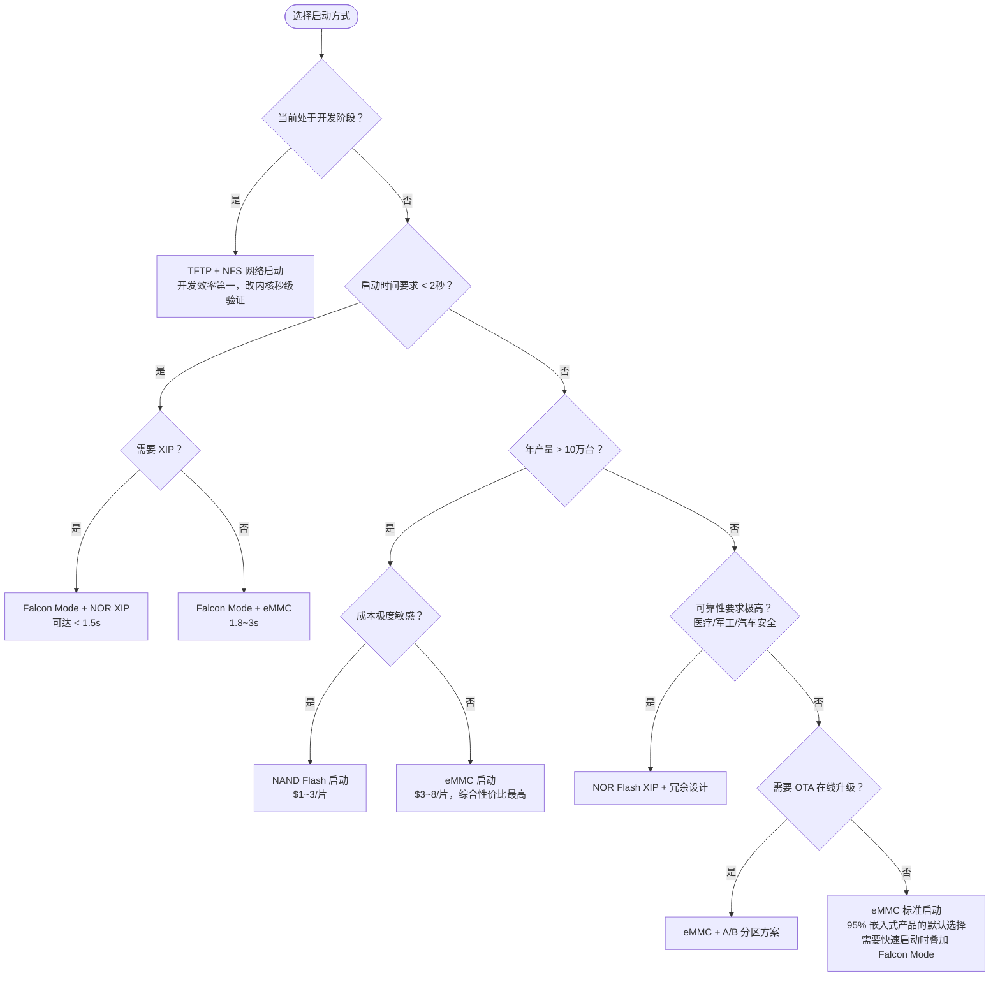

# 16.6 启动实战配置

> 所属章节：第16章 内核版本与启动架构设计
>
> 难度：[E] | 预计阅读时间：110分钟

---

> 本节覆盖：eMMC、SD/NAND、NOR/XIP、TFTP/PXE 四种启动方式的完整配置实战，Falcon Mode 的实现原理与代价，以及按产品类型选型的推荐矩阵。
>
> 16.5 给出了启动链的通用框架和时间预算，本节把它落到具体介质：每种介质从烧录偏移到 U-Boot 配置的全部细节，以及真实的踩坑案例。开篇的"3 秒生死线"问题，由 Falcon Mode 收尾。

## 16.6.1 eMMC启动实战配置
---

<!-- 【待补图】eMMC 分区布局图（★必要，建议生图）
生图提示词:技术插图风格：可视化显示 Boot1(4MB)/Boot2(4MB)/RPMB(4MB)/User Area 的分区布局，标注 U-Boot/Kernel/DTB/Rootfs/Data 存放位置，不同颜色区分。白底，中文标注，横版 16:6。 -->

<!-- 【待补图】eMMC A/B 分区 OTA 升级流程图（★必要，建议生图）
生图提示词:流程图风格：A 槽（当前运行）→下载新版本→写入 B 槽→验证 B 槽→切换启动到 B 槽→A 槽保留为回滚；失败时回滚到 A 槽。白底，中文标注。 -->

### 开篇决策场景：3秒生死线

**周五下午4点，项目经理把你叫到会议室。**

"客户刚刚更新了需求，"他指着投影幕上的甘特图，"车载信息娱乐系统必须在**点火后3秒内**显示主界面。我们现在的方案——eMMC标准启动——实测要8秒。下周二要交POC。"

你回到工位，看着眼前的启动日志：

```
[    0.000000] Booting Linux on physical CPU 0x0
[    1.243000] U-Boot 2024.04 (Starting kernel...)
[    3.567000] systemd[1]: Starting system...
[    8.124000] Starting GUI Application
```

8秒→3秒，差距5秒。从哪里砍？

你打开U-Boot配置菜单，面对一堆启动选项发愣：

- **Falcon Mode**——跳过U-Boot，SPL直接加载内核，能省1.5-3秒
- **NOR XIP**——内核从Flash直接执行，不需要加载到RAM
- **eMMC HS400模式**——把总线速度提到400MB/s
- **TFTP网络启动**——开发时不用刷Flash，但生产环境不行
- **PXE部署**——批量烧录利器，但跟启动速度无关
- **NAND UBI**——坏块管理到位，但启动更慢

每种方案各有利弊，而且**你只有一次选择机会**——选错了，下周二的POC就泡汤。

这就是本章要解决的问题。我们不谈理论，只给**可复制的配置命令**。6种启动方式，每种都给出：

1. **原理**——BootROM到Linux的完整链路
2. **配置**——U-Boot命令、环境变量、分区设计
3. **启动脚本**——可直接写入bootcmd的完整脚本
4. **踩坑实录**——我们真金白银烧出来的教训

读完本章，你能**在30分钟内切换任意启动方式**，并清楚知道你的产品该选哪一种。

---

### 表1：6种启动方式全景对比

| 维度 | eMMC启动 | SD卡启动 | NAND Flash | NOR Flash | TFTP网络 | PXE启动 |
|------|---------|---------|-----------|-----------|---------|---------|
| **典型启动时间** | 5-15s（优化后3-5s） | 8-20s | 10-25s | 2-8s（XIP） | 10-30s（依赖网络） | 10-30s |
| **硬件复杂度** | 低（标准接口） | 低（标准接口） | 中（需ECC控制器） | 低（SPI接口） | 中（需以太网PHY） | 中（需PXE服务器） |
| **存储容量** | 4-128GB | 2GB-1TB | 1GB-1TB | 1MB-2GB | 无限制（服务器端） | 无限制 |
| **可靠性** | 高（焊接固定） | 低（可插拔松动） | 中（需坏块管理） | 极高（100K擦写） | 低（网络依赖） | 低（网络依赖） |
| **OTA升级支持** | 优秀（A/B分区） | 好（换卡/分区） | 中（UBI卷更新） | 差（擦写慢） | 极好（服务器端） | 极好 |
| **单件成本** | $3-8 | $5-20 | $1-3 | $2-5 | 需网络基建 | 需PXE基建 |
| **温度范围** | -40~85°C（工业级） | 民用0~70°C | -40~85°C | -40~125°C | N/A | N/A |
| **XIP支持** | 否 | 否 | 否 | **是** | N/A | N/A |
| **开发调试便利** | 中 | 高（换卡即换系统） | 低（烧录慢） | 低 | **极高** | 高 |
| **量产烧录** | 快（USB/网络） | 慢（插卡/写卡器） | 慢（并口烧录） | 慢（SPI烧录） | 快（网络推送） | 快（网络推送） |

---


eMMC（embedded MultiMediaCard）是当前嵌入式Linux设备**最常用的启动介质**。理解eMMC启动的关键在于：eMMC芯片内部有**独立Boot分区**，BootROM可以从这个专用分区直接加载SPL/U-Boot，不需要依赖文件系统。

#### eMMC启动原理

**启动链路**（每一步的时间量级）：

```
SoC上电 → BootROM初始化(50-200ms) → BootROM从eMMC Boot分区读取SPL(100-500ms)
         → SPL初始化DDR/时钟(200-500ms) → SPL从eMMC加载U-Boot完整版(200-800ms)
         → U-Boot初始化外设(500-2000ms) → U-Boot加载Kernel+DTB(300-1000ms)
         → Kernel解压+启动(1000-5000ms) → 用户空间初始化(2000-10000ms)
```

eMMC内部有三类分区，这是理解eMMC启动的关键：

```
┌──────────────────────────────────────────────────────────────┐
│                        eMMC 芯片内部结构                       │
├──────────────────────────────────────────────────────────────┤
│ Boot Area Partition 1 (Boot1) │ 通常为4MB, 存储SPL/Secondary   │
│ Boot Area Partition 2 (Boot2) │ 通常为4MB, 备份或 Secondary    │
├──────────────────────────────────────────────────────────────┤
│ Replay Protected Memory Block │ RPMB分区, 安全相关             │
├──────────────────────────────────────────────────────────────┤
│ General Purpose Area Partitions│ GP1-GP4, 用户自定义            │
├──────────────────────────────────────────────────────────────┤
│ User Data Area               │ 主数据区, 存放Kernel/Rootfs    │
└──────────────────────────────────────────────────────────────┘
```

> 💡 **关键概念**: BootROM只认Boot Area Partition（Boot1/Boot2），不认User Area中的文件系统。SPL/U-Boot必须写入Boot分区，BootROM才能找到并加载。

BootROM通过读取eMMC的**EXT_CSD寄存器**（偏移[179] byte，即`BOOT_PARTITION_ENABLE`字段）来决定从哪个分区启动：

| BOOT_PARTITION_ENABLE值 | 含义 |
|------------------------|------|
| 0x0 | **不启用**Boot分区启动，从User Area启动 |
| 0x1 | 从**Boot1**分区启动 |
| 0x2 | 从**Boot2**分区启动 |
| 0x3 | 从**User Area**启动（保留兼容） |
| 0x4-0x6 | 在Boot1/Boot2/User Area之间启用**增强模式**（可靠写） |
| 0x7 | 禁用Boot分区，只能配置一次（OTP） |

> ⚠️ BOOT_PARTITION_ENABLE 设置错误的实际案例
>
> 曾经一个项目，我们把SPL烧录到了Boot1分区，但`BOOT_PARTITION_ENABLE`设置成了0x0（User Area启动）。结果BootROM在User Area找不到SPL，直接fallback到USB Serial Download Mode，板子变成"砖头"。
>
> 排查花了4小时：用`mmc extcsd read /dev/mmcblk0`命令查看EXT_CSD，发现第179字节是0x00而不是0x01。问题根源是烧录脚本里写反了bit顺序。
>
> **诊断方法**：
> ```bash
> # 在Linux下查看eMMC启动配置
> mmc extcsd read /dev/mmcblk0 | grep -A5 "BOOT_CONFIG"
> # 应该看到 BOOT_PARTITION_ENABLE 对应 Boot1 或 Boot2
> ```
> **修复命令**：
> ```bash
> # 设置从Boot1分区启动（Linux环境下）
> mmc bootpart enable 1 0 /dev/mmcblk0
> # 参数含义: boot_partition(1=Boot1,2=Boot2), send_ack(0=否), 设备路径
> ```

#### eMMC分区设计

一个典型的eMMC分区方案（以8GB eMMC为例）：

```
┌─────────────────┬──────────┬───────────┬──────────────────────┐
│ 分区名           │ 大小      │ eMMC位置   │ 用途                  │
├─────────────────┼──────────┼───────────┼──────────────────────┤
│ Boot1 (mmcblk0boot0)│ 4MB   │ 硬件固定   │ SPL (Secondary Loader)│
│ Boot2 (mmcblk0boot1)│ 4MB   │ 硬件固定   │ U-Boot 完整版（备份）  │
├─────────────────┼──────────┼───────────┼──────────────────────┤
│ User Area分区1   │ 64MB     │ /dev/mmcblk0p1 │ Kernel (zImage/Image) │
│ User Area分区2   │ 16MB     │ /dev/mmcblk0p2 │ Device Tree Blob      │
│ User Area分区3   │ 2GB      │ /dev/mmcblk0p3 │ Rootfs (ext4)         │
│ User Area分区4   │ 4GB      │ /dev/mmcblk0p4 │ Data/OTA分区 (ext4)   │
│ User Area分区5   │ ~1.9GB   │ /dev/mmcblk0p5 │ 保留/扩展             │
└─────────────────┴──────────┴───────────┴──────────────────────┘
```

#### 完整U-Boot配置命令序列

以下是在**U-Boot命令行**中配置的完整流程（以i.MX6ULL为例）：

```bash
# ===== 步骤1: 查看eMMC设备信息 =====
U-Boot> mmc dev 0          # 选择eMMC (SD卡通常是dev 1)
U-Boot> mmc info           # 显示eMMC容量/速度/分区信息
U-Boot> mmc part           # 列出所有分区

# 典型输出:
# Partition Map for MMC device 0  --   Partition Type: DOS
# Part    Start Sector    Num Sectors     UUID            Type
#   1     20480           131072          xxxxxxxx-01     0c  Win95 FAT32 (LBA)  # Kernel
#   2     151552          32768           xxxxxxxx-02     83  Linux               # DTB
#   3     184320          4194304         xxxxxxxx-03     83  Linux               # Rootfs
#   4     4378624         8388608         xxxxxxxx-04     83  Linux               # Data

# ===== 步骤2: 从eMMC FAT分区加载Kernel（方案A: FAT32分区） =====
U-Boot> setenv bootcmd_fat 'mmc dev 0; fatload mmc 0:1 ${loadaddr} zImage; fatload mmc 0:1 ${fdt_addr} ${soc}-evk.dtb; bootz ${loadaddr} - ${fdt_addr}'

# ===== 步骤3: 从eMMC ext4分区加载Kernel（方案B: ext4分区，推荐） =====
U-Boot> setenv bootcmd_ext4 'mmc dev 0; ext4load mmc 0:1 ${loadaddr} /boot/zImage; ext4load mmc 0:1 ${fdt_addr} /boot/dtbs/${soc}-evk.dtb; bootz ${loadaddr} - ${fdt_addr}'

# ===== 步骤4: 设置bootargs（内核启动参数） =====
U-Boot> setenv bootargs 'console=${console},${baudrate} root=/dev/mmcblk0p3 rootwait rw rootfstype=ext4 quiet loglevel=3'

# ===== 步骤5: 设置主bootcmd =====
U-Boot> setenv bootcmd 'run bootcmd_ext4'

# ===== 步骤6: 保存环境变量 =====
U-Boot> saveenv
```

> 💡 **fatload vs ext4load 选择**: 如果Kernel/DTB放在独立小分区用FAT32，用`fatload`；如果放在rootfs的`/boot`目录下用`ext4load`。ext4load更灵活（不需要单独格式化FAT分区），但fatload在U-Boot中支持更早、更稳定。对于新设计，**推荐ext4load**。

#### 生产级bootcmd脚本（带错误处理）

```bash
# 一个健壮的生产级启动脚本，包含错误检测和fallback
U-Boot> setenv boot_primary 'echo "=== Booting from eMMC ==="; mmc dev 0; if ext4load mmc 0:1 ${loadaddr} /boot/zImage; then echo "Kernel loaded OK"; else echo "ERROR: Kernel not found"; exit; fi; if ext4load mmc 0:1 ${fdt_addr} /boot/dtbs/${board}.dtb; then echo "DTB loaded OK"; else echo "WARN: Using default DTB"; fi'

U-Boot> setenv boot_exec 'bootz ${loadaddr} - ${fdt_addr}'

U-Boot> setenv boot_recovery 'echo "=== Boot failed, entering recovery ==="; tftpboot ${loadaddr} recovery/zImage; tftpboot ${fdt_addr} recovery/${board}.dtb; bootz ${loadaddr} - ${fdt_addr}'

U-Boot> setenv bootcmd 'run boot_primary; if run boot_exec; then echo "Boot OK"; else run boot_recovery; fi'

U-Boot> saveenv
```

#### Linux下烧录eMMC的完整流程

以下是在**已启动的Linux系统**上烧录eMMC的完整命令（用于量产或现场更新）：

```bash
#!/bin/bash
# burn_emmc.sh - 完整eMMC烧录脚本
# 用法: ./burn_emmc.sh <SPL文件> <U-Boot文件> <Kernel文件> <DTB文件> <Rootfs镜像>

SPL=$1
UBOOT=$2
KERNEL=$3
DTB=$4
ROOTFS=$5
EMMC_DEV="/dev/mmcblk0"

set -e
echo "========== eMMC 烧录开始 =========="

# 1. 启用eMMC Boot分区写权限（Linux默认是只读的）
echo "Enabling boot partition write access..."
echo 0 > /sys/block/mmcblk0boot0/force_ro
echo 0 > /sys/block/mmcblk0boot1/force_ro

# 2. 清除Boot分区并写入SPL
echo "Writing SPL to Boot1 partition..."
dd if=/dev/zero of=${EMMC_DEV}boot0 bs=512 count=8192 status=progress
dd if=${SPL} of=${EMMC_DEV}boot0 bs=512 seek=2 status=progress  # seek=2跳过前1KB的预留区

# 3. 可选：写入U-Boot到Boot2分区作为备份
echo "Writing U-Boot to Boot2 partition..."
dd if=/dev/zero of=${EMMC_DEV}boot1 bs=512 count=8192 status=progress
dd if=${UBOOT} of=${EMMC_DEV}boot1 bs=512 seek=2 status=progress

# 4. 设置从Boot1启动 (BOOT_PARTITION_ENABLE=0x1)
echo "Setting Boot Partition Enable..."
mmc bootpart enable 1 0 ${EMMC_DEV}

# 5. 验证设置
mmc extcsd read ${EMMC_DEV} | grep "BOOT_PARTITION_ENABLE"

# 6. 分区User Area (MBR分区表)
echo "Partitioning User Area..."
parted -s ${EMMC_DEV} mklabel msdos
parted -s ${EMMC_DEV} mkpart primary fat32 10MB 74MB    # p1: Kernel+DTB (FAT32兼容方案)
parted -s ${EMMC_DEV} mkpart primary ext4 74MB 2074MB    # p2: Rootfs
parted -s ${EMMC_DEV} mkpart primary ext4 2074MB 100%    # p3: Data/OTA

# 7. 格式化
mkfs.vfat -F 32 ${EMMC_DEV}p1
mkfs.ext4 -F ${EMMC_DEV}p2
mkfs.ext4 -F ${EMMC_DEV}p3

# 8. 写入Kernel和DTB
mkdir -p /mnt/emmc_p1
mount ${EMMC_DEV}p1 /mnt/emmc_p1
cp ${KERNEL} /mnt/emmc_p1/zImage
cp ${DTB} /mnt/emmc_p1/
umount /mnt/emmc_p1

# 9. 写入Rootfs
mkdir -p /mnt/emmc_p2
echo "Writing rootfs (this may take a while)..."
gunzip -c ${ROOTFS} | dd of=${EMMC_DEV}p2 bs=4M status=progress

# 10. 同步并验证
echo "Syncing..."
sync
echo "eMMC 分区信息:"
fdisk -l ${EMMC_DEV}
echo "========== eMMC 烧录完成 =========="
```

#### eMMC速度优化

```bash
# U-Boot中配置eMMC高速模式
U-Boot> mmc dev 0
U-Boot> mmc speed 52000000     # 52MHz HS模式
U-Boot> mmc buswidth 8         # 8-bit数据总线
U-Boot> setenv mmc_speed_opt 'mmc dev 0; mmc speed 52000000; mmc buswidth 8'
U-Boot> setenv bootcmd 'run mmc_speed_opt; run bootcmd_ext4'
U-Boot> saveenv

# Linux内核中启用eMMC HS200/HS400（Device Tree配置示例）
&usdhc2 {
    pinctrl-names = "default", "state_100mhz", "state_200mhz";
    pinctrl-0 = <&pinctrl_usdhc2>;
    pinctrl-1 = <&pinctrl_usdhc2_100mhz>;
    pinctrl-2 = <&pinctrl_usdhc2_200mhz>;
    bus-width = <8>;
    non-removable;
    no-sdio;
    no-sd;
    strobe-sdio;
    mmc-hs200-1_8v;       # 启用HS200 (200MB/s)
    mmc-hs400-1_8v;       # 启用HS400 (400MB/s)
    status = "okay";
};
```

#### eMMC A/B分区OTA升级方案

eMMC启动最大的优势之一是**原生支持A/B（无缝）系统升级**。eMMC的硬件分区机制可以实现原子性的系统切换。

**A/B分区设计**：

```
eMMC User Area A/B分区布局:
├─ p1: boot_a (64MB ext4)      ← 系统A的Kernel+DTB
├─ p2: boot_b (64MB ext4)      ← 系统B的Kernel+DTB
├─ p3: rootfs_a (2GB ext4)     ← 系统A的Rootfs
├─ p4: rootfs_b (2GB ext4)     ← 系统B的Rootfs
├─ p5: misc (16MB)             ← 升级状态/引导标志
└─ p6: data (剩余空间)          ← 用户数据（A/B共享）
```

**U-Boot A/B选择逻辑**：

```bash
# U-Boot bootcmd中的A/B选择逻辑
U-Boot> setenv boot_ab_select '
    mmc dev 0;
    # 从misc分区读取当前激活槽位
    ext4load mmc 0:5 ${loadaddr} /boot_slot;
    # boot_slot文件内容: "a" 或 "b"
    if test ${bootslot} = "b"; then
        echo "Booting slot B";
        setenv bootpart 2;      # boot_b
        setenv rootpart 4;      # rootfs_b
    else
        echo "Booting slot A (default)";
        setenv bootpart 1;      # boot_a
        setenv rootpart 3;      # rootfs_a
    fi'

U-Boot> setenv bootcmd_ab 'run boot_ab_select; ext4load mmc 0:${bootpart} ${loadaddr} zImage; ext4load mmc 0:${bootpart} ${fdt_addr} ${board}.dtb; setenv bootargs console=${console},${baudrate} root=/dev/mmcblk0p${rootpart} rootwait rw rootfstype=ext4; bootz ${loadaddr} - ${fdt_addr}'

U-Boot> setenv bootcmd 'run bootcmd_ab'
U-Boot> saveenv
```

**OTA升级脚本**（在运行的Linux系统中）：

```bash
#!/bin/bash
# ota_update.sh - A/B系统OTA升级脚本

UPDATE_PKG="/tmp/update.tar.gz"   # 升级包包含新Kernel+DTB+Rootfs
MISC_PART="/dev/mmcblk0p5"        # misc分区
CURRENT_SLOT=$(cat /etc/boot_slot) # 当前槽位

# 1. 确定目标槽位
if [ "$CURRENT_SLOT" = "a" ]; then
    TARGET_SLOT="b"
    TARGET_PART="4"   # rootfs_b
    BOOT_PART="2"     # boot_b
else
    TARGET_SLOT="a"
    TARGET_PART="3"   # rootfs_a
    BOOT_PART="1"     # boot_a
fi

# 2. 解压升级包到目标分区
echo "Updating slot ${TARGET_SLOT}..."
mount /dev/mmcblk0p${TARGET_PART} /mnt
rm -rf /mnt/*
tar xzf ${UPDATE_PKG} -C /mnt/
sync
umount /mnt

# 3. 写入Kernel和DTB到目标boot分区
mount /dev/mmcblk0p${BOOT_PART} /mnt/boot
cp /mnt/boot/zImage /mnt/boot/zImage.new
cp /mnt/boot/${BOARD}.dtb /mnt/boot/${BOARD}.dtb.new
sync
umount /mnt/boot

# 4. 更新boot标志（原子操作）
echo "${TARGET_SLOT}" > /tmp/boot_slot.new
dd if=/tmp/boot_slot.new of=${MISC_PART} bs=1 count=1 conv=fsync

# 5. 重启到新系统
echo "Update complete, rebooting to slot ${TARGET_SLOT}..."
reboot
```

#### eMMC启动 — 优缺点总结

| 维度 | 评估 |
|------|------|
| **速度** | 快（HS400下可达400MB/s），启动时间5-15s可优化到3s |
| **可靠性** | 高（焊接固定，工业级-40~85°C） |
| **容量** | 大（4-128GB），适合复杂系统 |
| **OTA** | 优秀（A/B分区、原子更新） |
| **成本** | 中（$3-8/片，大批量可谈） |
| **缺点1** | 不可插拔（焊接在板上），调试需网络/USB |
| **缺点2** | 有写入寿命限制（需wear leveling监控） |
| **缺点3** | Boot分区大小固定（通常4MB），SPL必须精简 |

---

## 16.6.2 SD卡与NAND Flash启动配置
---

<!-- 【待补图】NAND Flash MTD 分区布局图（★必要，建议生图）
生图提示词:技术插图风格：MTD 设备（mtd0-mtd4）物理布局——SPL/U-Boot/Kernel/DTB/Rootfs(UBIFS)/Data，标注擦除块大小和坏块预留区域。白底，中文标注，横版。 -->

SD卡启动是**开发阶段的首选**。它的核心优势是"可插拔"——换张卡就是换了个系统，调试效率极高。

#### SD卡启动原理

SD卡启动链路与eMMC几乎相同，区别在于：

```
SoC上电 → BootROM检测SD卡插入(CD引脚) → BootROM从SD卡第1个数据块读取SPL
         → SPL加载U-Boot → U-Boot加载Kernel → ...
```

BootROM从SD卡的**绝对物理地址**（不是文件系统）加载SPL。典型地址：

| SoC平台 | SPL存储位置 | 说明 |
|---------|------------|------|
| i.MX6/7/8 | 偏移0x400 (第2个扇区) | 前0x400字节预留 |
| Rockchip  | 偏移0x40 (第64扇区) | 需要idblock |
| Allwinner | 偏移0x2000 (第16KB) | 需要U-Boot SPL头 |
| TI AM33xx | 偏移0x200 (第1个扇区后) | MLO格式 |

> ⚠️ SD 卡速度等级直接影响启动时间的实际案例
>
> 我们在一个项目中使用了Class 4的"便宜"SD卡，启动时间实测18秒。换成Class 10（UHS-I）后，启动时间降到6秒。**差了整整12秒**。
>
> 根本原因：Class 4的 sequential read 约4MB/s，而UHS-I Class 10可达40-90MB/s。U-Boot加载一个8MB的Kernel，Class 4需要2秒，UHS-I只需要0.1秒。
>
> **选卡标准**：
> - 开发调试：Class 10 UHS-I（V30标志），顺序读>40MB/s
> - 性能测试：UHS-III或SD Express（但大多数SoC不支持）
> - 生产环境：**不要用SD卡**（可靠性差）
>
> 测试SD卡速度的Linux命令：
> ```bash
> hdparm -t /dev/mmcblk1          # 顺序读取测试
> dd if=/dev/mmcblk1 of=/dev/null bs=1M count=100 iflag=direct  # 原始读取
> ```

#### SD卡分区设计（MBR）

```
┌────────────────────────────────────────────────────────┐
│ SD卡物理布局 (32GB Class 10)                           │
├──────────┬──────────┬──────────┬───────────────────────┤
│ 预留区    │ SPL/U-Boot│ FAT32    │ ext4                  │
│ (前1MB)  │ (1-2MB)  │ p1 128MB │ p2 4GB  │ p3 剩余    │
│          │          │ Kernel   │ Rootfs  │ Data       │
│          │          │ +DTB     │         │            │
└──────────┴──────────┴──────────┴───────────────────────┘
```

#### U-Boot完整配置命令

```bash
# ===== 步骤1: 确认SD卡设备号 =====
U-Boot> mmc list           # 列出所有MMC设备
# 典型输出:
# FSL_SDHC: 0 (eMMC)
# FSL_SDHC: 1 (SD)         <-- 我们的目标

# ===== 步骤2: 查看SD卡信息 =====
U-Boot> mmc dev 1          # 选择SD卡
U-Boot> mmc info           # 显示容量/速度/总线宽度
# 注意看 "Bus Speed" 和 "Bus Width" —— 确认是4-bit/8-bit高速模式

# ===== 步骤3: 从SD卡加载Kernel =====
# 方案A: FAT32分区存放Kernel
U-Boot> setenv bootcmd_sd 'mmc dev 1; fatload mmc 1:1 ${loadaddr} zImage; fatload mmc 1:1 ${fdt_addr} ${soc}-evk.dtb; bootz ${loadaddr} - ${fdt_addr}'

# 方案B: ext4分区存放Kernel
U-Boot> setenv bootcmd_sd 'mmc dev 1; ext4load mmc 1:1 ${loadaddr} /boot/zImage; ext4load mmc 1:1 ${fdt_addr} /boot/dtbs/${soc}-evk.dtb; bootz ${loadaddr} - ${fdt_addr}'

# ===== 步骤4: 设置bootargs =====
U-Boot> setenv bootargs 'console=${console},${baudrate} root=/dev/mmcblk1p2 rootwait rw rootfstype=ext4'

# ===== 步骤5: 设置bootcmd并保存 =====
U-Boot> setenv bootcmd 'run bootcmd_sd'
U-Boot> saveenv
```

#### SD卡制作脚本（Linux主机上执行）

```bash
#!/bin/bash
# make_sdcard.sh - 在Linux主机上制作启动SD卡
# 用法: sudo ./make_sdcard.sh /dev/sdX

SDCARD=$1
SPL="u-boot-spl.bin"
UBOOT="u-boot-dtb.imx"
KERNEL="zImage"
DTB="imx6ull-14x14-evk.dtb"
ROOTFS="rootfs.tar.gz"

if [ -z "$SDCARD" ]; then
    echo "Usage: sudo $0 /dev/sdX"
    echo "WARNING: This will DESTROY all data on $SDCARD!"
    exit 1
fi

set -e
echo "========== SD卡制作开始 ($SDCARD) =========="

# 1. 卸载所有分区
umount ${SDCARD}* 2>/dev/null || true

# 2. 创建分区表 (前1MB预留，1-2MB放SPL/U-Boot)
echo "Creating partition table..."
parted -s $SDCARD mklabel msdos
parted -s $SDCARD mkpart primary fat32 2MB 130MB    # p1: FAT32 for Kernel+DTB
parted -s $SDCARD mkpart primary ext4 130MB 4130MB   # p2: Rootfs (4GB)
parted -s $SDCARD mkpart primary ext4 4130MB 100%    # p3: Data

# 3. 同步分区表
partprobe $SDCARD
sleep 2

# 4. 写入SPL/U-Boot到预留区域 (i.MX6ULL)
echo "Writing SPL/U-Boot..."
dd if=${UBOOT} of=$SDCARD bs=512 seek=2 conv=fsync

# 5. 格式化分区
mkfs.vfat -F 32 -n "BOOT" ${SDCARD}1
mkfs.ext4 -F -L "rootfs" ${SDCARD}2
mkfs.ext4 -F -L "data" ${SDCARD}3

# 6. 复制Kernel和DTB
mkdir -p /mnt/sd_boot
mount ${SDCARD}1 /mnt/sd_boot
cp ${KERNEL} /mnt/sd_boot/
cp ${DTB} /mnt/sd_boot/
umount /mnt/sd_boot

# 7. 解压Rootfs
mkdir -p /mnt/sd_root
mount ${SDCARD}2 /mnt/sd_root
echo "Extracting rootfs (this takes a while)..."
tar xzf ${ROOTFS} -C /mnt/sd_root
umount /mnt/sd_root

echo "========== SD卡制作完成 =========="
echo "插入板子，设置板子从SD卡启动（拨码开关/Boot Pin），上电"
```

#### SD卡启动 — 优缺点总结

| 维度 | 评估 |
|------|------|
| **速度** | 中（Class 10约6-10s启动，取决于卡速） |
| **可靠性** | 低（可插拔=可能松动/接触不良，民用级SD温度范围窄） |
| **开发便利** | **极高**（换卡即换系统，无需烧录） |
| **成本** | 中（$5-20/卡，但需卡槽+人工插拔） |
| **生产适用** | **不推荐**（可靠性差、人工成本高、易被篡改） |
| **适用场景** | 开发调试、小批量原型、现场应急恢复 |

---


NAND Flash是**成本敏感型产品**的首选。它的核心优势是$/GB极低，但代价是**需要完整的坏块管理和ECC机制**。

#### NAND启动原理

```
SoC上电 → BootROM从NAND第0块读取SPL到SRAM(200-500ms)
         → SPL初始化DDR → SPL从NAND读取U-Boot到RAM
         → U-Boot启动，使用MTD子系统访问NAND
         → U-Boot通过nand read命令加载Kernel/DTB
         → Kernel使用UBIFS挂载rootfs
```

NAND Flash与eMMC/SD的根本区别：**NAND没有内置控制器**。eMMC有控制器管理wear leveling、坏块、ECC；NAND需要软件（U-Boot/Linux MTD）来做这一切。

```
┌──────────────┐     ┌──────────────┐     ┌──────────────────┐
│   SoC        │     │   NAND       │     │   管理责任        │
│              │     │   Flash      │     │                  │
├──────────────┤     ├──────────────┤     ├──────────────────┤
│ BootROM      │────→│ 原始Flash    │     │ 无(直接物理访问)   │
│ MTD子系统     │────→│              │     │ ECC/坏块/Wear      │
│ UBIFS驱动    │────→│              │     │ Leveling全由软件管 │
└──────────────┘     └──────────────┘     └──────────────────┘
```

#### MTD分区设计

MTD（Memory Technology Device）是Linux访问raw flash的统一接口。NAND分区在**U-Boot环境变量或Device Tree**中定义。

**Device Tree中的MTD分区定义**（以256MB NAND为例）：

```dts
// arch/arm/boot/dts/imx6ull-14x14-evk.dts
&gpmi {
    pinctrl-names = "default";
    pinctrl-0 = <&pinctrl_gpmi_nand>;
    nand-on-flash-bbt;           // 使用Flash上的坏块表
    status = "okay";

    #address-cells = <1>;
    #size-cells = <1>;

    partition@0 {
        label = "u-boot-spl";
        reg = <0x00000000 0x000e0000>;    /* 896KB: SPL */
    };
    partition@e0000 {
        label = "u-boot";
        reg = <0x000e0000 0x00200000>;    /* 2MB: U-Boot */
    };
    partition@2e0000 {
        label = "u-boot-env";
        reg = <0x002e0000 0x00080000>;    /* 512KB: U-Boot环境变量 */
    };
    partition@360000 {
        label = "kernel";
        reg = <0x00360000 0x00800000>;    /* 8MB: Kernel */
    };
    partition@b60000 {
        label = "dtb";
        reg = <0x00b60000 0x00040000>;    /* 256KB: DTB */
    };
    partition@ba0000 {
        label = "rootfs";
        reg = <0x00ba0000 0x06400000>;    /* 100MB: Rootfs (UBI) */
    };
    partition@6fa0000 {
        label = "data";
        reg = <0x06fa0000 0x09060000>;    /* 剩余: Data (UBI) */
    };
};
```

> ⚠️ SPL 大小超过 NAND page size 的实际案例
>
> 我们在一个项目中把U-Boot SPL编译到了196KB，目标板用的是2K page的NAND。SPL烧录后无法启动，BootROM直接halt。
>
> 排查发现：这块SoC的BootROM从NAND加载SPL时，**一次只读一个page（2KB）**，而且SPL必须放在前N个page中。SPL超过128KB后，BootROM的加载逻辑溢出。
>
> **根因**：SPL的`.text`段膨胀是因为打开了debug信息和verbose输出。
>
> **修复**：
> ```bash
> # 在U-Boot配置中精简SPL
> make menuconfig
> # 关闭: CONFIG_SPL_DEBUG, CONFIG_SPL_SERIAL_SUPPORT(如果不需早期串口)
> # 关闭: CONFIG_SPL_FAT_SUPPORT, CONFIG_SPL_EXT_SUPPORT(如果从raw NAND启动)
> # 打开: CONFIG_SPL_NAND_SUPPORT
> ```
> **验证SPL大小**：
> ```bash
> arm-linux-gnueabihf-size spl/u-boot-spl
> # text    data    bss     dec     hex   filename
> # 65536   1024    2048    68608   10c00 spl/u-boot-spl  # OK, <128KB
> ```

#### U-Boot NAND命令详解

```bash
# ===== NAND基本操作命令 =====

# 1. 初始化NAND (U-Boot自动检测，但可手动probe)
U-Boot> nand info
# 典型输出:
# Device 0: nand0, sector size 128 KiB
# Page size 2048 b, OOB size 64 b, Erase size 131072 b
# Bad blocks: 2 (factory bad at 0x01e00000, 0x03a00000)

# 2. 查看MTD分区
U-Boot> mtdparts
# 或
U-Boot> mtd list

# 3. 擦除分区（写入前必须擦除！NAND的特性）
U-Boot> nand erase 0x360000 0x800000    # 擦除kernel分区(从0x360000开始, 8MB)

# 4. 从内存写入NAND (先通过TFTP/USB把文件加载到内存)
U-Boot> tftpboot ${loadaddr} zImage
U-Boot> nand write ${loadaddr} 0x360000 ${filesize}   # 写入kernel分区

# 5. 从NAND读取到内存
U-Boot> nand read ${loadaddr} 0x360000 0x800000       # 读取8MB

# 6. 擦除并写入（常用组合命令）
U-Boot> nand erase.part kernel                        # 擦除整个kernel分区
U-Boot> nand write ${loadaddr} kernel ${filesize}      # 写入kernel分区

# 7. 坏块操作
U-Boot> nand bad                                       # 列出所有坏块
U-Boot> nand scrub -y 0x0 0x10000000                  # 彻底擦除整个NAND（清除所有坏块标记）
```

#### UBI/UBIFS集成启动

UBI（Unsorted Block Images）是NAND上的卷管理层，类似LVM。UBIFS是建立在UBI之上的文件系统。

**为什么必须用UBI/UBIFS**：
- Raw NAND需要坏块管理和wear leveling
- JFFS2在大容量NAND上mount极慢（100MB分区mount需要30秒+）
- UBIFS有on-flash wear leveling和transparent坏块处理

**制作UBI镜像的完整流程**（在Linux主机上）：

```bash
#!/bin/bash
# make_ubi.sh - 制作UBI镜像用于NAND烧录

ROOTFS_DIR="rootfs"           # 根文件系统目录
UBI_CFG="ubi.ini"             # UBI配置文件
PAGE_SIZE=2048                # NAND page size (2KB)
ERASE_SIZE=131072             # NAND erase block size (128KB)
SUBPAGE_SIZE=2048             # 子页大小
ROOTFS_SIZE=100MiB            # rootfs卷大小

# 1. 创建UBI配置文件
cat > ${UBI_CFG} <<EOF
[ubifs]
mode=ubi
image=rootfs.ubifs
vol_id=0
vol_size=${ROOTFS_SIZE}
vol_type=dynamic
vol_name=rootfs
vol_flags=autoresize
EOF

# 2. 制作UBIFS镜像 (临时文件系统镜像)
mkfs.ubifs -q -r ${ROOTFS_DIR} -o rootfs.ubifs \
    -m ${PAGE_SIZE} -e ${ERASE_SIZE} -c 812 \
    -F  # 可修复格式

# 3. 制作UBI镜像 (包含UBI头信息)
ubinize -o rootfs.ubi -m ${PAGE_SIZE} -p ${ERASE_SIZE} -s ${SUBPAGE_SIZE} ${UBI_CFG}

# 4. 验证
echo "UBI镜像大小:"
ls -lh rootfs.ubi

# 5. 烧录脚本 (在U-Boot中执行)
cat > burn_nand_ubifs.txt <<'BURN'
# 在U-Boot命令行中执行:
# 假设rootfs.ubi已通过TFTP下载到内存
tftpboot ${loadaddr} rootfs.ubi
nand erase.part rootfs
nand write ${loadaddr} rootfs ${filesize}
BURN
```

#### NAND启动完整脚本（U-Boot bootcmd）

```bash
# NAND启动的完整U-Boot配置
# 假设MTD分区: spl | u-boot | env | kernel | dtb | rootfs(UBI) | data(UBI)

# 1. 设置MTD分区（如果Device Tree中没有定义）
U-Boot> setenv mtdids 'nand0=gpmi-nand'
U-Boot> setenv mtdparts 'mtdparts=gpmi-nand:896k(spl),2m(u-boot),512k(env),8m(kernel),256k(dtb),-(ubi)'

# 2. 从NAND加载Kernel
U-Boot> setenv loadkernel 'nand read ${loadaddr} kernel 0x800000'

# 3. 从NAND加载DTB
U-Boot> setenv loaddtb 'nand read ${fdt_addr} dtb 0x40000'

# 4. 设置bootargs（UBIFS根文件系统）
U-Boot> setenv bootargs 'console=${console},${baudrate} ubi.mtd=ubi root=ubi0:rootfs rootwait rw rootfstype=ubifs mtdparts=${mtdparts}'

# 5. 组合bootcmd
U-Boot> setenv bootcmd 'mtdparts default; run loadkernel; run loaddtb; bootz ${loadaddr} - ${fdt_addr}'

U-Boot> saveenv
```

#### NAND启动 — 优缺点总结

| 维度 | 评估 |
|------|------|
| **速度** | 慢（10-25s，UBIFS mount需要时间） |
| **成本** | **极低**（$1-3/256MB，大批量优势明显） |
| **容量** | 大（128MB-16GB） |
| **可靠性** | 中（需软件坏块管理，ECC可纠正位错误） |
| **复杂度** | **高**（MTD分区、UBI、ECC配置、坏块处理） |
| **OTA** | 中（UBI卷可原子更新，但工具链复杂） |
| **关键优势** | 每GB成本最低，适合成本极致敏感产品 |
| **关键劣势** | 启动慢、管理复杂、没有随机读优势 |

---

## 16.6.3 NOR Flash与XIP启动配置
---

<!-- 【待补图】XIP（就地执行）原理图（★必要，建议生图）
生图提示词:对比示意图：左侧传统方式（Flash→加载到 DDR→CPU 执行），右侧 XIP 方式（Flash 直接映射到 CPU 地址空间→CPU 直接执行），标注省去的「加载到 DDR」步骤。白底，中文标注。 -->

NOR Flash是嵌入式世界里的"老兵"。它容量小、成本高，但有一个**独一无二的优势：支持XIP（Execute In Place，就地执行）**。CPU可以直接从NOR Flash取指执行，不需要先把代码复制到RAM。

#### NOR启动原理

```
SoC上电 → BootROM直接从NOR Flash地址空间执行(0ms延迟)
         → SPL/X-SPL在NOR上直接运行，初始化DDR
         → 从NOR加载或XIP执行U-Boot
         → U-Boot从NOR读取Kernel到RAM（Kernel太大，无法XIP）
         → 启动Linux
```

NOR Flash在系统中通常被映射到CPU的**物理地址空间**：

```
CPU地址空间视图 (以32位ARM为例):
0x0000_0000 ──┬── DDR RAM (256MB-2GB, 可执行+可读写)
0x2000_0000   │
              │
0x8000_0000 ──┼── NOR Flash映射 (16MB-512MB, 可读+可执行, 写入需特殊时序)
              │    CPU可以直接 IFETCH 从这个区域
0x9000_0000 ──┤
              │
0xA000_0000 ──┼── 外设寄存器 (不可缓存, 不可预取)
              │
0xFFFF_FFFF ──┴── 结束
```

NOR的读取速度不如DDR，但**随机读取**（random read）比NAND快得多：

| 操作 | NOR Flash | NAND Flash | DDR RAM |
|------|-----------|------------|---------|
| 随机读取延迟 | 50-100ns | 10-25μs (页加载) | 10-20ns |
| 顺序读取带宽 | 20-100MB/s | 10-40MB/s | 1600-6400MB/s |
| 执行速度（XIP） | 中等（比DDR慢5-10倍） | 不支持 | 最快 |
| 写入速度 | 慢（100-1000KB/s擦写） | 快（1-10MB/s编程） | 最快 |

> 💡 **XIP的本质**: NOR Flash通过内存总线（ parallel NOR 通过地址/数据总线，SPI NOR通过SPI控制器映射到内存窗口）直接连接到CPU。CPU看到的只是一个普通的内存区域，取指执行时不需要任何驱动介入。这是NOR启动比NAND快1-3秒的根本原因。

#### U-Boot NOR命令（SPI NOR Flash）

现代嵌入式系统大多使用**SPI NOR Flash**（接口简单，8引脚），而非parallel NOR。

```bash
# ===== SPI NOR基本操作 =====

# 1. 探测SPI NOR (指定SPI总线/片选/时钟)
U-Boot> sf probe 0:0 50000000 0   # probe bus 0, cs 0, 50MHz, mode 0
# 输出: SF: Detected w25q128 with page size 256 Bytes, erase size 4 KiB, total 16 MiB

# 2. 查看NOR信息
U-Boot> sf info
# SF: Detected w25q128 with page size 256 Bytes, erase size 4 KiB, total 16 MiB
# 4 pages per sector, 256 sectors per block, 32 blocks total

# 3. 从NOR读取到内存
U-Boot> sf read ${loadaddr} 0x100000 0x800000
# 从NOR偏移0x100000读取8MB到内存${loadaddr}

# 4. 擦除NOR区域（必须先擦除再写入！）
U-Boot> sf erase 0x100000 0x800000    # 擦除8MB区域

# 5. 从内存写入NOR
U-Boot> sf write ${loadaddr} 0x100000 ${filesize}

# 6. 完整烧录流程
# 先通过TFTP把文件加载到RAM，再写入NOR
U-Boot> tftpboot ${loadaddr} zImage
U-Boot> sf erase 0x100000 0x800000
U-Boot> sf write ${loadaddr} 0x100000 ${filesize}
```

#### NOR Flash分区设计（小容量系统）

以常见的16MB SPI NOR（W25Q128）为例：

```
NOR Flash 16MB (0x000000 - 0xFFFFFF) 地址分配:
├─ 0x000000 ─ 0x0FFFFF (1MB)  : SPL + U-Boot
│   ├── 0x000000 - 0x03FFFF (256KB): U-Boot SPL (可能XIP执行)
│   └── 0x040000 - 0x0FFFFF (768KB): U-Boot 完整版
│
├─ 0x100000 ─ 0x17FFFF (512KB) : U-Boot Environment (双备份)
│
├─ 0x180000 ─ 0x9FFFFF (8.5MB) : Linux Kernel (zImage/Image)
│
├─ 0xA00000 ─ 0xA7FFFF (512KB) : Device Tree Blob (DTB)
│
├─ 0xA80000 ─ 0xFFFFFF (5.5MB) : JFFS2/AXFS Rootfs (小容量文件系统)
│                                   或 Initramfs (打包在Kernel中)
└─
```

#### NOR启动完整U-Boot配置

```bash
# NOR启动完整配置 (SPI NOR, 16MB)

# 1. 探测SPI NOR
U-Boot> setenv nor_probe 'sf probe 0:0 50000000 0'

# 2. 从NOR加载Kernel
U-Boot> setenv loadkernel 'sf read ${loadaddr} 0x180000 0x800000'

# 3. 从NOR加载DTB
U-Boot> setenv loaddtb 'sf read ${fdt_addr} 0xA00000 0x80000'

# 4. 设置bootargs（小系统，可能用initramfs或JFFS2）
# 方案A: initramfs（rootfs打包在kernel中，最简单）
U-Boot> setenv bootargs_initramfs 'console=${console},${baudrate} root=/dev/ram0 rdinit=/sbin/init'

# 方案B: JFFS2 rootfs（NOR上直接跑文件系统）
U-Boot> setenv bootargs_jffs2 'console=${console},${baudrate} root=/dev/mtdblock5 rootfstype=jffs2 rw mtdparts=spi0.0:1m(u-boot),512k(env),8704k(kernel),512k(dtb),-(rootfs)'

# 方案C: AXFS (Advanced XIP File System) - 支持从NOR XIP执行用户程序
U-Boot> setenv bootargs_axfs 'console=${console},${baudrate} root=/dev/mtdblock5 rootfstype=axfs ro mtdparts=spi0.0:1m(u-boot),512k(env),8704k(kernel),512k(dtb),-(rootfs)'

# 5. 组合bootcmd
U-Boot> setenv bootcmd 'run nor_probe; run loadkernel; run loaddtb; setenv bootargs ${bootargs_jffs2}; bootz ${loadaddr} - ${fdt_addr}'

U-Boot> saveenv
```

#### NOR启动 — 小容量系统的最佳实践

当NOR Flash只有16MB（甚至8MB或4MB）时，每一寸空间都要精打细算：

**策略1: Kernel内置initramfs**
```bash
# 在Kernel配置中(CONFIG_INITRAMFS_SOURCE)把rootfs打包进kernel
# 这样不需要单独的文件系统分区
# rootfs必须是极小的BusyBox系统 (<4MB)
make menuconfig
# General setup -> Initial RAM filesystem and RAM disk (initramfs/initrd)
#   Initramfs source file(s): rootfs_small.cpio.gz
```

**策略2: 使用AXFS实现用户程序XIP**
```bash
# AXFS允许用户程序从NOR Flash直接执行，不需要加载到RAM
# 适合: 只有一个主程序的小系统

# 编译AXFS工具
git clone https://github.com/jaredeh/axfs.git
cd axfs/build/tools
make

# 制作AXFS镜像
mksquashfs rootfs/ rootfs.axfs -comp xz
axfs_mkfs -v -x -i rootfs.axfs -o rootfs_final.axfs

# Kernel配置支持AXFS
# File systems -> Miscellaneous filesystems -> Advanced XIP File System
```

**策略3: XIP Kernel（Kernel本身从NOR执行）**
见本章"XIP就地执行"章节详细配置。

#### NOR启动 — 优缺点总结

| 维度 | 评估 |
|------|------|
| **速度** | 快（XIP支持，启动2-8s） |
| **可靠性** | **极高**（100K+擦写寿命，宽温-40~125°C） |
| **容量** | 小（1MB-512MB，典型16-128MB） |
| **成本** | 高（$/GB是eMMC的5-10倍） |
| **XIP** | **唯一支持XIP的Flash类型** |
| **随机读** | 快（比NAND快100x随机读） |
| **写入** | 极慢（擦除100ms/块，编程0.3-1ms/byte） |
| **适用场景** | Bootloader存储、小系统XIP、极高可靠性需求 |

---


XIP（eXecute In Place，就地执行）是嵌入式系统中最极致的启动优化——**代码不需要从Flash复制到RAM，CPU直接从Flash取指执行**。

#### XIP原理：Flash映射到CPU地址空间

```
标准启动（加载执行）:
Flash ──[驱动读取]──→ RAM ──[CPU取指]──→ 执行
  ↑                        ↑
  │         耗时: 500ms-3s（取决于大小和速度）  │
  │                        │
  └────────────────────────┘
        Kernel/Rootfs必须先加载到RAM

XIP启动（就地执行）:
Flash ──────────────────[CPU直接取指]──→ 执行
  ↑
  │  Flash映射到CPU地址空间 (0x80000000+)
  │  耗时: 0ms（无需加载）
  │
  CPU看到的"内存" → 实际上是Flash

代价: 执行速度比RAM慢 3-10倍
```

XIP的本质是**利用CPU的内存映射机制**：

```
CPU虚拟地址              物理地址                  实际设备
───────────            ───────────              ─────────
0x00000000 ──MMU──→ 0x80000000 ──XIP窗口──→ NOR Flash (读操作)
                      ↓                         ↓
                   DDR RAM                  写入需特殊时序
                   (读写全速)               (不能直接写)
```

#### XIP的三种实现层级

| 层级 | 实现对象 | 难度 | 节省时间 | 速度损失 |
|------|---------|------|---------|---------|
| **Level 1: Bootloader XIP** | U-Boot SPL从NOR执行 | 低 | 100-300ms | 中等 |
| **Level 2: Kernel XIP** | Linux Kernel从NOR执行 | 高 | 1-2s | 显著（启动时） |
| **Level 3: Application XIP** | 用户程序从NOR执行 | 中 | 视应用而定 | 运行时慢 |

#### Level 2: Kernel XIP完整配置

Kernel XIP是最复杂也是收益最大的层级。它需要：

1. **Kernel编译时指定XIP物理地址**
2. **链接脚本把Kernel放到Flash地址空间**
3. **禁用需要运行时修改的Kernel特性**
4. **Device Tree正确配置内存布局**

##### 步骤1: Kernel配置

```bash
cd linux/
make ARCH=arm CROSS_COMPILE=arm-linux-gnueabihf- menuconfig

# 启用XIP支持:
# System Type -> XIP Kernel support
#   [X] Kernel Execute-In-Place from ROM

# 配置XIP物理地址:
#   XIP Kernel Physical Location: 0x80000000
#   (这是NOR Flash在CPU地址空间中的映射地址)

# 配置XIP内存大小:
#   XIP Kernel size: 0x00800000  (8MB)

# 关键: 关闭与XIP冲突的选项:
# [ ] Enable loadable module support          # 必须关闭！XIP不支持模块加载
# [ ] Contiguous Memory Allocator             # CMA需要运行时内存管理
# [ ] Swap support                            # 不支持swap
# [ ] Write-back Throttling                   # XIP区域不可写
```

##### 步骤2: 链接脚本修改

```ld
/* arch/arm/kernel/vmlinux-xip.lds.S */

SECTIONS
{
    /* XIP Kernel的代码段放在Flash地址 */
    . = XIP_VIRT_ADDR(CONFIG_XIP_PHYS_ADDR);  /* 0x80000000 */

    .text : AT(__code_start) {
        _stext = .;
        *(.head.text)
        *(.text*)
        *(.fixup)
        *(.gnu.warning)
        _etext = .;
    } > xip_flash              /* 链接到xip_flash内存区域 */

    /* 数据段放在RAM中（因为需要可写） */
    .data : AT(ADDR(.rodata) + SIZEOF(.rodata)) {
        _sdata = .;
        *(.data*)
        _edata = .;
    } > ram                    /* 数据段放在RAM */

    /* BSS段放在RAM */
    .bss : {
        _sbss = .;
        *(.bss*)
        *(COMMON)
        _ebss = .;
    } > ram
}
```

##### 步骤3: Device Tree内存布局

```dts
// arch/arm/boot/dts/myboard.dts

/ {
    model = "My XIP Board";
    compatible = "myvendor,myboard";

    /* 内存布局: RAM + XIP Flash */
    memory@80000000 {
        device_type = "memory";
        /* RAM区域: 0x80000000 - 0x80800000 留给XIP Flash */
        /* RAM实际可用: 0x80800000 开始 */
        reg = <0x80800000 0x07800000>;  /* 120MB RAM (从128MB扣掉8MB XIP) */
    };

    /* XIP Flash区域定义 */
    xip_flash: nor_flash@80000000 {
        compatible = "cfi-flash";
        reg = <0x80000000 0x00800000>;  /* 8MB XIP区域 */
        bank-width = <2>;                /* 16-bit总线 */
        #address-cells = <1>;
        #size-cells = <1>;

        partition@0 {
            label = "xip-kernel";
            reg = <0x000000 0x00800000>;  /* 8MB for XIP Kernel */
        };
    };
};
```

##### 步骤4: 烧录XIP Kernel

```bash
# XIP Kernel编译
make ARCH=arm CROSS_COMPILE=arm-linux-gnueabihf- zImage xip

# 生成的zImage就是可直接XIP执行的
# 烧录到NOR Flash的XIP区域
# (在U-Boot中)
U-Boot> tftpboot 0x80800000 zImage-xip       # 加载到RAM临时存放
U-Boot> sf probe 0:0 50000000 0
U-Boot> sf erase 0x0 0x800000                # 擦除8MB
U-Boot> sf write 0x80800000 0x0 0x${filesize} # 写入NOR Flash

# 注意: 不需要"加载到RAM"步骤！
# XIP Kernel直接从NOR地址0x80000000执行
```

> ⚠️ XIP 系统试图写入代码区导致随机崩溃的实际案例
>
> 我们在调试一个XIP Kernel系统时，系统随机panic。排查一周后发现：Kernel的`.data`段初始化代码有一个bug，试图**原地修改`.data`段中的常量表**。在XIP模式下，`.data`的初始值存储在NOR Flash中，映射为只读。写入操作：
> 1. 不产生bus error（ARM的MMU只是把写入忽略）
> 2. 数据没有实际写入
> 3. 后续读取到的是旧值
> 4. 程序行为异常 → 随机崩溃
>
> **根本原因**：XIP Kernel的链接脚本没有把`.data`段的**加载地址（LMA）**和**运行地址（VMA）**正确分离。LMA在Flash，VMA应该在RAM。
>
> **修复方法**：
> ```ld
> /* 正确的.data段定义: LMA ≠ VMA */
> .data : AT(LOADADDR) {
>     _sdata = .;           /* VMA = RAM地址 */
>     *(.data*)
>     _edata = .;
> } > ram                     /* 运行时放在RAM */
> /* LMA由AT()指定为Flash中的位置 */
> ```
> 确保Kernel启动代码正确地把.data从Flash复制到RAM：
> ```c
> // arch/arm/kernel/head.S 或 setup_xip.c
> void __init relocate_data(void) {
>     extern char _sdata[], _edata[], __data_loc[];
>     size_t len = _edata - _sdata;
>     if (_sdata != __data_loc) {
>         memcpy(_sdata, __data_loc, len);  // 从Flash复制到RAM
>     }
> }
> ```

#### 表3：XIP vs 加载启动对比

| 维度 | XIP启动 | 标准加载启动 |
|------|---------|-------------|
| **启动时间** | **最快**（跳过加载阶段） | 慢（加载Kernel到RAM需0.5-2s） |
| **代码执行速度** | 慢（Flash读取速度比RAM慢3-10x） | 快（全速RAM执行） |
| **RAM需求** | 低（代码不占RAM，只需data/bss/stack） | 高（代码+数据都在RAM） |
| **Flash需求** | 高（需要NOR Flash） | 低（可用eMMC/NAND/SD） |
| **写入操作** | 代码区不可写（需复制到RAM） | 所有内存可读写 |
| **Kernel大小限制** | 受Flash容量限制（通常<8MB） | 受RAM容量限制 |
| **模块支持** | 不支持（模块需加载到RAM） | 支持 |
| **适用场景** | 极简系统、快速启动、RAM极小 | 通用系统、性能优先 |

#### XIP适用场景总结

XIP不是银弹，它适合特定场景：

1. **汽车安全系统**（后视摄像头<2秒启动）：Kernel裁剪到3MB，NOR XIP + initramfs
2. **工业控制器**（RAM只有32-64MB）：XIP节省RAM给应用程序
3. **Bootloader阶段**：U-Boot SPL总是XIP（SRAM太小，必须NOR XIP）
4. **不适用于**：复杂GUI系统、大内存需求、频繁自修改代码

---

## 16.6.4 TFTP与PXE网络启动配置
---

<!-- 【待补图】TFTP 网络启动拓扑图（★必要，建议生图）
生图提示词:拓扑图：开发 PC（TFTP 服务器+DHCP+NFS）经以太网交换机连接目标开发板，标注数据流——BootROM→DHCP 获取 IP→TFTP 下载 Kernel→NFS 挂载 rootfs。白底，中文标注。 -->

TFTP（Trivial File Transfer Protocol）网络启动是**开发阶段的神器**。它让U-Boot通过网络从TFTP服务器下载Kernel/DTB/Rootfs，**完全不需要烧录Flash**。

#### TFTP启动原理

```
SoC上电 → BootROM从本地存储(eMMC/SD/NOR)加载SPL/U-Boot
         → U-Boot初始化网卡(DM9000/RTL8211/KSZ8081等)
         → U-Boot通过DHCP获取IP地址（或静态配置）
         → U-Boot通过TFTP从服务器下载Kernel (tftpboot)
         → U-Boot通过TFTP从服务器下载DTB
         → [可选] 内核通过NFS挂载rootfs
         → 启动Linux
```

注意：**TFTP启动的前提**是板子上已经有一个能启动到U-Boot的Bootloader（通常用eMMC/SD/NOR存U-Boot）。TFTP只负责替换Kernel/Rootfs的加载方式。

#### TFTP服务器搭建（Ubuntu/Debian主机）

```bash
# ===== 在开发主机上搭建TFTP服务器 =====

# 1. 安装TFTP服务器
sudo apt-get update
sudo apt-get install tftpd-hpa nfs-kernel-server

# 2. 配置TFTP服务器
sudo mkdir -p /tftpboot
sudo chmod 777 /tftpboot
sudo chown nobody:nogroup /tftpboot

# 3. 编辑TFTP配置
sudo tee /etc/default/tftpd-hpa <<'EOF'
TFTP_USERNAME="tftp"
TFTP_DIRECTORY="/tftpboot"
TFTP_ADDRESS=":69"
TFTP_OPTIONS="--secure --create"
EOF

# 4. 重启TFTP服务
sudo systemctl restart tftpd-hpa
sudo systemctl status tftpd-hpa

# 5. 把kernel/DTB放到TFTP目录
cp arch/arm/boot/zImage /tftpboot/
cp arch/arm/boot/dts/imx6ull-14x14-evk.dtb /tftpboot/
ls -la /tftpboot/

# 6. 防火墙放行（如有）
sudo ufw allow 69/udp
```

#### NFS Rootfs配置（可选，但强烈推荐）

```bash
# ===== 配置NFS服务器（用于rootfs网络挂载） =====

# 1. 创建rootfs导出目录
sudo mkdir -p /nfsroot/rootfs
sudo tar xzf rootfs.tar.gz -C /nfsroot/rootfs/

# 2. 配置NFS导出
sudo tee -a /etc/exports <<'EOF'
/nfsroot/rootfs *(rw,sync,no_root_squash,no_subtree_check)
EOF

# 3. 重启NFS
sudo exportfs -ra
sudo systemctl restart nfs-kernel-server

# 4. 本地测试
sudo showmount -e localhost
# 输出: Export list for localhost:
# /nfsroot/rootfs *
```

#### U-Boot TFTP完整配置

```bash
# ===== U-Boot中的TFTP配置 =====

# 1. 设置网络参数（方案A: 静态IP）
U-Boot> setenv ipaddr 192.168.1.100          # 板子IP
U-Boot> setenv serverip 192.168.1.1          # TFTP服务器IP
U-Boot> setenv gatewayip 192.168.1.1         # 网关
U-Boot> setenv netmask 255.255.255.0         # 子网掩码

# 2. 设置网络参数（方案B: DHCP自动获取）
U-Boot> setenv ip_dyn 'dhcp'
U-Boot> setenv autoload no                   # DHCP成功后不自动下载

# 3. 测试网络连通性
U-Boot> ping ${serverip}
# 输出: host 192.168.1.1 is alive  (成功!)
# 输出: ping failed; host 192.168.1.1 is not alive (失败，检查网线/IP)

# 4. 下载Kernel测试
U-Boot> tftpboot ${loadaddr} zImage
# 输出: Speed: 100, full duplex
#        Using ethernet@02188000 device
#        TFTP from server 192.168.1.1; our IP is 192.168.1.100
#        Filename 'zImage'.
#        Load address: 0x80800000
#        Loading: #############################
#        done
#        Bytes transferred = 6789012 (67a214 hex)

# 5. 下载DTB
U-Boot> tftpboot ${fdt_addr} imx6ull-14x14-evk.dtb

# 6. 设置TFTP启动脚本
U-Boot> setenv bootcmd_tftp 'dhcp; tftpboot ${loadaddr} zImage; tftpboot ${fdt_addr} ${soc}-evk.dtb; bootz ${loadaddr} - ${fdt_addr}'

# 7. 设置NFS rootfs的bootargs
U-Boot> setenv nfsargs 'setenv bootargs console=${console},${baudrate} root=/dev/nfs rw nfsroot=${serverip}:/nfsroot/rootfs,v3,tcp ip=${ipaddr}:${serverip}:${gatewayip}:${netmask}::eth0:off'

# 8. 设置本地rootfs的bootargs（initramfs或本地存储）
U-Boot> setenv localargs 'setenv bootargs console=${console},${baudrate} root=/dev/mmcblk0p2 rootwait rw'

# 9. 组合完整TFTP+NFS bootcmd
U-Boot> setenv bootcmd 'run nfsargs; run bootcmd_tftp'

# 10. 保存
U-Boot> saveenv
```

> ⚠️ TFTP 在现场网络环境下丢包导致加载失败的实际案例
>
> 我们在实验室环境下TFTP启动100%成功，但拿到客户现场后，启动失败率30%。抓包发现：客户的网络环境有**广播风暴**，TFTP下载大文件（8MB Kernel）时频繁丢包。
>
> U-Boot默认的TFTP**没有重试机制**。一旦丢包就abort，只能reset重来。
>
> **解决方案**：
> 1. 在U-Boot中增加TFTP重试和超时：
> ```bash
> U-Boot> setenv tftptimeout 5000        # TFTP超时5秒（默认1秒）
> U-Boot> setenv tftptimeoutcount 10     # 重试10次
> ```
> 2. 在bootcmd中加入错误处理和fallback：
> ```bash
> U-Boot> setenv bootcmd_tftp_retry '
>   count=0;
>   while test $count -lt 3; do
>     if tftpboot ${loadaddr} zImage; then
>       echo "Kernel download OK";
>       break;
>     fi;
>     echo "TFTP retry $count...";
>     setexpr count $count + 1;
>   done;
>   if test $count -eq 3; then echo "TFTP FAILED, booting from local"; run bootcmd_local; fi'
> ```
> 3. **生产环境不要依赖TFTP**——TFTP无校验、无加密，不适合生产。

#### TFTP启动 — 优缺点总结

| 维度 | 评估 |
|------|------|
| **开发效率** | **极高**（修改kernel后秒级测试，无需烧录） |
| **速度** | 慢（依赖网络，10-30s启动） |
| **可靠性** | **极低**（网络依赖，无重传保证） |
| **安全性** | 无（TFTP明文传输，无认证） |
| **成本** | 需TFTP+NFS服务器基建 |
| **适用场景** | **仅开发调试**，绝不能用于生产 |
| **最佳实践** | 开发时TFTP+生产时eMMC，通过环境变量切换 |


PXE（Preboot Execution Environment）是企业级**批量部署**的标准方案。与TFTP的直接下载不同，PXE有一个**引导配置文件**，可以实现菜单选择、条件加载、自动化部署。

#### PXE与TFTP的区别

| 维度 | TFTP启动 | PXE启动 |
|------|---------|---------|
| **协议栈** | TFTP（文件下载） | DHCP→TFTP→PXE（配置解析+文件下载） |
| **配置方式** | U-Boot环境变量硬编码 | 服务器端`pxelinux.cfg/`配置文件 |
| **灵活性** | 低（改启动需改U-Boot env） | 高（改服务器配置即可） |
| **菜单选择** | 不支持 | 支持（多系统选择） |
| **条件启动** | 不支持 | 支持（MAC/IP匹配不同配置） |
| **适用规模** | 单机开发 | 批量部署（几十到几千台） |

PXE启动流程：
```
SoC上电 → U-Boot内置PXE客户端 → DHCP获取IP+TFTP服务器地址+引导文件名
         → TFTP下载PXE配置文件(pxelinux.cfg/01-<MAC> 或 default)
         → 解析配置文件（菜单/内核路径/initrd参数）
         → TFTP下载Kernel+DTB[+initrd]
         → 启动Linux
```

#### PXE服务器配置

```bash
# ===== 搭建PXE服务器（在Ubuntu主机上） =====

# 1. 安装必要软件
sudo apt-get install dnsmasq tftpd-hpa syslinux-common

# 2. 配置dnsmasq（DHCP+TFTP）
sudo tee /etc/dnsmasq.d/pxe.conf <<'EOF'
# 监听接口
interface=eth0
bind-interfaces

# DHCP范围
dhcp-range=192.168.1.100,192.168.1.200,255.255.255.0,1h
dhcp-boot=pxelinux.0,pxeserver,192.168.1.1

# 启用TFTP
enable-tftp
tftp-root=/tftpboot

# 为特定MAC地址分配固定IP（可选）
dhcp-host=aa:bb:cc:dd:ee:ff,imx6ull-01,192.168.1.101,infinite
EOF

# 3. 准备PXE引导文件
sudo mkdir -p /tftpboot/pxelinux.cfg
sudo cp /usr/lib/syslinux/modules/bios/pxelinux.0 /tftpboot/

# 4. 创建PXE配置文件（按MAC地址匹配）
# 文件命名规则: pxelinux.cfg/01-<MAC小写>
# 例如 MAC=00:11:22:33:44:55 → 文件名为 01-00-11-22-33-44-55
sudo tee /tftpboot/pxelinux.cfg/default <<'EOF'
DEFAULT linux
PROMPT 1
TIMEOUT 50

# 菜单显示
MENU TITLE Embedded Linux PXE Boot Menu

# 标签1: 正常启动
LABEL linux
  MENU LABEL ^Normal Boot (Production Kernel)
  KERNEL zImage
  FDT dtbs/imx6ull-14x14-evk.dtb
  APPEND console=ttymxc0,115200 root=/dev/nfs rw nfsroot=192.168.1.1:/nfsroot/production,v3 ip=dhcp

# 标签2: 调试内核
LABEL debug
  MENU LABEL ^Debug Kernel (with debugfs)
  KERNEL zImage-debug
  FDT dtbs/imx6ull-14x14-evk.dtb
  APPEND console=ttymxc0,115200 root=/dev/nfs rw nfsroot=192.168.1.1:/nfsroot/debug,v3 ip=dhcp debug

# 标签3: 恢复模式
LABEL recovery
  MENU LABEL ^Recovery Mode
  KERNEL zImage
  FDT dtbs/imx6ull-14x14-evk.dtb
  APPEND console=ttymxc0,115200 root=/dev/ram0 rdinit=/bin/sh

# 标签4: 内存测试
LABEL memtest
  MENU LABEL ^Memory Test
  KERNEL memtester
EOF

# 5. 重启dnsmasq
sudo systemctl restart dnsmasq
```

#### U-Boot PXE配置

```bash
# ===== U-Boot中的PXE配置 =====

# 1. 确认U-Boot支持PXE (编译时需启用)
# CONFIG_CMD_PXE=y
# CONFIG_BOOTM_NETBSD=y (用于PXE网络启动)

# 2. 设置网络参数
U-Boot> setenv ipaddr 192.168.1.100
U-Boot> setenv serverip 192.168.1.1

# 3. 设置PXE启动命令
# pxe get: 通过DHCP+TFTP获取PXE配置文件
# pxe boot: 解析配置文件并启动
U-Boot> setenv bootcmd_pxe 'dhcp; pxe get; pxe boot'

# 4. 设置为主启动方式
U-Boot> setenv bootcmd 'run bootcmd_pxe'
U-Boot> saveenv

# ===== PXE启动过程演示 =====
U-Boot> run bootcmd_pxe
# 输出:
# BOOTP broadcast 1
# BOOTP broadcast 2
# DHCP client bound to address 192.168.1.100
# Using ethernet@02188000 device
# TFTP from server 192.168.1.1
# Filename 'pxelinux.cfg/01-00-11-22-33-44-55'.
# Load address: 0x83800000
# Loading: *#
#         2.4 KiB/s
# done
# Bytes transferred = 512 (200 hex)
# Config file found!
# PXELINUX configuration parsed.
# 1: Normal Boot (Production Kernel)
# 2: Debug Kernel (with debugfs)
# 3: Recovery Mode
# Select boot option: 1
# Loading kernel...
# TFTP from server 192.168.1.1; our IP is 192.168.1.100
# Filename 'zImage'.
# Loading: ############################# done
```

#### PXE高级配置：条件加载

PXE配置文件的文件名搜索顺序（U-Boot遵循pxelinux规范）：

```
1. pxelinux.cfg/01-<MAC地址>        # 如: 01-00-11-22-33-44-55
2. pxelinux.cfg/<IP地址十六进制>     # 如: C0A80164 (192.168.1.100)
3. pxelinux.cfg/<IP前3字节>         # 如: C0A801
4. pxelinux.cfg/<IP前2字节>         # 如: C0A8
5. pxelinux.cfg/<IP前1字节>         # 如: C0
6. pxelinux.cfg/default             # 默认配置
```

这意味着你可以：
- 给每台设备分配独立的启动配置（基于MAC）
- 给不同子网分配不同配置（基于IP前缀）
- 所有未匹配的设备fallback到default

```bash
# 为特定设备创建专属配置
sudo tee /tftpboot/pxelinux.cfg/01-00-11-22-33-44-55 <<'EOF'
# 这是MAC为00:11:22:33:44:55的专属配置
DEFAULT production
LABEL production
  MENU LABEL Production Kernel v2.3.1
  KERNEL images/v2.3.1/zImage
  FDT images/v2.3.1/imx6ull-evk.dtb
  APPEND console=ttymxc0,115200 root=/dev/nfs rw nfsroot=192.168.1.1:/nfsroot/v2.3.1,v3 ip=dhcp
EOF
```

#### PXE启动 — 优缺点总结

| 维度 | 评估 |
|------|------|
| **部署效率** | **极高**（一次配置，批量部署） |
| **灵活性** | 高（服务器端控制启动行为） |
| **速度** | 慢（依赖网络+多轮TFTP） |
| **基础设施** | 需要DHCP+TFTP+PXE配置服务器 |
| **安全性** | 低（PXE无认证，需配合安全启动） |
| **适用场景** | 批量生产部署、自动化测试农场、数据中心 |
| **不适用** | 单机产品、无网络环境、快速启动需求 |

---


在优化启动时间之前，你必须**精确测量**每个阶段的耗时。没有数据支撑的优化是盲目的。

#### 测量工具链

**方法1: GPIO + 示波器（最精确，硬件级）**

```c
// 在U-Boot和Kernel关键阶段翻转GPIO，用示波器测量时间间隔
// 精度: ±1μs

// 在U-Boot代码中（board_init.c）
#include <asm/gpio.h>

#define BOOT_TIMING_GPIO  IMX_GPIO_NR(1, 0)  /* GPIO1_IO0 */

void boot_timing_mark(int stage) {
    static int initialized = 0;
    if (!initialized) {
        gpio_request(BOOT_TIMING_GPIO, "boot_timing");
        gpio_direction_output(BOOT_TIMING_GPIO, 0);
        initialized = 1;
    }
    // 用GPIO电平编码阶段号
    for (int i = 0; i < stage; i++) {
        gpio_set_value(BOOT_TIMING_GPIO, 1);
        udelay(10);
        gpio_set_value(BOOT_TIMING_GPIO, 0);
        udelay(10);
    }
    udelay(100);  // 阶段间隔
}

// 在关键位置调用:
// boot_timing_mark(1);  // BootROM结束
// boot_timing_mark(2);  // SPL DDR初始化完成
// boot_timing_mark(3);  // U-Boot启动
// boot_timing_mark(4);  // Kernel加载完成
// boot_timing_mark(5);  // Kernel启动
```

**方法2: U-Boot内置时间戳（推荐，零成本）**

```bash
# U-Boot配置中启用:
# CONFIG_BOOTSTAGE=y
# CONFIG_BOOTSTAGE_REPORT=y
# CONFIG_BOOTSTAGE_USER_COUNT=20

# 启动后查看时间报告:
U-Boot> bootstage report
# 输出示例:
# Timer summary in microseconds:
#       Mark    Elapsed  Stage
#          0          0  reset
#    150,000    150,000  board_init_f
#    380,000    230,000  board_init_r
#    520,000    140,000  main_loop
#  1,200,000    680,000  bootcmd
#  1,850,000    650,000  Kernel load
#  2,100,000    250,000  Kernel handoff
```

**方法3: Kernel printk时间戳**

```bash
# 在bootargs中加入printk.time=1
setenv bootargs '... printk.time=1 initcall_debug loglevel=7'

# 启动后查看dmesg:
dmesg | head -50
# [    0.000000] Booting Linux...
# [    0.123456] printk: console [ttyS0] enabled    ← 0.12秒
# [    0.234567] Memory: 512MB = 512MB total
# [    1.456789] VFS: Mounted root...               ← 1.45秒rootfs挂载
# [    2.345678] systemd[1]: Started kernel.        ← 2.34秒systemd启动
```

**方法4: grabserial工具（最方便，开发常用）**

```bash
# 安装grabserial
pip3 install grabserial

# 使用grabserial自动测量启动时间
grabserial -v -d /dev/ttyUSB0 -b 115200 -e 30 -t \
    -m "^U-Boot SPL" \
    -i "Starting kernel" \
    -i "systemd\[1\]:" \
    -i "Starting GUI"

# 输出:
# 0.000000 ^U-Boot SPL 2024.04
# 0.234567 U-Boot 2024.04
# 1.567890 Starting kernel ...
# 3.234567 systemd[1]: Started systemd.
# 5.678901 Starting GUI Application
# 自动计算各阶段间隔
```

#### 启动时间预算表（以i.MX6ULL+eMMC为例）

| 阶段 | 未优化 | quiet | +Falcon | +裁剪Kernel | +HS400 |
|------|--------|-------|---------|------------|--------|
| BootROM→SPL | 150ms | 150ms | 150ms | 150ms | 150ms |
| SPL初始化 | 300ms | 300ms | 300ms | 300ms | 300ms |
| U-Boot完整版 | 2,000ms | 2,000ms | **0ms** | 0ms | 0ms |
| 加载Kernel | 800ms | 800ms | 600ms | 400ms | 200ms |
| Kernel解压+init | 3,000ms | 1,500ms | 1,500ms | 800ms | 800ms |
| 用户空间 | 5,000ms | 5,000ms | 5,000ms | 3,000ms | 3,000ms |
| **总计** | **11,250ms** | **9,750ms** | **7,550ms** | **4,650ms** | **4,450ms** |

> 💡 **关键发现**: Kernel裁剪（从全功能到最小配置）的优化收益最大（3,000ms→800ms），但工作量也最大。Falcon Mode投入产出比最高（省2,000ms，配置1小时）。

---

## 16.6.5 Falcon Mode深度实现
---

<!-- 【待补图】正常启动 vs Falcon Mode 对比时间轴（★必要，建议生图）
生图提示词:对比时间轴：上排正常启动（BootROM→SPL→U-Boot→Kernel→Rootfs≈8 秒），下排 Falcon Mode（BootROM→SPL→Kernel→Rootfs≈3 秒），红色标注节省的 U-Boot 时间（1.5-4 秒）。白底，中文标注，横版 16:6。 -->

<!-- 【待补图】6 种启动方式选型决策矩阵（★必要，建议生图）
生图提示词:散点图：X 轴「启动速度」（左慢右快），Y 轴「复杂度」（下低上高），6 种方式圆点标注（eMMC/SD/NAND/NOR/TFTP/Falcon），大小代表可靠性。可用 matplotlib 生成，中文标注。 -->

前四节解决"从哪种介质启动"，本节解决最后一个问题：能不能把中间环节也省掉？既然 U-Boot 完整版初始化要 1–3 秒，能不能跳过它，让 SPL 直接加载 Linux 内核？

答案是：可以。这就是 Falcon Mode。

#### 正常启动 vs Falcon Mode启动对比

```
正常启动链路 (8-15秒):
BootROM → SPL (初始化DDR/时钟, 200ms) → U-Boot完整版 (初始化网卡/USB/环境变量, 1-3秒)
         → U-Boot加载Kernel+DTB (0.5-1秒) → Kernel启动 (2-5秒) → 用户空间 (2-5秒)
                                              ↑
                                              └──── 这里开始两者相同

Falcon Mode链路 (1.8-4秒):
BootROM → SPL (初始化DDR/时钟, 200ms) → SPL直接加载Kernel+DTB (0.5-1秒)
         → Kernel启动 (2-5秒) → 用户空间 (2-5秒)
         
节省的时间 = U-Boot完整版初始化时间 + U-Boot加载文件时间 = 1.5-4秒
```

#### Falcon Mode原理深度解析

Falcon Mode的关键在于：**SPL需要知道如何准备启动参数**。

正常启动时，U-Boot负责：
1. 加载Kernel镜像到RAM
2. 加载DTB到RAM
3. 设置bootargs（内核启动参数）
4. 修改DTB中的`chosen`节点，注入bootargs
5. 关闭cache、设置机器码、跳转到Kernel入口

Falcon Mode下，SPL需要完成以上所有步骤——但SPL只有几十KB，功能有限。

**解决方案：预计算启动参数**。

```
Falcon Mode工作流程:

第1步: 正常启动到U-Boot完整版（一次性）
       └── U-Boot执行 spl export fdt 命令
       └── U-Boot计算所有启动参数，生成"扁平化的DTB"
       └── 把这个预计算的DTB保存到持久存储（eMMC/SD/NAND特定偏移）

第2步: 设置Falcon Mode标志（一次性）
       └── 写入一个标志位告诉SPL：下次启动走Falcon路径

第3步: 后续所有启动
       └── SPL检测到Falcon标志
       └── SPL从持久存储加载预计算的DTB
       └── SPL加载Kernel到RAM
       └── SPL直接跳转到Kernel（跳过U-Boot完整版）
```

#### 表2：Falcon Mode vs 正常启动对比（三种平台）

| 平台 | SoC | 正常启动时间 | Falcon Mode时间 | 节省 | SPL加载方式 | 参数存储位置 |
|------|-----|-----------|----------------|------|-----------|------------|
| i.MX6ULL | Cortex-A7 | 8-12s | 3-5s | 5-7s | eMMC/SD Boot分区 | eMMC User Area偏移0x70000 |
| i.MX93 | Cortex-A55 | 6-10s | 2-4s | 4-6s | eMMC/SD | eMMC User Area偏移0x70000 |
| RK3568 | Cortex-A55 | 5-8s | 1.8-3s | 3-5s | eMMC/SD | SD/eMMC特定扇区 |
| AT91SAM9X60 | ARM926EJ-S | 10-15s | 4-6s | 6-9s | NAND/SPI NOR | NAND Flash/DataFlash |

> 💡 **实测数据来源**: NXP官方AN14093文档 、Witekio启动优化报告 、飞凌FET-MX9352-C产品实测 。实际时间受Kernel大小、存储速度、裁剪程度影响。

#### 平台一：i.MX6ULL/i.MX93 Falcon Mode完整配置

##### 步骤1: U-Boot编译配置

```bash
# 在U-Boot源码目录
make imx6ull_14x14_evk_defconfig
make menuconfig

# 必须启用的配置:
# ┌─────────────────────────────────────────────┐
# │ CONFIG_SPL_OS_BOOT=y           (SPL直接启动OS)    │
# │ CONFIG_CMD_SPL=y               (SPL命令支持)      │
# │ CONFIG_SPL_LOAD_FIT=y          (FIT镜像支持)      │
# │ CONFIG_SYS_MMCSD_RAW_MODE_KERNEL_SECTOR=0x800  │
# │ CONFIG_SYS_MMCSD_RAW_MODE_ARGS_SECTOR=0x80     │
# │ CONFIG_SYS_MMCSD_RAW_MODE_ARGS_SECTORS=0x80    │
# └─────────────────────────────────────────────┘

# 可选优化（减小SPL体积）:
# ┌─────────────────────────────────────────────┐
# │ CONFIG_SPL_CRC32_SUPPORT=n      (不需要CRC校验)    │
# │ CONFIG_SPL_ETH_SUPPORT=n        (SPL不需要网络)    │
# │ CONFIG_SPL_USB_SUPPORT=n        (SPL不需要USB)     │
# │ CONFIG_SPL_WDT_SUPPORT=n        (SPL不需要看门狗)   │
# └─────────────────────────────────────────────┘

# 编译
make CROSS_COMPILE=arm-linux-gnueabihf- -j$(nproc)
```

##### 步骤2: 正常启动并准备Falcon参数

```bash
# 第1次启动: 正常进入U-Boot完整版
# 从eMMC/SD正常启动，停在U-Boot命令行

# 设置加载地址（i.MX6ULL标准地址）
U-Boot> setenv loadaddr 0x80800000       # Kernel加载地址
U-Boot> setenv fdt_addr 0x83000000       # DTB加载地址

# 设置bootargs（根据你的rootfs类型调整）
U-Boot> setenv bootargs 'console=ttymxc0,115200 root=/dev/mmcblk0p2 rootwait rw rootfstype=ext4 quiet'

# 从存储加载Kernel
U-Boot> mmc dev 0
U-Boot> ext4load mmc 0:1 ${loadaddr} /boot/zImage
# 或: fatload mmc 0:1 ${loadaddr} zImage

# 从存储加载DTB
U-Boot> ext4load mmc 0:1 ${fdt_addr} /boot/dtbs/imx6ull-14x14-evk.dtb

# ===== 关键步骤: 生成并保存Falcon参数 =====
# spl export fdt 命令:
# - 解析DTB
# - 把bootargs注入DTB的chosen节点
# - 计算必要的启动参数
# - 将结果保存到指定位置

U-Boot> spl export fdt ${fdt_addr}
# 输出:
# ## Flattened Device Tree blob at 83000000
#    Booting using the fdt blob at 0x83000000
#    Loading Device Tree to 8ffee000, end 8fffff6e ... OK
#    Using Device Tree in place at 8ffee000, end 8fffff6e
#    Arguments to pass to the kernel:
#      bootargs: console=ttymxc0,115200 root=/dev/mmcblk0p2 rootwait rw rootfstype=ext4 quiet
#      initrd_start: 0, initrd_end: 0
#    fdt: 0x8ffee000, 0x00011f6e bytes
#    kernel: 0x80800000

# 保存预计算的参数到MMC (偏移0x70000, 128个扇区=64KB)
U-Boot> mmc write ${fdt_addr} 0x70000 0x80
# 参数: <内存地址> <MMC起始扇区> <扇区数>
# 0x70000 = 458752扇区 = 224MB偏移（User Area中的保留区域）

# 或者保存到MMC的另一个位置:
# U-Boot> mmc write ${fdt_addr} 0x380 0x80   # 偏移0x380扇区
```

##### 步骤3: 配置Falcon Mode环境变量

```bash
# 设置Falcon Mode参数地址
U-Boot> setenv falcon_args_save 0x83000000     # 参数保存的内存地址
U-Boot> setenv falcon_args_mmc 0x70000         # 参数在MMC上的扇区偏移

# 设置Falcon Mode自动启用标志
U-Boot> setenv spl_os_boot 1

# 保存Falcon配置到环境变量
U-Boot> env export -t ${loadaddr}
U-Boot> mmc write ${loadaddr} <env_offset> <env_size>

# 更简单的方案: 直接修改SPL行为
# 在U-Boot配置中设置:
# CONFIG_SPL_FALCON_BOOT_MMCSD=y
# CONFIG_SYS_MMCSD_RAW_MODE_ARGS_SECTOR=0x70000
# CONFIG_SYS_MMCSD_RAW_MODE_ARGS_SECTORS=0x80
# CONFIG_SYS_MMCSD_RAW_MODE_KERNEL_SECTOR=0x800
```

##### 步骤4: 验证Falcon Mode

```bash
# 重启板子
U-Boot> reset

# 观察串口输出:
# [正常启动时]
# U-Boot 2024.04 (Jan 15 2026 - 10:30:00)
# ...
# Hit any key to stop autoboot: 0
# Starting kernel ...
# [然后Kernel启动]

# [Falcon Mode启动时]
# U-Boot SPL 2024.04 (Jan 15 2026 - 10:30:00)
# Trying to boot from MMC1
# Falcon Mode detected, loading kernel directly...
# [直接跳转到Kernel，没有U-Boot完整版的输出]
# Starting kernel ...
```

#### 平台二：Rockchip RK3568 Falcon Mode配置

Rockchip的Falcon Mode实现与i.MX略有不同，使用**FIT镜像**（Flattened Image Tree）格式。

```bash
# ===== Rockchip RK3568 Falcon Mode配置 =====

# 1. U-Boot编译配置
make rk3568-evb_defconfig

# 在.config中确保以下选项:
# CONFIG_SPL_OS_BOOT=y
# CONFIG_SPL_LOAD_FIT=y
# CONFIG_SPL_FIT_SOURCE=""
# CONFIG_SPL_OF_LIST="rk3568-evb"

# 2. 制作FIT镜像（把Kernel+DTB打包成一个文件）
# kernel.its 文件:
cat > kernel.its <<'ITS'
/dts-v1/;

/ {
    description = "Kernel + DTB for RK3568 Falcon Mode";
    #address-cells = <1>;

    images {
        kernel {
            description = "Linux Kernel";
            data = /incbin/("arch/arm64/boot/Image.gz");
            type = "kernel";
            arch = "arm64";
            os = "linux";
            compression = "gzip";
            load = <0x00280000>;
            entry = <0x00280000>;
            hash@1 {
                algo = "crc32";
            };
        };
        fdt {
            description = "Device Tree";
            data = /incbin/("arch/arm64/boot/dts/rockchip/rk3568-evb.dtb");
            type = "flat_dt";
            arch = "arm64";
            compression = "none";
            load = <0x0a100000>;
            hash@1 {
                algo = "crc32";
            };
        };
    };

    configurations {
        default = "conf@1";
        conf@1 {
            description = "Default configuration";
            kernel = "kernel";
            fdt = "fdt";
        };
    };
};
ITS

# 编译FIT镜像
mkimage -f kernel.its kernel.fit

# 3. 烧录FIT镜像到eMMC/SD特定偏移
dd if=kernel.fit of=/dev/mmcblk0 bs=512 seek=2048 conv=fsync
# seek=2048 → 从1MB偏移处开始（跳过前1MB的SPL/U-Boot区域）

# 4. U-Boot环境变量配置
U-Boot> setenv bootargs 'console=ttyS2,1500000 root=/dev/mmcblk0p5 rootwait rw rootfstype=ext4 quiet'
U-Boot> setenv kernel_addr_r 0x00a80000
U-Boot> setenv fdt_addr_r 0x0a100000

# 使用spl load命令加载FIT镜像
U-Boot> spl load mmc 0:1 ${kernel_addr_r} kernel.fit

# 导出Falcon参数
U-Boot> spl export fdt ${fdt_addr_r}

# 保存参数
U-Boot> mmc write ${fdt_addr_r} 0x7000 0x100

# 5. 启用Falcon Mode
U-Boot> setenv falcon_mode mmc
U-Boot> setenv falcon_args_addr 0x7000
U-Boot> saveenv
```

#### 平台三：AT91SAM9X60 Falcon Mode配置

AT91（Microchip）平台的Falcon Mode使用NAND Flash或SPI DataFlash存储参数。

```bash
# ===== AT91SAM9X60 Falcon Mode (NAND Flash) =====

# 1. U-Boot编译
make at91sam9x60ek_nandflash_defconfig

# 确保启用:
# CONFIG_SPL_OS_BOOT=y
# CONFIG_SYS_NAND_U_BOOT_OFFS=0x40000

# 2. 正常启动到U-Boot
# 从NAND启动，进入U-Boot命令行

# 3. 加载Kernel和DTB
U-Boot> nand read 0x22000000 0x200000 0x500000     # 从NAND偏移0x200000读取Kernel到RAM
U-Boot> nand read 0x21000000 0x180000 0x80000      # 从NAND偏移0x180000读取DTB到RAM

# 4. 设置bootargs
U-Boot> setenv bootargs 'console=ttyS0,115200 root=ubi0:rootfs rootfstype=ubifs ubi.mtd=5 rw'

# 5. 导出Falcon参数
U-Boot> spl export fdt 0x21000000

# 6. 保存参数到NAND特定位置
U-Boot> nand erase 0x700000 0x20000                 # 擦除参数区域(128KB)
U-Boot> nand write 0x21000000 0x700000 0x20000      # 写入参数

# 7. 配置Falcon Mode自动启动
U-Boot> setenv falcon_mode nand
U-Boot> setenv falcon_args_mtdnand 0x700000         # NAND中参数的偏移
U-Boot> saveenv
```

#### spl export 命令详解

`spl export` 是Falcon Mode的核心命令，理解它的行为至关重要：

```bash
# 语法: spl export <子命令> [参数]

# 子命令:
spl export fdt <fdt_addr>       # 准备Device Tree参数
spl export atags <atags_addr>   # 准备ATAG参数 (ARM32老内核)
spl export load_addr <addr>     # 设置加载地址

# 实际操作流程:
# 1. spl export fdt 解析DTB
# 2. 把bootargs注入 /chosen 节点
# 3. 添加 /memory 节点信息
# 4. 添加 /initrd 节点（如果配置了initrd）
# 5. 重新打包flattened DTB
# 6. 结果保存在指定内存地址
```

`spl export fdt` 执行后的DTB变化：

```dts
// 原始DTB的 /chosen 节点:
chosen {
    stdout-path = "serial0:115200n8";
};

// spl export fdt 后的 /chosen 节点:
chosen {
    stdout-path = "serial0:115200n8";
    bootargs = "console=ttymxc0,115200 root=/dev/mmcblk0p2 rootwait rw rootfstype=ext4 quiet";
    linux,initrd-start = <0x00000000>;    // 无initrd
    linux,initrd-end = <0x00000000>;
};
```

#### Falcon Mode的三项代价

跳过 U-Boot 不是免费的。采用 Falcon Mode 前必须接受三项代价，并为之设计对策：

1. **调试能力丧失**：没有 U-Boot 命令行，无法交互式查看内存、修改环境变量、手动加载镜像——出问题时第一手的排查手段消失了。
2. **无网络恢复**：U-Boot 的 TFTP 是现场救砖的最后通道，Falcon 路径下这条通道不存在。
3. **必须预留 fallback**：Falcon 参数写错就是"软砖"，恢复手段必须在硬件设计阶段预留，事后无法补救。

下面的限制清单和恢复方案，都是围绕这三项代价展开的。

#### Falcon Mode限制与注意事项

> ⚠️ Falcon Mode 配置错误会导致无法启动，而且没有 U-Boot 可以恢复
>
> 这是Falcon Mode最危险的陷阱。一旦Falcon参数保存错误，板子每次启动都会：
> 1. SPL加载错误的参数 → Kernel启动失败 → 黑屏/死机
> 2. 没有U-Boot命令行可以进入 → 无法修复
> 3. 板子变成"软砖头"
>
> **我们在一个项目上踩过这个坑**：SPL export的DTB有4个字节的endianness错误，Kernel解析到非法的memory节点直接panic。因为Falcon Mode跳过了U-Boot，没有任何交互界面可以停止启动流程。
>
> **恢复方法**（按优先顺序）：
> 1. **预留GPIO恢复引脚**（最可靠）：
>    ```c
>    // 在SPL源码中（arch/arm/mach-*/spl.c）
>    #define FALCON_RECOVERY_GPIO  GPIO_PORTA(0)  // 例如PA0引脚
>
>    void spl_board_init(void) {
>        gpio_request(FALCON_RECOVERY_GPIO, "falcon_recovery");
>        gpio_direction_input(FALCON_RECOVERY_GPIO);
>        if (gpio_get_value(FALCON_RECOVERY_GPIO) == 0) {
>            // 引脚接地 → 跳过Falcon Mode，正常启动U-Boot
>            printf("Falcon recovery detected, booting U-Boot full\n");
>            return;  // 不执行Falcon路径
>        }
>        // 继续Falcon Mode...
>    }
>    ```
> 2. **串口按键检测**：SPL启动时检测串口是否有按键输入，有则跳过Falcon
> 3. **看门狗fallback**：配置Falcon启动时禁用看门狗，如果Kernel启动失败看门狗复位，走正常启动路径
> 4. **JTAG强制刷写**：如果以上都不行，只能用JTAG/SWD重新烧录Bootloader
>
> **最佳实践**：
> ```bash
> # 1. 永远保留一个"Falcon禁用"的恢复机制
> # 在U-Boot env中设置:
> U-Boot> setenv falcon_boot_tested 0    # 0=未验证, 1=已验证
>
> # 2. 首次配置Falcon后，先手动测试一次
> U-Boot> run bootcmd_falcon             # 手动触发Falcon启动
> # 确认Kernel能正常启动后:
> U-Boot> setenv falcon_boot_tested 1
> U-Boot> saveenv
>
> # 3. SPL中检查这个标志:
> # if (env_get("falcon_boot_tested") && strcmp(..., "1") == 0)
> #     falcon_mode = true;
> # else
> #     falcon_mode = false;  // 安全fallback
> ```

#### Falcon Mode调试技巧

```bash
# 问题: Falcon Mode启动后Kernel panic，如何调试？

# 方案1: 启用SPL调试输出（重新编译SPL）
make menuconfig
# SPL / TPL -> SPL options -> SPL serial support -> [DEBUG输出级别]
# 添加: CONFIG_SPL_DEBUG=y

# 方案2: 对比正常启动和Falcon启动的DTB差异
# 在正常U-Boot中:
U-Boot> ext4load mmc 0:1 0x83000000 /boot/dtbs/imx6ull-evk.dtb
U-Boot> fdt addr 0x83000000
U-Boot> fdt print /chosen                    # 记录原始DTB的chosen节点
U-Boot> spl export fdt 0x83000000
U-Boot> fdt print /chosen                    # 记录export后的chosen节点
# 对比两者的差异

# 方案3: 手动模拟Falcon启动
# 在正常U-Boot中手动执行Falcon路径的每一步:
U-Boot> ext4load mmc 0:1 0x80800000 /boot/zImage       # 1. 加载Kernel
U-Boot> ext4load mmc 0:1 0x83000000 /boot/dtbs/imx6ull-evk.dtb  # 2. 加载DTB
U-Boot> spl export fdt 0x83000000                       # 3. 准备参数
U-Boot> bootz 0x80800000 - 0x83000000                   # 4. 启动（对比Falcon是否成功）
```

#### Falcon Mode实战案例：汽车后视摄像头

**需求背景**：法规要求汽车点火后**2秒内**显示后视摄像头画面。传统启动方式（BootROM→SPL→U-Boot→Kernel→Rootfs→App）需要8-12秒，严重超标。

**系统约束**：
- SoC: i.MX6ULL（Cortex-A7，528MHz）
- RAM: 256MB DDR3
- 存储: 8GB eMMC + 128MB SPI NOR（NOR用于Bootloader，eMMC用于系统）
- 摄像头: OV5640 MIPI
- 显示: 7寸LVDS液晶屏

**优化过程记录**：

| 优化步骤 | 启动时间 | 节省时间 | 方法 |
|---------|---------|---------|------|
| 基准（未优化） | 11.2s | - | eMMC标准启动，完整U-Boot |
| 启用quiet | 9.5s | 1.7s | bootargs加quiet |
| 裁剪Kernel（2800→420 configs） | 6.8s | 2.7s | 移除非必要驱动 |
| **启用Falcon Mode** | **4.2s** | **2.6s** | SPL直接加载Kernel |
| eMMC HS200模式 | 3.8s | 0.4s | 总线提速到200MB/s |
| initramfs替换rootfs | 3.1s | 0.7s | 避免rootfs挂载延迟 |
| 应用提前启动 | **2.1s** | **1.0s** | 摄像头驱动builtin，应用作为init |

**最终配置**：

```bash
# U-Boot SPL环境（Falcon Mode）
# CONFIG_SPL_OS_BOOT=y
# CONFIG_SPL_MMC_SUPPORT=y
# CONFIG_SYS_MMCSD_RAW_MODE_KERNEL_SECTOR=0x800   # Kernel在eMMC第2048扇区
# CONFIG_SYS_MMCSD_RAW_MODE_ARGS_SECTOR=0x70000   # Falcon参数扇区
# CONFIG_SPL_FIT_IMAGE_MULTIPLE=y                 # 支持FIT多镜像

# Kernel关键配置:
# CONFIG_INITRAMFS_SOURCE="rootfs_camera.cpio.gz"  # 内置initramfs
# CONFIG_V4L_PLATFORM_DRIVERS=y                    # 摄像头驱动builtin
# CONFIG_FB=y CONFIG_FB_MXS=y                      # 显示驱动builtin
# CONFIG_PRINTK_TIME=n                             # 禁用printk时间戳
# CONFIG_DEBUG_KERNEL=n                            # 关闭调试

# bootargs:
# console=ttymxc0,115200 quiet rdinit=/usr/bin/camera_app loglevel=0
```

**架构亮点**：
1. 使用**两阶段启动**：第一阶段快速显示摄像头（2.1秒），第二阶段在后台启动完整Linux（通过switch_root）
2. Falcon Mode跳过U-Boot完整版（节省2.6秒）
3. 所有关键驱动（摄像头、显示、V4L2）builtin到内核，不使用模块
4. 应用作为PID 1直接启动（无systemd/BusyBox init开销）

```
启动时间线（最终优化后）:
0.0s  ── 上电
0.15s ── BootROM加载SPL
0.45s ── SPL初始化DDR (Falcon路径)
0.8s  ── SPL加载Kernel (8MB, eMMC HS200)
1.2s  ── Kernel解压启动
1.8s  ── camera_app启动 (init, PID 1)
2.1s  ── 摄像头画面显示 ← 法规达标
      ── 后台继续启动systemd和完整系统 ──→ 6s完成
```

---


经过前面6种启动方式的逐一实战配置，现在回到开篇的问题：**你的产品该选哪种启动方式？**

#### 表4：启动方式选型推荐矩阵（按产品类型）

| 产品类型 | 首选方案 | 次选方案 | 不推荐 | 典型启动时间 | 关键理由 |
|----------|---------|---------|--------|------------|---------|
| **工业网关/HMI** | eMMC标准启动 | eMMC+Falcon Mode | NAND（维护复杂） | 5-8s / 3-5s | 可靠性高、容量大、OTA完善 |
| **汽车后视摄像头** | Falcon Mode+NOR XIP | Falcon Mode+eMMC | SD卡（不可靠） | **1.5-2.5s** | 法规要求<2s，NOR XIP最可靠 |
| **汽车信息娱乐** | Falcon Mode+eMMC | eMMC快速启动 | TFTP（网络不可依赖） | 2-4s | 容量需求大（地图/多媒体），eMMC合适 |
| **IoT传感器节点** | NOR Flash XIP | NAND+UBIFS | eMMC（成本高） | 2-5s | 极简系统、低功耗、NOR可靠 |
| **成本敏感消费电子** | NAND Flash | SD卡（小批量） | NOR（容量小） | 10-20s | $成本最低 |
| **医疗设备** | eMMC双分区+A/B | NOR（Bootloader）+eMMC | NAND（坏块风险） | 8-15s | 可靠性 paramount，A/B冗余 |
| **批量生产部署** | eMMC+USB烧录工具 | PXE网络部署 | SD卡（人工插拔） | N/A | 量产效率优先 |
| **开发调试阶段** | **TFTP+NFS** | SD卡快速换卡 | eMMC反复刷写 | N/A | 开发迭代速度 paramount |
| **军工/航天** | NOR（XIP）+ 三模冗余 | eMMC工业级 | 任何可写介质 | 3-8s | 辐射硬化NOR、不可变代码 |
| **穿戴设备** | eMMC（低功耗模式） | SPI NOR | NAND（功耗高） | 5-10s | 功耗、体积、唤醒速度 |

#### 组合启动策略：生产最佳实践

**实际产品中，通常采用"组合策略"**：

```
┌──────────────────────────────────────────────────────────────┐
│                    生产环境组合启动架构                         │
├──────────────────────────────────────────────────────────────┤
│                                                              │
│  BootROM → SPL/U-Boot (NOR Flash 或 eMMC Boot分区)           │
│      │                                                       │
│      ▼                                                       │
│  U-Boot完整版（生产模式）                                     │
│      ├── 正常路径: 从eMMC加载Kernel → 启动Linux              │
│      │                                                       │
│      └── 恢复路径: 检测到按键/GPIO → 进入恢复模式             │
│              ├── TFTP下载新固件                               │
│              ├── USB大容量存储升级                            │
│              └── 串口Ymodem升级                               │
│                                                              │
│  Falcon Mode（可选，快速启动产品）                             │
│      └── SPL直接加载Kernel（跳过U-Boot）                     │
│          └── 恢复GPIO → 强制进入U-Boot完整版                  │
│                                                              │
└──────────────────────────────────────────────────────────────┘
```

#### 决策树：为你的产品选择启动方式



#### 存储介质选型速查

| 你的需求 | 推荐介质 | 不推荐 |
|---------|---------|--------|
| 速度第一 | eMMC HS400 | NAND、SD卡 |
| 可靠性第一 | NOR Flash（XIP） | SD卡 |
| 成本第一 | NAND Flash | eMMC、NOR |
| 容量第一 | eMMC（128GB+） | NOR（<512MB） |
| 开发便利第一 | SD卡 | eMMC（需烧录） |
| 快速启动第一 | NOR（XIP） | NAND |
| 温度范围宽 | NOR（-40~125°C） | SD卡（0~70°C） |

---

### U-Boot环境变量管理最佳实践

无论你选择哪种启动方式，U-Boot环境变量的管理都是**生产稳定性**的关键。环境变量损坏是现场设备变砖的常见原因之一。

#### 环境变量存储机制

```
U-Boot环境变量存储位置（按优先级）:
1. eMMC/SD: 在User Area的专用分区或raw偏移处（通常为1-2个erase block）
2. NAND: 在MTD的专用分区（通常1-2个erase block）
3. NOR: 在Flash的专用偏移处
4. 默认编译时嵌入（CONFIG_EXTRA_ENV_SETTINGS）

结构:
┌──────────────┬──────────────┬────────────────────────┐
│ CRC32 (4B)   │ 标志 (1B)    │ key=value键值对...    │
│              │              │ 以结束             │
└──────────────┴──────────────┴────────────────────────┘
```

#### 环境变量配置策略

**策略1: 编译时固化（最可靠）**

```c
// 在U-Boot板级配置头文件（include/configs/<board>.h）中
#define CONFIG_EXTRA_ENV_SETTINGS \
    "bootcmd=run bootcmd_emmc\0" \
    "bootcmd_emmc=mmc dev 0; ext4load mmc 0:1 ${loadaddr} zImage; ...\0" \
    "bootargs=console=ttymxc0,115200 root=/dev/mmcblk0p2 rootwait rw\0" \
    "bootdelay=3\0" \
    "baudrate=115200\0"

// 优点: 环境变量随固件版本一起发布，版本可控
// 缺点: 修改需要重新编译U-Boot
// 适用: 量产产品，环境变量不经常变动
```

**策略2: 首次启动初始化脚本**

```bash
# 在U-Boot中使用CONFIG_USE_BOOTCOMMAND
# 检测环境变量是否已初始化，如否则写入默认值
U-Boot> setenv check_env '
    if test -z ${env_version}; then
        echo "First boot, initializing environment...";
        setenv env_version "1.0";
        setenv bootcmd "run bootcmd_emmc";
        setenv bootargs "console=ttymxc0,115200 root=/dev/mmcblk0p2 rootwait rw";
        saveenv;
    fi'
U-Boot> setenv bootcmd_pre 'run check_env'
U-Boot> setenv bootcmd 'run bootcmd_pre; run bootcmd_emmc'
U-Boot> saveenv
```

**策略3: 双备份环境变量（高可靠性方案）**

```c
// U-Boot配置启用环境变量冗余
#define CONFIG_ENV_OFFSET      0x400000   // 主环境变量偏移
#define CONFIG_ENV_OFFSET_REDUND 0x420000 // 冗余环境变量偏移
#define CONFIG_SYS_REDUNDAND_ENVIRONMENT  // 启用冗余

// 工作原理:
// 每次saveenv时，交替写入主副本和冗余副本
// 启动时如果主副本CRC校验失败，自动加载冗余副本
// 类似A/B备份，确保环境变量损坏时可恢复
```

#### 生产环境环境变量清单

```bash
# ===== 只读（编译时固化）=====
bootdelay=1                              # 启动延迟1秒（给用户中断机会）
bootcmd=run bootcmd_production           # 主启动命令
console=ttymxc0                          # 控制台串口
baudrate=115200                          # 串口波特率

# ===== 可修改（运行时配置）=====
# 启动相关
bootcmd_production=run boot_check_ab; run load_kernel; run load_dtb; run boot_exec
bootcmd_recovery=echo "Recovery mode"; tftpboot ${loadaddr} recovery/zImage; ...
bootcmd_factory=echo "Factory mode"; nfs ${loadaddr} ${serverip}:/factory/zImage; ...

# 存储相关
mmcdev=0                                 # eMMC设备号
mmcpart=1                                # Kernel所在分区
fdtfile=imx6ull-custom.dtb               # DTB文件名

# 网络相关（恢复模式用）
ipaddr=192.168.1.100
serverip=192.168.1.1
gatewayip=192.168.1.1
netmask=255.255.255.0

# OTA相关
boot_slot=a                              # 当前A/B槽位
ota_status=idle                          # OTA状态
retry_count=0                            # 启动重试计数

# 产品信息
serial#=SN202601001234                   # 序列号
hwrev=2.1                                # 硬件版本
```

---

---

## 本节总结

介质决定下限，配置决定上限。eMMC 是 95% 产品的默认答案；SD/NAND/NOR/网络启动各有明确的适用边界；Falcon Mode 能再砍掉 1.5~4 秒，但代价是调试能力和恢复通道，必须在硬件设计阶段预留 fallback。开篇的"3 秒生死线"，答案就是 Falcon Mode + HS400 + 关键驱动 builtin 的组合。

| 问题 | 一句话答案 | 详见 |
|------|-----------|------|
| 默认选什么介质？ | eMMC 标准启动，需要快速启动时叠加 Falcon Mode | 16.6.1 |
| 开发阶段怎么启动？ | TFTP+NFS，改内核秒级验证 | 16.6.4 |
| <2 秒启动怎么做？ | Falcon Mode + NOR XIP（极限 <1.5s） | 16.6.5 |
| Falcon 的最大风险？ | 无命令行可调试、无网络恢复——必须预留 GPIO/看门狗 fallback | 16.6.5 |
| 量产环境变量怎么管？ | 编译时固化 + 双备份冗余 | 16.6.5 |

## 下一步

前五节覆盖了版本、来源、设备树、启动链、介质实战五个决策面。16.7 把它们串成一条线：以一个工业自动化 BSP 负责人的视角完整走一遍三大决策，再复盘三个真实行业案例的约束、选择与代价。

