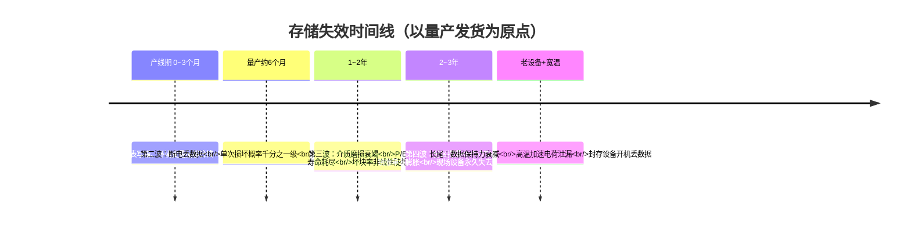

# 17.1 存储架构设计的真正对象：数据生命周期

> 所属章节：第17章 存储架构设计
>
> 难度：[E] | 预计阅读时间：50分钟

## <span class="blue"> 本节导读

存储架构是嵌入式系统中最容易设计失误的部分——不是因为技术难，而是因为**决策后果滞后显现**。断电丢数据通常在产品量产半年后才开始暴露，介质寿命问题可能一两年后爆发。本章的核心洞察是：存储架构设计不是选文件系统，而是设计一个**数据生命周期管理系统**——每类数据有不同的写入频率、持久化要求和恢复策略。本节先立方法论：看清失效的时间线，掌握数据分类的工具，然后用章首的工业网关场景完成第一次演练。<BR>
本节覆盖：

- 失效时间线：四波问题各在什么时候爆发、为什么开发期测不出来
- 不可逆窗口：存储选型在项目什么阶段锁死
- 数据生命周期分类法：写入频率 × 持久化要求 × 恢复策略
- 十类典型产品数据的存储策略模板
- 演练：工业网关七类数据过表，产出存储需求清单（17.2~17.5 的共同输入）

---

## <span class="blue"> 为什么存储问题总在量产半年后爆发

### 失效时间线：四波问题，一波比一波晚

把一款产品的存储相关失效按出现时间排序，会得到一条很有规律的曲线：



**第一波：分区设计缺陷（产线期，0~3 个月）**。这是唯一在量产前后就能暴露的问题：分区表写错、bootloader 环境变量偏移算错、recovery 分区忘了留。暴露早是因为它在首次烧录和首次启动时就触发。这也是四波里唯一"便宜"的问题——还没发货，改分区表就行。

**第二波：断电丢数据（量产约半年后）**。断电损坏是概率事件：单次断电损坏文件系统的概率可能只有千分之一，开发期你统共断电几十次，一次都没碰上，测试报告写着"断电测试通过"。量产一万台设备、每台每天断电一两次，半年后累计断电次数达到百万量级，千分之一的概率意味着上千次损坏事件。问题不是这时才存在，而是这时才**统计可见**。

**第三波：介质磨损衰竭（1~2 年）**。Flash 的 P/E 次数（擦写寿命）是硬上限。开发期跑三个月，写入总量可能只有现场一年的零头。日志分区每天写 100MB，消费级 eMMC 的 TLC 颗粒在写放大叠加下，一年左右就可能出现坏块率陡增——12.3.5 引用过的智能音箱案例就是这个形态：ext4 直接沿用桌面配置，一年后 eMMC 坏块率飙升到 12%，被迫返工重做文件系统层。

**第四波：分区撑爆（2~3 年，随 OTA 次数累积）**。每次 OTA，rootfs 都膨胀一点——新功能、新依赖、新库版本。分区按首版镜像 1.2 倍预留的团队，第三年的某次 OTA 会发现镜像放不进去了。此时设备已散布在客户现场，改分区表等于让所有存量设备暴露一次变砖风险。

**长尾：数据保持力衰减（老设备 + 宽温环境）**。NAND 里存的电荷会随时间泄漏，高温加速泄漏。消费级介质标称的数据保持力通常是 25°C 下的数字；户外设备夏天内部温度 70°C 以上，老设备的保持力可能从"十年"掉到"一年"。表现为：封存一年的库存机开机文件损坏、户外设备入夏后莫名其妙丢配置。

### 为什么开发期测不出来

四波失效有一个共性：**它们都由"时间 × 次数"驱动，而开发期两头都不够**。

| 失效类型 | 驱动因素 | 开发期与现场的量级差 |
|---------|---------|-------------------|
| 断电损坏 | 断电次数 × 单次损坏概率 | 开发：几十次断电；现场：万台 × 每天 = 十万次/月 |
| 介质磨损 | 累计写入量 / P/E 寿命 | 开发：三个月写入；现场：五年写入 |
| 分区撑爆 | OTA 次数 × 镜像膨胀率 | 开发：首版镜像；现场：二十次 OTA 之后 |
| 数据保持力 | 存放时间 × 温度 | 开发：常温、即烧即用；现场：高温、跨年存放 |

这意味着"测试通过"对存储架构几乎不构成证据——你测的是潜伏期。要覆盖这些失效，靠的是**设计期的定量估算**（寿命够不够五年，算出来，不是测出来）和**加速验证方法**（断电测试工装、写入量加速老化）。前者是 17.2.2 的方法，后者是 17.5 的题材。

### 不可逆窗口：选型在什么时刻锁死

存储决策的另一个特殊之处是**回退成本随项目阶段指数上升**：

```
方案设计      原理图/PCB     EVT/DVT      产线导入      发货之后
   │             │             │            │            │
   ▼             ▼             ▼            ▼            ▼
 改一个        改介质=重新     改分区=      改分区=      改任何存储
 文档           改版一次      产线烧录     全线返工     设计=召回级
 （免费）      （数周）       流程重做     （数月）     事故
```

介质选型在原理图阶段锁死（eMMC 贴片还是 SD 卡槽，PCB 上就定死了）；分区表在产线导入时锁死（烧录工装、出厂镜像按它生成）；文件系统和挂载参数在首次发货时锁死（OTA 更新策略依赖它）。到了"发货之后"这一格，任何存储架构层面的修改都要面对存量设备——这正是"决策后果滞后显现"的完整含义：**显现的时候，恰恰是最改不动的时候**。

所以本章的立场是：存储架构设计必须在方案设计阶段完成，且必须是**定量**的。而要做到定量，先得有一样东西——对产品里每一类数据的清醒认识。这就是下面的数据生命周期分类法。

> 💡 复盘自己手头在做的产品：它处于上面时间线的哪个阶段？哪些存储决策已经锁死，哪些还来得及改？这个问题比记住任何技术细节都值钱。

---

## <span class="blue"> 数据生命周期分类法

失效躲不掉、测试靠不住，那就必须在设计期把每类数据的命运想清楚。分类法用三个问题给产品里每一类数据定性。

### 三个维度：每类数据的三个问题

**问题一：写入频率——它多久写一次？** 频率直接决定它对介质寿命的压力：

| 档位 | 频率 | 典型数据 |
|------|------|---------|
| 一次写入 | 出厂时写一次 | 校准参数、序列号、密钥烧录 |
| 低频写 | 每天几次以内 | 应用配置、用户设置 |
| 高频写 | 每分钟到每小时 | 日志、状态快照 |
| 流式写 | 连续不断 | 传感器采集、音视频录像 |

**问题二：持久化要求——丢了会怎样？** 丢失代价决定它需要多强的断电保护：

| 级别 | 丢失后果 | 断电保护要求 |
|------|---------|-------------|
| 易失可弃 | 丢了无所谓，重启即重建 | 无（tmpfs 即可） |
| 可重建 | 丢了能重新生成/下载 | 低（定期 sync 足够） |
| 业务必须 | 丢了影响业务连续性 | 中（原子写 + 双写） |
| 不可丢失 | 丢了设备无法恢复或数据永久灭失 | 高（原子更新 + 硬件级保障） |

**问题三：恢复策略——坏了怎么救？** 恢复策略决定它需要什么布局支持：能重新生成的（rootfs 整分区重刷）、能回滚的（A/B 分区）、必须在线修复的（双写校验）、彻底没法救的（校准数据，只能出厂再校一次）。

> 写放大：应用写入 1KB 数据，介质实际擦写的数据量可能远大于 1KB——块设备最小擦除单元（eMMC 常为数 MB）、文件系统日志、FTL 垃圾回收层层放大。高频小写是介质寿命的头号杀手。

### 十类典型数据的归类与策略模板

把嵌入式产品里常见的数据全部过一遍三维分类，得到的总表就是本章反复引用的**数据分类表**：

| # | 数据类别 | 写入频率 | 持久化要求 | 恢复策略 | 存储策略模板 |
|---|---------|---------|-----------|---------|-------------|
| 1 | bootloader 环境变量 | 低频（OTA 切区时写） | 业务必须 | 双备份回退 | 独立小分区/eMMC Boot Area，双份 + CRC |
| 2 | 内核与 DTB | 低频（OTA 时） | 业务必须 | A/B 回滚 | 随 rootfs 走 A/B，或独立 boot 分区双份 |
| 3 | rootfs | 低频（OTA 时） | 可重建（重刷） | 整分区替换 | 只读 FS（SquashFS/EROFS）+ A/B |
| 4 | 出厂校准数据 | 一次写入 | 不可丢失 | 无法在线救 | 独立只读分区或 RPMB，写后锁定 |
| 5 | 安全密钥/证书 | 一次或低频 | 不可丢失 | 无法在线救 | RPMB 或 TEE 安全存储，禁止明文进数据区 |
| 6 | 应用配置 | 低频 | 业务必须 | 双写 + 校验 | 数据分区，原子写（写临时文件 + fsync + rename，机制见 12.5.2） |
| 7 | 运行日志 | 高频 | 可重建 | 定期滚动删除 | 独立日志分区，硬限容 + logrotate |
| 8 | 流式采集数据 | 流式 | 视业务：多数可丢尾帧 | 溢出丢弃 | 环形缓冲分区，写满回卷 |
| 9 | OTA 更新包 | 低频（升级时） | 可重建（重传） | 校验失败丢弃 | 独立暂存区，下载完验签才写目标分区 |
| 10 | 临时文件 | 高频 | 易失可弃 | 重启即清 | tmpfs，不占 Flash 一个块 |

这张表里有三个值得展开的设计要点：

**日志必须独立分区且硬限容（#7）**。日志是最典型的高频写数据，两个失效模式都臭名昭著：一是写穿介质寿命（第三波失效的主力），二是无限增长撑爆所在分区——如果日志和 rootfs 同区，撑爆的就是系统盘，设备直接起不来。独立分区 + 硬限容 + rotate，三个措施缺一不可，17.4 给出具体配置。

**校准数据和密钥要物理隔离（#4、#5）**。它们写入极少但丢失即死，恢复策略一栏是"无法在线救"。这类数据的去处是 OTP、RPMB 或出厂后只读的独立分区——17.4 讲 eMMC 硬件分区时展开。

**流式数据的"丢尾帧"语义（#8）**。录像、连续采集这类数据，断电时丢最后几秒通常可接受，但要求文件系统层面**已经落盘的部分完好**。这决定了它适合 F2FS/ext4 的常规写路径 + 定期 flush，而不是每帧 fsync（性能灾难）或从不 flush（断电丢失量失控）。

### 从分类表到需求清单

分类法不是填表游戏，它的输出物是**存储需求清单**——把产品所有数据过完三维分类后，按存储策略模板归并同类项，得到的就是架构设计的输入：

```
存储需求清单（模板）
┌──────────────────────────────────────────────┐
│ 1. 介质寿命压力 = Σ(高频+流式数据的日写入量)    │
│    → 17.2 寿命验算的输入                      │
│ 2. 只读集合 = {rootfs, 内核, 校准数据}         │
│    → 17.3 只读 FS 选型与 17.4 分区方案的依据   │
│ 3. A/B 需求 = 需要回滚的集合                  │
│    → 17.4 布局模式选择的依据                  │
│ 4. 断电保护分级 = 各类数据的持久化要求         │
│    → 17.5 防护组合的投入依据                  │
│ 5. 容量规划 = 各类数据体积 × 增长预期          │
│    → 17.4 分区大小预留的依据                  │
└──────────────────────────────────────────────┘
```

注意清单里每一行都标注了它流向哪里。后面三节（17.2 介质、17.3 文件系统、17.4 分区）加 17.5（断电防护）本质上就是在回答这份清单提出的问题——这也是为什么分类法必须放在全章最前面：没有它，后面的每个决策都缺少输入。

> 💡 真正动手做一次就会发现：大多数产品卡在第 4 类（校准数据）和第 8 类（流式数据）——前者常被忘在数据分区里和应用配置混在一起，后者常被当成普通日志处理。这两类分错，后期补的代价最大。

---

## <span class="blue"> 演练：工业网关的数据分类

分类法讲完即用。把章首决策场景的每一类数据逐个过一遍三维分类表，产出一份真实的存储需求清单。

### 场景与约束

先完整复述这个场景，所有约束都是后面决策的输入，一条都不能丢：

```
产品：户外工业网关
环境：-40°C ~ +85°C，无人值守，每天可能断电数次
存储：8GB eMMC（消费级还是工业级？——这本身是待决策项）
负载：每天写入约 100MB 日志数据
寿命：设计运行 5 年
硬性要求：
  ① 断电不能损坏系统
  ② OTA 更新必须可回滚
  ③ 存储接近满时仍保持基本功能
```

注意三个约束的指向：①指向断电防护（17.5），②指向分区布局（17.4），③指向配额策略（17.4）。而"每天断电数次"和"-40~85°C"两条，会直接否决一批介质和文件系统选项（17.2、17.3）。

### 七类数据逐个过表

工业网关的数据比消费产品简单，但每一类都有坑。逐个过：

**① bootloader 环境变量**。写入频率：低频（每次 OTA 切区时写一次启动槽位标记）。持久化要求：业务必须——环境变量损坏会导致 bootloader 不知道从哪个槽位启动。恢复策略：双备份回退。→ **策略：独立存放 + 双份 + CRC**，eMMC 场景的存放位置在 17.4 展开。

**② 内核 + DTB + rootfs**。写入频率：低频（OTA 时）。持久化要求：业务必须。恢复策略：A/B 回滚（场景硬性要求②）。→ **策略：只读 FS + A/B 双分区**。只读这一刀切下去，顺带解决了断电损坏问题的一大半——只读文件系统没有 journal，断电对它而言不存在"写一半"的状态。

**③ 应用配置**（采集周期、上报地址、告警阈值等）。写入频率：低频。持久化要求：业务必须。恢复策略：双写 + 校验。→ **策略：数据分区存放，原子写更新**（写临时文件 + fsync + rename，机制在 12.5.2 已讲过，此处只用结论）。

**④ 运行日志，每天 100MB**。写入频率：高频——全产品寿命压力的绝对主力。持久化要求：可重建（丢了重新攒）。恢复策略：滚动删除。→ **策略：独立日志分区 + 硬限容 + rotate**。100MB/天 × 5 年 ≈ 180GB 的累计写入量，这个数字将直接决定 17.2 寿命验算的结论。

**⑤ 采集缓存**（断网时暂存的业务数据，联网后补报）。写入频率：高频且不均匀（断网期间爆发式写入）。持久化要求：业务必须——这是网关的立身之本，丢缓存等于丢数据。恢复策略：断电后从最后一致点续写。→ **策略：独立分区，文件系统需要快速断电恢复能力**，这个需求在 17.3 的故障模式矩阵里会成为决定性的选型权重。

**⑥ OTA 更新包暂存**。写入频率：低频。持久化要求：可重建（下载失败重传）。恢复策略：验签失败整体丢弃。→ **策略：独立暂存区**，大小必须容纳完整镜像 + 解压余量。

**⑦ 临时文件**（/tmp、运行时锁文件）。写入频率：高频。持久化要求：易失可弃。→ **策略：tmpfs**，不占 Flash 一个块，顺带把一类高频写从介质寿命账上划掉。

### 产出：存储需求清单

七类数据过完分类表，归并同类项，得到这份清单。**每一行都标注了它流向哪一节**——17.2~17.5 做决策时，输入全部来自这里：

```
工业网关存储需求清单
┌────────────────────────────────────────────────────┐
│ 1. 寿命压力：日志 100MB/天 + 断网缓存突发            │
│    5 年累计 ≥ 180GB → 17.2 验算介质够不够           │
│ 2. 只读集合：{内核, DTB, rootfs}                    │
│    → 17.3 只读 FS 选型（SquashFS 还是 EROFS）       │
│ 3. A/B 需求：{boot 环境变量, 内核, rootfs}          │
│    → 17.4 布局模式（A/B + 独立数据区）              │
│ 4. 断电保护分级：                                   │
│    配置=业务必须（原子写）                           │
│    缓存=业务必须（快速恢复 FS）                      │
│    日志=可重建（常规写路径即可）                     │
│    → 17.5 分层防护的投入分配                        │
│ 5. 容量规划：8GB 要装下 A/B 双份 rootfs + 日志区     │
│    + 缓存区 + OTA 暂存区 → 17.4 大小预留            │
│ 6. 环境约束：-40~85°C + 每天数次断电                 │
│    → 17.2 消费级 eMMC 否决？数据保持力折算          │
└────────────────────────────────────────────────────┘
```

清单第 6 行值得停一下。"消费级还是工业级"在场景描述里就是悬而未决的——-40°C 的低温启动和 85°C 的高温保持力，消费级 eMMC（标称 -25~85°C，数据保持力按 25°C 标定）很可能直接出局。但工业级 eMMC 同容量贵出数倍，8GB 的账怎么算，17.2 的寿命验算和保持力分析会给出定量答案，而不是"户外设备当然上工业级"的经验拍板。

还要注意清单里**没有**出现的东西：本产品没有校准数据（纯软件网关），没有流式音视频。分类法的好处之一就是双向的——既防止漏分，也防止照抄别人的架构引入自己不需要的复杂度。

---

## <span class="blue"> 本节总结

本节立起了全章的方法论底座。失效时间线说明存储问题由"时间 × 次数"驱动、开发期天然测不出来，且选型在原理图、产线、首批发货三个节点依次锁死——所以必须在设计期定量决策。数据生命周期分类法用三个问题（写多勤、丢不丢得起、坏了怎么救）给每类数据定性，十类典型数据各有策略模板，输出物存储需求清单把"设计存储架构"变成五个可计算的问题。工业网关的演练证明这套方法可落地：七类数据过表，六条需求逐条流向后续决策域。从下一节开始，每个决策域都是在回答这份清单。

### 速查表

| 要点 | 内容 |
|------|------|
| 四波失效 | 分区缺陷（产线）→ 断电损坏（~6 个月）→ 介质磨损（1~2 年）→ 分区撑爆（2~3 年，随 OTA） |
| 覆盖不到的根因 | 失效由"时间 × 次数"驱动，开发期两头都不够 |
| 锁死节点 | 介质=原理图，分区表=产线导入，FS 与挂载参数=首次发货 |
| 分类三维度 | 写入频率（一次/低频/高频/流式）× 持久化要求（可弃/可重建/业务必须/不可丢失）× 恢复策略 |
| 最容易分错 | 校准数据（应物理隔离）、流式数据（环形缓冲+定期 flush，非每帧 fsync） |
| 日志三件套 | 独立分区 + 硬限容 + rotate，缺一不可 |
| 输出物 | 存储需求清单：寿命压力 / 只读集合 / A/B 需求 / 断电分级 / 容量规划 |

---

## <span class="blue"> 下一步

需求清单在手，第一个要回答的是第 1 行和第 6 行：这块 eMMC 撑不撑得住五年？架构师看介质，看的不是参数表——参数对比 16.4.5 已经做过了——而是寿命、黑盒和供应链。

> **17.2 存储介质决策：寿命量化与 2026 格局**

---

## <span class="blue"> 配套资源

| 资源类型 | 内容 |
|----------|------|
| **关联小节** | 12.3.5 智能音箱 eMMC 坏块率案例（第三波失效实例）；12.5.2 原子写机制（配置类数据的保护手段）；16.4.5 介质参数对比矩阵；17.5 断电测试方法论（第二波失效的加速验证） |
| **工程实践** | Android 的 /data、/cache、/persist 分区划分是这套分类法的成熟工业实例（persist 分区专门存放校准与设备标识） |
| **规范** | JEDEC JESD84-B51（eMMC 5.1 规范，寿命与保持力定义）；JEDEC JESD218/219（SSD 耐久度与负载标准，概念通用） |
| **动手建议** | 用自己产品的真实数据替换本场景的参数，独立产出一份需求清单，再与 17.6 的完整方案对照 |
