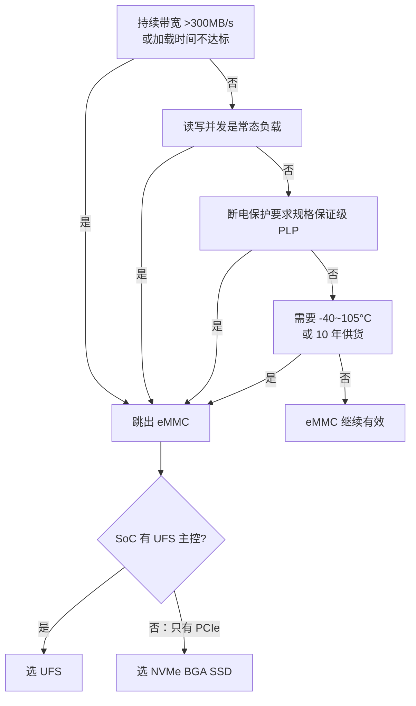

# 17.2 存储介质决策：寿命量化与 2026 格局

> 所属章节：第17章 存储架构设计
>
> 难度：[E] | 预计阅读时间：60分钟

## <span class="blue"> 本节导读

17.1 的需求清单把两笔账推到了介质决策面前：第 1 行（180GB 累计写入，介质撑不撑得住）和第 6 行（-40~85°C，消费级还是工业级）。介质选型的参数对比本书已经做过一次——16.4.5 把六种介质的容量、速度、引脚、温度、成本拉成 14 维矩阵并给了决策树，本节不再重复任何参数。本节立论：**参数对比选得出"能用的"，选不出"够用的"**。架构师在参数表之外必须回答三个问题：寿命够不够（17.2 前半）、黑盒信不信得过（中段）、以及 2026 年还要不要留在 eMMC 里（后半）。<BR>
本节覆盖：

- 参数表的盲区：四波失效没有一波是静态参数能预见的
- 寿命的工程量化：公式、三个修正因子、三层实测（iostat / `/sys/block/*/stat` / EXT_CSD）
- 工业网关验算：180GB 打在 8GB TLC 上的反直觉结论
- eMMC FTL 黑盒的三个实际后果与工业级介质的真实增量
- 数据保持力的温度折算：标称"十年"在 70°C 下剩多少
- 跳出 eMMC 的四个判据：带宽、并发、PLP、温度与供货

---

## <span class="blue"> 参数表之外，架构师还要回答什么

### 参数表的盲区

参数矩阵回答的是**静态适配**问题：容量够不够、接口有没有、温度范围标称值到不到、成本高不高。这些问题在原理图评审时就能全部打勾。

但 17.1 的四波失效里没有一波是静态参数能预见的：断电损坏——参数表没有"断电行为"这一列；介质磨损——参数表有"P/E 次数"，但 P/E × 容量 ≠ 实际寿命，中间隔着写放大和应用负载两个变量；数据保持力——参数表的保持力是 25°C 新片的数字，你的设备在 70°C 机箱里跑三年后的数字没人写。

换句话说，参数表告诉你这块介质**出厂时是什么**，架构师要回答的是它**五年后还剩什么**。这引出三个缺口。

### 三个缺口

**缺口一：寿命——"P/E 3K"到底够不够用。** 数据手册上写着"TLC，3000 次 P/E"。直接乘容量得到总写入量？不行——中间隔着写放大：应用每写 1GB，介质实际擦写的可能是 2GB 甚至更多。寿命不是查表动作，而是一笔账。

**缺口二：黑盒——eMMC 的 FTL 你看不见。** 用原始 NAND，坏块管理、ECC、磨损均衡全部在你的软件栈里（MTD/UBI，见 12.4），行为完全可见、可调、可验证。eMMC 把这一切封装进内置控制器，对外只暴露块设备——你省了事，也交出了可见性：

```
原始 NAND 路线                eMMC 路线
┌──────────────┐            ┌──────────────┐
│  你的 UBIFS   │            │  你的 ext4    │
├──────────────┤            ├──────────────┤
│  UBI 磨损均衡 │  ←可见     │  mmc_block   │
├──────────────┤   可调     ├──────────────┤
│  MTD/ECC     │   可验证   │  ??????????  │ ← FTL 黑盒
├──────────────┤            │  厂商固件     │   不可见
│  NAND 颗粒    │            ├──────────────┤   不可调
└──────────────┘            │  NAND 颗粒    │
                            └──────────────┘
```

**缺口三：时代——eMMC 不再是默认答案。** 16.4.5 的决策树定格在 eMMC 5.1 时代。2026 年，UFS 4.1/5.0 把手机级存储性能带进车载和边缘 AI，工业级 PCIe BGA SSD 带着硬件掉电保护进入 -40~105°C 场景。参数表不会提示**选项集合本身已经扩大**。

三个缺口就是本节后面三部分的内容。先算最硬的一笔账：寿命。

---

## <span class="blue"> 存储寿命的工程量化

### 寿命公式与三个修正因子

裸公式只有一行：

```
寿命（年）= 介质总可写量 ÷ 年实际写入量

介质总可写量 = 容量 × P/E 次数 ÷ 写放大系数
年实际写入量 = 日均写入量 × 365 × 负载波动系数
```

三个修正因子，每个都能让结果差出数倍。

**修正一：写放大（WA）**。来源分三层叠加：

```
应用写入 1GB
  ├─ 文件系统层放大：journal 双写、元数据更新、4KB 块对齐
  │    ext4 data=ordered 典型 1.1~1.3 倍；小文件随机写更高
  ├─ 块层/分区对齐：写入未对齐擦除块边界时的读-改-写
  └─ FTL 层放大：垃圾回收搬运有效页、磨损均衡主动搬迁
       eMMC 内部不可见，典型 1.5~3 倍，写满度高时恶化
```

总 WA 是三层的乘积。读多写少的系统 WA 接近 1.5；小文件高频随机写 + 分区占用率 90% 的系统，WA 可以到 5 以上。

**修正二：负载波动**。日均 100MB 是平均值，断网补报场景下日写入量可能冲到 500MB。寿命按峰值分布的合理分位数（如 95 分位）估算，不按均值。

**修正三：80% 规则**。设计寿命不用尽介质标称寿命——P/E 次数本身是统计值，且磨损末期坏块率非线性陡增。工程上把可用寿命打折到标称的 80%，剩余 20% 作为安全边际。

### 实测：不要估算，要测量

公式里的每个变量都应该来自测量而非假设。

**应用侧写入量**：`iostat -x 60` 长期采样，`wkB/s` 列累加折算日均写入量。生产灰度机上跑两周，覆盖工作日/周末/断网补报等典型工况。输出里四列值得逐列看：

```
Device    r/s    w/s    rkB/s    wkB/s   avgrq-sz   aqu-sz   await   %util
mmcblk0  12.4   38.7   498.2   1240.6       86.4      0.42    3.31   18.7
         ↑      ↑              ↑          ↑           ↑        ↑       ↑
       读IOPS 写IOPS      写带宽(选型    平均请求     队列深度  平均延迟  利用率
                          依据)        ~86扇区≈43KB  >1即排队  尖刺追GC  ≈100%饱和
                                    偏顺序化
```

**介质侧实际写入量**：`/sys/block/mmcblk0/stat` 第 7 个字段是累计已写扇区数（单位 512 字节扇区）。间隔读取取增量：

```bash
# 记录起始值，24 小时后再读一次
awk '{print $7}' /sys/block/mmcblk0/stat > /tmp/w0
# ……24 小时后……
awk '{print $7}' /tmp/w0 /sys/block/mmcblk0/stat | \
  awk 'NR==1{a=$1} NR==2{printf "日写入量: %.1f MB\n", ($1-a)*512/1048576}'
```

**块层写放大** = 介质侧日写入量 ÷ 应用侧日写入量（iostat 累加值）。注意这只能看到**块层以上**的放大，eMMC 内部 FTL 的进一步放大需要下一个工具。

**eMMC 寿命寄存器**：eMMC 5.0+ 的 EXT_CSD 寄存器组直接报告介质健康状态，用 mmc-utils 读取：

```bash
mmc extcsd read /dev/mmcblk0 | grep -iE "LIFE_TIME|PRE_EOL"
```

典型输出与逐行判读：

```
Device life time estimation type A [DEVICE_LIFE_TIME_EST_TYP_A]: 0x02
  ↑ SLC 模式区域寿命消耗估计：0x02 = 已消耗 10~20%
Device life time estimation type B [DEVICE_LIFE_TIME_EST_TYP_B]: 0x04
  ↑ MLC/TLC 区域寿命消耗估计：0x04 = 已消耗 30~40%
Pre EOL information [PRE_EOL_INFO]: 0x01
  ↑ 寿命预警：0x01 正常（预留块充足）
              0x02 = 已消耗 80% 预留块——触发备件更换流程
              0x03 = 紧急状态
```

这套寄存器是黑盒上唯一的观察窗——**产线抽检读一次建立基线，现场设备定期采集上报**，就能把"介质磨损"从盲飞变成仪表飞行。注意不同厂商的实现完整度不一，选型时把"寿命寄存器是否可信"列入对供应商的提问清单。

### 工业网关验算：180GB 打在 8GB TLC 上

把 17.1 演练的数字代进来：

```
介质：8GB eMMC，TLC，标称 P/E = 3000
介质总可写量（未修正）= 8GB × 3000 = 24,000GB = 24TB

修正一：写放大。日志以追加写为主、文件较大、分区占用率控制在 60% 以下，
        FS 层 ≈1.2，FTL 层 ≈1.8，总 WA ≈ 2.2
修正三：80% 规则
实际可用 = 24TB ÷ 2.2 × 0.8 ≈ 8.7TB

分母：日均 100MB × 365 × 波动系数 2 = 73GB/年
寿命 = 8700GB ÷ 73GB/年 ≈ 119 年
```

**119 年对 5 年——寿命完全不是瓶颈。** 这个反直觉的结论正是验算的价值：直觉上"每天 100MB 日志很伤 Flash"，实际上 8GB TLC 介质在这个负载下寿命裕量接近 24 倍。真正收紧寿命账的是另外两件事——分区占用率过高导致 WA 恶化（所以 17.4 的预留策略不是强迫症），以及把日志写到小容量介质上（同样的 100MB/天打在 512MB 的 SPI-NAND 上，寿命立刻掉到 7 年左右，裕量所剩无几）。

验算同时给消费级 vs 工业级之争提供了第一个定量输入：**寿命维度上，消费级 8GB eMMC 够用**。剩下的争议只剩温度与数据保持力。

> ⚠️ 验算结论强依赖 WA 假设。日志分区一旦因配额失控占用率冲到 90%+，FTL 垃圾回收效率恶化，WA 会从 1.8 往 3~5 爬，寿命同比腰斩。WA 要用实测值替换假设值后才能作为设计结论签字。

---

## <span class="blue"> eMMC FTL 黑盒与工业级介质

寿命账让消费级 8GB eMMC 活了过来，但工业网关还有两条硬约束没结账：-40~85°C 的温度范围，和每天数次的断电。这两条恰好都打在 eMMC 最不为人知的部位——内置 FTL 固件和数据保持力上。

### 黑盒的三个实际后果

**后果一：断电行为不可预测**。eMMC 断电时，FTL 正在做的垃圾回收、映射表更新是否原子完成，取决于厂商固件的断电保护设计——好的固件有内部掉电检测和映射表双写，差的固件断电后整片映射损坏，表现为**整卡不识**而非丢几个文件。这个差异在数据手册里不写，只能靠断电测试实测（17.5 的测试方法论在这里是介质验收手段，不只是系统验证手段）。

**后果二：性能曲线不透明**。FTL 垃圾回收触发时，写延迟会出现数量级尖刺——上面 iostat 解读里的 `await` 尖刺有一部分根因就在这里。你不知道 GC 什么时候触发、持续多久——能做的只有把分区占用率压下来给 GC 留余地，以及用 p99 延迟而非平均值做性能验收。

**后果三：同规格不同命**。同样标"8GB TLC 工业温宽"的两家 eMMC，内部颗粒来源、固件成熟度、预留块比例（OP ratio）可能完全不同。采购上"规格兼容即可二供"的逻辑对 eMMC 不成立——**二供切换必须重跑断电测试和寿命寄存器基线**。

### 数据保持力：被温度吃掉的标称值

> 数据保持力（Data Retention）：NAND 浮栅里的电荷随时间泄漏，保持力指断电存放后数据仍可正确读出的时长。它是"存放时间 × 存放温度 × 已磨损程度"的函数。

数据手册上"10 年保持力"的隐含条件是：**25°C 存放、新片（低磨损）**。三个因素都在啃这个数字：

- **温度**：泄漏速率随温度指数上升（阿伦尼乌斯模型）。70°C 存放环境下，保持力相对 25°C 标称值可下降一个数量级以上。
- **磨损**：P/E 消耗越多，氧化层损伤越重，保持力越差——接近寿命末期的片子与新片差出数倍。
- **工作/存放温差**：JEDEC 的保持力模型区分写入时温度与存放温度的组合，"低温写入、高温存放"是最恶劣的组合之一。

回到工业网关：85°C 工作环境 + 5 年寿命 + 每天数次断电。如果设备可能在高温下断电存放（夏天户外机柜断电一周），消费级 eMMC 新片标称保持力的温度折算结果会逼近百天量级——OTA 之后很少被重写的 rootfs 和校准数据，恰好就是最容易先烂掉的部分。这就是"消费级可能出局"的定量理由，比"户外设备当然上工业级"的经验判断有力得多。

> ⚠️ 保持力衰减不是均匀发生的：越不常被重写的数据越危险（电荷泄漏后没有刷新机会）。rootfs、校准分区、出厂后不再变动的配置文件是第一批受害者——这个结论直接影响 17.4 的分区设计：只读不等于安全，只读 + 长期不重写 + 高温才是。部分车规/工业介质提供数据刷新（refresh）机制对抗这条衰减链，选型时可询问供应商。

### 工业级介质的钱花在哪

工业级 eMMC 相对消费级的真实增量，按重要性排序：

| 增量 | 买到的确定性 | 对应哪笔账 |
|------|------------|-----------|
| 宽温颗粒与筛选（-40~85/105°C） | 温度范围内功能与保持力有保证书 | 保持力折算、低温启动 |
| pSLC 模式 | 部分容量可配置为 SLC 模式运行：P/E 从 3K 提到 20K+，保持力同步改善，代价是可用容量减半或更少 | 寿命验算、保持力 |
| 固件质量与断电保护设计 | 映射表原子更新、内部掉电检测 | 断电损坏率（第二波失效） |
| 寿命寄存器完整实现 | EXT_CSD 寿命字段可信、部分厂商提供更细的磨损计数 | 上文"仪表飞行" |
| 长期供货承诺（5~10 年） | 产品生命周期内不用换介质重新验证 | 供应链、二供风险 |

注意 pSLC 的双面性：它是解决寿命和保持力的好工具，但**容量打折**——8GB 的片子开 pSLC 模式可能只剩 4GB 可用。17.4 的分区预算如果贴着容量上限做，这里会爆。pSLC/增强区域的配置是一次性 OTP 风格操作（经 EXT_CSD 分区属性寄存器，通常由厂商工具或产线流程完成），配错不可逆，必须在设计评审时拍板。

### 决策条件：工业网关的最终判定

把三笔账合起来：

| 维度 | 消费级 8GB eMMC | 工业级 8GB eMMC |
|------|----------------|----------------|
| 寿命（验算） | ✅ 119 年，裕量 24 倍 | ✅ 更宽 |
| 保持力（85°C + 长期存放） | ❌ 折算后百天量级，rootfs/校准数据危险 | ✅ 宽温筛选 + pSLC 可选 |
| 断电固件行为 | ⚠️ 未知，需实测且二供要重测 | ✅ 设计有保证，文档支持 |
| 成本 | 基准 | 数倍 |

**判定：工业网关选工业级 eMMC，且启用 pSLC 模式存放 rootfs 与校准类数据**（容量预算在 17.4 重新核算）。决策依据不是"户外设备要可靠"的笼统正确，而是保持力温度折算这一个可计算的点——这个推导链条可以写进设计文档接受评审，经验拍板不能。

---

## <span class="blue"> 什么时候该跳出 eMMC：UFS 与 NVMe 判据

前面都在 eMMC 的世界里算账。但 2026 年的嵌入式存储选项集已经扩大：UFS 4.1（JEDEC 2024 年 12 月发布）/UFS 5.0（2026 年初发布，目标 10.8GB/s 量级）进入车载 ADAS 与边缘 AI，工业级 PCIe BGA SSD 带着硬件掉电保护站上 -40~105°C 温区。本部分不展开 UFS/NVMe 的协议细节（那是 B 扩展的题材），只回答一个架构问题：**什么时候 eMMC 不再是正确答案**。

### 判据一：持续带宽超过 eMMC 天花板

eMMC 5.1 HS400 的理论上限是 400MB/s（8 位并行、200MHz DDR），实际持续读通常在 300MB/s 上下，写更低。这是物理接口决定的硬顶。

什么负载会碰到这个顶：

| 负载 | 带宽需求 | eMMC 是否够 |
|------|---------|------------|
| 日志/配置/传感器低频采集 | <10MB/s | ✅ 绰绰有余 |
| 单路 1080p 录像 | ~10MB/s | ✅ |
| 多路 4K 录像（4~8 路） | 100~400MB/s 持续写 | ⚠️ 贴顶，无裕量 |
| 边缘 AI 大模型加载 | 加载时间 = 模型体积 ÷ 读带宽，10GB 模型在 300MB/s 下要 33 秒 | ❌ 体验不可接受 |
| 车载 ADAS 多传感器流 | 持续数百 MB/s 读写混合 | ❌ |

### 判据二：读写并发是常态

eMMC 是**半双工**：同一时刻只能读或写。录像同时回传、下载模型同时推理、日志写入同时读配置——只要读写并发是常态负载，半双工就意味着互相排队，p99 延迟恶化。

> 命令队列（Command Queueing）：主机一次下发多条读写命令，存储控制器自行调度执行顺序并发处理。SATA 时代叫 NCQ，NVMe/UFS 把它做成核心能力；eMMC 5.1 有有限的 CQ 支持但生态与效率都不可同日而语。

UFS 走 MIPI M-PHY 串行差分 + SCSI 命令模型，原生全双工 + 命令队列；NVMe 走 PCIe + NVMe 协议，为多队列大并发而生。**读写混合负载的 p99 延迟**是这个判据的测量指标：在 eMMC 上测出读写并发时 p99 超时，就是跳出信号。

### 判据三：需要硬件级掉电保护（PLP）

> PLP（Power Loss Protection）：存储设备内置储能电容 + 固件保护逻辑，断电瞬间用储能完成缓存数据的最后写入并保护映射表。17.5 会讲系统级的超级电容方案；PLP 是把同样的思路做进了存储设备内部。

前面说过，eMMC 的断电行为押在厂商固件上，数据手册不承诺。而工业级 NVMe BGA SSD 把 PLP 做成规格项——**断电行为从"实测抽奖"变成"规格保证"**。对"每天断电数次 + 数据不可丢失"的场景（车载数据记录、工业黑匣子），这条可以直接成为一票否决项：没有 PLP 规格书的介质不入围。

### 判据四：车规温度与长供货周期

-40~105°C（AEC-Q100 Grade 2 温区）+ 10 年以上供货承诺，是车载和电力等行业的入场券。UFS 从 3.0 起引入车载特性（扩展温区、数据刷新操作对抗保持力衰减）；工业/车规 NVMe BGA SSD 以 -40~105°C + PLP + 长供货作为标准产品形态。消费级 eMMC 止步于 -25~85°C 与消费级供货周期。

### 跳出之后：UFS 还是 NVMe

| 维度 | UFS（4.1/5.0） | NVMe BGA SSD |
|------|---------------|--------------|
| 带宽 | UFS 3.1 约 2.9GB/s，4.x 翻倍级，5.0 目标 10.8GB/s 量级 | PCIe Gen3×4 约 3.5GB/s，Gen4/5 更高 |
| 功耗 | 每比特功耗最优，电池设备首选 | 功耗较高，适合有电源裕量的设备 |
| SoC 要求 | SoC 必须有 UFS 主控（手机/车载 SoC 标配，通用 MPU 少见） | 需要 PCIe lanes，主流高性能 SoC 都有 |
| 形态 | BGA 焊接，无连接器 | BGA 焊接（工业）或 M.2（可维护场景） |
| 典型落点 | 手机、车载座舱/ADAS、手持边缘 AI | 工业服务器、边缘 AI 盒子、数据记录器 |

工程现实是**第二跳常常由 SoC 决定**：你选的 SoC 有 UFS 主控就走 UFS，只有 PCIe 就走 NVMe。介质选型到这里已经和 SoC 选型（16 章的题材）耦合在一起——这也是为什么存储架构要在方案设计阶段定，而不是硬件打样后补。

### 判决流程

对着需求清单走一遍：



工业网关走一遍：四个判据全不命中（100MB/天日志、读写并发少、断电保护靠系统设计补足、85°C 在工业级 eMMC 温区内）——**eMMC 维持原判**。这个"不跳出"的结论和"跳出"同样重要：判据的价值是防止被新名词带着跑。

> 💡 UFS 5.0 的 10.8GB/s 是按边缘 AI 的模型加载需求设计的数字。如果你的产品路线图里没有大模型本地加载或持续数百 MB/s 的数据流，这些数字与你无关——判据四问就是用来挡住"参数诱惑"的。

---

## <span class="blue"> 本节总结

介质决策域闭环。参数表管"能用"，本节管"够用"：寿命是算出来的——公式乘上写放大、负载波动、80% 规则三个修正，每个变量实测（iostat 管应用侧、`/sys/block/*/stat` 管介质侧、EXT_CSD 寿命寄存器管黑盒内部），工业网关算出 119 年对 5 年的反直觉结论；黑盒的代价是断电行为靠实测、性能看 p99、二供切换重验证，工业级溢价买的是宽温保持力保证、pSLC、可信固件等五样确定性，网关的判定落在保持力温度折算这一个可计算的点上；2026 年跳出 eMMC 的四个判据（带宽/并发/PLP/温度供货）网关全不命中，维持工业级 eMMC 原判。三笔账都有完整证据链——这就是架构决策和"我觉得"的区别。

### 速查表

| 要点 | 内容 |
|------|------|
| 寿命公式 | 容量 × P/E ÷ WA × 0.8 ÷（日写入 × 365 × 波动系数） |
| WA 三层 | FS 层（journal/对齐）× 块层（对齐）× FTL 层（GC/磨损均衡） |
| 实测三工具 | `iostat -x`（应用侧）；`/sys/block/*/stat` 字段 7（介质侧）；`mmc extcsd read`（黑盒内部） |
| 关键判读 | PRE_EOL_INFO=0x02 → 触发备件流程 |
| 网关验算 | 8GB TLC + 100MB/天 ≈ 119 年，寿命不是瓶颈；占用率失控才是 |
| 黑盒三后果 | 断电行为实测、性能看 p99、二供重验证 |
| 保持力三啃食 | 温度（阿伦尼乌斯）、磨损程度、工作/存放温差 |
| 网关判定 | 工业级 eMMC + pSLC 存 rootfs/校准，依据=保持力折算 |
| 跳出四判据 | 带宽 >300MB/s / 读写并发常态 / PLP 规格保证 / -40~105°C 或 10 年供货 |
| 第二跳 | UFS 还是 NVMe 由 SoC 接口决定（与 16 章 SoC 选型耦合） |

---

## <span class="blue"> 下一步

介质定了：工业级 eMMC + pSLC。下一个决策域是文件系统——12.3 已经讲过每种 FS 怎么工作，17.3 换架构师的视角：断电之后，它们各自坏成什么样。

> **17.3 文件系统决策：故障模式视角与 EROFS 时代**

---

## <span class="blue"> 配套资源

| 资源类型 | 内容 |
|----------|------|
| **工具** | `iostat -x`（sysstat 包）；`mmc extcsd read`（mmc-utils 包）；`fio` 负载模拟（用法见 12.3.5） |
| **关联小节** | 16.4.5 介质参数矩阵与决策树（本节前置输入）；12.3.5 写放大测量与 fio 方法；12.4.2 UBI 层机制（原始 NAND 路线的可见性对照）；17.4 分区占用率与 WA 的关系、pSLC 与硬件分区配合；17.5 断电测试方法论（介质验收手段）与系统级超级电容方案（与 PLP 对照） |
| **规范与趋势来源** | JEDEC JESD84-B51（EXT_CSD 寿命寄存器、pSLC/增强区域）；JEDEC JESD218/219（耐久度分级与负载模型）；JEDEC JESD220 系列（UFS 4.1/5.0）；AEC-Q100（车规温区定义）；行业动态以 JEDEC 发布与原厂公告为准（2026 年 8 月时点） |
