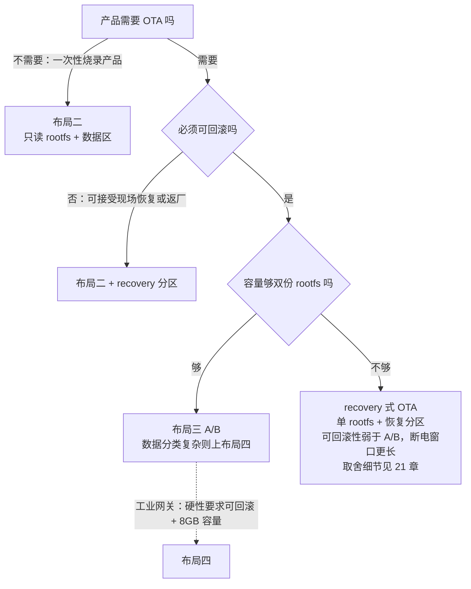

# 17.4 分区架构：只读 rootfs 是产品化的分水岭

> 所属章节：第17章 存储架构设计
>
> 难度：[E] | 预计阅读时间：60分钟

## <span class="blue"> 本节导读

17.3 收口时，工业网关的文件系统方案已经落定：rootfs 用 EROFS，缓存和日志用 F2FS，配置走原子写。但文件系统回答的是"一个分区内部怎么组织数据"，还没回答"整颗 Flash 上摆几个分区、各自放什么、各放多大"。这就是分区架构——大纲原话："分区策略是架构决策，不是技术选型"。它的特殊性在于：这是存储架构里少数"一次决策、终身有效"的环节，分区表随量产冻结，之后改任何一个边界都等于召回。<BR>
本节覆盖：

- 立论：为什么量产产品的 rootfs 必须是只读的（三重收益 + 一个判据）
- 四种布局模式：从开发期单分区到量产 A/B 加细分数据区，以及演进路径
- OTA 策略决策树：布局选择的主驱动变量收敛
- 分区大小与配额：rootfs 预留、日志硬限容、数据区阈值、recovery 纪律
- eMMC 硬件分区（Boot Area / RPMB / GPP）的架构利用
- 收束：逐区域断电暴露清单——17.5 防护投入的直接依据

---

## <span class="blue"> 为什么只读 rootfs 是分水岭

### 开发镜像与产品镜像的分界

开发板出厂镜像是可读写 rootfs：一根 ext4 分区从头挂到尾，装包直接写进系统目录，改配置改完重启即生效。开发期这种形态的效率是真实的，没有团队愿意在联调阶段为改一行配置重新打一次镜像。

问题在于，同样的形态带进量产，三个失效模式会排队上门。它们分别对应只读 rootfs 的三重收益，逐个看。

### 收益一：断电免疫

17.3.2 的故障模式矩阵里，只读文件系统那一行是"免疫"——没有 journal 要 replay，没有 checkpoint 要回滚，因为根本不存在"写一半"这种状态。矩阵的这一行在分区层有一个直接推论：**凡是断电瞬间可能处于被写状态的文件系统，都需要恢复机制；只读 rootfs 把恢复问题从系统盘上整个消掉了**。

对照可写 rootfs 的失效模式：断电恰好打在包管理器写库文件、或后台服务写状态文件的途中，journal replay 能修复元数据，但被写穿的数据文件本身可能已经损坏（17.3.2 的 ext4 卡片：元数据可恢复 ≠ 数据可恢复）。更隐蔽的变体是损坏落在 libc 或 init 的依赖链上——系统不再干脆地 panic，而是以一种更难诊断的方式行为异常：某个服务起不来、某条命令段错误，排查者第一反应是去查应用，绕一大圈才发现是系统文件坏了。

> 💡 断电免疫只对"不写"成立。rootfs 只读挂载后，仍有进程试图往 `/etc`、`/var` 写运行时状态，这些写需求必须被显式接管，见本节"代价"一段。

### 收益二：整分区原子替换

OTA 要可回滚，前提是"系统"是一个可以整体替换、整体校验的对象。只读 rootfs 恰好满足：镜像是构建机的产物，字节级确定；刷进备用分区后可以做整镜像哈希校验，验签通过才切换启动槽位。升级中途断电，正在使用的那一份一个字节都没被动过——**原子性由"新旧两份物理分离"保证，不依赖任何文件系统机制**。

可写 rootfs 做不到这一点。在线更新的系统内容随时在变，不存在可供整体校验的对象；升级到一半断电，留下的是一个半新半旧、没有任何机制能描述其状态的 rootfs。17.3.4 已经立过同一结论的另一面：dm-verity 的哈希树以静态镜像为前提。两条合在一起——**OTA 原子更新和完整性校验，消费的是同一个前提：rootfs 只读**。

### 收益三：防篡改

只读挂载的 rootfs，攻击者拿到 root 也无法直接持久化写入；重挂为可写这条路又能被 dm-verity 堵死——被改动的镜像块过不了哈希校验，读出来就是错的。即使设备在运行期被攻破，重启之后系统回到构建机出厂的那个已知状态，持久化后门无处安放。

这条收益在政策背景下是硬性的：欧盟 CRA 把防篡改与可更新能力写成入场要求之后，"rootfs 只读 + dm-verity + 可回滚 OTA"从加分项变成基线组合，而这个组合的支点就是只读 rootfs。安全侧的完整设计在第 19 章，本章只确认支点。

### 代价：被挤出的可写需求去哪

rootfs 只读化不是零成本——原本随手落在 `/etc`、`/var` 的写需求被挤出，必须逐个安排去处。出口只有三个：

| 写需求 | 去处 | 持久性 |
|--------|------|--------|
| 运行时临时状态（锁文件、套接字、临时文件） | tmpfs（`/tmp`、`/run`） | 易失，不占 Flash |
| 配置、业务数据、日志 | 独立数据分区（布局二起） | 持久，自行承担断电防护 |
| 应用坚持写 rootfs 路径且改不动代码 | overlayfs 易失上层（tmpfs 做 upper） | 易失，重启还原 |

第三行是兼容手段，值得把命令看明白：

> overlayfs：联合挂载文件系统，把两层目录叠成一个视图——lower 层只读提供底座，upper 层可写承接修改，读时 upper 优先、写时只动 upper。机制细节在 12.3.4。

```bash
# 在只读 rootfs 的 /etc 上叠一层易失可写层
# lower=/etc（只读底座），upper=/run/etc-upper（tmpfs，重启即失）
# work= 是 overlayfs 的内部工作目录（原子拷贝用），也必须在可写层上
mount -t overlay overlay -o lowerdir=/etc,upperdir=/run/etc-upper,workdir=/run/etc-work /etc
```

应用看到的 `/etc` 可写，改配置、写状态都能成功，但所有修改只落在 tmpfs 里，重启后还原成构建机的出厂状态。这是"应用代码改不动"时的兜底——能用，但要知道自己让渡了什么（见布局二的两种玩法对比）。

至此"分水岭"可以给出判据：**一个镜像能不能把 rootfs 做成只读，取决于它的全部写需求是否都被显式识别并安排了去处**。做得到，它是产品镜像的候选；做不到，它仍只是开发镜像。这条判据在 17.6 的评审清单里会作为分区设计组的第一条评审项出现。

---

## <span class="blue"> 四种布局模式与演进路径

分水岭判据落成具体布局，是四种模式。它们不是四个平行选项，而是一条演进路径上的四个站点——但先把每个站点本身讲清楚。

### 布局一：单分区读写（开发期）

```
┌──────────────────┬─────────────────────────────────┐
│ boot（kernel/DTB）│ rootfs（ext4，rw）               │
│                  │ 配置、日志、状态全在这一个分区里     │
└──────────────────┴─────────────────────────────────┘
```

工具链的默认产出，调试零摩擦：改什么都是就地改，重启即生效。代价是分水岭前的三个失效模式全数暴露——断电恢复靠 journal，无整体校验对象，无防篡改可言。

定位明确：**这是开发设施，不是产品形态**。它唯一的架构价值是作为演进路径的起点——但要警惕一个惯性：开发期越长，落在 rootfs 里的隐性写需求越多，写需求普查就越难做。布局一住得越久，搬出去的成本越高。

### 布局二：只读 rootfs + 可写数据区（产品基线）

```
┌───────────────────────┬─────────────────────────────┐
│ rootfs（EROFS，只读）   │ data（F2FS/ext4，rw）        │
│                       │ 配置、日志、业务数据           │
└───────────────────────┴─────────────────────────────┘
tmpfs 接管 /tmp、/run；改不动代码的应用由 overlayfs 兜底
```

跨过分水岭后的最小产品形态。rootfs 只读拿到三重收益，全部持久写需求集中到 data 分区——断电防护的战场也随之收缩到这一个分区（17.5 的分层防护只对它展开）。

overlayfs 在这里有两种玩法，取舍要看清：

| 玩法 | upper 层 | 语义 | 适用 |
|------|----------|------|------|
| 易失层 | tmpfs | 应用可写，重启还原 | 应用要写 rootfs 路径但不需要持久化（兜底首选） |
| 持久上层 | data 分区上的目录 | 修改持久保留 | 需要现场改系统行为的场景——慎用 |

第二行要慎用的原因：持久 upper 意味着 rootfs 的实际内容运行期可变，防篡改收益被部分让渡——dm-verity 校验的只剩底座那一份，upper 里的修改游离在校验之外。能用易失层解决的，不要上持久上层。

适用边界：无 OTA 需求的产品，或接受 recovery 式 OTA（见本节决策树）的产品，布局二就是终点。

### 布局三：A/B 双分区（OTA 原子更新）

```
┌──────────────┬──────────────┬───────────────────────┐
│ rootfs_a     │ rootfs_b     │ data（rw，两槽共享）    │
│ 当前槽位      │ 备用槽位      │                       │
└──────────────┴──────────────┴───────────────────────┘
```

更新语义：新镜像整体写入备用槽位 → 整镜像校验与验签 → bootloader 切换槽位标记 → 新系统启动确认后才算生效；任一步失败，回退到旧槽位。分水岭收益二在这里落成具体结构——**回滚能力不是软件技巧，是双份物理存在**。

两个代价要提前计入：

1. **空间**：rootfs 占两份，容量预算里这是最大的一项刚性支出（下文配额一节展开）。
2. **数据兼容性**：新旧两个版本共享同一份 data 分区，新版本写的数据格式旧版本必须能读——回滚之后旧系统面对新数据不能崩。这条纪律（schema 前后兼容）属于应用层，但它的根因在分区布局：A/B 只复制系统，不复制数据。实践中这条纪律的破坏方式很朴素：某版本给配置文件加了个字段、改了数据库 schema，回滚后旧版本解析失败。约束要写成规则：配置与数据库变更只做增量兼容式演进，破坏性变更跨两个版本过渡。

槽位切换的 bootloader 侧实现、镜像签名链、灰度与防降级策略，全部属于 21 章的领土，本章不展开。

### 布局四：A/B + 独立数据区细分（量产形态）

```
┌─────────┬─────────┬────────┬────────┬────────┬──────────┐
│rootfs_a │rootfs_b │ 日志    │ 缓存    │ 配置    │ OTA 暂存  │
│ EROFS   │ EROFS   │ F2FS   │ F2FS   │ 原子写  │          │
└─────────┴─────────┴────────┴────────┴────────┴──────────┘
```

把布局三的数据区按 17.1.2 的分类再拆开。细分的理由有三条，每条都对应前面章节的结论：

1. **防护粒度不同**——配置要原子写、缓存要快速恢复 FS、日志常规写路径即可（17.1.3 清单第 4 行）。混在一个分区里，只能按最高标准整体防护，浪费性能。
2. **限容隔离**——日志必须有硬上限，写满不能殃及配置（下文配额一节展开，这是场景约束③"接近满仍保持基本功能"的落点）。
3. **寿命记账清晰**——高频写集中在可监控的分区，`/sys/block/*/stat` 的采样数据才能按分区归因（17.2.2 的实测方法依赖这个前提；eMMC 的 stat 是整盘级的，按分区归因要靠 iostat 的 per-device 采样加分区容量折算——细分让这笔账对得上）。

代价同样明确：分区数量上升，容量规划错一处就量产冻结，分区表本身成为需要评审的设计产物。

### 演进路径：从开发期到量产

| 阶段 | 布局 | 本阶段要完成的事 |
|------|------|-----------------|
| 开发期 | 一 | —（但开始记录 rootfs 里的写需求清单） |
| 试产前 | 一 → 二 | 写需求普查（分水岭判据）；分区表拆分；tmpfs/overlayfs 接管 |
| 联调后期 | 二 → 三 | A/B 分区表；bootloader 槽位支持；OTA 工具链进场（21 章） |
| 量产冻结前 | 三 → 四 | 数据区细分定案；容量审计；产线烧录脚本 |

路径上最贵的一步是第一步：写需求普查做得越晚，隐性依赖越多。最不可逆的一步是最后一步：分区表随量产冻结，之后再改等于召回。

### OTA 策略决策树

布局选择的主驱动变量收敛为一张流程图（大纲三棵决策树的第三棵）：



决策树给出的是存储侧布局结论；OTA 方案（RAUC/SWUpdate/Mender）选型、灰度发布、防降级策略在 21 章接续。两条现实世界参照系：Android 的无缝更新（Seamless A/B）是布局三的成熟工业实例；recovery 式 OTA（Android 早期与多数路由器方案）是决策树末支的对应物。

---

## <span class="blue"> 分区大小与配额策略

布局定了格子，每个格子多大还没定。分区大小定错，失效全部滞后——17.1.1"存储问题量产半年后才爆发"在分区层有三个具体形态：

1. **OTA 膨胀**：rootfs 镜像随版本单调增大，某天新镜像放不下预留分区——现场设备从这一天起永久失去升级能力。失效时点通常在发布后 2~3 年。
2. **日志撑爆**：无硬限容的日志写满共享分区，同区的配置写入随之失败——设备行为开始漂移，而日志里什么都记不下（分区满了）。失效可在数月内发生。
3. **满盘劣化**：数据区长期高占用，FTL 空闲块不足，写放大上升、磨损加速（17.2.2 的写放大从估算参数变成运行时变量）——寿命账提前透支，失效以年计。

三条线的共同点：都由设计期的一个数字决定，运行时无解。下面把四个数字（rootfs 预留、日志上限、数据区阈值、recovery 大小）逐个定出依据。

### rootfs：按当前镜像 × 1.2~1.3 预留

膨胀的来源是结构性的：功能叠加、依赖库膨胀、安全补丁带进新依赖。对一个 5 年生命周期的产品，20~30% 的预留是覆盖这个斜率的经验区间；A/B 布局下两份 rootfs 都按此预留，这是容量预算里最大的刚性支出。

预留不足没有任何运行时补救——分区边界改不了。配套的管理动作是把镜像大小变成一条被监控的曲线：

```bash
# 每个 release 在 CI 里记录镜像体积，入审计曲线
stat -c '%s' rootfs.erofs >> image-size-history.csv
# 按斜率外推：预计触线前只有两个选择——砍功能，或趁量产未冻结扩分区
```

前者是每个版本都能做的决定，后者只在量产前存在。

### 日志：独立分区 + 硬限容

硬限容的三层手段，从严到宽：

| 层级 | 手段 | 语义 |
|------|------|------|
| 物理隔离（首选） | 独立分区 | 写满只影响日志自己，结构上不可能殃及邻居 |
| 分区内闸门 | journald 的 `SystemMaxUse`、logrotate 的 `size/maxsize` | 用量上限，独立于分区大小生效 |
| 易失兜底 | 日志整体放 tmpfs，只留导出通道 | 极端环境或调试期的取舍，断电即丢 |

三层可叠加。journald 的闸门配置长这样：

```ini
# /etc/systemd/journald.conf
[Journal]
Storage=persistent
SystemMaxUse=512M        /* 日志总量硬上限，触线即删最旧 */
SystemKeepFree=100M      /* 永远给分区保留的空闲量 */
MaxFileSec=1day          /* 单文件最长寿命，加速滚动 */
```

值得把失效模式讲透：日志与配置同区时，写满之后配置的原子写（12.5.2 的临时文件 + fsync + rename）连创建临时文件的空间都没有，rename 无处发生，配置更新静默失败——应用以为自己改成功了，重启后读到旧值。这种失效的可怕之处是**没有报错路径**：写入 syscall 返回成功还是失败取决于应用的实现细节，多数应用不检查 fsync 的返回值。场景约束③"接近满仍保持基本功能"的落点就在这里：基本功能的定义是"配置可写、缓存可续"，日志永远不该有能力击穿这条底线。

### 数据区：80% 报警 / 90% 清理

阈值为什么不设成 95%：FTL 需要空闲块做垃圾回收与磨损均衡，占用率越高，每次写入可用的干净块越少，写放大随之上升——同一份日志写入量，在 90% 占用的盘上消耗的寿命显著高于 50% 占用的盘（17.2.2 验算里 WA 假设的前提就是占用率受控）。80%/90% 不是洁癖，是把写放大摁在低位的运行区间。

阈值落地为守护进程的两个动作：

```bash
# 监控循环的骨架：80% 上报，90% 清理
use=$(df --output=pcent /data | tail -1 | tr -d ' %')
if [ "$use" -ge 90 ]; then
    # 清理策略：删最旧的日志与缓存；配置与业务数据永不在清理列表
    find /data/log -name '*.log.*' -mtime +7 -delete
    logger -t quota "data partition at ${use}%, cleanup triggered"
elif [ "$use" -ge 80 ]; then
    logger -t quota "data partition at ${use}%, report to telemetry"
fi
```

清理策略的优先级清单属于应用设计，但"达到阈值必须有事发生"是架构要求——沉默地逼近 100% 是最差结局。

> 超量供应（Over-Provisioning）：不分配给任何文件系统、刻意留白给 FTL 当空闲块的容量。占用率控制是分区内的超量供应；分区表留白是整盘级的超量供应——都是用容量买寿命。

### recovery 与工厂重置分区

recovery 分区放一个最小系统（kernel + initramfs，或一份精简的只读 rootfs），承担两个职责：主系统两个槽位都损坏时的修复入口；工厂重置的执行者（清空数据区、恢复出厂配置）。

两条设计纪律。第一，recovery 自身也用只读 FS，且不纳入常规 OTA——它是"最后一块不变的地"，更新它只在工厂流程里发生。第二，它的大小按最小集核算，通常远小于主 rootfs：只带网络、刷写工具和显示/串口交互，不带业务。把 recovery 做成主 rootfs 的完整副本是常见的过度设计，白白吃掉一份 A/B 级的空间。

### 工业网关容量预算草案

8GB 标称的实际可用要先打个折：存储厂商的 GB 是十进制，8 GB = 8×10⁹ 字节 ÷ 2³⁰ ≈ 7.45 GiB，再扣除出厂坏块替换与 FTL 保留，按约 7.3 GiB 可规划。草案如下（17.6 走查后定稿）：

| 分区 | 大小 | 文件系统 | 依据 |
|------|------|----------|------|
| rootfs_a / rootfs_b | 各 768 MiB | EROFS | 当前镜像约 600 MiB × 1.25 预留 |
| recovery | 512 MiB | EROFS（最小集） | 修复入口 + 工厂重置 |
| OTA 暂存 | 1 GiB | —（raw/F2FS） | 容纳完整镜像 + 解压余量 |
| 日志 | 1 GiB | F2FS，硬限容 | 100MB/天 × 滚动保留窗口 |
| 采集缓存 | 1.5 GiB | F2FS | 断网缓存的爆发式写入余量 |
| 数据（配置等） | 512 MiB | F2FS | 低频小数据，原子写 |
| 合计已分配 | 6.0 GiB | — | — |
| 留白（超量供应） | 约 1.3 GiB | 不分配 | 压低整盘占用率，买寿命 |

 Boot Area 与 RPMB 不占这份预算——它们是 eMMC 的硬件独立区域，由下一部分处置。

---

## <span class="blue"> eMMC 硬件分区的架构利用

上面摆的都是 User Data Area——eMMC 里唯一被分区表管理的区域。但一颗 eMMC 芯片内还有几块硬件级区域，容量、访问方式、断电语义各不相同。16.4.5 和 16.5.1 已经讲过怎么配置，这里回答架构问题：**什么数据该住进哪个区域，以及各区域的写入时机决定了它暴露给断电的风险面**。

### 硬件区域速览与分工原则

| 区域 | 典型容量 | 访问特征 | 详细配置 |
|------|----------|----------|----------|
| Boot Area 1/2 | 各 128KB~4MB，典型 4MB | BootROM 可直接加载；Linux 下默认只读 | 16.5.1 |
| RPMB | 4~16MB | 密钥鉴权访问，带防重放计数器 | 16.4.5 |
| GPP 1~4 | 可选配置 | 可设为增强模式（enhanced area） | 16.4.5 |
| User Data Area | 剩余全部容量 | 常规块设备，分区表管理 | 本节上文 |

分工原则一句话：**BootROM 启动链必须用的，住 Boot Area；被篡改或重放后果严重的，住 RPMB；其余一切，住 User Data Area**。GPP 是调剂项——可配置为增强模式（等效于该区域的类 pSLC 行为，呼应 17.2.3），适合放高频小数据，但配置属一次性 OTP 风格操作，规划失误不可逆，用不用要在设计评审时明确拍板。

### Boot Area：bootloader 的容灾位与"默认冻结"纪律

标准摆放沿用 16.5.1：SPL/U-Boot 放 Boot1，Boot2 放备份副本；BootROM 按 EXT_CSD[179]（`BOOT_PARTITION_ENABLE`）选择从哪个区加载。这份冗余给出的容灾语义是：Boot1 内容损坏时，还存在切到 Boot2 的硬件路径——但切换发生在 BootROM 层，是烧录/产线行为，不是运行期自动回退。

由此引出本区域最重要的架构纪律：**bootloader 默认冻结，不纳入常规 OTA**。理由是风险结构不对称——rootfs 有 A/B 双槽兜底，bootloader 没有自己的回退槽位；Boot 区双份是冗余备份，不是 A/B 语义。一旦 bootloader 升级中途断电，设备可能直接进入只能返厂的状态，这是整盘所有写入操作中唯一可能造成永久性 brick 的一种。确需升级时（修复启动链漏洞等），先写 Boot2 并验证、再动 Boot1 的顺序纪律属产线与 OTA 流程细节，21 章处置。

断电语义也因此简单：Boot 区默认只读，写入只发生在烧录与显式升级流程中——运行期的随机断电与它无关。这正是 bootloader 适合住在这里的根本原因：硬件默认把最高危的区域保护成了最低暴露。

> force_ro：eMMC Boot Area 的写保护属性，通过 EXT_CSD 寄存器设置。Linux 内核的 mmc 块设备驱动对 Boot 分区默认呈现只读节点（`/dev/mmcblk0boot0/1`），写入前需显式解除——`echo 0 > /sys/block/mmcblk0boot0/force_ro`。这行 echo 应该只出现在产线烧录脚本里。

### RPMB：小容量、强语义

> RPMB（Replay Protected Memory Block）：eMMC 内的鉴权访问区域，写入需密钥认证，每个数据块带防重放计数器——即使攻击者截获总线流量，也无法把旧数据重新写回冒充新数据。

放进 RPMB 的判据是三条同时成立：**量小（KB 级）、写入低频、被篡改或重放的后果严重**。典型住客：设备密钥与证书、防降级版本计数器（拒绝旧版固件回滚）、安全启动状态位。

反过来说，普通配置和业务数据不配进 RPMB：容量按 MB 计，访问要走鉴权链路（通常经 OP-TEE 安全世界中转），把它当配置区用，等于为每次读配置支付一次安全世界往返。RPMB 的密钥管理与信任根设计属于 19 章；访问与编程操作细节在 16.4.5/16.5.1。本节的结论只有一个：架构图上给 RPMB 留一个格子，住客名单在评审时逐个过判据。

### bootloader 环境变量：A/B 世界的第一块砖

布局三/四的槽位标记、bootcount 试错计数，物理载体就是 bootloader 环境变量。存放位置有三个候选：

| 候选位置 | 优点 | 风险 |
|----------|------|------|
| Boot Area 空闲空间 | 与 bootloader 同区，一次烧录管理 | 共享"最高危写"的风险面；写它要解除 force_ro |
| User Data 固定偏移 RAW 区 | 简单直接，不占分区 | 偏移必须在任何文件系统领地之外，写死在布局文档里 |
| 独立小分区 | 边界清晰，可被工具链识别 | 多占一个分区表项 |

三种都有量产实践，选型权重在第二条：RAW 偏移方案最常见，但它要求"这个偏移永不被任何文件系统占用"成为一条写进布局文档的硬约束——这是分区表之外一处容易出事故的暗礁。

断电语义是重点：环境变量恰好在 OTA 切槽瞬间被写——而升级场景正是断电概率最高的场景之一（现场断电不挑时机）。解法与 12.5.2 的原子写同构：**双份冗余 + CRC 校验 + 交替写入**。写到一半断电，新副本 CRC 校验失败，bootloader 回退使用旧副本——要么完整切过去，要么完整留在原地，不存在半个槽位标记。

U-Boot 的冗余环境变量就是这套语义的标准实现，配置项：

```
CONFIG_ENV_IS_IN_MMC=y              /* 环境变量放 eMMC */
CONFIG_SYS_REDUNDAND_ENVIRONMENT=y  /* 启用双份冗余 */
CONFIG_ENV_OFFSET=0xC0000           /* 主副本偏移 */
CONFIG_ENV_OFFSET_REDUND=0x100000   /* 冗余副本偏移——必须在主副本之外且不重叠 */
CONFIG_ENV_SIZE=0x20000             /* 单份大小，含 CRC 头 */
```

启用它应当写进布局四的验收条件——它是"OTA 可回滚"承诺的物理底座。

### 收束：逐区域的断电暴露清单

把全章到此的所有存储区域汇总成一张表——**断电暴露列就是 17.5 分配防护投入的依据**：

| 区域 | 写入时机 | 断电暴露 | 已有防护 |
|------|----------|----------|----------|
| Boot Area | 烧录/显式升级 | 极低（只读常开） | 双份冗余 + 升级顺序纪律 |
| RPMB | 安全事件，低频 | 低 | 硬件鉴权 + 防重放 |
| 环境变量 | OTA 切槽瞬间 | 高 | 双份 + CRC（须验收启用） |
| rootfs | OTA 刷写 | 中 | A/B 双份 + 只读 |
| 数据分区（配置/缓存/日志） | 运行期持续 | 高 | **17.5 的主题** |

表的结构本身就是结论：防护投入不需要均匀分布。boot 侧靠硬件属性与双份冗余已经基本闭合，真正持续暴露给随机断电的只剩数据分区——17.5 的全部代价量化与验证方法论，就是围绕这张表的最后一行展开的。

---

## <span class="blue"> 本节总结

分区架构的完整链条：分水岭判据（写需求全部显式安排）决定能不能进产品化门槛；四种布局是一条演进路径，A/B 的回滚能力来自双份物理存在而非软件技巧；大小策略的四个数字（rootfs ×1.2~1.3、日志硬限容、数据区 80/90、recovery 最小集）各自对着一条滞后失效时间线；硬件分区把 boot 侧断电暴露收敛到接近零，留下数据分区作为 17.5 的唯一战场。量产冻结前，这一节的内容值得一次正式评审——因为评审之后再改，代价就是召回。

### 速查表

| 要点 | 内容 |
|------|------|
| 分水岭判据 | 全部写需求被显式识别并安排去处（tmpfs/数据区/overlayfs 三出口） |
| 布局演进 | 单分区（开发）→ 只读+数据区（基线）→ A/B（回滚）→ A/B+细分（量产） |
| A/B 双代价 | 空间双份 + data 区 schema 前后兼容纪律 |
| OTA 决策树 | 要 OTA 吗 → 要回滚吗 → 够双份吗（mermaid 图，本节上文） |
| 四个数字 | rootfs 镜像 ×1.2~1.3；日志独立分区+闸门；数据区 80/90；recovery 最小集只读 |
| 硬件分工 | 启动链住 Boot Area（默认冻结）；防篡改住 RPMB（三判据）；其余住 User Data |
| 环境变量 | 双份 + CRC + 交替写入 = 原子切槽（U-Boot 冗余环境变量，须验收） |
| 暴露结论 | 持续暴露只剩数据分区 → 17.5 防护投入的唯一战场 |

---

## <span class="blue"> 下一步

分区架构闭环：布局定了、大小定了、硬件区域定了。暴露清单最后一行指向本章第四个决策域——数据分区持续暴露给每天数次的随机断电，四层防护每层花什么代价、组合投入多少才够。

> **17.5 断电安全架构：代价量化与验证方法论**（待写）

---

## <span class="blue"> 配套资源

| 资源类型 | 内容 |
|----------|------|
| **关联小节** | 17.1.2/17.1.3 数据分类与需求清单（布局四细分的依据）；17.2.2 写放大与寿命账（80/90 阈值的依据）；17.3.2 只读 FS 断电免疫；17.3.4 dm-verity 与 OTA 维度；12.3.4 overlayfs 机制；12.5.2 原子写；16.4.5/16.5.1 eMMC 硬件区域配置；19 章密钥与信任根；21 章 OTA 方案与 bootloader 升级流程 |
| **行业实践** | Android 无缝更新（A/B）与 recovery 式 OTA 是布局三与决策树末支的现实参照系；Android 的 /data、/cache、/persist 划分是数据区细分的成熟实例 |
| **工具与配置** | journald `SystemMaxUse`/`SystemKeepFree`；logrotate `size/maxsize`；`df --output=pcent` 阈值监控；U-Boot `CONFIG_SYS_REDUNDAND_ENVIRONMENT`；`/sys/block/mmcblk0boot0/force_ro` |
| **规范** | JEDEC JESD84-B51（Boot Area/RPMB/GPP 区域定义与增强模式属性；EXT_CSD[179] BOOT_PARTITION_ENABLE） |
