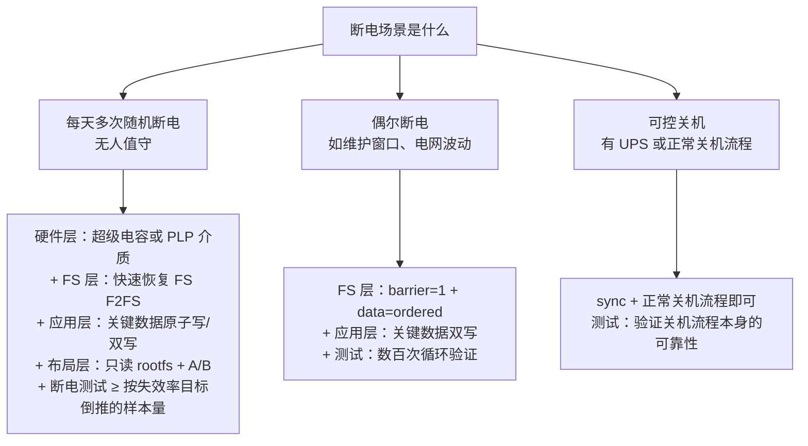

# 17.5 断电安全架构：代价量化与验证方法论

> 所属章节：第17章 存储架构设计
>
> 难度：[E] | 预计阅读时间：60分钟

## <span class="blue"> 本节导读

17.4 收束出的暴露清单把战场收敛到一行：boot 侧靠硬件属性和双份冗余基本闭合，**持续暴露给随机断电的只剩数据分区**。断电防护的机制本书也已讲完——12.5.1 的四层设计、12.5.2 的 barrier 与原子写、12.5.3 的六大陷阱。本节不再讲"怎么防"，而是回答架构师的两个问题：**防到什么程度才够**（每层防护花什么代价、消哪类失效、怎么组合），以及**怎么证明防住了**（断电测试怎么设计才算验证过，而不是自我安慰）。<BR>
本节覆盖：

- 四层防护的代价-收益总表：每层花什么、消什么
- barrier 的 40% 性能代价在什么读写模式下成立，什么时候可以关
- 超级电容方案工程实践：容量计算、充电管理、老化监控、掉电中断时序预算
- 断电测试方法论：时机随机化、自动化工装、判定标准、样本量倒推
- 断电需求分级决策树与工业网关的防护组合收口

---

## <span class="blue"> 四层防护回顾：每层花什么代价

先把 12.5.1 的四层机制收敛成一段话：硬件层（超级电容/PLP 争取最后写入时间）→ 块与文件系统层（barrier 保序、journal/checkpoint 恢复）→ 应用协议层（原子写、双写、CRC 自检）→ 布局层（A/B 双份、只读 rootfs，17.4 已处置）。机制细节都在 12.5，这里只把每层放到天平上——**防护不是越多越好，每层都有价码**：

| 层 | 代表措施 | 消除的失效 | 代价 |
|----|---------|-----------|------|
| 硬件层 | 超级电容 / 介质 PLP | FTL 映射表损坏、缓存数据丢失（最低层兜底） | BOM 成本 + 充电管理电路 + 老化监控 + 结构空间 |
| FS 层保序 | barrier=1、data=ordered/journal | 元数据写穿、journal 失序导致的分区级损坏 | 写性能下降（量级见下节） |
| 应用层 | 原子写（tmp+fsync+rename）、关键数据双写+CRC | 单文件级"写一半" | 代码复杂度 + 每次写入的 fsync 延迟 |
| 布局层 | 只读 rootfs、A/B 双份、冗余环境变量 | 系统盘损坏、升级中途断电变砖 | 容量双份（17.4 已付） |

表的两端是两种典型错误。左倾错误：全部拉满——每层都上最强配置，为不存在的需求付性能与成本。右倾错误：全靠 fsck——默认"断电后文件系统自己会修好"，把 17.3.2 矩阵里 ext4 那一卡的最坏损失（人工介入）留给现场。

正确的姿势是按 17.1 的**断电保护分级**投入：清单里"业务必须"的配置和缓存配原子写/快速恢复 FS，"可重建"的日志走常规写路径，"易失可弃"的进 tmpfs——防护强度跟着数据分级走，不跟着安全感走。

---

## <span class="blue"> barrier 的性能代价与开关决策

四层里最需要量化讨论的是 FS 层的 barrier——它是唯一一个"每次写入都付费"的机制。

### 40% 这个数字从哪来

barrier（写入屏障）保证日志先于数据落盘、顺序不被存储控制器重排。代价的机制：每次日志提交都要等底层缓存真正刷入介质（cache flush），写并发度被串行化。大纲引用的"对性能影响可达 40%"是它的上界量级——**只在特定负载下成立**：

```
barrier 代价与负载的关系：

小文件高频随机写 + 频繁 fsync（数据库、配置风暴）
  → 每次提交都要等 flush，延迟敏感型负载代价最大，趋近上界

大文件顺序追加写（日志、录像）
  → flush 被大块数据摊薄，代价显著低于上界

读多写少
  → 几乎无感
```

所以"barrier 要不要开"不是一个问题，是每个分区一个问题。决策矩阵：

| 分区 | 负载特征 | barrier 决策 |
|------|---------|-------------|
| 配置分区 | 低频写 + 每次写都很重要 | **必开**，性能代价可忽略 |
| 采集缓存 | 高频写 + 业务必须 | **开**，代价用 F2FS 的 checkpoint 设计对冲（17.3.2） |
| 日志分区 | 高频写 + 可重建 | 可关或放宽（`data=writeback` 的讨论见 12.5.2），断电丢尾部日志可接受 |
| rootfs | 只读 | 无此问题 |

### 什么时候可以关 barrier

只有一种情况可以理直气壮地关：**底层介质自带 PLP，缓存刷入由硬件兜底**（17.2 判据三）。此时 barrier 要防的"缓存重排/丢失"由硬件保证，软件层的保序付费变成重复投资。这也是企业级存储阵列敢关 barrier 的底气——但注意前提是**规格书级的 PLP 承诺**，不是"厂商说我们的固件很可靠"。

反过来，消费级 eMMC + 关 barrier + 写重要数据，是 12.5.3 六大陷阱里最贵的一个：性能测试好看了，断电损坏率的黑账在量产后才开始记。

---

## <span class="blue"> 超级电容方案工程实践

当数据分区的暴露等级高到 FS 层和应用层都接不住（每天数次断电 + 业务必须 + 不可丢），就轮到硬件层出手。超级电容方案的原理一句话：断电瞬间，电容储能给系统争取一段"善终时间"，让最后一笔写完成、映射表落盘。难的是工程细节。

> 善终时间（hold-up time）：主电源跌落到系统真正断电之间，由储能元件撑住的时间窗。所有"最后一笔写"都必须在这个窗口内完成。

### 容量计算：从最坏写入耗时反推

```
需求侧（先算要花多少时间）：
  t_holdup ≥ t_detect + t_flush + t_margin
    t_detect：PMIC 检测到掉电并发出中断的时间（典型毫秒级）
    t_flush ：最坏情况下最后一笔写完成的时间
              = 待刷缓存量 ÷ 介质写速 + FTL 内部收尾时间
    t_margin：工程余量，常规取 50%~100%

供给侧（再算电容要多大）：
  C ≥ 2 × P_sys × t_holdup ÷ (V²max - V²min)
    P_sys：掉电窗口内系统的持续功耗（W）
    Vmax/Vmin：电容工作电压窗口（V）
    （本质：电容放电释放的能量 E = ½C(V²max − V²min) 要大于窗口内耗功）
```

两个容易漏的项：一是 **FTL 内部收尾时间**——eMMC 收到最后的写命令后，控制器可能还要做内部搬移，这段时间主机看不见但真实存在，数据手册不写，只能实测（用掉电测试本身去标定）；二是**低温**——-40°C 下电容容量和 ESR 都恶化，电容选型要按温度下限折算，这与工业网关的温区约束直接相关。

### 充电管理与老化监控

电容不是焊上去就完事。充电管理要解决浪涌——冷启动时 discharged 的电容近似短路，直接挂在电源轨上会拉垮上电时序，需要限流充电电路。老化监控要解决"电容也会死"——超级电容的容量随时间与温度循环衰减、ESR 随老化上升，五年寿命产品的电容在第五年还剩多少善终时间，必须可测：

```
老化监控的低成本实现：
  利用每次真实上电/掉电过程做测量——
  记录充电到 Vmax 的耗时（反映容量）与掉电窗口的实际表现
  趋势劣化到阈值 → 上报运维，列入预防性维护
```

这与 17.2.2 的 EXT_CSD 寿命寄存器是同一个思想：**凡是会随时间劣化的防护资产，都要仪表化**。

### 掉电中断的时序预算

电容只提供时间，用这段时间做什么由软件链路决定：

```
主电源跌落
  → PMIC 掉电检测（power-fail interrupt / nINT）
  → 内核 PMIC 驱动收到中断
  → 通知有序停机链：停写新数据 → flush 关键缓存 → sync 关键分区
  → （可选）记录"本次为异常断电"标记，供下次启动走快速检查路径
  → 电源真正耗尽
```

每个箭头都占善终时间。架构审查时要回答的问题：**从 PMIC 中断到最后一笔关键写完成，整条链路的实测耗时是多少？** 链路里任何一环超时（比如某个服务停不掉），电容再大也白搭——时序预算要和电容容量一起验算，一起进测试。

---

## <span class="blue"> 断电测试方法论：怎么证明防住了

17.1 说过，断电损坏是"时间 × 次数"的统计问题，开发期几十次手动断电什么也证明不了。这一节给出可信的验证方法。

### 为什么"我拔了 50 次电源都没事"不是证据

> 三法则（Rule of Three）：N 次独立试验零失败时，真实失效率的 95% 置信上界约为 3/N。

50 次断电零损坏 → 只能证明失效率 < 6%（3/50）。要证明"单次断电损坏率低于千分之一"，需要约 3000 次零失败（3/0.001）。要证明万分之一，三万次。这就是为什么大纲的评审清单写"至少 1000 次循环"——1000 次零失败对应的是 0.3% 上界，够不够要对着产品的失效率目标算，不是对着整数好看算。

### 测试设计四要素

**要素一：断电时机随机化**。固定在写空闲时断电等于没测。断电点必须随机散布在各种操作中——写中、擦除中、FTL 可能的 GC 窗口、OTA 刷写中、切槽瞬间（17.4 环境变量写入点）。实现上用工装控制器在随机时刻切断，并按负载脚本制造"正在被写"的状态。

**要素二：自动化工装**。3000 次循环不可能手动做。标准配置：可编程电源（或电子开关/继电器）+ 上位机脚本控制断电/上电循环 + 被测设备上电后自动跑写入负载 + 每次循环自动采集结果（启动是否成功、文件系统是否报错、关键数据是否完整）。

```
单次循环的自动化判定链：
  断电（随机时机）→ 等待 → 上电
  → 串口/网络探活：系统是否启动成功
  → 自动挂载检查：FS 是否报错、是否触发 fsck
  → 数据校验：测试前写入的带 CRC 数据集是否完整
  → 寿命寄存器采样：EXT_CSD 寿命字段增量（兼做介质验收）
  → 结果入数据库：任何一项异常即中断测试并保留现场
```

**要素三：判定标准事先写死**。什么叫"通过"必须在测试前定义：系统可启动是底线；FS 触发 fsck 算不算失败（能自动修复且数据完整可降级为"警告"，需要人工即失败）；数据丢失的容忍度（日志尾部可丢、配置一个字节不能丢——按 17.1 分级定）。**事后改判定标准是断电测试最常见的自欺方式**。

**要素四：与加速老化叠加**。断电测试跑的是新片，现场的设备是写了一年旧数据的旧片。完整验证 = 断电循环 + 写放大加速老化（先用大流量写入把介质寿命消耗到某个百分比，再跑断电循环）——第三波失效和第二波失效在现场是叠加到来的。

### 介质的断电验收（回到 17.2 的黑盒）

同一套工装同时是介质验收工具：候选 eMMC 各取若干片跑断电循环，观察是否有"整卡不识"级别的映射表损坏（17.2 黑盒后果一）。**这个结果直接决定介质入围名单，并且二供切换时必须重跑**——黑盒不靠测试驯服，就靠运气驯服。

---

## <span class="blue"> 断电需求分级决策树与网关收口

把全节收敛成决策树（大纲三棵决策树的第二棵）：



工业网关（每天数次随机断电 + 无人值守 + -40~85°C）走第一分支，逐项落到具体配置：

```
① 布局层（17.4 已付）：只读 EROFS rootfs + A/B + 冗余环境变量
② FS 层：配置/缓存区 F2FS + barrier 开；日志区可放宽
③ 应用层：配置原子写（12.5.2）；采集缓存定期 flush + 断点续写协议
④ 硬件层：超级电容善终窗口覆盖"采集缓存最后一笔写 + 映射表收尾"
          ——容量按 85°C 高温与 -40°C 低温双端折算
⑤ 验证：断电循环样本量按失效率目标倒推（如目标 0.1% → ≥3000 次），
        叠加加速老化；判定标准事先写死
```

注意这条链路的结构：**需求分级（17.1）决定防护组合（本节），防护组合决定验证方案（本节），验证结果决定介质与 FS 能否入围（17.2/17.3）**。断电安全不是某个单一机制，是全章所有决策在这个场景下的合流。

---

## <span class="blue"> 本节总结

断电安全的架构结论：防护投入跟着数据分级走，四层各有价码——barrier 的 40% 上界只在小文件高频 fsync 负载下成立，有规格书级 PLP 时可以理直气壮地关；超级电容的核心不是容量公式而是时序预算，PMIC 中断到最后一笔写的整条链路都要实测；断电测试的可信度由样本量决定，三法则把"我测了 50 次"翻译成"失效率小于 6%"，判定标准必须在测试前写死。工业网关收进第一分支，五层配置全部落到具体项——至此本章的四个决策域全部完成，只剩把它们串成一个完整方案并接受评审。

### 速查表

| 要点 | 内容 |
|------|------|
| 投入原则 | 防护强度跟数据分级走（17.1），不跟安全感走 |
| barrier 决策 | 按分区决策：配置必开、缓存开、日志可放宽；介质有规格级 PLP 才可关 |
| 超级电容两易漏项 | FTL 内部收尾时间（实测标定）、低温容量/ESR 折算 |
| 时序预算 | PMIC 中断 → 停写 → flush → sync 全链路实测，与电容容量联验 |
| 三法则 | N 次零失败 → 失效率上界 ≈ 3/N；1000 次零失败 = 0.3% 上界 |
| 测试四要素 | 时机随机化 / 自动化工装 / 判定标准事先写死 / 叠加加速老化 |
| 介质验收 | 断电循环同时验收介质黑盒；二供切换必须重跑 |
| 网关组合 | 只读+A/B（布局）+ F2FS+barrier（FS）+ 原子写（应用）+ 超级电容（硬件）+ 3000 次循环（验证） |

---

## <span class="blue"> 下一步

四个决策域全部完成：介质（17.2）、文件系统（17.3）、分区（17.4）、断电防护（17.5）。最后一节把它们串起来——工业网关从数据分类到评审清单的完整走查，外加三个行业案例的决策复盘。

> **17.6 综合实战：工业网关存储架构全流程**（待写）

---

## <span class="blue"> 配套资源

| 资源类型 | 内容 |
|----------|------|
| **关联小节** | 12.5.1 四层防护机制本体；12.5.2 barrier 与原子写机制；12.5.3 六大陷阱；17.1 数据分级（投入依据）；17.2 PLP 判据与黑盒验收；17.3.2 故障模式矩阵（FS 层选择依据）；17.4 暴露清单（本节战场来源） |
| **统计工具** | 三法则（Rule of Three）：零失败试验的失效率上界估算；更精确用 Clopper-Pearson 区间 |
| **工程设备** | 可编程直流电源 / 电子负载开关 + 上位机循环脚本 = 断电测试工装的标准配置 |
| **规范** | JEDEC JESD84-B51（eMMC 断电行为与 EXT_CSD）；AEC-Q100（车规可靠性框架，断电循环思路的来源之一） |
