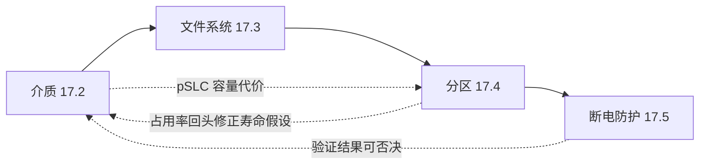

# 17.6 综合实战：工业网关存储架构全流程

> 所属章节：第17章 存储架构设计
>
> 难度：[E] | 预计阅读时间：90分钟

## <span class="blue"> 本节导读

17.2~17.5 各自闭环了一个决策域，但每个结论都是在"其他域待定"的假设下做出的：17.2 判 pSLC 时不知道分区表有多紧，17.4 做容量草案时把 pSLC 的容量代价留给了"重新核算"，17.5 的防护组合要等分区定稿才能落到具体分区上。**单独看每一节都是对的，合起来未必自洽**——这就是实战和演练的区别。本节把四个决策域放到同一张桌面上走查，过程中会暴露一处真实的账算不平，然后当面调和它。这正是存储架构评审现场的真实形态。<BR>
本节覆盖：

- 需求清单从"分类方向"升级为"带验收标准的需求规格"
- 四域决策逐项调用：介质 / 文件系统 / 分区 / 断电防护
- 一处冲突的完整调和：pSLC 的容量账单 vs 8GB 预算
- 本章核心输出物：定稿分区表与断电测试计划
- 三个行业案例的决策复盘（约束 → 选择 → 代价 → 教训）
- 存储架构评审清单：16 项，逐条要证据

---

## <span class="blue"> 需求清单升级：从分类方向到验收标准

17.1 的演练产出了六条需求，每条标注了流向哪一节。那份清单适合指引阅读，不适合签字评审——它只有方向，没有"做到什么程度算合格"。走查第一步，把每一类数据的需求改写成**带量化指标和验收方式的规格条目**。

工业网关的七类数据（bootloader 环境变量、内核+DTB+rootfs、应用配置、日志、采集缓存、OTA 暂存、临时文件）逐类升级，再补上场景级硬性要求，得到需求规格表：

| 编号 | 需求 | 量化指标 | 验收方式 |
|------|------|----------|----------|
| R1 | 系统断电免疫 | 任意时刻断电，重启后系统可启动、配置与缓存数据不丢 | 随机断电循环 ≥3000 次零损坏（17.5 样本量倒推） |
| R2 | OTA 可回滚 | 升级任意阶段断电，设备回到可用版本 | OTA 解压/写入/切换三阶段各注入断电 100 次 |
| R3 | 日志服务 | 100MB/天，滚动保留 ≥3 天，写满不致命 | 满盘注入测试：日志打满后系统功能正常 |
| R4 | 采集缓存 | 断网 72h 数据不丢，复网后完整补报 | 断网缓存写至 90% 时断电，恢复后校验数据连续性 |
| R5 | 介质寿命 | ≥5 年（设计目标） | 量产基线 + 每年 EXT_CSD 寿命寄存器读数外推 |
| R6 | 宽温工作 | -40°C 冷启动可挂载；85°C 断电存放后数据完整 | 高低温箱内执行断电测试矩阵 |
| R7 | 容量自洽 | 全部分区 + 留白 ≤ 8GB 实际可用 | 分区表评审（本节选型走查的输出物） |
| R8 | 产线可制造 | 分区表、pSLC 范围、bootloader 环境一次性烧录可落地 | 产线首件验证记录 |

和 17.1 清单对比，变化有三处：

1. **每条都长出了验收方式**。需求没有验收方式就是愿望——R1 不写"3000 次"，评审时就只剩"我们做了断电保护"的空话。
2. **验收方式本身引用了后续决策域的方法论**。R1 的 3000 次来自 17.5 的样本量倒推，R5 的 EXT_CSD 来自 17.2 的实测三工具。需求规格和决策工具是同一张网的两面。
3. **新增 R8**。产线可制造性在 17.1 的锁死节点分析里出现过（分区表在产线导入后锁死），实战阶段必须落成独立条目——凡是 OTP（一次性编程）性质的配置，首件验证就是最后一次改错机会。

这份规格表是接下来逐项走查的计分卡：每个决策域的结论，都要能指认它满足了哪几条 R。

---

## <span class="blue"> 走查一：介质决策调用

走查顺序就是本章的行文顺序——这不是巧合，是依赖关系决定的：介质不定，文件系统的故障模式无法评估；文件系统不定，分区表写不出文件系统列；分区不定，断电防护没有落点。



注意两条虚线：走查不是单行道。介质决策会给分区送去一笔容量账单，分区的占用率又会回头修正介质寿命验算的假设。本节后面会实测这两条边。

### 介质结论回顾

17.2 的三个结论直接引用：

- **寿命**：24TB 标称可写量，经写放大（WA≈2.2）与 80% 规则修正后 8.7TB，对 73GB/年的负载，寿命 ≈119 年 ≫ 5 年——寿命不是瓶颈。
- **消费级 vs 工业级**：判工业级，依据是数据保持力的高温折算——85°C 环境下消费级标称保持力会逼近百天量级，而 rootfs 与 recovery 是"写一次、放多年"的数据形态。
- **pSLC**：判定启用 pSLC 模式存放高保持力风险数据，容量代价标注"在 17.4 重新核算"。

前两条结论自洽，第三条埋着一笔没结的账。这笔账在分区走查时一起算。

---

## <span class="blue"> 走查二：文件系统决策调用

17.3 的收口结论：EROFS（rootfs/recovery）+ F2FS（缓存/日志/数据）+ 原子写（配置）。走查阶段要补的是**挂载参数级别的落地**——选型结论到 fstab 之间还有一层决策：

```
# 工业网关 fstab 骨架（分区名以定稿分区表为准）
/dev/disk/by-label/rootfs   /          erofs  ro,nosuid,nodev,noexec              0 0
/dev/disk/by-label/log      /var/log   f2fs   rw,noatime,nosuid,nodev,noexec      0 2
/dev/disk/by-label/cache    /srv/cache f2fs   rw,noatime,nosuid,nodev             0 2
/dev/disk/by-label/data     /srv/data  f2fs   rw,noatime,nodev                    0 2
tmpfs                       /tmp       tmpfs  nosuid,nodev,noexec,size=64M        0 0
```

逐条说明每行背后的决策依据：

- **rootfs 行**：`ro` 是布局决策（17.4）；`nosuid,nodev,noexec` 是 19.4 的挂载选项最小权限集，rootfs 上不应出现设备节点、setuid 位和可执行需求之外的东西——注意 `noexec` 对 rootfs 不适用（二进制要从这里执行），它属于日志/缓存这类纯数据分区。这是多章决策在同一行 fstab 上的合流点。
- **日志行**：`noatime` 砍掉每次读的元数据写——日志分区是全盘写入压力主力，atime 更新是纯浪费；`noexec` 同时封掉"从日志目录执行注入文件"这条攻击路径。
- **缓存行**：不配 `noexec` 的例外要逐条评审；barrier 行为按 17.5 的分区矩阵（缓存区开 barrier）。
- **tmpfs 行**：`size=64M` 硬上限——tmpfs 占的是内存不是 Flash，不限容的 tmpfs 在内存紧张时会把 OOM 引进系统。

> 💡 fstab 是全书少见的多章决策交汇点：分区布局（17.4）、文件系统选型（17.3）、断电防护（17.5 barrier 矩阵）、安全加固（19.4 挂载选项）各出几个选项，最终落在同一行配置里。评审 fstab 等价于评审四章结论的兼容性。

---

## <span class="blue"> 走查三：分区表定稿——pSLC 的容量账单

### 17.4 草案摆回桌面

17.4 给出的容量预算草案（8GB 十进制 ≈ 7.3 GiB 可规划）：

| 分区 | 大小 | 文件系统 |
|------|------|----------|
| rootfs_a / rootfs_b | 各 768 MiB | EROFS |
| recovery | 512 MiB | EROFS |
| OTA 暂存 | 1 GiB | raw/F2FS |
| 日志 | 1 GiB | F2FS |
| 采集缓存 | 1.5 GiB | F2FS |
| 数据 | 512 MiB | F2FS |
| 留白 | 约 1.3 GiB | 不分配 |

草案合计 6.0 GiB，留白 1.3 GiB，占用率约 82%——贴着 80% 规则的边，尚可接受。但这个草案隐含一个假设：**所有分区按 TLC 容量计价**。17.2 的 pSLC 判定打破这个假设。

### 冲突暴露：pSLC 不按 1:1 计价

> pSLC（pseudo-SLC）：把 MLC/TLC 闪存单元按单比特模式使用，用容量换寿命与保持力。TLC 转 pSLC 的容量代价约 3:1（1 GiB pSLC 消耗约 3 GiB TLC 物理容量），MLC 转 pSLC 约 2:1，具体比例以料号数据手册为准。eMMC 上通过 EXT_CSD 的增强用户数据区（enhanced area）配置，**该配置是一次性编程（OTP），产线烧录后不可反悔**。

把 17.2 的判定原样执行——rootfs_a/b + recovery 共 2 GiB 全部 pSLC——账单变成：

```
pSLC 需求：768 + 768 + 512 = 2048 MiB = 2 GiB
TLC 代价（按 3:1）：2 GiB × 3 = 6 GiB
其余分区（OTA 1 + 日志 1 + 缓存 1.5 + 数据 0.5）= 4 GiB
总需求 = 6 + 4 = 10 GiB  >  7.3 GiB 可用
```

**缺口 2.7 GiB。17.2 的结论和 17.4 的预算在同一颗 8GB eMMC 上算不平。** 这就是走查存在的意义——两个各自正确的局部决策，合流时暴露冲突。

### 调和第一步：重审 pSLC 的真实需求范围

pSLC 买的是什么？保持力。保持力风险怎么量化？看两个变量的乘积：**写入后不再重写的时间** × **存放温度**。把三个候选分区过一遍这个乘积：

| 分区 | 重写节奏 | 高温下的保持力暴露 |
|------|----------|---------------------|
| rootfs_a/b | 每次 OTA 完整重写对侧槽位 | 暴露窗口 ≈ OTA 周期（季度级），且 A/B 结构天然轮换 |
| recovery | 出厂写一次，产品终生不再更新 | 暴露窗口 = 产品全寿命（5 年 × 85°C）——风险最集中 |
| 日志/缓存/数据 | 高频重写 | 无保持力问题（磨损才是它们的问题，17.2 已结） |

结论清晰：**pSLC 的真实需求集中在 recovery 这一个分区**。rootfs 的保持力暴露被 A/B 轮换节奏天然对冲——每次 OTA 都重写对侧槽位，等于免费的数据刷新；再配合一条兜底机制（后台巡检服务定期重写非活跃槽，或将其并入 OTA 流程强制双写），rootfs 留在 TLC 区域的保持力风险可控。17.2 提到的"校准类数据"在本产品不存在（17.1 分类时已确认），不构成额外 pSLC 需求。

### 调和第二步：两个方案对比

| | 方案 A：pSLC 收敛至 recovery | 方案 B：升级 16GB 全盘从容 |
|---|---|---|
| 介质 | 工业级 8GB eMMC | 工业级 16GB eMMC |
| pSLC 范围 | recovery 512 MiB（代价 1.5 GiB） | rootfs_a/b + recovery 共 2 GiB（代价 6 GiB） |
| 容量账 | 1.5 + 1.5(rootfs) + 4(其余) = 7.0 GiB，留白 0.3 GiB | 6 + 4 = 10 GiB，留白约 4.9 GiB |
| 占用率 | 约 96%——**违反 17.2 的 80% 规则** | 约 67%，从容 |
| 寿命重算 | WA 按占用率恶化上调（FTL 层 1.8→4）：24TB ÷ (1.2×4) ÷ 73GB/年 ≈ **68 年**，仍 ≫ 5 年 | 维持 119 年量级 |
| rootfs 保持力 | 靠 OTA 节奏 + 巡检重写兜底 | pSLC 规格保证 |
| 成本 | 基准 | 8GB→16GB 工业级价差，按 BOM 计 |

方案 A 的占用率 96% 必须正面处理：17.2 的寿命验算假设"分区占用率 60% 以下、WA≈2.2"，96% 占用率下 FTL 垃圾回收效率恶化，按 17.2 自己的敏感性提示把 FTL 层 WA 从 1.8 上调到 4，重算寿命约 68 年——裕量从 24 倍收窄到 13 倍，对 5 年设计目标仍然充分，但**结论成立的前提是日志与缓存分区的硬限容真实生效**（占用率是被分区配额人为压住的，一旦限容失守，实际占用率无上限）。这条依赖要登记进评审清单。

### 定稿：方案 A + 升级路径备案

**定稿方案 A**，理由按权重排序：

1. 5 年寿命目标下 68 年裕量充分，B 的额外寿命对本项目无收益；
2. recovery 进 pSLC 拿到了保持力风险的最大头（终生不重写的唯一分区）；
3. BOM 成本不打乱。

**备案触发条件**写进设计文档：若客户要求寿命 10 年、或工作温度上限提到 105°C、或巡检重写机制在验证中不达标——任一条成立即升级方案 B。架构决策的价值不在选了 A，在于"什么时候改选 B"事先写死。

定稿分区表（本章核心输出物）：

| 分区 | 大小 | 物理计价 | 文件系统 | 挂载/属性 | 满额行为 | 断电防护 |
|------|------|----------|----------|-----------|----------|----------|
| bootloader | — | Boot Area（硬件区） | raw | 默认冻结 | — | 双备份 + 默认不更新 |
| boot 环境变量 | — | Boot Area / RPMB | raw | — | — | 双份 + CRC + 备份指针 |
| rootfs_a | 768 MiB | TLC | EROFS | ro + dm-verity | 只读不存在满 | 只读免疫 + A/B |
| rootfs_b | 768 MiB | TLC | EROFS | ro + dm-verity | 同上 | 同上 |
| recovery | 512 MiB | **pSLC（1.5 GiB）** | EROFS（最小集） | ro | 同上 | 只读免疫 + pSLC 保持力 |
| OTA 暂存 | 1 GiB | TLC | F2FS | rw，非启动路径 | 验签失败整体丢弃 | 下载中断可重传 |
| 日志 | 1 GiB | TLC | F2FS | rw,noatime,noexec | journald 硬限容 + rotate | barrier 放宽，可重建 |
| 采集缓存 | 1.5 GiB | TLC | F2FS | rw,noatime | 80% 报警 / 90% 拒绝新采集并上报 | barrier 开 + 断点续写 + 超级电容善终 |
| 数据（配置等） | 512 MiB | TLC | F2FS | rw,noatime | 配额 + 满额告警 | 原子写 + 双写 |
| /tmp | 64 MiB | 内存 | tmpfs | nosuid,nodev,noexec | 写满返回 ENOSPC | 易失，无需防护 |
| 留白 | 0.3 GiB | TLC | 不分配 | — | — | 超量供应，买 GC 效率 |

表格是评审语言，落到代码里它长这样——设备树的 `partitions` 节点就是这张表的机器可读形态（eMMC 用户区按固定地址切分，偏移量十六进制现场换算）：

```dts
/* &emmc 用户区分区——与定稿表逐行对应，改表先改这里 */
partitions {
    compatible = "fixed-partitions";
    #address-cells = <2>;
    #size-cells = <2>;

    rootfs_a: partition@0        { reg = <0x0 0x00000000 0x0 0x30000000>; /* 768 MiB */ };
    rootfs_b: partition@30000000 { reg = <0x0 0x30000000 0x0 0x30000000>; /* 768 MiB */ };
    recovery: partition@60000000 { reg = <0x0 0x60000000 0x0 0x20000000>; /* 512 MiB pSLC */ };
    ota:      partition@80000000 { reg = <0x0 0x80000000 0x0 0x40000000>; /* 1 GiB    */ };
    log:      partition@C0000000 { reg = <0x0 0xC0000000 0x0 0x40000000>; /* 1 GiB    */ };
    cache:    partition@100000000{ reg = <0x1 0x00000000 0x0 0x60000000>; /* 1.5 GiB  */ };
    data:     partition@160000000{ reg = <0x1 0x60000000 0x0 0x20000000>; /* 512 MiB  */ };
    /* 尾部 0.3 GiB 不分配：留白即超量供应 */
};
```

评审时这张 DTS 片段和表格逐行对读——评审签的是表，产线烧的是它，两者不一致就是事故。

<!-- 【待补图】工业网关完整存储分区方案图（★必要，建议生图）
生图提示词：技术插图风格，横向长条图展示一颗 8GB eMMC 的完整分区布局。从左到右依次为带阴影标注的硬件区域（Boot Area 1/2、RPMB，标注"硬件独立区域，不占用户容量"），然后用户数据区按定稿分区表比例切分色块：rootfs_a（768MiB，标注 EROFS 只读+A/B）、rootfs_b（768MiB）、recovery（512MiB，用斜纹或高亮色标注"pSLC 模式，物理占用 1.5GiB"）、OTA 暂存（1GiB）、日志（1GiB，F2FS）、采集缓存（1.5GiB，F2FS）、数据（512MiB，F2FS）、留白（0.3GiB，灰色标注"超量供应不分配"）。每个色块下方标注大小与文件系统，pSLC 区域用括线标明实际消耗的 TLC 容量。整体风格：工程蓝图感，白底，蓝色系为主，细线条，无装饰性元素，中文标注。横版 16:6。-->

---

## <span class="blue"> 走查四：断电防护组合与测试计划

分区定稿后，17.5 的五层防护组合终于能落到具体分区上。逐项登记：

| 层 | 配置项 | 落在哪个分区 | 依据 |
|----|--------|--------------|------|
| 布局层 | 只读 EROFS + A/B + 冗余环境变量 | rootfs_a/b、boot 环境 | 17.4 布局三 |
| FS 层 | F2FS + barrier 开 | 缓存、数据 | 17.5 barrier 矩阵 |
| FS 层 | barrier 放宽 | 日志 | 可重建数据不付 40% 代价 |
| 应用层 | 原子写（写临时文件 + fsync + rename） | 数据（配置） | 12.5.2 机制 |
| 应用层 | 定期 flush + 断点续写协议 | 采集缓存 | R4 验收方式 |
| 硬件层 | 超级电容善终窗口 | 覆盖"缓存最后一笔写 + FTL 收尾" | 17.5 时序预算，双温区折算 |
| 验证层 | 断电测试矩阵 | 全部分区 | 见下表 |

硬件层的超级电容在本方案里有一个明确的职责边界：它**只**负责采集缓存的善终（最后一笔业务数据写完 + eMMC 内部 FTL 收尾完成），不负责整机续航。这对应 R4"断网 72h 数据不丢"——缓存是业务必须类数据，值得花一颗电容的钱；日志是可重建类，断电丢几秒无所谓，不在电容的保护范围内。防护投入跟着数据分级走，这里再次兑现。

测试计划表（R1/R2/R6 的验收执行版）：

| 维度 | 取值 | 说明 |
|------|------|------|
| 温度点 | -40°C / 25°C / 85°C | 覆盖规格两端 + 常温基准；电容容量在低温端折算最苛刻 |
| 断电时机 | 空闲 / 写日志中 / 写缓存中 / OTA 解压中 / OTA 切换中 | 时机随机化由工装控制，禁止"挑空闲时刻断电"的自我安慰 |
| 每格样本量 | 按失效率目标倒推：目标 0.1% → 每格 ≥300 次，合计 ≥3000 次 | 三法则：n 次零失效 ⇒ 失效率上限 ≈ 3/n |
| 判定标准 | 事前写死：重启可启动 + 配置校验通过 + 缓存数据连续性校验通过 + EXT_CSD 无异常跳变 | 判定标准在测试前冻结，测试后改标准等于没测 |
| 工装 | 可编程电源 + 继电器随机切电 + 上位机自动记录 | 人工按开关的断电测试在样本量上永远不达标 |

测试矩阵执行完毕后，把结果回写到需求规格表 R1/R2/R6 的验收栏——**走查闭环的标志是每条 R 后面都挂上了证据**。

这张测试计划表落到工装上是一个自动化循环。骨架只有一件事是本质的：**断电时机由随机数决定，不由人决定**：

```bash
#!/bin/bash
# power-cut-loop.sh —— 断电测试工装主循环（上位机侧）
# 判定标准已事前冻结：启动 OK + 配置校验 + 缓存连续性 + EXT_CSD 无跳变
TRIGGERS=("idle" "write-log" "write-cache" "ota-unpack" "ota-switch")
ROUND=0

while [ $ROUND -lt 3000 ]; do
    trig=${TRIGGERS[$RANDOM % 5]}              # 随机断电时机
    ./inject-load.sh "$trig" &                 # 在 DUT 上制造对应负载
    sleep $((RANDOM % 30 + 1))                 # 随机工作 1~30s
    ./relay.sh off                             # 继电器切电 —— 真断电
    sleep 5
    ./relay.sh on                              # 上电重启
    result=$(./check-dut.sh)                   # 串口回采四项判定
    echo "$ROUND,$trig,$result,$(date -Iseconds)" >> results.csv
    [ "$result" = "PASS" ] || ./freeze-evidence.sh "$ROUND"  # 失败即封存现场
    ROUND=$((ROUND + 1))
done
```

3000 次循环约需一周机时——这就是"样本量 3000"从表格上的一个数字变成排产表上的一周。评审时这两个产物（计划表 + 工装脚本）要一起出现：只有表没有脚本，样本量承诺无法兑现；只有脚本没有表，判定标准可以随意漂移。


---

## <span class="blue"> 方案总览：一页视图

全部走查完成，把数据流、分区、防护、验证串成一张总表。这张表就是存储架构评审的第一页，评审清单的每一项都能在这张表上找到落点：

| 数据类 | 写入画像 | 落点 | FS/属性 | 断电防护 | 验收条目 |
|--------|----------|------|---------|----------|----------|
| bootloader + 环境变量 | 低频 | Boot Area / RPMB | raw | 双份 + CRC + 默认冻结 | R1, R2, R8 |
| 内核 + DTB + rootfs | 低频（OTA） | rootfs_a/b | EROFS ro + verity | 只读免疫 + A/B 回滚 | R1, R2 |
| 修复系统 | 一次写入 | recovery（pSLC） | EROFS ro | 只读免疫 + pSLC 保持力 | R1, R6 |
| 应用配置 | 低频 | 数据区 | F2FS | 原子写 + 双写 | R1 |
| 运行日志 | 100MB/天 | 日志区（1 GiB 硬限容） | F2FS noatime | barrier 放宽，可重建 | R3, R5 |
| 采集缓存 | 爆发式 | 缓存区（1.5 GiB） | F2FS barrier=1 | flush + 断点续写 + 超级电容 | R1, R4 |
| OTA 包 | 低频 | OTA 暂存（1 GiB） | F2FS | 验签失败整体丢弃 | R2 |
| 临时文件 | 高频 | /tmp（tmpfs 64M） | tmpfs | 易失无需防护 | — |
| 介质底座 | — | 工业级 8GB eMMC | — | 寿命 68 年裕量 + EXT_CSD 年检 | R5, R6, R7 |

读这张表的方式：任何一行删掉，都有一条 R 失去支撑；任何一行改掉，都有至少一条 R 的验收方式要跟着改。行与 R 的满射关系，是方案自洽性的检查器。

---

## <span class="blue"> 三个行业案例的决策复盘

以下三个案例按"约束 → 选择 → 代价 → 教训"复盘。数字为行业典型实践口径，用于说明决策结构，不作为具体产品的实测承诺。

### 案例一：智能音箱——OTA 失败率从 3% 到 0.1%

**约束**：消费级成本敏感（BOM 每分钱都计较）、家庭 Wi-Fi 不稳定、用户随时可能拔电源——断电时机完全不可控。早期版本用单分区读写 rootfs，OTA 直接覆盖式写固件，OTA 失败率（变砖或无法启动）约 3%，售后换机成本远超预期。

**选择**：改为 A/B 双分区 + 只读 rootfs + OTA 包先下载校验再切换槽位。核心变化不是 OTA 协议，是**存储布局**：下载到独立暂存区，验签通过才写对侧槽位，bootloader 环境变量双份记录当前槽位，新版本首启失败自动回退。

**代价**：Flash 容量占用接近翻倍（双 rootfs + 暂存区），固件尺寸预算从此有了硬顶；bootloader 逻辑复杂度上升，环境变量损坏成为新的失效模式（需要双份 + CRC 兜底）。

**教训**：OTA 可靠性本质是存储架构问题，不是网络协议问题。3% 的失败率里没有一例是"下载坏了"，全部是"写一半断电，单分区没有可回退的完好系统"。把"升级失败"从"写坏了怎么办"改写成"写坏了还有另一个完好的"，失败率自然掉到 0.1% 量级。

### 案例二：工业 HMI——5000 次断电零损坏与 15 秒到 2 秒的开机

**约束**：裸 NAND（无内置 FTL，一切靠软件层）、工控现场断电是日常、客户对"断电后多久恢复显示"有合同指标。早期文件系统用 JFFS2，功能正确但挂载时间随卷容量线性增长——512MB 的卷挂载要扫全卷日志，实测约 15 秒，断电恢复体验是"按了开关黑屏 15 秒"，客户投诉集中在开机时间而非数据损坏。

**选择**：JFFS2 迁 UBIFS。UBI 层承担磨损均衡与坏块管理，UBIFS 用日志 + 索引结构把挂载时间压到常数级（实测 2 秒量级），与卷大小基本无关。配套做满写压力下的断电循环测试 5000 次，零数据损坏、零挂载失败。

**代价**：UBI/UBIFS 的概念体系（卷、LEB、磨损均衡参数）比 JFFS2 陡，团队学习成本约两周；UBI 层的 attach 时间在极端大卷下也要关注，需要按卷大小预算。

**教训**：挂载时间是可靠性指标，不是性能指标。断电后 15 秒黑屏在客户眼里等于"机器坏了"，即使数据一个字节没丢。选型矩阵里"故障后恢复时间"这一维（17.3 故障模式卡的第一列）必须带着现场场景权重去评，不能只看数据完整性。

### 案例三：汽车 T-Box——ext4 迁 F2FS，写放大降 40%

**约束**：车载工况高频小数据写入（定位轨迹、事件记录、诊断日志），十年寿命要求，宽温。早期用 ext4，随机小写密集触发 journal 双写 + 块分配碎片化，实测写放大居高不下，介质寿命验算过不了十年线。

**选择**：迁 F2FS。日志结构文件系统把随机小写聚合成顺序段写，写放大实测降约 40%，寿命账从"不及格"回到"裕量充足"。数据区与日志区分离的配置同步迁移，原子写语义靠 F2FS 的 checkpoint 机制承接。

**代价**：f2fs-tools 的工具链成熟度弱于 e2fsprogs——fsck.f2fs 的修复能力不如 e2fsck 深厚，极端损坏场景下的兜底手段少；团队需要补齐 F2FS 的 checkpoint、GC、discard 行为的知识。

**教训**："成熟"不是选型维度，"写模式匹配"才是。ext4 成熟三十年，但它的分配策略天然不匹配"高频小数据持续追加"的负载；F2FS 为闪存而生，匹配度直接兑现成写放大数字。选型时用负载画像去套文件系统的写路径设计，而不是用社区热度排序。

三个案例的共同结构值得再看一眼：**约束里都有一项"不可控"**（用户拔电、现场断电、车载工况），**选择都是布局或文件系统层面的结构性变化**，**代价都被量化并接受**（容量、学习成本、工具链），**教训都指向"问题是结构性的，解法也必须是结构性的"**。这正是本章方法论的四个侧面。

---

## <span class="blue"> 存储架构评审清单

### 使用方法

这份清单在三个里程碑各过一次：**原理图评审**（介质相关项最后一次低成本修改机会）、**产线导入评审**（分区表与 OTP 配置锁死前）、**首批发货评审**（FS 与挂载参数锁死前）。执行规则只有一条：**每一项要求出示证据，不接受"我们做过了"的口头确认**。没有证据的项目标红，评审不通过。

### 数据分类组

| # | 检查项 | 要看的证据 |
|---|--------|------------|
| 1 | 每类数据完成三维分类（写入频率 × 持久化要求 × 恢复策略） | 数据分类表，覆盖全部数据类 |
| 2 | 无遗漏特殊类别：校准数据、流式数据、密钥类 | 与 17.1 十类模板逐项比对的记录 |
| 3 | 每类数据有明确的断电恢复策略 | 分类表恢复策略列非空 |
| 4 | 需求规格带量化指标与验收方式 | 需求规格表（本节 R 表格式） |

### 介质匹配组

| # | 检查项 | 要看的证据 |
|---|--------|------------|
| 5 | 寿命验算完成，WA 为实测值而非假设值 | 验算计算书 + iostat//sys/block 实测数据 |
| 6 | 数据保持力按工作温度上限折算 | 介质数据手册标称值 + 温度折算推导 |
| 7 | 介质断电行为有实测数据（非厂商口头承诺） | 断电行为摸底测试报告 |
| 8 | 寿命监控通道就绪（EXT_CSD 可读）+ 二供认证计划 | 基线读数记录 + 二供料号清单 |

### 分区设计组

| # | 检查项 | 要看的证据 |
|---|--------|------------|
| 9 | 布局模式选型理由（为什么 A/B 或为什么不 A/B） | 对照 17.4 OTA 决策树的推导记录 |
| 10 | 每个分区的大小有预留依据，镜像体积有斜率监控机制 | CI 镜像体积审计配置截图/记录 |
| 11 | 每个分区的满额行为已定义并配置 | 限容/配额/告警配置文件 |
| 12 | 整盘占用率声明 + 留白策略符合寿命假设 | 分区表 + 与寿命验算假设的一致性核对 |

### 断电保护组

| # | 检查项 | 要看的证据 |
|---|--------|------------|
| 13 | 断电需求分级完成（业务必须 / 可重建 / 易失） | 分级表，与数据分类表交叉一致 |
| 14 | 每层防护的代价已量化并接受（barrier 性能、电容成本） | barrier 开关基准测试 / 电容时序预算表 |
| 15 | 断电测试计划含样本量倒推与事前冻结的判定标准 | 测试规范文档（判定标准章节的冻结日期早于测试执行日期） |
| 16 | 产线一次性配置清单完整（pSLC 范围、分区表、boot 环境初值） | 产线首件验证记录 + OTP 配置核对单 |

四组 16 项，没有一项是"锦上添花"——每一项背后都是本章讲过的一次量产事故形态。评审时如果某项被跳过，会议记录里要写清楚跳过的理由和责任人，这是清单最后的价值：**它把"没想到"变成"想到了但决定不做"，责任形态完全不同**。

---

## <span class="blue"> 本节总结

本节把四个决策域合流成一个完整方案。需求清单升级为带验收标准的规格表，走查按介质 → 文件系统 → 分区 → 断电的依赖序执行，过程中暴露了 pSLC 容量计价与 8GB 预算的真实冲突——调和方法是回到保持力风险的定义本身，把 pSLC 收敛到 recovery 单区，rootfs 用 OTA 轮换节奏加巡检重写兜底，寿命按 96% 占用率重算仍有 13 倍裕量，16GB 方案作为触发条件写死的备案。三案例复盘重复了同一个结构：约束不可控、解法是结构性的、代价被量化接受。16 项评审清单把全章结论转化为三个里程碑上的证据检查。至此第 17 章闭环：存储架构设计不是选一颗 Flash，是给每一类数据在寿命、断电、容量、成本四个约束下找到结构性的家。

### 速查表

| 要点 | 内容 |
|------|------|
| 走查顺序 | 介质 → FS → 分区 → 断电；两条回头边：pSLC 容量账单、占用率修正寿命假设 |
| 冲突调和法 | 回到风险定义（保持力 = 静止时间 × 温度），收敛防护范围，重算受影响账目 |
| pSLC 计价 | TLC 约 3:1 / MLC 约 2:1，OTP 配置产线锁死；真实需求集中在"写一次放终生"的分区 |
| 方案备案 | 定稿 A 时必须写死"什么条件改选 B" |
| 方案自洽检查 | 数据行与需求条目满射：删一行有 R 失撑，改一行有 R 要重验 |
| 三案例共性 | 约束含不可控项 → 结构性解法 → 代价量化接受 |
| 评审纪律 | 三里程碑各过一次，逐项要证据，跳项须记录理由与责任人 |

---

## <span class="blue"> 下一步

存储方案定稿了，但它现在还只是一张表——表上的每个分区都要被真实地构建出来：rootfs 镜像怎么编译、怎么裁剪到 600MB、OTA 包怎么生成、产线烧录镜像怎么打包。这些问题的答案在构建系统里。

> **第18章 构建系统设计**

---

## <span class="blue"> 配套资源

| 资源类型 | 内容 |
|----------|------|
| 内核文档 | [EROFS](https://docs.kernel.org/filesystems/erofs.html) / [F2FS](https://docs.kernel.org/filesystems/f2fs.html) / [UBIFS](http://www.linux-mtd.infradead.org/doc/ubifs.html) |
| 工具 | mmc-utils（EXT_CSD 读取与 enhanced area 配置）、f2fs-tools、fsverity-utils |
| 测试方法 | 三法则（rule of three）样本量估算；JEDEC JESD218/219 耐久与负载定义 |
| 本章相关 | 17.1（需求清单源头）、17.2（寿命验算公式）、17.4（布局模式与容量预留）、17.5（断电测试方法论） |
