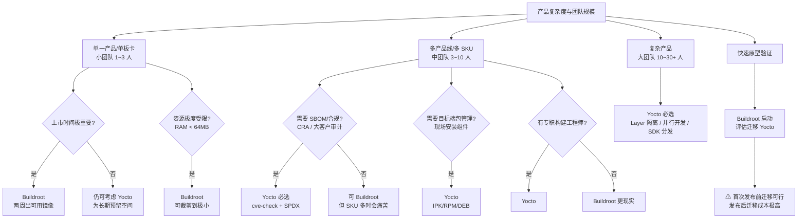
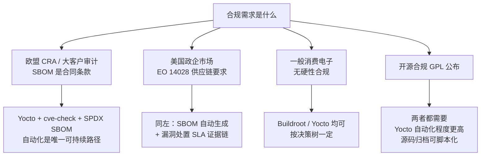

# 18.1 构建系统决策矩阵：Yocto / Buildroot / OpenWrt

> 所属章节：第18章 构建系统设计
>
> 难度：[E] | 预计阅读时间：60分钟

## <span class="blue"> 本节导读

17.6 定稿了分区表，但那张表不会自己变成镜像——rootfs 要编译、要裁进 600MB 预算、要打出 OTA 包、要变成产线烧录文件。把"一堆源码"变成"一张可烧录、可复现、可维护的镜像"，就是构建系统的工作。本书第一部你已经用过构建系统的产出物（第 4 章编译内核、第 5 章手工拼 rootfs），本章换个位置站：**从使用构建系统的人，变成设计构建系统的人**。第一个要回答的问题是选型——这不是技术偏好投票，选型的输入是团队规模、产品线数量、合规要求和上市时间，选错的账单五年后才寄到。<BR>
本节覆盖：

- 构建系统在总装线上做什么（与第 2 章工具链、第 5 章手工 rootfs 的关系）
- 本章贯穿场景：一家机器人公司的四重压力
- Yocto / Buildroot / OpenWrt 的三种设计哲学
- 13 维 Trade-off 表与特性对比表（逐维度解读，不只摆表）
- 混合方案、商业方案、Debian 系何时进场
- 两棵决策树：产品复杂度 × 团队规模；合规需求
- 版本策略：比"选哪个"更隐蔽的 LTS 陷阱（2026 年现状核实）

---

## <span class="blue"> 先厘清：构建系统在总装线上做什么

第 2 章你构建了交叉工具链，第 5 章你用 BusyBox 手工拼了一个 rootfs——那一章的每个文件都是你亲手放进 `/bin`、`/etc`、`/lib` 的。现在想象产品里有 300 个软件包（SSL 库、网络服务、ROS 2 节点、视觉模型运行时），每个包要配置、交叉编译、装到正确位置、解决互相依赖，还要在三个月后某个人改了一个库的版本时整体重建一次。手工做这件事不现实，于是有了构建系统。

> 构建系统：把"工具链 + 全部软件包源码 + 配置"编排成一条可重放命令的系统。输入是源码和配置，输出是完整镜像（内核、设备树、rootfs、SDK、OTA 包）。它的价值不在"能构建"，在于**三个月后任何人执行同一条命令得到同一个镜像**。

用总装线来定位各章的零件：第 2 章的工具链是总装线上的机床，第 4 章内核和第 3 章 U-Boot 是两个大件，第 5 章的 rootfs 是总装产物的手工版。构建系统把这一切自动化——你在 5.x 手工做过一遍，现在看构建系统替你做的每一步，都能对上号：下载源码（你当时 `git clone`）、打补丁（你当时手动改）、配置（`menuconfig`）、交叉编译（`make CROSS_COMPILE=...`）、安装到 staging 目录（你当时 `cp` 进 rootfs）、打包成镜像（`mke2fs`/`mkfs.ubifs`）。

这个对应关系是本章的地基：Buildroot 和 Yocto 没有做任何你手工做不到的事，它们做的是**让一千次构建的结果一致**。选型决策要比较的，因此不是"谁能构建出来"——都能——而是"谁在五年、五个 SKU、三十个工程师的规模下还能保持一致"。

---

## <span class="blue"> 贯穿场景：一家机器人公司的四重压力

本章用一个贯穿场景承载所有决策。先把它完整摆出来，本节只回答其中第一问：

```
公司：中型机器人整机厂商
产品线：
  · AMR 搬运机器人（2 个 SKU：标准载重 / 重载）
  · 协作机械臂（2 个 SKU：6 轴 / 7 轴）
  · 人形/复合机器人（1 个 SKU，新立项，抢窗口期）
现状：
  · AMR 与机械臂共 4 个 SKU 都基于 Yocto，由 2 名构建工程师维护
  · ROS 2 + 导航栈 + 视觉模型，x86 仿真与 Jetson/ARM 双架构构建
  · CI 全量构建 4 小时，工程师每天多次卡在等待上
压力：
  ① 合规：欧盟 CRA 2027 年全面执法；汽车厂、3PL 仓库等大客户
     把 IEC 62443 审计条款写进采购合同——SBOM 和 CVE 处置承诺
     是投标硬门槛
  ② 效率：4 小时的 CI 正在吃掉迭代速度
  ③ 分裂风险：人形新品线的负责人提出"用 Buildroot 两周出镜像"
  ④ 组织：5 个 SKU 的共享与差异，Layer 怎么组织尚未有规范
```

压力①决定了合规不是加分项而是生存项，它会在 18.5 展开；压力②是 18.4 的题材；压力③④是本节和 18.3 要回答的。注意四重压力的性质各不相同：**①是商业门槛，②是现金流（工程师时间），③是组织政治，④是工程规范**——构建系统选型从来不是纯技术问题，这是本章的灵魂句，会在 18.2 的 TCO 模型里量化。

---

## <span class="blue"> 三种设计哲学：先读哲学，再读参数

参数表容易让人以为这是三个同类工具的性能对比。不是。它们是三种对"嵌入式 Linux 系统应该怎么生产"的不同回答，哲学决定了各自的代价结构。

### Buildroot：固件生成器

Buildroot 的回答是"**做一件事并做好**"：用 Kconfig + Makefile（你在第 4 章内核配置里已经熟悉这套界面）把全部配置收进一个 `.config`，一条 `make` 产出一个静态 rootfs 镜像。

关键在"静态"二字：Buildroot 的产物是**拍平后的文件系统镜像**，不是可维护的包集合。它没有目标端包管理——设备出厂后要加一个软件，只能重新构建整个镜像重新烧录。这听起来像缺陷，但在它的设计目标里这是特性：静态镜像意味着设备上跑的东西和构建时锁定的东西**逐字节对应**，没有运行时包依赖解析这个不确定源。配置全在一个 defconfig 文件里，新人一天能看懂整个构建。

代价同样清晰：没有增量缓存机制（改一个包要重建它之后的所有东西）、多 SKU 时 defconfig 互相复制粘贴、合规输出（SBOM）长期靠手工——最后一点在 2026 年已有改善，后文详述。

### Yocto Project：造发行版的系统

Yocto 的回答是"**灵活性与可扩展性至上**"。它的架构分两层：BitBake 是构建引擎（执行器），元数据（metadata）是菜谱——每个软件包一个 recipe（`.bb` 文件），recipe 按 layer（层）组织成可堆叠、可复用的集合。

> Layer：Yocto 的代码组织单元，一个 layer 是一组 recipe、配置和补丁的集合，按职责分层——BSP 层管芯片相关，发行版层管系统策略，应用层管你的产品代码。层之间通过优先级叠加，上层可以追加修改下层的 recipe 而不改动下层本身。

理解 Yocto 最关键的一句话：**Yocto 本身不是一个发行版，它是"生产发行版的系统"**。Poky 只是它的参考发行版。半导体厂商（NXP、TI、ST）官方 BSP 都以 Yocto layer 形式发布，这意味着选 Yocto 等于接入整个嵌入式供应链的标准接口。它的增量构建靠 sstate 缓存（编译产物按输入哈希索引，团队成员共享缓存后，改一行应用代码的重建只要几分钟）。

代价：学习曲线陡峭（BitBake 语法、layer 优先级、变量展开时机，团队普遍需要 3~6 个月上手期）、首次构建 2~5 小时、磁盘占用 50~150GB、没有专职维护者时 layer 会腐化成"能跑但没人敢动"的状态。

### OpenWrt：网络设备的完整发行版

OpenWrt 的回答是"**网络设备该有的，我都给你装好**"。它基于 Buildroot 衍生但长成了完整发行版：自带目标端包管理、Web 配置界面（LuCI）、防火墙与网络栈全家桶、为上千款路由器维护设备支持。

包管理这一点值得展开：OpenWrt 从 25.x 系列起把包管理器从自研的 opkg 换成了 Alpine 的 apk（Alpine Package Keeper），这是 2025-2026 年的一次重要换代——意味着它的包系统与主流容器生态的工具链对齐。对非网络设备，OpenWrt 的边界也很清楚：它的包生态围绕网络服务构建，机器人、仪器这类产品要的多媒体、ROS、AI 推理栈不在它的主线上。

### 一句话对照

| | Buildroot | Yocto | OpenWrt |
|---|-----------|-------|---------|
| 哲学 | 静态镜像生成器 | 造发行版的系统 | 网络设备完整发行版 |
| 一句话 | 一个 defconfig 走天下 | Layer 堆叠出无限定制 | 网络功能开箱即用 |
| 最痛的代价 | 无增量缓存、多 SKU 配置爆炸 | 学习与维护成本高 | 出了网络领域生态薄 |

表格之外补一个手感对照——同样"从零构建出最小镜像"，三个系统的入口形态完全不同，这个差异比参数表更能预示日后的日常体验：

```bash
# Buildroot：配置文件即一切，make 即一切
make qemu_aarch64_virt_defconfig     /* 选配置：一个 defconfig 文件 */
make menuconfig                      /* 改配置：改完落回同一文件   */
make                                 /* 全量构建，没有增量缓存概念 */

# Yocto：环境、Layer、配置三者分离，构建的是"发行版"
source oe-init-build-env build       /* 进构建环境（生成 build/ 目录） */
bitbake-layers add-layer ../meta-mycompany  /* 挂自定义层           */
#   改 conf/local.conf 与 distro 配置……
bitbake core-image-minimal           /* sstate 缓存使增量重建极快     */

# OpenWrt： feeds 机制先把包源同步成本地仓库
./scripts/feeds update -a && ./scripts/feeds install -a
make menuconfig                      /* 选目标设备与包               */
make -j$(nproc)                      /* 产物自带 opkg/apk 包仓库     */
```

注意三个入口各自泄露的哲学：Buildroot 的全部状态在一个 defconfig 里；Yocto 的状态分散在环境、Layer、conf 三处（这就是 18.2 形态一债务的温床）；OpenWrt 多了一步 feeds——它的"发行版"身份从第一行命令就显现。

---

## <span class="blue"> 13 维 Trade-off 表：摆出来，再逐维拆

下表是大纲给定的全维度对比（2026 年 9 月核实版本现状）。先通读，后面只把**真正会改变决策**的六个维度拆开讲——其余维度知道量级即可。

| 维度 | Buildroot | Yocto Project | OpenWrt |
|------|-----------|---------------|---------|
| 学习曲线 | 低（Kconfig 熟悉） | 很高（BitBake+Layer+Recipe） | 中 |
| 初始构建时间 | 15~30 分钟 | 2~5 小时（首次） | 30~60 分钟 |
| 增量构建 | 无内置缓存 | sstate 缓存（极快） | 部分缓存 |
| 镜像大小控制 | 极好（最小 <5MB） | 好（可裁剪） | 中 |
| 多产品/多 SKU | 差（配置爆炸） | 优秀（Layer 复用） | 中 |
| 包管理（目标端） | 无（静态镜像） | IPK/RPM/DEB | apk（25.x 起，原 opkg） |
| 包生态（构建端） | 丰富（3000+ 包） | 最丰富（layer 生态） | 丰富（网络相关为主） |
| SBOM/CVE 能力 | 自动生成（2026.02 起 CycloneDX 改善）+ security.buildroot.org | 自动生成（cve-check + SPDX） | 有限 |
| 构建可复现性 | 基本 | 优秀 | 基本 |
| 磁盘占用 | 5~10GB | 50~150GB | 10~20GB |
| 社区/厂商支持 | 好 | 最好（芯片厂商官方 BSP） | 专注网络领域 |
| 长期维护成本 | 中（简单但重复劳动多） | 前期高、长期低（自动化程度高） | 中 |
| 适合团队规模 | 1~3 人 | 3~30+ 人 | 1~5 人 |

### 维度一：增量构建——改变的是每一天

Buildroot 无内置缓存意味着：改一个应用的代码，它身后的打包、镜像生成全要重跑，一次迭代几十分钟；Yocto 的 sstate 缓存按输入哈希索引编译产物，同样的改动分钟级完成。这个差异不发生在选型演示那天，发生在**之后每一天、每个工程师、每次提交**上——18.2 的 TCO 模型会把它折算成钱，18.4 会讲 sstate 缓存服务器怎么架。

### 维度二：多 SKU——Layer 复用 vs 配置爆炸

Buildroot 管多个 SKU 的方式是复制 defconfig：三个 SKU 就是三个大配置文件，改一个公共组件要记得同步三处——案例三（18.6）里那家工业网关公司就死在这上面。Yocto 的 layer 机制让"共享"和"差异"有正式的安放位置：公共部分进共享层，SKU 差异由 MACHINE 变量驱动。这是 5 个 SKU 的机器人公司几乎必选 Yocto 的原因之一。

### 维度三：目标端包管理——现场能力的有无

设备发到客户现场后，能不能只装一个组件而不重刷整盘？Yocto（IPK/RPM/DEB）和 OpenWrt（apk）可以，Buildroot 不行。对机器人产品这个能力常常是刚需——现场部署一个客户定制的导航插件，总不能重刷整机。但注意反面：目标端包管理让现场设备状态漂移（每台机器装的包版本可能不同），与"静态镜像逐字节一致"的确定性相反。这是一对真实的哲学冲突，不是谁优谁劣。

### 维度四：SBOM/CVE——2026 年的分水岭

Yocto 4.0 起内置 cve-check 与 SPDX 格式 SBOM 生成，一条 `INHERIT` 配置就能让每个发布版自动输出软件物料清单与漏洞扫描报告。Buildroot 长期靠手工收集，但 2026.02 版本改善了 CycloneDX 格式 SBOM 生成，且官方 LTS 计划（2025.02 起 LTS 延长到 3 年）带配套的漏洞跟踪服务（security.buildroot.org）。芯片厂商也在跟进——TI 2026 年的处理器 SDK 已随发布附带 SPDX（Yocto）与 CycloneDX（Buildroot）双格式 SBOM。结论：SBOM 能力差距在缩小，但**自动化深度**仍是 Yocto 明显领先，这直接影响 18.5 的合规成本。

### 维度五：磁盘占用——隐性基础设施成本

50~150GB 是单开发者数字。CI 集群上每个构建节点、每个并行任务都要这份空间，加上 sstate 缓存服务器，存储与备份是真实的基础设施账单。Buildroot 的 5~10GB 在这项上有数量级优势。

### 维度六：可复现性——五年后的审计答案

"五年前的那个发布版，今天能不能重建出逐字节相同的镜像？"Yocto 的可复现构建（reproducible builds）是其设计目标；Buildroot 是"基本可复现"——同一个 defconfig 重建通常一致，但没有系统性保证。对要通过客户审计或法规审查的产品，这个维度可能是硬门槛（18.5 展开）。

### 特性对比：七项工程细节

| 特性 | Buildroot | Yocto | 说明 |
|------|-----------|-------|------|
| 配置语言 | Kconfig | BitBake（.bb/.bbappend） | Kconfig 更易上手 |
| 分层架构 | 无（BR2_EXTERNAL 外部树提供弱分层） | Layer 可堆叠/可复用 | Yocto 的核心优势 |
| 镜像配方 | 一个 rootfs | 多镜像（minimal/base/sdk 等） | Yocto 更灵活 |
| SDK 生成 | 支持 | 优秀（extensible SDK） | 应用开发分发需要 |
| 补丁管理 | 手动（补丁目录） | Quilt 集成（SRC_URI 自动打补丁） | Yocto 更规范 |
| 内核配置 | 单一 defconfig | 碎片 defconfig + cfg | Yocto 更细粒度 |
| 多 libc 支持 | glibc/uClibc/musl | glibc/musl | 两者都支持 |

> 💡 musl 选项在两边都活着。第 2 章建过概念、第 5 章装过库，这里是决策点：机器人主系统通常 glibc（ROS 2 生态假设它），Buildroot 做的 recovery 镜像可以 musl 静态链接把体积压到极限——混合方案里会用到这个组合。

---

## <span class="blue"> 其他选项何时进场

### 混合方案：Buildroot 做 recovery，Yocto 做主系统

17.4 的分区架构里有一个 recovery 分区——最小修复系统，要求极小、极稳、极少更新。用 Yocto 为这个 512MB 的小分区维护整套 layer 是杀鸡用牛刀；Buildroot 恰好在"小、静态、确定"上是强项。常见架构：**主系统 Yocto（要生态、要 OTA、要合规），recovery 镜像 Buildroot（要小、要稳、要 musl 静态链接）**。两套构建系统的维护成本是真实代价，适用前提是主系统复杂度已经足够高。

### 商业方案：Wind River Linux / Red Hat Device Edge

当合规责任需要转移时进场——汽车、医疗、电力行业买的不是代码，是"出了漏洞有人背锅"的合同。价格量级与自建团队养构建工程师相当，决策变量是"自建能力"与"购买确定性"哪个划算。本章其余内容对商业方案同样有用：评估供应商时，评审清单（18.6）就是尽调清单。

### Debian 系方案（Isar / ELBE / Ubuntu Core）

第三条路线：不交叉编译每个包，直接复用 Debian 二进制包，只交叉编译自己的产品代码。构建快、包生态现成，代价是镜像裁剪能力弱、目标架构受 Debian 支持面限制、合规溯源精度低于从源码构建。对"软件复杂但硬件常规"的产品（如带屏显的自助终端）是务实选择。本丛书主线不展开，知道它的存在即可——选型评审时如果有人问"为什么不直接 Debian 化"，要有答案。

---

## <span class="blue"> 决策树：两棵树，先产品后合规

### 决策树一：产品复杂度 × 团队规模



### 决策树二：合规需求



两棵树的使用顺序：先走树一拿到候选，再用树二检查合规是否一票否决。机器人公司场景走一遍：多产品线 5 SKU（树一中团队分支）→ 需要合规（CRA + 62443）→ Yocto 必选——存量四条 SKU 的 Yocto 现状本身就是对的。悬念只在人形新品线：它落在树一的"快速原型"分支，Buildroot 两周出镜像的诱惑真实存在，但旁边的警告也真实存在——首次发布前迁移可行，发布后迁移成本极高。这个张力收到 18.6 走查时正式裁决。

---

## <span class="blue"> 版本策略：比选哪个系统更隐蔽的坑

选完构建系统还有第二层的坑：跟哪个版本。2026 年 9 月的现状（写作时核实）：

| 系统 | 当前 LTS | 支持到 | 陷阱 |
|------|----------|--------|------|
| Yocto | 6.0 Wrynose | 2030 年 4 月 | 非 LTS 版本只有约 7 个月支持期（5.2/5.3 均已 EOL） |
| Yocto | 5.0 Scarthgap | 2028 年 4 月 | 旧 LTS，新项目建议直接 6.0 |
| Buildroot | 2025.02 | 2028 年 3 月 | LTS 自 2025.02 起延长到 3 年；**2026.02 不是 LTS**，只支持到 2026.05.1 发布 |
| OpenWrt | 25.12（新稳定系） | — | 24.10 于 2026 年 9 月 EOL；apk 替换 opkg 是升级评估点 |

三条纪律从表里长出来：

1. **产品必须钉在 LTS 分支上**。Yocto 非 LTS 版本 7 个月后停止接收 CVE 修复——产品还没量产，软件供应链先断了。机器人场景里 meta-ros 的支持矩阵也要对齐：Wrynose × ROS 2 Jazzy（支持到 2029）是当前可长期维护的组合，选型时一并核对。
2. **Buildroot 的 LTS 节奏变了**。2025.02 起 LTS 从 1 年延长到 3 年（LTS 赞助计划出资雇佣专职维护者），且带漏洞跟踪服务——这让"Buildroot 无人维护安全更新"的旧印象过时了，18.2 的 TCO 对比要按新口径算。
3. **跑在 EOL 分支上是合规问题，不只是工程问题**。CRA 的逻辑是：无法为联网产品提供安全更新 = 不合规。版本策略因此不是 IT 内务，是 18.5 合规链条的第一环。

> ⚠️ 版本表会过期。本节数字核于 2026 年 9 月；读到这里时，去各项目官网（yoctoproject.org、buildroot.org、openwrt.org）的 releases 页核对当前 LTS 再做决策——这个核对动作本身是版本策略的一部分。

---

## <span class="blue"> 本节总结

构建系统选型比的是哲学与代价结构，不是功能清单——三家都能把镜像构建出来，分野在于五年五个 SKU 三十人的规模下谁还能保持一致。Buildroot 用静态镜像换简单与确定，Yocto 用陡峭学习曲线换 Layer 复用与合规自动化，OpenWrt 在网络设备领域开箱即用但跨领域生态薄。决策按"产品复杂度 × 团队规模"先走树一、再用合规需求做一票否决；选完之后版本策略立刻跟上——钉 LTS 分支，非 LTS 的 7 个月支持期是隐蔽的供应链陷阱。贯穿场景的初步裁决已出：四条存量 SKU 的 Yocto 无可争议，人形新品线的 Buildroot 冲动留到 18.6 正式走查。

### 速查表

| 要点 | 内容 |
|------|------|
| 三哲学 | Buildroot=静态镜像生成器 / Yocto=造发行版的系统 / OpenWrt=网络设备发行版 |
| 改变决策的六维 | 增量构建（sstate）、多 SKU（Layer 复用）、目标端包管理、SBOM/CVE、磁盘占用、可复现性 |
| 混合方案 | Yocto 主系统 + Buildroot recovery；recovery 可 musl 静态链接 |
| 选型顺序 | 树一（产品×团队）→ 树二（合规一票否决） |
| 版本纪律 | 钉 LTS：Yocto 6.0 Wrynose / Buildroot 2025.02 / OpenWrt 25.12；机器人加查 meta-ros 矩阵 |
| CRA 视角 | EOL 分支上无法提供安全更新 = 不合规 |
| 场景初判 | 存量 4 SKU 维持 Yocto；人形线 Buildroot 冲动待 18.6 裁决 |

---

## <span class="blue"> 下一步

选型的账其实只算了一半——"哪个更适合今天"有答案了，"五年后各自花多少钱"还没有。下一节把构建系统的总拥有成本拆成可计算的四项，看技术债务在构建系统里长成什么样。

> **18.2 长期维护成本：TCO 模型与技术债务形态**（待写）

---

## <span class="blue"> 配套资源

| 资源类型 | 内容 |
|----------|------|
| 官方文档 | [Yocto Project 文档](https://docs.yoctoproject.org/) / [Buildroot 手册](https://buildroot.org/docs.html) / [OpenWrt 开发者指南](https://openwrt.org/docs/guide-developer/start) |
| 版本状态 | [Yocto Releases](https://wiki.yoctoproject.org/wiki/Releases) / [Buildroot LTS 计划](https://buildroot.org/lts.html) / [OpenWrt 版本历史](https://openwrt.org/about/history) |
| 机器人相关 | [meta-ros](https://github.com/ros/meta-ros)：Yocto × ROS 2 支持矩阵 |
| 本章相关 | 第 2 章（工具链构建）、第 5 章（手工 rootfs）、17.4（分区布局与 recovery 位） |
