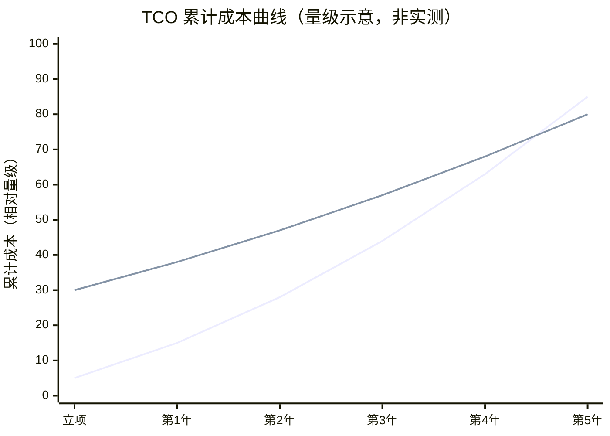

# 18.2 长期维护成本：TCO 模型与技术债务形态

> 所属章节：第18章 构建系统设计
>
> 难度：[E] | 预计阅读时间：60分钟

## <span class="blue"> 本节导读

18.1 回答了"今天选哪个"——决策树走完，候选有了。但选型评审桌上有个问题很少有人提：**选完之后五年，各自要花多少钱**？构建系统的成本结构和存储失效（17 章）同构而不同形：存储是失效滞后，构建是**债务滞后**——每一次"先这样能跑"的妥协都记了账，利息按复利滚，账单在第二年以后的某个季度集中寄到。本节把这笔账拆成可计算的四项，让"Yocto 前期贵、长期便宜"从经验判断变成可评审的数字。本节覆盖：

- TCO 四要素模型：初始设置、学习成本、构建时间×次数、维护成本
- Buildroot 与 Yocto 的两条 TCO 曲线，以及交叉点由什么决定
- "构建工程师"这个角色：什么时候必须专职，离职风险怎么防
- 技术债务的四种典型形态：local.conf 膨胀、recipe 拷贝粘贴、Layer 循环依赖、版本冻结
- 贯穿场景应用：机器人公司的 TCO 量级测算

---

## <span class="blue"> 为什么构建成本是滞后的

构建系统选型的演示日，一切都很美好：两天搭好环境，一条命令出镜像，评审会通过。然后时间开始收费：

- 第三个月，第一个软件包要升级版本——发现补丁要手工回移；
- 第六个月，第二个 SKU 立项——defconfig 复制了一份，从此公共改动要同步两处；
- 第二年，构建时间从 15 分钟涨到 90 分钟——没人知道是哪次变更引入的，因为没有体积和时间监控；
- 第三年，Yocto/Buildroot 的 LTS 分支临近 EOL——升级 BSP 意味着几百个 recipe 的兼容性回归，项目已经排到下个季度之后；
- 第五年，当初搭环境的工程师离职了——留下的 `local.conf` 有 400 行，没有人知道其中 200 行是干什么的。

注意每一笔成本的共同点：**它们都是"上一次图省事"的利息**。这就是技术债务的准确含义——不是比喻，是记账关系：本金是当时的妥协，利息是此后每次相关工作都要多付的时间。本节后半的四种债务形态，就是把这本账翻开看明细。

---

## <span class="blue"> TCO 四要素模型

> TCO（Total Cost of Ownership，总拥有成本）：一个系统在其整个生命周期内发生的全部成本，包括获得、使用、维护到退役。对构建系统，生命周期按产品设计寿命算（机器人场景取 5 年）。

```
TCO = C_setup + C_learn + C_build × N + C_maint

C_setup   初始设置成本：搭环境、写首批配置/recipe、跑通首个镜像
C_learn   学习成本：团队达到"能独立改构建系统"水平的时间×人数
C_build   单次构建成本：等待时间的人力 + CI 基础设施分摊
N         构建次数：5 年内的总构建次数（开发迭代 + CI 触发）
C_maint   维护成本：跟随上游升级、补丁回移、CVE 处置、债务利息
```

逐项展开，每项给出**量级示例**（口径：公式为主、数字为量级演示，用你团队的实际参数代入）。

### C_setup：初始设置

| | Buildroot | Yocto |
|---|-----------|-------|
| 首个可用镜像 | 天级（2 周出产品镜像是可信量级） | 周级（环境 + 首个 layer + 跑通参考镜像，2~4 周） |
| 磁盘与机器 | 普通开发机 + 10GB | 大内存构建机 + 150GB，可能要 CI 节点规划 |

这一项 Buildroot 完胜，差距约一个数量级。**但它是四项里唯一 Buildroot 赢的一项**——选型演示日展示的就是这一项，这解释了为什么演示日的结论经常是错的。

### C_learn：学习成本

| | Buildroot | Yocto |
|---|-----------|-------|
| 到"能改配置" | 小时级（会 Kconfig 就会） | 天级 |
| 到"能改构建系统本身" | 天级（Makefile 直白） | 3~6 个月（BitBake 变量展开时机、layer 优先级、任务依赖图） |

Yocto 的学习成本有一个隐蔽特性：**它是前置且不可分摊的**。团队里至少要有一人完整跨过这条曲线，否则所有 Yocto 优势（layer 复用、sstate、合规自动化）都只是宣传册上的词。这一条直接决定了 18.1 决策树里"有专职构建工程师？"那一问的分量。

### C_build × N：构建时间成本——最大的隐性项

这是唯一随时间**线性增长且每天都发生**的成本项，公式拆开：

```
C_build × N = T_wait × W_team × R_daily × D_year × Y
                + CI 基础设施（构建机、存储、缓存服务器）× Y

T_wait   单次构建的等待时间（工程师实际阻塞时长）
W_team   团队时薪（按公司全成本口径，含社保分摊）
R_daily  每人每天触发构建次数
D_year   年工作日
Y        年数
```

量级示例（机器人公司场景，参数为演示值）：10 名工程师、每人每天触发 4 次构建、年工作日 240 天、5 年——总构建次数 N ≈ 48,000 次。若单次等待 60 分钟（无增量缓存的悲观情形），等待总时长 48,000 小时；若 sstate 缓存把典型等待压到 10 分钟，等待总时长 8,000 小时。**差额 40,000 小时，按任何时薪口径都是一笔七位数的账**——这就是 18.4 要建 sstate 缓存服务器的商业理由，先在这里立住。

> ⚠️ C_build 的敏感性在 T_wait 而不在 N。选型阶段就要实测两个数字：clean 构建时间和**典型增量构建时间**。只测 clean 构建等于只看了房价没看物业费。

### C_maint：维护成本——债务的记账科目

维护成本是三件事的和：

1. **跟随上游**：LTS 分支间的迁移（Yocto 两年一代 LTS、Buildroot 新三年 LTS 周期——18.1 版本纪律），每次迁移是周级到月级的回归工作量；
2. **补丁回移**：上游不修你的旧版本时，安全补丁要自己 backport，难度随落后程度指数上升；
3. **债务利息**：下一部分的四种形态，每种都按复利计息。

| | Buildroot | Yocto |
|---|-----------|-------|
| 跟随上游 | 机制简单，但一切手动 | 工具链完善（devtool、recipetool），但体量大 |
| CVE 处置 | security.buildroot.org 可查，应用靠人 | cve-check 自动扫描，处置仍需人 |
| 债务利息率 | SKU 数越多越高（配置同步靠记忆） | 无专职维护者时极高（layer 腐化） |

---

## <span class="blue"> 两条 TCO 曲线与交叉点

四项合成时间函数，两家的形状截然不同：



上方曲线是 Buildroot、下方是 Yocto 的示意形状（实际位置由你的参数决定）：**Buildroot 起点低但斜率持续上扬**——每次手动同步、每次全量重建、每次合规手工收集都在加；**Yocto 起点高（setup + learn）但斜率低**——自动化把重复劳动压平。

这张图真正重要的不是形状，是**交叉点的位置由什么决定**：

- **SKU 数量**：单一产品时两条曲线可能始终不相交（Buildroot 5 年都便宜，18.6 案例二的 LoRa 传感器就是这个情形）；SKU 到 3 个以上，Buildroot 的配置同步成本把斜率顶起来，交叉点显著提前；
- **合规要求**：需要 SBOM 自动化的瞬间，Buildroot 的手工合规成本使斜率陡增，交叉点提前到第一年；
- **团队规模**：人越多，构建次数 N 越大，C_build 项权重越高，sstate 的价值越大。

机器人公司（5 SKU + CRA 合规 + 10 人团队）：三个变量全部把交叉点往前提——TCO 视角下 Yocto 的胜出没有悬念，这和 18.1 决策树的结论互相印证。**两条独立的推理路径得到同一个结论，这个结论才配写进决策文档**。

---

## <span class="blue"> 构建工程师：什么时候必须专职

| 团队规模 | 建议配置 | 理由 |
|----------|----------|------|
| 1~3 人 + Buildroot | 兼职即可 | 机制简单，维护动作少 |
| 3~10 人 + Yocto | **至少 1 名专职** | sstate 服务器、layer 纪律、CVE 处置是日常职能 |
| 10~30 人 + Yocto | 专职 + 备份 | 构建系统是生产线，停工即全线停工 |
| 任何规模 + 商业方案 | 接口人 1 名 | 责任转移给供应商，但要有能评审供应商交付物的人 |

专职之外还有一个更尖锐的问题：**这个人离职了怎么办**。构建系统的知识资产管理三条纪律：

1. **一切进版本控制**——包括"为什么在 local.conf 里加这一行"（commit message 写理据）；
2. **构建文档是入职文档**——新人第一天能不能按文档从零构建出镜像，是知识是否真正沉淀的试金石；
3. **轮值机制**——每季度指定一名非专职工程师做一次完整发布构建，强制知识扩散，防止 bus factor = 1。

> bus factor：项目被一辆公交车撞倒几个人就会瘫痪。构建系统的 bus factor 为 1 是普遍现象，也是最容易在风险管理评审里被漏掉的一项。

---

## <span class="blue"> 技术债务的四种典型形态

债务滞后兑现的机理讲完了，现在翻开账本看明细。四种形态按出现频率排序，每种给：长什么样 → 怎么形成 → 利息怎么付 → 怎么防。

### 形态一：local.conf 膨胀

**长什么样**：`local.conf` 从初始的 20 行涨到 400 行，镜像内容、发行版策略、机器特性、临时调试开关全堆在一起，没人敢删——删了可能某个 SKU 就不启动了，但没人记得是哪一行在保它。一份真实的"膨胀标本"长这样：

```bash
# local.conf（第 5 年的样子，节选 24 行中的 4 类问题行）
DL_DIR ?= "/data/downloads"            # 本机参数 —— 这才是 local.conf 的本职
BB_NUMBER_THREADS = "16"               # 本机参数 —— 本职
IMAGE_INSTALL:append = " gdb strace vim"      # 镜像内容 —— 该进 image recipe
# 2023-10 老王调试加的，别删           # 无人知道"别删"的原因还在不在
DISTRO_FEATURES:append = " systemd"    # 发行版策略 —— 该进 distro conf
MACHINE = "jetson-orin-amr-d"          # 机器选择 —— 该由 CI/构建命令指定
CORE_IMAGE_EXTRA_INSTALL += "opencv"   # 旧语法+新语法混用，另一个 SKU 靠它
```

四类行里只有前两行属于这个文件，后四类每一行都是一次"先试一下"留下的本金。

**怎么形成**：`local.conf` 的设计定位是"本机构建环境配置"（下载目录、并行度），但它是改起来最方便的地方，于是所有"先试一下"的改动都落在这里，试过能跑就留下了。

**利息怎么付**：换构建机、加 CI 节点、新人入职，都要把这 400 行原样复制；任何一行的语境丢失都是一次排查。

**怎么防**：业务配置必须进自定义 layer（`meta-<company>-distro` 的 distro 配置和镜像 recipe），`local.conf` 只留本机参数。CI 里加一条门禁：`local.conf` 的版本控制 diff 需要评审，layer 内配置不需要——用流程差异引导配置归位。这是 18.3 反模式清单的第一条，这里先记账。

### 形态二：recipe 拷贝粘贴

**长什么样**：要改一个上游 recipe 的行为，工程师把整个 `.bb` 文件复制到自己的 layer 里改。上游升级后，复制来的那份停在旧版本——安全修复进不来，还没人知道，因为"它一直都在正常构建"。

**怎么形成**：复制比理解 `.bbappend` 的叠加语义快十分钟。

**利息怎么付**：CVE 扫描报上游已修复，你的产品依然中枪——你维护的是一份没有上游的孤儿副本。

**怎么防**：纪律只有一条——**修改用 `.bbappend`，禁止整份复制**。`.bbappend` 是 Yocto 的叠加机制：同名追加文件在构建时叠加到原 recipe 上，上游升级时你的修改自动应用到新版本（18.3 给完整写法）。对照一看就懂为什么说复制是借债：

```bash
# 债的写法：把整个 busybox_1.36.bb 复制进自己 layer 改三行
#   → 上游升到 1.37（含 CVE 修复），你的副本永远停在 1.36

# 还的写法：meta-mycompany/recipes-core/busybox/busybox_%.bbappend
FILESEXTRAPATHS:prepend := "${THISDIR}/files:"
SRC_URI += "file://enable-syslogd.cfg"     # 只叠加你的三行改动
# 上游升 1.37 时，这份 bbappend 自动叠加到新版本——修复白拿
```

Buildroot 侧的对应形态是补丁目录失控：`package/<pkg>/` 下一堆 `0001-fix.patch` 没有上游 issue 链接、没有适用版本标注，升级包版本时逐个手工试。防治相同：补丁必须带上游状态注释。

### 形态三：Layer 循环依赖

**长什么样**：layer A 的 recipe 依赖 layer B 的组件，layer B 的某个 bbappend 又改了 layer A 的行为。构建能过——BitBake 容忍——但任何一层想单独升级或复用都拆不开。

**怎么形成**：分层图没画过，"这个 recipe 放哪层"凭当下方便。

**利息怎么付**：新产品线想复用 BSP 层时，发现它缠着发行版层的藤蔓；拆分成本按周计。

**怎么防**：开工第一天画分层依赖图并定为**单向无环**（BSP ← distro ← apps，箭头指依赖方向，禁止回头）。18.3 的 layer 模板就是按无环设计的。

### 形态四：版本冻结

**长什么样**：BSP 停留在某个 Yocto 非 LTS 版本上，"能跑就不动"。两年后发现：上游停止 CVE 修复，客户审计要求出示漏洞处置能力，而升级意味着跨三代 LTS 的回归测试。

**怎么形成**：每次季度规划里"升级 BSP"都排在功能开发之后——它的收益不可见，风险立即可见，理性逐期决策累积成非理性的长期头寸。

**利息怎么付**：CRA 语境下，跑在 EOL 分支上 = 无法提供安全更新 = 不合规（18.1 版本纪律的闭环）。一次性跨多代的升级工作量远大于逐代跟随。

**怎么防**：把"跟随 LTS"写进年度预算而不是季度排期——每个 LTS 周期固定安排一次升级窗口，按项目做而不是按便利做。

> 💡 四种形态的共同结构：形成时都省了十分钟到十天，兑现时都按周以上计费。技术债务管理不是"保持代码干净"的洁癖，是让这笔利率差站在你这边的财务决策。

---

## <span class="blue"> 贯穿场景应用：机器人公司的 TCO 测算

把模型代进场景（参数为量级演示，读者用自己团队参数重算）：

**问题一：存量 4 个 SKU 维持 Yocto，5 年 TCO 结构合理吗？**

| 项 | 量级 | 备注 |
|----|------|------|
| C_setup | 已沉没 | 存量系统，不计 |
| C_learn | 已沉没大半 | 2 名构建工程师在岗 |
| C_build × N | **最大活动项** | 4 小时 CI × 每天多次 → 18.4 的 sstate 缓存服务器直接砍这项 |
| C_maint | 可控 | 风险点是债务形态一和四：local.conf 现状待审计，BSP 版本待核对 LTS 状态 |

结论：维持 Yocto 正确，但 C_build 项正在大出血——这给 18.4 的 CI 改造立好了商业理由。

**问题二：人形新品线用 Buildroot 快速启动，TCO 上成立吗？**

按单一产品、小团队（3 人）、抢窗口期代入：Buildroot 曲线前两年低于 Yocto，**短期成立**。但两个修正项必须入账：

1. **组织分裂成本**：同一公司维护两套构建系统 = 两套知识体系、两套 CI、两套合规流程——这部分不在任何一家的 TCO 曲线上，是"双系统税"；
2. **迁移期权价值**：人形线若成功放量、SKU 增加，Buildroot→Yocto 迁移在发布后是月级 × 人级的工程（18.6 案例三：2 人 4 个月）。决策时点要问的不是"Buildroot 现在快不快"，而是"这条产品线有没有做多 SKU 的计划"——有，则 Buildroot 省下的两个月大概率在第二年加倍还回去。

走查结论同样留到 18.6 与 18.3/18.4 的实战内容合并收口。本节立住的是方法：**任何"先用 X 顶一下"的提议，都要用 TCO 四要素过一遍，并显式回答迁移期权那一问**。

---

## <span class="blue"> 本节总结

构建系统的账要按四要素算：初始设置与学习是一次性的，构建时间成本随每一天线性累积，维护成本随债务复利增长——Buildroot 赢在第一项，Yocto 赢在后三项，交叉点位置由 SKU 数、合规要求、团队规模三个变量决定。债务的四种形态（local.conf 膨胀、recipe 拷贝、Layer 循环依赖、版本冻结）都有同一个结构：形成时省十分钟，兑现时按周计费。专职构建工程师在 3~10 人 + Yocto 的规模上不是奢侈而是必需，而比专职更重要的是防止知识只存在一个人脑子里。机器人场景的测算把 C_build 立为最大活动项——下一节先看组织纪律（18.3 把债务防在结构上），再砍构建时间（18.4）。

### 速查表

| 要点 | 内容 |
|------|------|
| TCO 公式 | C_setup + C_learn + C_build×N + C_maint |
| 最大隐性项 | C_build×N：敏感性在单次等待时间 T_wait，不在次数 N |
| 曲线交叉点变量 | SKU 数量、合规要求、团队规模 |
| 专职红线 | 3~10 人 + Yocto → 至少 1 名专职构建工程师 |
| 知识资产三纪律 | 一切进版本控制 / 构建文档即入职文档 / 季度轮值发布 |
| 债务四形态 | local.conf 膨胀、recipe 拷贝粘贴、Layer 循环依赖、版本冻结 |
| 双系统税 | 一家公司两套构建系统 = 两套知识体系/CI/合规流程 |
| 迁移期权之问 | "这条产品线有多 SKU 计划吗"——有则慎选 Buildroot |

---

## <span class="blue"> 下一步

债务四形态里三种的防法都指向同一个地方：layer 和 recipe 的组织纪律。下一节进入 Yocto 的实战核心——layer 怎么分层、bbappend 怎么用、补丁怎么管、5 个 SKU 的共享与差异怎么安放；Buildroot 侧的组织对应面（BR2_EXTERNAL 外部树）一并给出。

> **18.3 Layer 与 Recipe 组织工程实践**（待写）

---

## <span class="blue"> 配套资源

| 资源类型 | 内容 |
|----------|------|
| 官方文档 | [Yocto Project 开发手册（layer/recipe 概念）](https://docs.yoctoproject.org/dev-manual/) / [Buildroot 手册（定制章节）](https://buildroot.org/docs.html) |
| 方法参考 | 《The Pragmatic Programmer》技术债讨论；Yocto Project 官方 "Migrating to a newer release" 指南 |
| 本章相关 | 18.1（决策矩阵与版本纪律）、18.3（组织纪律落地）、18.4（C_build 的砍法） |
