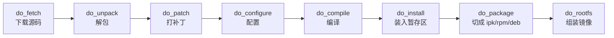
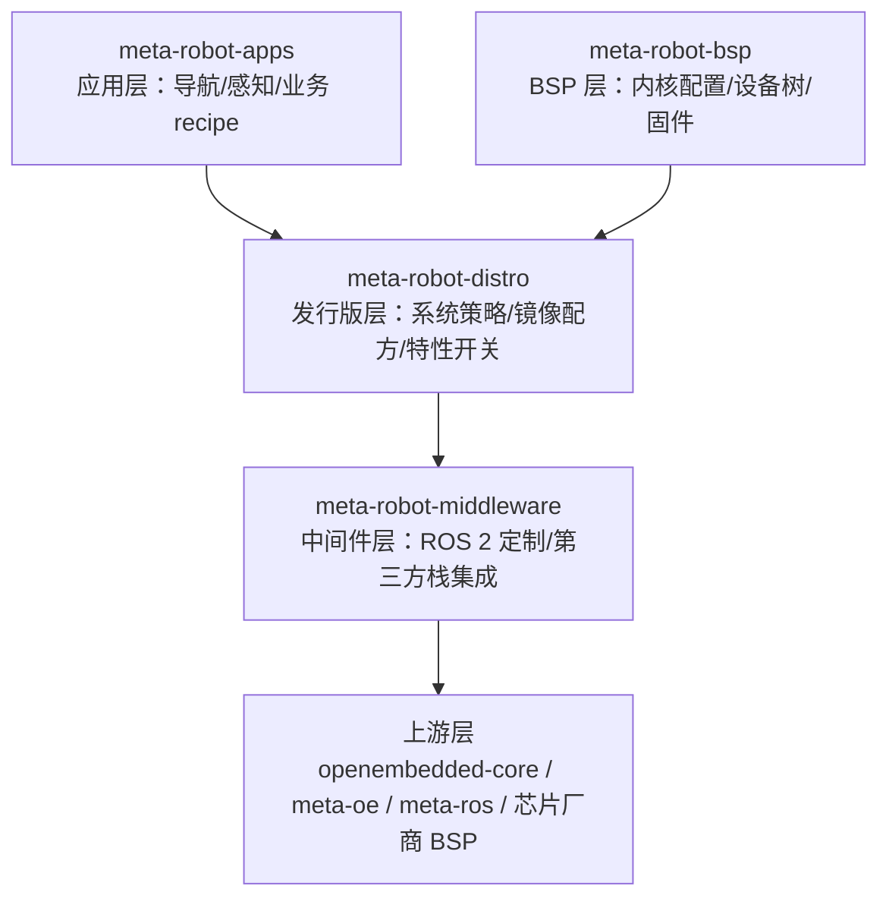

# 18.3 Layer 与 Recipe 组织工程实践

> 所属章节：第18章 构建系统设计
>
> 难度：[E] | 预计阅读时间：75分钟

## <span class="blue"> 本节导读

18.2 的债务审计有个耐人寻味的结论：四种债务形态里三种（local.conf 膨胀、recipe 拷贝粘贴、Layer 循环依赖）的防法都指向同一个地方——**layer 与 recipe 的组织纪律**。也就是说，Yocto 项目的长期健康不取决于懂多少 BitBake 技巧，而取决于开工第一天定下的结构。本节是 Yocto 侧的实战核心：先理解一次构建的机制（理解之后，纪律每一条都有理据），再给分层模板、修改上游的正确姿势、补丁规范、多 SKU 组织法、反模式清单。Buildroot 读者不要跳过——本节末尾有双轨对照：组织原则相通，语法各表。本节覆盖：

- BitBake 一次构建的机制解剖：recipe、任务链、sysroot、sstate 从哪来
- Layer 分层模板：meta-&lt;company&gt;-bsp / distro / apps / middleware，单向无环
- bbappend 修改上游的正确姿势（债务形态二的解法兑现）
- 补丁管理：SRC_URI + Upstream-Status + devtool 工作流
- 多 SKU 组织：MACHINE 驱动差异，共享与分裂的安放位置
- 反模式清单：四种"能跑但埋雷"的写法
- Buildroot 对应面：BR2_EXTERNAL 外部树与补丁目录规范
- SDK 分发与 Canadian Cross：应用工程师不该碰构建系统

---

## <span class="blue"> 机制解剖：BitBake 的一次构建在做什么

组织纪律要有理据，先得理解被组织的是什么。BitBake 执行 `bitbake core-image-minimal` 时做的事，拆开是三层：

### 第一层：recipe——一个软件包的构建说明书

每个软件包一个 `.bb` 文件。解剖一个最小可用的 recipe（以自家应用为例）：

```bash
# meta-robot-apps/recipes-apps/nav-agent/nav-agent_1.4.2.bb
SUMMARY = "Robot navigation agent"          # 一句话描述，进包管理元数据
LICENSE = "CLOSED"                          # 闭源组件声明；开源组件写具体许可证
                                            # 且必须配 LIC_FILES_CHKSUM 校验许可证文件没变

SRC_URI = "git://git.internal.example.com/nav-agent.git;protocol=https;branch=main"
SRCREV = "a1b2c3d4e5f6..."                  # 钉死的提交哈希——可复现性的第一道锁

S = "${WORKDIR}/git"                        # 源码目录约定（git 类源码解包后的位置）

inherit cmake                               # 继承构建系统类：自动获得 cmake 的
                                            # configure/compile/install 任务实现

do_install:append() {                       # 在标准 install 任务后追加动作
    install -d ${D}${sysconfdir}/nav
    install -m 0644 ${S}/conf/default.toml ${D}${sysconfdir}/nav/
}

FILES:${PN} += "${sysconfdir}/nav/*"        # 声明哪些文件进主包（而不是 -dev/-doc 分包）
```

三行决定命运的细节：

- **`SRCREV` 钉哈希而不是分支名**——钉分支名的 recipe 今天和明天构建出的不是同一个东西，18.1 的可复现性维度从这一行开始失守；
- **`LIC_FILES_CHKSUM`**——开源组件必须声明许可证文件的校验和，上游把 LICENSE 从 MIT 换成 GPL 时构建会报错拦下你。这是 18.5 合规链条的最前端传感器；
- **`inherit cmake`**——构建系统的知识（cmake 怎么交叉配置）被打包成类，recipe 只声明"我用 cmake"。这是 Yocto 把 3000+ 包的构建复杂度摊平的机制。

### 第二层：任务链——每个 recipe 走同一条流水线



每个任务有明确的输入输出，`do_patch` 就是 SRC_URI 里 `file://xxx.patch` 被执行的地方——18.2 债务形态二说"补丁必须进 SRC_URI"，机制依据就在这里：只有进了任务链的修改才被哈希、被缓存、被审计。绕过它（比如预先把改过的源码打包上传）等于让修改对构建系统隐身。

### 第三层：sysroot——每个 recipe 在隔离的编译环境里工作

第 2 章建立过工具链 sysroot 的概念（交叉编译器找头文件和库的地方）。Yocto 把这个概念推到工程极致：**每个 recipe 在自己专属的 sysroot 里编译**，里面只有它声明过依赖的包的头文件与库。

> sysroot（Yocto 语境）：BitBake 为每个编译任务临时拼装的"最小文件系统视图"——只含该 recipe 的 DEPENDS 声明的依赖。没声明的依赖在编译时物理上不可见。

这是交叉编译依赖管理的工程化解法，直接产生两个后果：

1. **隐式依赖不可能发生**——宿主机上装了什么不影响构建结果，"我机器上能编"这个经典扯皮在 Yocto 里被结构性消灭；
2. **sstate 缓存由此成为可能**——每个任务的输入（recipe 内容 + 依赖版本 + 配置）可以算哈希，哈希命中直接复用产物。18.4 的缓存服务器就是把这套哈希索引共享给全团队。

Canadian Cross 在此一并交代：应用工程师拿到的 SDK（`bitbake -c populate_sdk` 产物）内部是三角色编译——在你的 x86 工作站（build）上，生成一个"运行在 x86 工作站（host）、产出 ARM 二进制（target）"的工具链。三个角色两两不同就是 Canadian Cross。应用工程师不需要知道这个词，但分发 SDK 的你要能回答"为什么 SDK 里的 gcc 是 x86 的、产物却是 ARM 的"。

---

## <span class="blue"> Layer 分层模板：单向无环是第一天就要定的事

### layer 的物理结构

一个 layer 就是一个带约定的目录：

```
meta-robot-distro/
├── conf/
│   ├── layer.conf              # 层声明：本层叫什么、优先级、依赖谁
│   └── distro/
│       └── robotos.conf        # 发行版策略：init 系统、包格式、特性开关
├── recipes-core/
│   └── images/
│       └── robot-image-base.bb # 镜像配方：装哪些包
└── recipes-...
```

`conf/layer.conf` 的关键三行：

```bash
BBFILE_PRIORITY_robot-distro = "7"        # 层优先级：冲突时数值大者胜
LAYERSERIES_COMPAT_robot-distro = "wrynose"  # 声明兼容的 Yocto 系列
LAYERDEPENDS_robot-distro = "core robot-bsp" # 显式依赖声明
```

`LAYERSERIES_COMPAT` 是被低估的一行——它让"这个 layer 没跟上新 LTS"从静默腐化变成构建时的显式警告，18.2 债务形态四（版本冻结）在这里有一个早期报警器。

### 四层模板与依赖方向



分层原则一句话：**箭头只许向下**（上层依赖下层，下层不知上层存在），这就是 18.2 债务形态三的无环防法。各层职责与归属纪律：

| 层 | 放什么 | 不放什么 |
|----|--------|----------|
| meta-&lt;company&gt;-bsp | 内核 defconfig 碎片、设备树补丁、固件、MACHINE 定义 | 业务策略（ BSP 不该决定用 systemd 还是 busybox init） |
| meta-&lt;company&gt;-distro | 发行版策略（init/包管理/安全开关）、镜像配方、产品级默认值 | 具体应用的 recipe |
| meta-&lt;company&gt;-middleware | ROS 2 定制、第三方中间件集成 | 自家业务代码 |
| meta-&lt;company&gt;-apps | 自家应用 recipe | 硬件相关配置（那是 BSP 层的事） |

### 优先级纪律

`BBFILE_PRIORITY` 数值大者优先——同名 bbappend 冲突时高优先级的生效。约定：自家层 6~9，上游层保持原值（core 是 5）。**不许用优先级压制代替理解**——两个层改同一个 recipe 时，正确解法是理清职责归并到一层，不是把自己优先级调到 99。

---

## <span class="blue"> bbappend：修改上游的唯一正确姿势

18.2 债务形态二的完整解法。场景：上游 `openssh` 默认配置允许密码登录，产品线要求只允许密钥登录。

**错误姿势**：复制 `openssh_9.x.bb` 到自己 layer 里改——从此这份副本与上游脱钩，CVE 修复与你无关（18.2 已记账）。

**正确姿势**：同名 `.bbappend` 叠加：

```bash
# meta-robot-distro/recipes-connectivity/openssh/openssh_%.bbappend
#   ↑ 目录路径与上游 layer 内一致；文件名 % 是版本通配——上游升小版本自动跟随

FILESEXTRAPATHS:prepend := "${THISDIR}/${PN}:"
#   ↑ 让本目录下的 openssh/ 子目录进入文件搜索路径（放补丁和配置用）

SRC_URI:append = " file://harden-sshd-config.patch"
#   ↑ 补丁进任务链：被打包、被哈希、被审计
```

三个语法细节各值一次事故：

- **`%` 通配版本号**：`openssh_%.bbappend` 对上游任何版本生效；写成 `openssh_9.7.bbappend` 则上游升到 9.8 时你的加固**静默失效**——这比没加固更危险，因为它制造"已加固"的错觉；
- **`:append` 带空格**：`SRC_URI:append = " file://..."` 引号内前导空格是必须的，否则拼接后 URL 粘连报错——Yocto 新手踩坑率最高的语法点；
- **`${THISDIR}/${PN}` 约定**：补丁放 `recipes-xxx/openssh/openssh/` 下，路径即注释，半年后不用回忆补丁在哪。

> 💡 动手改上游 recipe 前先看变量能否在 distro 配置里解决。sshd 这类"改默认配置"的需求，约有一半能用 `PACKAGECONFIG` 或镜像配方里的 postinstall 完成，根本不用写 bbappend——叠加文件越少，跟随上游越省力。

### devtool：规范动作的工具化

手工维护"改源码 → 生成补丁 → 挂 bbappend"链条繁琐易错，`devtool` 把它变成三个命令：

```bash
devtool modify openssh          /* 拉出源码到 workspace，建好 git 仓库 */
# ……在 workspace 里改代码、commit……
devtool finish openssh meta-robot-distro
#   ↑ 自动生成 patch + bbappend 放进指定 layer，workspace 清理
```

devtool 的价值不在省事，在**让规范路径成为最省事的路径**——工程师走捷径的动机被工具抽掉，纪律才能不靠自觉存活。

---

## <span class="blue"> 补丁管理：SRC_URI 规范与 Upstream-Status

每个补丁文件头部必须有元数据注释：

```
From abc123 Mon Sep 17 00:00:00 2001
Subject: [PATCH] sshd: disable password authentication by default
Upstream-Status: Inappropriate [configuration]   # ← 关键一行
Signed-off-by: Build Engineer <build@example.com>
```

`Upstream-Status` 六个取值构成补丁的生命周期管理：

| 取值 | 含义 | 升级时的动作 |
|------|------|--------------|
| `Pending` | 已提交上游、未定论 | 每次升级检查上游状态 |
| `Submitted` | 已发邮件/PR | 同上 |
| `Accepted` | 上游已收 | 升级后删除本补丁 |
| `Backport` | 从上游新版回移 | 升级后删除 |
| `Denied` | 上游拒收 | 长期持有，定期复审理由 |
| `Inappropriate` | 不适合上游（产品定制） | 长期持有，理由写进注释 |

没有这一行的补丁是孤儿：半年后没人知道它能不能删。Buildroot 侧同样适用这份约定（其官方手册直接规定了这个格式）——这是双轨组织里完全同构的一条。

---

## <span class="blue"> 多 SKU 组织：共享与差异的安放位置

机器人公司 5 个 SKU 的差异分三类，每类有正式安放位置：

| 差异类型 | 例子 | 安放位置 |
|----------|------|----------|
| 硬件差异 | Jetson Orin vs RK3588；6 轴 vs 7 轴驱动 | **MACHINE**：每个硬件配置一个 machine conf，BSP 层承载 |
| 功能集合差异 | 人形线要实时内核补丁；AMR 不要 | **DISTRO 特性开关 / 镜像配方**：`IMAGE_INSTALL` 按 SKU 组合 |
| 应用版本差异 | 重载 AMR 的导航参数包不同 | **应用层 recipe 的 PACKAGECONFIG 或独立配置包** |

落地后的完整 layer 结构（机器人公司定稿）：

```
meta-robot-bsp/
├── conf/machine/amr-orin.conf        # AMR 标准/重载共用 Jetson Orin
├── conf/machine/arm-rk3588.conf      # 机械臂 RK3588
└── conf/machine/humanoid-orin.conf   # 人形 Orin + 实时补丁内核
meta-robot-distro/
├── conf/distro/robotos.conf          # 共享发行版策略
└── recipes-core/images/
    ├── robot-image-amr.bb            # 各 SKU 镜像配方 = 共享基座
    ├── robot-image-arm.bb            #   + 差异包集合
    └── robot-image-humanoid.bb
meta-robot-middleware/                # ROS 2 定制、视觉栈集成
meta-robot-apps/                      # 导航、感知、业务应用
```

纪律只有一条：**新增差异先问"这属于硬件、策略还是应用"，再决定进哪层**。问都不问就写进 local.conf 的，就是 18.2 债务形态一的明天。

---

## <span class="blue"> 反模式清单：四种"能跑但埋雷"的写法

| 反模式 | 长什么样 | 为什么错 | 正确姿势 |
|--------|----------|----------|----------|
| local.conf 写业务逻辑 | 镜像包列表、特性开关堆在 local.conf | 构建结果依赖单机配置文件，CI 与开发机不一致，无法评审 | 进 distro conf / 镜像 recipe，local.conf 只留本机参数 |
| 直接改 Poky/上游层 | 在 poky/meta 里改两行先跑通 | 上游一更新修改即丢；没人记得改过 | bbappend 叠加；上游层目录设为只读习惯 |
| git clone 替代 SRC_URI | 在 do_compile 里手动 clone 仓库 | 绕过 fetch/patch 任务链：无哈希、无缓存、无审计、离线构建失败 | 一切源码进 SRC_URI，devtool 生成补丁 |
| 硬编码绝对路径 | recipe 里写 `/opt/robot/...` 或开发者家目录 | 换构建机即炸； staging 机制被绕过 | 用 `${D}${prefix}` 等变量，安装路径走标准目录约定 |

四条共同本质：**都在绕过构建系统的记账机制**。能跑是因为 BitBake 容忍，埋雷是因为修改对哈希、缓存、审计隐身——三个月后，这些隐身的修改会以"为什么 CI 和我电脑上结果不一样"的形态回来收账。

---

## <span class="blue"> Buildroot 对应面：同一哲学，两套语法

选了 Buildroot 的产品线（或 18.1 混合方案里的 recovery 镜像）不享受 layer 机制，但组织原则完全同构。对应关系表：

| 原则 | Yocto 实现 | Buildroot 实现 |
|------|-----------|----------------|
| 定制与上游分离 | 自建 layer | **BR2_EXTERNAL 外部树** |
| 不动上游 | bbappend 叠加 | 外部树的 package/ 与补丁目录，Buildroot 源码树保持干净 |
| 补丁规范 | SRC_URI + Upstream-Status | 全局补丁目录 + 同一 Upstream-Status 格式 |
| 配置进版本控制 | distro conf / 镜像 recipe | defconfig 文件（`make savedefconfig` 最小化） |

BR2_EXTERNAL 的结构（机器人公司 recovery 镜像的实际形态）：

```
robot-external/                 # 独立 git 仓库，与 buildroot 源码并列
├── external.desc               # 声明：名字 + 描述
├── external.mk                 # 包 makefile 的挂接点
├── Config.in                   # 包配置项的挂接点
├── configs/
│   └── robot_recovery_defconfig   # recovery 镜像的全部配置
├── package/
│   └── robot-rescue/           # 自家修复工具的包定义
└── patches/                    # 全局补丁目录（按包名分子目录）
    └── busybox/
        └── 0001-rescue-shell.patch
```

构建时一个变量完成挂接：`make BR2_EXTERNAL=../robot-external robot_recovery_defconfig`。效果与 Yocto layer 相同：Buildroot 源码树可以随时升级、随时丢弃重下，公司资产全部在外部树这个 git 仓库里。

defconfig 管理的两条纪律：

1. **只提交 `make savedefconfig` 的最小输出**——直接复制 `.config`（数千行含全部默认值）会让升级时的真实差异淹没在噪音里；
2. **多 defconfig 的公共改动走 review**——Buildroot 没有 layer 帮你隔离，同步靠流程。这也是 18.1 说"多 SKU 是 Buildroot 弱项"的工程实感：不是不能做，是**没有机制替你记，全靠纪律补**。

---

## <span class="blue"> SDK 分发：应用工程师不该碰构建系统

最后一个组织问题：写导航算法的应用工程师，该不该学 BitBake？不该。他们应该拿到一个 SDK——预构建的工具链 + 目标系统头文件与库 + 环境设置脚本，装完即用：

```bash
# 构建工程师产出 SDK（随每次发布归档）
bitbake robot-image-amr -c populate_sdk

# 应用工程师一侧的全部工作
./robotos-sdk-x86_64-amr-orin-5.2.sh     /* 安装 */
. /opt/robotos/5.2/environment-setup-aarch64-oe-linux
#   ↑ 设置 CC/CXX/sysroot 等一组环境变量
$CC -o nav_test nav_test.c               /* 直接交叉编译，sysroot 已就位 */
```

SDK 分发把组织切成清晰的两层：**构建工程师维护"生产 SDK 的系统"，应用工程师使用 SDK**。这条边界有三个直接收益：应用团队的学习成本归零；应用构建环境与 CI 完全一致（同一个 sysroot）；构建系统的改动对应用团队透明。Yocto 还有 extensible SDK（eSDK，允许应用侧补装包），代价是体积与复杂度——多数团队用标准 SDK 足够，eSDK 留给"应用团队需要新增系统组件"的少数场景。

Buildroot 同样能导出 SDK（`make sdk`），机制一致。这构成 18.6 走查里"双系统税"的一个抵减项：两条产品线对应用团队暴露的接口可以设计得几乎相同。

---

## <span class="blue"> 本节总结

Yocto 项目的长期健康在开工第一天由结构决定：layer 单向无环分层、修改走 bbappend 不复制、补丁进 SRC_URI 带 Upstream-Status、差异按"硬件/策略/应用"三问归层——这四条不是洁癖，每一条都对应 18.2 账本里的一种债务形态。机制理解是纪律的地基：sysroot 隔离消灭了"我机器上能编"，任务链让一切修改可哈希可审计，sstate 从这套记账机制里自然长出来。Buildroot 侧哲学同构而语法不同——BR2_EXTERNAL 外部树 + savedefconfig 纪律，差别在于 Buildroot 没有机制替你记，全靠纪律补。SDK 分发则把组织切成两层：构建工程师生产 SDK，应用工程师使用 SDK，这条边界是两边的学习成本同时归零的地方。

### 速查表

| 要点 | 内容 |
|------|------|
| recipe 三行命门 | SRCREV 钉哈希 / LIC_FILES_CHKSUM 合规传感 / inherit 复用构建知识 |
| sysroot 隔离 | 依赖没声明就物理不可见；sstate 哈希由此可能 |
| 分层纪律 | 单向无环；BSP ← distro ← apps；优先级不用来压制 |
| bbappend 三坑 | `%` 通配版本 / `:append` 前导空格 / `${THISDIR}/${PN}` 约定 |
| devtool | modify → 改 → finish：让规范路径成为最省事路径 |
| 补丁元数据 | Upstream-Status 六态；无此行的补丁是孤儿 |
| 多 SKU 三问 | 硬件→MACHINE / 策略→DISTRO / 应用→recipe |
| 反模式四条 | local.conf 业务逻辑 / 改上游层 / clone 代替 SRC_URI / 硬编码路径 |
| Buildroot 双轨 | BR2_EXTERNAL 外部树 + savedefconfig 最小化 + 同一补丁格式 |
| SDK 边界 | 构建工程师生产 SDK，应用工程师使用 SDK |

---

## <span class="blue"> 下一步

结构纪律立住了，还剩场景里最痛的那根刺：CI 全量构建 4 小时，工程师每天多次卡在等待上。下一节进生产环节——分层触发、sstate 缓存服务器怎么架、硬件在环测试怎么接、镜像体积回归怎么监控。

> **18.4 CI/CD 流水线：嵌入式构建的生产环节**（待写）

---

## <span class="blue"> 配套资源

| 资源类型 | 内容 |
|----------|------|
| 官方文档 | [Yocto 开发手册（layer/bbappend/devtool）](https://docs.yoctoproject.org/dev-manual/) / [BitBake 用户手册](https://docs.yoctoproject.org/bitbake/) / [Buildroot 手册 BR2_EXTERNAL 章节](https://buildroot.org/downloads/manual/manual.html#outside-br-custom) |
| 上游规范 | [OpenEmbedded 补丁头格式（Upstream-Status）](https://www.openembedded.org/wiki/Commit_Patch_Message_Guidelines) |
| 本章相关 | 18.2（债务形态对照）、18.4（sstate 缓存架构）、第 2 章（工具链 sysroot 概念） |
