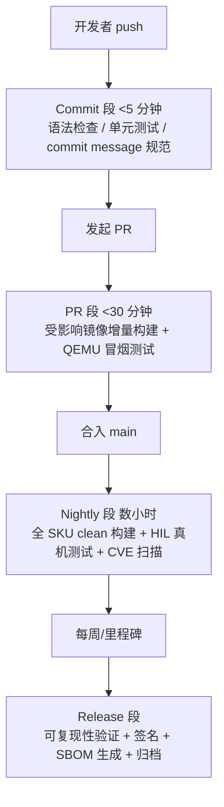

# 18.4 CI/CD 流水线：嵌入式构建的生产环节

> 所属章节：第18章 构建系统设计
>
> 难度：[E] | 预计阅读时间：60分钟

## <span class="blue"> 本节导读

18.2 的 TCO 测算立了一笔账：机器人公司 5 年里 C_build 项的等待总时长约 48,000 小时，其中 sstate 可砍掉的大头约 40,000 小时——那笔账的商业理由立好了，本节给工程实现。场景里最痛的一根刺也在这里：CI 全量构建 4 小时，工程师每天多次卡在等待上。嵌入式 CI 不是把互联网那套 GitHub Actions 教程搬过来就能用的——构建按小时计、测试要摸真硬件、产物按 GB 计，三个特殊性决定了流水线要重新设计。本节覆盖：

- 嵌入式 CI 的三个特殊性：为什么通用 CI 经验在这里失效
- 分层触发策略：Commit / PR / Nightly / Release 四段各做什么、各花多久
- sstate 缓存架构：从单机缓存到团队共享服务器的三种架法
- 构建环境容器化：宿主机差异的消灭与 kas 工具
- HIL 硬件在环测试：测试农场怎么建、测试怎么分级
- 镜像体积回归监控：buildhistory 与 17 章 CI 体积审计的接口
- 场景走查：4 小时 CI 的时间拆解与优化预算表

---

## <span class="blue"> 嵌入式 CI 的三个特殊性

通用软件 CI 的默认假设在这里全部不成立，先把差异摆明：

| 假设 | 互联网/通用软件 | 嵌入式 |
|------|----------------|--------|
| 构建时长 | 分钟级 | **小时级**（Yocto clean 构建 2~5 小时是常态） |
| 测试环境 | 容器里全搞定 | **要摸真硬件**（驱动、时序、功耗问题仿真器测不出） |
| 产物 | 一个镜像/包 | **多 SKU × 多架构的 GB 级镜像矩阵** |

三个特殊性推出三条设计公理，本节所有方案都是它们的推论：

1. **小时级构建 ⇒ 反馈必须分层**。任何"每次提交都全量构建"的设计都等于让团队每天只准提交两次。快速反馈和完整验证必须拆到不同的触发层级上。
2. **硬件依赖 ⇒ 测试资源是稀缺资产**。真机就那么多台，测试农场要解决的是排队与分配，不是能不能测。
3. **产物巨大 ⇒ 归档与回归监控是一等公民**。每次 nightly 留下 5 个 SKU × 双架构的镜像，一年是 TB 级存储；镜像体积的缓慢膨胀没有人盯就没人发现。

---

## <span class="blue"> 分层触发策略：四段流水线



各段的设计意图与边界：

### Commit 段（<5 分钟）：只挡低级错误

语法检查、recipe lint（oelint）、单元测试、commit message 规范。**这一段的铁律是不碰构建**——5 分钟预算连 BitBake 解析全部 recipe（parse 阶段）都不够。它的全部价值是用最低成本挡住"语法都过不了"的提交进入后面的贵时段。

### PR 段（<30 分钟）：增量构建 + 仿真冒烟

核心问题：**这次改动影响哪些 recipe**？`bitbake -g` 的依赖图能算出受影响集合，只重建它们（sstate 缓存让这成为可能）。构建产物进 QEMU 跑冒烟测试：系统起得来、关键服务活着、版本号正确。30 分钟预算是硬约束——超了就要砍测试范围，而不是延长时间，因为 PR 段的速度直接决定团队敢不敢小步提交。

### Nightly 段（数小时）：完整性的家

全 SKU clean 构建（从空 sstate 验证可复现性的下限）、HIL 真机测试、CVE 扫描（18.5 展开）、镜像体积记录。这一段的定位是**唯一可以慢的地方**——夜里跑，早上出报告。重要纪律：nightly 的 clean 构建要用干净的 sstate 起（或周期性清空），否则 sstate 腐化（缓存了不该命中的东西）会被永远掩盖。

### Release 段：里程碑上的仪式

可复现性验证（同一输入构建两次，比对哈希）、镜像签名（19 章安全链接口）、SBOM 生成与归档（18.5）、版本号与时间戳固化。**Release 段不引入任何新构建内容**——它只是把 nightly 验证过的产物重新证明一遍并归档；在 release 时才第一次构建某个配置，等于把审计变成赌博。

---

## <span class="blue"> sstate 缓存架构：从单机到团队共享

### 原理回顾与第一性问题

18.3 讲过机制：每个任务的输入算哈希，命中即复用产物。CI 场景的第一性问题是：**每个 CI 任务从空缓存开始，缓存就永远没用**。解决办法是按共享范围分三级架：

| 架法 | 结构 | 适用 | 代价 |
|------|------|------|------|
| 单机持久缓存 | 构建机本地 sstate 目录不清空 | 单人/极小组 | 零成本；换机器失效 |
| 共享只读镜像 | 中心服务器导出 sstate（HTTP/NFS），各节点只读拉取， nightly 后由主构建回写 | 5~30 人团队的**标准答案** | 一台存储服务器 + 回写纪律 |
| 分布式 + 云存储 | sstate 对象化存 S3 类存储，全球多站点 | 跨地域大团队 | 运维与一致性复杂 |

共享只读镜像模式的两个配套件：

```
# local.conf / CI 注入配置
SSTATE_MIRRORS = "file://.* https://sstate.internal.example.com/PATH;downloadfilename=PATH"
DL_DIR = "/shared/downloads"        /* 源码下载缓存——与 sstate 分开管理 */
```

**`DL_DIR`（下载缓存）与 sstate 要分开治理**：下载缓存内容是上游源码包，只增不减、永不失效、可以直接共享读写；sstate 是编译产物，有正确性风险，只读共享 + 主构建回写。混为一谈是常见的新手架构错误。

### 缓存为什么不命中：排查工具

命中率异常下降时的标准动作：

```bash
bitbake <recipe> -S none          /* 打印任务的签名计算过程 */
bitbake-diffsigs <旧签名记录> <新签名记录>
#   ↑ 对比两次签名的输入差异，精确定位是哪行配置变化导致缓存失效
```

最常见的命中杀手按频率排序：`local.conf` 里混入了会变的值（日期戳、构建机路径）、recipe 里嵌了 `${DATETIME}`、外部环境变量泄漏进任务签名。共同本质又是 18.3 那句话——**构建系统的记账机制只在输入完全受控时才灵验**。

---

## <span class="blue"> 构建环境容器化：消灭宿主机差异

"CI 上能编、我电脑上不能编"的另一半病因是宿主机差异（发行版版本、系统库、locale）。解法是把构建宿主本身也变成受控产物：

- **官方容器镜像**：Yocto 项目维护 `crops/poky` 容器（含全部宿主依赖），CI 与开发机用同一镜像 tag；
- **kas 工具**：用一个 YAML 文件声明"哪些 layer、哪个版本、什么配置"，`kas build` 自动完成检出与构建——它把"环境怎么搭"从 wiki 文档变成可执行、可版本控制的代码，与 18.2 的"构建文档是入职文档"纪律正好配套。

> 💡 容器化的是**构建宿主环境**，不是构建本身跑在容器里的语义洁癖。判断标准只有一个：新机器（或新人）从空环境到出镜像，需要几步手工操作？kas + 容器的答案是两步：clone 配置仓库、跑一条命令。

---

## <span class="blue"> HIL：硬件在环测试的农场化

> HIL（Hardware-in-the-Loop）：把真实硬件接入自动化测试回路——CI 触发时，测试框架给目标板上电、烧录新镜像、执行测试、采集结果，全程无人值守。

### 测试农场的最小架构

```
CI 调度器（Jenkins/GitLab Runner）
        │ 提交构建产物 + 测试请求
        ▼
测试农场控制器（LAVA 是事实标准）
        │ 分配空闲设备
        ├── 机架 1：AMR 控制板 ×2 ── 继电器切电 + 串口采集 + 网络烧录
        ├── 机架 2：机械臂控制器 ×2
        └── 机架 3：人形计算单元 ×1（稀缺资源，见下）
        ▼
结果回传：日志 + 波形/串口记录 + 测试判定
```

三个工程要点：

1. **电源控制是农场的地基**。每台设备挂可程控继电器（PDU 或 USB 继电器），测试框架能硬上下电——没有远程硬复位能力的农场，设备死机一次就瘫一条流水线。17.5 的断电测试工装（可编程电源 + 继电器 + 上位机）可以直接复用为农场电源层，两章的硬件投资在这里合并。
2. **串口日志是一等证据**。真机测试失败时，串口 console 的完整记录常常是唯一线索——农场必须自动采集归档，而不是只回传一个 exit code。
3. **设备是排队资源**。稀缺设备（人形线只有 1 台）必须进调度器的资源锁，测试按优先级排队；企图靠"大家自觉别同时用"维持的农场活不过第一个发布季。

### 测试分级：真机时间花在刀刃上

| 级别 | 跑在哪 | 内容 | 触发 |
|------|--------|------|------|
| L1 仿真 | QEMU | 启动、服务存活、API 冒烟 | 每次 PR |
| L2 真机冒烟 | 农场 | 镜像烧录、驱动加载、关键链路 | 每次 nightly |
| L3 真机深度 | 农场 | 导航/运动全场景回归、断电循环（17.5 矩阵） | 每周 / release 前 |

分级的原则：**能在仿真发现的问题不许占真机**。真机队列是稀缺资源，L1 漏过去的问题会以 10 倍代价在 L2 堵路。

---

## <span class="blue"> 镜像体积回归监控：让膨胀现形

17.4 立过一条配额纪律：rootfs 按当前镜像 ×1.25 预留，每个 release 在 CI 里记录体积、按斜率外推触线时间。本节给机制实现——Yocto 的 buildhistory：

```bash
# distro 配置或 CI 注入
INHERIT += "buildhistory"
BUILDHISTORY_COMMIT = "1"          # 每次构建把包清单/体积提交进 git 仓库
```

buildhistory 产出的是**每次构建的完整包清单与体积记录**，提交进 git 后天然成为时间序列。CI 上加一个简单的报告脚本：

```bash
# 体积回归检查：与上一 nightly 对比，超阈值即报警
buildhistory-diff -p buildhistory-old -a buildhistory-new
# 自研脚本按 SKU 汇总 rootfs 体积，写入时序库，超预算 80% 告警
```

17.6 分区表里的"日志分区 1GiB 硬限容"是运行时的保险丝，这里的体积监控是**构建时的前哨**——配额失守的第一个信号出现在构建产物上，比设备现场报警早一个发布周期。

---

## <span class="blue"> 场景走查：机器人公司 4 小时 CI 的拆解与预算

把 4 小时拆开归因（用 `bitbake -S` 与构建日志的耗时统计，不是拍脑袋）：

| 病灶 | 占比（典型情形） | 处方 |
|------|------------------|------|
| 每个 CI 任务从空 sstate 开始 | ~50% | 共享只读 sstate 镜像 + 主构建回写 |
| clean 构建当日常验证用 | ~25% | clean 移到 nightly；PR 段只建受影响 recipe |
| 双架构（x86 仿真 + ARM）串行跑 | ~15% | 并行化到两个 runner；仿真冒烟与 ARM 构建解耦 |
| 源码每次重新下载 | ~10% | 共享 DL_DIR + 内网下载镜像 |

优化后的分层预算表（写进 CI 设计文档，作为验收标准）：

| 段 | 触发 | 预算 | 内容 |
|----|------|------|------|
| Commit | 每次 push | <5 min | lint + 单测 |
| PR | 每个 PR | <30 min | 受影响增量构建 + QEMU 冒烟 |
| Nightly | 每晚 | <3 h | 5 SKU clean 构建 + HIL L2 + CVE 扫描 + 体积记录 |
| Weekly | 每周 | 不限 | HIL L3 深度回归 + 断电测试矩阵 |
| Release | 里程碑 | <4 h | 可复现验证 + 签名 + SBOM + 归档 |

**4 小时并没有消失，它被挪到了没人等待的夜里**。工程师日间路径上的等待从 4 小时降到 30 分钟以内——18.2 那笔 40,000 小时的账，到这里兑现为具体数字。

---

## <span class="blue"> 本节总结

嵌入式 CI 的三个特殊性（小时级构建、硬件依赖、GB 级产物）推出三条公理：反馈分层、真机是稀缺资源、归档与回归监控是一等公民。四段流水线把"快反馈"和"全验证"拆开——commit 段不碰构建、PR 段只建受影响集合、clean 构建挪进没人等待的夜里；sstate 共享镜像是 5~30 人团队的标准答案，DL_DIR 与 sstate 分治；HIL 农场化的地基是远程电源控制与串口证据采集，LAVA 是现成的事实标准；buildhistory 让镜像膨胀在构建期现形，比现场报警早一个发布周期。机器人公司的 4 小时拆完归因后，日间等待压到 30 分钟内——18.2 的 TCO 账就此闭环。

### 速查表

| 要点 | 内容 |
|------|------|
| 三特殊性 | 小时级构建 / 硬件依赖 / GB 级产物矩阵 |
| 四段流水线 | Commit <5min → PR <30min → Nightly 数小时 → Release 里程碑 |
| 铁律 | Commit 段不碰构建；PR 段超预算砍范围不延时间；Release 不引入新构建 |
| sstate 架法 | 5~30 人：共享只读镜像 + 主构建回写；DL_DIR 分治 |
| 命中率排查 | `bitbake -S none` + `bitbake-diffsigs`；杀手是日期戳/路径/环境变量泄漏 |
| 容器化 | crops/poky 或 kas；标准是新人两步出镜 |
| HIL 地基 | 程控电源 + 串口采集 + 设备资源锁；LAVA 事实标准 |
| 体积监控 | INHERIT += "buildhistory"，与 17 章配额审计对接 |

---

## <span class="blue"> 下一步

构建快了、测全了，还剩合规这条线没有落地：场景里 CRA 与大客户审计要求每个发布版交出 SBOM 和 CVE 处置承诺。下一节把合规从"法律恐慌"变成流水线里的一段自动化工序。

> **18.5 开源合规与 SBOM：从法律要求到商业门槛**（待写）

---

## <span class="blue"> 配套资源

| 资源类型 | 内容 |
|----------|------|
| 官方文档 | [Yocto 构建性能与缓存](https://docs.yoctoproject.org/dev-manual/speeding-up-build.html) / [buildhistory 手册](https://docs.yoctoproject.org/dev-manual/build-quality.html) / [kas 文档](https://kas.readthedocs.io/) |
| 测试框架 | [LAVA](https://www.lavasoftware.org/)（硬件在环测试事实标准） |
| 本章相关 | 18.2（C_build 账目）、18.3（sstate 机制原理）、17.4（体积配额纪律）、17.5（断电测试工装复用） |
