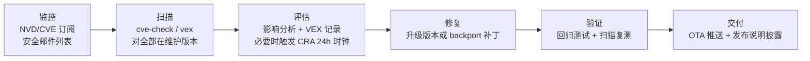

# 18.5 开源合规与 SBOM：从法律要求到商业门槛

> 所属章节：第18章 构建系统设计
>
> 难度：[E] | 预计阅读时间：60分钟

## <span class="blue"> 本节导读

18.4 把构建变快了，但发布一个版本要交付的东西里，镜像只是其一。场景里的合规压力还没落地：大客户合同里的 SBOM 条款、CRA 的报告义务、GPL 组件的源码公布义务——每一件都真实存在，每一件在传统嵌入式团队里都没有明确归属。本节把合规从"法务的事"翻译成"构建系统里的一段自动化工序"。本节覆盖：

- 时代背景：CRA / EO 14028 / IEC 62443 如何把合规从加分项变成入场券
- SBOM 是什么、三种格式（SPDX / CycloneDX / SWID）怎么选
- Yocto 的合规自动化：SPDX 生成、cve-check 与 CVE_STATUS 处置标注
- NVD 危机与后 NVD 时代的多数据源格局（写作时核实）
- CVE 管理闭环：监控 → 扫描 → 评估 → 修复 → 验证 → 交付
- copyleft 的真实义务与架构隔离设计

---

## <span class="blue"> 时代背景：合规为什么是现在的事

十年前，嵌入式产品的开源合规是"发布时把许可证文件打包附上"就完事。2026 年，三件事把它推成了商业门槛：

### 欧盟 CRA：有具体日期、覆盖存量产品的硬法

CRA（Cyber Resilience Act，Regulation (EU) 2024/2847）是欧盟第一部横向产品网络安全法——不按行业分，一切"含数字元素的产品"都在范围内，机器人整机确定在内。三个日期决定节奏（写作时于 2026 年 9 月核实）：

| 日期 | 生效内容 |
|------|----------|
| 2024-12-10 | 法规生效，过渡期开始 |
| 2026-06-11 | 合格评定机构（公告机构）条款适用 |
| **2026-09-11** | **漏洞与事件报告义务（Art. 14）生效**：发现被积极利用的漏洞或严重安全事件，24 小时内预警、72 小时内完整通报，经 ENISA 单一报告平台上报 |
| 2027-12-11 | 全面适用：安全设计、SBOM、技术文档、CE 标志 |

两个容易被低估的细节：

1. **Art. 69(3) 把报告义务覆盖到存量产品**——2027 年全面适用前的老产品，原则上只有"重大修改"才落入主体义务，但报告义务是例外：**今天已在欧盟现场运行的设备也适用**。也就是说，本书写作时，这项义务距生效只剩 3 天。
2. **24 小时是流程不是表单**。时钟从"知悉"起算——一封客户邮件、一篇研究员博客都可能触发。要在 24 小时内判断"这个 CVE 影响我哪个产品的哪个版本"，前提是**有现成的 SBOM 可查**；没有 SBOM 的团队，影响分析就要花掉数天，窗口当场失守。SBOM 由此从"文档工作"变成"应急响应基础设施"。

### 美国 EO 14028 与大客户审计

美国行政令 EO 14028（2021）把 SBOM 写进联邦采购要求，经由政府采购合同传导到整个数据中心与政企供应链。工业侧，IEC 62443 网络安全认证越来越多地被汽车厂、3PL 仓库等大客户写进供应商审计条款。共同效果：**SBOM 与 CVE 处置承诺出现在采购合同的附件里**，投标时交不出来就没有资格——这就是场景里机器人公司面对的现实，与医疗行业的 FDA 路径形态不同、强度相同。

### 开源许可证义务：一直存在，现在有人查了

GPL 等 copyleft 许可证的义务（公布修改、提供源码）从未消失，变化在执法强度：商业合规审计工具（Black Duck 等）和社区维权行动都让"赌没人查"的期望收益变成了负数。

---

## <span class="blue"> SBOM：是什么，三种格式怎么选

> SBOM（Software Bill of Materials，软件物料清单）：一个软件产品包含的全部组件的结构化清单——每个包的名称、版本、供应商、许可证、哈希。类比食品的成分表：出事（漏洞披露）时，靠它在几分钟内回答"我受影响吗"。

三种主流格式的分野不在语法，在设计目标：

| 格式 | 主导方 | 设计重心 | 适用场景 |
|------|--------|----------|----------|
| **SPDX** | Linux 基金会（ISO/IEC 5962 标准） | 许可证合规表达力最强；3.0 起重构为可扩展核心 | 合规交付、许可证审计、Yocto 原生输出 |
| **CycloneDX** | OWASP | 安全分析导向：组件与漏洞、服务的关联 | 安全工具链集成、漏洞扫描输入；Buildroot 2026.02 起输出改善 |
| **SWID** | ISO/IEC 19770 | 软件资产标识与清点 | 企业 IT 资产管理场景，嵌入式少见 |

选型结论对大多数嵌入式团队是直接的：**构建系统原生输出什么就用什么**——Yocto 出 SPDX、Buildroot 出 CycloneDX，两者都是合规合同里被接受的格式；需要另一种时用转换工具（spdx-tools、cdxgen 生态）从构建产物转换，不要手工维护第二份清单——手工维护的 SBOM 必然与真实构建漂移。

---

## <span class="blue"> Yocto 的合规自动化：两行 INHERIT 撑起半边天

### SPDX SBOM 生成

```bash
# distro 配置（不是 local.conf——18.3 的纪律）
INHERIT += "create-spdx"
```

每次镜像构建自动输出 SPDX 文档：全部包、版本、许可证、文件哈希、依赖关系，随发布归档。一个配套实践来自 17 章的呼应：SBOM 文件本身应进入 OTA/发布的归档目录，**每个发布版有且仅有一份与之绑定的 SBOM**——客户审计时要的是"v2.3.1 的 SBOM"，不是"最新的 SBOM"。

### cve-check：构建期的漏洞比对

```bash
INHERIT += "cve-check"
```

原理：用每个 recipe 的名称与版本元数据，对 NVD（美国国家漏洞数据库）做匹配，构建结束时输出每个镜像的 CVE 清单（已修补 / 未修补 / 不适用）。几个工程细节决定它好不好用：

- **NVD API key 必须申请**（`NVDCVE_API_KEY`）——无 key 时限流会让数据库下载从分钟级变成小时级；
- **增量更新**：`CVE_DB_UPDATE_INTERVAL` 控制本地库更新频率，NVD 本身每天更新一次，CI 上按天更新即可；
- **扫描基于版本号比对，不验证漏洞是否真实可达**——这是它产出"误报"的根源，也是 CVE_STATUS 存在的理由。

### CVE_STATUS：把处置决定变成审计证据

cve-check 报告里的每一条"未修补"都需要一个人做出处置决定，而决定必须**落进代码库**，否则下一个版本扫描时又是一条"未处置"：

```bash
# 在对应 recipe 或 bbappend 中标注，附理由注释
CVE_STATUS[CVE-2026-12345] = "not-applicable-platform: affects Windows builds only"
# 该 CVE 只影响 Windows 构建——机器人产品不跑 Windows，标注后不占用处置带宽
```

| 状态 | 用于 | 审计含义 |
|------|------|----------|
| `Patched` | 补丁已打进 SRC_URI | 证据链闭合：补丁文件本身在版本库 |
| `cpe-incorrect` | NVD 把别的组件错标成这个包 | 误报，已核实 |
| `not-applicable-config` | 漏洞依赖未启用的配置 | 配置分析记录 |
| `not-applicable-platform` | 只影响其他平台 | 平台分析记录 |
| `disputed` / `upstream-wontfix` | 上游争议或拒修 | 残余风险已知情接受 |

这张表的结构值得停下来看：**每一行都是"一个人看过这条 CVE 并写下了理由"**。这正是 CRA 与大客户审计要的东西——不是"零漏洞"的承诺（不存在），而是"每条已知漏洞都有处置记录"的过程证据。

---

## <span class="blue"> NVD 危机与后 NVD 时代

cve-check 的架构有一个单点：它只依赖 NVD 一家数据库。2024 年这个单点真实断裂过——NVD 从 2 月起停止录入新条目长达数月，年底 API 又出现严重性能问题（下载全库要数小时）。教训直接改写了 Yocto 生态的工具格局（写作时核实的现状）：

1. **CVE 源数据本身已机器可读**：CVE 项目的 CVEv5 格式仓库（cvelistV5）提供完整的机器可读记录，绕过 NVD 的加工延迟成为可能；
2. **多数据源与构建后扫描**：新工具链（如 yocto-vex-check 与 `vex` bbclass）把"扫描"从构建中剥离——构建时只归档元数据（CVE JSON + SPDX），扫描可以在**构建之后的任何时刻**对新披露的漏洞重跑；
3. **VEX 成为标准交付物**：

> VEX（Vulnerability Exploitability eXchange，漏洞可利用性说明）：随 SBOM 附带的注解文档，回答"这个 CVE 对我的产品是否可利用"——状态包括 vulnerable / not-vulnerable（附理由：配置未启用、代码路径不可达、已编译排除）。格式有 CSAF 与 OpenVEX 两种。

第 2 点直接对应 CRA 的生命周期要求：产品支持期内（5 年+），新漏洞每天都在披露，合规要求你在**产品寿命全程**能回答"昨天爆出的这个新 CVE 影响我三年前发布的版本吗"。如果答案需要"找出当年的构建目录重新构建一遍"，这个流程就活不过第一个真实事件。构建产物里归档元数据、扫描与构建解耦，是为 5 年后的自己铺路。

---

## <span class="blue"> CVE 管理闭环：从事故到流程



逐环节的工程落点：

- **监控**：订阅 NVD 源数据、上游项目的安全公告、发行版安全跟踪；机器人公司还要加 meta-ros 与 ROS 2 的安全公告——中间件层的漏洞不经过 Linux 发行版渠道；
- **扫描**：对**每一个仍在支持期内的已发布版本**扫描，不只扫 main 分支——现场跑的旧版本才是事故发生的版本；
- **评估**：每条命中给出 VEX 状态与理由；若判定"被积极利用"，CRA 的 24 小时时钟启动——评估环节的 SLA 是流程里最容易断的一环，要事先指定责任人与模板；
- **修复**：首选升级上游版本；版本不可升时 backport 补丁（进 SRC_URI，18.3 的补丁规范此刻兑现为合规能力——补丁头里的 Upstream-Status 就是审计证据）；
- **验证**：修复版本重跑扫描确认清零 + 回归测试；
- **交付**：经 OTA 推到现场设备（机制在第 21 章），发布说明中按合同/法规要求披露。

> 💡 闭环的健康指标只有一个：从"新 CVE 公开"到"受影响版本清单 + 处置决定"的耗时。这个耗时压进小时级，CRA 的 24 小时预警才有余量；靠人工翻构建目录的团队，这一步是天级。

---

## <span class="blue"> copyleft 的真实义务与架构隔离

法律条文留给法务，工程师要的是可执行的边界。三个常见误解先纠正：

1. **"GPL 不能用"——错**。义务是"发布修改后的源码"，不是禁止使用；Linux 内核本身就是 GPL；
2. **"链接了就传染"——分场景**。GPL 组件以独立进程运行、通过标准接口通信，不构成衍生作品；静态链接进你的二进制，就构成；
3. **"LGPL 也一样"——不一样**。LGPL 允许动态链接闭源程序，但要求用户能替换该库（动态链接或提供可重链接的目标文件）——在只读 rootfs 产品上，"用户可替换"这条要与 17 章的分区设计一起评估。

### 隔离架构：把 copyleft 组件关进明确的边界

设计原则：**让每类组件的义务边界在架构图上可见**。

```
┌─────────────────────────────────────────────┐
│ 闭源业务应用（你的核心资产）                    │
│   - 只通过 IPC/标准协议与下方通信              │
│   - 动态链接 LGPL 库（满足可替换要求）          │
├─────────────────────────────────────────────┤
│ GPL/LGPL 组件（kernel、busybox、系统服务）      │
│   - 独立进程，无静态链接进闭源二进制             │
│   - 修改过的部分：源码归档 + 随发布可获取        │
├─────────────────────────────────────────────┤
│ 构建系统义务自动化                              │
│   - 许可证清单由 SBOM 生成，不手工维护           │
│   - GPL 组件源码包随发布自动归档（DL_DIR 即档案）│
└─────────────────────────────────────────────┘
```

两个构建系统级的自动化落点：

- **许可证清单自动生成**：SBOM 已含许可证字段，禁止手工维护第二份清单（漂移必然发生）；
- **copyleft 源码归档**：Yocto 的 `archiver` 类可以按许可证过滤自动归档源码包（`COPYLEFT_LICENSE_INCLUDE`），Buildroot 的 `make legal-info` 一键产出全部源码包 + 许可证 + 构建信息的合规档案——后者是 Buildroot 在合规侧一个常被忽视的强项。

---

## <span class="blue"> 场景走查：机器人公司的合规落地清单

把本节内容按时间紧迫感排成执行序：

1. **本周**（CRA Art. 14 报告义务已经生效）：一页纸报告流程（谁评估、谁决定、谁上报）、security@ 联系渠道真实有人读、每个在维护产品的当前 SBOM 到手——24 小时时钟不等流程建成；
2. **本季度**：cve-check/vex 进 nightly（18.4 流水线已有挂点）、CVE_STATUS 处置标注规范进评审清单、对存量 4 个 SKU 的全部在维护版本做首次全量扫描建立基线；
3. **2027-12-11 前**：SBOM 随每个发布版归档、VEX 交付物模板、copyleft 源码归档自动化、技术文档包按 CRA 附件要求组织；
4. **持续**：闭环健康指标（新 CVE 公开 → 处置决定）按周度量，目标小时级。

注意第 1 条与后三条的性质差异：**报告义务是法律已经生效的部分，先用人能跑的流程顶住，再把自动化补上来**——等工具链完美再起步的合规项目，会输在已经在走的时钟上。

---

## <span class="blue"> 本节总结

合规在 2026 年是有日期的工程问题：CRA 的 24 小时报告时钟已经生效且覆盖存量产品，大客户把 SBOM 写进采购合同——SBOM 由此从文档变成应急响应基础设施。落地路径是自动化而非人海：SPDX/CycloneDX 用构建系统原生输出，cve-check 扫描 + CVE_STATUS 标注把每条漏洞的处置决定变成版本库里的证据，扫描与构建解耦（vex 架构）是为五年后还在支持期内的产品铺路。copyleft 的边界要画在架构图上——独立进程边界、动态链接、源码自动归档，义务可见才可管理。闭环的唯一健康指标是"新漏洞公开到处置决定"的耗时：压进小时级，合规才有余量。

### 速查表

| 要点 | 内容 |
|------|------|
| CRA 三日期 | 2024-12 生效 / **2026-09-11 报告义务（覆盖存量）** / 2027-12-11 全面适用 |
| 报告时钟 | 知悉起 24h 预警、72h 完整通报；24h 是流程不是表单 |
| SBOM 选型 | 用构建系统原生输出（Yocto=SPDX / Buildroot=CycloneDX），禁手工维护第二份 |
| Yocto 两行 | `INHERIT += "create-spdx"` + `INHERIT += "cve-check"`（配 NVD API key） |
| CVE_STATUS | 每条命中必须有处置标注与理由——这是审计证据 |
| 后 NVD 时代 | CVEv5 源数据 + vex 类构建后扫描 + VEX 交付物（CSAF/OpenVEX） |
| 闭环指标 | 新 CVE 公开 → 处置决定，目标小时级 |
| copyleft 三纠偏 | GPL 可用（义务是公布修改）/ 进程边界不传染 / LGPL 要求可替换 |
| 源码归档 | Yocto archiver 类 / Buildroot `make legal-info` |

---

## <span class="blue"> 下一步

五个决策域全部闭环：选型（18.1）、成本（18.2）、组织（18.3）、流水线（18.4）、合规（18.5）。最后一节把它们在机器人公司场景里串成一份可评审的方案，外加三个行业案例的决策复盘和 20 项评审清单。

> **18.6 综合实战：机器人公司构建系统全流程**（待写）

---

## <span class="blue"> 配套资源

| 资源类型 | 内容 |
|----------|------|
| 法规原文 | [CRA Regulation (EU) 2024/2847](https://eur-lex.europa.eu/eli/reg/2024/2847/oj)（Art. 14 / Art. 69 过渡条款） |
| 官方文档 | [Yocto 漏洞检查手册](https://docs.yoctoproject.org/dev-manual/vulnerabilities.html) / [SPDX 规范](https://spdx.github.io/spdx-spec/) / [CycloneDX](https://cyclonedx.org/) |
| 工具 | [yocto-vex-check](https://gitlab.com/syslinbit/public/yocto-vex-check)（构建后扫描）/ cvelistV5（CVE 源数据）/ Buildroot `make legal-info` |
| 本章相关 | 18.1（合规决策树）、18.3（补丁规范即合规证据）、18.4（nightly 挂点）、第 21 章（OTA 交付） |
