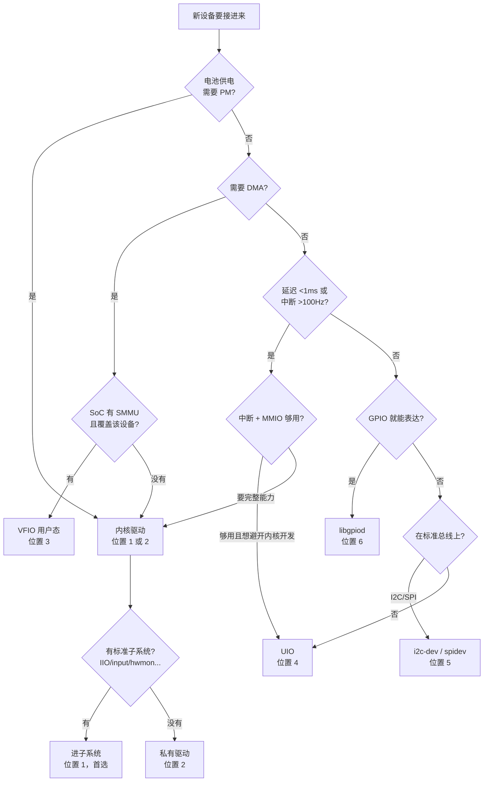

# 22.1 用户空间 vs 内核：驱动放置的量化决策

> 所属章节：第22章 驱动架构设计
>
> 难度：[E] | 预计阅读时间：50分钟

## <span class="blue"> 本节导读

11.1 你见过驱动的四种写法，包括最野的那种——`ioremap` 直接映射寄存器，不进设备模型，不配设备树，代码跑起来就算完。11.2 和 11.3 把你拉回了规则之内：总线-设备-驱动三角、probe 五阶段。D.1~D.18 又教你把每种写法写到产品级。到这里，"怎么写驱动"这本书已经讲完了。<BR>
本章讨论的是另一个问题：**驱动放在哪**。同一个触摸屏，可以写内核 input 驱动，可以用 i2c-dev 在用户空间轮询寄存器，甚至可以用 UIO 把中断导出给用户态处理。三条路都能让屏幕响应触摸——但三年后的维护成本完全不同。这个"放哪"的决策，是驱动架构的第一个决策，也是后面 22.2（错误与电源）、22.3（抽象层位置）的地基。<BR>
本节覆盖：

- 驱动放置的六个位置：从"最内核"到"最用户态"的完整光谱
- 四个硬维度：延迟、中断频率、电源管理、DMA——每条给出可测量的阈值
- 两个软维度：迭代速度与崩溃半径
- regmap 的一个架构红利：同一驱动同时支持 I2C 和 SPI 版本芯片
- 原型期用户态、产品期内核的迁移路径

---

## <span class="blue"> 放置位置的完整光谱

"用户空间还是内核"是个假二分法。真实的选择空间是从纯内核到纯用户态的六个位置，每个位置都是一组具体的能力与代价：

| # | 位置 | 形态 | 能做什么 | 不能做什么 |
|---|------|------|----------|-----------|
| 1 | 内核标准子系统驱动 | 进 IIO / input / hwmon / ALSA 等框架 | 中断、DMA、PM、统一用户态接口 | 框架不适配的私有语义 |
| 2 | 内核私有驱动 | platform 驱动 + 自建 cdev/sysfs | 同上，接口自定义 | 接口私有，生态不接 |
| 3 | VFIO | 内核把设备 MMIO/中断/DMA 安全暴露给用户态 | 中断、DMA（经 IOMMU 隔离）、用户态逻辑 | 需要 SMMU/IOMMU 硬件支持 |
| 4 | UIO | 内核导出 MMIO 和中断到用户态 | 寄存器读写、中断等待 | **没有安全的 DMA** |
| 5 | 用户态总线驱动 | i2c-dev / spidev 字符设备 | 总线读写，逻辑全在用户态 | 中断（只能轮询）、PM、DMA |
| 6 | libgpiod 用户态 | GPIO 字符设备 `/dev/gpiochipN` | GPIO 读写、边沿事件 | 一切非 GPIO 的事 |

这张表按"离硬件的远近"排序，也恰好按"能做的事情变少、出事的代价变小"排序。逐个说清边界。

**位置 1 和 2 是内核驱动**，区别只在接口是否走标准子系统。第 11 章的设备模型、D 篇的全部写法，都在这两个位置上。内核驱动的不可替代性来自四件事：中断handler 在硬中断上下文执行（真正的微秒级异步响应）；可以挂进 `dev_pm_ops` 参与系统级电源管理；可以做 DMA（`dma_alloc_coherent` 拿到的是设备和 CPU 都认的地址）；崩溃时整个内核陪葬——这是代价，也是为什么前三个能力换不来。

**位置 3 VFIO** 是"用户态驱动里的重装方案"：内核通过 IOMMU（ARM 上叫 SMMU）把设备的 DMA 范围限制在一块隔离区域，然后把 MMIO、中断、DMA 能力整体交给一个用户态进程。设备就算发疯乱写 DMA，也只能写穿自己的隔离区，伤不到内核。DPDK、SPDK 这类高性能用户态框架走的就是 vfio-pci。代价同样明确：**硬件必须有 SMMU 且固件把它接对了**——很多嵌入式 SoC 的外设不在 SMMU 后面，这条路直接不存在。内核社区对没有 IOMMU 保护的用户态 DMA 态度非常干脆：2025 年 LWN 上一场关于"给 UIO 加 DMA 地址接口"的讨论里，维护者的原话是这种设计"fundamentally broken and unsafe"，正确答案是 VFIO/IOMMUFD（6.2 合入的新用户态 IOMMU 接口），再不行就老老实实写内核驱动。

> VFIO 与 IOMMUFD：VFIO（Virtual Function I/O）是内核把设备安全透传给用户态的框架，安全来源是 IOMMU 的地址隔离。IOMMUFD 是 6.2 合入的新一代用户态 IOMMU 管理接口，正在逐步接管 VFIO 内部的 IOMMU 操作。选型时只需记住：有 SMMU → VFIO 可选；没有 → VFIO 的 no-IOMMU 模式存在但等于放弃隔离，生产环境不要用。

**位置 4 UIO** 是 VFIO 的轻装前辈：导出 MMIO 和一个"中断来了"的通知（对 `/dev/uioN` 做 `read()` 阻塞等中断），仅此而已。它适合**没有 DMA 的简单设备**——一块 FPGA 里的自定义寄存器组、一个状态采集 IP。但凡设备要 DMA，UIO 给不了安全的做法，这是它今天被边缘化的根本原因。

**位置 5 用户态总线驱动**是开发速度之王：i2c-dev 和 spidev 把总线控制器暴露成字符设备，用户态 `open` + `ioctl(I2C_RDWR)` 就能读写任意挂载设备的寄存器：

```c
/* i2c-dev：用户态读一个传感器寄存器，D.17 有完整写法 */
int fd = open("/dev/i2c-1", O_RDWR);
ioctl(fd, I2C_SLAVE, 0x48);             /* 选中器件地址 */
write(fd, &reg, 1);                     /* 写寄存器地址  */
read(fd, buf, 2);                       /* 读回两个字节  */
```

三行有效代码跑通一颗新芯片的寄存器手册——原型期没有比这更快的验证方式。但它的天花板同样硬：没有中断（数据就绪脚只能轮询 GPIO）、没有 PM（设备永远全速供电）、每次读数是两次系统调用加一次总线往返（毫秒级）。

**位置 6 libgpiod** 是 GPIO 的专用答案。旧的 sysfs GPIO 接口（`/sys/class/gpio/export`）已被内核标记废弃；现行接口是 4.8 引入的 GPIO 字符设备，libgpiod 是它的事实标准封装。注意一个时代细节：libgpiod 2.x（现行版本，2025 年 v2.2）对 API 做了**破坏性重建**——v1 的 `gpiod_line_request_input()` 风格调用被整体移除，换成基于 request 对象的新模型。网上大量教程还是 v1 写法，选型时如果你的发行版仓库给的是 2.x，照抄 v1 示例会直接编译失败。这不是细节问题，是"原型期半天跑不通"和"半天跑通"的差别。

---

## <span class="blue"> 四个硬维度：可以测量的决策依据

放置决策之所以常年吵不出结果，是因为大家用的是"感觉"而不是测量。下面四个维度每个都有可测量的阈值——先量，再选。

### 维度一：延迟

**阈值：事件响应需求 < 1ms → 必须内核。**

用户态等一个事件的典型路径：中断 → 内核调度器唤醒用户进程 → 进程从 `read()`/`poll()` 返回。这条路径的延迟是调度延迟量级，普通内核几十微秒到几百微秒，负载高时毫秒级抖动，完全不可承诺。内核中断 handler 的响应是中断控制器 + 向量跳转，微秒级且可承诺。

IO 平台场景里拿触摸屏过一遍：手指落下的中断来了，100ms 内读到坐标人才不会觉得卡——看起来用户态轮询也够？不对。触摸中断的频率是每秒 80~120 次报点，每次报点都要在下一帧之前读完，否则坐标积压、手势识别滞后。这个频率落在维度二的区间。

### 维度二：中断频率

**经验阈值：中断频率 > 100Hz → 建议内核。**

用户态处理中断（UIO 的 `read()` 通知或 gpiomon 边沿事件）每次事件的固定开销是一次上下文切换加一次系统调用，量级 10~50μs。100Hz 意味着每秒 100 次、每次最多 10ms 预算，开销占掉 1~5%，尚可接受；1000Hz 时开销占到 10~50%，而且抖动会周期性错过事件。频率再高，用户态方案已经不是"慢"，是"丢"。

### 维度三：电源管理

**规则：电池供电设备 → 驱动必须进内核。**

没有例外条款。Runtime PM 的引用计数（15.1.2）、suspend/resume 回调链（15.5）、电源域依赖（15.1.3 的 genpd）全部是内核内部机制，用户态驱动没有挂接点。你在用户态用 i2c-dev 驱动一颗传感器，这颗传感器就永远在"全速供电"状态——probe 时不会省电，系统 suspend 时没人通知它进低功耗模式。对常供电设备这是可接受的代价；对电池设备，这一条直接否决位置 4~6。

### 维度四：DMA

**规则：设备要 DMA → 内核驱动，或有 SMMU 时的 VFIO。**

DMA 的本质是设备拿着一个内存地址直接读写内存。内核驱动通过 DMA API 拿到一致性映射或流式映射（D.6），地址有效性由内核保证。用户态进程手里的地址是虚拟地址，设备不认——所以用户态 DMA 的唯一安全路径是 VFIO：SMMU 把设备看到的地址空间关进隔离区。UIO 没有这层隔离，给 UIO 设备做 DMA 等于把全内存的读写权限交给一个用户态进程。

四个维度合成一张判定表：

| 硬需求 | 可选位置 |
|--------|----------|
| 延迟 < 1ms 或中断 > 100Hz | 1~3（内核 / VFIO） |
| 电池供电需 PM | 1~2（必须内核） |
| DMA | 1~2，或 3（VFIO+SMMU） |
| 纯寄存器读写、常供电、低频 | 4~6 全部可选，按软维度定 |

---

## <span class="blue"> 两个软维度：决定上限之外的体验

硬维度筛完还剩多个选项时，软维度定胜负。

**迭代速度**。用户态驱动的开发闭环是：改代码 → gcc → 运行 → GDB 单步看寄存器值。内核驱动的闭环是：改代码 → 编模块 → 传板子 → insmod → 复现 → 出问题了翻 dmesg 里的 oops 栈。前者以分钟计，后者以十分钟计。原型期一天改二十版寄存器配置，这个差距是数量级的。

**崩溃半径**。用户态驱动空指针，最坏结果是进程段错误，systemd 拉起来重来。内核驱动空指针，最坏结果是内核 panic，整机重启——对正在写入的 Flash、正在通信的总线上的其他设备都是事故。崩溃半径还决定团队门槛：写用户态代码的工程师不需要懂并发原语和内存屏障，写内核驱动必须懂（第 13 章）。

软维度的标准用法是**分阶段**：原型期用 i2c-dev/spidev 把寄存器序列、时序参数、边界条件全部探明（用软维度的优势），冻结后翻译进内核驱动（兑现硬维度的能力）。这条迁移路径在本节末尾展开。

---

## <span class="blue"> regmap：一个容易被忽视的架构红利

讨论放置决策时有个框架值得单独提，因为它改变了一道常见选择题的答案。

芯片厂商经常给同一颗芯片出 I2C 和 SPI 两个版本（温度传感器、IO 扩展、ADC 里都很常见）。没有 regmap 时，你要为两种总线各写一套寄存器读写代码；有 regmap 时，寄存器访问逻辑只写一遍：

```c
/* D.15 有完整写法，此处只看架构含义 */
static const struct regmap_config my_regmap_cfg = {
    .reg_bits = 8,
    .val_bits = 8,
};

/* probe 里按总线类型创建 regmap，之后代码完全一样 */
if (i2c_client)
    regmap = devm_regmap_init_i2c(i2c_client, &my_regmap_cfg);
else
    regmap = devm_regmap_init_spi(spi_device, &my_regmap_cfg);

regmap_read(regmap, REG_WHO_AM_I, &id);   /* 不关心底下是 I2C 还是 SPI */
```

架构含义：**总线差异被 regmap 吸收后，"这颗芯片的 I2C 版还是 SPI 版"就不再影响驱动层架构**，同一个驱动直接服务两个 SKU。这是 22.4 讨论总线选型时的关键缓解项——I2C 和 SPI 的很多架构差异（速度、故障域）依然存在，但"换总线要重写驱动"这条代价被 regmap 抹掉了。

---

## <span class="blue"> 决策树

把四个硬维度、两个软维度合成一张走查图。用法是从顶向下走，第一个命中"必须"的分支就是答案：



注意树末端的最后一问：决定进内核之后，"进标准子系统还是自建接口"是第二个独立决策——D.18 的子系统选型速查回答"我这个外设进哪个子系统"，22.3 会讨论"子系统接口本身就是一层硬件抽象"的架构含义。

---

## <span class="blue"> 迁移路径：从用户态原型到内核驱动

放置决策不是一次性的。行业里被反复验证的两阶段路径：

**阶段一（原型期，位置 5/6）**：用 i2c-dev 或 spidev 在用户态把芯片跑起来。这个阶段的目标不是代码质量，是**知识的固定**：哪些寄存器必须按什么顺序配置、时序约束是多少微秒、上电后要不要等 reset 释放、异常读数的特征是什么。这些知识写在用户态脚本里，改一次验证一次。

**阶段二（产品化，位置 1/2）**：寄存器序列冻结后，把用户态脚本逐行翻译成内核驱动。此时逻辑已经被原型验证过，内核侧的工作集中在工程化：进设备模型（D.1）、进子系统（D.10~D.14）、接 PM（D.8）、接错误恢复（22.2）。

这条路径省时间的真正原因：内核驱动开发最贵的是"在 oops 和逻辑分析仪之间反复定位时序问题"，而这个工作在阶段一已经用 GDB 和 print 做完了。把最难调试的部分放在最好调试的位置上做——这是放置决策的全书通用原则，不只适用于驱动。

> ⚠️ 两阶段路径有一个常见的失败模式：原型期的用户态代码写得"太好"，好到舍不得重写，最后被直接固化进产品。防御办法是在阶段一就约定代码的寿命——它是探针，不是资产。寄存器序列、时序参数、错误特征才是资产，它们应该沉淀在文档里，而不是只在那个 Python 脚本里。

---

## <span class="blue"> 本节总结

驱动放置决策的答案是六个位置的光谱，不是"内核还是用户态"的二选一。四个硬维度给出可测量的否决线：延迟 <1ms 或中断 >100Hz 排除纯用户态，电池供电必须内核，DMA 必须内核或 VFIO+SMMU；两个软维度（迭代速度、崩溃半径）在硬约束内部定胜负。regmap 把"换总线重写驱动"从代价清单上抹掉，两阶段迁移路径把"最难调试的部分放在最好调试的位置"变成可执行的流程。位置定了之后，驱动内部的架构问题才登场：正常路径之外的错误路径和电源路径怎么设计——这是 22.2 的主题。

### 速查表

| 问题 | 一句话答案 |
|------|-----------|
| 驱动能放哪？ | 六个位置：子系统 / 私有内核 / VFIO / UIO / 用户态总线 / libgpiod |
| 什么时候必须内核？ | 延迟 <1ms、中断 >100Hz、电池 PM、无 SMMU 的 DMA——四条否决线 |
| VFIO 的前提？ | SoC 有 SMMU 且覆盖该设备；没有则 VFIO 无隔离价值 |
| UIO 为什么衰落？ | 给不了安全的 DMA；内核社区口径：要 DMA 用 VFIO/IOMMUFD，否则写内核驱动 |
| libgpiod 选型注意？ | 2.x API 破坏性重建，网上教程多为 v1，照抄会编译失败 |
| 原型期怎么放？ | i2c-dev/spidev 用户态探明寄存器与时序，冻结后翻译进内核 |

---

> 下一步：[22.2 驱动框架的三条路径：正常、错误、电源](22.2_驱动框架的三条路径_正常_错误_电源.md)——位置定了，接下来是驱动内部最常被欠费的两条路径。
