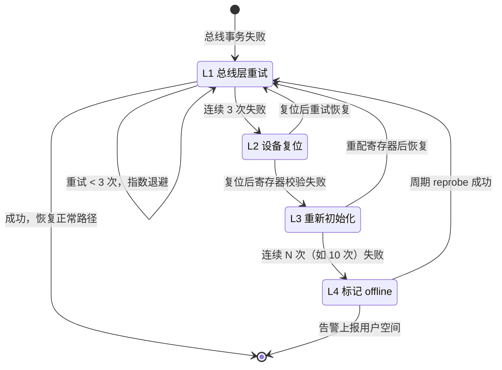
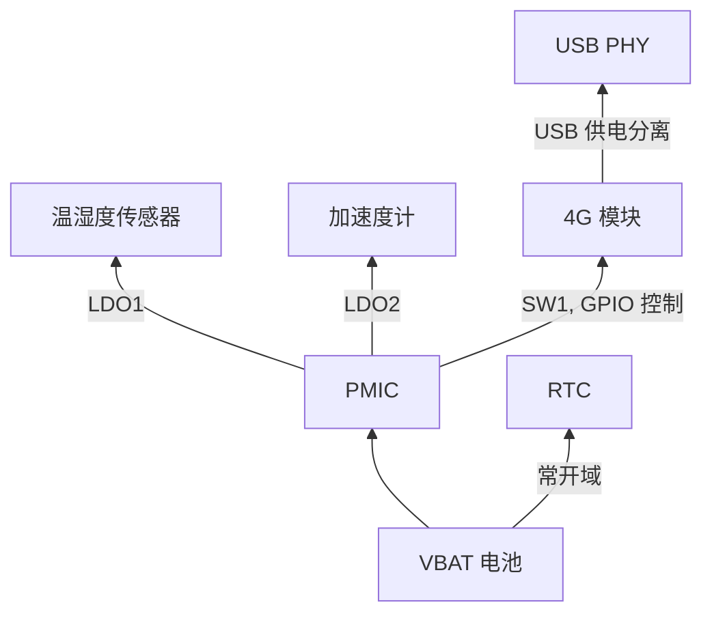

# 22.2 驱动框架的三条路径：正常、错误、电源

> 所属章节：第22章 驱动架构设计
>
> 难度：[E] | 预计阅读时间：60分钟

## <span class="blue"> 本节导读

22.1 解决了"驱动放哪"。位置定了，驱动内部的代码就有了形状——D.1~D.9 已经把这个形状讲完了：骨架、数据通道、等待与通知、中断、定时、DMA、设备树、PM、调试接口，九件兵器逐篇落地。<BR>
但那些是**单个驱动**的写法。本节讨论的是大纲给本章的核心命题："好的驱动架构不是让单个驱动更好，而是让驱动之间的关系更清晰。"驱动之间的关系在什么地方体现？不在正常路径——正常路径上各驱动老死不相往来，温度传感器读温度和 4G 模块拨号毫无交集。真正的交集在两处：**出错的时候**（一个设备的故障会沿总线和电源域传染给邻居）和**睡觉与醒来的时候**（suspend/resume 是全系统驱动的一场协同作战）。<BR>
所以本节把驱动的代码重新切成三条路径来审视：

- **正常路径**：probe、读写、中断处理——D 篇领土，本节从略，只给一条架构要求
- **错误路径**：四级恢复模型 L1~L4，以及"为什么全平台驱动必须共用同一套分级"这个契约问题
- **电源路径**：电源依赖图、唤醒源规划、suspend 竞态的三个陷阱

错误路径部分会用一个大纲案例做贯穿演练：工业网关上几十路 I2C 传感器，现场可用率从 95% 提到 99.8% 的完整设计过程。

---

## <span class="blue"> 正常路径的唯一架构要求：可被异常打断

正常路径本身没有架构决策——probe 注册、file_operations 服务、remove 释放，D 篇已经讲完。架构层面只有一条要求：**正常路径的每一行都要假设自己随时会被错误路径和电源路径打断**。

具体含义是三个纪律：

1. **任何等待都要有超时和错误出口**。`regmap_read()` 返回错误不能只 `return -EIO` 了之——这个错误码是错误路径的输入信号，语义必须准确（总线错误和设备错误要分开，22.2 的错误分级依赖这个区分）。
2. **任何资源获取都要能被 remove 回滚**。`devm_*` 系列（D.1）的价值在这里：设备掉线、probe 失败、模块卸载时，资源释放顺序由内核保证，不需要人脑维护一张释放清单。
3. **任何共享状态都要假设并发访问**（第 13 章）。错误恢复线程、PM 回调、用户态读写会同时出现，锁的设计要覆盖这三类进入者，不只是"读写互斥"。

这三条看起来是代码规范，实际是架构决策：它们决定了错误路径和电源路径**有没有干净的介入点**。正常路径写得自封闭的驱动，后面两条路径只能打补丁式外挂——这就是"驱动之间的关系"最先烂掉的地方。

---

## <span class="blue"> 错误路径：四级恢复模型

### 为什么错误处理需要分级

实验室里传感器永远在线，现场不是。电磁干扰让 I2C 出现偶发 NAK，连接器氧化让接触电阻缓慢变大，电源毛刺让芯片内部状态机跑飞。三种故障的严重程度完全不同，恢复手段也不同——如果驱动只有一种错误响应（比如出错就复位芯片），那就是用大炮打蚊子，顺便把蚊子的邻居也轰了：复位一颗芯片意味着它配置丢失、正在进行的采样作废、依赖它的上层逻辑全部中断。

分级模型的思想：**恢复手段的破坏力要和故障的严重程度匹配，从轻到重逐级升级，每级升级都有明确的触发条件**。



### L1：总线层重试

最轻的一级，处理的是**瞬时总线错误**：I2C 的 NAK、SPI 的 CRC 错、USB 的 STALL。特征是错误无记忆性——再来一次大概率就好。

```c
/* L1 重试：指数退避，注意区分错误语义 */
static int sensor_read_retry(struct regmap *map, unsigned int reg,
                             unsigned int *val)
{
    int ret, i, delay_us = 1000;

    for (i = 0; i < 3; i++) {
        ret = regmap_read(map, reg, val);
        if (!ret)
            return 0;
        if (ret != -EIO && ret != -ETIMEDOUT)
            return ret;             /* -EINVAL 之类不是总线问题，重试无意义 */
        fsleep(delay_us);
        delay_us *= 2;              /* 1ms → 2ms → 4ms，给总线恢复留时间 */
    }
    return ret;                     /* 三次都败，上交 L2 */
}
```

两个设计点：`fsleep()` 而不是 `msleep()`——纳秒/微秒级延迟应该让内核按量级自选忙等或休眠（D.5 讲过这个判定）；指数退避而不是固定间隔——固定间隔的重试会和总线上周期性干扰源共振，退避打乱这个节奏。

### L2：设备复位

L1 连续失败说明设备侧出了问题：内部状态机卡死、看门狗没喂、电源毛刺后遗症。手段是拉 reset 引脚（这就是为什么 D.7 设备树里 reset-gpios 不该省略）：

```c
static int sensor_hw_reset(struct sensor_dev *s)
{
    gpiod_set_value_cansleep(s->reset_gpio, 1);
    fsleep(1000);                   /* 复位脉宽，查芯片手册 */
    gpiod_set_value_cansleep(s->reset_gpio, 0);
    fsleep(5000);                   /* 复位释放到可通信的启动时间 */
    return 0;
}
```

L2 的破坏面：复位清空了芯片内部配置，所以 L2 之后必须接 L3 的重配，或者由芯片的上电默认值兜底。这是两级之间的隐式契约，写驱动时最容易漏。

### L3：重新初始化

复位（或检测到配置漂移）后重新执行 probe 里的寄存器配置序列。架构上的关键不是代码，是**配置序列必须是一个可以重复执行的独立函数**——probe 里"申请资源"和"配置芯片"要分开，后者单独成函数，probe 和 L3 恢复共用同一份。这是 D.1 骨架纪律在错误路径下的延伸。

### L4：标记 offline 并告警

连续失败超过阈值（经验值 10 次，或持续 1 分钟），承认这个设备暂时救不回来：标记 offline，停止正常轮询，转低频 reprobe（每分钟一次），同时把事件上报用户空间。L4 的架构意义在于**把"设备死了"变成一个系统可见的状态**，而不是让每个上层应用自己从超时里去猜——这是 22.3 硬件抽象层要承接的状态通道。

### 贯穿演练：工业网关的可用率之战

把四级模型放到大纲案例三的现场：一台工业网关挂几十路 I2C 传感器（温度/湿度/压力/气体），车间电磁干扰强、传感器线缆十几米长。症状是现场偶发读数异常，可用率 95%——听起来不低，换算一下：一台网关一天有 72 分钟处于"部分传感器不可信"状态，而报警逻辑依赖这些读数。

**约束分析**。长线缆带来两个物理层问题：总线电容超标（I2C 规范上限 400pF，长线缆轻松突破），信号边沿变缓、抗干扰能力下降；电磁干扰引入毛刺，400kHz 的时钟下毛刺宽度接近一个 bit 时间，直接污染数据。

**设计动作分两层**。物理层（治标）：I2C 时钟从 400kHz 降到 100kHz——bit 时间变长 4 倍，毛刺相对宽度缩小，采样窗口变宽；上拉电阻从 4.7kΩ 换到 2.2kΩ——增强驱动能力，把变缓的上升沿拉回来。驱动层（治本）：全部传感器驱动统一进 IIO 子系统 + regmap，错误路径按四级模型实现——L1 重试 3 次指数退避，连续 10 次失败进 L4 标记 offline 并停轮询，后台每分钟 reprobe 一次，用户空间通过 IIO event 拿到错误通知做报警降级。

**结果**：可用率 95% → 99.8%。值得注意的是收益的来源分配：物理层调整解决了"错误变少"，四级模型解决了"错误来了不死"。两者缺一不可——只调物理层，剩下的偶发故障还是会打穿没有恢复的驱动；只做恢复不改物理层，L1 重试率会高到影响有效吞吐。

> 💡 这个案例里最容易被忽视的设计决策是"全部驱动统一进 IIO + 统一四级模型"。几十路传感器如果不是同一套错误语义，上层的报警降级逻辑就要为每种驱动写一套适配——错误路径的统一性不是洁癖，是把故障处理复杂度从 O(驱动数) 降到 O(1) 的唯一办法。这就是"驱动之间的关系"在错误路径上的具体形态。

### 总线级故障：当恢复的对象不是设备而是总线

I2C 有一个设备级恢复覆盖不到的故障模式：某个设备异常拉低 SDA 不放，整条总线上所有设备一起瘫痪（22.4 会展开这个故障域问题）。这时恢复的对象是总线本身：内核 I2C 核心提供 `recover_bus` 钩子，标准做法是把 SCL 临时切换成 GPIO 模式，手动打 9 个时钟脉冲把从设备的状态机推回空闲，再切回控制器模式。设备树里声明了 `scl-gpios` 的适配器会自动获得这个能力：

```text
&i2c1 {
    pinctrl-names = "default", "gpio";
    pinctrl-0 = <&pinctrl_i2c1>;
    pinctrl-1 = <&pinctrl_i2c1_gpio>;   /* 总线恢复时切这组 */
    scl-gpios = <&gpio5 12 GPIO_ACTIVE_HIGH>;
    sda-gpios = <&gpio5 13 GPIO_ACTIVE_HIGH>;
};
```

架构层面的要求只有一条：**挂多设备的共享总线，总线恢复能力是设计项不是可选项**——它决定了"一个传感器抽风"和"全总线瘫痪"之间的区别。

---

## <span class="blue"> 热插拔：设备模型的另一面

静态设备（板载传感器）的驱动只看到设备模型的一半：启动时 probe，关机时 remove。热插拔设备（USB 的 4G 模块、可插拔扩展板）要面对另一半：**probe 和 remove 会在任意时刻成对到来，且驱动必须在两次之间保持完全一致的状态纪律**。

三个架构要点：

**probe 必须可重入**。同一个驱动可能对多个设备实例 probe 多次（两块同款扩展板），所以 probe 里禁止任何全局状态——所有状态挂在 `struct device` 的私有数据上（`dev_set_drvdata`）。这条 D.1 讲过写法，架构层面的意义是：热插拔场景天然多实例，依赖全局变量的驱动在第二块板插入时就死了。

**remove 必须能在任意业务状态下调用**。用户拔 4G 模块的那一刻，可能正有一个拨号会话在进行、正有一批数据在发送队列里。remove 的职责不是"等事情做完"，是"让进行中的事情安全地失败"：标记设备 gone → 唤醒所有阻塞的等待者让它们带错误返回 → 注销接口 → 释放资源。顺序反了（先释放资源再唤醒）就是 use-after-free。

**-EPROBE_DEFER 是依赖表达，不是错误**。probe 里拿不到资源（时钟、复位、regulator 还没就绪）时返回 `-EPROBE_DEFER`，内核会在依赖就绪后重新调你。这是设备模型给热插拔和乱序初始化的统一解法——驱动不需要知道"谁先谁后"，只需要诚实地声明"我现在缺什么"。11.2.4 的 deferred probe 讲过机制，架构层面的要求是：**probe 函数必须被写成可以被执行多次且部分执行后安全退出的形态**，这反过来约束了资源申请的顺序和粒度。

---

## <span class="blue"> 电源路径：三条最容易欠费的账

第 15 章讲了 Runtime PM 的引用计数模型、genpd 电源域、suspend/resume 的完整流程，D.8 讲了 `dev_pm_ops` 的逐行写法。本节只讨论架构层面——当一台设备上有几十个驱动都要参与电源管理时，什么决策必须在设计期做掉。

### 账一：电源依赖图必须显式画出来

设备之间的供电关系是依赖图：传感器的 LDO 由 PMIC 的某路输出供，4G 模块的电源开关挂在 PMIC 的 GPIO 上，触摸屏的复位和显示背光共用一路。suspend 时内核按依赖序挂起设备，resume 时反序恢复——顺序错了，设备在电源没恢复时就被操作，表现为"偶发 resume 失败"，现场极难排查。

依赖关系的表达机制是 regulator 框架（设备树里 `xxx-supply` 属性）和设备链接（`device_link_add()` / fw_devlink）。架构要求是设计期产出一张**电源依赖图**作为评审物：



图一画出来，两类设计错误会自己浮出来：**环**（A 依赖 B、B 又依赖 A，resume 死锁的温床）和**隐式依赖**（代码里靠 `msleep(100)` 等"对方应该上电了"——时序假设没进依赖图，换一批元器件的启动时间就翻车）。

### 账二：唤醒源规划是一张需求表

"哪些设备可以把系统从 suspend 唤醒"不是驱动细节，是产品需求：IoT 网关睡觉时，4G 来了数据要不要醒？触摸屏被摸要不要醒？RTC 闹钟到点要不要醒？每个"要"都对应一串配置（设备树 `wakeup-source`、`device_init_wakeup()`、中断的 wakeup 能力），每个"不要"都对应功耗。

架构交付物是一张唤醒源表，逐设备注明：能否唤醒、唤醒后的处理路径、误唤醒的代价。最常见的现场 bug 是"设备莫名被唤醒"——根因几乎总是某个驱动的唤醒配置是上电默认开、没人做过这张表。

### 账三：suspend 竞态的三个经典陷阱

**陷阱一：suspend 进行中，中断来了。** 系统正在进 suspend，设备中断恰好触发，handler 里 `pm_runtime_get_sync()` 试图把设备拉回 active——而 PM 核心正在把它往 suspend 里送。解法模式是 15 章讲过的 IRQF_NO_SUSPEND 语义和 suspend 前的 runtime resume 屏障，架构要求是：**中断 handler 里改变 PM 状态的驱动，必须显式处理 suspend 窗口**，不能假设"概率很小"。

**陷阱二：runtime PM 引用计数泄漏**。每次 `pm_runtime_get()` 必须配对 `pm_runtime_put()`，错误路径上漏 put 的结果是设备永远无法 runtime suspend——电流表上多出的几毫安，排查时要翻遍所有错误出口。防御是结构性的：D.8 推荐的 `pm_runtime_resume_and_get()`（失败时自动平账）+ 每个错误出口的配对审查。

**陷阱三：设备在"被使用中"被挂起**。用户空间正开着 `/dev/xxx` 读数据，runtime PM 超时到了把设备挂起，下一次 read 拿到的是挂起状态的硬件的回复——乱码或超时。正解是打开计数即 PM 引用：`open()` 里 get，`release()` 里 put，让"有用户"这件事直接顶住挂起。这也是"正常路径可被电源路径打断"纪律的具体实现。

---

## <span class="blue"> 本节总结

驱动代码重新切成三条路径后，架构决策的位置就清楚了：正常路径的唯一要求是"可被异常打断"（错误码语义准确、devm 回滚、锁覆盖三类进入者）；错误路径按破坏力分四级——L1 总线重试、L2 设备复位、L3 重新初始化、L4 标记 offline 上报——全平台共用同一套分级，故障处理复杂度才能从 O(驱动数) 降到 O(1)，工业网关案例演示了物理层调整与四级恢复叠加把可用率从 95% 推到 99.8%；热插拔要求 probe 可重入、remove 能在任意业务状态下安全失败、-EPROBE_DEFER 诚实声明依赖；电源路径的三笔账是显式的电源依赖图、需求表驱动的唤醒源规划、suspend 窗口的三个竞态陷阱。错误和电源都涉及"状态怎么让上层看见"——设备 offline、唤醒事件、降级的数据质量——这就是下一节的主题：硬件抽象层放在哪。

### 速查表

| 问题 | 一句话答案 |
|------|-----------|
| 正常路径有什么架构要求？ | 可被异常打断：错误码语义准、devm 可回滚、锁覆盖三类进入者 |
| 错误恢复怎么分级？ | L1 总线重试 → L2 硬件复位 → L3 重新初始化 → L4 offline+告警，逐级升级 |
| L2/L3 之间的隐式契约？ | 复位清空配置，L3 重配序列必须是可重入的独立函数 |
| 整条 I2C 总线瘫痪怎么救？ | 总线级恢复：SCL 切 GPIO 打 9 个时钟，设备树声明 scl-gpios 即获得 |
| 热插拔驱动三纪律？ | probe 可重入无全局态；remove 让进行中的业务安全失败；缺资源返回 -EPROBE_DEFER |
| 电源路径三笔账？ | 电源依赖图显式画出；唤醒源按需求表配置；suspend 窗口的三个竞态显式处理 |

---

> 下一步：[22.3 硬件抽象层放在哪](22.3_硬件抽象层放在哪.md)——错误状态和电源状态要透给上层，抽象的层次和位置决定了换硬件时谁不用改代码。
