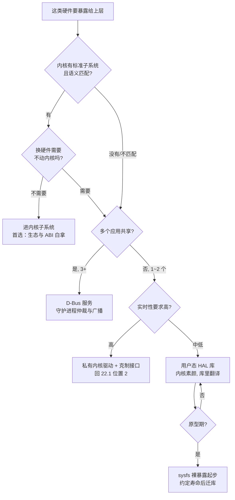

# 22.3 硬件抽象层放在哪

> 所属章节：第22章 驱动架构设计
>
> 难度：[E] | 预计阅读时间：50分钟

## <span class="blue"> 本节导读

22.2 结尾留了一个问题：驱动产生的状态——设备 offline、唤醒事件、数据质量降级——要让上层看见。往哪里透、以什么形态透，就是硬件抽象层（HAL）的位置问题。<BR>
HAL 的目标一句话：**上层软件不感知硬件变化**。换一颗温度传感器，应用层代码一行不改；换一家触摸屏供应商，手势识别不知道发生了什么。这个目标和 22.1 的放置决策是邻居但不是一回事：22.1 决定驱动代码在内核还是用户态，本节决定**驱动的接口语义在哪一层完成翻译**——把"寄存器 0x2A 的值除以 16 是摄氏度"这种硬件语义，翻译成"temperature = 23.5°C"这种业务语义。<BR>
本节覆盖：

- HAL 的四个候选位置：内核子系统、sysfs 裸暴露、用户空间 HAL 库、D-Bus 服务
- 三因素选择矩阵：硬件更换频率 × 共享应用数 × 实时性
- 演进路径：sysfs 裸暴露 → 用户态 HAL 库 → 子系统上游化
- 贯穿案例：某 IoT 平台从 1 个 SKU 到 8 个 SKU 的驱动层重构，代码重复率 60% 降到 10% 以下

---

## <span class="blue"> 四个候选位置

### 位置一：内核子系统——最标准的抽象

Linux 内核本身就内置了一批 HAL：input 子系统把所有输入设备翻译成统一的 `input_event`；IIO 子系统把所有传感器翻译成"通道 + 属性 + 缓冲"；ALSA 把所有声卡翻译成 PCM 与控制接口；hwmon 把所有电压/温度/风扇监控翻译成统一的 sysfs 布局。

从抽象层的视角看，子系统做的事是：**把"这类设备长什么样"的共识固化进内核**。应用层读一个 IIO 温度传感器：

```text
/sys/bus/iio/devices/iio:device0/
├── in_temp_raw          /* 原始 ADC 值   */
├── in_temp_scale        /* 缩放系数       */
├── in_temp_offset       /* 偏移           */
└── buffer/              /* 连续采样通道   */
```

`temp = (raw + offset) × scale`——这个公式对任何 IIO 温度传感器都成立。换了传感器型号，应用代码不知道，也不需要知道。

这个位置的优势是**生态**：进 IIO 的设备自动获得 iio-utils、libiio、各种现成监控工具的兼容；进 input 的触摸屏自动被所有 GUI 框架识别。代价是**框架的语义边界**：你的设备语义如果和框架假设不合（比如一个"传感器"实际是带私有协议的状态机），硬塞进去比自建接口更别扭。D.10~D.14 讲了怎么写进各子系统，D.18 有"什么外设进什么子系统"的速查——本节关心的是另一个问题：子系统接口作为一种 HAL，什么时候够用、什么时候不够。

### 位置二：sysfs 裸暴露——最简单，也最容易变成债

私有内核驱动直接在 sysfs 或自建 cdev 上暴露属性：

```c
/* 驱动里 */
static DEVICE_ATTR_RO(temp_raw);   /* /sys/devices/.../temp_raw */

/* 应用里 */
fd = open("/sys/devices/platform/sensor/temp_raw", O_RDONLY);
read(fd, buf, sizeof(buf));        /* 拿到一个要自己解析的字符串 */
```

这是"D.1 骨架 + 几个属性文件"的最小抽象，原型期的默认形态。它的问题不在简单，在于**语义没有翻译**：应用读到的是 raw 值，换算公式、单位、异常值特征全要应用自己知道。换一颗寄存器布局不同的传感器，每个直接访问这个节点的应用都要改。sysfs 裸暴露不是 HAL——它是"没有 HAL"，上层直接看到了硬件的素颜。

### 位置三：用户空间 HAL 库——内核素颜，用户态翻译

把翻译层从内核移到用户空间库：内核驱动只暴露原始能力（寄存器读写、数据就绪通知），一个用户态库（比如 `libsensor`）把 raw 值、校准参数、单位换算、错误码全部封装成语义化 API：

```c
/* 应用只看见语义 */
double temp;
sensor_handle_t *h = sensor_open(SENSOR_TEMP, 0);
sensor_read_celsius(h, &temp);          /* 校准、换算、错误分级都在库里 */

/* 库里 */
int sensor_read_celsius(sensor_handle_t *h, double *out)
{
    int raw, ret = hal_regmap_read(h, REG_TEMP, &raw);   /* 原始读取 */
    if (ret == HAL_ERR_OFFLINE)
        return ret;                     /* 22.2 的 L4 状态从这里透出 */
    *out = (raw - h->calib.offset) * h->calib.scale;     /* 翻译在这层 */
    return 0;
}
```

这个位置的核心优势是**内核不动**：换传感器型号只改库和配置，不需要编内核、更不需要升级整机的内核镜像——对内核升级流程沉重的行业（车载、医疗），这一条常常是决定性因素。代价是要自己维护一套接口纪律：库就是 ABI，改坏了所有应用一起遭殃，而内核子系统有整个社区替你维护 ABI 稳定。

### 位置四：D-Bus 服务——多应用共享时的形态

当一个硬件资源被**多个应用同时需要**时，库的形态开始吃力：三个应用都要 GPS 定位，难道三个应用各开一个串口？D-Bus 服务把硬件访问收敛进一个守护进程，应用通过 IPC 调用：

```text
┌─────────┐ ┌─────────┐ ┌─────────┐
│ 导航应用 │ │ 日志服务 │ │ 诊断工具 │      三个客户端
└────┬────┘ └────┬────┘ └────┬────┘
     └───────────┼───────────┘
                 │ D-Bus IPC（方法调用 + 信号广播）
          ┌──────┴──────┐
          │ gpsd 守护进程 │      独占硬件，仲裁并发
          └──────┬──────┘
            /dev/ttyS1（GPS 模块）
```

守护进程独占硬件、负责仲裁和状态广播（位置更新是一个 D-Bus 信号，订阅者都收得到）。gpsd、ModemManager（4G/5G）、NetworkManager 都是这个形态的成熟实例——这也是 IoT 平台场景里 4G 模块的标准接法：**ModemManager 已经把 QMI/MBIM 协议、SIM 卡状态、信号质量全部封装成 D-Bus API**，自己再写一层等于重造 ModemManager。

代价：引入 IPC 延迟（微秒到毫秒级，不适合高速数据流）、多一个需要守护的系统服务、调试链条变长（应用→D-Bus→守护进程→驱动，四层）。

---

## <span class="blue"> 三因素选择矩阵

四个位置没有绝对优劣，用三个因素定位：

| 因素 | 偏向内核子系统 | 偏向用户态 HAL | 偏向 D-Bus 服务 |
|------|--------------|--------------|----------------|
| **硬件更换频率** | 低（换硬件可以接受改内核） | 高（换硬件只改库） | 中 |
| **共享应用数** | 1~2 个（各自打开设备文件即可） | 1~2 个 | 3 个以上（需要仲裁与广播） |
| **实时性** | 高（中断、buffer 直通） | 中（系统调用开销） | 低（IPC 延迟） |
| **内核升级成本**（补充因素） | 高则不利 | 高则有利 | 中性 |

合成大纲的决策树：



两个补充说明。其一，**"语义匹配"是进子系统的前置判断**：温度传感器进 IIO 是匹配，把一个有私有校准流程的工业仪表硬塞进 IIO 就要仔细掂量——框架的便利和框架的束缚是同一样东西的两面。其二，树上的"sysfs 裸暴露"只出现在原型期分支——它在产品分支里不存在，这不是笔误，是本节的立场：**裸暴露是探针，不是架构**。

---

## <span class="blue"> 演进路径：三层之间不是终身制

实际产品里，抽象层位置会随产品阶段迁移，典型路径：

**阶段一：sysfs 裸暴露（原型期）**。验证硬件、跑通业务，抽象成本为零，技术债开始计息。

**阶段二：用户态 HAL 库（多 SKU 出现）**。第二个 SKU 换了传感器型号，应用层第一次被迫写 `if (hw_version == 2)`——这就是迁移信号。把分散在各应用里的硬件语义收进库，应用只调语义 API。

**阶段三：子系统上游化（产品线稳定）**。产品形态固定、准备长期维护甚至进主线时，把驱动改写进标准子系统，库退化为一层薄封装或直接退役。换来的是生态（标准工具直接可用）和内核社区维护的 ABI。

注意这条路径和 22.1 的"用户态原型→内核驱动"是**正交的两条迁移线**：22.1 迁移的是驱动代码的位置（用户态↔内核），本节迁移的是语义翻译层的位置（裸暴露→库→子系统）。两条线可以独立推进，评审时要分别问。

> ⚠️ 阶段二最常见的失败：库里不只放翻译，还长出了业务逻辑（"温度连续三次超阈值就关风扇"写进了 libsensor）。HAL 的职责是翻译硬件语义，业务策略属于应用层。界线混淆的后果是换硬件时业务和翻译缠在一起，谁也拆不动。

---

## <span class="blue"> 贯穿案例：1 个 SKU 到 8 个 SKU 的重构

大纲案例一是本节所有决策的完整走查。一家智能硬件公司，产品线从 1 个 SKU 扩到 8 个，驱动层成了最大瓶颈：每款新板卡都从旧板卡"拷贝修改"，代码重复率超过 60%，新 SKU 的驱动适配要两周。

**约束分析**。拷贝修改模式的债务结构：每颗传感器的 raw 值换算散落在应用代码各处；每块板有一份"板级支持文件"（GPIO 定义、外设清单、初始化序列全部硬编码）；换一颗传感器，要改动的地方没有人能列全。注意这些债务全部不在驱动写法层面——每个驱动单独看都"能跑"，烂的是驱动与上层、驱动与板级之间的接口。

**重构四决策**，每条都对应本节的一个位置决策：

1. **所有传感器统一进 IIO 子系统**（位置一）：换算、缩放、缓冲全部交给框架，用户空间经 iio_buffer 读数。应用代码里散落的换算公式一次性清零。
2. **人机交互设备进 input / LED 子系统**（位置一）：触摸屏、按键、指示灯各归其位，GUI 框架直接识别。
3. **板级文件拆分为设备树 + 独立驱动**（22.1 位置 2 的纪律化）：硬件差异全部移入设备树，驱动代码变成跨板卡复用的一份。"8 个 SKU 的驱动"变成"1 套驱动 + 8 份设备树"。
4. **建用户态 HAL 库 libsensor**（位置三）：应用不再直接访问 sysfs，统一调库的语义 API。库里承接 22.2 的错误分级状态（offline、降级），应用拿到的永远是"语义化的结果或语义化的错误"。

**结果**：新 SKU 驱动适配从 2 周缩到 2 天；代码重复率 60% → <10%；应用层在新板卡上零修改运行。

**教训**：2 个月的重构投入，在第四个 SKU 时收回成本——之后每个 SKU 省下的近两周都是净收益。这个回本点的位置值得记住：**HAL 重构的盈亏平衡不在第八个 SKU，在第三四个**。等到"债多到受不了"再重构，意味着已经在高利息状态下多付了好几年。

---

## <span class="blue"> 本节总结

HAL 的位置决策是"硬件语义在哪层翻译成业务语义"：内核子系统最标准（生态与 ABI 白拿，受框架语义边界约束）；sysfs 裸暴露不是 HAL 是探针，只配活在原型期；用户态 HAL 库用"内核素颜、库里翻译"换硬件不动内核的自由，代价是 ABI 纪律自己扛；D-Bus 服务是多应用共享形态，gpsd/ModemManager 是成熟参照。三因素矩阵（换硬件频率 × 共享应用数 × 实时性，外加内核升级成本）和决策树负责定位，演进三阶段（裸暴露→库→子系统上游化）负责时间轴。8 SKU 重构案证明了四决策组合的威力，也给出了回本点：第三四个 SKU。至此驱动的"对内"问题（写法、错误、电源、抽象）都已就位，下一节向外看一层：驱动下面的总线，选型时做了什么架构承诺。

### 速查表

| 问题 | 一句话答案 |
|------|-----------|
| HAL 有哪四个位置？ | 内核子系统 / sysfs 裸暴露 / 用户态 HAL 库 / D-Bus 服务 |
| 什么时候进内核子系统？ | 语义匹配框架 + 换硬件可接受改内核；生态和 ABI 是白拿的收益 |
| 什么时候用用户态库？ | 硬件迭代快、内核升级成本高；库即 ABI，纪律自己维护 |
| 什么时候上 D-Bus 服务？ | ≥3 个应用共享同一硬件，需要仲裁与状态广播（gpsd/ModemManager 形态） |
| sysfs 裸暴露的地位？ | 原型期探针，不是架构；产品分支里不存在 |
| 重构什么时候回本？ | 8 SKU 案：2 个月投入，第四个 SKU 回本 |

---

> 下一步：[22.4 总线选型与故障域的架构后果](22.4_总线选型与故障域的架构后果.md)——选 I2C 还是 SPI 不只是速率问题，是你签下的故障域和恢复义务。
