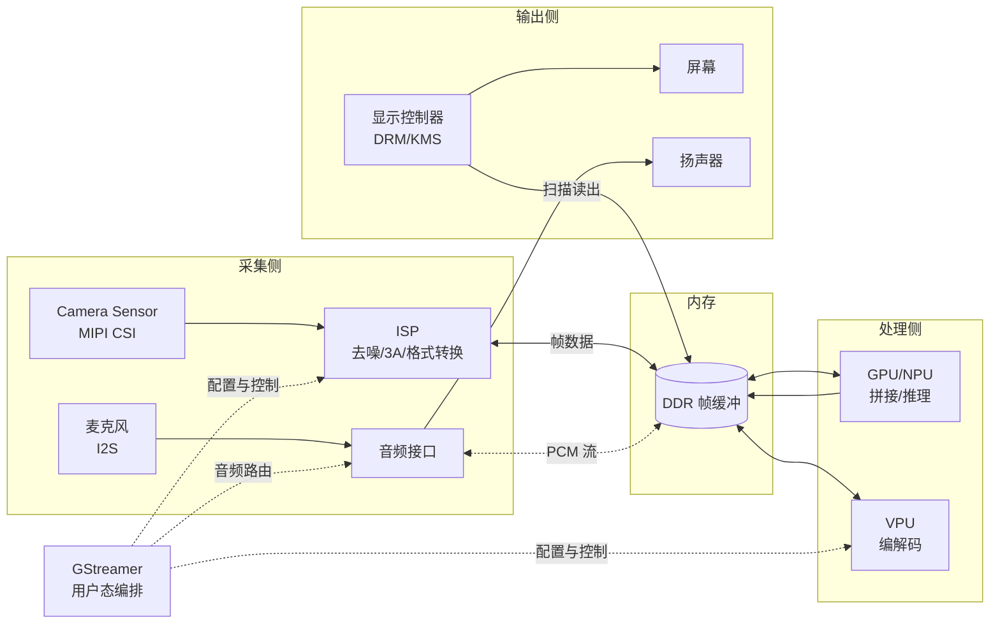

# 22.5 多媒体驱动架构：pipeline 视角

> 所属章节：第22章 驱动架构设计
>
> 难度：[E] | 预计阅读时间：60分钟

## <span class="blue"> 本节导读

22.1~22.4 讨论的设备都有一个共同点：数据量小、路径短——传感器读数几个字节，触摸屏一次报点几十字节。多媒体把这个假设彻底打破：一路 1080p60 的摄像头每秒产出约 370MB 原始数据，它要从 sensor 出发，穿过 ISP、内存、GPU、显示控制器四个子系统才能出现在屏幕上。**数据每被子系统倒手一次，就是一次内存拷贝；拷贝四次，DDR 带宽就被这条 pipeline 吃掉了 1.5GB/s**——还没算应用本身要用的。<BR>
所以多媒体驱动架构的核心问题不是"每个子系统怎么用"（那是 API 教学，本节不做），而是两个决策：**数据走哪条路**（拓扑），以及**路上拷贝几次**（零拷贝设计）。本节覆盖：

- 多媒体 pipeline 的全局形态：V4L2 / DRM-KMS / ALSA / GStreamer 各自的位置
- 摄像头栈的选型：直接用 V4L2 还是经 libcamera
- 显示栈的现代形态：DRM/KMS 四对象与 atomic commit
- 音频栈的边界：ALSA 在内核，混音与路由在用户态
- DMA-BUF 零拷贝：决策条件与带宽预算算法
- 贯穿案例：汽车智能座舱 4 路摄像头的 pipeline 设计

---

## <span class="blue"> pipeline 全局形态

先把四个框架放回它们各自的位置。多媒体系统的数据流是一张图，每个框架占图里的一段：



四个框架的分工：**V4L2** 管"帧怎么从采集硬件进内存"（以及 M2M 设备如 VPU 的内存到内存处理）；**DRM/KMS** 管"帧怎么从内存到屏幕"；**ALSA** 管"PCM 采样流怎么进出内存"；**GStreamer** 是用户态的编排框架，把上面三者包装成可插拔的元件串成 pipeline。前三者是内核子系统（驱动架构的领土），GStreamer 是用户态框架（应用架构的领土）——这条内核/用户态边界是多媒体架构里最重要的一条线，22.1 的放置逻辑在这里以更大的代价重演。

---

## <span class="blue"> 摄像头栈：V4L2 还是 libcamera

### V4L2 的直接形态

V4L2 把摄像头暴露为 `/dev/videoN` 字符设备，核心交互是一个**缓冲区队列循环**：应用把空 buffers 交给驱动（QBUF），驱动 DMA 填满后还给应用（DQBUF），应用处理完再还回去：

```c
/* V4L2 采集的最小骨架：队列循环是所有用法的不变式 */
int fd = open("/dev/video0", O_RDWR);

struct v4l2_format fmt = {
    .type = V4L2_BUF_TYPE_VIDEO_CAPTURE,
    .fmt.pix = { .width = 1920, .height = 1080,
                 .pixelformat = V4L2_PIX_FMT_NV12 },
};
ioctl(fd, VIDIOC_S_FMT, &fmt);            /* 定格式与分辨率 */

struct v4l2_requestbuffers req = {
    .count = 4,                           /* 4 个缓冲：队列深度的下限 */
    .type = V4L2_BUF_TYPE_VIDEO_CAPTURE,
    .memory = V4L2_MEMORY_MMAP,           /* 或 DMABUF，见下文零拷贝 */
};
ioctl(fd, VIDIOC_REQBUFS, &req);
/* ... mmap 每个 buffer，全部 QBUF 入队 ... */

ioctl(fd, VIDIOC_STREAMON, &req.type);    /* 开流 */
while (running) {
    struct v4l2_buffer buf = { .type = req.type, .memory = req.memory };
    ioctl(fd, VIDIOC_DQBUF, &buf);        /* 取一帧填满的 */
    process(buffers[buf.index]);          /* 用帧 */
    ioctl(fd, VIDIOC_QBUF, &buf);         /* 还回去 */
}
```

这个"申请一组 buffer、排队流转"的模型是 V4L2 的不变式，camera、capture、M2M 编解码全部同构。**队列深度（buffer 数量）本身就是架构参数**：4 个 buffer 意味着 pipeline 可以容忍 3 帧的处理抖动而不丢帧，buffer 少了抖一下就丢帧，多了平白占内存并增加延迟（帧在队列里排队）。

### 为什么需要 libcamera

直接 V4L2 在现代 SoC 摄像头面前不够用的原因：传感器只是成像链的第一环，后面的 ISP 要做去噪、锐化、色彩校正和 3A（自动曝光 AE、自动对焦 AF、自动白平衡 AWB）。3A 是闭环控制——分析统计信息、调整 sensor 曝光参数、再分析——每家的 ISP 硬件和算法完全不同。V4L2 把这个复杂度直接暴露给应用，结果每款芯片都要写一套专用的 3A 和用户态控制代码。

libcamera 是社区对这个问题的回答：一个用户态 C++ 库，内部按平台插件（pipeline handler）封装各芯片的 ISP 差异和 3A 算法，向上暴露统一的、面向"相机"而不是"视频设备"的 API。2026 年的口径：libcamera 已是树莓派等主流平台的默认摄像头栈，新项目带 ISP 的摄像头**默认评估 libcamera 优先**；直接 V4L2 仍然合理的场景是：sensor 自带 ISP（输出已处理完的图像，USB 摄像头、部分 MIPI 模组属于此类）、或 pipeline 极简无需 3A。

```text
选型口径：
sensor 带内置 ISP / 无 3A 需求  → 直接 V4L2，栈最短
SoC 内置 ISP、需要 3A           → libcamera，3A 和平台差异有人替你扛
```

---

## <span class="blue"> 显示栈：DRM/KMS 与 atomic commit

### 四对象模型

DRM/KMS 把显示硬件抽象成四个对象，任何显示控制器的驱动都按这个模型组织：

| 对象 | 硬件对应 | 职责 |
|------|----------|------|
| CRTC | 显示时序发生器 | 读帧缓冲、生成扫描时序，一个 CRTC 一路输出时序 |
| Plane | 图层 DMA | 每个 Plane 是一块可被叠加的图像源（主图层/叠加层/光标层） |
| Encoder | 输出编码器 | 把 CRTC 的时序编码成具体信号（RGB/LVDS/HDMI） |
| Connector | 物理接口 | 对应 HDMI 口、DSI 屏排线，带 EDID 探测能力 |

一条显示路径就是把四个对象串起来：Plane（拿着帧缓冲）→ CRTC（定时序）→ Encoder（编信号）→ Connector（出接口）。多图层硬件合成是这套模型免费送的能力：桌面 UI 放主 Plane，视频帧放 overlay Plane，显示控制器在扫描输出时硬件合成——**全程 GPU 不参与，零功耗合成**。能不能用上这个能力取决于应用是否把视频帧放到独立 Plane，这是架构决策，不是驱动细节。

### atomic commit：无撕裂的架构答案

旧式 KMS 接口（legacy）逐个属性设置：先设帧缓冲地址，再设显示模式，再使能——每一步独立生效，设置到一半赶上扫描输出，屏幕就显示一半旧一半新的画面（撕裂）。atomic commit 把一帧的所有变更打包成一个事务，一次性提交给内核：要么全部生效，要么全部不生效，内核保证在垂直消隐期（两帧之间的扫描间隙）完成切换：

```c
/* atomic 提交的概念骨架：一个事务打包全部变更 */
drmModeAtomicReq *req = drmModeAtomicAlloc();
add_property(req, plane_id, "FB_ID", new_fb);      /* 换帧缓冲 */
add_property(req, plane_id, "CRTC_X", x);          /* 同时挪位置 */
add_property(req, crtc_id, "MODE_ID", mode);       /* 同时换模式 */
drmModeAtomicCommit(fd, req, DRM_MODE_ATOMIC_NONBLOCK, NULL);
/* 内核在 vblank 边界整体生效，撕裂从机制上不存在 */
```

架构层面的推论：**凡是"多个显示属性需要同时变"的场景（视频窗口移动、分辨率切换、图层显隐），必须走 atomic 路径**。FBdev（`/dev/fb0`）没有这个能力也没有 Plane 概念，2026 年只存在于遗留系统——新设计选择 FBdev 没有正当理由。

---

## <span class="blue"> 音频栈：内核到 ALSA 为止

ALSA 在内核侧把音频硬件抽象为三类设备：**PCM**（采样流的采集与播放）、**Control**（音量、开关、路由）、**Mixer**（多路混合的硬件部分）。内核驱动的职责到"把 PCM 数据准时搬进搬出内存"为止。

**混音、格式转换、多应用路由不在内核**——这是 Linux 音频有意画的线：混音是策略不是机制，策略属于用户态。用户态的职责由 sound server 承担：2026 年的现状是 PipeWire 已取代 PulseAudio 成为桌面与嵌入式 GUI 产品的主流（同一套服务统一处理音频和视频流，延迟与权限模型都更好）；不带 UI 的纯嵌入式音频（对讲、提示音）用精简路线，直接 libasound 或 tinyalsa（Android 系的精简 ALSA 封装）即可，不引入服务进程。

选型口径因此很干净：

```text
带 GUI / 多应用音频 / 需要音视频同步  → PipeWire
单应用、固定音源、资源敏感           → libasound / tinyalsa 直用
```

---

## <span class="blue"> DMA-BUF：零拷贝的决策与算法

### 拷贝的账单

回到导读里那笔账：1080p NV12 一帧约 3MB，60fps 就是 186MB/s（单路）。传统路径上帧数据要经历：V4L2 驱动的 buffer → 拷贝到应用的 buffer → 拷贝给 GPU 的纹理 → 拷贝给显示的 buffer。三次拷贝 × 186MB/s ≈ 560MB/s 的纯搬运开销，四路摄像头就是 2.2GB/s——而一颗中端 SoC 的 DDR 有效带宽通常只有 6~10GB/s，还要喂 CPU、GPU、外设。**拷贝是带宽预算里最大的浪费项，而且是纯浪费：搬运本身不创造任何价值**。

### DMA-BUF 的机制

DMA-BUF 的思想：**让 buffer 留在原地，传递的是句柄**。内核把一块可 DMA 的内存封装成一个文件描述符（fd），fd 可以跨进程、跨子系统传递——V4L2 驱动把帧填进 DMA-BUF，应用拿到的不是数据而是一个 fd，把这个 fd 交给 GPU（作为纹理导入）、交给显示（作为 Plane 的 FB），三个子系统读写的是同一块物理内存，全程零拷贝：

```c
/* V4L2 侧：以 DMA-BUF 方式导出帧缓冲 */
struct v4l2_requestbuffers req = {
    .count = 4,
    .type = V4L2_BUF_TYPE_VIDEO_CAPTURE,
    .memory = V4L2_MEMORY_DMABUF,         /* 关键：memory 类型即 DMABUF */
};

/* 拿到 buffer 的 fd（VIDIOC_EXPBUF），直接传给消费方 */
struct v4l2_exportbuffer exp = { .type = req.type, .index = i };
ioctl(video_fd, VIDIOC_EXPBUF, &exp);
int dmabuf_fd = exp.fd;                   /* 这个 fd 就是"这块内存" */

/* GPU/显示侧把这个 fd 导入为自己的纹理或 framebuffer——零拷贝 */
```

GStreamer 把这套机制封装在元件协商里：pipeline 里相邻元件都支持 DMA-BUF 时，帧以 fd 形式流转，应用一行拷贝代码不写。所以架构决策简化为一句：**pipeline 设计评审时逐段问"这一段是 fd 传递还是内存拷贝"，任何一段答"拷贝"都要给出理由**（合理的理由存在：中间要 CPU 处理像素时，拷贝进 CPU 可见内存是必要代价）。

### 带宽预算算法

多媒体架构的定量交付物是一张带宽预算表，算法：

```text
每路视频带宽 = 宽 × 高 × 每像素字节 × 帧率 × (1 + 读回系数)
```

NV12 每像素 1.5 字节；"读回系数"处理显示扫描这类"写完还要读出来"的环节（显示控制器读帧缓冲是一次额外读）。把所有流加起来，对照 SoC 数据手册的 DDR 有效带宽（标称带宽 × 60~70% 是经验可用值），**占用超过 70% 就要砍**——砍法按优先级：降分辨率（ISP 在采集端缩放，源头减量）→ 降帧率 → 砍拷贝（上 DMA-BUF）→ 最后才是换更大带宽的芯片。

---

## <span class="blue"> 贯穿案例：汽车座舱的 4 路摄像头

大纲案例二把本节所有决策走一遍。某 Tier 1 的智能座舱：4 路 1080p 环视摄像头、1 路主显示屏、音频输入输出。

**约束**。4 路 1080p60 原始需求 ≈ 4 × 186MB/s ≈ 745MB/s，加上拼接、显示、应用的读写，总需求逼近 4Gbps（含各环节的读写放大）。目标 SoC 的 DDR 有效带宽实测约 8GB/s——看似够，但带宽占用近半意味着 CPU 上的应用（导航、语音识别）会在摄像头全开时明显变卡，车规对交互响应有硬性要求。

**决策链**：

1. **源头减量**：用 SoC 内置 ISP 在采集端把 4 路 1080p 缩放到 720p——环视拼接的显示分辨率本来就只有 720p 量级，1080p 的细节在最终画面上不可见。带宽需求直接减半（约 2Gbps）。这是"带宽砍法优先级"的第一条：源头降分辨率永远优于后级补措施。
2. **零拷贝路径**：V4L2 捕获 → DMA-BUF → GPU（OpenCL 拼接）→ DMA-BUF → DRM/KMS overlay Plane 显示，关键路径零拷贝；GStreamer 做 pipeline 编排，但拼接这段关键路径用自研代码直接操作 fd——框架编排与非关键路径用框架，**带宽关键路径上逐段控制**。
3. **显示用硬件合成**：拼接结果放 overlay Plane，UI 放主 Plane，显示控制器硬件合成，GPU 不参与合成——省下的 GPU 算力留给 HMI 渲染。
4. **PM 联动**：屏幕关闭（息屏）时 camera 停止捕获、GPU 降频、音频静音，系统从 5W 降到 0.5W。这条回到 22.2 的电源路径：多媒体 pipeline 的每个环节都是 PM 的挂接点，pipeline 图本身就是电源依赖图的一部分。

**教训**：多媒体架构的性能问题几乎不在"某个驱动写得慢"，而在**数据路径设计**——路径上多一次拷贝、源头多一倍分辨率，都是驱动层再优化也追不回的浪费。先画 pipeline 图、算带宽预算、标零拷贝段，再谈实现。

---

## <span class="blue"> 本节总结

多媒体是驱动架构的极限场景：数据量大到每一次拷贝都是带宽税。四个框架各就各位——V4L2 管采集与 M2M（buffer 队列循环是不变式，队列深度是架构参数），libcamera 为带 ISP 的摄像头扛下 3A 与平台差异（2026 年默认优先评估），DRM/KMS 用四对象加 atomic commit 给出无撕裂的现代显示（FBdev 没有存在理由），ALSA 到 PCM 为止、混音路由在用户态（GUI 产品 PipeWire，精简产品 libasound/tinyalsa）。DMA-BUF 把"传数据"变成"传句柄"，评审方法是逐段质问"这段是 fd 还是拷贝"；带宽预算表（每路 宽×高×字节×帧率×读回系数，总量 ≤ DDR 有效带宽 70%）是定量交付物。座舱案例证明了决策顺序：源头减量 > 零拷贝 > 硬件合成 > PM 联动。至此本章五个决策域全部就绪，下一节把它们合流：IoT 平台的五类外设逐个过堂，20 项评审清单收口全章。

### 速查表

| 问题 | 一句话答案 |
|------|-----------|
| 多媒体架构的两个核心决策？ | 数据走哪条路（拓扑）+ 路上拷贝几次（零拷贝） |
| V4L2 的不变式？ | REQBUFS/QBUF/DQBUF 队列循环；buffer 数量=抖动容忍度 |
| 什么时候用 libcamera？ | SoC 内置 ISP、需要 3A；sensor 自带 ISP 则直接 V4L2 |
| 无撕裂显示的机制？ | DRM/KMS atomic commit：一帧的全部变更打包，vblank 边界整体生效 |
| 音频的用户态边界？ | 内核到 PCM 为止；GUI 产品 PipeWire，精简产品 libasound/tinyalsa |
| 零拷贝怎么实现？ | DMA-BUF：buffer 不动，fd 跨子系统传递；评审逐段质问"fd 还是拷贝" |
| 带宽不够先砍什么？ | 源头降分辨率 > 降帧率 > 砍拷贝 > 换芯片 |

---

> 下一步：[22.6 综合实战：IoT 平台驱动架构全流程](22.6_综合实战_IoT平台驱动架构全流程.md)——五类外设逐个过决策树，三案例复盘，20 项评审清单收口。
