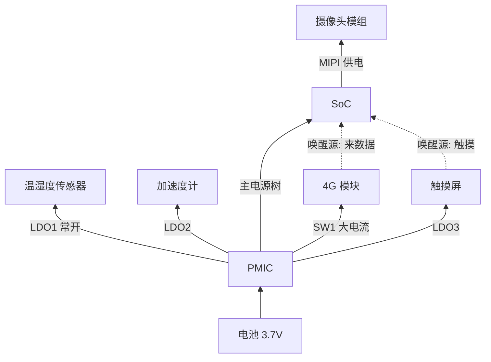

# 22.6 综合实战：IoT 平台驱动架构全流程

> 所属章节：第22章 驱动架构设计
>
> 难度：[E] | 预计阅读时间：70分钟

##  本节导读

22.1~22.5 各自闭环了一个决策域：放置、三条路径、抽象层、总线、多媒体。但每个结论都是在"其他域待定"的假设下做出的——22.1 给触摸屏判了"进 input 子系统"，没考虑它和传感器挤同一条 I2C 总线的故障域；22.2 的四级错误模型是单驱动视角，没面对全平台几十个驱动时的统一契约；22.3 的 HAL 位置是在不知道电源依赖图长什么样的前提下选的。 
本节回到大纲的决策场景，把所有假设撤掉，当面走查：

> 你在设计一个 IoT 硬件平台的驱动框架。平台计划支持 5 年，预计 3 代硬件演进。当前一代外设：温湿度传感器（I2C）、加速度计（SPI）、4G 模块（USB）、触摸屏（I2C+IRQ）、摄像头（MIPI CSI）。要求：每代硬件可能更换传感器型号（保持接口兼容）；4G 模块支持热插拔；所有外设集成电源管理（电池供电）；错误能被上层感知和处理。

走查分五步：五类外设逐个过 22.1 的决策树 → 错误与电源的全平台契约 → HAL 位置裁决 → 总线布局 → 多媒体路径。然后做一次时间轴演练：第 2 代、第 3 代硬件到来时，这套架构各要付出什么代价——这是检验"硬件变更时影响范围最小"的唯一方法。最后三案例复盘与 20 项评审清单收口全章。

---

##  走查一：五类外设过决策树

逐个过 22.1 的决策树，每个外设的走查路径显式记录——架构评审时，别人挑战的不是结论，是走查路径：

| 外设 | 走查路径（沿 22.1 决策树） | 裁决 |
|------|---------------------------|------|
| 温湿度传感器 | 电池供电→必须内核 PM → 内核驱动 → IIO 语义匹配 → 进子系统 | **IIO 子系统驱动**，regmap 抽象寄存器（预留 I2C/SPI 双版本能力） |
| 加速度计 | 电池→内核 → 采样率高（ODR 数百 Hz）+ FIFO 数据量大 → IIO buffer 通道 | **IIO 子系统驱动**，SPI 接口，走 buffer + trigger 模式 |
| 4G 模块 | USB 自描述设备 → 标准设备类 + QMI/MBIM → 内核侧 usb-serial/wwan 现成 → 控制面用户态 | **内核现成驱动 + ModemManager**（D-Bus 服务，多应用共享） |
| 触摸屏 | 中断 80~120Hz 报点 + 电池 PM → 内核 → input 语义完全匹配 | **input 子系统驱动**，中断脚经 GPIO 接 IRQ |
| 摄像头 | MIPI CSI + SoC 内置 ISP → 需要 3A → libcamera 口径 | **V4L2 内核驱动 + libcamera 用户态栈** |

这张表里最值得停留的一行是 4G 模块：**它的"驱动架构决策"结论是没有驱动要写**。usb-serial、qmi_wwan 都在主线里，ModemManager 把拨号、短信、信号质量封装成 D-Bus API。驱动架构师的一个重要职责是认出"这里不需要新代码"——每一行不写的代码都是零维护成本。其余四行各对应 D 篇的一条写法路径（IIO 见 D.11，input 见 D.10），机制在 10/11 章，本节不再展开。

注意裁决表的共同形状：**五类外设，四类进标准子系统或现成栈，零类自建私有接口**。这不是巧合，是 22.3"进子系统"决策与 22.4"映射到成熟模型"命题的合力——当你每次都先问"有没有标准位置"，私有接口就只剩真正语义不匹配的边缘案例。

---

##  走查二：错误与电源的全平台契约

### 错误分级：一套模型，全部驱动

22.2 的四级模型在本平台落成一条**全平台契约**：所有自研驱动（温湿度、加速度计、触摸屏）共用同一套 L1~L4 语义——L1 总线重试（3 次指数退避）、L2 硬件复位（reset-gpios 必选）、L3 重新初始化（配置序列独立成函数）、L4 offline + 事件上报。

契约的载体是 22.3 的 HAL 库：四级状态统一翻译成库的错误码族（`HAL_ERR_RETRY / HAL_ERR_RESET / HAL_ERR_OFFLINE`），应用面对的不是三种驱动的三套错误，是一套错误码。4G 模块的错误语义由 ModemManager 的信号（信号丢失、SIM 状态）承担，运维平台只需订阅两处的状态流——这就是 22.2 那句"故障处理复杂度从 O(驱动数) 降到 O(1)"在平台级的兑现。

### 电源依赖图

电池供电平台，电源依赖图是评审必交物：

图上两个关键决策：

1. **加速度计独立 LDO 而不是和温湿度共用**：加速度计支持运动唤醒（设备睡着、人拿起设备时唤醒系统），需要独立可控的供电域；共用 LDO 意味着"加速度计值班时温湿度也睡不着"。传感器越多，这条越重要——**供电域划分是按"唤醒/休眠组合"聚类的，不是按物理位置聚类的**。
2. **唤醒源只有 4G 和触摸两个**：温湿度、加速度计的常规采样不唤醒系统（数据攒到唤醒后批量读），这是功耗预算的直接决定项。唤醒源表经产品确认后冻结，驱动照表配置 `wakeup-source`——没有表的默认结果是"所有中断都能唤醒"，待机电流下不来。

---

##  走查三：HAL 位置裁决

按 22.3 的决策树逐个裁决：

| 外设类 | 决策树路径 | HAL 裁决 |
|--------|-----------|----------|
| 传感器（温湿度/加速度计） | 有 IIO 子系统、换型号要不动应用 → 进子系统 + 库 | 内核 IIO（语义骨架）+ **libplatform 库**（校准、单位、错误码翻译） |
| 触摸屏 | input 子系统语义完全匹配 | 纯内核子系统，**不加库**——GUI 框架直接吃 input 事件 |
| 4G | 多应用共享（数据业务、运维诊断、OTA 都要用） | **ModemManager D-Bus 服务** |
| 摄像头 | 视频流给单一应用（预览/对讲） | libcamera 即 HAL，不再叠加自有层 |

两个细节裁决值得记录。其一，触摸屏"不加库"是有意识否决：input 事件已经是完备语义（坐标、压力、时间戳），再包一层库只是在延迟上花钱。HAL 的正确数量不是"每个设备一层"，是"语义缺口在哪层补哪层"。其二，libplatform 库的范围被红线限定：**只做翻译（校准、换算、错误分级），不装业务策略**（"连续超温关 4G"这类逻辑属于应用层）——22.3 标记过的阶段二失败模式，在评审时靠这条红线挡。

---

##  走查四：总线布局

传感器和触摸屏都在 I2C 上，直觉是把它们挂同一条总线省引脚。过一遍 22.4 的合同条款再决定：

- **故障域分析**：触摸屏是交互命脉，中断密集、对响应敏感；传感器是低频轮询。挂同一总线时，任一颗传感器抽风拉死 SDA，触摸屏跟着死——**用户看到的是"屏幕不灵"，根因是一颗两块钱的湿度传感器**。这个故障传播路径不可接受。
- **裁决**：触摸屏独占一条 I2C 控制器（I2C1），传感器挂另一条（I2C2）；I2C2 声明 `scl-gpios`/`sda-gpios` 获得总线恢复能力（多设备共享，22.2 的总线级恢复是必选项）。SoC 引脚多花两根，买到的是交互命脉与传感器故障域的隔离。
- 加速度计的 SPI：板内短距、单设备、硬件 CS，无拓扑决策要做，设备树静态描述即可。
- 摄像头 MIPI CSI：板内高速差分，走线约束是 PCB 设计事项，驱动侧无决策。

总线布局的最终形态：**按故障域和响应等级分总线，而不是按"都是 I2C"合并**。这个原则和大纲评审清单的"硬件差异通过设备树表达"是同一件事的两面——拓扑在硬件层隔离风险，设备树在软件层表达差异。

---

##  走查五：多媒体路径

本平台的摄像头需求是视频对讲和拍照：单路 1080p30，无多屏无拼接。按 22.5 的预算算法：1080p NV12 一帧 3MB × 30fps ≈ 93MB/s，加显示读出与应用读回，总需求约 300MB/s——对平台 SoC 的 DDR 带宽占用不到 10%，**带宽不构成约束，零拷贝在这里是可选项而非必选项**。

裁决：路径从简——libcamera 出帧，应用直显走 DRM/KMS 主 Plane；DMA-BUF 预留（REQBUFS 用 `V4L2_MEMORY_DMABUF` 的改造成本已经被 22.5 的代码形态锁定，将来加 AI 检测等重负载时再启用）。**这个"不上零拷贝"的裁决和"上零拷贝"同样重要**：预算表证明它不疼，架构就不为虚荣付复杂度。22.5 的座舱案例反过来演示了带宽吃紧时这套方法论的完整形态。

---

##  时间轴演练：三代硬件到来时

架构的考题不在设计当天，在第 2 代和第 3 代硬件到来的那天。把两道题当面做一遍：

**第 2 代：温湿度传感器换型号（同 I2C 接口）**。影响清单：新型号的 IIO 驱动（若主线已有则零代码；自研则 2~3 天）、设备树改 compatible 和地址、libplatform 库加一组校准参数。应用层：零改动（IIO 语义 + 库翻译双层吸收）。电源依赖图：不变（同 LDO 域）。**第 2 代改动收敛在驱动层以内，这就是"硬件变更影响范围最小"的验收标准。**

**第 3 代：换 SoC 平台（ARM 芯片供应商更换）**。影响清单：BSP 层全部重来（设备树、时钟、pinctrl——第 11 章和 18 章的 Layer 纪律在这里承接）；自研驱动全部不动（platform 驱动不依赖具体 SoC）；HAL 库不动；ModemManager/input/IIO 生态不动。真正贵的部分是 BSP 和验证，不是驱动——前提是驱动与板级代码严格分离（评审清单第 4 项）。如果当年有人把板级 GPIO 定义硬编码进驱动，第 3 代的代价就要把驱动层也拖下水。

两道题的共同结论：**本架构把"换"的代价分别锁进三个独立舱室——换传感器只进驱动舱，换板卡只进设备树舱，换 SoC 只进 BSP 舱**。舱室之间的密封条就是前面五节讨论的每一层抽象。

---

##  三案例复盘

本章三个大纲案例已在对应章节就地展开（22.2 工业传感器、22.3 八 SKU 重构、22.5 座舱 pipeline），此处复盘重读它们的公共结构：

| 案例 | 约束（不可控） | 选择（结构性） | 代价（量化接受） | 教训 |
|------|--------------|--------------|----------------|------|
| 工业网关传感器（22.2） | 现场 EMI、长线缆 | 物理层调整 + 全驱动统一四级错误模型 | I2C 降速 4 倍的吞吐损失；重试/复位的固有时间 | 可用率是设计出来的：物理层治"错误变少"，恢复模型治"错误不死" |
| 八 SKU 平台重构（22.3） | 拷贝修改债已累积 60% 重复率 | 子系统归一 + DT/板级分离 + libsensor 库 | 2 人月重构，期间新品节奏放缓 | 回本点在第三四个 SKU；晚重构一年，多付一年利息 |
| 座舱多媒体（22.5） | 4 路 1080p × DDR 带宽上限 | 源头降分辨率 + DMA-BUF 零拷贝 + 硬件合成 | 720p 环视的显示精度上限；自研拼接段的维护 | 性能问题在数据路径设计，不在驱动快慢 |

三案合一：**约束不可控，解法是结构性的，代价被量化接受**——与 17/18 章案例复盘同一骨架，这不是修辞重复，是第三部决策方法论在不同领域的三次独立验证。

---

##  驱动架构评审清单

20 项，分四组对应 22.1/22.2/22.3/22.4-22.5 四个决策域。每项都要证据，不接受口头回答。三个里程碑：**S** = 架构评审（驱动框架设计定稿），**R** = 首版发布评审，**Y** = 年度复审。

### 第一组：驱动放置与抽象（对应 22.1 / 22.3）

| # | 检查项 | 要看的证据 | 里程碑 |
|---|--------|-----------|--------|
| 1 | 每个外设有书面的放置裁决（内核/用户态/子系统），走查路径可追溯 | 放置裁决表（22.6 走查一格式），含决策树路径 | S |
| 2 | 硬件差异通过设备树表达，驱动代码无板级硬编码 | grep 驱动源码无 GPIO 编号/地址硬编码；差异点逐条能指到 DT 属性 | S, R |
| 3 | 同类设备使用统一子系统接口，无私有接口重复造轮子 | 子系统归置清单；每个私有接口附"为什么不进子系统"的理由书 | S |
| 4 | 驱动与板级代码分离，驱动可复用于不同板卡 | 同一份驱动在两个板卡 DT 下 probe 成功的记录 | R |
| 5 | HAL 位置有书面裁决，库的边界红线（只翻译不含业务）成文 | HAL 裁决表 + 库的 API 评审记录 | S, Y |

### 第二组：错误恢复与热插拔（对应 22.2）

| # | 检查项 | 要看的证据 | 里程碑 |
|---|--------|-----------|--------|
| 6 | 错误分级策略全平台统一（如 L1~L4），各驱动语义一致 | 错误码族定义文档 + 各驱动实现对照 | S |
| 7 | 总线错误有重试与恢复机制；共享总线具备总线级恢复 | 重试代码审查 + `scl-gpios` 声明 / 恢复测试记录 | R |
| 8 | 设备掉线可检测，重连后自动恢复（L4 与 reprobe） | 拔插/断电故障注入测试报告 | R |
| 9 | 看门狗集成：驱动卡死能被系统层发现并复位 | 看门狗配置 + 故意挂死驱动的演练记录（系统级看门狗见第 30 章） | R |
| 10 | 错误状态上层可感知：分级日志 + 健康状态查询通道 | 应用能拿到 offline/降级状态的接口演示 | R, Y |

### 第三组：电源管理（对应 22.2 / 第 15 章）

| # | 检查项 | 要看的证据 | 里程碑 |
|---|--------|-----------|--------|
| 11 | 所有自研驱动实现 dev_pm_ops，runtime PM 引用配对可审计 | 驱动清单逐个勾验；`pm_runtime_resume_and_get` 使用审查 | S, R |
| 12 | 电源依赖图成文，无环、无 msleep 隐式依赖 | 依赖图评审记录；grep 驱动中的裸 `msleep` 逐个有理由 | S |
| 13 | 唤醒源表经产品确认并冻结，驱动照表配置 | 唤醒源表 + 设备树 `wakeup-source` 对照 | S |
| 14 | 各电源状态电流实测（运行/待机/suspend），与预算对账 | 功耗测试报告，超标项有归因 | R, Y |
| 15 | suspend/resume 压测通过（含进行中业务的压力场景） | ≥1000 次 suspend/resume 循环 + 业务并发注入记录 | R |

### 第四组：总线与多媒体（对应 22.4 / 22.5，按需适用）

| # | 检查项 | 要看的证据 | 里程碑 |
|---|--------|-----------|--------|
| 16 | 每条总线的故障域有书面分析，隔离措施落地（分段/独占/CS 拓扑） | 总线布局图 + 故障域分析文档 | S |
| 17 | I2C 地址分配表成文；SPI 设备树静态契约经核对 | 地址表；DT 与原理图交叉核对记录 | R |
| 18 | 多媒体数据流路径图成文（采集到显示的完整 pipeline） | pipeline 图，各环节归属子系统标注 | S |
| 19 | 零拷贝逐段评估：每段标注 fd 传递或拷贝，拷贝段有理由书 | DMA-BUF 评估表（22.5 评审法） | S |
| 20 | 带宽与延迟预算分配到环节，总量 ≤ DDR 有效带宽 70%；帧同步方案明确 | 带宽预算表 + 实测对账 | R |

清单用法与 17.6/18.6 一致：评审不是打勾，是看证据。第 15 项（suspend 压测）和第 20 项（带宽实测）是两张清单里最贵也最诚实的——它们直接检验前面所有纸面决策有没有兑现到硬件行为上。

---

##  本节总结

本节把五个决策域合流：五类外设逐个过决策树，裁决表呈现"四类进标准栈、零类私有接口"的共同形状；错误分级固化为全平台契约并经 HAL 库统一透出，电源依赖图按"唤醒/休眠组合"划分供电域、唤醒源表冻结；HAL 按语义缺口逐类裁决（触摸屏不加库是有意识否决）；总线按故障域而非"都是 I2C"布局，触摸屏独占一条控制器；摄像头经预算表证明带宽不疼后从简，零拷贝保留为预留位。时间轴演练给出验收标准：第 2 代换传感器收敛在驱动舱内、第 3 代换 SoC 收敛在 BSP 舱内——抽象的每一层都是舱室的密封条。三案例复盘与 20 项评审清单收口。至此第 22 章闭环，也替第三部的驱动部分回答了总问题：好的驱动架构不是让单个驱动更好，而是让驱动之间的关系——错误的语义、电源的依赖、抽象的层次、总线的故障域——清晰到可以被评审。

### 速查表

| 问题 | 一句话答案 |
|------|-----------|
| 五类外设怎么放？ | 传感器 IIO+库 / 加速度计 IIO buffer / 4G ModemManager / 触摸屏纯 input / 摄像头 libcamera |
| 驱动架构师的重要职责？ | 认出"这里不需要新代码"（4G 模块零自研驱动） |
| 供电域怎么划？ | 按唤醒/休眠组合聚类，不按物理位置 |
| 触摸屏和传感器同总线吗？ | 不。按故障域和响应等级分总线，交互命脉独占控制器 |
| 零拷贝上不上？ | 预算表说了算：带宽占用 <70% 则不上，复杂度不为虚荣付 |
| 架构怎么验收？ | 时间轴演练：换传感器收敛在驱动舱、换板卡在 DT 舱、换 SoC 在 BSP 舱 |

---

> 下一步：[第23章 系统调试方法论](../../04-系统思维与全链路实战/第23章%20系统调试方法论/README.md)——架构设计得再好，现场问题还是会来；第四部从"怎么选"转向"怎么拆"。
