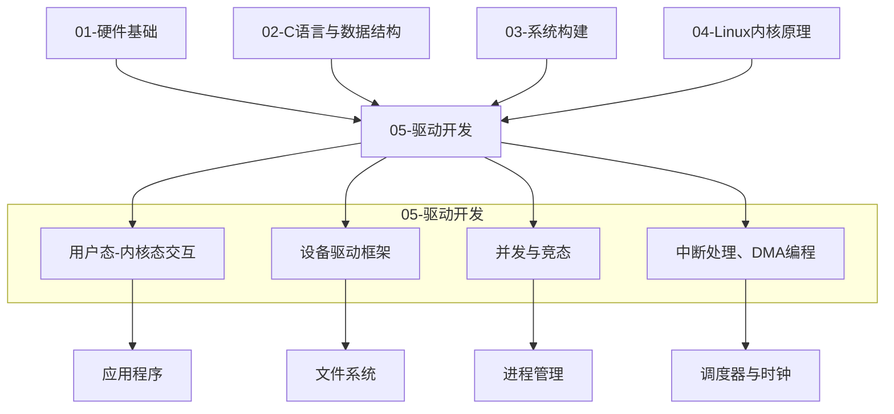

# 05-驱动开发

> BIEM定位：[B→E] 从"能看懂驱动代码"到"能独立实现并调试三类驱动（字符/块/网络）" 
> 本模块核心价值：提供嵌入式Linux驱动开发的完整知识图谱——从用户态接口、设备驱动框架到并发控制、中断与DMA，覆盖驱动开发的全生命周期 
> 前置约定：本章假设读者已完成01-04模块（硬件基础、C语言、系统构建、内核原理），具备设备树编译、内核配置、交叉编译等基本能力

---

## <strong>模块概述</strong>

定义：驱动开发是嵌入式Linux系统中连接硬件外设与操作系统内核的核心工程活动。驱动程序运行在内核空间，负责将标准化的内核I/O请求翻译成硬件控制器可执行的寄存器操作序列，同时将硬件状态和数据通过标准化接口暴露给用户态程序。 

嵌入式特殊性：与桌面/服务器不同，嵌入式驱动面对的是高度多样化的SoC和外设——同一款传感器在不同开发板上可能使用不同的I2C总线、中断引脚和GPIO控制线。因此，嵌入式驱动开发不仅要求掌握内核框架，还必须深入理解硬件手册、设备树和板级支持包（BSP）。 

全景覆盖：本模块包含四大子模块：用户态-内核态接口（驱动的对外窗口）、设备驱动框架（字符/块/网络三类驱动的实现）、并发与竞态（多执行流环境下的同步安全）、中断处理与DMA编程（高效事件响应与数据传输）。完成本模块学习，意味着具备了嵌入式Linux驱动开发的核心竞争力。 

---

## <strong>BIEM分层导航</strong>

| 层级 | 能力定位 | 核心任务 | 对应子模块 |
|------|----------|----------|------------|
| [B] | 能看懂驱动代码 | 理解接口调用方式、驱动加载流程、基本数据结构 | 用户态接口基础、驱动框架概览 |
| [I] | 能修改驱动代码 | 能根据硬件差异修改现有驱动，适配新板子 | 字符/块/网络驱动实现、设备树绑定 |
| [E] | 能独立开发驱动 | 从零开始实现一个新设备的完整驱动 | 并发控制、中断DMA、性能优化、调试技巧 |

---

## <strong>子模块列表与难度标记</strong>

### 用户态-内核态交互 [B→M]

> 驱动的对外服务窗口：学习如何让应用程序安全、高效地调用驱动功能

| 文件 | 难度 | 核心内容 |
|------|------|----------|
| 15-01-接口基础认知.md | [B] | 四种标准接口类型概览与选型 |
| 15-02-主流接口技术详解.md | [B→I] | 系统调用注册、SYSCALL_DEFINE、参数传递、兼容性 |
| 15-03-字符设备文件接口.md | [B→I] | /dev设备节点、file_operations实现 |
| 15-04-ioctl接口.md | [I] | 控制指令设计与实现 |
| 15-05-sysfs接口.md | [B→I] | /sys属性文件、设备状态暴露 |
| 15-06-mmap内存映射接口.md | [I→E] | 零拷贝内存映射实现 |
| 15-07-嵌入式专属实战场景.md | [I→E] | 多接口组合实战案例 |
| 15-08-4 高级机制与优化.md | [E] | 批处理、内存池、性能基准 |
| 15-09-接口安全加固.md | [E] | 权限校验、防攻击设计 |
| 15-10-接口性能优化.md | [E→M] | 瓶颈分析与调优 |
| 15-11-自定义接口设计.md | [E→M] | 协议规范设计 |
| 15-12-历史演进与未来展望.md | [M] | 技术趋势与演进 |

### 设备驱动框架（字符·块·网络） [B→E]

> 三类标准驱动的实现：掌握Linux内核的设备抽象模型

| 文件 | 难度 | 核心内容 |
|------|------|----------|
| 16-01-1 设备驱动框架总览.md | [B→I] | 字符/块/网络设备差异、内核设备模型 |
| 16-02-入门实战：GPIO-LED字符驱动开发.md | [B→I] | 从零编写字符驱动并insmod验证 |
| 16-03-进阶适配：设备树与Platform框架绑定.md | [I] | 设备树节点匹配、Platform驱动注册 |
| 16-04-高级优化与特殊场景.md | [I→E] | 电源管理、热插拔、调试技巧 |
| 16-05-3 块设备驱动框架.md | [I→E] | 请求队列、gendisk、分区表、eMMC驱动 |
| 16-06-基础认知.md | [B] | 块设备基础概念 |
| 16-07-核心原理与数据结构.md | [I] | bio/request/block_device_operations |
| 16-08-实战场景：嵌入式eMMC驱动适配与调试.md | [I→E] | eMMC驱动调试实战 |
| 16-09-进阶开发与可靠性保障.md | [I→E] | 错误处理、超时恢复、坏块管理 |
| 16-10-4 网络设备驱动框架.md | [I→E] | sk_buff、NAPI、net_device |
| 16-11-核心原理与数据结构.md | [I→E] | 网络子系统架构 |

### 并发与竞态 [B→E]

> 多执行流安全：掌握自旋锁、互斥体、原子操作等同步工具

| 文件 | 难度 | 核心内容 |
|------|------|----------|
| 20-01-并发与竞态.md | [B→I] | 并发场景总览 |
| 20-02-1 并发与竞态基础认知.md | [B] | 竞态三要素、执行流分类 |
| 20-03-2 竞态产生的根源解析.md | [I] | 数据一致性破坏、硬件异常 |
| 20-04-3 并发控制核心技术教学.md | [I→E] | 自旋锁、互斥体、原子操作、内存屏障 |
| 20-05-4 嵌入式专属实战场景.md | [I] | GPIO并发控制、中断上下文竞态、原子操作 |
| 20-06-实战场景一：GPIO按键驱动的并发控制.md | [I→E] | 完整并发按键驱动实现 |

### 中断处理、DMA编程 [B→E]

> 高效事件响应与数据传输：掌握中断生命周期、DMA引擎和协同实战

| 文件 | 难度 | 核心内容 |
|------|------|----------|
| 19-01-中断 & DMA基础概念.md | [B] | 中断与DMA在驱动开发中的角色 |
| 19-02-中断基础认知.md | [B→I] | 中断生命周期、硬件触发方式 |
| 19-03-中断系统原理与实现.md | [I→E] | Linux中断子系统、irq_desc、GIC |
| 19-04-中断专项实战场景.md | [I] | GPIO/UART中断驱动实战 |
| 19-05-实战1：GPIO按键中断控制.md | [I→E] | 完整中断驱动实现 |
| 19-06-实战2：UART中断控制.md | [I→E] | 串口中断接收/发送 |
| 19-07-DMA基础认知.md | [I→E] | DMA原理、Cache一致性 |
| 19-08-DMA系统原理与实现.md | [I→E] | dmaengine API、scatter-gather |
| 19-09-实战1：SPI+DMA数据流.md | [I→E] | DMA驱动的数据采集 |
| 19-10-中断与DMA协同实战场景.md | [I→E] | 中断触发+DMA搬运的高效链路 |

---

## <strong>学习路径建议</strong>

### 路径一：应用开发者转驱动（3个月）

目标：能在现有驱动基础上做适配修改，适配新硬件板子。

1.  阅读 15-01 至 15-05，掌握接口调用与基础实现
2.  阅读 16-01 和 16-02，理解驱动框架和字符驱动编写
3.  阅读 16-03，掌握设备树绑定方法
4.  阅读 19-01 至 19-03，理解中断机制
5.  实践：为一个新开发板适配现有的LED和按键驱动（修改设备树+调整GPIO编号）

### 路径二：驱动开发工程师（6个月）

目标：能独立实现常见外设的驱动，具备调试和性能优化能力。

1.  完成"应用开发者转驱动"路径
2.  阅读 15-06 至 15-08，掌握高性能接口设计
3.  阅读 16-05 和 16-08，掌握块设备驱动与eMMC调试
4.  阅读 20-01 至 20-06，掌握并发安全设计
5.  阅读 19-07 至 19-10，掌握DMA编程与中断协同
6.  实践：从零实现一个I2C温度传感器驱动（字符设备+ioctl+mmap），并通过并发压力测试

### 路径三：BSP专家（12个月）

目标：能负责整个SoC平台的BSP开发，支撑操作系统与全部外设的适配。

1.  完成"驱动开发工程师"路径
2.  阅读 15-09 至 15-12，掌握接口安全与架构设计
3.  阅读 16-04、16-09 至 16-11，掌握高级特性与网络驱动
4.  深入研读SoC TRM（Technical Reference Manual）和内核子系统源码
5.  实践：负责一款新SoC的BSP移植（U-Boot + Linux内核 + 全部外设驱动），输出移植文档和验证报告

---

## <strong>模块间关联关系</strong>

---

## <strong>验证标准</strong>

| 阶段 | 能力验证 | 通过标准 |
|------|----------|----------|
| B级 | 能看懂并调用驱动接口 | 编写用户态程序，通过/dev节点和sysfs控制LED |
| I级 | 能修改并适配现有驱动 | 为新开发板修改设备树和GPIO编号，驱动重新编译后正常工作 |
| E级 | 能独立开发新驱动 | 从零实现一个I2C/SPI传感器驱动，通过insmod加载，用户态可读取数据 |

---

## <strong>常见问题</strong>

**Q1：驱动开发是否需要硬件设计能力？** 
不需要设计硬件，但需要读懂硬件原理图和数据手册——理解寄存器地址、中断号、GPIO编号、时钟配置等关键参数。

**Q2：驱动开发与裸机开发的主要区别？** 
裸机开发直接操作寄存器，没有操作系统隔离；驱动开发在内核框架内工作，必须遵守内核API规范、并发安全规则和内存管理约束。

**Q3：如何判断自己是否掌握了驱动开发？** 
能否在一张空白纸上画出"用户态open()→系统调用→VFS→块层→驱动→硬件"的完整数据流，并在每个节点标注关键数据结构（file、inode、bio、gendisk、request）——能画出来说明理解了框架，能修改代码说明掌握了实现。
