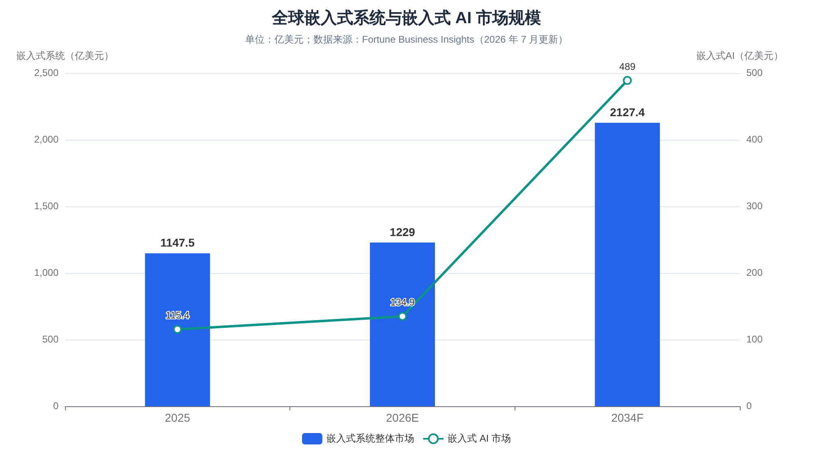
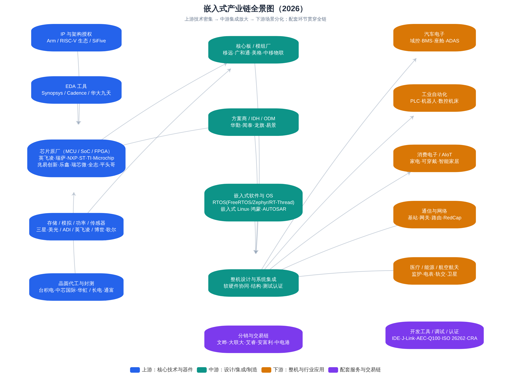
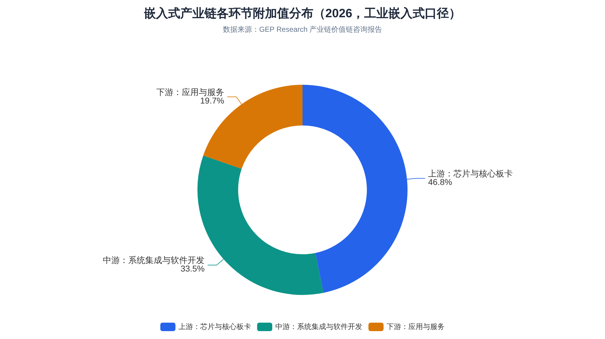
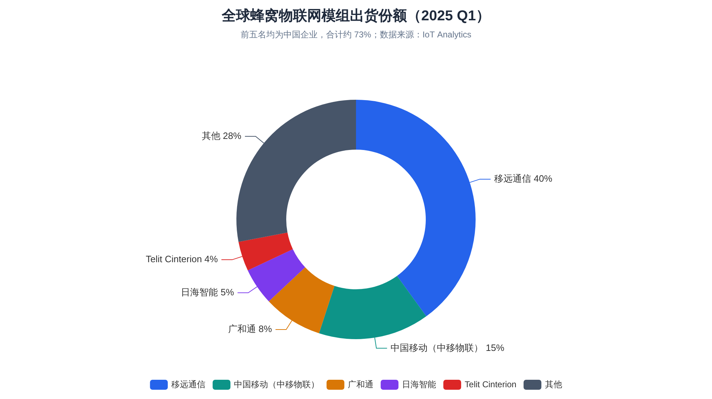
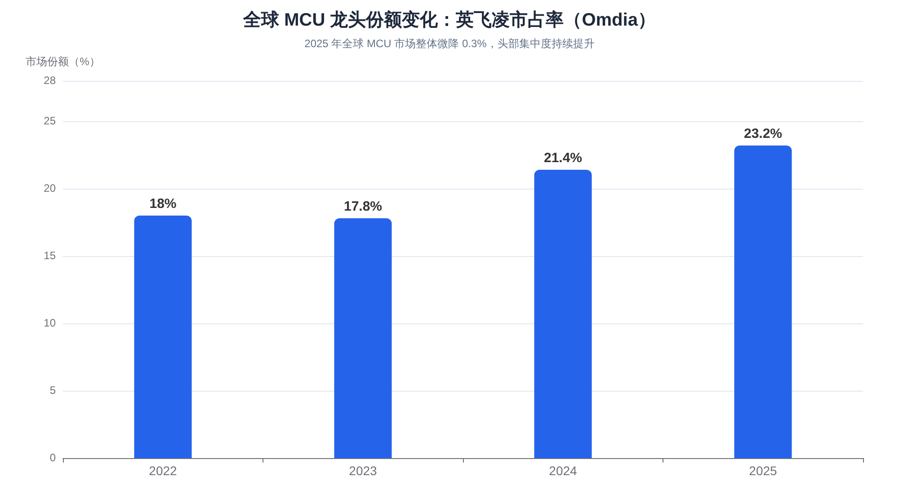
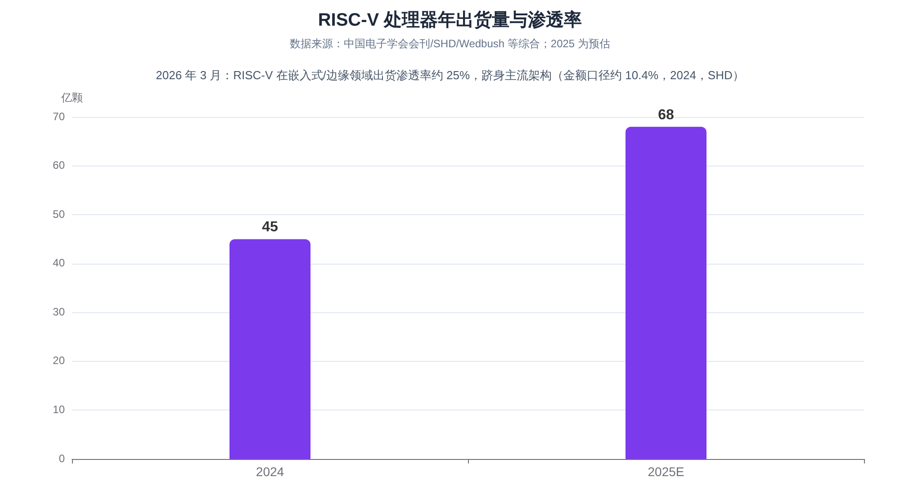
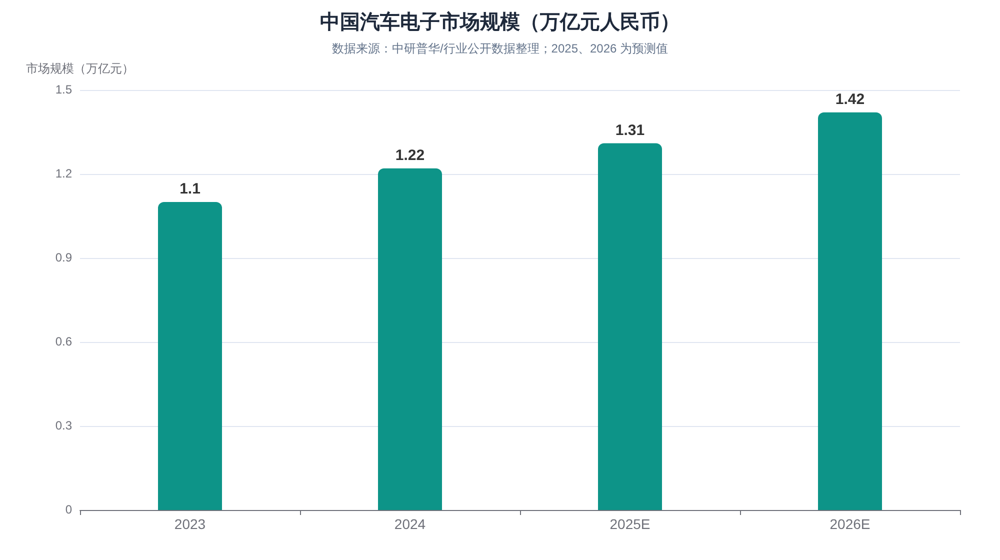
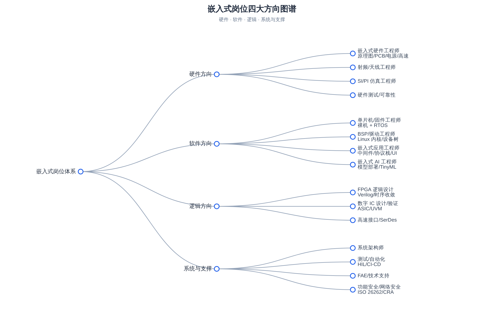
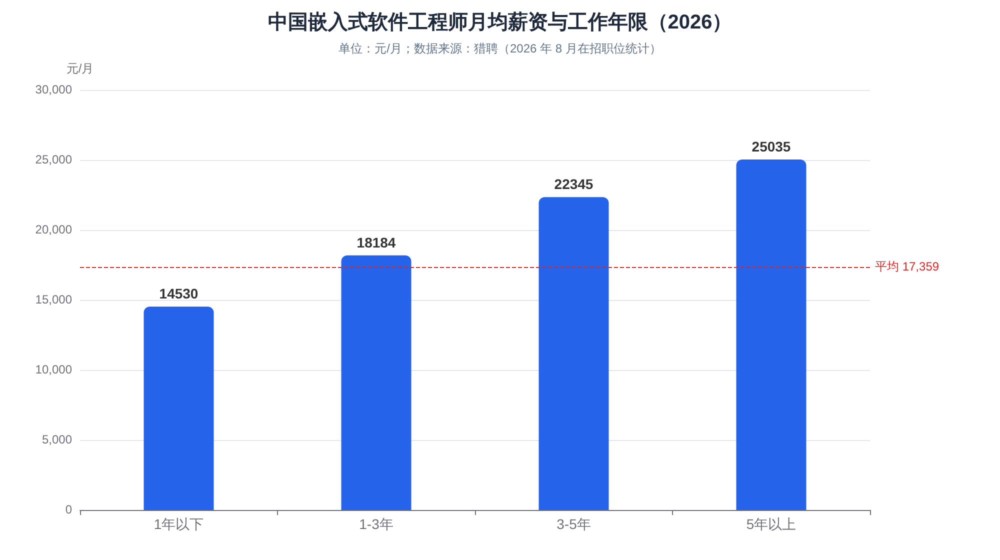
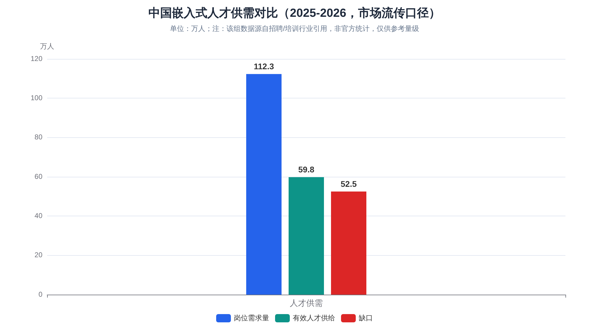

# 嵌入式行业全景调研报告（2026 年 8 月）

> 调研基准日：2026 年 8 月 14 日
> 调研目的：行业全景学习（岗位与职业发展、产业链全景、产品与技术趋势）
> 地域范围：以中国为主，兼顾全球
> 说明：本报告所有数据均来自公开渠道，不同机构统计口径差异较大，文中已逐一标注来源与口径；部分"市场流传口径"的数据（如人才缺口绝对值）已明确标注其局限，仅供判断量级。

---

## 摘要

嵌入式是"藏在设备里的计算"——全球约 **98% 的微处理器**最终用于嵌入式系统而非通用计算机[^8^]。2025—2026 年，这个行业同时被四股力量重塑：**端侧 AI 下沉**（嵌入式 AI 市场以 17.5% 的年复合增速扩张，远高于行业整体约 7% 的增速[^11^][^8^]）、**汽车电子爆发**（中国汽车电子市场 2024 年达 1.22 万亿元，预计 2026 年达 1.42 万亿元[^77^]）、**RISC-V 主流化**（2026 年 3 月在嵌入式/边缘领域出货渗透率约 25%，正式跻身与 Arm、x86 并列的主流架构[^65^][^69^]）、以及**中国产业链全面崛起**（全球蜂窝物联网模组出货前五名全是中国企业、合计约七成份额[^141^][^147^]；全球元器件分销 TOP50 总营收创历史新高[^62^]）。

对学习者而言，核心结论是：**行业整体不缺需求，缺的是"软硬协同 + 领域知识"的复合型中高端人才**。市场流传的口径显示中国嵌入式岗位需求约 112 万、有效供给不足 60 万[^22^][^14^]（该数据非官方统计，仅供判断量级）；与此同时，初级"调库点灯"型岗位确实在拥挤，而车规、端侧 AI、机器人运动控制、RISC-V 等方向常年招不满[^17^][^28^]。嵌入式软件工程师在招职位的全年限平均月薪约 17,359 元，5 年以上经验者约 25,035 元[^25^]；机器人、自动驾驶、边缘 AI 等热点方向的溢价显著[^125^][^28^]。

---

## 一、行业边界与市场规模

### 1.1 什么是"嵌入式"

嵌入式系统（Embedded System）是**以应用为中心、以计算机技术为基础、软硬件可裁剪**的专用计算系统：它不像 PC 那样追求通用性，而是为特定功能而生——从几毛钱的 8 位家电 MCU，到汽车里上百个电子控制单元（ECU），再到工厂里的 PLC、基站里的基带板、卫星上的星载计算机，都属于嵌入式范畴。其核心特征包括：**专用性**（为特定任务设计）、**实时性**（很多场景要求确定性的响应时间，"实时"指的是"在规定时间内必定完成"，而非"快"[^90^]）、**资源约束**（功耗、成本、体积、算力受限）、**软硬件一体**（开发者必须同时理解电路与代码）。

理解嵌入式行业，首先要理解它的**长尾特性**：这是一个"几十年前的产品与最前沿产品同时在产、同时在招人的行业"。产线上仍有大量基于 8051、ARM7 的 legacy 产品需要维护工程师；与此同时，基于 RISC-V、带 NPU 的 AI MCU、车规域控制器、人形机器人关节控制器又在创造全新的岗位。这种"老技术不过时、新技术不断叠层"的结构，是嵌入式与互联网软件行业最大的不同——技术栈分层极厚，经验积累具有复利效应。

### 1.2 全球市场规模：多口径对比

"嵌入式市场有多大"没有唯一答案，因为各机构对"嵌入式"的边界定义不同（是否含软件、是否含服务、是否含模组等）。下表汇总了 2025—2026 年主流机构口径，供交叉参考：

| 机构（口径） | 基准年规模 | 预测 | 复合增速 |
|---|---|---|---|
| Fortune Business Insights（嵌入式系统整体）[^8^] | 2025 年 **1,147.5 亿美元**；2026 年 1,229 亿美元 | 2034 年 2,127.4 亿美元 | 7.10%（2026—2034） |
| Market.us（嵌入式系统）[^7^] | 2025 年 **1,175.8 亿美元** | 2035 年 2,327.4 亿美元 | 7.07%（2026—2035） |
| MarketsandMarkets（嵌入式系统）[^1^] | 2024 年 1,050—1,150 亿美元 | 2036 年 2,100—2,400 亿美元 | 6%—8%（2025—2036） |
| Fortune BI（嵌入式软件子市场）[^12^] | 2025 年 199.8 亿美元；2026 年 219 亿美元 | 2034 年 457.5 亿美元 | 9.64% |
| Fortune BI（嵌入式 AI 子市场）[^11^] | 2025 年 **115.4 亿美元** | 2034 年 489 亿美元 | **17.5%** |
| The Business Research Company（嵌入式计算）[^10^] | 2025 年 453.4 亿美元；2026 年 494.8 亿美元 | 2030 年 706.7 亿美元 | 9.3%（2026—2030） |

尽管口径不一，几点共识是清晰的：其一，**行业整体处于"中速稳定增长"区间**（约 7%—9% CAGR），不是爆发型赛道，但体量庞大且抗周期性强；其二，**增速结构分化明显**——嵌入式 AI、车规级系统等子赛道增速是行业平均的 2 倍以上[^11^]；其三，**硬件仍占大头**（market.us 口径下 2025 年硬件占 52%），但软件与服务的占比在持续提升[^7^]。区域格局上，北美按收入口径仍是最大市场（2025 年份额约 34%—41.8%，不同机构口径不同[^7^][^8^]），而亚太是增长最快、且在制造与消费环节占主导地位的区域。

### 1.3 增长的底层驱动力

嵌入式市场的景气度可以从三个"硬指标"得到验证。**半导体大盘**：据美国半导体行业协会（SIA）数据，2025 年全球芯片销售额达创纪录的 **7,917 亿美元**，同比增长 25.6%——嵌入式系统完全构建在半导体之上，芯片大盘直接决定嵌入式硬件需求[^7^]。**连接数**：GSMA 数据显示 2025 年全球物联网连接数达 **246 亿**，每一个连接节点背后都是一套嵌入式系统[^7^]。**汽车电子化**：2025 年全球汽车产量从 9,270 万辆增至 9,640 万辆，而豪华车型搭载的 ECU 数量已从五年前的约 70 个增至 **100 个以上**，汽车电子占整车成本约 35%—40%；中国新能源汽车 2025 年产量达 1,662.6 万辆，同比增长 29%[^7^]。

中国市场方面，由于统计口径差异更大，参考值包括：工业嵌入式系统 2025 年中国市场约 417—620 亿美元（不同机构口径[^4^][^111^]）；中国汽车电子市场 2024 年约 1.22 万亿元人民币[^77^]；工业自动化整体市场 2025 年约 4,019 亿元、同比增长 13.82%[^109^]。综合判断：**中国是全球最大的嵌入式产品制造与消费国，且在工业、汽车两大高价值场景的增速显著高于全球平均**。

---

## 二、产品与技术版图：从 8051 到边缘 AI

### 2.1 硬件谱系：六类核心器件

嵌入式硬件的核心是处理器，按形态可分为六类，它们对应不同的性能—功耗—成本权衡，也对应不同的岗位技能：

| 器件类型 | 特征 | 典型产品/厂商 | 典型应用 |
|---|---|---|---|
| **MCU**（微控制器） | 单芯片集成 CPU+存储+外设，低功耗低成本，8/16/32 位并存 | STM32/GD32（Cortex-M）、英飞凌 AURIX、瑞萨 RH850 | 家电、电机控制、车身控制、传感器节点 |
| **MPU/SoC**（微处理器/片上系统） | 跑 Linux/Android，性能强，需外挂存储 | 瑞芯微 RK3588、全志、NXP i.MX、高通、联发科 | 智能座舱、边缘网关、安防、平板 |
| **FPGA**（现场可编程门阵列） | 硬件逻辑可重构，并行、低时延 | AMD(Xilinx)、Altera(Intel)、Lattice；紫光同创、安路 | 通信基带、工业视觉、原型验证、军工 |
| **DSP**（数字信号处理器） | 专为信号处理优化 | TI C6000、ADI SHARC | 音频、雷达、电源数字控制 |
| **ASIC/ASSP**（专用芯片） | 为特定场景定制，量产后成本最低 | 各种 NPU、矿机芯片、耳机主控 | TWS 耳机、AI 推理、加密 |
| **SoM/核心板、模组** | 把 SoC+存储+电源做成即插即用模块 | 移远、广和通、树莓派 CM 系列 | 快速产品化、中小批量设备 |

其中 **MCU 是出货量最大的品类**——Yole 数据显示 2023 年全球 MCU 出货约 265 亿颗、市场规模约 229 亿美元，预计 2028 年市场达 320 亿—388 亿美元，汽车与工业贡献 60% 以上增量[^209^][^210^]。**32 位 MCU 已是绝对主流**，8 位在家电等成本敏感场景长尾存续，16 位基本淡出[^50^]。架构层面，ARM Cortex-M/A 长期主导，但 RISC-V 正在快速渗透（详见第六章）。

### 2.2 软件栈：五个层级

嵌入式软件从底到上可分为五个层级，岗位招聘也大致按此分层：

1. **固件/裸机层**：直接操作寄存器，无 OS 或简单调度器，对应"单片机工程师"。
2. **RTOS 层**：FreeRTOS、Zephyr、RT-Thread、ThreadX、VxWorks、QNX 等实时操作系统，强调确定性与低功耗。
3. **嵌入式 Linux/Android 层**：Bootloader（U-Boot）、内核裁剪、设备树、驱动开发（BSP 工程师的核心领地）。
4. **中间件/协议栈层**：文件系统、网络协议栈（LwIP）、图形库（LVGL、Qt for MCUs）、通信协议（CAN、Modbus、EtherCAT、MQTT、Matter）。
5. **应用与算法层**：业务逻辑、控制算法（FOC、PID）、端侧 AI 推理（TinyML、TFLite Micro）。

操作系统格局上，业界普遍判断 **FreeRTOS（开源免费、生态最大）与 ThreadX（微软系）继续领跑，Zephyr（Linux 基金会）与 RT-Thread（国产）快速崛起，VxWorks 与 QNX 坚守航空航天、轨交等高端安全关键市场**[^90^]。国产阵营里，RT-Thread 宣称装机量达 25 亿台、服务全球近 30 万开发者[^26^]；华为鸿蒙（HarmonyOS 6 终端数 2026 年 7 月突破 7,000 万台，开源鸿蒙 OpenHarmony 生态设备超 13 亿台、开发者超 1,100 万）正在把手机、IoT、工业设备纳入同一套分布式 OS 叙事[^82^][^78^]。车端则由 AUTOSAR（Classic/Adaptive）主导标准，叠加各家自研的整车 OS。

### 2.3 "老产品不死"的长尾结构

嵌入式产品的生命周期远长于消费电子：一颗工业 MCU 的供货承诺通常 10—15 年，车规器件要求 15 年以上的长期供货（Longevity Program）。这造成两个直接后果：一是**技术栈共存**——2026 年的招聘市场上，既能看到要求 8051/STM8 维护经验的岗位，也能看到要求 RISC-V + NPU 部署经验的岗位；二是**迁移成本极高**——工业与汽车客户不轻易更换芯片平台，这让原厂生态（开发工具、参考设计、FAE 支持）成为比芯片本身更强的护城河，也是国产替代"先中低端、后高端"的底层原因[^50^][^53^]。

---

## 三、产业链全景：上游、中游、下游与价值分配

嵌入式产业链可以概括为"**上游定技术、中游做集成、下游分场景**"。整体结构如下图所示：

从附加值分布看，以工业嵌入式口径为例，**上游芯片与核心板卡环节占全产业链附加值的 46.8%，中游系统集成与软件开发占 33.5%，下游应用与服务占 19.7%**，呈现"上游集中、中游分散"的利润格局——前五大芯片供应商占据该领域全球份额的 58.2%，行业整体毛利率维持在 32%—38%，高端定制系统可达 45% 以上[^4^]。

### 3.1 上游：IP、EDA、芯片原厂、代工封测

**IP 与架构授权**是产业链最顶端。Arm 的商业模式堪称教科书：不造芯片，只做"授权费 + 按颗计提版税"的生意，毛利率长期约 95%[^168^]。Arm 2025 财年营收首次突破 40 亿美元，其中约 63% 来自版税；截至 2026 年初，基于 Arm 架构的芯片累计出货超过 **3,250 亿颗**，平台开发者超 2,200 万；版税结构中 IoT 与嵌入式占 18%、汽车与机器人占 7%，且 Arm 在汽车市场的份额从 FY2022 的 36% 升至 FY2025 的 44%[^170^][^171^]。RISC-V 则以开源指令集打破授权模式，催生平头哥玄铁、SiFive、芯来等 IP 供应商，中国企业贡献了全球 63% 的 RISC-V 相关专利[^56^][^59^]。

**EDA 工具**是"芯片之母"，Synopsys、Cadence、西门子 EDA 三巨头合计占全球市场约 74%[^166^]。2025 年 5 月美国曾要求三巨头停止向中国大陆提供 EDA 软件，7 月部分放开但 7nm 以下先进制程工具仍受管制[^160^]；国产 EDA 龙头华大九天 2024 年营收 12.22 亿元、同比增长 20.98%，2025 年上半年发布四款数字电路核心产品、号称覆盖数字设计主要工具的近 80%[^166^]。**芯片原厂**（详见第五章）与**代工封测**（台积电、中芯国际、华虹、长电、通富等）构成上游的制造底座；MCU 制程普遍停留在 40nm—90nm 成熟节点，这也是中国成熟制程产能扩张直接受益的原因[^49^][^179^]。

### 3.2 中游：模组、方案商与操作系统

中游是"把芯片变成可用部件"的环节，主要包括三类玩家。**核心板/无线模组厂**：把 SoC/基带 + 存储 + 射频做成标准模组，客户买回去做二次开发即可入网——这是中国企业统治力最强的环节（详见 4.2 节）。**方案商/IDH/ODM**：IDH（独立设计公司）出设计方案与 PCBA，ODM 则包设计包制造；手机行业巅峰期全球近 20 亿部手机中约 7.05 亿部由中国方案公司设计[^165^]，易景信息等企业的"IDH → ODM → 全栈智能硬件"转型路径是中游商业模式演进的典型样本[^161^]。**嵌入式软件与 OS 供应商**：RTOS 厂商、Linux 发行版、鸿蒙生态发行版（润和软件、深开鸿、中科创达等基于 OpenHarmony 做行业发行版[^78^]）、AUTOSAR 工具链（Vector、EB、东软睿驰）等。

中游的商业本质是**规模化的技术搬运与集成**：毛利率低于上游原厂，但贴近客户、反应快。近年来中游有两个明显趋势：一是模组厂向"模组 + 天线 + 云服务 + ODM"延伸以摆脱价格战（移远、广和通均在向高利润海外市场和相邻业务拓展[^129^]）；二是"交钥匙方案"（Turnkey）下沉到更碎片化的 AIoT 场景，白牌方案商依托深圳供应链可在数周内完成从芯片选型到小批量交付。

### 3.3 下游：应用场景分化

下游应用决定了嵌入式工程师的"行业属性"。主要板块的规模与特征如下：

| 下游板块 | 规模参考（2024—2026） | 技术特征 | 代表雇主类型 |
|---|---|---|---|
| **汽车电子** | 中国市场 2024 年 1.22 万亿元 → 2026 年预计 1.42 万亿元[^77^] | 车规认证（AEC-Q100）、功能安全 ISO 26262、AUTOSAR | 整车厂、Tier1（德赛西威、博世）、芯片原厂 |
| **工业自动化** | 中国工业自动化市场 2025 年约 4,019 亿元，+13.82%[^109^]；PLC 市场 197.34 亿元，+11.74%[^109^] | 实时性、工业总线（EtherCAT/Profinet）、可靠性 | 汇川、信捷、中控、西门子 |
| **消费电子/AIoT** | 蜂窝物联网模组 2025 年出货约 5.44 亿片[^129^] | 成本极致、低功耗、无线协议栈 | 家电/可穿戴厂商、方案商、乐鑫等原厂 |
| **通信与网络** | 基站、网关、CPE；5G RedCap 起量[^141^] | 高速接口、FPGA、协议栈 | 华为、中兴、设备商 |
| **医疗/能源/轨交/航空航天** | 分散但高门槛 | 认证体系（医疗注册、SIL 等级）、长生命周期 | 迈瑞、联影、电网设备商、航天院所 |
| **机器人/具身智能** | 机器人领域新发职位平均年薪 32.8 万元，人形机器人约 40 万元[^125^] | 运动控制、EtherCAT、实时系统、边缘算力 | 宇树、智元、优必选、海柔等 |

应用结构方面，市场流传的细分数据（口径不一，供参考）：汽车是嵌入式最大单一应用场景（market.us 口径占 23%[^7^]；另有机构口径 2025 年全球汽车嵌入式系统约 680 亿美元、工业自动化约 490 亿美元、消费电子与智能家居约 370 亿美元[^194^]）。汽车电子内部，2024 年中国市场结构为：动力控制 28.7%、底盘与安全 26.7%、车身电子 22.8%、车载电子 21.8%[^87^]。

---

## 四、交易链与流通体系：货是怎么从原厂到工程师手里的

### 4.1 分销商：产业链的"血管"

半导体原厂极少直接面向中小客户销售，**授权分销商**承担库存、账期、物流、技术支持职能，是嵌入式产品交易链的核心节点。2025 年全球元器件分销 TOP50 总营收达 **2,319.56 亿美元**，较 2024 年提升超 290 亿美元、增幅超 14%，超过 2022 年缺芯潮时期的历史峰值；TOP4（文晔、大联大、艾睿、安富利）合计占 TOP50 的 53.57%，TOP10 占 70.25%[^62^]。

| 2025 年排名 | 分销商 | 关键数据 |
|---|---|---|
| 1 | **文晔科技**（中国台湾） | 营收 1.18 万亿新台币/约 **380.11 亿美元**，同比 +22.78%；AI 服务器相关业务占比 41.2%[^61^][^66^] |
| 2 | **大联大**（中国台湾） | 营收同比 +13.5%，时隔四年重回全球第二；超 85% 营收来自大中华区[^62^][^64^] |
| 3 | **艾睿电子 Arrow**（美国） | 同比 +10.5%，温和复苏；利润表现为 TOP4 最佳[^64^][^75^] |
| 4 | **安富利 Avnet**（美国） | 同比 +3.0%[^62^] |
| 5 | **中电港**（中国大陆） | 营收超 90 亿美元，2026 年有望突破百亿；AI 相关收入 2025H1 同比 +144%[^62^][^76^] |

除授权分销外，交易链还包括：**目录分销商**（得捷 DigiKey、贸泽 Mouser，服务工程师小批量采购）、**独立分销商/现货商**（深圳华强北模式，缺芯潮期间扮演"蓄水池"与"放大器"双重角色）、**代理商/方案捆绑商**（按行业提供参考设计）。值得关注的是格局变化：亚太系分销商（文晔、大联大）凭借大中华区 AI 服务器与存储需求，规模已超越欧美传统龙头；全球 TOP50 中有 19 家中国企业，中电港、香农芯创（2025 年增速 112%）等增速领跑[^62^][^71^]。

### 4.2 模组交易：中国企业统治力最强的环节

蜂窝物联网模组是观察"中游中国制造"的最佳样本。IoT Analytics 数据显示，2025 年 Q1 全球蜂窝物联网模组出货量前五名——**移远通信（40%）、中国移动（15%）、广和通（8%）、日海智能（5%）、Telit Cinterion（4%）**——合计占 73%，其中四家为中国企业[^141^]；Counterpoint 口径下前五名全为中国企业、合计约 69%[^147^]。上游芯片组也在国产化：2025 年蜂窝物联网芯片组出货 7.06 亿颗（不含车规），ASR、上海移芯、紫光展锐、芯翼等中国厂商在 Cat-1 bis 与 NB-IoT 上增长稳健[^128^]。

这个环节的启示在于：**嵌入式产品的交易链已经从"卖芯片"演进为"卖连接能力/卖解决方案"**。模组均价持续走低、价格战激烈，头部厂商的出路是向车规（移远车规级 NAD 模组出货份额 27%、全球第一[^128^]）、卫星通信、GNSS、AI 模组等高附加值品类迁移，或向 PCBA/ODM、物联网云平台延伸[^129^]。

### 4.3 周期与库存：交易链的"心跳"

嵌入式元器件交易有强周期性：2021—2022 年缺芯潮（MCU 交期一度超 40 周、部分涨价超十倍[^50^]）→ 2023 年全行业去库存（TOP50 分销营收同比 -15.25%[^62^]）→ 2024—2025 年复苏并创新高（2025 年由 AI 结构性缺货驱动，与 2022 年疫情驱动的全面短缺性质不同[^62^]）。对从业者的意义在于：看懂库存周期，就能理解"为什么今年这家原厂在裁员、那家在扩产"，也能理解现货市场价格波动对中小硬件公司的杀伤力。

---

## 五、竞争格局：国际原厂、中国军团与国产替代

### 5.1 MCU：一超多强，国产梯队成型

全球 MCU 市场高度集中。Omdia 数据显示，**英飞凌 2025 年以 23.2% 的份额蝉联全球第一**（2024 年 21.4%），且是在市场整体微降 0.3% 的背景下实现最大增幅[^162^][^36^]；英飞凌、瑞萨、恩智浦、意法、Microchip、TI 前六大厂商合计份额约 88%（Yole，2022 年口径）[^40^]。汽车 MCU 更集中：TechInsights 2024 年榜单前五是英飞凌、恩智浦、意法、TI、瑞萨，英飞凌在汽车 MCU 领域份额达 32%[^38^][^43^]。

中国 MCU 厂商整体份额仍为低个位数，但梯队已经成型、且细分突破明显[^40^][^41^]：

| 厂商 | 定位与优势 | 进展 |
|---|---|---|
| **兆易创新** | 中国 ARM 架构通用 MCU 第一（GD32 累计出货超 15 亿颗、700+ 型号，110—22nm 多制程覆盖）[^40^][^41^] | 车规 GD32A503 量产上车；NOR Flash 全球前三[^51^] |
| **乐鑫科技** | Wi-Fi/蓝牙物联网 SoC 全球龙头，ESP32 全球市占率超 30%，自研 RISC-V 内核[^41^] | AIoT 订单强劲，开源社区生态强[^52^] |
| **中颖电子** | 小家电 MCU 市占率第一，美的/格力供应链[^41^] | 截至 2024 年底累计售芯 8.85 亿颗[^41^] |
| **复旦微电** | 智能电表 MCU 国网份额第一，FPGA+MCU 双线[^41^] | 2024Q3 营收 26.84 亿元、毛利率 53.82%[^41^] |
| **极海半导体** | 纳思达旗下，车规/工业 MCU，支持 ISO 26262[^41^] | 国产替代新势力 |
| **芯海科技** | BMS 芯片打入比亚迪/蔚来供应链[^41^] | 车规出货爆发 |
| **瑞芯微/全志** | 应用处理器 SoC（RK3588 等），边缘 AI 盒子、座舱[^41^][^91^] | 向中高端与车规突破 |

车规 MCU 是国产替代最硬骨头：2023 年中国汽车芯片对外依存度高达 95%，计算与控制类芯片自给率不足 1%[^198^]；但 2024 年中国汽车 MCU 市场规模已达 268 亿元、预计 2025 年 294 亿元[^83^][^94^]，2025 年已有 3 家中国企业跻身全球车规 MCU 前十、中低端国产化率突破 50%[^88^]。智能座舱 SoC 领域，2025 年中国乘用车前装搭载率 76.62%，高通以 40.96% 居首，但芯驰科技（3.77%，第五）与华为海思（3.39%，第六）已进入第一梯队，芯驰累计出货突破 1,100 万片[^80^][^98^]。

### 5.2 FPGA：双寡头垄断下的国产突围

FPGA 全球规模约 125.8 亿美元（2025 年预计），Gartner 预测中国市场占全球 68%、复合增速 25%[^44^]。格局上 AMD（Xilinx）与 Altera（Intel）双寡头占 80% 以上，Lattice、Microchip 分食其余[^46^][^48^]。国产 FPGA 市占率约 15%，集中于 28nm 以上、200K 逻辑单元以下的中低端；紫光同创、复旦微电、中微亿芯、易灵思已具备亿门级 FinFET FPGA 研发能力[^44^]。FPGA 的护城河一半在硅片、一半在工具链（Vivado/Quartus 生态），这正是国产替代最难复制的部分。

### 5.3 国产替代与政策环境

宏观层面，中国芯片自给率从 2019 年的约 15% 提升至 2022 年的 36%（口径之一；TechInsights 另一口径 2022 年为 18.3%），2025 年约 35%，政策目标为 2025 年 70%[^179^][^185^][^181^]。国家大基金三期（规模超一期+二期总和）重点投向设备、材料与先进封装[^179^][^174^]。外部约束（EDA 断供事件、实体清单、移远被列入 1260H 清单[^160^][^142^]）与内部政策（自给率目标、信创、鸿蒙生态共建[^78^]）共同决定了：**未来五年嵌入式行业在中国的主旋律仍是"成熟制程放量 + 关键场景替代 + 开源生态换道（RISC-V/鸿蒙/RT-Thread）"**。

---

## 六、技术趋势：2026 年的六条主线

### 6.1 RISC-V：从"备胎"到主流架构

2026 年 3 月，Wedbush 研究显示 RISC-V 市场渗透率已达 **25%**（主要反映在嵌入式与边缘领域的出货量口径），正式与 Arm、x86 并列主流架构；金额口径渗透率约 10.4%（2024 年，SHD 数据）[^69^][^65^]。出货量上，2024 年全球 RISC-V 处理器出货约 45 亿颗，2025 年预计攀升至 68 亿颗，年增速维持约 50%；Omdia 预测 2030 年出货达 170 亿颗、占全球处理器市场约四分之一[^65^][^214^]。标志性事件包括：阿里平头哥玄铁内核累计出货破 10 亿颗、服务器级玄铁 C930 交付[^56^][^68^]；英飞凌在 Embedded World 2026 宣布基于 RISC-V 的 AURIX 车规 MCU 生态计划[^162^]；高通与 Meta 通过收购切入 RISC-V[^69^]。在 AI MCU 赛道，RISC-V 采用率已从 2023 年的 18% 升至 2025 年的 **39%**[^59^]。

### 6.2 边缘 AI / AI MCU：最大的增量变量

嵌入式 AI 市场 2025 年约 115.4 亿美元，预计 2034 年达 489 亿美元（CAGR 17.5%），亚太占 42.11%[^11^]。落地形态分三层：**MCU 级**（2026 年 2 月 ST 推出全球首款集成专用 AI 加速器的车规 MCU Stellar P3E；预计到 2028 年 MCU 级 AI 覆盖至少 10% 的 MCU[^59^]）、**SoC/模组级**（瑞芯微 RK3588、高通 QCS、带 NPU 的智能模组）、**边缘盒子级**（NVIDIA Jetson、国产算力卡）。技能层面，掌握 TFLite Micro、STM32Cube.AI、TensorRT 等端侧部署能力的工程师薪资溢价 30% 以上[^28^][^29^]。Embedded World 2026 的现场信号很明确：人形机器人头部方案（英飞凌 PSOC + Jetson Thor）、边缘 AI 现场实验室、Wi-Fi 7 + 蓝牙 + 802.15.4 组合、PQC 后量子安全，成为头部原厂的共同展品[^162^]。

### 6.3 操作系统生态：开源化与国产化并进

RTOS 层面，"FreeRTOS/ThreadX 领跑 + Zephyr/RT-Thread 崛起 + VxWorks/QNX 守高端"的格局延续[^90^]；工业领域开源 Linux 及其实时扩展在工厂自动化的部署量 2025 年同比增长 27%，而 VxWorks/QNX 在轨交、核电等安全关键系统仍保有 30% 以上份额[^111^]。鸿蒙生态是 2025—2026 年最大的国产变量：HarmonyOS 6 终端破 7,000 万台、OpenHarmony 生态设备超 13 亿台，润和、深开鸿、软通动力、中科创达等围绕 OpenHarmony 形成行业发行版阵营，向金融、电力、政务、车载渗透[^82^][^78^]。对工程师而言，"嵌入式 Linux + 一门 RTOS + 鸿蒙/AUTOSAR 之一"正在成为高适配性的 OS 组合。

### 6.4 汽车电子：嵌入式最大的单一增长极

中国汽车电子市场 2024 年 1.22 万亿元（+10.95%），预计 2025 年 1.31 万亿、2026 年 1.42 万亿元[^77^]。架构层面，分布式 ECU 正向"域控制器 → 中央计算"演进：中国域控制器市场 2026 年预计达 1,689 亿元，其中智能驾驶域控从 2020 年的 9.8 亿元飙升至 2024 年的 167.4 亿元（CAGR 超 100%），2026 年预计 447.6 亿元[^77^]。单车芯片用量从燃油车约 600 颗升至智能电动车 3,000 颗以上[^86^][^99^]。软件定义汽车（SDV）带来"硬件预付费 + 软件订阅"的新商业模式，智能座舱领域订阅制普及率超 45%[^100^]。岗位含义：AUTOSAR、ISO 26262、车载以太网、BMS/电机控制成为溢价最高的嵌入式技能组合之一[^28^]。

### 6.5 机器人与具身智能：下一个十年级机会

具身智能已被列入国家"十五五"规划的未来产业，2026 年 6 月工信部与国资委启动人形机器人实景实训专项行动，目标是 2026 年底形成万台级落地能力[^125^]。人才市场上，机器人领域近一年新发职位平均年薪 **32.8 万元**、人形机器人赛道约 40 万元；机器人人才需求同比增长 75%；海柔创新 2026 届校招研发岗年薪 25—50 万、算法岗 40—75 万[^125^]。猎聘 2025 年三季度报告显示，具身智能领域热招职能前五为：算法工程师、**嵌入式软件开发**、硬件工程师、产品经理、电气工程师，智能硬件职位同比增长近 130%[^30^]。机器人嵌入式岗的技能栈高度聚焦：C/C++、ARM、RTOS/Linux、CAN/SPI/UART/I2C/**EtherCAT**、电机控制（PMSM/BLDC、FOC）、ROS/ROS2[^120^][^123^]——与传统嵌入式技能高度同源，是嵌入式工程师转型性价比最高的方向之一。

### 6.6 安全与合规：从加分项变成准入证

欧盟《网络弹性法案》（CRA）已于 2024 年 12 月生效，设两个关键节点：**2026 年 9 月 11 日起强制漏洞报告义务，2027 年 12 月 11 日起所有含数字元素的产品全面合规**，且合规是获得 CE 标志、进入欧盟市场的前提——固件、操作系统、嵌入式产品均在管控范围内[^193^][^206^]。功能安全（ISO 26262 汽车 / IEC 61508 工业）、信息安全（Secure Boot、TrustZone、PQC 后量子加密）正在从"高端岗位要求"变为"出口产品标配"。掌握 AI 边缘计算与功能安全知识的工程师，薪资增幅高达 47%[^22^]。

---

## 七、岗位与职业发展

### 7.1 岗位体系：四大方向

嵌入式岗位可归纳为**硬件、软件、逻辑、系统与支撑**四大方向，各自的核心对象、入门周期与天花板差异明显：

| 方向 | 核心岗位 | 核心技能 | 入门周期 | 薪资参考（中国，2025—2026） |
|---|---|---|---|---|
| **硬件** | 嵌入式硬件工程师、射频、SI/PI | 模电/数电、Altium/Cadence、高速板（DDR/MIPI/PCIe）、示波器调试[^16^] | 较慢（半年至 1 年独立 Layout） | 应届 8—15K/月；3—5 年年薪 20—35 万；车规/高速 30—45 万；架构师 40—60 万+[^16^] |
| **软件（单片机/固件）** | 固件工程师、RTOS 工程师 | C、RTOS、外设驱动、低功耗 | 3—6 个月上手 | 通用 MCU 方向 3—5 年平均 18—22K/月[^15^] |
| **软件（Linux/BSP）** | BSP/驱动工程师、系统工程师 | 内核裁剪、设备树、驱动框架、U-Boot[^19^] | 深入需 1—2 年 | 起薪偏高（一线 10—18K[^16^]）；RTOS+Linux 驱动能力薪资上浮 20%—30%[^18^] |
| **软件（应用/AI）** | 嵌入式应用、嵌入式 AI 工程师 | C++/Python、协议栈、LVGL/Qt、TFLite Micro | — | 边缘 AI 溢价 30%+，模型轻量化方向年薪 60—80 万[^28^] |
| **逻辑（FPGA）** | FPGA 逻辑设计、数字 IC 验证 | Verilog/VHDL、Vivado/Quartus、时序收敛、高速接口（PCIe/DDR/SerDes）[^103^][^110^] | 中等 | 初级 15—25K/月；3—5 年 25—45K；5 年以上年薪 60—120 万[^102^][^103^] |
| **系统与支撑** | 架构师、测试/HIL、FAE、功能安全工程师 | 系统架构、AUTOSAR、ISO 26262、自动化测试 | 需多年积累 | 车规/功能安全方向月薪 4 万+[^28^] |

岗位需求结构上，软件类岗位数量远多于硬件类（一个产品通常配 1—2 名硬件、2—N 名软件工程师[^16^]）；2026 年嵌入式软件开发岗位需求同比增长 17.6%，硬件工程师岗位增长 6.8%[^112^]。

### 7.2 薪资水平：结构性分化是关键词

猎聘在招职位统计（2026 年 8 月）显示，嵌入式软件工程师**全年限平均月薪 17,359 元**：1 年以下 14,530 元，1—3 年 18,184 元，3—5 年 22,345 元，5 年以上 25,035 元[^25^]。职友集口径显示 48.7% 的岗位落在 20—50K/月区间[^18^]。区域上，深圳嵌入式软件工程师平均年薪约 19.2 万元（月均 15,993 元），中位数约 17.1 万元；西安约 15.3 万元[^33^][^22^]。全球对比，美国嵌入式工程师平均年薪约 9.0 万—15.7 万美元（PayScale/Glassdoor 两口径）[^18^]。

真正拉开差距的是**赛道选择**而非年限本身：通用 MCU 开发（3—5 年）平均 18—22K/月，汽车电子 BMS 方向同年限 25—35K/月[^15^]；自动驾驶感知/车规 MCU 月薪 4 万+，RISC-V 生态稀缺人才年薪 60—80 万，AIoT 系统架构师 3.5—5 万/月[^28^][^18^]。掌握"AI + 嵌入式"复合技能者薪资比传统开发者高 40%—60%[^15^]。一句话：**嵌入式薪资的方差大于均值的意义，选赛道 > 熬年限**。

### 7.3 人才供需：整体缺口与局部内卷并存

市场流传口径（源自招聘/培训行业引用，**非官方统计**，仅供判断量级）：2025—2026 年中国嵌入式岗位需求量约 **112.3 万**，有效人才供给约 **59.8 万**，缺口比例 46.7%；未来 3—5 年智能硬件与嵌入式领域技能型人才缺口预计超 200 万[^22^][^14^][^112^]。赛迪智库《关键软件领域人才白皮书》亦预测关键软件领域人才缺口超 80 万、嵌入式软件需求突出[^26^]。

但"缺口"是结构性的：**低端拥挤、高端空缺**。大量求职者停留在"STM32 调库 + 智能小车"层面，可替代性强；企业真正缺的是能解决量产问题、懂功耗/可靠性/功能安全、软硬件都能动手的中高端工程师[^17^][^15^]。FPGA 方向同样如此——工信部《集成电路产业人才白皮书》预测 2025 年 FPGA 工程师缺口超 50 万（培训机构引用口径），企业愿为有经验者多付 50% 薪资[^116^]。另一个值得警惕的趋势是 AI 工具对初级岗位的替代：低代码/AI 代码生成可缩短 70% 重复性开发周期，企业更倾向"资深架构师 + AI 工具"组合，初级开发者需要更快地向系统级能力转型[^28^]。

### 7.4 城市分布与雇主地图

深圳的电子/半导体/集成电路行业职位占比达 **21.66%**，是北京（7.44%）、上海（8.82%）的 2—3 倍，硬件工程师、嵌入式软件开发是深圳热招岗位[^169^][^177^]。整体格局：**深圳**（消费电子/AIoT/模组/无人机，硬件生态最完整）、**上海**（汽车电子、半导体原厂、外企研发中心）、**北京**（航天军工、科研院所、AI 公司）、**杭州**（AIoT、机器人"六小龙"）、**成都/西安/武汉**（军工电子、汽车、光通信，薪资约为一线 80%[^28^]）。雇主类型则覆盖：芯片原厂（兆易、乐鑫、平头哥…）、模组厂（移远、广和通…）、整机厂（华为、大疆、比亚迪、小米…）、Tier1（德赛西威…）、工业自动化（汇川、中控…）、机器人公司（宇树、智元、海柔…）、研究所与军工院所。

### 7.5 职业路径

典型路径为**"初级工程师 → 独立负责模块 → 主导项目 → 分岔"**：技术线走向架构师/领域专家（BSP 专家、RTOS 专家、功能安全专家、芯片架构师），管理线走向研发经理/技术总监/CTO[^27^][^19^]。嵌入式特有的三条"暗线"也值得注意：一是**向原厂/上游迁移**（FAE → 原厂 AE/市场，或从整机厂跳槽到芯片原厂做 BSP/生态，薪资与稳定性双升）；二是**领域知识复利**（汽车、医疗、电力等行业 know-how 与认证经验极难被替代，越老越吃香）；三是**软硬协同的稀缺性**——"传统汽车工程师不懂电子，纯软件工程师不懂硬件"，复合型人才在 SDV 与机器人时代被极度放大[^104^][^21^]。

---

## 八、给行业学习者的建议

综合本次调研，给出五条可操作的结论：

1. **先建立"全链视角"再选点突破**：理解"原厂 → 模组/方案商 → 整机 → 场景"的链条后，再决定自己切入上游（原厂 BSP/驱动）、中游（方案/模组开发）还是下游（行业应用）——三者技术栈重叠但职业性质迥异。
2. **软件方向优先，但保留硬件直觉**：软件岗位数量多、起薪高、转型面广；但调试时看得懂原理图、用得了示波器，是从"调库工程师"晋升为"产品工程师"的分水岭[^15^][^17^]。
3. **技能组合押注高溢价方向**：C/C++ + RTOS + Linux 驱动是底座；叠加以下任一项形成溢价——车规（AUTOSAR/ISO 26262）、端侧 AI（TFLite Micro/NPU 部署，溢价 30%+[^28^]）、机器人（EtherCAT/FOC/ROS2）、RISC-V（稀缺人才年薪 60—80 万[^28^]）。
4. **用"量产视角"武装简历**：面试官区分"做过项目"和"做过产品"的关键问题是功耗、量产 bug hotfix、可靠性[^15^]；参与开源（Zephyr、RT-Thread）、复现工业级项目比堆开发板数量更有价值。
5. **关注合规与生态的长期红利**：CRA（2027 年底全面强制）、ISO 26262、鸿蒙/OpenHarmony 生态、RISC-V 生态，都是"现在学、三年后变现"的方向[^193^][^82^]。

---

## 九、风险与挑战

**周期风险**：半导体与嵌入式强相关，2023 年去库存期全行业收缩（TOP50 分销营收 -15.25%[^62^]、ST 通用 MCU 降幅超 50%[^52^]）殷鉴不远；2025—2026 年的高景气部分由 AI 结构性需求驱动，需警惕局部过热后的回调。**地缘风险**：EDA 管制、实体清单、关税与出口管制会直接影响上游供货与下游出口（移远被列入 1260H 清单即为案例[^142^]），供应链区域化重构是不可逆趋势[^5^]。**技术替代风险**：AI 代码生成与低代码工具压缩初级岗位，"资深 + AI 工具"模式可能抬高入行门槛[^28^]。**低端内卷风险**：消费电子与白牌方案价格战激烈，死守传统低端 MCU 赛道的薪资天花板明显[^15^][^21^]。**数据口径风险**：本报告所引用的多组市场数据来自不同机构，口径差异显著（如全球嵌入式市场从 1,050 亿到 4,870 亿美元不等[^1^][^5^]），引用时务必注明出处与口径。

---

## 附：主要数据口径与来源说明

本报告引用的数据来自：Fortune Business Insights、Market.us、MarketsandMarkets、Yole Group、Omdia、TechInsights、Counterpoint、IoT Analytics、Berg Insight、GSMA、SIA、WSTS、猎聘、职友集、智联招聘、《国际电子商情》、智研咨询、中研普华、观研天下等公开发布内容，以及 Embedded World 2026 展会报道。其中：人才供需绝对值（112 万/60 万）为招聘培训行业流传口径，非官方统计；"中国嵌入式市场规模"各机构口径差异极大（6,800 亿元人民币[^194^] 与 890 亿美元[^9^] 并存），正文仅作区间参考。薪资数据均为招聘平台在招职位统计，与实际到手薪酬存在结构性偏差。

[^1^]: https://www.marketsandmarkets.com/Market-Reports/embedded-system-market-98154672.html
[^4^]: https://www.gepresearch.com/88/view-1136105-1.html
[^5^]: https://www.inwwin.com.cn/103/view-1198324-1.html
[^7^]: https://market.us/report/embedded-systems-market/
[^8^]: https://www.fortunebusinessinsights.com/zh/embedded-systems-market-108767
[^9^]: https://www.iim.net.cn/2358/view-318159-1.html
[^10^]: https://www.thebusinessresearchcompany.com/report/embedded-computing-global-market-report
[^11^]: https://www.fortunebusinessinsights.com/embedded-ai-market-114630
[^12^]: https://www.fortunebusinessinsights.com/zh/embedded-software-market-116609
[^14^]: https://blog.csdn.net/2401_84682062/article/details/162153826
[^15^]: https://www.cnblogs.com/xdpz/articles/20893420
[^16^]: https://blog.csdn.net/jlq_diligence/article/details/161706640
[^17^]: https://www.jiaoyubao.cn/news/n365393.html
[^18^]: https://blog.csdn.net/qiwsir/article/details/160006289
[^19^]: https://blog.csdn.net/weixin_42186015/article/details/159332440
[^21^]: https://www.sohu.com/a/1053824135_100285099
[^22^]: https://devpress.csdn.net/v1/article/detail/154022566
[^25^]: https://www.liepin.com/zpqianrushiruanjiangongchengshi/xinzi/
[^26^]: http://mp.weixin.qq.com/s/yai0SNUMXWtJ5Bj5WGVoxA
[^27^]: https://rj.zx.zbj.com/ruanjian/12638.html
[^28^]: https://openvela.csdn.net/694a639b5b9f5f317819e2da.html
[^29^]: https://www.eet-china.com/mp/a394271.html
[^30^]: https://www.fxbaogao.com/detail/5142626
[^33^]: https://docs.ihr360.com/salary-report/329348
[^36^]: http://mp.weixin.qq.com/s?__biz=Mzg2NDgzNTQ4MA==&mid=2247775727&idx=1&sn=21237447178b0991336dca327a529ee2
[^38^]: http://mp.weixin.qq.com/s?__biz=MzkxMjIyNzU0MA==&mid=2247793867&idx=5&sn=32b922b409093738a5dbbae0776ad2d5
[^40^]: https://stock.finance.sina.com.cn/stock/go.php/vReport_Show/kind/search/rptid/820978588972/index.phtml
[^41^]: https://m.rfidworld.com.cn/news/2504_9FE92E80CA9056AA.html
[^43^]: http://mp.weixin.qq.com/s?__biz=Mzg5MzIzODg2NA==&mid=2247506310&idx=1&sn=6e45d7b6ab0b6836c45146bf53521786
[^44^]: https://cn.supplyframe.com/article/8584.html
[^46^]: http://mp.weixin.qq.com/s?__biz=MzAxNzU3NjcxOA==&mid=2650742434&idx=1&sn=afdeea62474307fc65c396217b2c1706
[^48^]: http://mp.weixin.qq.com/s?__biz=MzAwNTU2NTM0Ng==&mid=2653869273&idx=3&sn=6d3116eb452edc8f9bb436c0a998fb5a
[^49^]: https://www.esmchina.com/news/11827.html
[^50^]: https://pdf.dfcfw.com/pdf/H3_AP202107231505650165_1.pdf
[^51^]: https://www.caixin.com/2026-05-18/102444868.html?originReferrer=kimi
[^52^]: https://www.eet-china.com/mp/a391756.html
[^53^]: https://pdf.dfcfw.com/pdf/H3_AP202102251465325418_1.pdf
[^56^]: https://www.chinabaogao.com/market/202607/808738.html
[^59^]: https://view.inews.qq.com/a/20260713A08KEB00
[^61^]: https://info.datadowell.com/bdt/0-1779191459713.html
[^62^]: https://www.esmchina.com/news/14181.html
[^64^]: https://money.finance.sina.com.cn/corp/view/vCB_AllBulletinDetail.php?stockid=300975&id=12170991
[^65^]: http://www.chinaaet.com/article/3000176936
[^66^]: https://news.qq.com/rain/a/20260305A05OBK00
[^68^]: https://www.pcachina.com/article/3000176936
[^69^]: https://finance.sina.com.cn/tech/roll/2026-02-04/doc-inhkryem3669591.shtml
[^71^]: https://hanrun.yibeiic.com/xinpianzixun/113529.html
[^75^]: https://www.tmtpost.com/7776485.html?source=microsoft
[^76^]: https://www.eet-china.com/mp/a439077.html
[^77^]: https://www.wedoany.com/shortnews/183958.html
[^78^]: https://cj.sina.cn/articles/view/7879848900/1d5acf3c401902wob6?froms=ggmp
[^80^]: https://www.semidrive.com/news/view-NDQ1OTU=.html
[^82^]: https://www.ithome.com/0/971/420.htm
[^83^]: https://www.chyxx.com/industry/1238968.html
[^86^]: http://mp.weixin.qq.com/s?__biz=MjM5Njc5NDQ2MA==&mid=2650440498&idx=1&sn=2d95e82cdedff0761cc0abadbb8d0ec4
[^87^]: https://www.qyresearch.com.cn/news/22542/car-electronics
[^88^]: https://www.iim.net.cn/2358/view-16845-1.html
[^90^]: https://www.eet-china.com/mp/a391016.html
[^91^]: http://mp.weixin.qq.com/s?__biz=MzIyMTQ1NjI3Nw==&mid=2247485971&idx=1&sn=62acbaa8b224b8742958ae9090af0e96
[^94^]: https://finance.sina.com.cn/stock/relnews/cn/2025-10-21/doc-infuriet4511125.shtml
[^98^]: http://m.ce.cn/qc/gd/202602/t20260205_2754945.shtml
[^99^]: https://www.fxbaogao.com/detail/3111253
[^100^]: https://www.iim.net.cn/2358/view-21248-1.html
[^102^]: https://www.chengdianguoxin.com/fpgalearning
[^103^]: https://www.fpgalearn.com/15118.html
[^104^]: https://www.sohu.com/a/1044828633_121123998
[^109^]: https://www.chyxx.com/industry/1269209.html
[^110^]: https://www.zhipin.com/job_detail/701622b32fa39c1d1XB809y4GVJS.html
[^111^]: https://m.gepresearch.com/1190/view-1046516-1.html
[^112^]: https://blog.csdn.net/cyl1224071/article/details/162640246
[^116^]: https://www.shaonianxue.cn/16612.html
[^120^]: https://www.fxbaogao.com/detail/5300937
[^123^]: https://www.liepin.com/job/1968419111.shtml
[^125^]: https://www.eet-china.com/mp/a506740.html
[^128^]: https://www.eefocus.com/article/2044974.html
[^129^]: http://www.chipdata.com.cn/nd.jsp?id=1
[^141^]: http://mp.weixin.qq.com/s?__biz=MzIwNjI2MjAzOA==&mid=2650045201&idx=1&sn=3bbc9df9ee074d44cf4cc5138df8605a
[^142^]: https://iot.ofweek.com/2025-07/ART-132214-8110-30667019.html
[^147^]: https://chinaaet.com/article/3000172224
[^160^]: https://xueqiu.com/9208137585/398638493
[^161^]: https://t.cj.sina.cn/articles/view/5835524730/15bd30a7a0010257do
[^162^]: https://www.eet-china.com/mp/a480257.html
[^165^]: https://www.cmpe360.com/p/13308
[^166^]: https://xueqiu.com/9183553390/367991680
[^168^]: https://www.36kr.com/p/3804194472288009
[^169^]: https://www.sohu.com/a/1047671764_100116740
[^170^]: https://news.qq.com/rain/a/20260305A03TCU00
[^171^]: https://www.cls.cn/detail/2303537
[^174^]: https://gubapost.eastmoney.com/news,of020629,1601965390.html
[^177^]: https://news.qq.com/rain/a/20260709A05MP800
[^179^]: https://www.weixiaoic.com/question/467.html
[^181^]: http://mp.weixin.qq.com/s?__biz=Mzk0NTM1Nzk0MQ==&mid=2247489333&idx=2&sn=dc97c25e0d82fc2302f6b736c0b8da34
[^185^]: http://mp.weixin.qq.com/s?__biz=MjM5NDQ4OTgzMw==&mid=2651300656&idx=1&sn=6d9408fb7690e165784b7414aecf6974
[^193^]: http://www.gongkong.com/article/202605/Embedded-Control-System
[^194^]: https://m.iim.net.cn/2359/view-309767-1.html
[^198^]: http://mp.weixin.qq.com/s?__biz=MzA3ODEzNDU4NQ==&mid=2650589080&idx=4&sn=4b5f5f82fe73a4f6b1934ec635758469
[^206^]: https://cn.nemko.com/blog/eu-cra-%E7%BD%91%E7%BB%9C%E5%BC%B9%E6%80%A7%E6%B3%95%E6%A1%88-%E6%B6%89%E5%8F%8A%E5%93%AA%E4%BA%9B%E4%BA%A7%E5%93%81
[^209^]: http://ep.cntronics.com/market/13082
[^210^]: https://www.eet-china.com/news/202504011202.html
[^214^]: https://finance.sina.com.cn/roll/2024-10-12/doc-incshafi3920728.shtml
