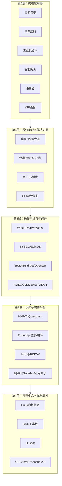
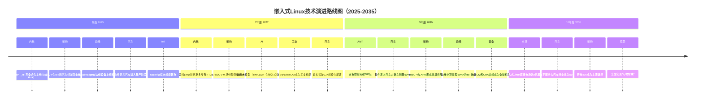

# 第31章 嵌入式Linux行业全景

> **本章定位**：为已具备3-5年嵌入式开发经验的工程师提供一幅完整的行业导航图。不是罗列枯燥的数据，而是帮助你回答三个关键问题——这个行业有多大？钱在哪？我的下一步该往哪走？
>
> **数据基准**：2024-2025年 | **预测周期**：2025-2035年

---

## 31.1 行业概览：市场规模与增长趋势

### 一个"小内核"撬动的千亿市场

嵌入式Linux本身是一个相对"小而精"的直接市场——2025年全球收入约**5.2亿美元**[^1611^]，到2035年预计增长至**9亿美元**，年复合增长率（CAGR）约6.57%。但如果只看这个数字，你会严重低估这个行业的体量。

真正值得关注的是嵌入式Linux所**承载**的市场。作为嵌入式系统的核心操作系统之一，Linux渗透了从路由器到太空卫星的广阔设备谱系。2025年全球嵌入式系统整体市场规模达到**1,147亿美元**[^1618^]，而嵌入式Linux在其中的渗透率约为**44-46%**[^1615^]。这意味着，掌握嵌入式Linux技术，实质上是在一个超过**500亿美元**的终端市场中竞争。

| 市场维度 | 2025年规模 | 2035年预测 | CAGR |
|---------|-----------|-----------|------|
| **嵌入式Linux直接市场** | 5.2亿美元 [^1611^] | 9.0亿美元 | 6.57% |
| **嵌入式计算系统市场** | 1,142亿美元 [^1457^] | 1,870亿美元（2031年） | 8.55% |
| **嵌入式系统整体市场** | 1,147亿美元 [^1618^] | 2,127亿美元（2034年） | 7.10% |
| **Linux操作系统整体市场** | 225亿美元 [^1615^] | 484亿美元（2034年） | 8.87% |

> **关键洞察**：不要只盯着"5.2亿"这个数字。真正衡量嵌入式Linux价值的是它承载的设备数量——全球142亿台联网IoT设备中，约**58%**运行嵌入式Linux[^1611^]，即超过**82亿台**Linux设备在线运行。

### 五大增长驱动力

1. **IoT设备爆发**：全球联网IoT设备2024年突破142亿台[^1611^]，Linux凭借协议丰富度和网络栈成熟度成为网关和边缘设备的首选OS
2. **汽车智能化**：2024年新车中超过**92%**集成嵌入式系统，Linux在汽车中的使用量自2020年增加**37%**[^1611^]
3. **开源成本优势**：无授权费、灵活定制，**47%**的专业开发者选择Linux作为嵌入式平台[^1611^]
4. **边缘计算兴起**：容器化（Docker/K3s）在嵌入式领域的渗透率达到**38%**[^1611^]
5. **政策推动**：美国政府项目中**65%**采用嵌入式Linux等开源软件[^1611^]

### 区域格局：亚太领跑，北美深耕

| 区域 | 2025年市场份额 | 增长特征 |
|------|-------------|---------|
| **亚太地区** | ~46%（增长最快）[^1457^] | 中国/印度制造本地化，嵌入式计算CAGR 12.45% |
| **北美** | 37-41% [^1611^] | 政府项目驱动，汽车电子与医疗设备领先 |
| **欧洲** | ~24% [^1619^] | 工业4.0与汽车电子强势，德国为核心 |

对于中国工程师而言，亚太地区46%的全球份额意味着**主场优势**——全球近半数的嵌入式设备在你所在的时区、使用你熟悉的供应链制造。

### 应用领域分布

嵌入式系统在各领域的应用占比[^1619^]呈现清晰的层次：

```
工业控制与自动化    ████████████████████████████  29%
物联网（IoT）       ████████████████████████      24%
通信与网络          █████████████████████         21%
汽车电子            ███████████████████           19%
消费电子/医疗/AI等   ████████████                  其余
```

工业控制以29%的份额占据最大市场，汽车电子以14.7%的CAGR成为增长最快的领域。物联网虽然分布最广泛（24%），但单点价值较低，依赖规模效应。

---

## 31.2 六大应用领域深度分析

### 31.2.1 消费电子：最成熟的红海

消费电子是嵌入式Linux最成熟的应用领域。智能电视、智能音箱、摄像头、无人机等产品中，Linux凭借多媒体处理能力和零授权费优势占据主导。

| 产品类别 | Linux应用方式 | 典型芯片平台 | 代表厂商 |
|---------|------------|-----------|---------|
| **智能电视/机顶盒** | 完整Linux/Android系统 | Amlogic S905X、RK3566、海思Hi3798 | 小米、海信、TCL |
| **智能音箱** | 轻量Linux + 语音引擎 | 全志R系列、MTK | 亚马逊Echo、Google Home、小爱 |
| **智能摄像头** | 轻量Linux + 视频编码 | 海思Hi35xx、RK35xx | 海康、大华、TP-Link |
| **无人机** | Linux飞控 + 视频处理 | 全志、Ambarella | 大疆DJI |

**技术特征**：内核以3.x-5.x LTS为主，Buildroot是主流构建系统（构建速度快、系统精简），核心追求快速启动（<3秒）和多媒体硬解码加速（V4L2/GStreamer）。安全要求相对宽松，但OTA安全和隐私保护正日益受到监管关注。

**个人发展建议**：消费电子领域入门门槛相对较低，岗位数量多，但竞争激烈且薪资增长空间有限。适合作为积累Linux基础经验的起点，不建议长期深耕——除非进入大疆等头部企业。

### 31.2.2 汽车电子：增长最快的黄金赛道

汽车电子是嵌入式Linux**增长最快、单品价值最高**的细分市场。2024年新车中超过92%集成嵌入式Linux系统[^1611^]，软件定义汽车（SDV）趋势正在重塑整个行业。

**三大核心场景**：

**（1）智能座舱（IVI）**：Android Automotive OS（AAOS）与Automotive Grade Linux（AGL）是两大主流方案。AAOS提供丰富的应用生态和标准化API，适合追求快速上市的OEM；AGL基于Yocto构建，提供最大程度的定制化自由度[^1641^]。在中国市场，华为HarmonyOS车机系统也占据重要份额。

**（2）ADAS/自动驾驶**：功能安全要求达到ASIL-B到ASIL-D级别。系统架构采用AUTOSAR Classic（安全关键）+ Linux（高性能计算）通过Hypervisor隔离的方案[^1643^]，通信协议涵盖SOME/IP、DDS、CAN-FD和Ethernet TSN。

**（3）中央计算/区域架构**：NXP S32K5系列MCU支持软件定义车辆的区域架构，集成MRAM实现15倍快于传统Flash的OTA更新速度[^1700^]。

**技术栈全景**：

```
硬件层：NXP i.MX8/9、高通Snapdragon Ride、瑞萨R-Car、TI Jacinto
虚拟化层：QNX Hypervisor、KVM
操作系统层：QNX（安全关键域）+ Linux（IVI/AI域）
中间件层：ROS2、SOME/IP、DDS、Adaptive AUTOSAR
应用层：导航、语音交互、Qt/Android UI
```

**个人发展建议**：汽车电子是当前嵌入式Linux工程师**薪资最高**的方向（高级岗位可达70-100k/月·16薪[^1689^]），但门槛也高——需要掌握功能安全（ISO 26262）、AUTOSAR、Hypervisor等专业知识。建议有3年以上Linux经验的工程师重点考虑此方向。

### 31.2.3 工业控制：最稳健的基本盘

工业自动化占嵌入式系统市场**36.05%**的收入份额[^1457^]，是嵌入式Linux最大的单一应用领域。工业4.0和智能制造推动了对开放、可扩展工业软件平台的需求。

**核心应用场景与技术需求**：

| 场景 | 技术需求 | Linux角色 |
|------|---------|----------|
| **PLC/工业控制器** | Cycle time < 1ms、可靠性 | 实时Linux + 软PLC（CODESYS） |
| **运动控制** | 高精度同步、EtherCAT主站 | EtherCAT Master on Linux（IgH Stack） |
| **工业网关/边缘计算** | 协议转换、边缘AI、安全防护 | 主控系统，集成多种工业协议 |
| **HMI/工业面板** | 图形界面、触控交互 | Linux + Qt/GTK |
| **工业机器人** | 实时控制、路径规划、视觉 | ROS2 + 实时Linux |

**关键技术——PREEMPT_RT**：将Linux从通用操作系统改造为支持硬实时调度的系统，内核延迟可控制在微秒级。配合TSN（Time-Sensitive Networking）和PTP（IEEE 802.1AS），可实现亚微秒级时钟同步[^1697^]。

**个人发展建议**：工业控制领域需求稳定、职业寿命长，适合追求"越老越值钱"的工程师。实时系统（PREEMPT_RT、Xenomai）和工业通信协议（EtherCAT、OPC UA、Modbus）是核心技术壁垒。

### 31.2.4 物联网（IoT）：最广泛的设备基数

IoT是嵌入式Linux增长的核心驱动力。全球142亿+联网设备中约58%运行嵌入式Linux[^1611^]。嵌入式Linux的核心价值体现在**边缘网关层**[^1646^]——负责协议转换（BLE/Zigbee/LoRa → IP）、边缘AI推理、设备管理和OTA更新。

**关键技术栈**：

| 技术 | 说明 |
|------|------|
| **Matter协议** | 智能家居统一标准，Google/Apple/Amazon联合推动 [^1619^] |
| **MQTT** | 轻量级消息协议，IoT通信事实标准 |
| **容器/微服务** | K3s、KubeEdge实现边缘设备编排 |
| **TinyML** | 在嵌入式设备上运行ML模型 |

**典型硬件平台**：树莓派（39%的开发者使用或计划使用[^1619^]）、NXP i.MX系列（工业级网关首选）、瑞芯微RK3568/RK3588（高性能AI网关）。

### 31.2.5 网络通信：传统强项

从家用路由器到5G基站，Linux是网络通信设备的统治级OS。

| 场景 | Linux角色 | 关键技术 |
|------|----------|---------|
| **家用/企业路由器** | 主流固件基础 | OpenWrt、DD-WRT、pfSense |
| **5G基站** | BBU/CU软件平台 | DPDK、O-RAN、容器化 |
| **白盒交换机** | 交换机OS | ONIE、SONiC（微软开源） |
| **SD-WAN/NFV** | 控制与数据平面 | VPP、FD.io、网络虚拟化 |

OpenWrt是嵌入式Linux在网络领域最成功的发行版之一，始于2004年，支持3000+软件包，是大量商业路由器的底层基础[^1729^][^1732^]。

### 31.2.6 医疗设备：高壁垒高回报

医疗设备是嵌入式Linux**准入门槛最高**的领域。JBF Research调查显示，**50%**的医疗器械制造商正考虑从专有系统迁移到Linux[^1635^]。

| 设备类型 | Linux功能 | IEC 62304安全等级 |
|---------|----------|-----------------|
| **医学影像（MRI/CT/超声）** | 图像采集、处理、显示 | Class B/C |
| **患者监护仪** | 多参数监测、报警、数据记录 | Class C |
| **体外诊断（IVD）** | 样本分析、结果计算 | Class B/C |
| **输液泵/胰岛素泵** | 精确剂量控制 | **Class C**（最高风险） |

医疗嵌入式Linux必须满足IEC 62304软件生命周期标准[^1629^]，Linux作为SOUP（未知来源软件）需进行风险分析和缓解[^1642^]。Yocto是首选构建系统，因其提供完整的许可证合规和SBOM（软件物料清单）生成能力。

**个人发展建议**：医疗设备领域薪资优厚且职业稳定性极高，但合规壁垒（FDA/CE/NMPA认证）意味着转型周期较长（通常6-12个月）。适合有耐心、注重细节的工程师。

---

## 31.3 各领域技术栈对比

### 全景对比表

下表是你在选择技术方向时最直接的参考——它告诉你每个领域"用什么、用什么标准、用什么芯片"。

| 技术维度 | 消费电子 | 汽车电子 | 工业控制 | 物联网 | 网络通信 | 医疗设备 |
|---------|---------|---------|---------|-------|---------|---------|
| **首选内核** | 3.x-5.x LTS | 4.x-6.x LTS | 4.x-6.x RT | 4.x-6.x LTS | 5.x-6.x | 4.x-6.x LTS |
| **构建系统** | Buildroot | Yocto | Yocto/Buildroot | Buildroot/Yocto | Buildroot/OpenWrt | **Yocto** |
| **启动时间** | <3秒 | <5秒 | <10秒 | <15秒 | <30秒 | <20秒 |
| **实时性** | 软实时 | 硬实时（ADAS） | **硬实时** | 软实时 | 软实时 | 软实时 |
| **安全要求** | 中 | **极高（ASIL）** | 高（SIL2/3） | 中高 | 高 | **极高（Class C）** |
| **OTA更新** | 必须 | 必须 | 推荐 | 必须 | 推荐 | **必须（合规）** |
| **容器支持** | 少 | K3s/K8s（SDV） | Docker | K3s/Docker | Docker/K8s | 有限 |
| **UI框架** | Android/Qt | Qt/Android | Qt/GTK | Web UI/CLI | Web UI/CLI | Qt/GTK |
| **主要协议** | WiFi/BLE | CAN/TSN | EtherCAT/OPC UA | MQTT/BLE | TCP/IP/DPDK | BLE/USB |
| **安全机制** | 基础 | Secure Boot+TPM | Secure Boot+IMA | Secure Boot+OTA | SELinux+Firewall | Secure Boot+加密 |
| **代表芯片** | Amlogic S905X | NXP i.MX9、高通Ride | NXP i.MX8、TI AM6x | RK3568、树莓派 | 各类网络处理器 | NXP i.MX8M、TI AM6x |

### 构建系统选型决策

| 特性 | **Buildroot** | **Yocto Project** |
|------|-------------|-----------------|
| 构建方式 | Makefile-based | BitBake（Python+Shell）|
| 包管理 | 无（静态rootfs） | 支持RPM/DEB/IPK |
| 增量构建 | 不支持 | **支持**（缓存中间步骤）|
| 定制化 | 有限 | **极高**（layers、recipes、overrides）|
| 许可证合规 | 基础（手动追踪） | **高级**（SPDX、license审计）|
| 学习曲线 | **低**（1-2周上手） | **高**（3-6个月精通）|
| 构建速度 | **快** | 较慢 |
| **典型应用** | 路由器、IoT固件、消费电子 | 汽车（AGL）、医疗、工业Linux [^1655^] |

> **选型建议**：如果你是个人开发者或项目周期短，选Buildroot；如果你在汽车、医疗等对合规和定制化要求高的行业，必须掌握Yocto。

---

## 31.4 产业链全景图

### 产业链五层模型



### 你在产业链中的位置

作为嵌入式Linux工程师，你主要活动在**第3层和第4层之间**——你的工作是将芯片厂商（第2层）提供的BSP转化为终端产品（第5层）可用的软件系统。

**关键产业趋势**：

1. **软件价值超越硬件**：嵌入式软件收入CAGR（10.05%）已超过硬件（8.55%），预计2031年软件收入将超过硬件收入[^1457^]
2. **订阅制兴起**：OEM越来越多地按容器运行时、更新编排、诊断仪表板收费，从"卖设备"转向"卖服务"
3. **芯片厂商收购OS厂商**：硅片供应商为获取经常性收入流，纷纷收购操作系统供应商

**各环节关键玩家**：

| 产业链环节 | 国际玩家 | 中国玩家 |
|-----------|---------|---------|
| **芯片设计** | NXP、TI、高通、瑞萨、Intel | 海思、瑞芯微、全志、平头哥、兆易创新 |
| **操作系统/发行版** | Wind River、SYSGO、Red Hat | 华为OpenHarmony、阿里AliOS Things |
| **硬件模组** | Toradex、Variscite、CompuLab | 飞凌、正点原子、移远通信、广和通 |
| **终端设备** | 特斯拉、西门子、博世、GE | 华为、海康、大疆、比亚迪、联影医疗 |

---

## 31.5 人才市场分析

### 全球薪资水平（2024-2025年）

| 经验等级 | 美国 [^1714^][^1727^] | 中国一线城市 [^1702^] | 中国新一线城市 [^1702^] |
|---------|---------------------|-------------------|---------------------|
| **初级（0-3年）** | $76,800（~55万/年） | 1.2-2万/月（~18万/年） | 0.8-1.5万/月（~14万/年） |
| **中级（3-5年）** | $111,712（~80万/年） | 2-3.5万/月（~33万/年） | 1.5-2.5万/月（~24万/年） |
| **高级（5-10年）** | $140,057-205,220（~100-148万/年） | 3-5万/月（~48万/年） | 2.5-4万/月（~39万/年） |
| **专家/架构师** | $153,555+（~110万+/年） | 5-8万+/月（~80万+/年） | 4-6万/月（~60万/年） |

> **注**：中国顶级企业（华为2012实验室、大疆核心研发、蔚来自动驾驶等）的高级嵌入式Linux工程师年薪可达**50-100万**[^1702^]。汽车自动驾驶领域的Linux工程师薪资最高，顶级岗位可达**70-100k/月·16薪**[^1689^]。

### 领域薪资差异（中国市场）

| 应用领域 | 平均月薪范围（中级3-5年） | 薪资溢价因素 |
|---------|----------------------|------------|
| **汽车电子（自动驾驶）** | 35k-60k/月 | 功能安全+AUTOSAR+稀缺性 |
| **医疗设备** | 25k-45k/月 | 合规壁垒+长周期认证 |
| **工业控制** | 20k-40k/月 | 实时系统+工业协议深度 |
| **网络通信** | 18k-35k/月 | DPDK/高性能网络栈 |
| **消费电子** | 15k-30k/月 | 竞争激烈，技术门槛相对较低 |
| **通用IoT** | 15k-28k/月 | 分布广泛但单点价值低 |

### 高薪技能溢价（2025年）

| 技能方向 | 薪资溢价 | 说明 |
|---------|---------|------|
| **边缘AI部署**（TensorFlow Lite Micro、NPU驱动） | **+30%以上** [^1702^] | AI+嵌入式交叉人才极度稀缺 |
| **汽车功能安全**（ISO 26262 + AUTOSAR） | **+40-60%** | 认证周期长，合格人才少 |
| **RISC-V生态开发** | **+25-35%** | 平头哥等厂商抢人阶段 |
| **多传感器融合**（IMU+LiDAR+视觉） | **+20-30%** [^1702^] | 自动驾驶核心能力 |
| **PREEMPT_RT实时系统** | **+15-25%** | 工业领域刚需 |

### 技能需求趋势：现在该学什么？

**基础必备（任何方向都需要）**[^1694^][^1698^]：

| 技能类别 | 具体要求 |
|---------|---------|
| **编程语言** | C/C++（精通）、Python（自动化/测试）、Shell |
| **操作系统** | Linux内核裁剪、驱动开发、多线程/网络编程 |
| **构建系统** | 至少精通Yocto或Buildroot其一，了解两者差异 |
| **硬件接口** | GPIO/PWM/ADC/I2C/SPI/UART/USB/Ethernet |
| **调试工具** | GDB、J-Link/OpenOCD、逻辑分析仪、示波器 |

**进阶高薪方向（选择一个深耕）**：

| 方向 | 技能要求 | 适合人群 |
|------|---------|---------|
| **实时系统** | PREEMPT_RT、Xenomai、EtherCAT主站开发 | 工业控制方向 |
| **安全专家** | Secure Boot、SELinux、OTA安全、加密、SBOM | 医疗/汽车方向 |
| **容器/云原生** | Docker、K3s、KubeEdge、MQTT/Kafka | IoT/边缘计算方向 |
| **AI边缘** | TensorFlow Lite、PyTorch Mobile、NPU部署 | 所有方向（横向能力） |
| **汽车电子** | AUTOSAR、功能安全（ISO 26262）、SOME/IP | 追求高薪 |

---

## 31.6 2025-2035技术路线图

### 十年技术演进时间线



### 十大关键趋势速览

1. **RISC-V成为主流架构**：预计2025年RISC-V核心出货量超200亿[^1415^]，在汽车和数据中心领域增长最快，CAGR达10.73%[^1457^]
2. **AI无处不在**：嵌入式AI占先进技术关注度的50%[^1619^]，边缘AI部署CAGR达11.02%[^1457^]
3. **软件定义汽车**：数字和软件收入占汽车行业总收入比将从15%上升至**51%**（到2035年）[^1696^]
4. **实时Linux全面成熟**：PREEMPT_RT已合并主线，在工业和汽车领域替代专有RTOS
5. **安全成为第一优先级**：欧盟《网络韧性法案》（CRA）要求全生命周期安全管理[^1706^]，SBOM成为合规必需品[^1703^]
6. **边缘云原生化**：容器化在嵌入式设备上成为常态，Linux从"设备OS"进化为"边缘计算平台"
7. **中国市场崛起**：亚太贡献全球46%的嵌入式计算销售额[^1457^]，国产替代加速
8. **容器化与虚拟化普及**：Hypervisor实现多OS隔离，在汽车功能安全和工业多租户场景中快速渗透
9. **开源硬件-软件协同**：RISC-V开放ISA允许真正的硬件-软件协同设计[^1649^]
10. **人才两极分化**：初级岗位竞争加剧，高级复合型人才（AI+嵌入式+行业知识）供不应求[^1701^]

### 给有经验工程师的行动建议

**两条核心发展路径**[^1694^]：

**路径A：深度技术专家**
- 深耕Linux内核/驱动/实时系统，成为细分领域的顶级专家
- 持续跟踪内核社区（LKML）、参与开源项目贡献
- 向系统架构师方向发展，年薪可达50-100万

**路径B：行业解决方案专家**
- 选择一个垂直领域（汽车/工业/医疗/IoT）深耕到底
- 掌握行业协议、安全标准、产品全生命周期
- 成为"技术+业务"的复合型人才

**2025年热门就业领域排序**[^1701^]：

| 优先级 | 领域 | 核心理由 |
|-------|------|---------|
| ⭐⭐⭐⭐⭐ | 新能源汽车（BMS/电控/智能座舱） | 薪资最高、增长最快、政策支持 |
| ⭐⭐⭐⭐ | 医疗设备嵌入式系统 | 高合规壁垒、薪资优厚、职业稳定 |
| ⭐⭐⭐⭐ | 工业4.0/边缘计算 | 政策支持、长期需求、技术深度高 |
| ⭐⭐⭐ | AIoT/智能家居 | 创新活跃、岗位最多、入门友好 |

---

> **本章结语**：嵌入式Linux正处于历史上最广阔的发展阶段。从82亿台在线设备到每年超过1,100亿美元的终端市场，这个"小内核"承载的产业规模远超大多数人的想象。对于拥有3-5年经验的工程师而言，真正的挑战不是"有没有机会"，而是"选择哪个方向深耕"。汽车电子有最高的薪资天花板，工业控制有最稳的职业基本盘，医疗设备有最强的准入壁垒。无论选择哪条路，保持对AI、RISC-V、安全和容器化这四股技术浪潮的敏感度，将是你未来十年最值钱的能力。

---

## 参考来源

| 编号 | 来源 | 内容摘要 |
|------|------|---------|
| [^1611^] | Business Research Insights | 嵌入式Linux市场规模与增长数据 |
| [^1457^] | Mordor Intelligence | 嵌入式计算系统市场分析 |
| [^1615^] | Market Growth Reports | Linux操作系统整体市场 |
| [^1618^] | Fortune Business Insights | 嵌入式系统整体市场 |
| [^1619^] | ElectroIQ | 嵌入式系统统计数据2025 |
| [^1629^] | Jama Software | IEC 62304医疗软件标准 |
| [^1635^] | ICS | Linux在医疗设备中的优势分析 |
| [^1641^] | Pempcar | AGL vs Android Automotive架构对比 |
| [^1643^] | Elektrobit | AUTOSAR与Android Automotive融合 |
| [^1696^] | IBM | 软件定义汽车（SDV）概念与特征 |
| [^1697^] | Pengutronix | PREEMPT_RT与TSN实时演示 |
| [^1700^] | SemiMedia | NXP S32K5 MCU推动区域SDV架构 |
| [^1702^] | CSDN | 2025嵌入式工程师薪资榜 |
| [^1703^] | L4B Software | 嵌入式Linux安全分析 |
| [^1706^] | SYSGO | ELinOS与网络韧性法案（CRA）合规 |
| [^1689^] | Liepin | 中国Linux嵌入式开发工程师招聘数据 |
| [^1694^] | WeChat/玩点嵌入式 | 嵌入式开发操作系统就业分析 |
| [^1415^] | ARiGS | 2025年嵌入式系统五大变革趋势 |
| [^1649^] | Embedded School | 嵌入式系统创新未来趋势 |
| [^1701^] | XGKGuide | 2025嵌入式技术应用专业就业指南 |

---

*本章数据截止：2025年Q2 | 免责声明：市场数据因统计口径不同可能存在差异，仅供参考。*
