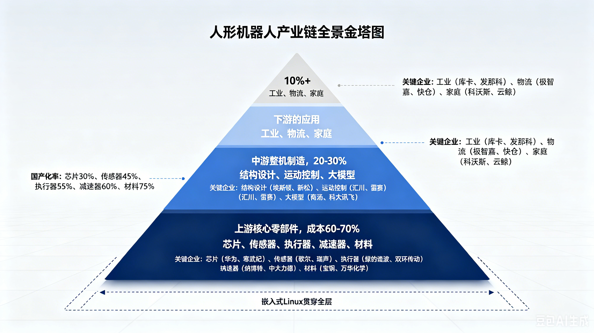
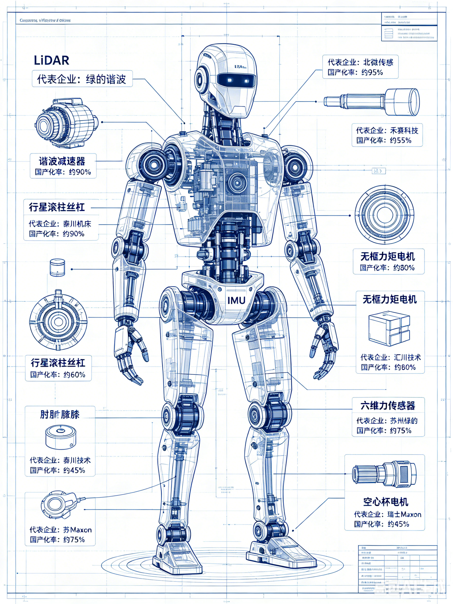
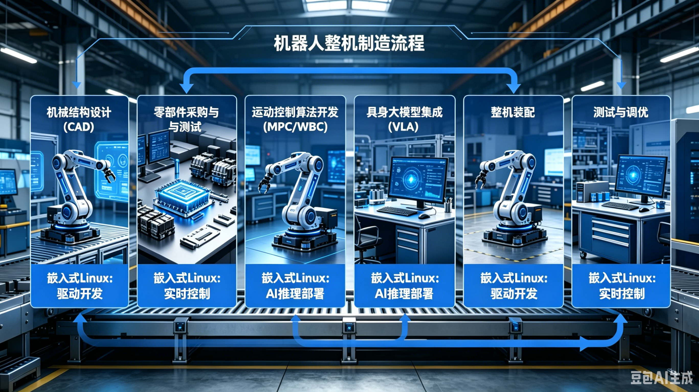
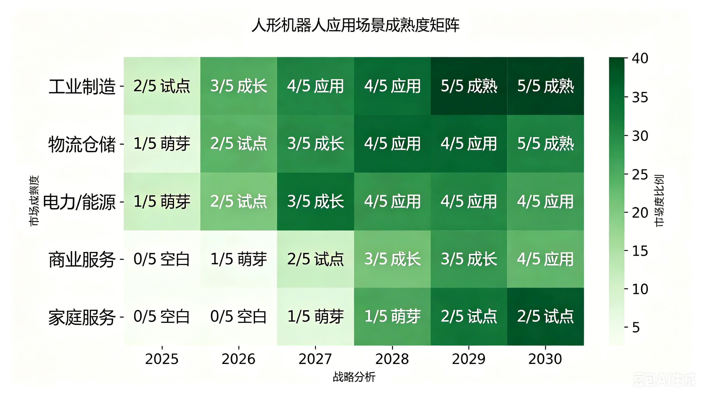
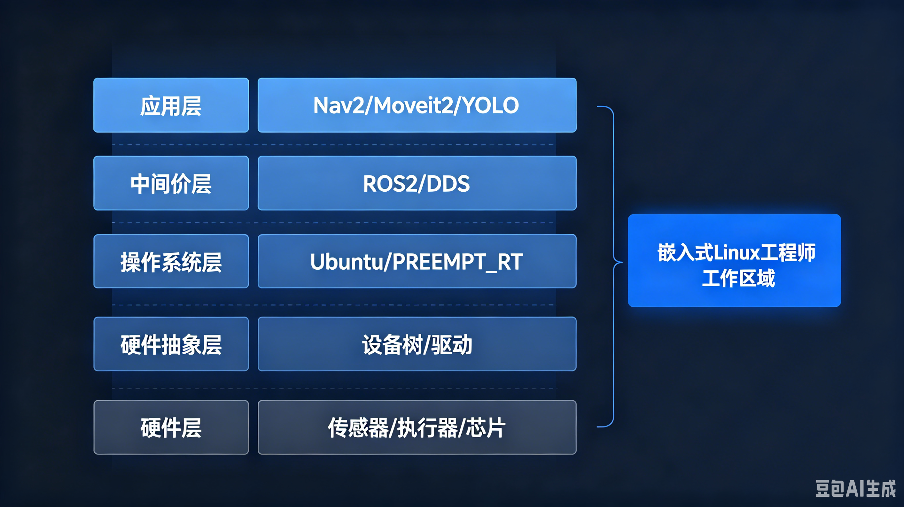
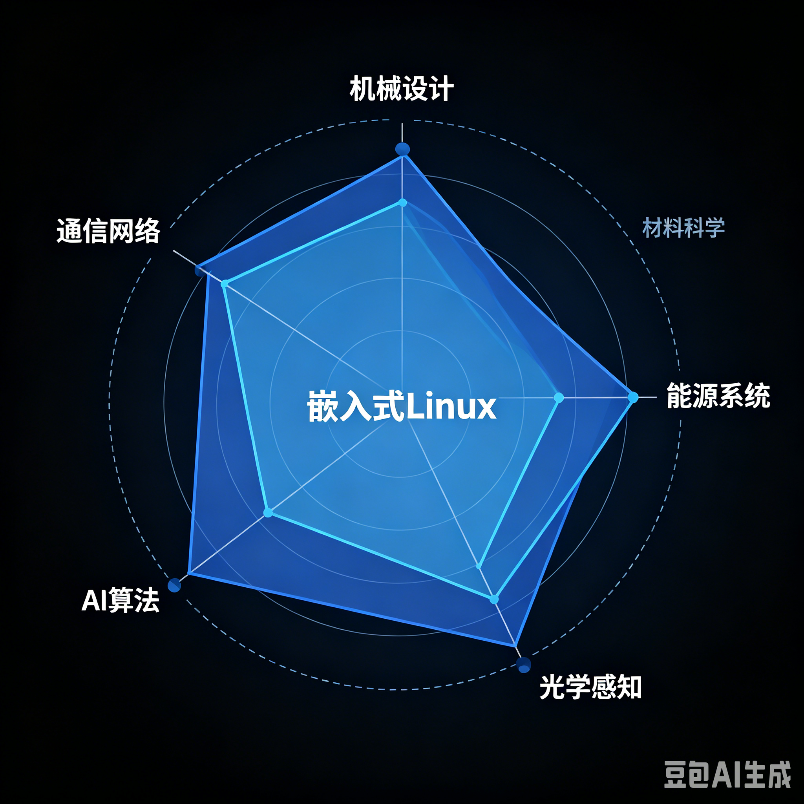
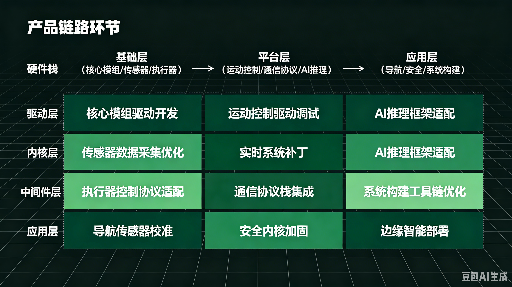
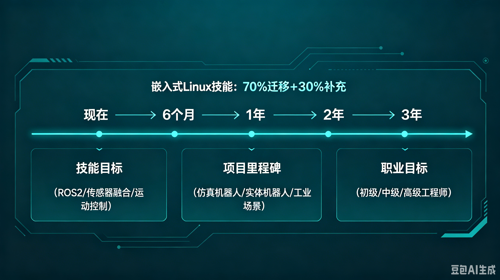
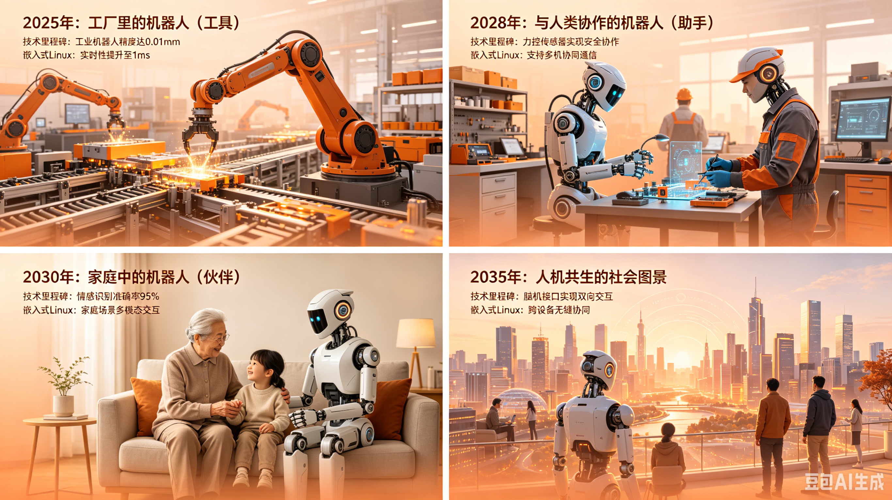

# 第32章 具身智能与机器人革命——嵌入式工程师的入局指南

> 所属章节：第32章 具身智能与机器人革命
> 
> 预计阅读时间：45分钟

---

## 32.1 从ChatGPT到Optimus：AI的物理化


2022年11月，ChatGPT的发布让世界见识了生成式AI在数字空间中的惊人能力。它能在几秒内写出一篇结构完整的论文，能根据描述生成从未存在的图像，甚至能编写可运行的代码。但有一个根本性的局限始终存在：它活在服务器里，隔着屏幕与你互动，永远无法拧下一颗螺丝，永远无法给老人递一杯水。它是"知道一切"的博学之士，却是"什么也做不了"的囚徒。

具身智能（Embodied Intelligence）的核心理念，正是要打破这个牢笼。它主张：智能的本质不是纯粹的符号运算，而是身体与环境的持续交互。当一个AI系统拥有物理形态——能够感知三维空间、执行机械动作、承受物理反馈——它就从"工具"变成了"行动者"。大语言模型（LLM）赋予机器人"理解"的能力，而具身智能赋予它"执行"的能力。这二者的结合，不是简单的功能叠加，而是AI发展史上的一次范式跃迁：从"知道"到"做到"的跨越。

大模型+身体=可以执行物理任务的智能体。这个公式的威力在2025年开始全面显现。2025年，全球人形机器人出货量达到1.8万台，同比增长650%。这不是平稳的增长曲线，而是指数级爆发的开端。2026年，中国市场出货量预计攀升至6.25万台（高工机器人/开源证券数据）。摩根士丹利在2025年底的报告中指出，这一年全球出货的90%由中国制造商生产。中国不再只是世界工厂，而是正在成为人形机器人的"制造心脏"。

从时间维度来看，这个产业的节奏正在清晰呈现：2025年是量产元年，核心企业从实验室走向工厂产线；2026年是规模化元年，头部厂商开始建设万台级产能；2027年则是商业化元年，B端场景开始产生正向现金流。高盛在2025年中期的预测给出了更保守但更具说服力的数字：全球出货1.3-1.6万台，其中约90%来自中国。无论采用哪个口径，中国在全球人形机器人产业中的主导地位已经确立。

2025年的中国本土市场同样火热。中国人形机器人市场收入达到82亿元人民币，专利申请数量高达1174项，同比增长89.7%。截至2025年12月，智元机器人累计下线5000台。宇树科技在2025年推出G1人形机器人，售价9.9万元人民币，核心部件国产化率已达75%。优必选Walker系列获得13亿元订单，虽然累计亏损43亿元，但Walker S2全场景收入达到8.2亿元，同比增长2200%。特斯拉Optimus在2025年量产数千台，2026年的目标是5至10万台，其在弗里蒙特工厂的专用产线已于2026年底启动建设，长期目标直指年产100万台。

这个行业的远期前景更为惊人。Fortune Business Insights预测，到2034年，全球人形机器人市场规模将达到815至1650亿美元，复合年增长率（CAGR）高达50%。中国市场的CAGR为50%，美国为42%。这意味着，未来十年，我们面对的是一个人类历史上增长速度最快之一的硬件产业。

> 💡 对嵌入式工程师而言，机器人本质上就是一个运行Linux的复杂嵌入式系统。你的驱动开发经验、实时调优技能、系统裁剪能力——这些在这个新行业中不是"锦上添花"，而是"基础设施"。每一台机器人内部都有多颗处理器运行着Linux，从底层的关节电机控制到顶层的AI推理，Linux贯穿始终。你不需要从零开始学习一个全新的技术栈，你需要的只是在现有技能基础上，向机器人学、运动控制、传感器融合等方向扩展。

如果将历史作为参照，2007年iPhone的发布重新定义了消费电子，开启了移动互联网的黄金时代。2025年人形机器人的量产，则可能重新定义"劳动本身"。当机器人能够完成80%的装配线重复劳动、实现24小时不间断的仓储搬运、在老龄化社会中提供照护服务——它改变的不是某个单一行业，而是人类生产力的底层结构。这不是科幻，而是正在发生的现实。2026年1月，宇树发布的H2训练视频展示了飞踢、空翻、踢沙袋等高难度动作；同月，智元推出启元Q1，一款可以收纳进背包的便携人形机器人。技术突破的速度远超大多数人的预期。

> ⚠️ 值得注意的是，这个行业的爆发不是没有代价的。宇树科技的毛利率约为18%，优必选累计亏损43亿元。高增长率背后是高投入、高风险的产业特征。对嵌入式工程师来说，这意味着选择正确的企业、正确的环节进入，比盲目追逐热度更重要。

---

## 32.2 产业链全景：从芯片到应用



人形机器人产业链可以清晰地划分为三层：上游零部件、中游整机制造、下游应用服务。这个结构看起来并不复杂，但每一层内部的竞争格局、技术壁垒和利润空间都有天壤之别。理解这个全景图，是每一个嵌入式工程师做出职业选择的前提。

**上游是核心价值区。** <br>核心零部件占整机成本的60%至70%，是产业链中利润最丰厚、技术壁垒最高的环节。特斯拉Optimus Gen2的成本结构提供了最具代表性的参考：行星滚柱丝杠占19%、无框力矩电机占16%、减速器占13%、六维力传感器占11%、空心杯电机占8%、轴承占5.5%。执行端（电机、丝杠、减速器、传感器）合计接近整机成本的50%。这解释了为什么2026年超过70%的资金流向了上游零部件环节——包括减速器、丝杠、电机、传感器。上游是"最确定的受益环节"。

在上游，国产化替代正在快速推进。此前被欧洲和日本企业垄断的行星滚柱丝杠领域，国产供应商已经开始切入。减速器方面，2026年国产化率预计达到40%至50%。传感器领域，奥比中光在3D视觉市场占有率高达70%。这些数字意味着，上游零部件不仅是国产替代的核心战场，也是嵌入式Linux工程师能够直接创造价值的领域——因为每一个零部件都需要驱动程序、接口协议和信号处理。

**中游是集成能力区。** <br>整机制造占成本的20%至30%。这里的核心能力不是简单的组装，而是系统级优化：如何将数十个零部件整合为一个协调运动的系统，如何让具身大模型与机械结构高效配合，如何在成本、性能、可靠性之间找到最佳平衡点。中游的价值在于"集成红利"——不是创造单个零部件，而是让它们协同工作。

中游的竞争格局呈现三足鼎立之势：宇树科技以极致的成本控制著称，其G1售价9.9万元，核心部件国产化率75%，海外业绩占比50%，被业内称为"成本杀手"；优必选则在商业化落地上领先，Walker S2获得13亿元订单，全场景收入8.2亿元；智元机器人在技术生态上布局最深，2025年营收超过10.5亿元，全品类出货突破1万台。此外，星动纪元在物流领域取得突破，已落地中国邮政、顺丰等10余个物流中心，2026年第二季度开启千台级交付。傅利叶智能深耕康复与工业场景，众擎机器人仅巡逻巡检的意向订单就超过3000台。

从地理分布来看，中国的机器人产业呈现出高度集聚的特征。华东地区占比47.6%，以上海和长三角为核心。上海汇聚了智元、傅利叶、开普勒等整机厂；深圳则是优必选、众擎、乐聚的总部所在地，同时背靠华为盘古和腾讯混元大模型。长三角地区拥有最完整的供应链配套，从绿的谐波的减速器到鸣志电器的电机，上下游协同效率极高。

**下游是场景验证区。** <br>应用服务占成本的10%以上，但这里指的是硬件成本占比。如果考虑服务收入、软件订阅、运维费用，下游的市场空间可能远超上游。下游的核心逻辑是"场景为王"——谁能找到最先产生正向现金流的场景，谁就能在中游的血海竞争中活下来。当前来看，工业制造（3C/汽车装配、搬运、质检）是确定性最高的场景，国家电网在2025年已下达68亿元订单；物流仓储紧随其后，京东物流和顺丰科技正在大规模测试；商业服务（商超导购、酒店接待、咖啡售卖）开始小规模试点；家庭服务则是5至10年后的远期目标，美的和小米已有布局。2026年，特斯拉的目标是将家用机器人单价降至1万美元，这是一个重要的心理关口。

> 💡 **嵌入式Linux贯穿产业链全层。** <br>在上游，你需要编写芯片驱动、传感器接口和电机控制程序；在中游，你需要运行ROS2、实现实时运动控制和具身大模型部署；在下游，你需要处理边缘AI推理、导航算法和OTA升级。从产业链的角度看，嵌入式Linux工程师不是"某个环节的人才"，而是"全层通用型人才"。你的技能迁移成本极低，这意味着你可以在产业链上下游之间灵活切换，找到最适合自己的位置。

---

## 32.3 上游硬科技：执行器、传感器、减速器、材料



如果说人形机器人是一台复杂的交响乐，那么上游零部件就是其中的每一件乐器。乐队的指挥（嵌入式Linux）再出色，如果乐器本身质量不行，演奏出来的也只能是噪音。本章将深入拆解每一个核心零部件，不仅讲清楚技术原理，更要告诉嵌入式工程师：在哪里，你的代码能够直接改变产品的性能。

### 丝杠（占整机成本19%）

丝杠是机器人执行直线运动的核心传动部件。它的功能是将电机的旋转运动转化为直线运动，这个过程听起来简单，但要实现微米级的精度、数万小时的寿命和紧凑的体积，是精密制造领域的顶级难题。特斯拉Optimus Gen2中，丝杠占整机成本的19%，是成本最高的单一零部件类别。

行星滚柱丝杠（Planetary Roller Screw）是当前人形机器人的主流选择。与传统的滚珠丝杠相比，滚柱丝杠的承载能力更强、寿命更长，更适合机器人关节这种高动态负载场景。特斯拉第三代灵巧手采用了"腱绳+丝杠"的复合传动方案，将13个执行器集成在手掌大小的空间内，这在机械设计上堪称奇迹。

在国产供应链中，竞争格局正在快速形成：

- **五洲新春**：小鹏IRON机器人的丝杠供应商，2025年订单超过12亿元，是国内最先实现大规模交付的丝杠企业之一。
- **震裕科技**：特斯拉Tier1供应商，产品精度达到C3级，这是工业丝杠中的最高精度等级。
- **双林股份**：国内唯一拥有全产业链技术的丝杠企业，同时为特斯拉和小米供货。
- **秦川机床**：国内唯一实现行星滚柱丝杠量产的企业，背靠机床行业的精密制造能力。
- **中大力德**：宇树科技的主力供应商，单台机器人需要20至40个丝杠，订单量极为可观。
- **夏厦精密**：在反向式行星滚柱丝杠上取得突破，将价格压降至千元级，对成本敏感的整机厂极具吸引力。

此前的行星滚柱丝杠市场被欧洲的Rollvis、GSA和瑞典的SKF垄断，价格高昂且交货周期长。国产替代不仅意味着成本下降，更意味着供应链安全。对于嵌入式Linux工程师来说，丝杠本身虽然是机械部件，但每一个丝杠都需要编码器来反馈位置、需要伺服电机来驱动、需要控制器来执行闭环算法。你的驱动代码，决定了丝杠能否达到标称精度。

### 减速器（占整机成本13%）

减速器是机器人关节的"肌肉骨骼系统"，用于降低电机转速、提高输出扭矩。单台人形机器人需要12至40个减速器，分布在肩、肘、腕、髋、膝、踝等关节。2026年，减速器国产化率预计达到40%至50%。

减速器主要分为两种技术路线：

**谐波减速器（Harmonic Drive）** <br>适用于轻负载旋转关节，如手腕和脚踝。它的核心原理是利用柔性齿轮的弹性变形来传递运动，结构紧凑、传动精度极高。绿的谐波是全球谐波减速器的主要供应商，全球市场占有率约15%，在国内市场更是占据25%至30%的份额。特斯拉订单占绿的谐波营收的25%，2026年其产能规划达到150万台套。谐波减速器的技术壁垒在于材料、热处理工艺和齿形设计，日本哈默纳科（Harmonic Drive Systems）长期垄断高端市场，但绿的谐波正在快速缩小差距。

**RV减速器（Rotary Vector）** <br>适用于高扭矩关节，如肩部和髋部。相比谐波减速器，RV减速器的承载能力更强，但体积更大、成本更高。双环传动是国产RV减速器的龙头企业，在国内市场占有率约14%。2025年第一季度，双环传动进入特斯拉PVT（产品验证测试）阶段，这意味着其产品已经通过了特斯拉最严格的验证标准。

从嵌入式Linux工程师的角度看，每个减速器后面都跟着一个伺服电机，每个伺服电机都通过CAN总线与主控制器通信。你需要编写CAN总线驱动程序、实现电机FOC（磁场定向控制）算法、处理编码器反馈数据。控制周期通常在1毫秒以内，任何通信延迟或抖动都会直接转化为关节的运动误差。

### 无框力矩电机（占整机成本16%）

无框力矩电机（Frameless Torque Motor）是一种直接驱动电机，没有传统电机的外壳和轴承，可以直接嵌入到机器人关节内部，实现最高的功率密度和最快的动态响应。它是人形机器人关节设计的核心部件，占整机成本的16%。

- **鸣志电器**：波士顿动力Atlas机器人电机的独家供应商，同时也进入特斯拉Optimus供应链。鸣志电器的核心优势在于空心杯电机和无框力矩电机的双产品线。
- **江苏雷利**：在无框电机市场占有率超过40%，是国内最大的无框电机供应商之一。
- **雷赛智能**：无框电机市场占有率约50%，同时是小米的供应商。雷赛智能在电机驱动控制算法上有深厚积累。
- **步科股份**：国内无框力矩电机市场占有率接近50%，在机器人关节模组领域有完整的产品线。

电机控制是嵌入式Linux工程师最熟悉的领域之一。无框力矩电机需要高精度的电流控制、位置控制和力矩控制。Linux系统通过PWM信号控制电机驱动器，通过ADC读取电流传感器，通过编码器接口获取转子位置，最终在实时任务中运行FOC算法。这些工作对实时性要求极高，通常需要PREEMPT_RT或Xenomai补丁来确保控制周期稳定。

### 空心杯电机（占整机成本8%）

空心杯电机（Coreless Motor）因其转子无铁芯而得名，具有轻量化、低功耗、高响应速度的特点，是机器人灵巧手（多指手）的首选驱动方案。特斯拉Optimus的灵巧手就采用了空心杯电机方案。单台人形机器人的灵巧手需要6至12个空心杯电机，用于驱动每个手指的独立运动。

- **鼎智科技**：特斯拉Optimus灵巧手空心杯电机的适配供应商。其产品在微型化和高功率密度上达到了国际领先水平。
- **鸣志电器**：同样具备空心杯电机量产能力，产品线覆盖从微型到中型各种规格。

对于嵌入式Linux工程师，灵巧手的控制是极具挑战性的任务。每个手指都有独立的电机、位置传感器和力传感器，需要实现多轴协调控制和精细力控制。手部与主控制器之间通常通过CAN总线或EtherCAT通信，实时性要求与腿部关节同样严格。

### 六维力传感器（占整机成本11%）

六维力传感器（6-Axis Force/Torque Sensor）能够同时测量三个方向的力和三个方向的力矩，是机器人实现力控制和柔顺操作的关键。当机器人需要抓取一个易碎物体、或者需要感知与环境的接触力时，六维力传感器提供的数据是控制算法的基础输入。它占整机成本的11%，但技术壁垒极高，此前长期被美国的ATI和德国的Kistler垄断。

- **柯力传感**：国内唯一实现六维力传感器量产的企业，精度对标美国ATI，已进入特斯拉小批量供货阶段。其产品在工业机器人领域已有大量应用验证。
- **安培龙**：精度达到0.05%，成为特斯拉Optimus Gen3的专供供应商。安培龙在MEMS传感器领域有深厚的技术积累。
- **坤维科技**：另一家国内六维力传感器企业，产品覆盖工业和科研市场。

六维力传感器通常通过模拟电压或数字接口（如SPI、I2C）输出数据。嵌入式Linux工程师需要编写ADC驱动程序、实现信号滤波算法（如卡尔曼滤波），并在实时控制循环中实现力矩前馈控制和安全碰撞检测。力传感器的采样精度直接决定了机器人能否完成精细操作任务——如拧螺丝时的力度控制、与人接触时的安全保护。

### 3D视觉与LiDAR

机器人的感知系统是其理解环境的"眼睛"。3D视觉（深度相机）和LiDAR（激光雷达）是两种主流方案，前者提供稠密的深度图像，后者提供精确的三维点云。两者常常结合使用，互为补充。

- **奥比中光**：中国3D视觉传感器市场占有率高达70%，是小鹏IRON机器人的供应商。奥比中光的产品覆盖结构光、ToF、双目等多种技术路线。
- **禾赛科技**：全球领先的LiDAR企业，其产品不仅在自动驾驶领域广泛应用，也开始进入机器人感知领域。LiDAR在机器人上的应用主要是环境扫描和导航避障，但成本较3D视觉更高。

嵌入式Linux工程师在感知系统中的角色至关重要。你需要编写V4L2（Video for Linux 2）驱动来支持深度相机，编写点云处理程序来解析LiDAR数据，实现相机标定算法来消除镜头畸变，并在ROS2框架中将感知数据发布为标准化话题。机器人对感知系统的延迟极为敏感——导航时的障碍物检测必须在100毫秒以内完成，否则可能发生碰撞。

### 触觉传感器

如果说3D视觉是机器人的"远距视觉"，触觉传感器就是它的"近距触觉"。当机器人手指接触物体时，触觉传感器能够感知压力分布、纹理、温度甚至滑动，这些信息对于精细抓取和操作至关重要。

- **汉威科技**：全球唯三实现柔性触觉传感器量产的企业，产品已送样特斯拉和优必选。汉威科技的传感器基于柔性电子材料，可以贴合在机器人手指表面，提供类似人类皮肤的触觉感知能力。

嵌入式Linux工程师在触觉传感系统中的角色包括：编写I2C或SPI驱动来读取传感器数据、实现触觉数据处理算法（如压力分布图生成、滑动检测）、将触觉信息与视觉信息融合以优化抓取策略。触觉传感器的数据带宽通常不高，但对实时性和可靠性的要求极高——一次触觉信号的丢失可能导致抓取失败或物体损坏。

### 编码器与IMU

编码器（Encoder）用于测量电机转子的位置，是闭环控制的基础。IMU（惯性测量单元，Inertial Measurement Unit）包含加速度计和陀螺仪，用于测量机器人的姿态和角速度，是导航和平衡控制的核心传感器。

- **芯动联科**：国产MEMS陀螺仪的领军企业，其产品的零偏稳定性≤0.1°/h，这一指标达到了战术级精度。芯动联科的毛利率高达84.77%，体现了高技术壁垒带来的定价权。
- **华依科技**：智元机器人的IMU独家供应商，产品在机器人运动控制中得到了充分验证。

编码器和IMU是嵌入式Linux工程师最熟悉的传感器类型。编码器信号通常通过正交解码接口（QEP）或SPI读取，IMU通常通过I2C或SPI接口通信。你需要编写底层驱动、实现信号滤波、处理传感器数据融合，并在实时控制循环中提供精确的状态估计。

### 轻量化材料

人形机器人的重量直接影响其续航能力和运动性能。在保持结构强度的前提下尽可能减重，是机械设计的核心目标之一。轻量化材料的选择对整机性能有决定性影响。

- **碳纤维**：中复神鹰是国内碳纤维行业的龙头企业，其产品用于机器人臂杆和腿部结构，比铝合金轻40%以上，但强度更高。
- **钛合金**：宝钛股份是国内最大的钛合金生产企业，钛合金在机器人关节和连接件中有重要应用，兼具高强度和耐腐蚀性。
- **稀土永磁**：北方稀土和中科三环是稀土永磁材料的主要供应商，这是电机产生磁场的核心材料。稀土永磁的性能直接决定了电机的功率密度和效率。

虽然轻量化材料本身不是嵌入式Linux的直接领域，但材料上的应力传感器、温度传感器需要驱动程序，机器人整体的热管理也需要嵌入式系统监控。更重要的是，理解材料特性有助于你在系统层面做出更合理的重量和功耗优化决策。

### 芯片与计算平台

芯片是机器人的"大脑"。人形机器人通常采用异构计算架构：高性能SoC（片上系统）运行AI推理和高层决策，实时MCU（微控制器）运行电机控制，两者之间通过高速总线通信。

- **英伟达Jetson系列**：Orin NX和Orin Nano是机器人边缘AI推理的首选平台，支持CUDA和TensorRT，能够高效运行YOLO、分割模型等视觉算法。Jetson平台运行Linux，是嵌入式工程师最熟悉的开发环境之一。
- **地平线**：国产边缘AI芯片的代表，征程系列在自动驾驶领域验证后，正快速进入机器人领域。地平线的工具链支持ONNX和TensorFlow模型部署。
- **寒武纪**：国产AI芯片的另一位重要玩家，思元系列在云端和边缘都有布局。
- **华为昇腾**：华为昇腾310/910系列芯片搭载于华为Atlas系列开发板，配合MindSpore框架，提供从训练到推理的全栈国产方案。
- **i.MX8系列**：NXP的i.MX8是工业级嵌入式处理器的主流选择，在实时性、可靠性和功耗控制上有很好的平衡，常用于运动控制器和网关设备。

在芯片层面，嵌入式Linux工程师的核心价值在于：编写GPU/NPU驱动程序、实现DMA内存管理、优化TensorRT/ACL（ARM Compute Library）推理性能、处理多核CPU的任务调度。芯片不是买来就能用的——每一颗AI芯片都需要经过板级支持包（BSP）的开发、内核驱动的移植和推理框架的优化，这些正是嵌入式Linux工程师的核心技能。

> 💡 **对嵌入式工程师的直白总结**：上游零部件是"最确定的受益环节"。2026年超过70%的资金流向减速器、丝杠、电机和传感器。这是国产替代的核心战场，也是你直接产生价值的舞台。每一个零部件背后都需要驱动程序、通信协议、信号处理和控制算法——这些正是你的老本行。你不需要成为机械专家，但你需要理解机械特性如何转化为软件需求。丝杠的精度要求决定了编码器驱动的采样精度，电机的动态响应决定了控制循环的周期，传感器的信噪比决定了滤波算法的复杂度。你的代码质量，直接影响硬件性能的上限。

---

## 32.4 中游：整机集成与运动控制



如果上游零部件是乐器的零件，中游整机厂就是交响乐团的指挥和演奏者。它们不生产单个零件，但决定了这些零件能否奏出和谐的音乐。整机集成不是简单的组装——它是系统级优化，需要在机械结构、电气系统、控制算法、AI模型和软件栈之间找到最优平衡点。一台优秀的人形机器人，其价值远大于零部件的简单加总。

### 整机厂的竞争格局

当前人形机器人整机市场呈现多元化竞争态势，各家厂商根据技术路线和商业模式形成了差异化定位：

**宇树科技（Unitree）——成本杀手**：<br>宇树的核心竞争力在于极致的成本控制和供应链整合能力。其G1人形机器人售价9.9万元人民币，核心部件国产化率75%，海外业绩占比50%。2026年，宇树的目标出货量达到1至2万台。宇树在2026年1月发布的H2训练视频中展示了飞踢、空翻、踢沙袋等高难度动作，证明了其运动控制算法的前沿性。宇树已开源VLA大模型，采取"硬件赚钱+软件开源"的策略，试图建立开发者生态。

**优必选（UBTECH）——商业化领先**：<br>优必选是中国人形机器人商业化落地的标杆企业。Walker S2获得13亿元订单，虽然累计亏损43亿元，但Walker全场景收入在2025年达到8.2亿元，同比增长2200%。月产300台的产能虽然在整机厂中不算最大，但商业化程度最深。优必选的优势在于教育、服务和工业场景的长期积累。

**智元机器人（Agibot）——技术生态**：<br>智元由华为"天才少年"彭志辉创立，以技术开放和生态建设为核心战略。2025年营收超过10.5亿元，全品类出货突破1万台。截至2025年12月，累计下线5000台。2026年1月推出启元Q1，一款可收纳进背包的便携人形机器人，瞄准消费级市场。智元在具身大模型上投入巨大，其技术路线以真机数据采集为主。

**星动纪元（Star1）——物流深耕**：<br>星动纪元专注于物流仓储场景，已落地中国邮政、顺丰等10余个物流中心，2026年第二季度开启千台级交付。其策略是"单点突破"——先在物流领域建立产品和数据的壁垒，再向其他场景扩展。

**其他重要玩家**：Figure AI（美国，OpenAI和微软投资）、傅利叶智能（康复+工业）、众擎机器人（仅巡逻巡检意向订单超3000台）、小米（CyberOne，依托生态链优势）、越疆科技（协作机器人向人形扩展）。

### 具身大模型三条路线

具身大模型（Embodied Foundation Model）是机器人智能化的核心。它解决的问题是：如何让机器人理解自然语言指令，将其转化为可执行的物理动作。当前存在三条主要技术路线，每条路线都有头部玩家和不同的数据策略：

**仿真驱动路线（以银河通用为代表）**：<br>在虚拟环境中训练模型，通过物理仿真器生成海量数据，然后将模型迁移到真实机器人上。优势是数据成本低、训练速度快、可以覆盖极端场景。银河通用基于VLA（Vision-Language-Action）模型，2025年估值已达200亿元人民币。其合作的百达精工已在部署超过1000台具身智能机器人。仿真路线的核心挑战是"仿真到现实（Sim-to-Real）"的迁移差距——虚拟物理引擎无法100%复现真实世界的摩擦、形变和噪声。

**真机数据路线（以智元为代表）**：<br>在真实机器人上采集数据，通过大规模的真实交互来训练模型。优势是数据真实、迁移损失小。智元在2025年出货超过1万台，积累了大量的真实运动数据。真机路线的挑战是数据采集成本极高——每一次跌倒、每一次失败都是真金白银的损耗。一台人形机器人的成本数万元至数十万元，大规模采集数据的经济压力巨大。

**人类数据+开源路线（以宇树为代表）**：<br>通过人类动作捕捉、遥操作（Teleoperation）和开源社区协作来积累数据。宇树已开源VLA大模型，试图通过社区力量来缩小数据缺口。人类数据的优势是自然、多样，但挑战在于人类与机器人的运动学差异——人类有200多块肌肉和数十个自由度，而机器人的自由度通常只有20至40个，直接将人类动作映射到机器人上需要复杂的重定向算法。

2026年，行业格局正在发生新的变化。英伟达在2026年6月发布了Cosmos 3，这是一个全模态物理AI模型，支持文本、图像、视频、3D和物理仿真数据的统一处理。华为云在2026年发布了CloudRobo，号称全球首个全流程具身智能开发平台，提供从仿真训练到真机部署的完整工具链。这些巨头的入局意味着，具身大模型的基础设施正在快速成熟，整机厂不再需要从零构建训练框架，而是可以基于这些平台快速开发场景化模型。

### 运动控制的核心技术

运动控制是机器人的"小脑"——它不负责理解"去厨房拿一杯水"这样的高层指令，但负责将这些指令转化为每个关节的精确运动轨迹。控制系统的性能直接决定了机器人能否走稳、能否安全地与人交互、能否完成精细操作。

**MPC（模型预测控制，Model Predictive Control）**：<br>MPC是一种基于数学模型的优化控制方法，它通过预测未来一段时间内的系统状态，来求解当前的最优控制输入。MPC在 legged robots（足式机器人）中特别重要，因为它可以处理约束条件（如关节角度限制、地面接触力约束），并优化多步运动轨迹。宇树的H2能够完成飞踢和空翻，MPC功不可没。MPC的计算量很大，通常需要运行在高性能处理器上，控制频率在100Hz至1kHz之间。

**WBC（全身控制，Whole-Body Control）**：<br>WBC是一种多任务优化控制方法，它同时协调多个身体部位的运动（如手臂操作、腿部行走、躯干平衡），确保各部位之间不发生冲突。WBC的核心思想是将不同的控制任务（如保持平衡、跟踪轨迹、避免碰撞）分配不同的优先级，通过二次规划（QP）求解最优的关节力矩。WBC通常运行在1kHz的控制频率下，延迟必须小于1毫秒。

**步态规划（Gait Planning）**：<br>步态规划决定了机器人每一步的落地点、步长和时机。对人类来说，走路是本能；对机器人来说，步态规划是复杂的数学问题。双足机器人需要动态平衡，每走一步都需要实时调整重心，防止倾倒。基于零力矩点（ZMP）的步态规划是经典方法，但近年来，基于强化学习的步态规划正在成为主流，它能够适应不平整地面、外力扰动等复杂环境。

**阻抗控制（Impedance Control）**：<br>阻抗控制是一种柔顺控制方法，它让机器人对外部力表现出类似弹簧-阻尼的响应特性。当机器人与人接触时，阻抗控制能够确保接触力不会过大，从而保障安全。协作机器人和人形机器人在与人交互的场景中，阻抗控制是必备技术。阻抗控制通常依赖于六维力传感器的反馈，控制频率在500Hz以上。

### 嵌入式Linux在中游的核心角色

在中游整机集成中，嵌入式Linux工程师的工作贯穿整个技术栈：

**实时控制**：人形机器人的关节控制需要1kHz的频率和小于1毫秒的延迟。这通常需要使用PREEMPT_RT或Xenomai实时补丁，配合SCHED_FIFO调度策略、CPU隔离（CPU Isolation）和内存锁定（mlockall）。实时Linux的调优是一门精细艺术——你需要确保控制线程不会被其他任务抢占，需要避免内核中的不可抢占代码路径，需要管理中断的响应时间。

**通信**：机器人内部是一个复杂的分布式系统。关节电机之间通过CAN总线@1Mbps通信，主控制器与关节驱动器之间通过EtherCAT（工业以太网）实现微秒级同步。嵌入式Linux工程师需要移植CAN协议栈（如SocketCAN）、配置EtherCAT主站（如IGH EtherCAT Master）、实现设备驱动和通信协议。

**传感器融合**：机器人需要融合来自LiDAR、IMU、编码器、力传感器、深度相机等多种传感器的数据，来估计自身的状态（位置、姿态、速度）和环境的状态（障碍物地图、目标位置）。卡尔曼滤波（Kalman Filter）及其扩展版本（EKF、UKF）是传感器融合的核心算法。这些算法通常运行在Linux用户空间，但对实时性和数值稳定性有很高要求。

**AI推理部署**：具身大模型需要在边缘设备上运行。以英伟达Jetson Orin为例，嵌入式Linux工程师需要安装CUDA和TensorRT，将训练好的PyTorch模型转换为TensorRT引擎，优化推理延迟和内存占用。对于国产芯片如地平线或昇腾，需要使用各自的工具链（如地平线天工开物工具链、华为MindSpore）进行模型转换和优化。模型部署不是简单的"跑起来"，而是要在精度、延迟和功耗之间找到最佳平衡。

> 🔴 一个关键数据：2025年优必选Walker全场景收入8.2亿元，同比增长2200%。这2200%的增长背后，是整个产业从"概念验证"到"商业交付"的质变。对嵌入式Linux工程师来说，这意味着整机厂不再只是做Demo，而是需要真正能够24小时稳定运行的产品。你的代码可靠性，从"演示够用"变成了"商业生死线"。

---

## 32.5 下游：场景落地与商业化



下游是场景验证的战场，也是检验上游和中游价值的唯一标准。一个零部件再精密、一个算法再优雅，如果不能在真实场景中创造价值，就只是昂贵的玩具。人形机器人的场景落地遵循一条清晰的规律：从工业到商业，再到家庭；从结构化环境到非结构化环境；从B端付费到C端消费。这条路径不是人为设计的，而是由技术成熟度、成本水平和需求刚性共同决定的。

### 工业制造：最确定的先行场景（2025-2028）

工业制造是人形机器人最先产生大规模商业价值的场景。原因很简单：工业环境相对结构化（固定的产线、明确的任务、可控的环境），且对人力替代的需求最为刚性。2025年，仅国家电网就下达了68亿元机器人订单，这个数字在2026年还在增长。先导智能和埃斯顿等工业自动化企业正在积极部署人形机器人用于装配、搬运和质检。

在工业场景中，人形机器人的核心优势不是"比专用机械臂更快"——事实上，在单一重复任务上，专用机械臂的效率和成本都优于人形机器人。人形机器人的优势在于**柔性**：能够在不同工位之间切换，能够处理形状各异的零件，能够适应产线的变更而无需重新编程。在汽车制造和3C电子组装中，产品的型号频繁变化，专用设备的换线成本很高，而人形机器人可以通过简单的任务重新训练来适应新任务。

嵌入式Linux在工业场景中的需求聚焦于高可靠性和实时性。工业现场不允许系统崩溃，不允许控制延迟超过阈值，不允许数据丢失。这要求使用工业级Linux发行版（如Ubuntu Pro、Yocto定制系统）、实现看门狗（Watchdog）机制、配置冗余通信链路、支持功能安全（Functional Safety）标准如IEC 61508。此外，工业场景中的OTA升级必须是"热升级"——在不停止生产的情况下完成系统更新，这对分区管理和回滚机制提出了极高要求。

### 物流仓储：规模化正在形成（2025-2028）

物流仓储是另一个快速落地的场景。在这个场景中，人形机器人主要承担分拣、搬运和堆垛任务。京东物流和顺丰科技都在大规模测试人形机器人。星动纪元已落地中国邮政、顺丰等10余个物流中心，2026年第二季度开启千台级交付。银河通用与百达精工合作部署超过1000台具身智能机器人，用于仓储分拣。

物流场景的特点是环境半结构化（货架位置固定，但SKU种类极多）、任务重复但变化大（每天处理数千种不同尺寸的商品）、对效率要求高。人形机器人在物流中的竞争对手不是人类，而是AGV（自动导引车）和机械臂的组合。AGV擅长水平搬运，机械臂擅长码垛，但它们之间的配合需要复杂的系统集成。人形机器人提供了一个"单兵全能"的替代方案：一个机器人可以完成从取货、搬运到上架的全流程，虽然单项效率不如专用设备，但整体灵活性和部署成本可能更优。

嵌入式Linux在物流场景中的核心需求是导航和避障。Nav2（ROS2 Navigation 2）是开源导航框架的首选，支持全局路径规划、局部路径规划、代价地图和恢复行为。slam_toolbox和cartographer用于实时建图。嵌入式工程师需要优化这些算法在边缘设备上的运行效率，处理多传感器（LiDAR、深度相机、IMU）的输入融合，并实现与仓库管理系统（WMS）的接口对接。物流场景对系统稳定性的要求同样苛刻——一个机器人在仓库中宕机，可能堵塞整个货架通道，导致作业中断。

### 电力与能源：高价值特种场景（2025-2028）

电力和能源领域是人形机器人的高价值特种场景。国家电网在2025年下达68亿元订单，主要用于变电站巡检、输电线路运维和应急抢险。这些任务传统上由人类完成，但环境往往危险（高压电、高空、有毒气体）、枯燥且重复，非常适合机器人替代。

在电力场景中，机器人需要具备防爆、防电磁干扰、宽温域工作能力（-40℃至+60℃）。这要求嵌入式Linux系统能够在极端环境下稳定运行，要求硬件选型（工业级处理器、宽温内存、固态硬盘）和软件设计（看门狗、异常恢复、远程诊断）都达到最高标准。电力行业的安全标准（如电力二次系统安全防护规定）也对通信安全提出了特殊要求——数据必须加密传输，系统必须支持安全启动（Secure Boot）和访问控制。

### 商业服务：从试点到推广（2026-2028）

商业服务场景包括商超导购、酒店接待、咖啡售卖、餐厅服务等。这些场景的共同特点是：与人接触频繁、任务相对简单（问候、指引、简单对话）、对成本敏感。智平方已经在咖啡售卖场景部署了机器人，实现了无人咖啡店的运营模式。

商业服务场景的核心挑战不是技术，而是**成本与体验的平衡**。一台售价30万元的机器人，如果每天工作12小时，替代两名服务人员（月薪各5000元），需要约2.5年才能回本。对商业客户来说，这个投资回报周期仍然偏长。因此，商业服务场景的规模化需要机器人成本进一步下降至10万元以下，或者机器人能够承担更多高价值任务（如销售、投诉处理）。

嵌入式Linux在商业服务场景中的需求转向低功耗、安全性和隐私保护。商业机器人通常需要长时间待机（顾客可能偶尔才互动一次），这要求系统支持激进的电源管理。同时，商业机器人可能收集顾客的人脸图像和语音数据，这就要求系统支持数据加密、本地处理（不上传敏感数据）和隐私合规（如GDPR、中国个人信息保护法）。OTA升级也是商业场景的关键需求——机器人分布在各个门店，需要远程批量升级，这要求嵌入式系统支持容器化（Docker）和可靠的OTA框架（如Mender、RAUC）。

### 家庭服务：终极愿景，但尚需时日（2030+）

家庭服务是人形机器人的终极愿景：一个机器人能够做家务、照顾老人、陪伴孩子，成为家庭的一员。但家庭场景也是技术挑战最大的场景：环境完全非结构化（每个家庭布局不同）、任务高度多样化（清洁、烹饪、护理、陪伴）、安全要求极高（与老人和孩子接触）。

美的和小米正在布局家庭服务机器人。特斯拉的目标是2026年将家用机器人单价降至1万美元（约7万元人民币），这是触发家庭消费市场的关键价格点。作为参考，扫地机器人在价格降至2000元以下后，中国市场年销量超过600万台。人形机器人要达到类似渗透率，需要价格降至5万元以下，同时功能覆盖清洁、安防和简单陪伴。

嵌入式Linux在家庭场景中的需求是全面的：自然交互（语音唤醒、视觉识别、情感计算）、低功耗（家庭不希望电费激增）、长期自主运行（不需要频繁维护）、安全（不能伤害人或宠物）。这些需求对系统架构设计提出了前所未有的挑战。例如，家庭机器人需要在"深度睡眠"和"快速响应"之间快速切换——当主人叫它时，它必须在1秒内从待机状态唤醒并回应。这要求电源管理、语音唤醒和系统启动的深度优化。

> 💡 嵌入式Linux工程师在每个场景中的角色都不相同：
> 
> - 工业场景：你的代码必须**高可靠、高实时、高安全**
> - 物流场景：你的代码必须**高效率、高并发、强导航**
> - 电力场景：你的代码必须**高鲁棒、抗干扰、可远程诊断**
> - 商业场景：你的代码必须**低功耗、高安全、易OTA**
> - 家庭场景：你的代码必须**低功耗、自然交互、长期稳定**<br>
> 
> 场景选择就是技术方向的选择。如果你偏好底层硬核技术，工业和电力是最佳选择；如果你偏好系统优化和用户体验，商业和家庭场景更适合你。


---

## 32.6 软件栈：ROS2、实时Linux、边缘AI



如果说硬件是机器人的骨骼和肌肉，软件栈就是它的神经系统。一个优秀的设计能让笨拙的硬件跳起芭蕾，而一个糟糕的设计能让顶级的硬件寸步难行。机器人软件栈是分层最复杂、技术跨度最大的软件系统之一——从底层的设备驱动到顶层的AI推理，每一层都有自己的设计哲学和优化目标。理解这个软件栈，是嵌入式Linux工程师入局机器人的必修课。

### ROS2：不是操作系统，而是机器人的"操作系统"

ROS2（Robot Operating System 2）经常让初学者产生误解：它不是传统意义上的操作系统，而是一个运行在Linux之上的中间件框架。但Toradex（一家嵌入式计算平台公司）有一句极其精准的话："Linux是处理器的操作系统，ROS2是机器人的操作系统。"这句话的意思是：如果说Linux管理了CPU、内存和I/O，那么ROS2管理了机器人内部各个模块（节点）之间的通信、协调和生命周期。

ROS2 Humble（LTS版本，支持至2027年）和ROS2 Jazzy（最新版本）是当前最主流的选择。90%的ROS2部署运行在Ubuntu 22.04上。这意味着，作为嵌入式Linux工程师，你熟悉的apt、systemd、内核模块、网络配置等工具，在ROS2开发中依然完全适用。你不需要抛弃已有的Linux知识，而是在此之上增加对ROS2概念的理解：节点（Node）、话题（Topic）、服务（Service）、动作（Action）、参数（Parameter）、启动文件（Launch File）。

ROS2相比ROS1的最大改进是：放弃了自有的通信机制，转而采用DDS（Data Distribution Service）作为底层通信中间件。DDS是一种工业级的发布-订阅通信标准，最初用于航空、军事和金融领域，具有高可靠性、实时性和QoS（Quality of Service）保障能力。ROS2支持多种DDS实现：

- **Fast DDS**：eProsima开发的开源DDS实现，ROS2 Humble的默认选择。社区活跃，文档丰富，但实时性能不如商业实现。
- **Cyclone DDS**：ZettaScale开发，ROS2社区推荐的替代方案。在实时性和性能上有优势，开源且免费。
- **RTI Connext**：商业DDS实现的行业标杆，支持最全面的QoS策略和最高级别的实时保障。但需要商业许可，成本较高。

DDS的QoS策略是ROS2的精髓。通过配置不同的QoS，你可以让实时控制数据（如关节位置指令）和日志数据（如调试信息）在同一网络中共存而不互相干扰。例如，你可以为控制数据配置"Reliable + Keep Last (1)"，确保每个消息都被可靠传递且只保留最新值；为日志数据配置"Best Effort + Keep All"，允许偶尔丢包但保留全部历史。这种灵活性在ROS1中是无法实现的。

### 容器化与OTA：机器人运维的刚需

人形机器人一旦部署到客户现场，远程升级和维护就成为核心需求。你无法每次都派人去工厂或仓库给机器人刷机。容器化（Docker）和OTA（Over-The-Air）升级是现代机器人运维的标准配置。

Docker在机器人中的应用有几个层面：首先，AI模型推理通常运行在容器中，隔离环境依赖，避免不同版本库之间的冲突；其次，ROS2节点可以容器化部署，实现模块化升级——如果导航模块需要更新，只需要更新导航容器，不影响运动控制容器；最后，Kubernetes（K3s轻量版）可以在机器人集群中实现容器编排，统一管理多台机器人的软件版本。

OTA升级对嵌入式系统有极高的可靠性要求。如果升级过程中断电，机器人不能变砖；如果新版本有Bug，必须能够自动回滚到旧版本。这通常要求：使用A/B双系统分区（如RAUC框架）、升级包签名验证（防止恶意刷机）、升级前进行健康检查（确保电池充足、网络稳定）、升级后进行功能验证（如果自检失败则自动回滚）。Toradex的Torizon方案是一个基于Linux的容器化平台，专门为嵌入式设备设计，支持Docker、OTA和远程诊断，是机器人行业常用的商用方案。

### micro-ROS：MCU与Linux的桥梁

现代机器人通常采用异构架构：高性能SoC（如Jetson Orin、i.MX8）运行Linux和ROS2，负责AI推理和决策；实时MCU（如STM32、ESP32）运行FreeRTOS，负责电机控制和传感器采集。两者需要高效通信，micro-ROS就是为此而生。

micro-ROS的运行架构是：

- **MCU层**：运行FreeRTOS，通过XRCE-DDS（eXtremely Resource-Constrained Environment DDS）实现轻量级的DDS客户端。
- **Linux Agent层**：在Linux主机上运行micro-ROS Agent，将XRCE-DDS协议转换为标准DDS，实现与ROS2网络的无缝集成。
- **通信方式**：可以是UART、UDP、CAN或自定义串行协议。UDP over Ethernet是最常用的方案，可以实现毫秒级的延迟。

这种架构的核心价值在于：MCU专注于实时控制（1kHz控制频率），Linux专注于AI规划和数据处理，两者通过标准化的DDS协议通信。嵌入式Linux工程师在micro-ROS中的角色是：配置Linux Agent、优化通信延迟、实现MCU与Linux之间的时钟同步、调试通信丢包和时序问题。

### 实时性：机器人控制的生命线

实时性不是"越快越好"，而是"可预测性"。在机器人控制中，1kHz的控制频率意味着每个控制周期必须在1毫秒内完成。如果某个周期用了2毫秒，机器人可能不会立即摔倒，但运动轨迹会偏离预期，长期累积后会导致失稳或振动。更严重的是，如果某个周期被延迟了10毫秒（因为内核在处理其他任务），机器人可能当场失去平衡。

实现Linux实时性的主流方案有两条：

**PREEMPT_RT补丁**：这是Linux内核的官方实时补丁，将Linux内核中的不可抢占代码路径逐步替换为可抢占版本。PREEMPT_RT的优点是与标准Linux内核兼容性最好，社区支持广泛，工具链丰富。缺点是实时性能不如硬实时方案（如Xenomai），最坏情况延迟可能在几十微秒到几百微秒。

**Xenomai**：这是一个双内核方案，在Linux内核旁边运行一个微内核（Cobalt），硬实时任务运行在微内核上，非实时任务运行在Linux内核上。Xenomai的延迟可以低至几微秒，是真正的硬实时方案。但代价是与标准Linux的兼容性较差，需要特定的API（如RTDM）和开发工具链，调试也相对复杂。

在机器人行业中，PREEMPT_RT是当前更主流的选择，因为它足够满足1kHz控制的需求，且开发和维护成本更低。Xenomai通常用于对延迟要求极为苛刻的工业场景（如高精度CNC、半导体设备）。

实现实时性的具体操作包括：

- 启用PREEMPT_RT或Xenomai内核补丁
- 配置SCHED_FIFO调度策略，将控制线程绑定到固定CPU核心
- 使用CPU隔离（isolcpus），将控制核心从Linux调度器中隔离出来
- 调用mlockall()锁定内存，防止控制进程的内存被交换到磁盘
- 优化中断亲和性（IRQ affinity），将传感器中断绑定到非控制核心
- 禁用不需要的系统服务（如图形界面、网络管理器），减少内核干扰

### 边缘AI：在机器人上跑大模型

边缘AI（Edge AI）是指在机器人本地运行AI推理，而不是将数据上传到云端。这是人形机器人的刚需——如果机器人需要100毫秒的网络往返延迟来"理解"一个指令，它可能已经撞上了障碍物。边缘AI要求模型在本地运行，延迟在10毫秒以内。

边缘AI的硬件平台：

- **英伟达Jetson Orin**：最高275 TOPS INT8算力，支持CUDA、TensorRT和cuDNN。Jetson Orin NX和Orin Nano是机器人最常用的型号，分别提供70 TOPS和20 TOPS。Jetson平台运行Linux，开发者可以直接使用Ubuntu工具链。
- **NXP i.MX8M Plus**：集成NPU，提供2.3 TOPS算力，功耗低，适合对功耗敏感的移动机器人。运行Yocto或Buildroot定制的Linux系统。
- **地平线征程5**：128 TOPS算力，支持地平线天工开物工具链，可以将ONNX模型转换为地平线专用格式。运行Linux。
- **华为昇腾310**：16 TOPS算力，支持MindSpore和CANN工具链。运行EulerOS（基于Linux）。

AI模型部署的关键工具：

- **TensorRT**：英伟达的推理优化器，通过层融合、精度校准（FP16/INT8）和内核自动调优来最大化Jetson平台的推理速度。通常可以将PyTorch/ONNX模型的推理速度提升2-10倍。
- **ONNX Runtime**：微软开源的跨平台推理引擎，支持多种硬件后端（CPU、CUDA、TensorRT、DirectML）。适合模型在不同平台间迁移的场景。
- **OpenVINO**：Intel的推理工具链，支持CPU、GPU和NPU。如果机器人使用Intel处理器，OpenVINO是首选。

嵌入式Linux工程师在边缘AI中的角色：

- 安装和配置GPU/NPU驱动（如Jetson的JetPack、地平线的驱动包）
- 编译和安装TensorRT/ONNX Runtime等推理框架
- 将训练好的模型转换为边缘设备可执行的格式
- 优化推理延迟和内存占用（调整batch size、精度、输入分辨率）
- 实现模型热更新（不重启系统即可更换模型）
- 监控系统温度和资源占用，防止AI推理导致过热

### 导航与仿真

**导航**：Nav2是ROS2中的标准导航框架，提供全局路径规划（Global Planner）、局部路径规划（Local Planner）、代价地图（Costmap）、行为树（Behavior Tree）和恢复行为（Recovery）。Nav2通常运行在Linux上，消耗较多的CPU和内存资源。嵌入式Linux工程师的优化工作包括：调整代价地图分辨率（降低分辨率可以大幅减少计算量）、配置合适的局部规划器（如DWA、TEB）、优化传感器数据处理频率（如将LiDAR的扫描频率从10Hz降至5Hz）。

**SLAM（Simultaneous Localization and Mapping）**：slam_toolbox和cartographer是ROS2中两个主流的SLAM实现。slam_toolbox更轻量，适合嵌入式平台；cartographer精度更高，但计算量更大。SLAM的优化技巧包括：降低点云分辨率、使用关键帧策略、限制地图更新范围。

**仿真**：Gazebo（Ignition）和NVIDIA Isaac Sim是两大仿真平台。仿真不是"玩游戏"——在仿真中可以大规模测试算法、生成训练数据、验证系统安全性，而无需冒着损坏真实机器人的风险。嵌入式Linux工程师在仿真中的角色主要是：配置仿真环境（加载URDF模型、配置传感器插件）、实现仿真到现实的迁移（Sim-to-Real）、利用仿真数据进行CI/CD测试（每次代码提交后在仿真中自动运行回归测试）。

### 实用代码示例

以下是一些机器人开发中常用的命令和配置：

```bash
# 检查ROS2版本和当前使用的DDS中间件
ros2 --version
ros2 doctor --report | grep middleware

# 启动micro-ROS Agent，通过UDP接收MCU数据
micro-ros-agent udp4 --port 8888

# 将实时控制进程绑定到CPU核心0-3，使用SCHED_FIFO策略
sudo taskset -c 0-3 chrt -f 99 ./control_loop

# 使用TensorRT将ONNX模型转换为优化引擎
trtexec --onnx=model.onnx --saveEngine=model.trt --fp16

# 检查当前内核是否支持PREEMPT_RT
uname -v | grep PREEMPT_RT

# 查看实时线程的调度策略和优先级
chrt -p $(pgrep control_loop)

# 锁定当前进程的所有内存，防止交换到磁盘
sudo mlockall -p $(pgrep control_loop)
```

> 💡 对嵌入式Linux工程师来说，ROS2的学习曲线并不陡峭。你已经掌握了Linux内核、驱动、网络和多线程编程——这些覆盖了ROS2技术栈的70%。你真正需要学习的新概念只有：DDS通信模型、ROS2节点生命周期、URDF机器人描述、TF2坐标变换和ROS2导航框架。这些东西，用2到3个月的系统学习就能掌握。你不是从零开始，你是站在高山上再攀登一座新的山峰。

---

## 32.7 交叉技术：机械、材料、能源、光学、AI、通信



人形机器人不是单一技术的胜利，而是多个学科深度交叉的产物。你可以拥有世界上最优秀的AI算法，但如果机械结构承载不了，机器人就站不起来；你可以拥有最精密的传感器，但如果能源系统撑不住，机器人就只能工作两小时；你可以拥有最完美的软件栈，但如果通信网络不可靠，机器人就会变成无头苍蝇。理解这些交叉技术，不是为了让你成为每个领域的专家，而是为了让你明白：你的代码运行在怎样一个复杂的系统之中，你的决策会如何影响其他子系统。

### 机械设计：决定机器人的物理边界

机械设计决定了机器人能做什么、不能做什么。一个关节的最大扭矩决定了它能举起多重的东西；一个手指的自由度数量决定了它能抓取多复杂的物体；躯干的结构刚度决定了机器人在外力干扰下能否保持平衡。

单台人形机器人需要12至40个减速器（分布在各关节），灵巧手需要12个以上的空心杯电机（每只手6个）。这些数字背后是极其复杂的机械设计挑战：如何在有限的空间内布置这么多驱动器？如何保证各关节之间不会互相干涉？如何在不增加重量的情况下提高结构刚度？

谐波减速器和行星滚柱丝杠是机械设计的两大核心部件。谐波减速器靠柔性齿轮的弹性变形来传递运动，要求材料具有极高的疲劳强度和弹性极限。行星滚柱丝杠需要螺纹加工精度达到微米级，才能保证传动的平稳性和寿命。碳纤维结构件用于臂杆和腿部，比铝合金轻40%以上，但成本也更高。钛合金用于关节连接件，兼具高强度和耐腐蚀性。

嵌入式Linux工程师与机械设计的交叉点在于：机械结构决定了传感器的安装位置和振动特性，进而影响信号处理算法。例如，如果机械臂的刚度不足，电机高速运动时会产生振动，IMU的读数就会包含大量噪声，你需要在软件中实现更复杂的滤波。又如，如果关节的齿轮间隙过大，位置控制就会出现"爬行"现象，你需要在控制算法中增加补偿逻辑。好的嵌入式工程师会定期与机械工程师沟通，理解结构变更对软件的影响。

### 材料科学：成本下降的根本驱动力

材料科学对机器人产业的影响，远比大多数人想象的深远。机器人成本之所以能在短短几年内从百万元级降至十万元级，核心驱动力不是算法进步，而是材料成本的下降和国产替代的实现。

**稀土永磁材料**是电机产生磁场的核心。<br>高性能钕铁硼磁体的价格在过去十年中下降了约50%，这直接推动了电机成本的下降。北方稀土和中科三环是国内主要的稀土永磁供应商。稀土永磁的性能（剩磁、矫顽力、最大磁能积）直接决定了电机的功率密度——更高性能的磁体意味着同样输出功率下电机体积更小、重量更轻。

**碳纤维复合材料**用于机器人结构件，减重效果显著。<br>中复神鹰是国内碳纤维龙头企业。碳纤维的挑战在于：成本仍然较高（是铝合金的5-10倍）、加工复杂（需要专用模具和固化工艺）、导电性差（可能影响电磁屏蔽）。但随着国产产能的释放，碳纤维价格正在快速下降，预计2027年可以规模化应用于中低端机器人。

**柔性材料**用于触觉传感器。<br>汉威科技的柔性传感器基于导电聚合物和弹性基底，可以贴合在曲面手指上。柔性材料的挑战在于：长期可靠性（反复弯折后性能衰减）、温度敏感性（导电性随温度变化）、与人体/物体的生物相容性。嵌入式Linux工程师在柔性传感器系统中的角色是：编写驱动来读取柔性传感器阵列的数据，实现校准算法来补偿温度漂移，处理高维触觉数据（一个手指可能有100个触觉像素）并提取有意义的特征（如接触位置、压力分布、滑动方向）。

### 能源系统：续航瓶颈与突破方向

当前人形机器人的锂电池续航通常在2至4小时。这个数字对工业场景来说勉强够用（工厂可以安排充电时间），但对物流和商业场景来说是严重瓶颈。如果一台仓库机器人每工作3小时就要充电1小时，实际利用率只有75%，投资回报周期会被大幅拉长。

能源系统的突破方向有三个：

**固态电池**：相比液态锂电池，固态电池的能量密度可以提升50%以上（从250 Wh/kg提升至400+ Wh/kg），同时安全性更好（不易燃爆）。固态电池的商业化预计在2027-2028年开始，对人形机器人是重大利好。固态电池对嵌入式Linux系统提出了新的需求：更精确的电池管理算法（固态电池的充放电曲线与液态电池不同）、更复杂的热管理（虽然更安全，但温度敏感性更高）、更准确的SOC（State of Charge）估算。

**氢燃料电池**：在能量密度上远超锂电池（500+ Wh/kg），但成本高、系统复杂、需要高压储氢罐。氢燃料电池更适合大型工业机器人或户外场景，不太适合小型人形机器人。但如果技术突破，氢燃料电池可能成为机器人能源的终极方案。

**电池管理（BMS）**：无论采用哪种电池，电池管理系统都是嵌入式Linux的核心任务。BMS需要实时监测每个电芯的电压、电流和温度，实现均衡充电（防止某个电芯过充或过放），估算剩余电量和剩余续航，并在异常情况下（过温、过流、短路）立即切断电源。BMS软件通常运行在专用的MCU上，但Linux主控需要与BMS通信，获取电池状态并做出决策（如电量低时自动返回充电站）。通信协议通常是CAN或UART，嵌入式Linux工程师需要编写对应的驱动和协议解析程序。

### 光学感知：从"看见"到"理解"

光学感知是机器人的"远距视觉"系统，包括LiDAR、深度相机、结构光、ToF（Time of Flight）等技术。这些传感器让机器人能够感知三维环境、识别物体、测量距离、估计自身位置。

**LiDAR（激光雷达）**：通过发射激光束并测量反射时间来构建三维点云。LiDAR的优势是精度高、测距远、不受光照影响。缺点是成本高、体积大、对透明和镜面物体效果差。禾赛科技的LiDAR在自动驾驶领域已经大规模应用，正在向机器人领域扩展。LiDAR的数据量很大（一个64线LiDAR每秒产生约10MB点云数据），对嵌入式Linux的I/O处理能力和网络带宽有很高要求。

**深度相机（结构光/ToF）**：通过投射已知光图案（结构光）或测量光飞行时间（ToF）来获取深度图。相比LiDAR，深度相机成本更低、体积更小、能提供稠密的深度图像（每个像素都有深度值），但测距范围较短（通常0.3-5米）、受光照和反射率影响。奥比中光在3D视觉市场占有率70%，是小鹏IRON的供应商。深度相机通常通过USB或MIPI接口连接，嵌入式Linux工程师需要配置V4L2驱动、处理相机标定（消除镜头畸变和深度偏差）、实现深度图像与RGB图像的配准。

**IMU（惯性测量单元）**：虽然IMU不是光学传感器，但它与视觉传感器高度互补。视觉提供低频高精度的位置估计（通过SLAM），IMU提供高频但随时间漂移的速度和姿态信息。两者通过卡尔曼滤波或因子图优化融合，可以得到稳健的状态估计。芯动联科的MEMS陀螺仪零偏稳定性≤0.1°/h，是国产IMU的标杆。华依科技是智元机器人的IMU独家供应商。IMU通常通过I2C或SPI接口通信，数据更新频率通常在200Hz至1000Hz之间，对实时性有要求。

### AI算法：大模型不是替代控制，而是替代"预设任务"

具身智能的AI算法体系分为多个层次：

**具身大模型（VLA = Vision-Language-Action）**：这是当前最前沿的方向。VLA模型接受视觉输入（摄像头图像）和语言指令（如"把红色的杯子拿到桌子上"），直接输出动作序列（关节角度、末端执行器位置）。这种"端到端"的范式省去了传统机器人中复杂的任务分解、路径规划和轨迹生成步骤。2026年，英伟达Cosmos 3和华为云CloudRobo的发布，意味着VLA模型的训练基础设施正在快速成熟。但VLA模型目前仍面临挑战：泛化能力不足（在一个场景训练的模型难以适应新场景）、动作精度有限（适合粗略操作，不适合精细装配）、推理延迟较高（大模型需要数百毫秒甚至数秒来生成动作）。

**模仿学习（Imitation Learning）**：通过人类遥操作（Teleoperation）或动作捕捉来收集数据，训练模型模仿人类行为。优点是数据自然、动作流畅；缺点是数据收集成本高、人类与机器人运动学差异大。智元机器人在真机数据收集上投入巨大，宇树则通过开源社区来扩大数据来源。

**强化学习（Reinforcement Learning）**：在仿真环境中通过试错来学习最优策略。优点是能够学习人类难以描述的复杂技能（如宇树H2的飞踢和空翻）；缺点是Sim-to-Real迁移困难、训练时间长、对仿真器精度要求极高。强化学习在足式机器人运动控制中已广泛应用。

**传统CV/感知算法**：YOLO（物体检测）、SAM（Segment Anything，图像分割）、OCR（文字识别）等算法在机器人中仍然大量使用。这些算法不是被大模型"替代"，而是与大模型协同工作：大模型负责高层语义理解，YOLO负责快速目标检测，两者通过ROS2话题进行数据交互。嵌入式Linux工程师的核心任务是：将这些模型部署到边缘设备（如TensorRT优化YOLO），确保推理延迟满足实时性要求（如物体检测必须在50毫秒内完成），并管理多个模型之间的资源竞争（如内存和NPU算力）。

### 通信网络：机器人内部的"神经网络"

通信网络是机器人各个子系统之间的"神经系统"。一个典型的人形机器人包含数十个关节电机、多个传感器、一个主控制器和一个AI计算单元，它们之间需要持续不断地交换数据。通信网络的性能直接决定了机器人的响应速度和协调精度。

**CAN总线（Controller Area Network）@1Mbps**：CAN是机器人关节通信的传统选择。它的优势是：简单可靠（只有两根线）、实时性好（确定性延迟）、抗干扰能力强（差分信号）。缺点是带宽有限（1Mbps，对于高自由度机器人可能成为瓶颈）、消息长度受限（每帧最多8字节数据）。每个关节电机通常作为一个CAN节点，定期发送位置、速度和力矩数据，并接收主控制器的指令。嵌入式Linux工程师需要配置SocketCAN（Linux内核中的CAN协议栈）、实现CAN帧的解析和封装、处理总线仲裁和错误恢复。

**EtherCAT（Ethernet for Control Automation Technology）**：EtherCAT是工业自动化领域的实时以太网标准，支持微秒级的同步精度。在机器人中，EtherCAT通常用于主控制器与伺服驱动器之间的通信，特别是在对同步性要求极高的场景（如多轴协调运动）。EtherCAT的带宽远高于CAN（100Mbps），协议开销极低。嵌入式Linux工程师通常使用IGH EtherCAT Master（开源）或Acontis（商业）作为主站实现。EtherCAT的配置复杂——需要配置从站描述文件（ESI）、设置分布式时钟（DC）同步、调试网络拓扑。

**5G/WiFi 6**：用于机器人与云端或远程操作终端的通信。5G的低延迟（<10ms）和高带宽（>1Gbps）使得远程遥操作和云端AI推理成为可能。WiFi 6在室内场景中是更经济的选择，支持多设备并发和OFDMA。嵌入式Linux工程师需要配置5G/WiFi模块驱动、实现网络质量监控（当信号弱时自动降级任务）、确保通信安全（TLS/DTLS加密、证书管理）。

**BLE（Bluetooth Low Energy）**：用于低功耗短距离通信，如与手机配对、配置参数、固件升级。BLE的带宽低（最高2Mbps），但功耗极低，适合待机状态下的零星通信。嵌入式Linux工程师需要配置BlueZ（Linux蓝牙协议栈）、实现GATT服务和特征值的读写、处理蓝牙连接的断开和重连。

> 💡 **关键洞察**：机器人不是单一技术的胜利，而是**机械+材料+能源+光学+AI+通信+Linux**的交响乐。嵌入式Linux是乐队的指挥——它协调所有乐器（硬件）演奏出和谐的乐章（系统）。你的价值不在于你精通某一种乐器，而在于你理解如何让它们合奏。一个只懂机械设计的工程师，无法让机器人跑起来；一个只懂AI算法的工程师，无法让机器人站稳；一个只懂通信协议的工程师，无法让机器人理解任务。而嵌入式Linux工程师，因为处于软硬件的交界点，天然拥有这种跨领域的协调能力。你的代码连接了传感器和AI模型，连接了电机和导航算法，连接了实时控制和云端通信。这种"枢纽位置"，是你的核心竞争力。

---

## 32.8 嵌入式Linux在产业链中的角色地图



作为嵌入式Linux工程师，你需要清晰地知道自己在这个庞大产业链中的位置，以及你的技能在哪些环节能产生最大价值。以下角色地图用表格形式展示了嵌入式Linux在产业链各环节的精准角色：

| 产业链环节 | 具体技术 | 嵌入式Linux角色 | 技能要求 | 代表公司/项目 |
|-----------|---------|----------------|---------|-------------|
| 上游-芯片 | NPU/GPU驱动 | 驱动开发、DMA管理、内存映射 | 内核驱动、设备树、ARM架构 | 地平线、寒武纪、英伟达、华为昇腾 |
| 上游-传感器 | LiDAR/IMU/力传感器 | 传感器驱动、ADC采集、I2C/SPI通信 | 字符设备驱动、协议解析、信号滤波 | 奥比中光、芯动联科、柯力传感、禾赛科技 |
| 上游-执行器 | 电机/减速器/丝杠 | CAN总线驱动、PWM控制、FOC算法 | 实时通信、电机控制、编码器接口 | 汇川技术、绿的谐波、鸣志电器、中大力德 |
| 中游-运动控制 | MPC/WBC/步态规划 | 实时内核、SCHED_FIFO、CPU隔离 | PREEMPT_RT/Xenomai、实时C++ | 宇树、优必选、智元、傅利叶 |
| 中游-通信 | DDS/CAN/EtherCAT | 协议栈移植、网络驱动、QoS配置 | 网络协议、SocketCAN、EtherCAT Master | ROS2社区、RTI、IGH |
| 中游-AI部署 | 具身大模型/VLA | 模型转换、TensorRT/ACL优化、内存管理 | AI框架、CUDA/ACL、ONNX | 智元、银河通用、英伟达、华为 |
| 下游-导航 | SLAM/Nav2/避障 | 算法优化、内存管理、多传感器融合 | ROS2、C++、多线程、点云处理 | 高仙、普渡、星动纪元 |
| 下游-安全与运维 | 功能安全/OTA/加密 | 安全启动、分区管理、OTA升级、TLS | 安全架构、密码学、A/B分区 | 汽车电子/工业安全团队、Mender/RAUC |
| 全层-系统构建 | 根文件系统/容器 | Buildroot/Yocto、Docker、K8s | 系统构建、容器化、Shell/Python | 所有整机厂、Toradex |
| 全层-调试工具 | 日志/监控/诊断 | 远程日志、性能监控、故障诊断 | eBPF、SystemTap、GDB、Perf | 所有整机厂 |

### 你的技能迁移地图

如果你已经是一名嵌入式Linux工程师，以下是你现有技能的迁移路径：

**如果你的强项是Linux驱动开发**（设备树、字符设备、中断处理、DMA）：

- 上游芯片/传感器公司是你的最佳选择。地平线、寒武纪、奥比中光、芯动联科、禾赛科技都需要大量的驱动开发工程师。你可以直接编写芯片驱动、传感器接口和通信协议。这类岗位的薪资在产业链中处于第一梯队，因为技术壁垒高、替代难度大。
- 你需要补充的知识：机器人传感器的工作原理（如LiDAR的ToF原理、IMU的MEMS结构）、机器人通信协议（如CANopen、EtherCAT CoE）。补充周期：2-4个月。

**如果你的强项是实时系统**（内核裁剪、实时补丁、调度优化）：

- 中游整机厂的运动控制团队是你的最佳归宿。宇树、优必选、智元、傅利叶都需要实时Linux工程师来确保控制循环的稳定性。你可以负责实时内核的调优、控制线程的调度优化、通信延迟的消除。这类岗位是整机厂的核心技术岗，直接影响产品的运动性能。
- 你需要补充的知识：机器人运动学（DH参数、雅可比矩阵）、MPC/WBC控制算法的基本原理、ROS2实时通信机制。补充周期：4-6个月。

**如果你的强项是系统构建和容器化**（Buildroot、Yocto、Docker、OTA）：

- 所有整机厂都需要你。机器人的系统构建不是简单的"装一个Ubuntu"——你需要从内核源码开始，裁剪掉不需要的模块，配置引导加载程序（U-Boot），定制根文件系统，集成容器运行时，实现OTA升级。这个技能在产业链中"全层通用"，任何公司都需要。
- 你需要补充的知识：机器人软件栈的依赖关系（ROS2、DDS、TensorRT的版本兼容性）、机器人安全标准（IEC 61508、ISO 26262）、容器化在嵌入式中的特殊挑战（如只读根文件系统、A/B分区）。补充周期：2-3个月。

**如果你的强项是网络编程和通信**（TCP/IP、Socket编程、协议栈）：

- 中游通信团队或下游联网应用是你的方向。你可以负责DDS中间件的配置和优化、CAN/EtherCAT协议栈的移植、5G/WiFi模块的驱动和通信安全。随着机器人集群部署（如一个仓库100台机器人），分布式通信的可靠性成为关键挑战。
- 你需要补充的知识：DDS协议规范（如OMG DDS标准）、实时网络协议（TSN、时间同步）、机器人通信架构（如ROS2的Discovery机制）。补充周期：3-4个月。

**如果你的强项是AI推理和边缘计算**（CUDA、TensorRT、模型优化）：

- 中游AI部署团队或下游感知团队是你的目标。你可以负责将训练好的模型部署到Jetson、地平线或昇腾平台，优化推理延迟和内存占用，实现模型热更新。随着具身大模型的发展，这个方向的需求正在爆发。
- 你需要补充的知识：机器人感知算法（YOLO、分割、深度估计）、ROS2中的AI节点集成、机器人学中的坐标变换（TF2）。补充周期：3-6个月。

> 💡 **选择比努力更重要**。产业链中不同环节的"技能-回报比"差异巨大。上游零部件公司的驱动开发岗位通常薪资最高、技术最硬核，但工作相对"单一"（专注某个零部件）；中游整机厂的系统架构岗位最全面、成长最快，但加班最多、压力最大；下游应用公司的岗位最接近用户、最有成就感，但技术深度可能不如上游。先确定你想在产业链的哪个环节工作，然后定向补充技能，比盲目学习所有东西要高效得多。

---

## 32.9 入局路径：从六个月到三年



好消息是：你不需要从零开始。作为一名嵌入式Linux工程师，你的现有技能大约70%可以直接迁移到机器人领域。剩下的30%，是可以通过系统学习在6到12个月内补充的。以下是一份从"六个月入门"到"三年进阶"的完整路线图。

### 70%直接迁移的技能

- **Linux内核与驱动**：设备树（Device Tree）、字符设备、块设备、中断处理、DMA、内存管理。这是你的核心资产，在机器人中完全适用。
- **交叉编译与系统构建**：Buildroot、Yocto、GCC交叉工具链、根文件系统定制。机器人需要裁剪过的Linux系统，这些技能直接复用。
- **C/C++与系统编程**：多线程、进程间通信、内存管理、性能优化。机器人软件栈90%是C++，你的语言基础完全对口。
- **Shell与Python**：脚本自动化、日志分析、工具链开发。Python在ROS2中大量使用（如节点脚本、数据分析）。
- **网络编程**：Socket、TCP/IP、UDP、多播。ROS2底层就是DDS网络通信。
- **Git与版本控制**：多人协作、分支管理、CI/CD。这是任何软件工程师的基本功。

### 30%需要补充的技能

- **ROS2框架**：节点、话题、服务、动作、参数、启动文件、包管理。这是你进入机器人世界的"通行证"。学习周期：2-3周。
- **机器人学基础**：URDF（机器人描述格式）、TF2（坐标变换）、正逆运动学（Forward/Inverse Kinematics）。这是你理解机器人"身体结构"的语言。学习周期：3-4周。
- **传感器融合**：LiDAR数据处理、IMU信号滤波、卡尔曼滤波（EKF/UKF）、多传感器融合。这是让机器人"知道自己在哪里"的关键。学习周期：4-6周。
- **运动控制**：PID控制、MPC基础、ros2_control框架、阻抗控制概念。这是让机器人"动得稳"的基础。学习周期：长期积累（先掌握概念，再在实践中深化）。
- **AI模型部署**：TensorRT、ONNX Runtime、ROS2中的AI节点集成。这是让机器人"看得懂"的桥梁。学习周期：3-4周。

### 六个月路线图（详细版）

| 月份 | 目标 | 实践项目 | 推荐资源 |
|------|------|---------|---------|
| 第1月 | 安装Ubuntu 22.04 + ROS2 Humble，完成官方Tutorial，理解节点/话题/服务/动作的概念 | 在Gazebo仿真中发布第一个节点，控制一个虚拟小车的移动 | ROS2官方文档（docs.ros.org）；古月居中文博客 |
| 第2月 | 掌握TF2坐标变换，学会URDF建模，使用RViz2可视化机器人结构 | 搭建一个两轮差速机器人的URDF模型，并在RViz2中显示 | The Construct在线课程（ROS2基础）；GitHub上的URDF示例 |
| 第3月 | 理解SLAM原理，掌握slam_toolbox或cartographer，学习Nav2导航框架 | 在Gazebo仿真环境中完成SLAM建图，并控制机器人自主导航到目标点 | Coursera《机器人学》课程；Nav2官方文档 |
| 第4月 | 购买实体开发套件，在真实环境中建图，编写LiDAR/IMU的驱动和配置 | 使用JetRacer或TurtleBot4在真实环境中完成建图和导航 | 套件官方Wiki文档；ROS2社区论坛 |
| 第5月 | 学习卡尔曼滤波/EKF，优化里程计估计，集成YOLO进行目标检测 | 实现"跟随目标"功能：机器人检测到特定物体后自动跟随移动 | 宇树科技开源仓库；YOLO官方文档；GitHub上的ROS2-YOLO集成项目 |
| 第6月 | 整理简历，将项目开源到GitHub，准备面试（刷机器人公司的面经） | 完成2-3个完整项目，制作Demo视频，撰写项目博客 | 目标公司：宇树/优必选/傅利叶/智元/高仙/普渡 |

### 开发套件选择指南

| 套件 | 价格 | 难度 | 最佳场景 | 嵌入式Linux元素 |
|------|------|------|---------|----------------|
| JetRacer ROS版 | 约$350（人民币2500元） | 中等 | SLAM建图 + 自主导航 + 双控制器（Jetson Nano+MCU） | Jetson Nano运行Ubuntu + ROS2，MCU运行实时控制，异构架构体验 |
| TurtleBot4 | 约$500（人民币3600元） | 简单 | ROS2标准学习 + Nav2导航 + 社区资源丰富 | Raspberry Pi 4运行Ubuntu + ROS2，适合初学者快速入门 |
| ESP32 + micro-ROS | 低于$50（人民币350元） | 进阶 | 实时控制 + 嵌入式ROS2 + 微控制器编程 | FreeRTOS + micro-ROS XRCE-DDS + Linux Agent，体验MCU-Linux通信 |
| 宇树Go2 Edu | 约$10,000（人民币7万元） | 中高 | 四足机器人 + 高阶AI + 工业级运动控制 | 宇树自研Linux系统 + 内置Jetson Orin，适合有一定基础后进阶 |
| 自组x86/ARM小车 | 约$200-400 | 中高 | 深入理解每个组件的工作原理 | 从零搭建Linux系统、编写驱动、配置ROS2，学习最深入 |

**建议**：如果预算有限，选择ESP32 + micro-ROS + 一台Linux PC（如旧笔记本或树莓派）的组合，总成本可以控制在500元以内，且能学到最完整的技术栈。如果预算充足，TurtleBot4是最省心的选择，社区资料极其丰富。如果你已经工作且有收入，JetRacer在性价比和学习深度上是最优解。

### 目标公司与岗位

| 公司 | 技术特色 | 主要岗位 | 适合人群 |
|------|---------|---------|---------|
| 宇树科技 | 成本控制 + 运动控制 + 开源生态 | 嵌入式系统工程师、运动控制工程师 | 追求技术深度、喜欢硬核运动控制的工程师 |
| 优必选 | 商业化领先 + 多场景落地 | 底层软件工程师、ROS2开发工程师 | 希望看到产品快速落地、追求商业成就感的工程师 |
| 傅利叶智能 | 康复机器人 + 工业协作 | 控制系统工程师、驱动开发工程师 | 有医疗/工业背景、关注人机安全交互的工程师 |
| 智元机器人 | 技术生态 + 具身大模型 | AI部署工程师、嵌入式系统工程师 | 技术极客、希望参与前沿大模型部署的工程师 |
| 高仙机器人 | 移动机器人 + 清洁/物流 | 导航算法工程师、嵌入式工程师 | 对SLAM和导航有深入兴趣的工程师 |
| 普渡科技 | 服务机器人 + 餐厅/酒店 | 嵌入式工程师、应用开发工程师 | 喜欢产品化、关注用户体验的工程师 |
| 新松机器人 | 工业机器人 + 系统集成 | 控制系统工程师、驱动开发工程师 | 偏好稳定工业场景、重视长期职业发展的工程师 |
| 埃斯顿 | 工业自动化 + 运动控制 | 实时系统工程师、驱动开发工程师 | 有工业自动化背景、熟悉伺服控制的工程师 |
| 星动纪元 | 物流机器人 + 千台级交付 | 嵌入式系统工程师、导航工程师 | 希望参与大规模落地项目的工程师 |
| 银河通用 | 仿真驱动 + VLA大模型 | AI系统工程师、仿真工程师 | 强AI背景、希望做具身大模型的工程师 |

### 三年进阶路径

**第1年：初级工程师（执行者）**

- 工作内容：编写驱动程序、调试传感器接口、配置ROS2节点、优化系统启动时间。
- 核心能力：能够独立完成一个模块的开发和调试，熟悉代码版本管理和单元测试。
- 目标薪资：一线城市15-25万元/年（视背景和公司而定）。
- 关键里程碑：在GitHub上维护一个机器人相关的开源项目，参与至少一个真实机器人产品的开发。

**第2年：中级工程师（设计者）**

- 工作内容：负责一个子系统的架构设计（如感知系统、运动控制系统），指导初级工程师，参与技术方案评审。
- 核心能力：能够从系统角度思考问题，在性能、成本、可靠性之间做权衡。掌握至少一个细分领域（如实时控制、AI部署、传感器融合）的深入知识。
- 目标薪资：一线城市25-45万元/年。
- 关键里程碑：主导一个完整子系统的交付，发表至少一篇技术博客或演讲，建立行业人脉。

**第3年：高级工程师/技术专家（决策者）**

- 工作内容：负责技术路线决策、团队技术管理、跨部门协调。参与公司核心技术战略的制定。
- 核心能力：对整个机器人系统有全面理解，能够预判技术趋势，做出正确的技术投资。具备 mentor（导师）能力，能够培养团队。
- 目标薪资：一线城市45-80万元/年（或技术合伙人/期权）。
- 关键里程碑：成为某个技术领域的公司级专家，主导一项技术创新或专利，带领团队完成重要产品交付。

> ⚠️ 三年进阶的前提是你选择了一个**有增长潜力的公司**。如果公司本身发展停滞，个人能力再强也难以获得匹配的回报。建议优先选择：融资能力强（2025-2026年有大量融资的企业）、出货量增长快（如宇树、智元、星动纪元）、技术路线清晰（有明确的产品规划和数据积累）的公司。避坑：避免那些只有Demo没有量产计划、只有概念没有产品、频繁更换技术方向的公司。

---

## 32.10 未来十年：从工具到伙伴



人形机器人产业的发展不是线性匀速的，而是分阶段跃迁的。每一个阶段都有其独特的技术里程碑、商业化特征和嵌入式Linux工程师的角色变化。理解这个时间表，能帮助你判断当下应该积累什么能力，以及未来应该向哪里迁移。

### 2025-2027：工业场景放量，工具时代

这是人形机器人的"量产元年"和"规模化元年"。在这个阶段的标志性事件包括：特斯拉Optimus在弗里蒙特工厂启动专用产线，长期目标年产100万台；智元机器人累计下线5000台；宇树G1以9.9万元的价格冲击市场；优必选Walker系列获得13亿元订单；国家电网68亿元订单拉开电力巡检的大规模部署。

这个阶段的核心特征是：**机器人是工具，替代的是重复劳动**。它们在工厂里拧螺丝、在仓库里搬箱子、在变电站里巡检。它们不需要理解人类情感，不需要与人类自然交互，只需要高效、可靠、安全地完成任务。人类操作员是"监控者"，不是"协作者"。

成本是这个阶段的核心驱动力。机器人成本需要从2025年的数十万元降至2027年的5万美元以下（约35万元人民币），才能在大规模工业场景中产生正向投资回报。丝杠、减速器、电机和传感器的国产替代是降本的关键。2025年宇树G1的国产化率已达75%，这个目标正在实现。

**嵌入式Linux工程师的角色**：高可靠性、高实时性、高安全性是你的核心任务。代码必须经过严格的单元测试和集成测试，系统必须支持7×24小时稳定运行，故障必须能够远程诊断和快速恢复。功能安全（IEC 61508）和安全启动（Secure Boot）是工业场景的基本门槛。你写的代码不再只是"演示够用"，而是"商业生死线"——一次系统崩溃可能导致整条产线停产，损失以百万计。

### 2028-2030：商业服务扩展，助手时代

当工业场景被验证后，人形机器人开始向商业服务领域扩展。酒店、商超、餐厅、养老院开始出现机器人服务员、导购员和护理助手。这个阶段的标志性事件可能包括：特斯拉将家用机器人单价降至1万美元；某个连锁品牌实现1000台机器人同时运营；养老机器人进入政府采购清单；人机协作安全标准（如ISO/TS 15066）全面普及。

这个阶段的核心特征是：**机器人是助手，与人类协作完成任务**。它们不再是人类走开后才工作的工具，而是与人类在同一空间内协同工作。这意味着机器人需要理解人类意图（如手势、语音），需要保证安全（即使意外碰撞也不会伤人），需要具备基本的社交能力（如问候、指路、简单对话）。

人机协作对技术提出了全新的要求。安全不再是"把机器人关在笼子里"，而是"机器人能够在人类身边安全工作"。这要求更精细的力控制（基于六维力传感器的阻抗控制）、更灵敏的避障（基于3D视觉和深度学习）、更自然的交互（基于语音和视觉的多模态理解）。

**嵌入式Linux工程师的角色**：低功耗、安全、隐私保护、OTA成为核心需求。商业机器人需要长时间待机，电源管理变得至关重要。与人交互意味着收集语音和图像数据，隐私保护（数据不上传、本地处理）成为法律要求。OTA不再是"可选项"，而是"必备项"——机器人分布在各个门店，远程批量升级是运维的基础。容器化（Docker）和微服务架构成为标配，每个功能模块（如语音、导航、抓取）独立升级，互不影响。

### 2030-2035：家庭场景爆发，伙伴时代

家庭是人形机器人的终极市场。当单价降至5万元以下、续航超过8小时、能够完成清洁、做饭、照护和陪伴等任务时，家庭市场将被真正打开。这个阶段的渗透率可以参考扫地机器人的曲线：2015年价格降至2000元以下后，中国市场年销量超过600万台。人形机器人如果能在2030年前后达到类似的价格点，市场规模将以千万台计。

家庭场景是技术挑战最大的场景：环境完全非结构化（每个家庭布局不同，家具随时移动），任务高度多样化（今天擦地、明天做饭、后天照顾老人），安全要求极高（不能伤害老人和孩子，不能打翻热水壶）。

但这也是最具想象力的场景。机器人不再是冰冷的工具，而是有温度、有个性、有记忆的"家庭成员"。它们知道你喜欢喝什么温度的咖啡，知道你每天几点起床，知道奶奶需要什么时候提醒吃药。这种从"工具"到"伙伴"的转变，不是科幻小说，而是技术演进的必然结果——当AI足够理解人类，当机械足够灵巧，当能源足够持久，伙伴关系就是自然 outcome。

**嵌入式Linux工程师的角色**：自然交互（语音+视觉+触觉）、情感计算、长期自主运行成为核心挑战。语音识别需要本地运行（保护隐私），这意味着更高效的语音唤醒和ASR（自动语音识别）模型。视觉需要理解情感——表情识别、姿态分析、情绪检测。长期自主运行意味着系统能够自我诊断、自我修复、自我优化，减少人工干预。这要求嵌入式系统具备更强的智能：异常检测（检测到自己的传感器异常）、自适应调整（根据环境变化自动调整参数）、预测性维护（预测某个部件将在何时失效，提前更换）。

### 终极愿景：人机共生的社会

展望2035年及以后，一个更为宏大的图景正在浮现。人形机器人不是替代人类，而是扩展人类的能力。它们承担重复、危险、枯燥的劳动，让人类有更多时间从事创造、思考和连接。它们照顾老人，让老龄化社会不再是沉重的负担。它们陪伴孤独的人，让心理健康问题得到缓解。它们探索人类无法到达的环境（如深海、太空、核辐射区），扩展人类认知的边界。

在这个未来中，嵌入式Linux工程师写的每一行驱动代码，都在给这个新世界铺设神经系统。你编写的CAN总线驱动，让机器人的关节能够协调运动；你编写的传感器融合算法，让机器人能够感知世界；你编写的实时控制程序，让机器人能够安全地与人类共存；你编写的OTA系统，让机器人能够持续进化。你不是"转行做机器人"，你是在"升级自己的能力边界"——从驱动一个设备，到驱动一个生命体；从编写一个程序，到参与一个系统；从优化性能，到创造价值。

> 💡 具身智能不是嵌入式Linux的终点，而是它的下一个主战场。Linux诞生于服务器，壮大于互联网，征服于嵌入式，现在它正在进入机器人的每一个角落。从上游的芯片驱动到下游的AI推理，从实时的电机控制到分布式的集群通信，Linux是这一切的基础设施。而掌握Linux的工程师，就是这个基础设施的建造者和维护者。技术浪潮不等人，但做好准备的人永远不会错过浪潮。当你读完这一章，开始你的第一个ROS2节点时，你就已经站在了浪潮的起点。

---

> 本章数据截至2026年6月。具身智能行业变化极快，建议持续关注以下信息源：
> 
> - **企业动态**：宇树科技（Unitree）、Tesla AI（Optimus）、Figure AI、智元机器人（Agibot）、优必选（UBTECH）、英伟达（NVIDIA Robotics）、华为云（CloudRobo）
> - **顶级会议**：ICRA（IEEE International Conference on Robotics and Automation）、IROS（IEEE/RSJ International Conference on Intelligent Robots and Systems）、RSS（Robotics: Science and Systems）、CoRL（Conference on Robot Learning）
> 
> - **行业报告**：高工机器人、开源证券、摩根士丹利、高盛、Fortune Business Insights、中国电子学会《中国机器人产业发展报告》
> - **开源社区**：ROS2官方、Open Robotics、NVIDIA Isaac Sim、Gazebo、micro-ROS、宇树开源仓库
>
> 技术浪潮不等人，但做好准备的人永远不会错过浪潮。
