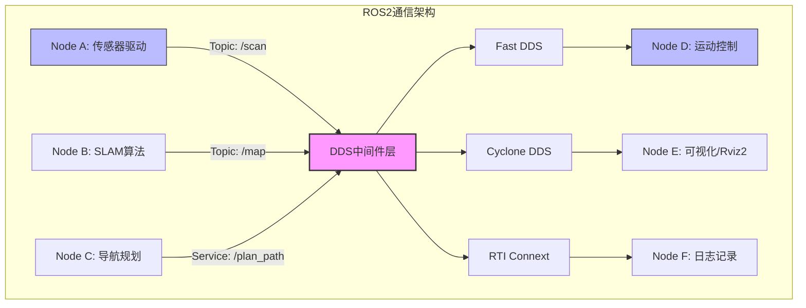
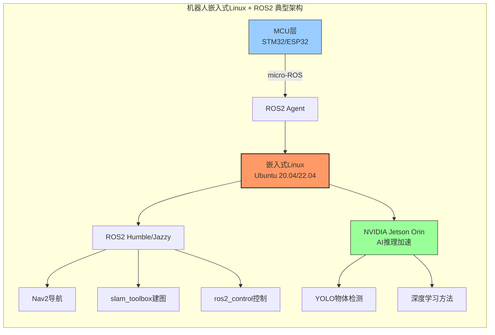
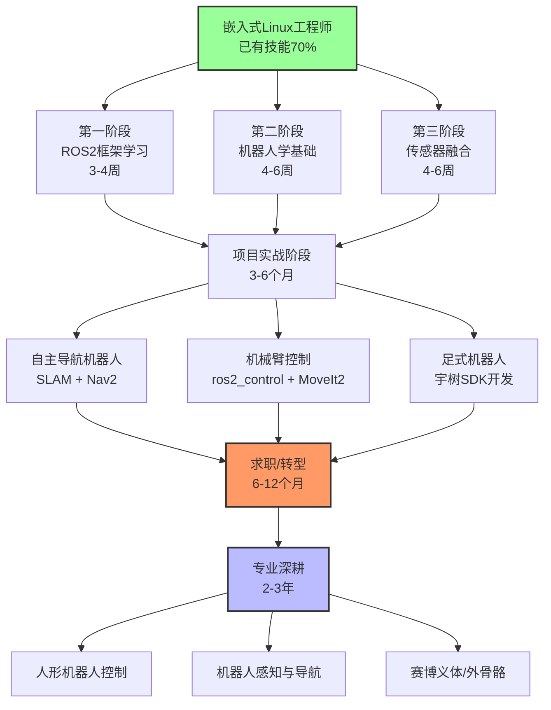
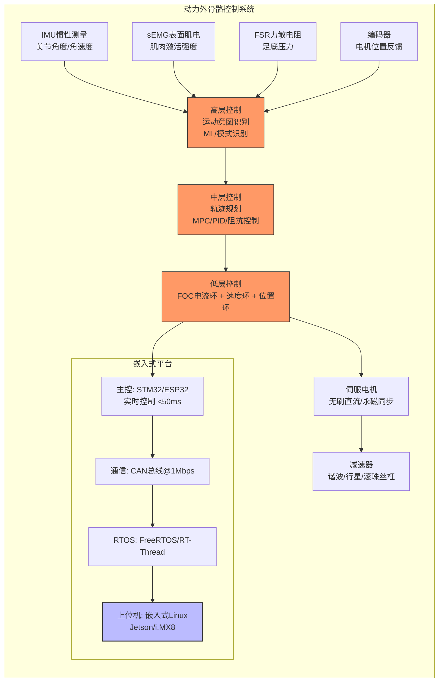
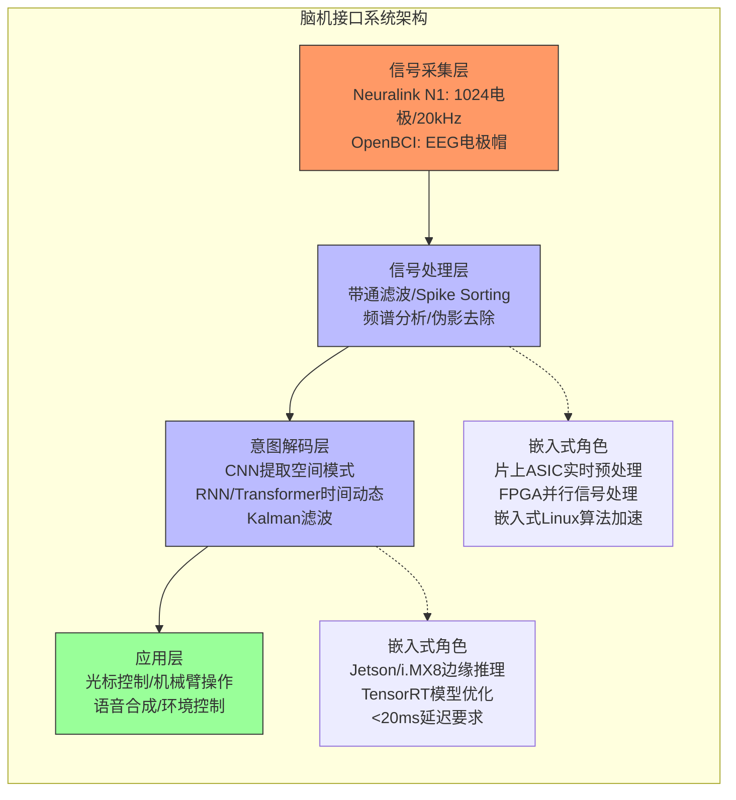
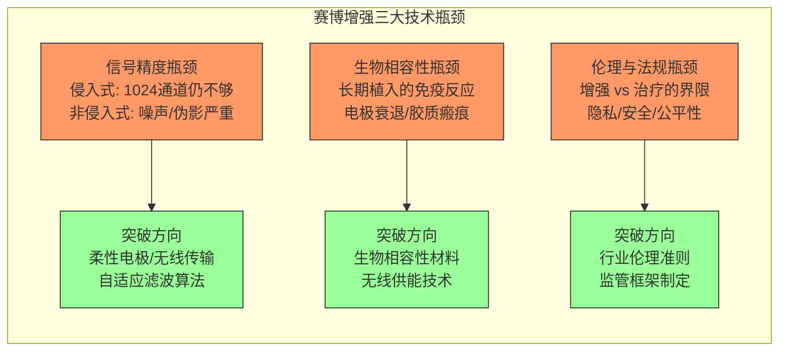
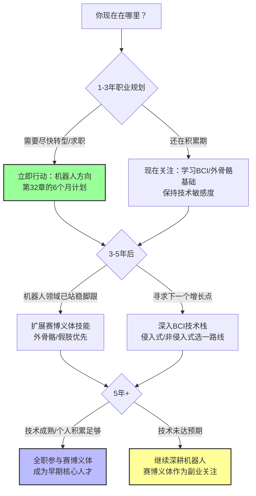

# 第32章 机器人行业深度解析

> *"机器人行业正处于iPhone时刻的前夜。对于掌握嵌入式Linux的工程师而言，这不是要不要进场的问题，而是什么时候、从哪个方向进场。"*

---

## 32.1 机器人行业市场与主要玩家

### 32.1.1 市场规模：一个即将爆发的万亿级赛道

人形机器人市场正站在历史性的拐点。多家权威研究机构给出了高度一致的判断——**2025年是起点，2035年是终点线，中间是年均40%以上的复合增长率**。

根据Fortune Business Insights的数据，2025年全球人形机器人市场规模约为**31.4亿至48.9亿美元**，预计到2034年将达到**811.5亿至1,651.3亿美元**，年复合增长率（CAGR）高达**37%至50.6%**[^1601^][^1608^]。BCC Research给出了更保守但同样乐观的估计：2024年市场14亿美元，2030年达到110亿美元，CAGR为42.8%[^1605^]。

**表32-1：人形机器人市场预测对比（2025-2035）**

| 研究机构 | 2025年市场规模 | 远期预测 | CAGR | 乐观程度 |
|---------|--------------|---------|------|---------|
| Fortune Business Insights | 48.9亿美元 | 1,651亿美元（2034） | 50.6% | ★★★★★ |
| Future Market Insights | 78亿美元 | 2,489亿美元（2036） | 37.0% | ★★★★☆ |
| BCC Research | 19亿美元 | 110亿美元（2030） | 42.8% | ★★★☆☆ |
| Research Nester | 31.4亿美元 | 815.5亿美元（2035） | 38.5% | ★★★★☆ |
| ABI Research | — | 65亿美元（2030） | 138% | 早期爆发 |

数据来源：Fortune Business Insights, BCC Research, ABI Research等[^1601^][^1605^][^1609^]

这组数据的含义是什么？**最保守的估计也意味着十年内市场将增长近十倍**。对比一下：智能手机市场在2007-2017年间增长了约15倍。人形机器人正在复制同样的轨迹。

中国市场尤为突出——以**50%的CAGR**领跑全球增长[^1602^]，这得益于完整的制造业供应链优势。宇树科技将人形机器人G1的售价压至**9.9万元人民币**（约1.4万美元），远低于国际同类产品，直接推动了市场的快速渗透[^1602^]。

驱动市场爆发的五大引擎[^1605^][^1603^]：

1. **AI与LLM突破**：大语言模型赋予机器人"理解"自然语言的能力，从执行指令进化为自主决策
2. **劳动力短缺**：制造业、物流、农业面临结构性用工荒，人形机器人成为唯一可规模化的替代方案
3. **人口老龄化**：全球老龄化催生护理、康复、陪伴机器人的刚性需求
4. **硬件成本持续下降**：执行器、传感器、电池成本以每年10-15%的速度下降
5. **政策驱动**：中国、日本、韩国、德国等将机器人产业列为国家战略

### 32.1.2 主要玩家：全球竞争格局

**表32-2：国际人形机器人主要玩家**

| 公司 | 代表产品 | 核心优势 | 当前状态 |
|------|---------|---------|---------|
| **Tesla** | Optimus Gen 2 | 依托FSD自动驾驶数据飞轮+Dojo超算，目标规模化量产 | 2025年计划生产数千台[^1643^] |
| **Boston Dynamics** | Atlas（电动版） | 动态敏捷性行业标杆，可跳跃翻滚 | 技术标杆，商业化缓慢[^1629^] |
| **Agility Robotics** | Digit | 物流场景商业化最成熟，已与GXO签署多年部署协议 | 商业化领先[^1629^] |
| **Figure AI** | Figure 01/02/03 | 专注工业制造场景，融资能力极强 | 快速迭代[^1634^] |
| **Apptronik** | Apollo | 强调实用性和制造业合作 | 合作导向[^1629^] |
| **1X Technologies** | NEO/EVE | 挪威公司，强调安全性和轻量化设计 | 独特定位 |

**表32-3：中国人形机器人主要玩家**

| 公司 | 代表产品 | 核心优势 | 当前状态 |
|------|---------|---------|---------|
| **宇树科技** | H1/G1 | 运动能力世界领先（H1速度3.3m/s），价格亲民 | 全球出货量前列[^1630^] |
| **优必选** | Walker S/S2 | 中国首家商业化企业，Walker S2已部署工厂 | 商业化领先[^1610^] |
| **傅利叶智能** | GR-1/GR-2 | 自研FSA执行器，从康复跨界人形机器人 | 快速迭代[^1691^] |
| **智元机器人** | 远征A1 | AI与机器人深度融合 | 新锐力量[^1702^] |
| **星动纪元** | STAR1 | 奔跑速度3.6m/s，行业领先 | 性能导向[^1698^] |

> **冷静提醒**：人形机器人行业目前仍处于"军备竞赛"阶段，多数企业尚未盈利。Tesla的Optimus、Figure AI等产品仍在迭代中，距离大规模商业化还有2-3年。入场时机很重要——**太早可能成为炮灰，太晚可能错过窗口**。

---

## 32.2 ROS2技术栈详解

### 32.2.1 ROS vs ROS2：架构革命

**ROS2（Robot Operating System 2）不是传统意义上的操作系统，而是开源的机器人软件开发框架**。正如Toradex技术文档所言："Linux是处理器的操作系统，而ROS2是机器人的操作系统"[^1607^]。

从ROS到ROS2的跃迁，本质上是从**实验室原型工具**到**工业级部署平台**的质变。

**表32-4：ROS 1 vs ROS 2 关键差异**

| 特性维度 | ROS 1 | ROS 2 |
|---------|-------|-------|
| 通信中间件 | 自定义TCPROS/UDPROS | DDS（Data Distribution Service） |
| 实时性支持 | 不支持 | 原生支持（可集成RTOS） |
| 嵌入式支持 | 有限 | 完善（micro-ROS） |
| 安全性 | 无内置安全机制 | 加密、认证、访问控制 |
| 多机器人协作 | 需额外配置 | 原生支持 |
| 节点生命周期 | 无 | 内置生命周期管理 |
| 构建工具 | catkin | colcon/ament |
| 嵌入式Linux集成 | 间接 | 深度集成（Torizon容器化方案）[^1607^] |

**为什么DDS是关键？**

DDS（Data Distribution Service）是ROS2的通信基石。它是一种面向数据的发布-订阅中间件，支持QoS（Quality of Service）策略，允许开发者为不同任务定制消息传递方式——实时控制数据可以设置为"可靠传输+低延迟"，而日志数据可以设置为"尽力传输+高吞吐"。常见的DDS实现包括Fast DDS、Cyclone DDS和RTI Connext。

### 32.2.2 ROS2核心架构与通信模型

**ROS2的核心概念——五个基石**：

1. **节点（Node）**：最小计算单元，一个进程可包含多个节点
2. **话题（Topic）**：发布-订阅模式的异步通信通道，适合传感器数据流
3. **服务（Service）**：请求-响应模式的同步通信，适合短时任务
4. **动作（Action）**：用于长时间运行任务的异步通信，支持进度反馈和取消
5. **参数（Parameter）**：节点的配置数据，支持运行时动态调整

### 32.2.3 micro-ROS：将ROS2延伸到微控制器

micro-ROS是嵌入式工程师必须关注的技术[^1689^]。它将ROS2功能扩展到资源受限的微控制器（ESP32、STM32），使用XRCE-DDS轻量级中间件，通过micro-ROS Agent与标准ROS2系统通信。

典型应用场景：在FreeRTOS上实时处理电机控制（1kHz控制频率）、IMU数据采集，同时将处理结果通过micro-ROS无缝传递给运行完整ROS2的嵌入式Linux主控。这实现了**MCU处理实时任务 + Linux处理AI/规划任务**的异构架构。

### 32.2.4 嵌入式Linux中的ROS2部署

以Toradex Verdin iMX8M Plus模块为例[^1607^]：

- **SoC选择**：i.MX8M Plus内置NPU（AI推理加速）、异构多核、相机接口，天生适合机器人
- **容器化部署**：使用Torizon容器化方案部署ROS2，比传统Yocto构建更快、更易维护
- **开发工作流**：基于Docker的开发环境，实现快速迭代

以宇树机器人为例[^1631^]：

- 宇树提供`unitree_ros2`支持包，接口与`unitree_sdk2`保持一致
- 确保从ROS1到ROS2的平滑过渡
- 可选Jetson Orin NX高算力模块（最多3块）用于AI推理

---

## 32.3 从嵌入式Linux到机器人的技能迁移

### 32.3.1 70%技能直接迁移的真相

嵌入式Linux工程师转型机器人，最大的优势在于**你已经站在正确的地基上**。机器人本质上是一个运行Linux的复杂嵌入式系统——传感器是外设、执行器是驱动、ROS2是应用框架。

**表32-5：嵌入式Linux技能 → 机器人行业价值映射**

| 你的现有技能 | 在机器人中的角色 | 迁移难度 | 价值评级 |
|------------|----------------|---------|---------|
| Linux驱动开发 | 机器人传感器/执行器驱动开发 | ⭐（直接可用） | ★★★★★ |
| 设备树（Device Tree） | 机器人板级定制必备 | ⭐（直接可用） | ★★★★★ |
| 交叉编译/Buildroot/Yocto | 机器人系统构建基础 | ⭐（直接可用） | ★★★★★ |
| 内核裁剪与优化 | 嵌入式Linux机器人核心技能 | ⭐（直接可用） | ★★★★☆ |
| C/C++编程 | ROS2底层和控制核心语言 | ⭐（直接可用） | ★★★★★ |
| Shell/Python脚本 | ROS2大量使用Python | ⭐（直接可用） | ★★★★☆ |
| 多线程/进程编程 | 机器人多传感器并发处理 | ⭐⭐（略需调整） | ★★★★☆ |
| 网络编程 | DDS/CAN/EtherCAT通信 | ⭐⭐（协议转换） | ★★★★☆ |
| 实时性优化（PREEMPT_RT） | 机器人实时控制 | ⭐⭐（场景迁移） | ★★★★☆ |
| 调试与排错 | 机器人复杂系统调试 | ⭐（直接可用） | ★★★★★ |

**这70%意味着**：你不需要重新学习编程语言、不需要重新学习操作系统原理、不需要重新学习版本控制和工作流。你只需要学习新的**领域知识**和**框架工具**。

### 32.3.2 需要补充的新知识

**第一层：必学基础（预计3-6个月）**

1. **ROS2框架**：节点/话题/服务/动作/参数的核心概念，colcon构建工具链，RViz2可视化，Gazebo仿真
2. **机器人学基础**：坐标变换（TF2）、正逆运动学、URDF机器人描述格式
3. **传感器与感知**：LiDAR原理与数据处理、深度相机（RealSense）、IMU数据融合（卡尔曼滤波）、SLAM基础

**第二层：进阶深入（6-12个月）**

4. **运动控制**：PID/MPC控制、伺服电机驱动、CAN总线/EtherCAT通信
5. **计算机视觉**：OpenCV图像处理、物体检测跟踪、PCL点云处理
6. **AI部署**：PyTorch/TensorFlow基础、模仿学习概念、边缘AI部署（TensorRT/ONNX）

**第三层：专业方向（长期积累）**

7. **人形机器人**：全身控制（WBC）、动力学建模、步态规划
8. **赛博义体**：生物信号处理（EEG/EMG）、力控制与阻抗控制、人机交互设计

### 32.3.3 技能迁移路径

---

## 32.4 入门路径：开发套件 → 项目 → 求职

### 32.4.1 开发套件选择指南

**表32-6：入门开发套件对比**

| 开发套件 | 主控平台 | 参考价格 | 学习难度 | 最佳适用场景 |
|---------|---------|---------|---------|------------|
| **JetBot AI Kit** | NVIDIA Jetson Nano | <$250 | 简单 | AI避障、物体跟踪、ROS入门[^1666^] |
| **JetRacer ROS版** | Jetson Nano + RP2040 | ~$350 | 中等 | SLAM建图、导航、多传感器融合[^1675^] |
| **TurtleBot4** | Raspberry Pi 4 | ~$500 | 简单 | ROS2标准学习平台、Nav2导航 |
| **ESP32 + micro-ROS** | ESP32 | <$50 | 进阶 | 实时控制、嵌入式ROS2[^1689^] |
| **宇树Go2 Edu** | Jetson Orin | ~$10,000 | 中高 | 四足机器人、高阶AI集成[^1631^] |

> **预算建议**：如果预算有限（<$300），选择JetRacer ROS版——它覆盖了从SLAM到导航的完整链路，且双控制器架构（Jetson + RP2040）让你同时接触Linux主控和MCU实时控制。如果预算<$100，用ESP32 + micro-ROS组合也能做出非常有竞争力的项目。

### 32.4.2 六个月转型计划

**表32-7：六个月转型计划——月目标 + 项目 + 资源**

| 月份 | 学习目标 | 实践项目 | 推荐资源 |
|------|---------|---------|---------|
| **第1月** | Ubuntu 22.04 + ROS2 Humble安装；完成官方Tutorial；掌握节点/话题/服务/动作 | Gazebo仿真环境中发布第一个节点 | ROS2官方文档[^1607^]；古月居中文博客 |
| **第2月** | 学习TF2坐标变换；URDF机器人建模；RViz2可视化 | 搭建一个两轮差速机器人的URDF模型并在RViz中可视化 | The Construct在线课程 |
| **第3月** | SLAM原理学习；slam_toolbox/cartographer使用；Nav2导航框架 | 在仿真环境中实现SLAM建图 + 自主导航 | Coursera机器人学课程[^1672^] |
| **第4月** | 购买开发套件；烧录系统；熟悉硬件接口；LiDAR/IMU驱动 | JetRacer ROS版实现实体SLAM建图 | JetRacer ROS Wiki[^1675^] |
| **第5月** | 卡尔曼滤波/EKF融合；里程计优化；物体检测集成 | 集成YOLO物体检测；实现"跟随目标"功能 | 宇树开源仓库[^1631^] |
| **第6月** | 简历整理；GitHub项目美化；刷面试题；投递简历 | 完成2-3个完整项目并开源；制作项目Demo视频 | 目标公司：宇树/优必选/傅利叶 |

### 32.4.3 求职实战建议

**简历建设 checklist**：
- [ ] 2-3个完整的机器人项目，GitHub代码仓库公开
- [ ] 至少1个项目使用ROS2（这是行业硬性要求）
- [ ] 展示从硬件选型到软件开发的全栈能力
- [ ] 项目README包含清晰的架构图和演示视频

**目标公司与岗位**：

| 公司类型 | 代表企业 | 嵌入式Linux相关岗位 |
|---------|---------|-------------------|
| 人形机器人 | 宇树、优必选、傅利叶、智元 | 嵌入式系统工程师、底层软件工程师 |
| 移动机器人 | 高仙、普渡、云迹 | 嵌入式Linux工程师、驱动开发工程师 |
| 工业机器人 | 新松、埃斯顿 | 实时控制工程师、嵌入式开发工程师 |
| 外骨骼/康复 | 傅利叶、大艾、迈步 | 嵌入式固件工程师、控制算法工程师 |
| 自动驾驶 | 小马智行、Momenta | 嵌入式系统工程师、传感器融合工程师 |

---

## 32.5 人形机器人的未来：2026-2027转折点

### 32.5.1 拐点已至

ABI Research预测**2026-2027年是人形机器人市场的转折点**，届时全球出货量预计达到**11.5万台**[^1609^]。这个数字的含义是：人形机器人将从"实验室展品"变成"可购买的工业设备"。

Tesla已公布其生产计划：2025年生产数千台Optimus，2026年目标5-10万台[^1643^]。如果这个目标实现，人形机器人的年产量将与工业机器人早期（1970年代末）处于同一数量级。

### 32.5.2 技术瓶颈与突破方向

当前人形机器人面临的五大技术瓶颈：

1. **电池续航**：目前多数产品续航2-4小时，远不能满足工业场景需求。突破方向：固态电池、氢燃料电池
2. **灵巧手操作**：通用抓取仍是未解难题。突破方向：触觉传感器、模仿学习
3. **AI泛化能力**：训练场景外的操作成功率低。突破方向：世界模型（NVIDIA Cosmos）、大模型驱动
4. **成本控制**：商业化需要单价降至5万美元以下。突破方向：国产供应链（中国优势）
5. **安全性认证**：工业/家庭场景的安全标准尚未统一。突破方向：ISO/GB标准制定

> **对嵌入式Linux工程师的启示**：上述瓶颈中，至少有3个（电池管理、传感器集成、安全系统）与嵌入式系统直接相关。你的技能不是可有可无的配菜，而是机器人系统的**基础设施**。

---

# 第33章 赛博义体与未来方向

> *"如果机器人是嵌入式Linux工程师的今天，那么赛博义体就是明天。但今天仍需全力以赴，因为明天的地基在今天浇筑。"*

---

## 33.1 智能假肢与外骨骼

### 33.1.1 市场概况

赛博义体（Cybernetics/Prosthetics）是一个涵盖智能假肢、外骨骼、脑机接口（BCI）的交叉学科领域。这一领域正在经历从"辅助工具"到"人机增强"的范式转变。

**关键市场数据**：

- **脑机接口（BCI）市场**：2025年约**12.7亿美元**，预计2031年达到**22.6亿美元**，CAGR为10.1%[^1604^]
- **外骨骼机器人市场**：中国市场未来五年以**25%年增速**增长，2027年突破**3亿美元**[^1664^]
- **康复机器人市场**：中国养老机器人B端市场中期（5年）规模预计达**119.7亿元**[^1663^]
- **智能假肢市场**：全球约**20亿美元**，技术最成熟但创新空间巨大

**表33-1：赛博义体三大方向对比**

| 方向 | 市场规模（2025） | 成熟度 | 嵌入式Linux参与度 | 技术难点 |
|------|----------------|-------|------------------|---------|
| 智能假肢 | ~20亿美元 | 中高 | ⭐⭐⭐ | 肌电信号解码、力反馈 |
| 外骨骼 | ~8亿美元（中国3亿美元） | 中 | ⭐⭐⭐⭐ | 运动意图识别、安全控制 |
| 脑机接口 | 12.7亿美元 | 低（早期） | ⭐⭐⭐ | 信号精度、生物相容性 |

应用领域分布：医疗领域占56%（肢体运动障碍诊疗、失语康复等），消费/工业/教育类占44%[^1641^]。

### 33.1.2 外骨骼技术栈详解

外骨骼是赛博义体领域中**嵌入式Linux工程师参与度最高**的方向。其技术架构分层清晰，与嵌入式系统高度吻合[^1636^][^1635^]。

**外骨骼嵌入式系统实例**[^1636^][^1622^]：

- **下肢康复外骨骼**：STM32F446RCT6主控 + CAN总线@1Mbps + Maxon RE40无刷电机，5自由度（髋/膝/踝）
- **手部康复外骨骼**：ESP32双核240MHz + RT-Thread + IMU(100Hz)/sEMG(1000Hz) + 5个电动线性执行器，端到端延迟<50ms[^1622^]

**中国外骨骼产业格局**[^1662^][^1673^]：

中国企业已超过**80家**，国产产品价格约为进口的**60%**。头部企业包括傅利叶智能（全产品线，2000+医疗机构）、大艾机器人（与301医院绑定临床数据）、程天科技（伺服系统100%国产化）、傲鲨智能（工业助力头部）[^1670^]。

---

## 33.2 脑机接口技术栈

### 33.2.1 Neuralink与OpenBCI：两条路线

脑机接口（BCI）是赛博义体中最前沿、最具科幻色彩的方向。当前市场由两条技术路线主导：

**侵入式路线——Neuralink**：

- **N1植入体**：1024个电极分布在64根柔性聚合物线上，线径4-6微米[^1687^]
- **片上ASIC**：实时信号放大、滤波、数字化（10-bit ADC @ 20kHz）
- **无线通信**：2.4GHz感应链路，10Mbps双向数据传输，无线充电
- **已实现的突破**：意念控制光标、意念打字、意念说话[^1695^]

**非侵入式路线——OpenBCI**：

- 基于EEG（脑电图）的头戴设备，无需手术
- 开源硬件+软件生态，研究者可以自定义信号处理pipeline
- 分辨率和信噪比远低于侵入式，但安全性和可及性更高

### 33.2.2 BCI技术架构与嵌入式角色

**表33-2：四大BCI技术路线对比**

| 技术路线 | 代表产品 | 侵入性 | 信号分辨率 | 嵌入式系统角色 | 应用阶段 |
|---------|---------|--------|-----------|--------------|---------|
| 侵入式皮层电极 | Neuralink N1 | 高（开颅手术） | 极高（1024通道） | 片上ASIC信号处理 | 临床试验[^1687^] |
| 微创血管内 | Synchron Stentrode | 中（血管植入） | 中 | 无线信号传输模块 | 临床试验 |
| 非侵入式EEG | OpenBCI、Emotiv | 无 | 低 | 便携式信号采集+处理 | 消费级/研究 |
| 皮层表面ECoG | Blackrock Neurotech | 中（硬膜下） | 中高 | 植入式信号处理 | 临床研究 |

### 33.2.3 嵌入式系统在BCI中的角色

BCI系统的信号处理pipeline中，嵌入式系统承担三个关键角色：

1. **实时信号预处理**：片上ASIC实现带通滤波、伪影去除、Spike检测，延迟要求<5ms
2. **边缘AI推理**：Jetson/i.MX8运行CNN/RNN模型进行意图解码，延迟要求<20ms
3. **系统可靠性**：医疗级安全机制、故障检测与恢复、无线数据传输

> **当前现实**：BCI仍处于早期阶段。Neuralink虽然已实现意念打字（每分钟约30字符），但距离"自然交互"还有数量级的差距。12.7亿美元的市场规模中，非侵入式硬件占75.9%，神经假体应用占49.1%[^1604^]。这个方向值得**关注**，但还不是**全职投入**的最佳时机。

---

## 33.3 赛博增强的技术路线

### 33.3.1 从辅助到增强的演进

赛博义体的技术演进遵循清晰的四阶段路径：

1. **替代（Substitution）**：当前阶段——为残障人士提供功能替代（假肢、轮椅）
2. **恢复（Restoration）**：当前-近期——帮助患者恢复丧失的功能（康复外骨骼、BCI辅助）
3. **增强（Augmentation）**：中期——为普通人提供超人类能力（外骨骼助力、认知增强）
4. **融合（Integration）**：远期——人机界限模糊（Neuralink的长期愿景）

我们目前处于阶段1向阶段2过渡的节点。外骨骼在工业助力场景（搬运重物）已经进入增强阶段，BCI仍停留在替代/恢复阶段。

### 33.3.2 技术瓶颈

**信号精度**：Neuralink的1024通道听起来很多，但与大脑860亿神经元相比微不足道。要实现"意念对话"级别的控制，需要至少10万-100万通道。柔性电极、无线传输、自适应信号处理是突破方向。

**生物相容性**：长期植入面临电极衰退、免疫排斥、胶质瘢痕三大难题。Neuralink N1的预期寿命为5-10年，但临床数据尚不充分。

**伦理困境**：当BCI可以读取和写入大脑信号时，"思想隐私"将变成真实议题。谁有权访问你的神经数据？增强能力是否加剧社会不平等？这些问题目前还没有答案。

---

## 33.4 什么时候该关注这些方向

### 33.4.1 时间线决策框架

### 33.4.2 分阶段建议

**短期（1-3年）：ALL IN 机器人**

机器人行业已进入爆发前夜，这是**确定性最高**的方向。无论你是想跳槽、转行还是拓展技能边界，机器人都是当前最优选择。

- 执行第32章的6个月转型计划
- 进入人形机器人/移动机器人/工业机器人企业
- 在实战中学习ROS2、传感器融合、运动控制
- 积累机器人项目经验和行业人脉

**中期（3-5年）：关注赛博义体**

在你已经掌握机器人技能的基础上，开始有意识地接触赛博义体技术：

- 外骨骼是最接近机器人技术栈的方向——**优先关注**
- 学习生物信号处理（EMG/EEG）基础
- 了解力控制和阻抗控制（与机器人运动控制相通）
- 关注Neuralink等BCI公司的技术进展和招聘信息

**长期（5年+）：直接参与**

如果BCI/赛博义体技术突破瓶颈（信号精度提升10倍以上、长期安全性验证通过、伦理框架建立），将是嵌入式工程师的下一个蓝海。

### 33.4.3 风险提醒

**赛博义体方向的现实风险**：

1. **技术不确定性**：BCI的核心技术突破时间线难以预测，可能5年内发生革命性进展，也可能停滞10年
2. **监管不确定性**：侵入式BCI的审批流程长（FDA/CE/NMPA），从临床到商业化的周期可能超过5年
3. **市场规模有限**：当前12.7亿美元的BCI市场与机器人千亿美元市场不在同一量级
4. **人才需求有限**：当前阶段的赛博义体企业数量少、招聘规模小，不像机器人行业有大量岗位释放

> **最终建议**：将赛博义体视为**"值得关注的第二曲线"**，而不是"必须立即转型的方向"。在机器人行业站稳脚跟，同时保持对赛博义体的技术敏感度，是最理性的策略。

---

## 本章小结

**第32章核心结论**：机器人行业（尤其是人形机器人）正处于爆发式增长的前夜，市场规模预计从2025年的约40亿美元增长到2035年的800-1,600亿美元。嵌入式Linux工程师拥有70%可直接迁移的技能，通过6个月系统学习（ROS2 + 机器人学基础 + 传感器融合）即可完成转型。开发套件（JetRacer/TurtleBot4/ESP32）让学习成本降至数百美元。

**第33章核心结论**：赛博义体（智能假肢/外骨骼/BCI）代表了人类与机器融合的终极方向，但当前仍处于早期阶段。BCI市场12.7亿美元、外骨骼中国市场年增25%。嵌入式Linux工程师在这一领域扮演信号处理和实时控制的核心角色。**短期ALL IN机器人，中期关注赛博义体，长期择机参与**——这是最理性的职业发展策略。

---

## 参考资料

[^1601^] Fortune Business Insights - Humanoid Robot Market Report, 2025.
[^1602^] Future Market Insights - Humanoid Robot Market Analysis, 2025.
[^1604^] Mordor Intelligence - Brain-computer Interface Market Report, 2025.
[^1605^] BCC Research - Humanoid Robot Market, 2025.
[^1607^] Toradex - "ROS2 Accelerating Robot Prototyping" Technical Whitepaper.
[^1608^] Research Nester - Humanoid Robot Market Size & Forecast, 2025.
[^1609^] ABI Research - Humanoid Robot Market Size Outlook, 2025.
[^1610^] 36Kr - 具身智能行业深度分析, 2025.
[^1622^] Frontiers - "Hand Exoskeleton Rehabilitation System Based on ESP32", 2024.
[^1629^] Interesting Engineering - "Optimus vs Competition: Humanoid Robot Landscape", 2025.
[^1630^] CSDN - 宇树G1技术架构深度解析, 2025.
[^1631^] 古月居 - "宇树机器人开源生态全面解析", 2025.
[^1635^] VUIR - "Wearable Sensors in Exoskeleton Control: A Review", 2024.
[^1636^] PMC - "Enhanced Lower Limb Powered Exoskeleton: Control Architecture", 2023.
[^1639^] 宇树科技官网 - H1人形机器人规格参数, 2025.
[^1641^] 前瞻网 - "中国脑机接口产业全景分析", 2025.
[^1643^] Investing.com - "Tesla Optimus Production Plans", 2025.
[^1661^] 搜狐 - "傅利叶智能C轮融资报道", 2025.
[^1662^] 前瞻产业研究院 - "中国外骨骼机器人产业链图谱", 2025.
[^1663^] 东方财富 - "康复机器人行业投资分析报告", 2025.
[^1664^] 微信公众号 - "中国外骨骼机器人行业深度分析", 2025.
[^1666^] NVIDIA - JetBot AI Kit Official Documentation.
[^1670^] 创泽机器人 - "2025中国外骨骼机器人产业Top5", 2025.
[^1672^] Coursera - "Robotics Specialization" by University of Pennsylvania.
[^1673^] 创泽机器人 - "中国外骨骼产业格局分析", 2025.
[^1675^] Waveshare - JetRacer ROS Wiki Documentation.
[^1687^] SubconsciousMind - "Neuralink Clinical Trial Technical Analysis", 2024.
[^1688^] SparkCo - "Neuralink FDA Approval Process Analysis", 2025.
[^1689^] TU Wien - "micro-ROS: ROS2 on Microcontrollers" Architecture Paper.
[^1690^] 傅利叶智能 - GR-2人形机器人产品彩页, 2025.
[^1691^] 傅利叶智能 - GR-2产品发布会, 2025.
[^1693^] HackerNoon - "Neuralink Technology Architecture Deep Dive", 2025.
[^1695^] PCMag - "Neuralink Speech Translation Demonstration", 2025.
[^1698^] CSDN - "2025机器人行业全景图与未来趋势", 2025.
[^1702^] 东方证券 - "国外人形机器人产品全面梳理", 2025.

---

*本章完*

> **作者注**：本章数据截至2025年。机器人行业变化极快，建议读者关注宇树科技、Tesla AI、Neuralink的官方更新，以及ICRA、IROS、NeurIPS等顶级会议的最新论文。技术浪潮不等人，但做好准备的人永远不会错过浪潮。
