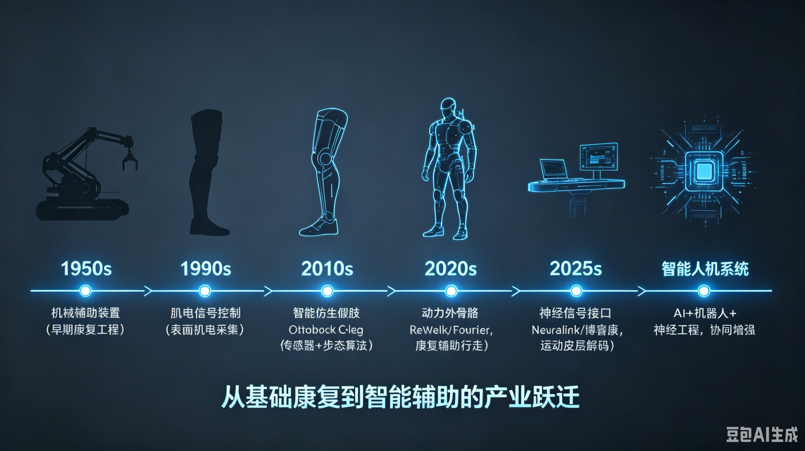

# 第33章 赛博义体与碳硅融合——人类增强的技术边界

> 所属章节：第33章 赛博义体与碳硅融合
> 
> 预计阅读时间：40分钟

---

## 33.1 从修复到增强：赛博义体的范式跃迁



赛博义体（Cybernetics/Prosthetics）并非一个新鲜词汇，但它正在经历一场从"医疗慈善"到"人类增强产业"的深刻范式跃迁。这个领域涵盖三个递进的层次：智能假肢替代丧失的功能，外骨骼增强人类原本的力量，脑机接口扩展感知与认知的边界。三者共同构成一条从"修复残缺"到"增强正常"再到"创造新能力"的连续光谱。

理解这种递进关系至关重要。肌电假肢在二十世纪九十年代让世人首次接受了"人机融合"的合理性——一个失去手臂的人可以用残肢肌肉电信号控制机械手指，这种画面在媒体传播中消解了公众对"机械植入人体"的恐惧。外骨骼在2010年代证明了闭环控制系统在人体环境中的工程可行性：传感器实时读取人体姿态，控制器在毫秒级计算助力扭矩，执行器同步输出辅助力量，整套系统与人类的生物力学无缝耦合。正是肌电假肢和外骨骼奠定的技术信任与工程基础，才让脑机接口在2020年代敢于尝试将电极植入大脑，直接与860亿神经元对话。

一个技术层次的市场验证和成本下降，总是为更高层次铺平道路。这是产业技术史中反复出现的规律——真空管为晶体管铺路，晶体管为集成电路铺路，而修复性假肢正在为增强性赛博义体铺路。

市场数据正在验证这种跃迁。2024年，全球脑机接口（BCI）市场规模为26亿美元，到2026年预计将达到33亿至34.68亿美元，年复合增长率在12.7%到15.4%之间。中国BCI市场在2024年为4.6亿美元，占全球17.6%的份额。如果视野拉得更远，Barnes Reports预测2032年全球BCI市场将达到82.5亿美元，Precedence Statistics则预测2033年达到108.9亿美元。外骨骼领域同样表现强劲：中国市场年增长率约25%，预计2027年突破3亿美元。康复机器人在中国养老B端市场五年内累计规模达119.7亿元。智能假肢全球市场规模约20亿美元。

这些数字背后有一个更深层的变化正在发生。赛博义体产业的目标市场正在从"千万级患者群体"悄然扩展到"亿级普通人群"。当健康人开始穿外骨骼搬运重物，当消费者用非侵入式BCI头环控制智能家居，当肌电假肢实现超越原生肢体的精细操作——这个产业的性质就变了。助听器曾经是医疗器械，现在它演变为AirPods Pro的空间音频体验；赛博义体也正在沿着同样的轨迹，从功能恢复迈向消费级增强。

> 💡 核心判断：这不是医疗辅助慈善，而是人类增强的新产业。2025年全球BCI领域有47家企业完成B轮融资，累计融资额28.6亿美元，其中神经芯片和柔性电极领域吸收了61%的融资。资本用脚投票，表明这个赛道已经被视为具有独立商业价值的科技产业，而非单纯的医疗分支。

2026年6月Barnes Reports的最新数据显示，亚太市场在2026年将达到15.9亿美元，占全球52.2%的份额，其中中国以10.53亿美元的市场规模首次跃居全球第一。这背后是中国在规模化应用和监管审批上的追赶速度——博睿康NEO成为全球首款获得NMPA三类医疗器械证的全植入式BCI，2026年3月中关村海淀脑机接口产业集聚区正式揭牌，计划到2030年培育100家企业。中国正在从BCI技术的跟随者转变为应用落地的主导者。

对嵌入式Linux工程师而言，这个领域有一个关键的认知锚点：BCI和外骨骼的本质都是信号采集、实时处理、控制执行的闭环系统。你编写的实时控制代码、调试的信号处理算法、移植的驱动程序，就是人类意图与机器动作之间的翻译器。在肌电假肢中，你翻译的是肌肉电信号；在BCI中，你翻译的是神经放电；在外骨骼中，你翻译的是运动意图。翻译的精度决定了一个人能否重新行走，翻译的速度决定了机械臂响应是否跟得上思维，翻译的可靠性决定了医疗设备是否敢用在患者身上。这个角色的分量，远超一份普通的技术工作。

---

## 33.2 产业链全景：BCI的完整链条


BCI产业链可以清晰划分为三个层次，每一层的技术壁垒、价值分布和国产化程度差异巨大。理解这种结构性差异，是嵌入式工程师判断自身切入点的第一步。

上游是核心元器件层，占据整个产业链60%到70%的价值，也是技术壁垒最高、国产化率最低的环节。它包括电极材料、BCI专用芯片、精密手术设备、生物相容性材料。全球BCI芯片进口依赖度数据显示，北美以外的地区87%的芯片依赖进口。柔性电极的国产化率只有30%到40%，高端电极材料仍然依赖进口。美国占据了全球BCI相关专利的47%，中国为26%。2021年10月，美国商务部BIS加强了对BCI技术的出口管制，这让上游的"卡脖子"风险变得具体而紧迫。

中游是产品集成层，占据20%到30%的价值，核心壁垒在于信号处理算法和神经解码模型。Neuralink、博睿康、脑虎科技、强脑科技、阶梯医疗、北脑、微灵医疗等玩家聚集于此。非侵入式BCI占据市场80%以上的份额，侵入式和半侵入式合计约18%。短期来看，非侵入式仍是主流，但侵入式的长期潜力更大——因为它能获取到神经元级别的Spike信号，解码精度远高于头皮采集的EEG。2025年，神经芯片和柔性电极领域吸收了61%的BCI融资，说明资本正在向上游核心技术集中。

下游是应用服务层，虽然只占10%以上的价值，但场景最为多元。医疗领域占据56%的市场份额，覆盖卒中康复、意识障碍评估、抑郁症闭环神经调控、渐冻症和脊髓损伤的功能代偿、视觉恢复等方向。消费领域包括意念控制游戏、注意力训练、智能家居控制。工业领域涉及意念控制机械臂和无人机。军事国防领域虽然投入最多，但信息最为隐秘。全球有5个国家和地区涉及BCI数据伦理与神经权利的法案已经进入立法程序，EU AI责任法案要求BCI设备符合MDR医疗器械法规，中国NMPA在2026年1月发布了基于风险等级的BCI医疗器械分类目录，美国在2025年9月批准了第6款侵入式BCI临床实验豁免，并持续通过FDA突破性设备认定加速Neuralink等企业的审批进程。

从区域格局来看，2026年亚太市场以15.9亿美元占据全球52.2%的份额，中国10.53亿美元的市场规模首次登顶全球。美国在前沿技术上仍然领先——Neuralink的柔性微丝电极和R1手术机器人代表了全球最高水平，Blackrock的犹他电极阵列拥有最丰富的人体临床数据。但中国在规模化应用和监管审批上正在快速追赶，博睿康NEO的获批就是标志性事件。

嵌入式Linux在产业链中的角色贯穿中游和下游。上游的电极材料、生物材料、芯片制造环节几乎没有Linux的直接参与，但从芯片输出数字信号的那一刻起，Linux就进入了核心位置。在中游，Linux负责信号处理、边缘AI推理、实时控制；在下游，Linux负责应用部署、数据上传、远程监控、OTA升级。如果把BCI系统比作一个人的神经系统，那么上游是感受器和神经末梢，中游是脊髓和脑干，下游是皮层和行为输出。嵌入式Linux就是那个在脊髓和脑干区域处理信息、协调反应的"低级中枢"。

| 产业链层级 | 价值占比 | 核心壁垒 | 国产化率 | 代表企业 |
|-----------|---------|---------|---------|---------|
| 上游-电极材料 | 高 | 材料科学、微纳加工 | 30-40% | Neuralink、Blackrock、脑虎科技、阶梯医疗 |
| 上游-芯片 | 高 | ASIC设计、低功耗 | 20-30% | Neuralink、TI/ST、衷华脑机、芯动神州 |
| 上游-手术设备 | 高 | 精密机器人、力反馈 | 低 | Neuralink（R1）、博睿康（NEO） |
| 上游-生物材料 | 中高 | 生物相容性、封装 | 中 | 国内多家材料企业 |
| 中游-信号处理 | 中 | 算法、神经解码 | 60-70% | 博睿康、脑虎科技、强脑科技、OpenBCI |
| 中游-产品集成 | 中 | 系统集成、临床验证 | 中 | Neuralink、博睿康、Synchron |
| 下游-医疗 | 中高 | 临床渠道、监管 | 中 | 翔宇医疗、傅利叶、大艾机器人 |
| 下游-消费 | 低 | 用户体验、成本 | 中 | 强脑科技、Neurable、柔灵科技 |
| 下游-工业 | 低 | 实时性、安全 | 中高 | 傲鲨智能、程天科技 |
| 下游-军事 | 高（保密） | 抗干扰、加密 | 未知 | 各国国防机构 |

---

## 33.3 上游：电极、芯片、材料、手术设备


上游是BCI产业链的根基，也是当前国产化最薄弱的环节。这里的技术突破速度，决定了整个产业能走多快、走多远。嵌入式Linux工程师虽然不会直接设计电极材料，但理解上游的技术状态和国产化进程，能帮助你判断国产替代浪潮中会出现哪些新的嵌入式开发需求——国产芯片的驱动、国产手术机器人的控制系统、国产采集设备的信号处理平台，都是你的战场。

### 电极材料——信号采集的麦克风

电极是BCI系统的"麦克风"，负责把神经元的电活动转化为可测量的电信号。电极按侵入程度分为三类：侵入式、半侵入式、非侵入式，每一类都有不同的技术路径和代表产品。

侵入式电极中，Neuralink的柔性微丝电极是当前技术标杆。每根线直径4到6微米，比人类头发还细。64根线共携带1024个电极位点，能够同时记录大量神经元的Spike活动。柔性设计是其关键创新——刚性电极在长期植入后会因为大脑与颅骨之间的微运动而导致组织损伤，柔性微丝能随脑组织一起移动，大幅降低免疫排斥和胶质瘢痕的形成。脑虎科技走的是另一条路径，采用蚕丝蛋白微创植入技术，利用皮层表面微电极阵列（ECoG）置于硬脑膜下方，不直接侵入脑组织，既获得了比EEG更高的信号质量，又避免了刺入脑组织的风险。阶梯医疗则将电极截面做到了Neuralink的1/5到1/7，植入体厚度约为一半，手术创伤显著降低。Blackrock的犹他电极阵列是历史最悠久的方案，人体临床案例最多，技术储备深厚，虽然通道数不如Neuralink，但长期稳定性和临床数据是其核心优势。Synchron的Stentrode代表了半侵入式的创新方向——它通过类似心脏支架的血管内介入手术，将电极递送到大脑运动皮层附近的血管中，完全不打开颅骨，大幅降低了植入风险。

非侵入式电极包括干电极和凝胶电极，技术门槛相对较低，供应商数量众多。OpenBCI是开源社区的代表，Emotiv和Neurosky是早期消费电子品牌，柔灵科技则代表了国内在非侵入式电极领域的布局。非侵入式电极的问题是信号质量——头皮、颅骨、脑脊液对神经信号有显著的衰减和混叠作用，采集到的EEG信号是成千上万神经元活动的空间平均，信噪比低、空间分辨率差。

从国产化率来看，柔性侵入式电极的国产化率约30%到40%，高端电极材料仍然依赖进口。美国在BCI专利领域占据47%的份额，中国为26%。这意味着在未来三到五年内，国产电极的驱动开发、国产采集设备的嵌入式系统适配，将成为中国嵌入式工程师的重要任务。

### 信号处理芯片——神经信号的翻译器

如果说电极是麦克风，那么信号处理芯片就是翻译器。它需要把微弱的神经电信号（微伏级别）实时放大、滤波、数字化，并通过无线链路传输到外部系统。

Neuralink的片上ASIC是专用方案的代表，集成了实时放大、带通滤波、模数转换（10-bit ADC@20kHz采样率）和无线传输（2.4GHz感应链路，10Mbps带宽），全部在单颗芯片上完成。这种高集成度的优势是功耗极低、体积极小，可以植入颅骨内由N1芯片无线供电。但专用ASIC的缺点是灵活性差——一旦流片，架构就固定了，难以适应不同的电极配置或信号处理需求。

通用方案以TI和ST为代表，国际大厂提供成熟的模拟前端和微控制器产品线，适用于多种场景，但性能和功耗并非针对BCI最优。国内方面，衷华脑机专注于植入式BCI芯片，芯动神州聚焦非植入式芯片，海南大学开发了SX系列全链条BCI芯片。复旦大学和天津大学联合研发的64通道无线芯片，成本仅为进口产品的50%。但从通道数来看，国内最高做到256通道，而Neuralink已经达到1024通道。高带宽信号处理芯片（光子计数级精度）尚未完全突破，这是国内芯片设计的关键差距。

2025年全球BCI芯片进口依赖度数据显示，北美以外的地区87%的芯片依赖进口。这个数字意味着国产BCI芯片的替代空间巨大，也意味着芯片驱动开发、BSP移植、设备树配置、通信协议调试等嵌入式Linux工作，将在国产替代浪潮中大量涌现。

嵌入式Linux在芯片层的角色，发生在芯片输出数字信号之后。芯片通过SPI或I2C将数字化后的神经数据发送给主处理器，Linux工程师需要编写驱动程序来正确配置通信参数、读取数据流、处理中断、管理缓冲区。对于国产芯片，往往没有现成的驱动，需要从头阅读英文手册（有时甚至是中文但表述不清的手册），配置寄存器、调试时序、优化DMA传输。这是嵌入式Linux工程师最熟悉、最基础、也最不可替代的工作。

### 手术设备——精密植入的机器人手臂

BCI的电极植入曾经是一项需要开颅、显微镜、神经外科医生数小时操作的精密手术。Neuralink的R1手术机器人将这个过程从人工精细操作转变为自动化高速植入。R1机器人将单根柔性电极的植入时间从17秒压缩到1.5秒，植入深度突破50毫米。更重要的是，它将手术成本降低了95%——从需要定制化手术方案的昂贵操作，转变为标准化、可量产的流程。Neuralink在德州奥斯汀的工厂持续扩建，投资超过1600万美元，目标就是实现手术机器人的规模化生产和部署。

博睿康的NEO系统则在中国速度上创造了纪录。2026年3月获得NMPA三类证后，NEO系统在78天内完成了32例植入，术后无器械相关不良反应，累计安全植入近5000天，主要临床终点100%达标。这个速度在中国医疗器械审批史上都是罕见的。

手术自动化的趋势是从手动植入到半自动再到全自动。R1和NEO目前仍然处于半自动阶段——机器人负责精确植入，但神经外科医生仍然监控全过程并随时准备接管。全自动植入意味着机器人独立完成定位、穿刺、植入、验证的全流程，这在技术上还需要解决实时影像引导、力反馈控制、术中并发症处理等难题。

嵌入式Linux在手术机器人中的角色是直接而关键的。手术机器人本质上是一台高精度工业机器人，需要Linux来运行实时控制、视觉引导、力反馈处理、运动规划。这些系统的延迟要求苛刻，安全性要求达到医疗级，与工厂自动化有相似的技术栈，但可靠性和监管要求更高。

### 生物相容性材料——长期植入的护身符

长期植入面临三大核心难题：电极衰退（电极-组织界面的阻抗随时间增加）、免疫排斥（身体将电极识别为异物并发起免疫反应）、胶质瘢痕（星形胶质细胞在电极周围形成绝缘层，阻碍信号采集）。Neuralink的N1设备预期寿命为5到10年，但临床数据尚不充分——首批植入患者才一年多，长期稳定性仍需验证。

突破方向包括：开发更优的生物相容性封装材料，使电极与脑组织长期稳定共存；无线供能技术，消除经皮导线带来的感染风险；自适应封装，能够根据组织反应动态调整电极表面特性。这些主要是材料科学和生物医学工程的问题，但嵌入式Linux工程师有机会在材料测试设备、植入体监控系统、长期数据采集平台等方面参与——这些设备都需要嵌入式系统来运行。

> ⚠️ 上游是BCI产业链的卡脖子环节。核心零部件依赖进口，国产化水平待提高。美国2021年10月加强BCI技术出口管制，让中国供应链的脆弱性暴露无遗。这是嵌入式Linux工程师的间接机会——虽然你不直接做电极或芯片，但国产芯片的驱动开发、国产手术设备的控制系统、国产采集设备的信号处理平台，都是你的战场。国产替代不是口号，而是正在发生的技术工程任务。

---

## 33.4 中游：信号采集、处理、解码


中游是BCI系统中嵌入式Linux工程师参与度最高、技术深度最深的环节。如果把BCI比作一座工厂，上游是原材料供应商，中游是核心生产车间，下游是产品销售渠道。而你，作为嵌入式Linux工程师，就是这个生产车间的技术骨干。

BCI信号处理pipeline包含六个阶段，每个阶段对延迟、精度、可靠性的要求各不相同，嵌入式Linux在不同阶段扮演着不同的角色。

第一阶段是信号采集。侵入式BCI如Neuralink N1使用1024个电极，每个电极以20kHz采样率记录神经信号。数据量极其庞大：1024通道 × 20kHz × 10-bit ≈ 200Mbps的原始数据流。Neuralink N1的片上ASIC完成初步数字化后，通过2.4GHz无线链路以10Mbps带宽传输到体外接收器。非侵入式BCI通常使用8到64通道，采样率约500Hz，数据量小得多，但信号质量差得多。嵌入式Linux在信号采集阶段的角色相对被动——主要是配置ADC驱动、接收数据流、管理DMA缓冲区。

第二阶段是信号预处理。这一步包括带通滤波（去除工频干扰和基线漂移）、伪影去除（消除眼电、肌电、心跳等噪声源）、Spike检测（在侵入式BCI中识别单个神经元的动作电位）。预处理通常在硬件（FPGA或ASIC）上完成，延迟要求小于5毫秒。嵌入式Linux的角色是配置滤波参数、监控预处理状态、处理异常情况。例如，当检测到某个通道噪声突然增大时，Linux系统需要标记该通道为异常，并通知上层算法忽略该通道的数据。

第三阶段是特征提取。从原始信号中提取有用的特征，包括时域特征（幅值、方差、过零率）、频域特征（功率谱密度、频带能量）、空域特征（CNN提取的空间模式）。嵌入式Linux在这一阶段开始承担主要的计算任务。使用Python或C++在Linux环境下运行OpenCV、NumPy、SciPy等库，实时计算特征向量。对于边缘设备如Jetson Nano或i.MX8M Plus，计算资源有限，需要优化算法复杂度，避免内存分配抖动。

第四阶段是意图解码。这是BCI的"大脑"——使用机器学习模型将神经特征转化为人类意图。CNN用于提取空间模式，RNN或Transformer用于捕捉时间动态，Kalman滤波用于平滑预测结果。浙大团队在非侵入式BCI中文语音识别中达到96%的准确率，清华大学利用忆阻器技术在信号分类中达到93.46%的准确率。嵌入式Linux在Jetson AGX Orin或i.MX8M Plus上运行TensorRT或ONNX Runtime优化的模型，要求延迟小于20毫秒。模型量化（从FP32到INT8）是必备优化，能将推理速度提升3到5倍，同时减少内存占用。

第五阶段是控制指令生成。将解码结果转化为具体的控制指令——光标坐标、机械臂关节角度、语音合成参数、外骨骼助力扭矩。嵌入式Linux负责指令格式转换、安全校验、优先级仲裁。例如，当用户同时发出"移动光标"和"紧急停止"两个意图时，安全系统必须无条件优先执行紧急停止。

第六阶段是执行器动作。机械臂移动、外骨骼助力、语音输出。延迟要求小于50毫秒，否则用户会感觉到明显的延迟，影响操作体验。嵌入式Linux通过CAN总线、EtherCAT、BLE或WiFi将指令发送给执行器，并监控执行状态。

整个pipeline的端到端延迟从信号采集到执行器动作通常控制在50毫秒以内。对人类感知来说，50毫秒以下的延迟几乎是瞬时的。这要求每一个环节都不能掉链子——如果Linux系统因为某个后台进程占用了CPU而导致解码延迟增加10毫秒，用户的操作体验就会受到影响。这就是为什么BCI系统需要实时Linux内核（PREEMPT_RT）、CPU核心隔离（将关键任务绑定到专用核心）、内存锁定（防止页面换入换出导致的延迟抖动）。

嵌入式Linux在中游的具体角色可以总结为六个方面：

**实时信号预处理**：运行特征提取算法（Python/C++），管理多线程数据流。虽然硬件ASIC完成了大部分预处理，但参数调优、异常处理、自适应滤波策略的调整，都需要Linux上的软件支持。

**边缘AI推理**：在Jetson/i.MX8上运行TensorRT/ONNX Runtime优化的解码模型。模型量化、批处理优化、异步推理、内存池管理，都是嵌入式Linux工程师需要掌握的优化技术。一个BCI解码模型如果能在Jetson上从50毫秒优化到15毫秒，就意味着用户体验从"能感觉到延迟"到"完全自然流畅"的质变。

**系统可靠性**：医疗级安全机制是不可妥协的。看门狗定时器防止系统死锁，故障检测模块持续监控信号质量和系统状态，冗余设计确保单点故障不会导致系统崩溃。嵌入式Linux工程师需要配置内核看门狗、设计故障检测算法、实现安全状态机。

**无线通信**：BLE/WiFi驱动开发、数据加密（TLS/DTLS）。神经数据是最高敏感级别的个人健康数据——它直接反映一个人的思维、意图、情绪状态。加密通信不是可选的，是强制性的。嵌入式Linux工程师需要配置WiFi/BLE模块、实现TLS握手、管理证书链、处理断线重连。

**数据管理**：长期采集数据的本地存储、云端同步、数据隐私保护。一个侵入式BCI用户每天产生数GB的神经数据，如何存储、压缩、上传、备份、归档，是数据工程问题，也是嵌入式Linux问题——因为存储设备就在用户身上。

**设备OTA**：Mender或RAUC实现安全固件升级。BCI设备一旦植入人体，固件更新就不能出任何差错。OTA系统必须支持回滚、签名验证、差分升级、断点续传。嵌入式Linux工程师需要构建安全的OTA管道，确保任何升级失败都能安全回退到上一版本。

| Pipeline阶段 | 延迟要求 | 主要硬件 | 嵌入式Linux角色 | 关键技术 |
|-------------|---------|---------|----------------|---------|
| 信号采集 | 实时 | ADC/ASIC/FPGA | 驱动配置、DMA管理 | SPI/I2C驱动、缓冲区管理 |
| 信号预处理 | <5ms | FPGA/ASIC | 参数配置、状态监控 | 实时日志、异常检测 |
| 特征提取 | <10ms | CPU/GPU | 算法执行、内存优化 | NumPy/SciPy、OpenCV |
| 意图解码 | <20ms | GPU/NPU | 模型推理、TensorRT | ONNX Runtime、量化、CUDA/ACL |
| 指令生成 | <5ms | CPU | 格式转换、安全校验 | 安全状态机、优先级仲裁 |
| 执行器动作 | <50ms | 电机/机械 | 通信驱动、状态监控 | CAN/EtherCAT/BLE驱动 |

```bash
# 检查Jetson GPU状态，监控解码推理的资源占用
tegrastats

# 使用TensorRT优化ONNX模型，FP16精度减少推理延迟
trtexec --onnx=bci_decoder.onnx --saveEngine=bci_decoder.trt --fp16

# 将实时解码进程绑定到专用CPU核心（0-3号核），避免其他进程干扰
taskset -c 0-3 ./bci_decoder

# 关闭内存交换，防止页面换入换出导致延迟抖动
sudo sysctl -w vm.swappiness=0

# 使用mlock锁定解码进程的内存，防止被交换到磁盘
sudo prlimit --pid $(pgrep bci_decoder) --memlock=unlimited
```

> 💡 关键洞察：BCI信号处理的本质是一个实时数据流系统。每一个神经Spike都是时间戳上的孤立事件，系统必须在事件发生后几十毫秒内完成处理并输出响应。这种时间压力与高频交易系统、工业实时控制有相似之处。如果你有过实时Linux或低延迟系统的开发经验，这些技能在BCI领域直接可用。你不需要重新学习基础——你需要学习的是神经信号的特殊性（噪声大、非平稳、个体差异大）和医疗系统的安全要求（故障不能伤人、数据不能泄露）。

---

## 33.5 下游：医疗、消费、工业、军事

[图片占位：BCI下游应用场景矩阵。横轴：场景（医疗/消费/工业/军事）。纵轴：侵入性（非侵入→半侵入→侵入）。每个格子标注代表产品、市场规模、成熟度、嵌入式Linux需求。医疗格子最大（红色），消费格子增长最快（橙色），军事格子最隐秘（灰色）。风格：商业分析图表风，每个格子用颜色深浅表示市场规模，格子内标注产品名称和成熟度星级]

下游是BCI技术的最终价值实现环节。不同场景对技术成熟度、安全性、成本、侵入性的要求截然不同，形成了差异化的市场格局。嵌入式Linux工程师在不同场景中的技术重点也各不相同。

### 医疗：占56%市场份额的核心战场

医疗是BCI当前最成熟、市场规模最大、监管最严格的应用场景。2025年全球BCI医疗应用占整个市场的56%，中国康复机器人在养老B端市场五年内累计规模达119.7亿元。

卒中康复是进展最快的方向之一。翔宇医疗的脑机接口-下肢外骨骼系统已进入500多家三甲医院，2026年目标扩展至1000家以上。卒中患者的大脑运动皮层可能仍然健康，但神经通路被损伤阻断。BCI通过读取患者试图移动的脑电信号，实时驱动外骨骼辅助行走，形成"意图-动作-反馈"的闭环训练。这种闭环训练能够促进神经可塑性——大脑会重新组织神经连接，绕过损伤区域恢复运动功能。嵌入式Linux在这个场景中的角色是：实时控制外骨骼关节电机、记录患者每次训练的数据、上传云端供医生远程分析、实现医生对患者康复进度的远程监控。

意识障碍评估是另一个重要方向。传统上，医生通过观察患者是否有眼球运动、疼痛反应来判断昏迷患者的意识状态，但这种方法对微弱意识几乎无能为力。BCI通过分析脑电信号中的特定模式（如P300事件相关电位），可以检测到患者虽然无法行为表达，但大脑仍在处理外部信息。这为"植物人"状态的患者家属提供了新的诊断依据和沟通可能。

抑郁症的闭环神经调控在2026年迎来了政策突破。中国NMPA将三款闭环神经调控设备纳入三类医疗器械管理，这意味着通过BCI实时监测患者脑电状态并自动调整刺激参数的治疗方案获得了官方认可。这与传统的开环刺激（固定参数、持续输出）有本质区别——闭环系统能够根据患者的实时神经状态调整治疗方案，就像闭环胰岛素泵根据实时血糖调整输注量一样。

渐冻症和脊髓损伤的功能代偿是BCI最具社会关注度的应用。Neuralink在2025年已有20名植入患者，累计记录超过1.5万小时的神经数据。博睿康NEO以78天完成32例植入的速度创造了临床纪录。这些患者通过意念控制光标、键盘，甚至机械臂，重新获得了与世界的交互能力。Neuralink的Blindsight项目计划在2026年启动人体试验，目标是让失明患者通过大脑视觉皮层直接接收摄像头信号，重新获得视觉感知。如果成功，这将是人类历史上第一次绕过眼球和视神经，直接向大脑输入视觉信息。

嵌入式Linux在医疗场景中的角色是多方面的：康复设备的实时控制、患者数据的长期记录、云端分析平台的对接、医生远程监控系统的支持。医疗场景的额外要求是合规性——数据必须符合HIPAA或中国《个人信息保护法》和《数据安全法》，设备必须通过NMPA/FDA审批，软件版本需要完整追溯，任何代码变更都需要记录在案。

### 消费：增长最快的新兴市场

消费级BCI是增长最快的方向，也是伦理争议较小的切入点。因为消费级产品通常采用非侵入式方案，不涉及手术和植入风险，监管门槛较低，用户接受度较高。

意念控制游戏是消费BCI的杀手级应用方向。Neurable在2025年获得3500万美元A轮融资，开发消费级BCI耳机，用于游戏控制。用户通过专注力或特定脑电模式触发游戏内动作，提供了一种全新的交互方式。虽然非侵入式BCI的解码精度有限，无法实现像素级光标控制，但对于"开火/跳跃/选择"这类离散动作，精度已经足够。

注意力训练是教育领域的重要应用。OpenBCI和BrainCo（强脑科技）的教育产品通过实时监测学生的脑电状态，给出注意力集中度反馈，帮助教师和学生了解学习状态。这不是直接"控制"什么，而是"感知"什么——感知自己的大脑状态，就像心率监测器帮助跑步者感知身体状态一样。

智能家居控制是另一个落地场景。用户佩戴EEG头环，通过特定脑电模式（如两次眨眼、专注力维持）控制灯光开关、空调温度、电视频道。虽然这种交互方式在效率上远不如语音或手机App，但对于行动不便的人群（如高位截瘫患者）或需要解放双手的场景（如做饭时），它提供了不可替代的价值。

强脑科技的Revo2灵巧手是全球首款实现五指独立意念控制的消费级产品。它通过采集前臂残肢的肌电信号，由嵌入式Linux系统进行实时解码，控制每个手指的独立运动。这不仅仅是"替代失去的手"——由于机械手指可以设计得比人类手指更坚固、更灵活，用户实际上获得了超越原生肢体能力的操作精度。2026年开年，强脑科技完成了20亿元的融资，表明资本对消费级赛博义体的高度认可。

嵌入式Linux在消费场景中的核心挑战是低功耗设计和用户体验优化。消费级设备通常使用电池供电，需要在一整天的使用中保持工作。BLE通信的功耗优化、CPU的动态频率调节、屏幕的智能休眠、传感器的按需唤醒，都是嵌入式Linux工程师需要精细调优的方向。同时，消费产品的用户不是工程师，而是普通人——固件更新必须无缝、故障恢复必须自动、用户界面必须直观。

### 工业：人机协作的新界面

工业场景中，BCI的核心价值是提供一种"无需动手"的人机交互方式。工人可以通过BCI直接控制机械臂，减少传统示教或手柄操作的复杂度。无人机意念控制则在军事巡检和工业巡检中都有应用潜力——操作员通过脑电信号直接控制无人机的飞行方向，双手可以空闲出来进行其他任务。

工业场景对实时性的要求高于消费场景，但低于医疗场景。安全机制仍然重要，但工业设备通常有物理安全围栏，不像医疗设备直接作用于人体。嵌入式Linux在工业场景中的角色与工业自动化类似：实时控制指令输出、EtherCAT/CAN总线通信、安全联锁机制、设备状态监控。

### 军事国防：投入最多、信息最少

军事BCI是公开信息最少但投入可能最大的方向。已知的应用方向包括：意念控制武器系统（如无人机群）、增强士兵认知能力（实时战场信息直接输入大脑）、脑机协同作战（多人通过BCI共享感知和决策）。这些技术的伦理争议最大——如果BCI可以读取士兵的意图，那么指挥层是否可以直接"读取"士兵的恐惧和犹豫？如果BCI可以增强认知，那么未经增强的士兵是否会被系统性地淘汰？

嵌入式Linux在军事场景中的角色聚焦于安全通信、抗干扰、故障安全和加密。军事通信需要抗干扰能力（跳频、扩频），数据需要端到端加密，系统需要在受到攻击或干扰时自动降级到安全模式。这些需求与普通嵌入式系统有相似之处，但强度和严格程度更高。

### 中国产业布局的加速度

中国的赛博义体产业布局正在加速。翔宇医疗拥有11款核心康复设备，覆盖作业康复、运动康复、认知康复、吞咽康复四大方向，建立了Sun-BCI Lab五大技术平台。强脑科技的Revo2灵巧手、智能仿生腿、脑机安睡仪构成了从肢体到睡眠的多维产品矩阵。2026年3月，中关村海淀脑机接口产业集聚区正式揭牌，计划到2030年培育100家BCI企业，形成从基础研究到产业应用的完整生态。

| 应用场景 | 市场占比 | 侵入性 | 成熟度 | 嵌入式Linux核心任务 | 代表产品/企业 |
|---------|---------|--------|-------|---------------------|-------------|
| 卒中康复 | 医疗最大 | 非侵入 | 商业化 | 外骨骼控制、数据上传、远程监控 | 翔宇医疗+外骨骼 |
| 渐冻症/脊髓损伤 | 高社会价值 | 侵入 | 临床 | 实时解码、光标控制、安全机制 | Neuralink、博睿康NEO |
| 视觉恢复 | 前沿探索 | 侵入 | 试验 | 视觉信号编码、皮层刺激 | Neuralink Blindsight |
| 意念游戏 | 消费增长 | 非侵入 | 早期 | 低功耗、BLE、用户体验 | Neurable |
| 注意力训练 | 教育 | 非侵入 | 早期 | 数据记录、云端分析 | OpenBCI、BrainCo |
| 智能家居 | 消费 | 非侵入 | 早期 | 低功耗、协议转换 | 多家初创 |
| 灵巧手 | 消费+医疗 | 非侵入 | 商业化 | 肌电解码、伺服控制 | 强脑科技Revo2 |
| 工业机械臂 | 工业 | 非侵入 | 原型 | 实时控制、EtherCAT | 工业BCI初创 |
| 军事认知增强 | 保密 | 未知 | 保密 | 加密、抗干扰、故障安全 | 各国国防机构 |

> 💡 关键洞察：下游场景的选择决定了嵌入式Linux工程师的技术栈方向。医疗场景需要你学习医疗器械法规（NMPA/FDA流程）、数据合规（HIPAA/个人信息保护法）、医疗级安全设计。消费场景需要你学习低功耗优化、用户体验设计、消费电子快速迭代。工业场景需要你学习工业通信协议（EtherCAT/CAN）、实时控制、安全联锁。军事场景需要你学习安全通信、抗干扰、加密架构。没有哪一种场景是"最好"的——只有最适合你的技能背景和兴趣方向的场景。

---

## 33.6 外骨骼与智能假肢：人类增强的另一面

[图片占位：外骨骼控制系统架构图。从上到下：传感器层（IMU/肌电/足底压力/编码器）→ 控制层（运动意图识别/轨迹规划/MPC/FOC）→ 执行层（伺服电机/减速器）。左侧标注：高层控制（嵌入式Linux/Jetson）→ 中层控制（实时Linux）→ 低层控制（STM32/FreeRTOS）→ 通信层（CAN总线@1Mbps）。风格：工程系统架构图，蓝橙配色，分层用半透明色块区分，数据流向用粗箭头标注，延迟标注用红色小字]

如果说BCI是赛博义体中最前沿、最神秘的方向，那么外骨骼和智能假肢就是嵌入式Linux工程师参与度最高、技术架构最清晰、商业化最接近现实的领域。这里的分层架构与嵌入式系统高度吻合，从底层的MCU实时控制到上层的Linux应用部署，每一层都有明确的职责和边界。

中国外骨骼产业已经进入快速成长期。目前全国有超过80家企业从事外骨骼研发和生产，国产价格约为进口产品的60%。这个价格优势不是简单的"便宜"，而是国产供应链成熟、核心部件国产化率提升、规模化生产带来的成本下降。以程天科技为例，其伺服系统已实现100%国产化，这意味着曾经依赖进口的高端伺服电机、驱动器、编码器，现在可以全部由中国企业提供。这种供应链自主化不仅降低了成本，更重要的是降低了地缘政治风险——不用担心某个关键部件因为出口管制而断供。

### 头部企业的技术路线

傅利叶智能是中国外骨骼领域的全产品线代表，产品已进入全球2000多家医疗机构。其独特之处在于从康复外骨骼跨界到人形机器人——傅利叶GR-1人形机器人就是基于外骨骼的关节模组和力控制技术发展起来的。这种技术复用说明，外骨骼和机器人在底层控制算法、伺服驱动、传感器融合方面共享大量技术栈。大艾机器人则采取了与中国人民解放军总医院（301医院）深度绑定的策略，通过临床数据的积累建立产品壁垒。程天科技的核心竞争力是伺服系统100%国产化，在工业和军用方向都有布局。傲鲨智能是工业助力外骨骼的头部企业，产品面向物流、制造、建筑等重体力工作场景。

### 技术栈的工程解剖

外骨骼的技术架构按分层清晰排列，每一层对应一类嵌入式工程师的专长。

传感器层是多模态的：惯性测量单元（IMU）以100Hz采样率提供姿态和加速度信息，表面肌电传感器（sEMG）以1000Hz采样率采集肌肉电信号，足底压力传感器测量地面反作用力，编码器精确反馈每个关节的角度和速度。这些传感器的数据通过CAN总线（1Mbps）或EtherCAT汇聚到控制器。一个下肢康复外骨骼通常使用STM32F446RCT6作为主控MCU，通过CAN总线@1Mbps与5个自由度（髋、膝、踝）的关节模组通信，驱动Maxon RE40无刷电机。手部康复外骨骼则使用ESP32双核240MHz处理器，运行RT-Thread实时操作系统，以IMU（100Hz）和sEMG（1000Hz）作为输入，驱动5个电动线性执行器，端到端延迟控制在50毫秒以内。

控制层是外骨骼的"大脑"。运动意图识别从sEMG和IMU数据中判断用户想"抬腿"还是"坐下"——这本质上是一个分类问题，可以用机器学习模型实时解决。轨迹规划计算每个关节的运动轨迹，避免机械限位碰撞，确保运动平滑。模型预测控制（MPC）和力控制（FOC）在实时内核中运行，以1kHz频率更新电机扭矩指令。安全控制层持续运行，检测跌倒风险、过流、过温、通信中断，任何异常都会触发紧急停止或安全模式切换。

执行层是电机和机械结构。下肢康复外骨骼需要输出足够大的扭矩来支撑部分或全部体重，工业助力外骨骼需要持续输出助力来减轻工人负担。伺服电机的响应速度、扭矩密度、效率决定了外骨骼的物理性能上限。

| 外骨骼类型 | 主控 | 通信 | RTOS | 传感器 | 延迟 | 嵌入式Linux角色 |
|-----------|------|------|------|--------|------|----------------|
| 下肢康复 | STM32F446 | CAN@1Mbps | FreeRTOS | IMU+编码器 | <50ms | 算法训练、数据记录、云端连接、OTA |
| 手部康复 | ESP32双核240MHz | WiFi/BLE | RT-Thread | IMU(100Hz)+sEMG(1000Hz) | <50ms | 远程监控、模型更新、数据上传 |
| 工业助力 | i.MX8+STM32 | EtherCAT | 裸机/Xenomai | 力传感器+IMU | <10ms | 人机交互界面、多机协同、云端分析 |
| 军事助力 | 定制SoC | 加密无线 | 军用RTOS | 多模态传感器 | <5ms | 安全通信、抗干扰、故障安全 |

从表格中可以清晰看出嵌入式Linux在外骨骼系统中的梯度参与。纯MCU方案（下肢康复、手部康复）中，Linux运行在远端或网关设备上，负责数据记录、云端同步、模型训练。而高性能方案（工业助力、军事助力）中，Linux直接运行在主控处理器上，负责实时控制、人机交互、安全通信。这种梯度意味着嵌入式Linux工程师可以随着系统复杂度的提升，逐步从"辅助角色"过渡到"核心角色"。

### 智能假肢：超越原生能力的边界

强脑科技的Revo2灵巧手是智能假肢领域的标志性产品。它是全球首款实现五指独立意念控制的消费级假肢。传统肌电假肢通常只能实现"张开/闭合"两种状态，而Revo2通过前臂残肢的sEMG信号，可以解码出每个手指的独立运动意图。这背后的技术链是：sEMG信号采集→嵌入式Linux系统实时特征提取和解码→伺服电机独立控制每个手指。

这里有一个深刻的悖论：Revo2的目标不是"让残疾人像正常人一样"，而是"让残疾人获得超越正常人的能力"。机械手指可以设计得比人类手指更坚固、更灵活、更精确。它不会因为疲劳而颤抖，不会因为紧张而出汗，不会因为年老而退化。一个使用Revo2的钢琴家，或许能弹出人类手指无法达到的速度和精度。这就是从"修复"到"增强"的范式跃迁在假肢领域的具体体现。

嵌入式Linux在智能假肢中的具体任务包括：运动意图识别——从sEMG/IMU数据判断用户想做什么动作；轨迹规划——计算手指运动轨迹，避免碰撞；安全控制——检测过流、过温、机械卡死；数据记录——使用模式上传云端，供算法持续优化；人机交互——触摸屏或手机App设置手势模式、灵敏度参数。

> 💡 关键洞察：外骨骼和智能假肢是嵌入式Linux工程师进入赛博义体领域的最佳入口。BCI虽然前景更宏大，但技术成熟度低、岗位数量少、监管周期长。外骨骼已经商业化，技术架构清晰，技术栈与工业机器人高度重叠，70%的Linux技能可以直接迁移。如果你现在就想参与赛博义体领域，外骨骼公司比BCI公司更容易进入，也更值得进入。

---

## 33.7 交叉技术：神经科学、生物材料、信号处理、AI

[图片占位：赛博义体交叉技术网络图。中心："碳硅融合"发光节点。六个节点环绕：神经科学（运动皮层映射）、生物材料（柔性电极/蚕丝蛋白）、信号处理（Spike Sorting/滤波）、AI/ML（CNN/RNN/Transformer）、芯片设计（ASIC神经信号处理）、机械工程（外骨骼/灵巧手）。节点之间用连线标注交互关系，如"神经科学→AI：神经编码→解码模型"、"生物材料→芯片：封装兼容性"。风格：神经网络可视化风格，发光节点，连线用渐变色，背景深色，有微弱的脑电波纹纹理]

赛博义体不是单一技术的胜利，而是多学科交叉的交响曲。理解这些交叉技术的相互作用，才能理解为什么这个领域进展缓慢但又不可阻挡——它受限于最薄弱的那根链条，而突破任何一根链条都会带来整体性的进步。

### 神经科学：BCI的"天花板"

人类大脑有大约860亿个神经元，每个神经元通过数千个突触与其他神经元连接。Neuralink的1024个电极，在860亿神经元面前只是沧海一粟。要实现真正意义上的"意念对话"——比如用思维直接生成流畅的自然语言——专家估计需要10万到100万个同时记录的通道。当前的1024通道只能控制简单的光标移动或离散指令，距离"思维即文字"还有数量级的差距。

神经科学决定了BCI的"天花板"在哪里。运动皮层的功能映射（哪个区域的神经元控制哪根手指）、神经编码的数学模型（Spike序列如何编码运动意图）、神经可塑性的机制（大脑如何适应植入电极的存在），这些基础科学问题的进展速度，直接限制了工程技术的上限。一个嵌入式Linux工程师不需要成为神经科学家，但需要理解一个基本事实：你处理的信号不是干净的数字信号，而是生物系统产生的、充满噪声、非平稳、个体差异巨大的模拟信号。这种理解会直接影响你在算法设计、滤波参数选择、特征提取策略上的决策。

### 生物材料：BCI的"寿命"

长期植入面临三大杀手：电极衰退（电极-组织界面阻抗随时间增加，信号质量下降）、免疫排斥（身体将电极识别为异物并发起攻击）、胶质瘢痕（星形胶质细胞在电极周围形成绝缘层，阻碍信号采集）。Neuralink N1的预期寿命是5到10年，但首批患者才植入一年多，长期数据仍然不足。

突破方向包括：更优的生物相容性封装材料（使电极与脑组织长期共存）、无线供能技术（消除经皮导线带来的感染风险）、自适应电极表面（能够根据组织反应动态调整特性）。脑虎科技的蚕丝蛋白技术是一个有趣的方向——蚕丝蛋白天然生物相容、可降解，植入后随着与脑组织融合，逐渐降解并被新生组织替代，理论上可以减少长期排斥反应。

材料科学的进步决定了BCI能"活"多久。如果一个BCI设备只能工作两年就失效，那它对于大多数患者来说是远远不够的。对于嵌入式Linux工程师，生物材料进步带来的间接机会是：新型植入体需要新的监控设备、新的测试平台、新的长期数据采集系统——这些都需要嵌入式系统来运行。

### 信号处理：BCI的"瓶颈"

信噪比是BCI的永恒瓶颈。侵入式BCI的信号质量好（单神经元Spike，微伏级别），但风险高（开颅手术、感染、免疫排斥）。非侵入式BCI安全（头皮电极），但信号差（头皮EEG是空间平均，信噪比低）。信号处理算法在两者之间寻找平衡——用更聪明的算法从噪声中提取有用的信息，从而在不增加侵入性的前提下提高解码精度。

关键算法包括：带通滤波（去除工频50/60Hz干扰和基线漂移）、伪影去除（消除眼电、肌电、心跳等噪声源）、Spike Sorting（在侵入式BCI中把混合信号分离为单个神经元的活动）、频谱分析（提取频带能量如alpha波8-13Hz、beta波13-30Hz）。浙大团队在非侵入式BCI中实现96%的中文识别率，清华大学利用忆阻器技术达到93.46%的分类准确率，这些突破本质上都是信号处理算法的胜利。

嵌入式Linux工程师在信号处理中的角色，是把纸上的算法变成实时运行的代码。一个Python原型在PC上可能只需要几毫秒，但移植到Jetson Nano上，考虑到内存限制、CPU核心数、功耗约束，可能需要重新用C++实现、优化内存布局、使用NEON SIMD指令加速。这种工程化能力，是算法研究人员往往不具备的，也是嵌入式工程师的核心价值所在。

### AI/ML：BCI的"大脑"

AI是BCI的"大脑"——它把神经信号翻译成人类意图。CNN擅长提取空间模式（哪个脑区的活动对应什么意图），RNN和Transformer擅长捕捉时间动态（意图如何随时间演变），Kalman滤波擅长平滑预测结果（消除噪声导致的抖动），模仿学习能够让系统从用户的自然行为中学习解码模型。

但AI在BCI中的应用有一个特殊挑战：训练数据极度稀缺。一个BCI用户的神经数据是高度个人化的——我的大脑运动皮层的编码方式与你的不同。这意味着一个在大数据集上预训练的模型，不能直接部署到新用户身上，需要用新用户的少量数据做个性化微调。这种"小样本学习"或"域适应"问题，是BCI领域AI研究的核心方向之一。

嵌入式Linux工程师在AI层的角色是边缘推理优化。TensorRT和ONNX Runtime是常用工具。模型量化（从32位浮点到16位半精度或8位整型）能减少内存占用和推理延迟。Jetson平台的CUDA加速和i.MX8的NPU加速需要不同的优化策略。这些工作不开发新的AI模型，但让已有的模型在资源受限的设备上跑得更快、更稳、更省电。

### 芯片设计：BCI的"心脏"

芯片决定了BCI系统的处理速度和功耗。ASIC方案（如Neuralink片上芯片）性能高、功耗低，但灵活性差、流片成本高。FPGA方案灵活性高，但功耗和成本也更高。通用MCU方案成本低，但性能受限。复旦大学和天津大学联合研发的64通道无线芯片，将成本做到进口产品的50%，这是一个重要的国产化突破。但国内最高256通道与Neuralink的1024通道之间仍有差距。

嵌入式Linux工程师在芯片层的角色是驱动开发和系统集成。国产芯片往往没有完善的软件生态，需要从零编写Linux驱动、配置设备树、调试通信协议、优化数据传输。这种工作不 glamorous，但不可替代。一个芯片如果没有驱动，就像一辆没有引擎的汽车——外观再好看也跑不起来。

### 机械工程：BCI的"身体"

外骨骼结构设计、力控制、阻抗控制、人机耦合——这些机械工程问题决定了BCI的电子信号能否转化为流畅的物理动作。傅利叶的外骨骼帮助脊髓损伤患者重新站立，强脑科技的灵巧手让截肢者重新抓握，这些成就的背后是机械设计与控制算法的精密配合。

嵌入式Linux在机械工程中的角色是控制系统的软件平台。MPC算法在Linux实时内核中运行，EtherCAT主站协议栈在Linux上实现，人机交互界面在Linux图形框架上开发。没有Linux，这些机械系统就失去了"智能"。

### 通信技术：BCI的"神经"

Neuralink N1使用2.4GHz无线感应链路，带宽10Mbps，支持无线充电。蓝牙低功耗（BLE）用于非侵入式设备的短距离通信。超低功耗设计是植入式设备的关键——因为电池无法经常更换，充电最好通过无线充电无感知完成。通信系统的可靠性和延迟直接影响用户体验。如果无线链路偶尔丢包，解码指令就会中断，光标可能突然跳走，机械臂可能突然停止。

嵌入式Linux工程师在通信层的角色是协议栈移植和驱动开发。WiFi/BLE模块的驱动、无线数据加密、断线重连机制、带宽管理——这些是无线通信工程师和嵌入式Linux工程师的交叉领域。

### 伦理与法律：BCI的"灵魂"

技术决定BCI能做什么，伦理决定BCI应该做什么。EU AI责任法案要求BCI设备符合MDR医疗器械法规，2025年9月ISO/NP 25678神经信号接口标准发布。中国NMPA在2026年1月建立基于风险等级的BCI分类目录。美国FDA通过突破性设备认定加速审批，但伦理审查严格。全球5个国家和地区的BCI数据伦理法案已进入立法程序。这些法规不是技术障碍，而是技术发展的边界条件——它们确保BCI在造福人类的同时，不会滑向反乌托邦的未来。

> 💡 关键洞察：赛博义体不是单一技术的胜利，而是神经科学、生物材料、信号处理、AI、芯片、机械、通信、伦理的交响曲。嵌入式Linux是乐队的指挥——协调所有硬件乐器演奏出和谐的系统乐章。但与其他工业领域不同，这里的乐章不是工业产出，而是人类能力的扩展。你写的每一行实时控制代码，都在决定一个人能否重新行走、一个患者能否重新看见、一个母亲能否重新拥抱她的孩子。这种技术与人文的交汇，是赛博义体领域独有的温度。

---

## 33.8 嵌入式Linux在赛博义体中的角色地图

[图片占位：嵌入式Linux在赛博义体产业链中的角色地图。横轴：产业链环节（上游→中游→下游）。纵轴：技术层次（硬件→驱动→内核→中间件→应用）。每个交叉点用颜色标注：深绿色（直接参与）、浅绿色（间接参与）、灰色（无参与）。标注具体工作内容，例如"中游-内核=实时调度+内存锁定"、"下游-应用=云端数据上传+医生监控"。风格：矩阵热力图，深绿色到浅绿色渐变，灰色用半透明，每个格子标注具体工作内容，字号小但清晰]

前面的章节从产业链和技术pipeline的角度描述了嵌入式Linux的角色。这一节用一张更精准的地图，帮助读者定位自己的技能在赛博义体产业链中的具体坐标。

| 产业链环节 | 具体技术 | 嵌入式Linux角色 | 技能要求 | 代表公司/项目 |
|-----------|---------|----------------|---------|-------------|
| 上游-芯片 | BCI ASIC驱动 | 芯片驱动开发、SPI/I2C通信协议、设备树配置 | 内核驱动编程、设备树、DMA、时钟管理 | 衷华脑机、芯动神州、海南大学SX系列 |
| 上游-手术设备 | 手术机器人控制 | 实时控制、视觉引导、力反馈处理 | Xenomai/PREEMPT_RT、ROS、机器视觉 | Neuralink R1、博睿康NEO |
| 中游-信号处理 | 特征提取/滤波 | 实时信号处理、Python/C++算法工程化 | 数字信号处理、NumPy/SciPy、内存优化 | 博睿康、脑虎科技、OpenBCI |
| 中游-AI推理 | CNN/RNN解码 | 边缘AI推理、TensorRT/ONNX Runtime部署 | 深度学习框架、CUDA/ACL、模型量化 | 强脑科技、Neuralink |
| 中游-控制 | 外骨骼关节控制 | 实时内核、SCHED_FIFO、MPC算法运行 | PREEMPT_RT、控制理论、EtherCAT/CAN | 傅利叶、大艾、程天、傲鲨 |
| 中游-通信 | BLE/WiFi/无线 | 无线协议驱动、加密通信、数据链路管理 | 网络协议、TLS/DTLS、BLE协议栈 | 所有BCI设备商 |
| 下游-医疗 | 康复设备 | 长期数据记录、云端同步、医生监控平台 | 数据库、MQTT、Web后端、HIPAA/合规 | 翔宇医疗、傅利叶 |
| 下游-消费 | 智能假肢/头环 | 低功耗设计、用户体验优化、OTA安全 | 电源管理、Mender/RAUC、UI框架 | 强脑科技、Neurable、柔灵科技 |
| 下游-工业 | 助力外骨骼 | 工业协议、多机协同、安全联锁 | EtherCAT、CANopen、安全PLC | 傲鲨智能、程天科技 |
| 全层-安全 | 医疗级安全 | Secure Boot、加密、访问控制、故障检测 | 安全架构、密码学、安全启动、TPM | 所有医疗器械商 |
| 全层-系统 | 根文件系统 | Buildroot/Yocto定制、Docker容器化、系统裁剪 | 系统构建、容器化、启动优化 | 所有设备商 |

这张地图揭示了一个关键事实：嵌入式Linux在赛博义体产业链中的参与度是梯度分布的。在上游，Linux主要参与手术机器人的控制（间接参与电极和芯片）；在中游，Linux是核心平台（信号处理、AI推理、实时控制、通信）；在下游，Linux是应用载体（数据记录、云端同步、用户体验、OTA升级）。这意味着一个嵌入式Linux工程师的技能可以覆盖产业链的大部分环节，但深度会随着环节不同而变化。

> 💡 对嵌入式工程师：赛博义体领域的岗位数量比机器人少得多，但意义大得多。你写的代码可能帮助一个人重新行走、重新看见、重新拥抱世界。这不是"更有趣的工作"，而是"更有价值的工作"。当前市场规模有限（BCI全球33亿美元，对比机器人千亿美元），但长期潜力无限。建议作为"第二曲线"关注，而非"第一曲线"投入。在机器人行业建立稳固的职业基础，同时保持对赛博义体的技术敏感度，是最理性的策略。

---

## 33.9 伦理、安全与全球治理

[图片占位：BCI伦理四象限图。横轴：技术成熟度（低→高）。纵轴：伦理风险（低→高）。四个象限：1.低成熟度低风险（消费级头环，监管宽松）→ 2.低成熟度高风险（侵入式BCI，严格审批）→ 3.高成熟度低风险（外骨骼康复，商业化成熟）→ 4.高成熟度高风险（军事BCI，保密）。每个象限标注代表技术、当前监管状态、嵌入式Linux的安全责任。风格：严肃分析图表风，冷色调，四象限用不同深浅的蓝色和灰色，标注框用简洁的线条]

技术能力决定了赛博义体能做什么，但伦理框架决定了它应该做什么。当BCI可以读取大脑信号时，"思想隐私"从科幻概念变成了真实议题。当外骨骼可以赋予工人超人力量时，"增强不平等"从哲学讨论变成了社会风险。嵌入式Linux工程师在这个议题中不是旁观者——你们编写的安全机制、加密模块、访问控制逻辑，就是保护这些伦理底线的技术防线。

### 思想隐私：最后的私密空间

Neuralink N1目前只能读取运动皮层信号——你想象移动手指时，神经元的放电模式。但大脑是一个整体，运动皮层旁边就是感觉皮层、前额叶皮层、海马体。运动皮层信号今天被读取，情感信号、记忆信号、意图信号理论上未来也可能被读取。当BCI可以读取"你在想什么"，谁有权访问这些数据？你的雇主是否有权监控你的注意力集中度？保险公司是否有权访问你的神经数据来评估风险？政府是否有权在特定情况下读取嫌疑人的思维？

这些问题没有现成答案。但嵌入式Linux工程师有一个具体而明确的角色：在设备层面实现最大限度的数据保护。Secure Boot确保设备启动时运行的固件没有被篡改，防止恶意代码植入后窃取神经数据。TLS/DTLS加密所有无线通信，确保神经数据在传输过程中不被截获。严格的访问控制确保只有经过授权的应用才能访问BCI数据。全盘加密确保设备丢失后，存储在本地存储器上的神经数据不会被物理提取。这些不是抽象的安全概念，而是具体的代码实现——内核配置、驱动修改、加密库调用、证书管理。

### 安全：比窃取信用卡更严重的后果

BCI系统如果被黑客攻击，后果比窃取信用卡信息严重得多。攻击者可能：直接控制机械臂或外骨骼，伤害用户或周围人员；通过刺激电极反向影响大脑，造成神经损伤或精神干扰；窃取神经数据，用于精准诈骗（知道你在想什么，就能骗你信任什么）；篡改康复训练数据，延误患者治疗。一个被攻破的BCI系统，不仅是数据泄露问题，而是物理安全问题、神经安全问题、生命安全问题。

嵌入式Linux工程师的安全设计必须达到医疗级。Secure Boot防止固件篡改——设备启动时验证每个启动阶段的签名，任何未签名的代码都无法执行。看门狗定时器防止系统死锁——如果关键进程在指定时间内没有喂狗，系统自动重启到安全模式。故障检测持续监控信号质量、系统温度、通信状态，任何异常触发安全降级。冗余设计确保单点故障不会导致系统失控——例如，双通道通信、双路电源、双核互检。这些安全机制与航空电子、汽车电子的功能安全标准（如ISO 26262、IEC 62304）有相通之处，但BCI的特殊性在于它直接作用于人体神经系统，安全要求的严格程度更高。

### 增强不平等：新的社会断层线

当BCI可以增强认知（记忆、注意力、学习速度）、外骨骼可以赋予超人力量（举起数百公斤、持续工作不疲劳）、智能假肢可以超越原生能力（更快的反应速度、更精确的操作）——谁能获得这些技术？如果BCI的价格相当于一套一线城市的房产，那么只有富人能负担得起。这会否创造出一个"增强人"阶层和一个"普通人"阶层？增强人在职场竞争中拥有不公平优势，在教育中拥有更快学习能力，在社会中拥有更强影响力。这种分裂不是技术的直接后果，但技术如果不加约束地市场化，会不可避免地加剧已有的社会不平等。

这不是嵌入式Linux工程师能直接解决的问题。但你可以在自己的工作中做出选择：优先选择那些以可负担性为目标的项目，参与开源社区降低技术门槛，在系统设计中保留对弱势群体的支持（例如，为发展中国家设计低功耗、低成本的BCI方案）。技术本身没有道德，但技术工作者有选择。

### 全球治理对比

不同国家和地区对BCI技术的监管态度差异巨大，形成了三种典型模式。

欧盟模式以预防性监管为核心。EU AI责任法案要求BCI设备符合MDR医疗器械法规，并内置"伦理黑匣子"记录所有关键决策。2025年9月，国际标准化组织发布ISO/NP 25678神经信号接口标准，欧盟是主要推动者。这种模式的优势是保护用户权益，劣势是可能抑制创新速度。

中国模式以应用驱动和分类监管为特征。2026年1月NMPA发布基于风险等级的BCI医疗器械分类目录，将BCI按侵入性、应用场景、风险等级分类管理。非侵入式消费产品走备案制，侵入式医疗产品走审批制。2026年3月中关村海淀脑机接口产业集聚区揭牌，计划到2030年培育100家企业。这种模式的优势是快速推进应用落地，博睿康NEO的获批速度就是例证；劣势是监管框架仍在完善中，边界不够清晰。

美国模式以技术领先和伦理审查为特点。FDA通过突破性设备认定加速Neuralink等企业的审批，2025年9月批准了第6款侵入式BCI临床实验豁免。但美国的伦理审查非常严格，Neuralink的每一次人体试验都需要独立的伦理委员会审查。2021年10月，美国商务部BIS加强BCI技术出口管制，既保护技术领先，又限制技术扩散。这种模式的优势是技术前沿，劣势是监管碎片化（联邦和州层面法规不统一）。

全球层面，5个国家和地区的BCI数据伦理与神经权利法案已进入立法程序。这意味着BCI的全球治理框架正在形成，但距离统一标准还有很长的路要走。

> 🔴 嵌入式工程师的安全责任：在赛博义体领域，安全不是加分项，是生命线。医疗级安全机制（故障检测、看门狗、冗余设计）、数据加密（神经数据是最高敏感级别）、访问控制（谁可以发送控制指令？）、OTA安全（防止恶意固件更新）——这些是你的核心职责。一个bug可能导致患者受伤，一个漏洞可能导致思想隐私泄露。这不是压力，是使命。当你在凌晨三点调试一个看门狗超时问题时，请记住：你写的每一行安全代码，都在保护一个真实的人不被技术伤害。

---

## 33.10 时间线决策：第二曲线

[图片占位：职业发展时间线决策图。横轴：时间（现在→1年→3年→5年→10年）。纵轴：参与度/投入度。三条曲线：1.机器人（深蓝色，现在最高，长期保持高位）→ 2.外骨骼（橙色，3年开始上升，5年达到高位）→ 3.BCI（紫色，5年开始上升，10年达到高位）。三条曲线在起点有差距，但随时间推移，外骨骼和BCI逐步追赶。底部标注："不是转行，是拓展边界。你的Linux技能是进入任何赛道的通行证。"风格：柔和的数据可视化风格，曲线用渐变填充，时间轴用清晰刻度，配小图标标注关键事件]

前面的章节展示了赛博义体领域的宏大图景和具体技术。最后一节回答一个实际问题：作为嵌入式Linux工程师，你应该如何规划自己的职业时间线？

### 时间线决策框架

| 时间段 | 策略 | 具体行动 | 目标 | 风险 |
|--------|------|---------|------|------|
| 现在-1年 | ALL IN 机器人 | 学习ROS2、参与机器人项目、求职机器人公司 | 进入机器人行业，建立技术基础 | 低（市场已验证，岗位多） |
| 1-3年 | 站稳脚跟 | 积累实战经验、建立行业人脉、成为资深工程师 | 机器人领域资深专家 | 低（行业持续增长） |
| 3-5年 | 关注赛博义体 | 学习BCI基础、外骨骼技术、生物信号处理、力控制 | 保持技术敏感度，建立交叉能力 | 中（市场未成熟，岗位少） |
| 5-10年 | 择机参与 | 如果BCI技术突破（信号精度10倍以上提升、安全性大规模验证通过），切入赛博义体 | 成为早期核心人才 | 高（技术不确定性、监管周期长） |
| 10年+ | 深度参与 | 机器人+赛博义体双赛道，或选择其一深耕 | 技术VP/CTO/独立顾问 | 取决于个人选择和行业演化 |

这个框架的核心假设是：机器人是今天的确定性，赛博义体是明天的可能性。你不应该放弃确定性去追逐可能性，而应该以确定性为基础，逐步拓展到可能性。

### 关键认知

三条路径不是互斥的。很多人先走机器人，再走外骨骼，最后切入BCI。傅利叶智能就是一个典型例子——从康复外骨骼起家，现在同时做人形机器人。两个领域的技术栈高度重叠：伺服控制、力控制、传感器融合、实时Linux。你在机器人领域积累的每一小时经验，都在为赛博义体领域做准备。

技术判断力是所有路径的基础。知道"什么技术成熟了"、"什么技术还在泡沫期"——这比技术能力本身更重要。2026年的BCI处于什么阶段？侵入式BCI还在临床验证期，非侵入式BCI在消费级市场刚刚起步，外骨骼在康复领域已经商业化。这意味着如果你现在进入BCI公司，可能面临技术路线不确定、商业模式未验证、公司融资可能断裂的风险。而外骨骼公司已经有成熟的产品和付费客户，风险低得多。

70%的嵌入式Linux技能在机器人、外骨骼、BCI三个领域都通用。你的优势不是"懂BCI"或"懂机器人"，而是"懂实时系统、驱动开发、Linux内核、网络通信、边缘计算"。这些底层技能是跨领域的通行证。当BCI技术突破的那一天，你不需要重新学习——你只需要把今天积累的能力，应用到一个新的场景中。

### 学习投入分配

建议采用70-20-10的学习分配策略：70%的精力投入与当前工作直接相关的深度学习（机器人技能，ROS2、运动控制、传感器融合），20%投入相邻技能扩展（BCI基础、生物信号处理、力控制理论），10%投入前瞻性技能（长期可能重要的新方向，如神经形态计算、柔性电子、量子传感）。这个比例不是固定的——随着你职业生涯的发展，可以逐步调整。3年后，你可以把BCI的投入从20%提升到30%；5年后，如果市场成熟，可以提升到50%。

### 风险提醒

BCI技术不确定性高。它可能在5年内出现革命性突破（如Neuralink的通道数从1024提升到10万），也可能因为安全性问题或伦理争议而停滞10年。当前的全球市场规模只有33亿美元，对比机器人千亿美元的市场，岗位数量少得多。监管周期是最大变量——从临床到商业化可能超过5年，FDA或NMPA的审批进度直接决定企业的生死。人才竞争也异常激烈，BCI是交叉学科，需要神经学、AI、材料、医学、工程的复合背景。纯嵌入式背景需要补充大量跨领域知识。

建议将赛博义体视为"值得关注的第二曲线"，而非"必须立即转型的方向"。在机器人行业站稳脚跟，同时保持对赛博义体的技术敏感度，是最理性的策略。这不是保守，而是战略耐心。技术浪潮不等人，但做好准备的人永远不会错过浪潮。

### 给读者的最后一句话

你不是在"赌一个未来"，而是在"布局多个未来"。机器人是今天的确定性，外骨骼是明天的过渡，BCI是后天的可能性。你的Linux技能是进入任何赛道的通行证。实时内核的知识让你在医疗设备中保证安全，驱动开发的能力让你在国产芯片替代中建立壁垒，边缘AI的优化经验让你在模型部署中创造价值。当BCI技术突破的那一天，你不需要重新学习——你只需要把今天积累的能力，应用到一个新的场景中。准备好的人，永远不会错过浪潮。

---

> 本章数据截至2026年6月。赛博义体行业处于技术突破与伦理争议并存的阶段。建议关注Neuralink、博睿康、强脑科技、脑虎科技、傅利叶智能、翔宇医疗的官方动态，以及Nature Neuroscience、IEEE Transactions on Biomedical Engineering、Science Robotics等顶级期刊。技术浪潮不等人，但做好准备的人永远不会错过浪潮。

