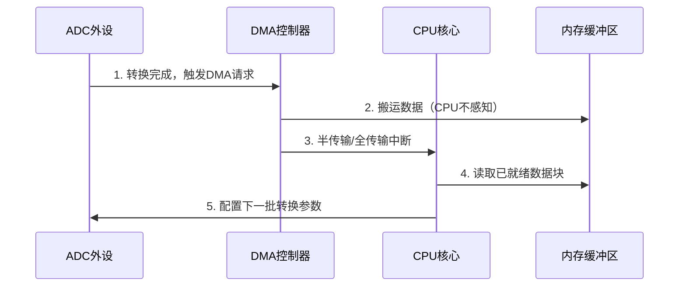
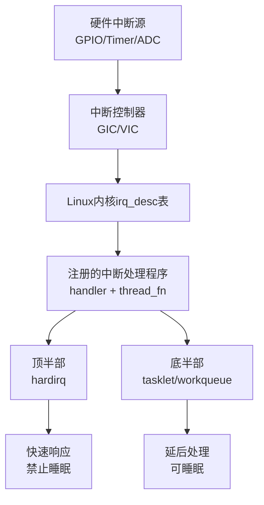

# 中断处理、DMA编程

> 📊 **本模块难度等级：** <span class="badge-ie">**IE级**</span>

> <span class="blue">核心认知目标：理解中断与DMA是嵌入式Linux驱动开发的“时间”与“带宽”两大核心资源——中断解决“事件响应实时性”，DMA解决“数据传输效率”。掌握二者的机制差异、编程接口与协同场景，是写出高性能驱动的必要前提。</span>

---

## 本模块知识点

| 知识点 | 难度 | 核心能力 |
|--------|------|----------|
| 中断机制与Linux中断子系统 | B→I | 理解中断生命周期、注册与注销、顶半部/底半部分离 |
| 中断上下文与并发安全 | I→E | 掌握中断中禁止睡眠的原因、自旋锁的正确使用 |
| DMA原理与编程接口 | I→E | 理解DMA映射、一致性/流式DMA、scatter-gather |
| 中断与DMA协同实战 | I→E | 设计“中断触发+DMA搬运”的高效数据采集链路 |
| 嵌入式专属优化 | E→M | 中断亲和性绑定、DMA缓存对齐、零拷贝路径 |

---

### <strong>为什么要专门学习中断与DMA</strong>

嵌入式系统的核心矛盾是<span class="red">CPU算力有限</span>但<span class="red">外设数据吞吐量大</span>。
以工业数据采集场景为例：一个16通道ADC以1MHz采样率工作，每秒产生32MB原始数据。若用CPU轮询读取，即使主频1GHz的ARM核心也会被占用80%以上，导致控制逻辑无法及时响应。

<span class="blue">中断+DMA的组合，正是解决这一矛盾的工业标准方案。</span><br>

中断承担“事件通知”角色：ADC完成一次转换后触发中断，CPU仅在此时介入，耗时微秒级；
DMA承担“数据搬运”角色：中断触发后启动DMA，将ADC缓冲区数据搬运到内存指定区域，全程无需CPU参与。
CPU仅在DMA完成后的中断中处理已就绪的数据块，整体CPU占用率可降至5%以下。<br>

---

### <strong>中断与DMA的协同关系：时间轴视角</strong>

用时间轴理解二者的协作逻辑，是避免“中断里做太多事”或“DMA配置错误导致数据错乱”的关键。



1.  <span class="red">ADC转换完成</span>后，向DMA控制器发出硬件请求信号（非CPU中断）；
2.  <span class="red">DMA控制器</span>接管总线，将ADC输出寄存器数据写入内存Buffer，此时CPU可执行其他任务；
3.  DMA完成预设的半传输或全传输后，向CPU触发<span class="red">中断</span>，通知CPU“数据已就绪”；
4.  CPU在中断服务程序（顶半部）中仅做标记，将数据处理推迟到<span class="green">工作队列</span>或<span class="green">tasklet</span>（底半部）；
5.  底半部中，CPU读取内存Buffer中的数据，完成滤波、协议解析等业务逻辑，并配置ADC启动下一批转换。

<span class="blue">核心洞察：中断负责“节拍器”，DMA负责“搬运工”，CPU负责“决策者”——三者分工明确，才能最大化系统吞吐量。</span><br>

---

### <strong>Linux中断子系统核心架构</strong>

Linux内核将中断管理抽象为三层结构，驱动开发者主要与顶层交互，但理解底层有助于排错。



1.  <span class="red">硬件中断源</span>：外设产生的电平/边沿信号，通过中断线连接到SoC内部；
2.  <span class="red">中断控制器</span>（GIC/VIC）：硬件模块，负责中断优先级仲裁、屏蔽、分发到CPU核心；
3.  <span class="red">irq_desc表</span>：内核维护的全局中断描述符数组，每个中断号对应一个`irq_desc`结构体，记录注册的处理函数、中断标志、统计信息；
4.  <span class="red">中断处理程序</span>：驱动通过`request_irq`或`request_threaded_irq`注册的回调函数；
5.  <span class="red">顶半部与底半部</span>：顶半部（hardirq）在硬件中断上下文中执行，必须快速完成；底半部通过tasklet或工作队列延后执行，可执行耗时操作且允许睡眠。

<span class="blue">关键区分标准：若处理逻辑需要访问用户空间、分配大块内存、持有互斥体，必须放入底半部。</span><br>

---

### <strong>DMA引擎子系统：统一API背后的设计逻辑</strong>

Linux内核的<span class="red">DMA引擎子系统</span>（dmaengine）屏蔽了不同SoC DMA控制器的硬件差异，为驱动提供统一的异步传输接口。


驱动开发者使用DMA引擎的标准流程：

```c
// drivers/dma/dmaengine.c: 统一API入口
// 1. 申请DMA通道
struct dma_chan *chan = dma_request_chan(dev, "rx");

// 2. 准备传输描述符（以内存到设备为例）
struct dma_async_tx_descriptor *desc = dmaengine_prep_slave_single(
    chan, buf_phys, buf_len, DMA_MEM_TO_DEV,
    DMA_PREP_INTERRUPT | DMA_CTRL_ACK);

// 3. 设置完成回调
desc->callback = dma_callback;
desc->callback_param = priv;

// 4. 提交并启动传输
dma_cookie_t cookie = desc->tx_submit(desc);
dma_async_issue_pending(chan);
```

1.  <span class="green">dma_request_chan</span>：从设备树解析DMA通道信息，向DMA引擎申请独占通道；
2.  <span class="green">dmaengine_prep_slave_single</span>：创建单次传输描述符，配置源地址、目的地址、传输方向；
3.  <span class="green">tx_submit</span>：将描述符加入DMA引擎的待执行队列；
4.  <span class="green">dma_async_issue_pending</span>：通知DMA控制器立即开始执行队列中的传输。

<span class="blue">核心设计意图：驱动开发者无需关心DMA控制器的寄存器细节，只需描述“从哪里搬到哪里、搬多少”，内核自动完成通道调度与中断管理。</span><br>

---

### <strong>一致性DMA与流式DMA：选型依据</strong>

DMA缓冲区存在<span class="red">缓存一致性</span>问题：CPU写内存后，数据可能暂存于Cache而未写回物理内存；DMA控制器直接访问物理内存，会读到旧数据。

Linux提供两种DMA映射方式解决此问题：

| 映射方式 | API | 适用场景 | 性能特征 | 一致性保证 |
|----------|-----|----------|----------|------------|
| 一致性映射 | dma_alloc_coherent | 小数据量控制结构（如描述符环） | 无需同步开销，但可能禁用Cache | 硬件保证 |
| 流式映射 | dma_map_single / dma_unmap_single | 大数据量传输（如视频帧、音频块） | Cache有效，需显式同步 | 软件同步 |

选型推导逻辑：
1.  若缓冲区由CPU和DMA<span class="red">频繁交替访问</span>（如控制命令），且数据量小（<1KB），选<span class="green">dma_alloc_coherent</span>，以简化同步逻辑；
2.  若缓冲区由DMA<span class="red">单向大批量传输</span>（如摄像头图像），选<span class="green">dma_map_single</span>，保持Cache有效，仅在传输前后调用<span class="green">dma_sync_single_for_device</span> / <span class="green">dma_sync_single_for_cpu</span>做同步。

```c
// drivers/base/dma-mapping.c: 流式映射同步示例
// 传输前：将CPU修改的数据刷入内存，供DMA读取
void *buf = kzalloc(BUF_SIZE, GFP_KERNEL);
dma_addr_t dma_addr = dma_map_single(dev, buf, BUF_SIZE, DMA_TO_DEVICE);
// ... DMA传输中 ...
dma_sync_single_for_cpu(dev, dma_addr, BUF_SIZE, DMA_FROM_DEVICE);
// 现在CPU可以安全读取DMA写入的数据
```

<span class="blue">常见踩坑点：使用流式映射后忘记调用dma_unmap_single，会导致后续该内存区域的Cache行为异常，引发随机数据错乱。</span><br>

---

### <strong>学习路径建议：从B到E的递进路线</strong>

| 阶段 | 目标 | 关键验证动作 |
|------|------|--------------|
| B级（入门） | 理解中断生命周期，能写request_irq/free_irq | 在开发板上写一个按键中断驱动，printk确认触发 |
| I级（进阶） | 掌握顶半部/底半部分离，理解中断上下文限制 | 用tasklet替代长中断处理，验证系统不再卡顿 |
| E级（高级） | 独立完成DMA配置，设计中断+DMA协同链路 | 驱动ADC以1MHz采样，DMA搬运，CPU占用<10% |

<span class="blue">关键原则：不要在中断里做“业务逻辑”，只在中断里做“事件标记”——这是区分入门与进阶的分水岭。</span><br>

---

### <strong>历史演进：从中断轮询到智能DMA</strong>

早期嵌入式系统（8位单片机时代）没有DMA，所有外设数据都由CPU通过<span class="green">IN/OUT</span>指令轮询读取。
这种模式下，CPU占用率与外设数据量成正比，系统无法同时处理多个高速外设。

2000年后，ARM Cortex-A系列引入<span class="red">片上DMA控制器</span>（如PL330），嵌入式Linux开始支持统一的DMA引擎子系统（<span class="green">dmaengine</span>）。
驱动开发者不再需要直接操作DMA寄存器，而是通过<span class="green">dmaengine</span>的API（如`dma_async_issue_pending`、`dmaengine_submit`）发起异步传输请求，内核自动管理通道分配与中断合并。

现代SoC（如RK3588、IMX8）更进一步，引入<span class="red">智能DMA</span>（IDMA）——DMA控制器内置简单逻辑，可自主完成“链式传输→中断触发→启动下一链”的闭环，CPU仅需在初始化时配置一次。
<br>

---

### <strong>本模块小结</strong>

| 维度 | 中断 | DMA | 协同要点 |
|------|------|-----|----------|
| 核心角色 | 事件通知 | 数据搬运 | 中断触发DMA启动 |
| CPU参与 | 微秒级响应 | 零参与（传输期） | CPU仅在首尾介入 |
| 上下文限制 | 不可睡眠 | 需配置内存一致性 | 中断中启动DMA，底半部处理数据 |
| 关键API | request_irq、tasklet_schedule | dmaengine_submit、dma_sync | dma_async_issue_pending + 中断回调 |
| 踩坑点 | 中断处理过长导致丢中断 | 缓存不一致导致数据错乱 | 未做半传输中断导致数据覆盖 |

**练习**

1.  为什么中断上下文不能调用`kmalloc(GFP_KERNEL)`？若在中断中分配内存，应使用哪个标志？请写出代码片段并注释原因。
2.  某驱动使用`dma_alloc_coherent`分配DMA缓冲区，但在多核平台上出现偶发数据错乱。分析可能原因，并给出至少两种修复方案。
3.  设计一个“双Buffer乒乓DMA”采集方案：ADC连续采样，DMA交替写入Buffer-A和Buffer-B，CPU在Buffer满中断中处理已填满的Buffer。画出状态机图（Mermaid），并说明如何避免“CPU处理慢于DMA写入”导致的覆盖问题。

---
