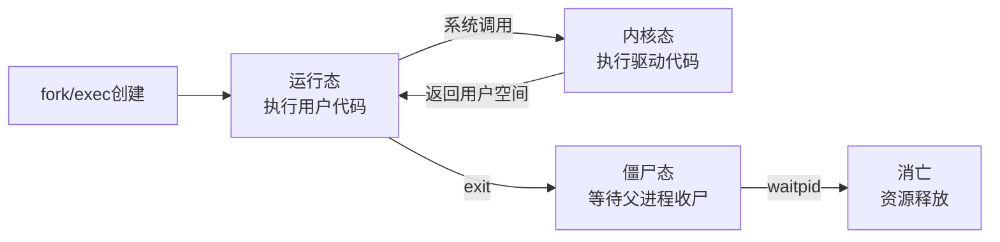

# 并发与竞态

> 📊 **本节难度等级：** <span class="badge-b">**B级**</span>

---

### <strong>为什么驱动开发者需要理解进程：用户空间与内核空间的交互入口</strong>

嵌入式Linux驱动运行在内核空间，但驱动的绝大多数调用来自用户空间的<span class="red">进程</span>。当应用程序执行`open("/dev/led0")`时，内核会创建一个代表该调用的<span class="red">进程上下文</span>，进入驱动注册的`open`函数执行。因此，理解进程的本质——它是如何被创建、如何调度、如何消亡的——是理解“谁在调用我的驱动”的前提。

<span class="blue">进程是驱动与用户空间之间的唯一交互载体。不理解进程，就无法理解驱动的并发来源。</span><br>

---

### <strong>进程的核心概念：从创建到消亡的完整生命周期</strong>

<span class="red">进程</span>是Linux系统中资源分配的基本单位，每个进程拥有独立的虚拟地址空间、文件描述符表、信号处理表等资源。对驱动开发者而言，最关键的是理解进程的两个状态：运行态（正在执行驱动代码）和阻塞态（等待IO完成）。



1.  <span class="red">创建</span>：进程通过`fork()`复制父进程创建子进程，子进程继承父进程的文件描述符表（包括已打开的驱动设备节点）。子进程随后调用`exec()`加载新程序，替换地址空间但保留继承的文件描述符；
2.  <span class="red">运行与调度</span>：进程在用户空间和内核空间之间切换。进入内核空间时（如调用`read`），Linux调度器可能在此期间将CPU切换给另一个进程——这是驱动面临<span class="red">并发</span>的根本来源；
3.  <span class="red">阻塞与唤醒</span>：当驱动中调用`wait_event_interruptible`时，当前进程进入睡眠状态，CPU被释放给其他进程。当条件满足（如中断到达）时，`wake_up`将进程重新放入就绪队列；
4.  <span class="red">消亡</span>：进程调用`exit()`或收到信号终止，进入<span class="red">僵尸态</span>（Zombie），保留进程表项等待父进程通过`waitpid`回收。若父进程未回收，僵尸进程持续占用PID和内核资源。

<span class="blue">驱动视角的关键洞察：进程在驱动中睡眠时，调度器会切换执行流。若另一进程在此期间访问同一驱动资源，竞态即产生。</span><br>

---

### <strong>fork与exec对驱动开发的影响</strong>

`fork()`和`exec()`是Unix进程模型的核心API，它们对驱动开发有直接影响：

1.  <span class="red">fork复制文件描述符表</span>：子进程继承父进程打开的所有设备节点。若驱动在`open`中分配了每进程私有数据（如`filp->private_data`），父子进程将共享同一指针——这是驱动设计中必须处理的场景；
2.  <span class="red">exec替换地址空间但不关闭fd</span>：新程序执行时，继承的文件描述符仍保持打开。若驱动在`release`中依赖引用计数释放资源，必须正确处理`fork`后引用计数的递增；
3.  <span class="red">close-on-exec标志</span>：驱动可通过`fcntl(fd, F_SETFD, FD_CLOEXEC)`设置关闭标志，避免子进程继承敏感设备节点。

```c
// drivers/char/demo_drv.c: fork场景下的引用计数管理
// 行号：80-110
static int demo_open(struct inode *inode, struct file *filp)
{
    struct demo_dev *dev = container_of(inode->i_cdev, struct demo_dev, cdev);
    
    // 为每个打开操作增加引用计数
    atomic_inc(&dev->ref_count);
    filp->private_data = dev;
    
    pr_info("demo: open, ref_count=%d\n", atomic_read(&dev->ref_count));
    return 0;
}

static int demo_release(struct inode *inode, struct file *filp)
{
    struct demo_dev *dev = filp->private_data;
    
    // 每次close减少引用计数，归零时才释放硬件资源
    if (atomic_dec_and_test(&dev->ref_count)) {
        gpio_free(dev->gpio_num);
        pr_info("demo: last close, hardware released\n");
    }
    return 0;
}
```

<span class="blue">核心设计原则：驱动应使用原子引用计数管理硬件资源生命周期，而非依赖单个进程的open/close配对——因为fork会让一对open变成多个close。</span><br>

---

### <strong>进程间关系与资源竞争：父子、兄弟进程如何共享驱动</strong>

多个进程同时访问同一驱动设备时，形成<span class="red">兄弟进程竞争</span>；父子进程因fork继承fd，形成<span class="red">跨代资源引用</span>。驱动必须识别这些关系并设计合适的同步策略。

| 进程关系 | 资源共享方式 | 驱动风险 | 处理策略 |
|----------|------------|----------|----------|
| 父子进程 | fork继承fd表，共享同一设备节点 | 子进程意外close导致父进程无法使用 | 引用计数 + 原子操作 |
| 兄弟进程 | 独立open同一设备 | 并发读写导致数据错乱 | 自旋锁/互斥体 |
| 独立进程 | 无亲缘关系，各自open | 无继承风险，纯并发竞争 | 标准并发控制 |

1.  父子进程场景：守护进程（daemon）常通过`fork()`两次脱离终端控制。若守护进程在fork前打开了设备，子进程继承fd，父进程应立即关闭以避免重复引用；
2.  兄弟进程场景：多进程服务器（如Nginx worker进程）各自独立打开设备节点，驱动面临典型的多进程并发访问，必须用锁保护共享状态。

<span class="blue">嵌入式典型场景：工业网关中的“主进程+采集子进程”架构。主进程打开ADC设备，fork子进程后子进程继承fd。若驱动未做引用计数，子进程exit时释放ADC硬件，主进程后续读取将触发空指针异常。</span><br>

---

### <strong>僵尸进程与驱动资源泄漏</strong>

<span class="red">僵尸进程</span>（Zombie Process）是已终止但未被父进程回收的进程，保留进程表项和已打开文件描述符的引用。对驱动的间接影响包括：

1.  <span class="red">PID耗尽</span>：大量僵尸进程占用PID空间，导致新进程无法创建。虽然现代系统PID上限达32768，但长期运行的嵌入式设备仍可能耗尽；
2.  <span class="red">文件描述符未释放</span>：僵尸进程持有的fd未被close，驱动`release`不会被调用，硬件资源持续被占用。

僵尸进程的识别与处理：

```bash
# 查看僵尸进程
$ ps aux | grep 'Z'
USER       PID %CPU %MEM    VSZ   RSS TTY      STAT START   TIME COMMAND
root      1234  0.0  0.0      0     0 ?        Z    10:02   0:00 [app_process]
# STAT列的Z表示僵尸态
```

驱动开发者无法直接回收僵尸进程，但可通过以下设计降低影响：
- 在`open`中使用<span class="green">O_CLOEXEC</span>标志，或驱动内部设置`FD_CLOEXEC`，避免子进程继承关键设备；
- 监控引用计数异常增长，printk告警提示可能的僵尸进程泄漏。

<span class="blue">关键认知：僵尸进程是用户空间问题，但驱动作为资源管理者，应设计防御性机制减少其间接伤害。</span><br>

---

### <strong>守护进程化：嵌入式设备的常驻驱动服务</strong>

嵌入式系统中，驱动通常由<span class="red">守护进程</span>（Daemon）长期持有——守护进程脱离终端、后台运行，是工业控制器、物联网网关的标准架构。守护进程化对驱动的要求：

1.  <span class="red">持久持有设备</span>：守护进程在初始化时open设备，运行期间不close，直到进程终止。驱动需保证长时间运行的稳定性（如无内存泄漏、无状态漂移）；
2.  <span class="red">信号处理</span>：守护进程接收SIGTERM/SIGHUP进行优雅退出。驱动应支持`release`在中断上下文中被调用时的快速清理；
3.  <span class="red">双fork技巧</span>：标准守护进程化流程是`fork→setsid→fork→chdir('/')→umask(0)`。第二次fork后，父进程退出，孙子进程成为真正的守护进程，脱离会话领导地位。

```c
// drivers/char/daemon_compatible.c: 兼容守护进程的release设计
// 行号：120-140
static int daemon_demo_release(struct inode *inode, struct file *filp)
{
    struct daemon_dev *dev = filp->private_data;
    
    // 快速路径：若当前是信号触发的强制关闭，不做耗时操作
    if (fatal_signal_pending(current)) {
        pr_warn("daemon_demo: forced release under signal, skip cleanup\n");
        return 0;
    }
    
    // 正常路径：等待DMA完成、释放缓存、复位硬件
    dmaengine_terminate_sync(dev->chan);
    kfree(dev->dma_buf);
    gpio_set_value(dev->reset_gpio, 0);
    
    return 0;
}
```

<span class="blue">守护进程驱动的设计铁律：open时要慢（充分初始化），release时要快（支持信号强制退出），运行时要稳（无泄漏、可监控）。</span><br>

---

### <strong>嵌入式场景：进程模型如何影响驱动设计</strong>

嵌入式Linux与桌面系统的进程模型存在本质差异，驱动设计必须适配：

| 维度 | 桌面系统 | 嵌入式系统 | 驱动影响 |
|------|----------|------------|----------|
| 进程数量 | 数百个 | 通常<50个 | 进程级锁竞争概率低，但单进程故障影响大 |
| 进程生命周期 | 短（用户交互驱动） | 长（守护进程为主） | 驱动需支持长时间运行无泄漏 |
| fork使用频率 | 低（除shell外） | 中（多进程架构常见） | 必须正确处理fd继承和引用计数 |
| 内存压力 | 有swap缓解 | 无swap，OOM直接杀进程 | 驱动内存分配策略需更保守 |

1.  <span class="red">低进程数高稳定性要求</span>：嵌入式系统进程少但每个都关键。驱动中任一竞态导致的崩溃都会直接影响业务，测试覆盖率要求高于桌面；
2.  <span class="red">无swap的OOM敏感性</span>：驱动中`kmalloc`分配大块内存可能触发OOM killer，导致关键进程被杀。应使用`__GFP_NORETRY`或预留内存池。

<span class="blue">嵌入式驱动设计第一性原理：在资源受限、无人工干预、长期运行的前提下，任何并发假设都是保守的——宁可过度同步，不可遗漏竞态。</span><br>

---

### <strong>历史演进：从独立内核到抢占式多任务</strong>

早期嵌入式系统（如μC/OS、VxWorks早期版本）采用<span class="red">协作式多任务</span>——进程主动让出CPU，内核不强制抢占。这种模式下，驱动几乎无需考虑并发，因为单个进程会执行到主动放弃控制权。

Linux从诞生之初就是<span class="red">抢占式多任务</span>系统，内核空间早期不可抢占（2.4及之前）。驱动在内核态执行时，只有显式调用`schedule()`或返回用户空间时才会切换进程，并发风险相对可控。

Linux 2.6引入<span class="red">抢占式内核</span>（CONFIG_PREEMPT），内核空间也可被中断和更高优先级进程抢占。这一变革极大提升了实时响应能力，但也让驱动并发场景暴增——原本单线程执行的驱动函数，现在可能在任意指令边界被打断。

现代内核（5.x+）进一步引入<span class="green">实时抢占补丁</span>（PREEMPT_RT），将调度粒度细化到自旋锁级别，驱动的并发控制从“大段代码加锁”演进为“最小临界区加锁”的细粒度模式。

<span class="blue">演进本质：调度粒度不断细化，驱动开发者必须假设“任何时刻都可能被抢占”，这是现代驱动并发设计的根本出发点。</span><br>

---

### <strong>本节小结</strong>

| 概念 | 核心要点 | 驱动关联 |
|------|----------|----------|
| 进程生命周期 | fork/exec/exit/僵尸态 | open/release的调用时机与次数不可预期 |
| fork影响 | 继承fd表，共享private_data指针 | 必须用原子引用计数管理硬件资源 |
| 僵尸进程 | 未回收的终止进程，占用PID和fd | 设计O_CLOEXEC和引用计数告警 |
| 守护进程 | 双fork后台运行，长期持有设备 | release需支持信号强制退出 |
| 嵌入式差异 | 进程少、无swap、长期运行 | 保守同步策略，防泄漏优先于性能 |

**练习**

1.  某驱动在`open`中分配`private_data`结构体，在`release`中`kfree`释放。当用户程序fork子进程后父子同时操作设备，子进程exit时触发`release`，导致父进程的`private_data`指针悬空。分析根因并给出修复代码。
2.  编写一个嵌入式守护进程化的完整流程（C语言），要求：两次fork、setsid、脱离终端、重定向标准输入输出到`/dev/null`、设置信号处理函数。在初始化阶段open设备节点，信号处理中优雅关闭设备。
3.  为什么嵌入式系统没有swap时，驱动中的内存泄漏比普通系统更危险？结合`kmalloc`/`kfree`和OOM killer机制，说明驱动应如何设计内存分配策略以降低风险。

---
