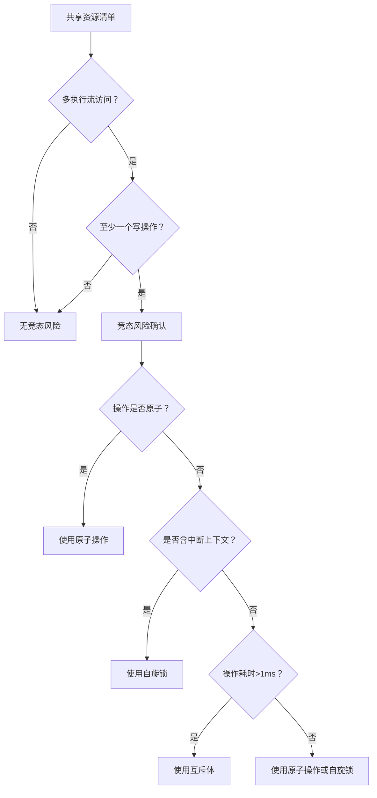
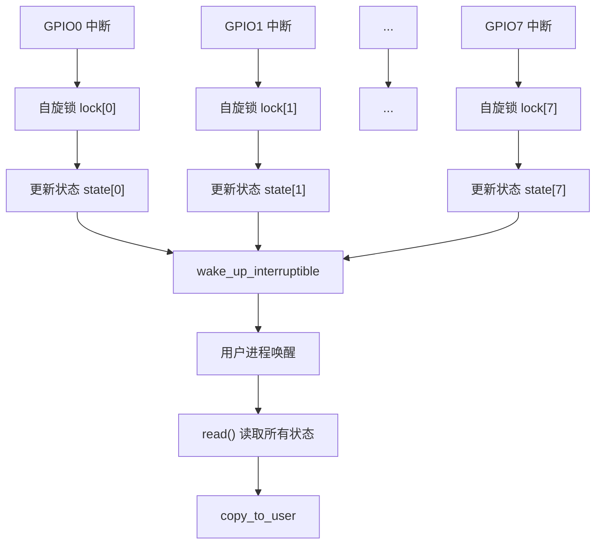

# 4 嵌入式专属实战场景

> **本节难度等级：** [I]

> <span class="blue">核心认知目标：理解嵌入式系统中GPIO并发控制、中断上下文竞态与原子操作的实战场景，掌握在多执行流环境下编写稳定驱动代码的方法论。</span>

---

### <strong>GPIO并发控制与寄存器级竞态</strong>

嵌入式系统中，<span class="red">GPIO控制器</span>是最常见的外设共享资源。<br>
多个驱动模块或进程可能同时操作同一GPIO控制器下的不同引脚，<br>
但寄存器级别的并发写入会导致配置错乱——即使各引脚逻辑独立，<br>
底层寄存器读写仍需要同步保护。

以ARM SoC的GPIO控制器为例，其寄存器组织通常包含：

- <span class="green">GPIO方向寄存器</span>（GDIR）：配置引脚输入/输出方向
- <span class="green">GPIO数据寄存器</span>（GDR）：读写引脚电平状态
- <span class="green">GPIO中断配置寄存器</span>（ICR）：配置中断触发方式

当进程A配置GPIO1为输出方向，同时进程B配置GPIO2为输入方向，<br>
若两个进程并发读写GDIR寄存器，可能出现以下时序问题：<br>
1. 进程A读取GDIR值（假设为0x0000_0000）<br>
2. 进程B读取GDIR值（同样为0x0000_0000）<br>
3. 进程A将bit0置1（变为0x0000_0001）并写回<br>
4. 进程B将bit1置1（变为0x0000_0002）并写回<br>
5. 最终结果可能为0x0000_0002，进程A的配置被覆盖<br>

```c
// drivers/gpio/gpio_concurrent.c: GPIO寄存器级并发保护
// 行号：25-48
#include <linux/spinlock.h>

/* 每个GPIO控制器一个自旋锁，实现细粒度并发控制 */
static DEFINE_SPINLOCK(gpio_ctrl_lock);

static void gpio_set_direction_safe(int pin, int dir)
{
    unsigned long flags;
    u32 val;

    /* 获取自旋锁并保存中断状态 */
    spin_lock_irqsave(&gpio_ctrl_lock, flags);
    
    val = __raw_readl(GPIO_DIR_REG);
    if (dir)
        val |= (1 << pin);
    else
        val &= ~(1 << pin);
    __raw_writel(val, GPIO_DIR_REG);
    
    /* 释放自旋锁并恢复中断状态 */
    spin_unlock_irqrestore(&gpio_ctrl_lock, flags);
}
```

<span class="blue">核心原则：GPIO操作必须加锁保护，锁粒度应控制在"控制器级别"而非"全局级别"，避免不同控制器之间的操作串行化。</span><br>

---

### <strong>中断上下文中的并发安全</strong>

嵌入式系统中，<span class="red">中断服务程序</span>（ISR）是与进程上下文并发交互的最常见执行流。<br>
ISR具有高优先级、不可睡眠、执行时间受限等特征，<br>
驱动代码必须在中断上下文和进程上下文之间建立正确的同步边界。

中断上下文与进程上下文的关键差异：

| <span class="orange">维度</span> | <span class="orange">中断上下文</span> | <span class="orange">进程上下文</span> |
|------|-----------|-------------|
| 睡眠能力 | 禁止睡眠 | 允许睡眠 |
| 调度能力 | 不可调度 | 可被调度器抢占 |
| 锁类型 | 自旋锁（spinlock） | 互斥体（mutex） |
| 执行时间 | 极短（通常<100us） | 可较长 |
| 栈空间 | 固定大小（通常1-4KB） | 动态分配 |

当中断处理程序与进程共享数据时，必须使用<span class="red">自旋锁</span>进行保护，<br>
且必须采用`spin_lock_irqsave()` / `spin_unlock_irqrestore()`配对，<br>
以确保在获取锁的同时关闭本地CPU中断，防止ISR嵌套导致的死锁。

```c
// drivers/irq/irq_gpio_key.c: 中断上下文同步保护示例
// 行号：55-82
static DEFINE_SPINLOCK(key_state_lock);
static volatile int key_pressed = 0;
static unsigned long key_jiffies = 0;

/* ── 中断服务程序（顶半部） ── */
static irqreturn_t key_irq_handler(int irq, void *dev_id)
{
    unsigned long flags;
    
    spin_lock_irqsave(&key_state_lock, flags);
    key_pressed = 1;
    key_jiffies = jiffies;
    spin_unlock_irqrestore(&key_state_lock, flags);
    
    /* 调度底半部进行后续处理 */
    return IRQ_WAKE_THREAD;
}

/* ── 线程化中断处理（底半部） ── */
static irqreturn_t key_irq_thread(int irq, void *dev_id)
{
    unsigned long flags;
    int pressed;
    unsigned long ts;
    
    spin_lock_irqsave(&key_state_lock, flags);
    pressed = key_pressed;
    ts = key_jiffies;
    key_pressed = 0;  /* 清除标志 */
    spin_unlock_irqrestore(&key_state_lock, flags);
    
    if (pressed) {
        /* 安全地在进程上下文中处理按键事件 */
        input_report_key(key_input_dev, KEY_1, 1);
        input_sync(key_input_dev);
    }
    return IRQ_HANDLED;
}
```

<span class="blue">关键洞察：中断顶半部只做最小必要操作（标记状态+调度底半部），所有耗时操作和状态查询都应推迟到底半部执行，这是保证系统实时响应的核心原则。</span><br>

---

### <strong>竞态条件的识别与消除</strong>

竞态条件（Race Condition）的识别是嵌入式驱动调试中最具挑战性的任务之一，<br>
因为竞态通常表现为"偶发故障"——相同的代码在大多数情况下运行正常，<br>
仅在特定的执行时序交错时出现问题。

竞态识别的系统性方法：



以多路ADC采样驱动为例，分析竞态风险点：

1.  <span class="orange">共享数据缓冲区</span>：DMA将ADC数据写入环形缓冲区，用户进程通过`read()`读取数据。若读写指针未加锁保护，可能读到半更新的不一致数据。
2.  <span class="orange">采样状态标志</span>：ADC采样完成标志位在中断中被置位，在用户进程中被查询和清除。若不用原子操作，可能出现标志丢失。
3.  <span class="orange">采样配置参数</span>：用户进程通过`ioctl`修改采样频率，同时ISR按旧频率配置DMA。若配置过程可中断，DMA可能按错误参数运行。

消除策略对应表：

| <span class="orange">风险点</span> | <span class="orange">同步机制</span> | <span class="orange">实现要点</span> |
|------|----------|----------|
| 数据缓冲区读写 | 自旋锁+内存屏障 | 锁保护指针更新， smp_wmb()保证顺序 |
| 状态标志 | 原子操作 | atomic_set / atomic_read |
| 配置参数 | 互斥体+配置生效点 | 在采样停止状态下修改配置 |

---

### <strong>原子操作在嵌入式驱动中的应用</strong>

<span class="red">原子操作</span>是开销最小的同步机制，适用于单变量的计数、标志位、状态查询等场景。<br>
在嵌入式系统中，原子操作尤为重要，因为自旋锁在中断中忙等会显著增加功耗，<br>
而原子操作由CPU指令保证不可分割，无需等待。

ARM架构的原子操作实现依赖于<span class="green">LDREX/STREX</span>指令对：<br>
- `LDREX`：独占加载，标记监视器开始监视该内存地址<br>
- `STREX`：独占存储，仅当监视期间没有其他写操作时才成功存储<br>

```c
// arch/arm/include/asm/atomic.h: ARM原子操作底层实现
// 行号：30-55
static inline void atomic_add(int i, atomic_t *v)
{
    unsigned long tmp;
    int result;

    __asm__ __volatile__(
        "@ atomic_add\n"
        "1:\tldrex\t%0, [%3]\n"
        "\tadd\t%0, %0, %4\n"
        "\tstrex\t%1, %0, [%3]\n"
        "\tteq\t%1, #0\n"
        "\tbne\t1b"
        : "=&r" (result), "=&r" (tmp), "+Qo" (v->counter)
        : "r" (&v->counter), "Ir" (i)
        : "cc");
}
```

嵌入式驱动中原子操作的典型应用场景：

1.  <span class="orange">中断计数</span>：统计外设触发的中断次数，ISR中`atomic_inc()`，用户态`atomic_read()`
2.  <span class="orange">状态标志</span>：设备运行/停止标志，`atomic_set()`设置，`atomic_read()`查询
3.  <span class="orange">引用计数</span>：设备打开次数统计，`atomic_inc()`在open中，`atomic_dec_and_test()`在release中
4.  <span class="orange">位操作</span>：标志位集合，`test_and_set_bit()` / `clear_bit()`

```c
// drivers/iio/adc/adc_atomic.c: 原子操作在ADC驱动中的应用
// 行号：40-65
static atomic_t adc_sample_count = ATOMIC_INIT(0);
static atomic_t adc_error_count = ATOMIC_INIT(0);

/* ── 中断中更新计数 ── */
static irqreturn_t adc_dma_irq(int irq, void *dev_id)
{
    struct adc_priv *priv = dev_id;
    
    if (dma_status_ok(priv->dma_chan)) {
        atomic_inc(&adc_sample_count);
        priv->buf_ready = 1;
    } else {
        atomic_inc(&adc_error_count);
        priv->dma_error = 1;
    }
    
    return IRQ_WAKE_THREAD;
}

/* ── 用户态读取计数 ── */
static long adc_ioctl(struct file *file, unsigned int cmd, unsigned long arg)
{
    struct adc_stats stats;
    
    stats.samples = atomic_read(&adc_sample_count);
    stats.errors = atomic_read(&adc_error_count);
    
    if (copy_to_user((void __user *)arg, &stats, sizeof(stats)))
        return -EFAULT;
    return 0;
}
```

<span class="blue">选型原则：单变量读写优先原子操作；多变量一致性保护用自旋锁；长时间持有锁用互斥体（仅进程上下文）。</span><br>

---

### <strong>实战案例：多路GPIO并发按键驱动</strong>

本节以全志T113平台8路GPIO按键输入为实战场景，<br>
演示从需求分析到完整实现的全过程。<br>
需求：8路独立按键，每路有独立的中断触发，<br>
用户进程可通过`read()`轮询按键状态，也可通过`select()`阻塞等待按键事件。

<span class="orange">并发场景分析：</span><br>
1.  多路按键可能同时按下，对应8个GPIO引脚同时触发中断<br>
2.  用户进程读取某路按键状态时，可能正发生另一路按键的中断<br>
3.  `open()`和`release()`在多进程环境下可能被并发调用<br>

<span class="orange">同步架构设计：</span><br>
- 每路按键一个自旋锁：防止同一引脚的配置与状态读取竞态<br>
- 全局等待队列：支持`select()` / `poll()`的多路事件通知<br>
- 原子变量：统计总按键事件次数<br>



```c
// drivers/input/gpio_keys_multi.c: 多路GPIO按键并发驱动
// 行号：80-140
#define KEY_NUM 8

struct gpio_key {
    int gpio;
    int irq;
    spinlock_t lock;
    int state;              /* 0=释放, 1=按下 */
    unsigned long last_jiffies;
};

static struct gpio_key keys[KEY_NUM];
static DECLARE_WAIT_QUEUE_HEAD(key_waitq);
static atomic_t key_event_total = ATOMIC_INIT(0);

/* ── 中断处理：每路按键独立 ── */
static irqreturn_t gpio_key_irq(int irq, void *dev_id)
{
    struct gpio_key *key = dev_id;
    unsigned long flags;
    int val;

    spin_lock_irqsave(&key->lock, flags);
    
    val = gpio_get_value(key->gpio);
    if (val != key->state) {
        /* 消抖：两次变化间隔必须>20ms */
        if (jiffies - key->last_jiffies > msecs_to_jiffies(20)) {
            key->state = val;
            key->last_jiffies = jiffies;
            atomic_inc(&key_event_total);
            spin_unlock_irqrestore(&key->lock, flags);
            
            wake_up_interruptible(&key_waitq);
            return IRQ_HANDLED;
        }
    }
    
    spin_unlock_irqrestore(&key->lock, flags);
    return IRQ_NONE;
}

/* ── read()：返回所有按键状态 ── */
static ssize_t keys_read(struct file *filp, char __user *buf,
                         size_t count, loff_t *offp)
{
    unsigned char states[KEY_NUM];
    unsigned long flags;
    int i;

    if (count < KEY_NUM)
        return -EINVAL;

    /* 分别获取每路锁，读取状态 */
    for (i = 0; i < KEY_NUM; i++) {
        spin_lock_irqsave(&keys[i].lock, flags);
        states[i] = keys[i].state;
        spin_unlock_irqrestore(&keys[i].lock, flags);
    }

    if (copy_to_user(buf, states, KEY_NUM))
        return -EFAULT;

    return KEY_NUM;
}

/* ── poll()：支持select/poll ── */
static unsigned int keys_poll(struct file *filp, poll_table *wait)
{
    poll_wait(filp, &key_waitq, wait);
    
    /* 只要有任意按键状态变化，就返回可读 */
    if (atomic_read(&key_event_total) > 0)
        return POLLIN | POLLRDNORM;
    
    return 0;
}
```

<span class="blue">关键设计决策：每路按键独立自旋锁而非全局锁，使得8路按键的中断处理完全并行，在多核SoC上可实现真正的并发响应。全局等待队列+原子计数则支持统一的事件通知机制。</span><br>

---

### <strong>历史演进：从全局关中断到细粒度并发控制</strong>

早期嵌入式Linux内核（2.4及之前）处理并发的手段极为粗暴——<span class="green">cli/sti</span>直接关闭和开启全局中断。<br>
这种方式虽然简单有效，但会导致高优先级中断被延迟响应，<br>
在实时性要求高的嵌入式场景下不可接受。

Linux 2.6引入<span class="red">自旋锁体系</span>，将同步粒度从"全局中断"缩小到"特定资源"。<br>
同时引入<span class="red">抢占式内核</span>配置（CONFIG_PREEMPT），<br>
允许内核空间被进程抢占，进一步放大了并发场景的复杂度。

现代内核（5.x+）的演进方向：
1.  <span class="green">lockdep</span>：运行时锁依赖检测，自动发现死锁和递归锁<br>
2.  <span class="green">percpu变量</span>：为每CPU核心分配私有变量副本，彻底消除缓存行竞争<br>
3.  <span class="green">RCU机制</span>：读多写少场景下的无锁同步，适用于链表遍历等场景<br>

<span class="blue">演进主线：同步粒度不断细化，从"全局中断"到"资源级锁"再到"无锁设计"——目标是在保证正确性的前提下，最大化并发吞吐量。</span><br>

---

### <strong>本模块小结</strong>

| <span class="orange">维度</span> | <span class="orange">GPIO并发控制</span> | <span class="orange">中断上下文</span> | <span class="orange">原子操作</span> |
|------|-------------|-------------|----------|
| 核心风险 | 寄存器级读写覆盖 | ISR与进程数据竞争 | 非原子操作的数据丢失 |
| 首选机制 | 控制器级自旋锁 | spin_lock_irqsave | atomic_inc / atomic_read |
| 关键原则 | 锁粒度=控制器而非全局 | 顶半部最小化+底半部处理 | 单变量读写优先原子 |
| 典型场景 | 多引脚方向配置 | 中断状态标志更新 | 计数器/引用计数 |
| 调试工具 | lockdep / ftrace | irqsoff tracer | 无（依赖代码审查） |

**练习**

1.  某驱动在进程上下文中使用`spin_lock`保护链表遍历操作（平均耗时500us），在高并发下系统响应明显变慢。分析原因，给出优化方案并写出修改后的代码片段。

2.  分析以下代码的死锁风险：进程A持有锁X后请求锁Y，ISR持有锁Y后（通过`spin_trylock`）请求锁X。在什么时序下会触发死锁？如何重构消除风险？

3.  设计一个多路ADC并发采样驱动的同步架构：8路ADC独立采样，每路有DMA缓冲区，用户进程可单独读取每路数据。要求：①不同路之间完全并行；②单路的read()与DMA完成中断无竞态；③支持select()多路等待。画出同步架构图并写出核心代码。
