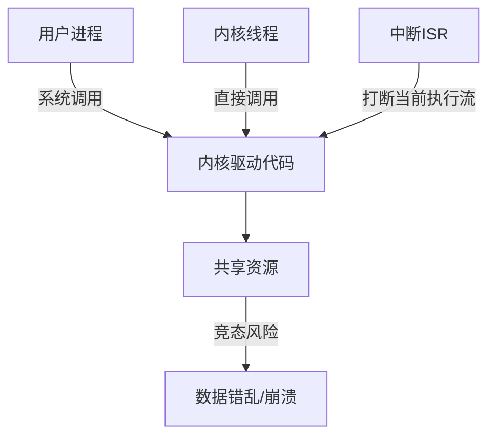
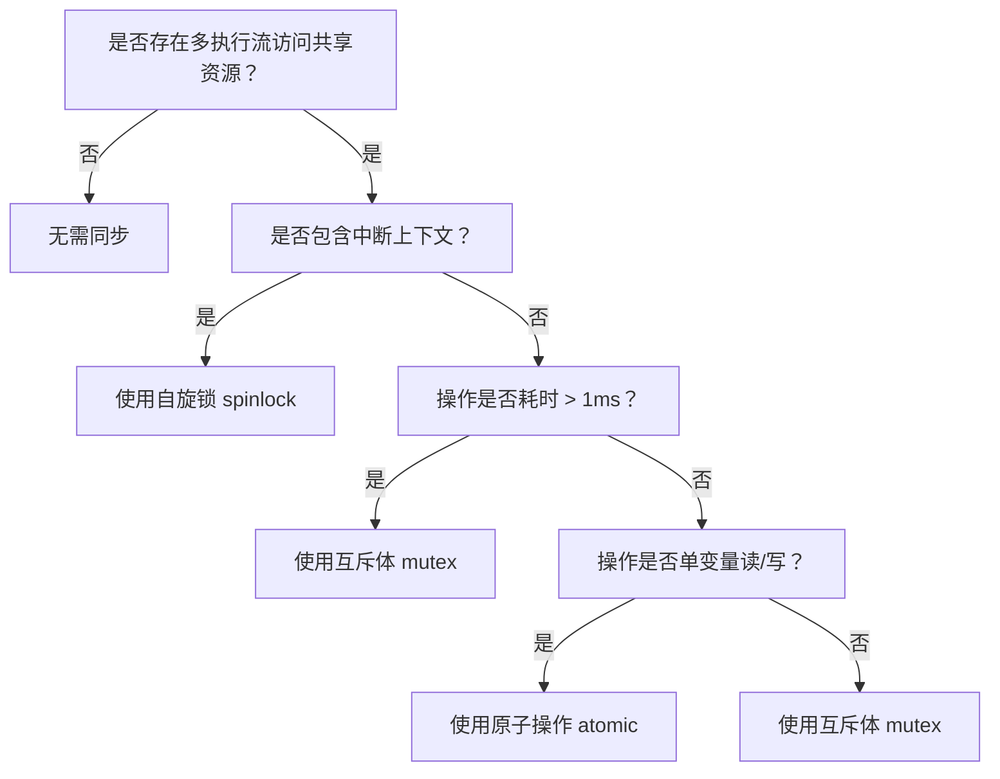

# 并发与竞态

> 📊 **本模块难度等级：** <span class="badge-ie">**IE级**</span>

> <span class="blue">核心认知目标：理解嵌入式Linux驱动开发中的并发场景本质——多进程、多线程、中断三类执行流对共享资源的非原子访问，是竞态产生的根源。掌握自旋锁、互斥体、原子操作等同步工具的正确选型与使用，是编写稳定驱动代码的必修课。</span>

---

## 本模块知识点

| 知识点 | 难度 | 核心能力 |
|--------|------|----------|
| 并发与竞态基础认知 | B→I | 区分三类执行流，判定竞态三要素 |
| 竞态产生的根源解析 | I→E | 分析数据一致性破坏、硬件异常、系统崩溃三类危害 |
| 并发控制核心技术 | I→E | 掌握自旋锁、互斥体、原子操作、内存屏障的选型与实现 |
| GPIO按键并发控制实战 | I→E | 完整实现带自旋锁保护的按键驱动，验证多进程安全 |
| 嵌入式专属实战场景 | I→E | 处理GPIO并发控制、中断上下文竞态、原子操作优化 |

---

### <strong>为什么驱动开发必须正视并发与竞态</strong>

嵌入式Linux驱动运行在内核空间，同时面对三类执行流：<span class="red">用户进程</span>（通过open/read/write调用驱动）、<span class="red">内核线程</span>（kthread/workqueue）、<span class="red">中断服务程序</span>（ISR）。
这三类执行流在单核CPU上通过调度器交替运行，在多核CPU上可真正并行执行——无论哪种情况，只要它们访问同一共享资源且至少一个是写操作，就可能产生竞态。

以最常见的GPIO按键驱动为例：用户进程调用read读取按键状态，同时按键按下触发中断修改状态变量。若read操作被中断打断，进程可能读到不一致的状态值，导致“按键明明按下了，应用层却没反应”的偶发故障。

<span class="blue">竞态的本质不是“代码写错了”，而是“执行流的交替时机不可预测”——同样的代码有时正常、有时异常，是竞态最显著的诊断特征。</span><br>

---

### <strong>三类执行流的特征与并发关系</strong>



1.  <span class="red">用户进程</span>：通过系统调用进入内核，可被调度器抢占，进程切换由调度器管理。多个进程同时open同一设备时，驱动的open函数被交替调用；
2.  <span class="red">内核线程</span>：由kthread_create或workqueue创建，共享内核地址空间，切换开销小于进程。驱动常用内核线程实现后台任务（如LED闪烁），与进程调用形成并发；
3.  <span class="red">中断ISR</span>：硬件触发的异步执行流，优先级最高，可无条件打断进程和线程。ISR执行时间必须极短（通常<100us），否则导致系统响应延迟。

<span class="blue">核心判定规则：只要驱动中存在“全局变量、静态局部变量、硬件寄存器、链表”等共享资源，且多个执行流可能同时访问，就必须设计同步机制。</span><br>

---

### <strong>竞态产生的三要素：缺一不可</strong>

竞态（Race Condition）的产生必须同时满足三个条件，这也是后续“消除竞态”的核心依据：

| 条件 | 说明 | 破坏方式 |
|------|------|----------|
| 多执行流 | 至少两个独立的执行路径 | 单执行流无并发，自然无竞态 |
| 共享资源 | 多个执行流访问同一变量/硬件 | 将资源私有化（每设备一份） |
| 非原子操作 | 操作由多个步骤组成，可被中断 | 用锁或原子操作使操作不可分割 |

以全局变量count++为例说明“非原子操作”的危害：

```c
// drivers/gpio/key_drv.c: 竞态示例
// 行号：45-50
static int key_count = 0;

// 进程A执行count++，编译后分为三步：
// ① 读取key_count到寄存器（假设值为0）
// ② 寄存器加1（变为1）
// ③ 写回key_count（写入1）
// 若步骤①后、步骤③前发生中断，ISR也执行count++，
// 最终count只增加1而非预期的2，数据丢失。
```

1.  执行流A读取count=0到寄存器；
2.  中断触发，执行流B（ISR）读取count=0，加1后写回count=1；
3.  执行流A恢复，将寄存器中的1写回count，最终count=1（应为2）。

<span class="blue">单次丢失看似无害，但每秒上千次中断累积后，计数值与真实事件数严重偏离——在工业计数、流量统计等场景下是致命错误。</span><br>

---

### <strong>同步工具选型决策树</strong>



1.  <span class="red">自旋锁（spinlock）</span>：适用于中断上下文或操作耗时<1us的场景。获取锁失败时CPU忙等（自旋），不可睡眠，因此可用于中断中；
2.  <span class="red">互斥体（mutex）</span>：适用于进程上下文且操作可能阻塞的场景。获取锁失败时进程睡眠，等待被唤醒，不可用于中断上下文（中断中禁止睡眠）；
3.  <span class="red">原子操作（atomic）</span>：适用于单变量的计数、位操作等简单场景。由CPU指令保证不可分割，无需显式加锁，开销最小。

<span class="blue">选型核心原则：中断上下文只能用自旋锁；进程上下文优先用互斥体（开销更小）；单变量操作优先用原子操作（效率最高）。</span><br>

---

### <strong>嵌入式场景的特殊挑战</strong>

嵌入式驱动面临的竞态场景比通用服务器更复杂：

1.  <span class="red">硬件寄存器共享</span>：多个驱动可能操作同一GPIO控制器寄存器，即使各自管理不同引脚，寄存器级别的并发写入也会导致配置错乱；
2.  <span class="red">中断频率极高</span>：传感器以kHz级频率触发中断，ISR与进程的竞争概率远高于桌面系统；
3.  <span class="red">资源极度受限</span>：低功耗MCU上，自旋锁忙等会显著增加功耗，需在“安全性”与“功耗”之间权衡。

```c
// drivers/gpio/gpio_concurrent.c: GPIO寄存器级保护示例
// 行号：30-45
static DEFINE_SPINLOCK(gpio_reg_lock);

static void gpio_set_direction(int pin, int dir) {
    unsigned long flags;
    // 获取自旋锁并关中断：防止ISR与进程同时修改GPIO方向寄存器
    spin_lock_irqsave(&gpio_reg_lock, flags);
    __raw_writel(dir << pin, GPIO_DIR_REG);
    spin_unlock_irqrestore(&gpio_reg_lock, flags);
}
```

<span class="blue">嵌入式专属技巧：对同一控制器下的多个引脚，可用“细粒度锁”——每个引脚一个锁，不同引脚的操作完全并行，避免全局锁导致的串行化瓶颈。</span><br>

---

### <strong>学习路径与验证标准</strong>

| 阶段 | 能力目标 | 验证方式 |
|------|----------|----------|
| B级 | 能识别竞态三要素，知道何时需要加锁 | 审查一段无锁驱动代码，指出所有竞态点 |
| I级 | 能正确选用自旋锁/互斥体，实现线程安全驱动 | 编写多进程并发读取的按键驱动，压力测试100万次无错乱 |
| E级 | 能处理中断+进程混合场景，优化锁粒度 | 将全局锁优化为细粒度锁，吞吐量提升2倍以上 |

---

### <strong>历史演进：从禁用中断到细粒度锁</strong>

早期Linux内核（2.4及之前）处理并发的主要手段是<span class="green">cli/sti</span>——直接关闭/开启全局中断。这种方式简单粗暴，但会导致高优先级中断被延迟响应，实时性极差。

Linux 2.6引入<span class="red">自旋锁</span>体系（spinlock/rwlock/seqlock），将同步粒度从“全局中断”缩小到“特定资源”。同时引入<span class="red">抢占式内核</span>配置（CONFIG_PREEMPT），允许内核空间被进程抢占，进一步放大了并发场景。

现代内核（5.x+）增加了<span class="green">lockdep</span>锁依赖检测工具，可在运行时检测死锁、递归锁、锁顺序错误等问题，大幅降低调试难度。

<span class="blue">演进主线：同步粒度不断细化，从“关全局中断”到“资源级自旋锁”再到“细粒度无锁设计”——目标是在保证正确性的前提下，最大化并发性能。</span><br>

---

### <strong>本模块小结</strong>

| 维度 | 自旋锁 | 互斥体 | 原子操作 |
|------|--------|--------|----------|
| 适用上下文 | 中断+进程 | 仅进程 | 中断+进程 |
| 获取失败行为 | CPU忙等 | 进程睡眠 | 无等待 |
| 开销 | 高（占用CPU） | 低（调度开销） | 极低（单指令） |
| 典型场景 | 中断中保护短操作 | 长耗时操作 | 计数器/标志位 |
| 核心API | spin_lock_irqsave / spin_unlock_irqrestore | mutex_lock / mutex_unlock | atomic_inc / atomic_read |

**练习**

1.  某驱动在进程上下文中使用`spin_lock`保护链表遍历操作（平均耗时500us），在高并发下系统响应明显变慢。分析原因，给出优化方案并写出修改后的代码片段。
2.  分析以下代码的死锁风险：进程A持有锁X后请求锁Y，进程B持有锁Y后请求锁X。画出获取顺序图（Mermaid），并给出打破死锁的两种策略。
3.  设计一个“无锁环形缓冲区”用于中断与进程间通信：中断写入数据，进程读取数据。要求不使用任何锁，仅用内存屏障和原子操作保证正确性。写出核心数据结构定义和读写函数伪代码。

---
