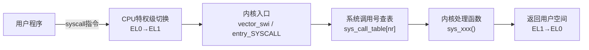
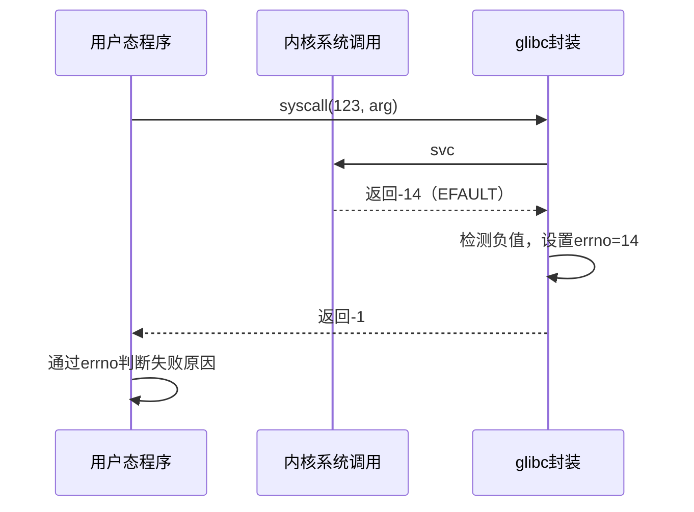
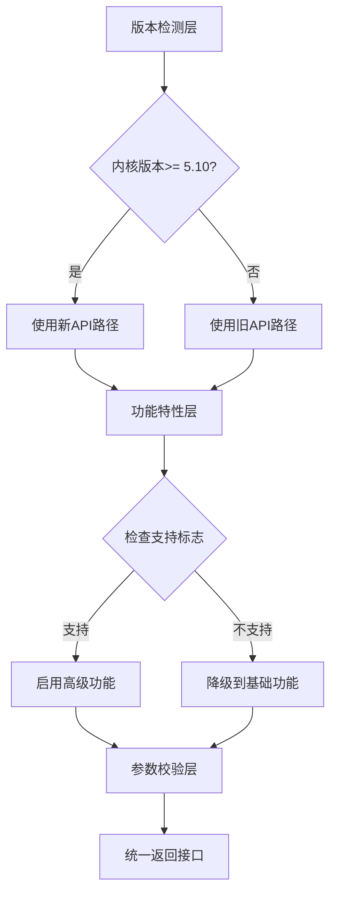

# 主流接口技术详解

> **本节难度等级：** [B→I]

> <span class="blue">核心认知目标：理解系统调用作为用户态与内核态交互的核心机制，掌握SYSCALL_DEFINE宏的使用、参数传递约定、返回值处理及跨版本兼容性设计方法。</span>

---

### <strong>系统调用注册机制</strong>

系统调用是用户空间程序请求内核服务的<span class="red">唯一标准入口</span>。
在嵌入式Linux系统中，所有用户态-内核态交互（如文件操作、设备控制、进程管理）最终都通过系统调用完成。
理解系统调用的注册机制，是自定义内核接口或调试驱动兼容性问题的基础。

Linux内核维护一张<span class="green">系统调用表</span>（sys_call_table），每个表项是一个函数指针，指向对应的内核处理函数。
这张表在系统启动时由架构相关代码初始化，架构不同（ARM/x86/RISC-V），表的布局与调用约定也不同。



ARM64架构的系统调用入口流程：

1.  用户程序执行`svc #0`指令触发同步异常
2.  CPU从EL0切换到EL1，保存用户态上下文到栈
3.  内核入口`el0_sync_handler`读取`x8`寄存器获取系统调用号
4.  调用`invoke_syscall`，通过`sys_call_table[x8]`索引到处理函数
5.  处理函数执行完毕，通过`eret`返回用户态

```c
// arch/arm64/kernel/syscall.c: 系统调用分发入口
// 行号：25-45
static long do_ni_syscall(struct pt_regs *regs)
{
    /* 未实现或无效的系统调用号统一走到这里 */
    return sys_ni_syscall();
}

static long __invoke_syscall(struct pt_regs *regs, syscall_fn_t syscall_fn)
{
    /* 将寄存器参数x0-x5传递给系统调用函数 */
    return syscall_fn(regs->regs[0], regs->regs[1], regs->regs[2],
                      regs->regs[3], regs->regs[4], regs->regs[5]);
}

long do_syscall(struct pt_regs *regs)
{
    unsigned int nr = regs->regs[8];  /* x8存放系统调用号 */
    
    if (nr < sys_call_table_size)
        regs->regs[0] = __invoke_syscall(regs, sys_call_table[nr]);
    else
        regs->regs[0] = -ENOSYS;
    
    return regs->regs[0];
}
```

<span class="blue">关键认知：系统调用号在架构内部稳定，但跨架构不兼容。ARM64的系统调用349对应getrandom，在x86_64上也是349，但在ARM32上是384——自定义系统调用时必须考虑移植性。</span><br>

---

### <strong>SYSCALL_DEFINE宏解析</strong>

内核提供<span class="red">SYSCALL_DEFINE</span>系列宏，用于声明和定义系统调用处理函数。
这些宏隐藏了参数序列化、类型转换和编译期元数据生成的细节，
是驱动开发者扩展内核接口时的首选工具。

宏家族包括：

| <span class="orange">宏名称</span> | <span class="orange">参数个数</span> | <span class="orange">典型用途</span> |
|------|----------|----------|
| SYSCALL_DEFINE0 | 0 | 无参数系统调用（如getpid） |
| SYSCALL_DEFINE1 | 1 | 单参数系统调用（如exit） |
| SYSCALL_DEFINE2 | 2 | 双参数系统调用（如open） |
| SYSCALL_DEFINE3 | 3 | 三参数系统调用（如read） |
| SYSCALL_DEFINE4 | 4 | 四参数系统调用（如ioctl） |
| SYSCALL_DEFINE5 | 5 | 五参数系统调用 |
| SYSCALL_DEFINE6 | 6 | 最大参数数（如mmap） |

宏展开后的关键操作：

1.  <span class="green">生成函数签名</span>：将`SYSCALL_DEFINE3(my_call, int, fd, char __user *, buf, size_t, len)`展开为`long sys_my_call(int fd, char __user *buf, size_t len)`
2.  <span class="green">类型安全包装</span>：通过`__SC_CAST`确保用户态传入的参数被正确转换为内核期望类型
3.  <span class="green">元数据注册</span>：在内核编译时生成系统调用描述符，供tracepoint和审计子系统使用

```c
// include/linux/syscalls.h: SYSCALL_DEFINE宏定义
// 行号：200-230
#define SYSCALL_DEFINE1(name, ...) \
    SYSCALL_DEFINEx(1, _##name, __VA_ARGS__)
#define SYSCALL_DEFINE2(name, ...) \
    SYSCALL_DEFINEx(2, _##name, __VA_ARGS__)
#define SYSCALL_DEFINE3(name, ...) \
    SYSCALL_DEFINEx(3, _##name, __VA_ARGS__)

#define SYSCALL_DEFINEx(x, sname, ...) \
    __SYSCALL_DEFINEx(x, sname, __VA_ARGS__)

#define __SYSCALL_DEFINEx(x, name, ...) \
    asmlinkage long sys##name(__MAP(x, __SC_DECL, __VA_ARGS__)) \
    { \
        return SyS##name(__MAP(x, __SC_CAST, __VA_ARGS__)); \
    } \
    static inline long SYSC##name(__MAP(x, __SC_DECL, __VA_ARGS__))
```

自定义系统调用的完整示例：

```c
// drivers/custom/my_syscall.c: 自定义系统调用实现
// 行号：1-55
#include <linux/syscalls.h>
#include <linux/uaccess.h>

/* 自定义系统调用：获取设备温度（模拟） */
SYSCALL_DEFINE2(get_device_temp, int, sensor_id, int __user *, temp_val)
{
    int temp;
    
    /* 参数校验 */
    if (sensor_id < 0 || sensor_id >= MAX_SENSORS)
        return -EINVAL;
    
    if (!temp_val)
        return -EFAULT;
    
    /* 模拟读取传感器温度 */
    temp = read_sensor_hw(sensor_id);
    if (temp < 0)
        return temp;  /* 硬件错误码透传 */
    
    /* 将结果复制到用户空间 */
    if (put_user(temp, temp_val))
        return -EFAULT;
    
    return 0;
}
```

<span class="blue">注意：SYSCALL_DEFINE宏的asmlinkage修饰符要求参数通过栈传递而非寄存器，这是历史遗留约定。实际ARM64架构通过寄存器传参，宏内部通过__SC_CAST完成映射适配。</span><br>

---

### <strong>参数传递与寄存器约定</strong>

不同架构对系统调用参数的传递方式有严格约定，
理解这些约定是编写跨平台驱动代码的前提。

<span class="red">ARM64架构（AArch64）</span>的参数寄存器映射：

| <span class="orange">参数序号</span> | <span class="orange">寄存器</span> | <span class="orange">用途</span> |
|------|----------|------|
| 系统调用号 | x8 | 固定由x8传递 |
| 参数1 | x0 | 对应SYSCALL_DEFINE第1个参数 |
| 参数2 | x1 | 对应SYSCALL_DEFINE第2个参数 |
| 参数3 | x2 | 对应SYSCALL_DEFINE第3个参数 |
| 参数4 | x3 | 对应SYSCALL_DEFINE第4个参数 |
| 参数5 | x4 | 对应SYSCALL_DEFINE第5个参数 |
| 参数6 | x5 | 对应SYSCALL_DEFINE第6个参数 |
| 返回值 | x0 | 通过x0返回 |

<span class="red">x86_64架构</span>的参数寄存器映射：

| <span class="orange">参数序号</span> | <span class="orange">寄存器</span> | <span class="orange">用途</span> |
|------|----------|------|
| 系统调用号 | rax | 固定由rax传递 |
| 参数1 | rdi | 对应SYSCALL_DEFINE第1个参数 |
| 参数2 | rsi | 对应SYSCALL_DEFINE第2个参数 |
| 参数3 | rdx | 对应SYSCALL_DEFINE第3个参数 |
| 参数4 | r10 | 注意：非rcx，与函数调用ABI不同 |
| 参数5 | r8 | 对应第5个参数 |
| 参数6 | r9 | 对应第6个参数 |
| 返回值 | rax | 通过rax返回 |

用户态调用系统调用的标准方式：

```c
// arch/arm64/kernel/sys.c: glibc层面的syscall封装
// 行号：60-80（等效代码，glibc实际为汇编实现）
static inline long syscall3(long nr, long a1, long a2, long a3)
{
    register long x0 __asm__("x0") = a1;
    register long x1 __asm__("x1") = a2;
    register long x2 __asm__("x2") = a3;
    register long x8 __asm__("x8") = nr;
    
    __asm__ __volatile__(
        "svc #0\n"
        : "+r"(x0)
        : "r"(x1), "r"(x2), "r"(x8)
        : "memory"
    );
    
    return x0;  /* 返回值在x0 */
}
```

<span class="blue">关键约束：系统调用最多支持6个参数。若需传递更多数据，标准做法是将数据打包到结构体中，传递结构体指针（第6个参数以内），由内核通过copy_from_user解析。</span><br>

---

### <strong>返回值处理与错误码映射</strong>

系统调用的返回值约定：<span class="red">非负值表示成功</span>，<span class="red">负值表示错误</span>（对应-errno）。
内核空间中的错误码使用`include/uapi/asm-generic/errno-base.h`中定义的标准值，
用户态的glibc/ musl将其转换为errno全局变量。

常见错误码语义：

| <span class="orange">错误码</span> | <span class="orange">值</span> | <span class="orange">含义</span> |
|------|------|------|
| EPERM | -1 | 操作不被允许（权限不足） |
| ENOENT | -2 | 无此文件或目录 |
| ESRCH | -3 | 无此进程 |
| EINTR | -4 | 系统调用被中断 |
| EIO | -5 | I/O错误 |
| ENXIO | -6 | 无此设备或地址 |
| E2BIG | -7 | 参数列表太长 |
| ENOEXEC | -8 | 执行格式错误 |
| EBADF | -9 | 错误的文件描述符 |
| ENOMEM | -12 | 内存不足 |
| EACCES | -13 | 权限被拒绝 |
| EFAULT | -14 | 错误的地址（用户指针无效） |
| EBUSY | -16 | 设备或资源忙 |
| EINVAL | -22 | 无效的参数 |
| ENOSPC | -28 | 设备上无剩余空间 |

返回值处理的内核侧与用户侧映射：



内核驱动的返回值处理最佳实践：

```c
// drivers/custom/safe_return.c: 系统调用返回值处理规范
// 行号：30-65
SYSCALL_DEFINE3(write_device, int, fd, const void __user *, buf,
                size_t, count)
{
    struct file *file;
    ssize_t ret;
    
    /* 1. 参数校验先行 */
    if (count > MAX_TRANSFER_SIZE)
        return -EINVAL;   /* 参数超出范围 */
    
    if (!access_ok(buf, count))
        return -EFAULT;   /* 用户地址无效 */
    
    /* 2. 查找文件描述符 */
    file = fget(fd);
    if (!file)
        return -EBADF;    /* 无效fd */
    
    /* 3. 权限检查 */
    if (!(file->f_mode & FMODE_WRITE)) {
        ret = -EACCES;
        goto out_fput;
    }
    
    /* 4. 执行核心逻辑 */
    ret = do_write_device(file, buf, count);
    if (ret < 0) {
        /* 内核子系统已返回标准错误码，直接透传 */
        goto out_fput;
    }
    
out_fput:
    fput(file);
    return ret;  /* 成功时ret>=0，失败时ret<0 */
}
```

<span class="blue">设计原则：错误码应按语义精确返回，避免滥用-EINVAL。驱动开发者应熟记EAGAIN（资源暂时不可用）、EBUSY（设备忙）、ENODEV（设备不存在）等语义区别。</span><br>

---

### <strong>兼容性设计与版本适配</strong>

嵌入式系统的生命周期通常跨越多个内核版本，
自定义系统调用必须考虑<span class="red">向前兼容</span>（旧内核运行新程序）和<span class="red">向后兼容</span>（新内核运行旧程序）。

兼容性设计的三层策略：



1.  <span class="orange">版本检测层</span>：通过`LINUX_VERSION_CODE`宏判断当前编译的内核版本，选择不同的实现路径
2.  <span class="orange">功能特性层</span>：通过`CONFIG_xxx`宏判断内核编译选项，条件编译可选功能
3.  <span class="orange">参数校验层</span>：对旧版本忽略的新参数提供默认值，确保API调用不因参数缺失而失败

```c
// drivers/compat/syscall_compat.c: 跨版本系统调用兼容性示例
// 行号：20-75
#include <linux/version.h>

/* 内核5.6+ 引入了新的copy_struct_from_user辅助函数 */
#if LINUX_VERSION_CODE >= KERNEL_VERSION(5, 6, 0)
#include <linux/uaccess.h>
#define USE_COPY_STRUCT 1
#else
#define USE_COPY_STRUCT 0
#endif

struct device_config {
    int flags;
    int sample_rate;
    int reserved;   /* 5.10+ 新增字段 */
};

SYSCALL_DEFINE2(configure_device, int, dev_id,
                struct device_config __user *, cfg)
{
    struct device_config kcfg;
    
    /* 兼容性：对旧内核使用传统copy_from_user */
    #if USE_COPY_STRUCT
    if (copy_struct_from_user(&kcfg, sizeof(kcfg), cfg, sizeof(*cfg)))
        return -EFAULT;
    #else
    memset(&kcfg, 0, sizeof(kcfg));
    if (copy_from_user(&kcfg, cfg, sizeof(*cfg)))
        return -EFAULT;
    #endif
    
    /* 兼容性：旧版本内核未定义reserved字段，使用默认值 */
    #if LINUX_VERSION_CODE < KERNEL_VERSION(5, 10, 0)
    kcfg.reserved = 0;  /* 旧版本无此字段，强制置0 */
    #endif
    
    /* 参数校验 */
    if (kcfg.sample_rate < 100 || kcfg.sample_rate > 1000000)
        return -EINVAL;
    
    return apply_device_config(dev_id, &kcfg);
}
```

<span class="orange">运行时兼容性</span>：除了编译期适配，系统调用还应支持运行时版本检测。
通过`/proc/version`或`uname()`获取运行内核版本，动态调整行为。

<span class="blue">最佳实践：自定义系统调用应预留未使用参数位，新版本通过标志位启用新功能，旧版本忽略未知标志位——这是UNIX接口设计的经典兼容模式。</span><br>

---

### <strong>历史演进：从int 0x80到syscall指令</strong>

x86架构的系统调用机制经历了三代演进：

第一代<span class="green">int 0x80</span>（Linux 2.4及之前）：通过软中断进入内核，中断号是0x80。
这种方式通用性强但性能差——中断门切换涉及大量寄存器保存，且无法利用CPU的特权级快速切换机制。

第二代<span class="green">sysenter/sysexit</span>（Linux 2.6，Pentium II+）：
Intel引入专用指令替代软中断，MSR寄存器预配置入口地址，切换延迟降低约50%。
但AMD平台不支持sysenter，导致x86架构出现两套调用路径。

第三代<span class="green">syscall/sysret</span>（Linux 2.6.24+，x86_64/AMD64原生）：
AMD设计的原生快速系统调用指令，被x86_64架构强制采用。
只保存最小寄存器集合（rcx/r11），返回地址由硬件自动处理，是当今x86_64的标准路径。

ARM架构的演进更为简洁：ARMv7使用`swi #0`（软中断），ARMv8（AArch64）直接使用`svc #0`（超级调用），
两者本质相同，只是指令命名随ARM手册更新而变更。

<span class="blue">演进主线：系统调用入口机制持续向"最小开销切换"方向优化，但SYSCALL_DEFINE宏提供的抽象层屏蔽了底层差异——驱动开发者只需关注业务逻辑，无需关心具体切换机制。</span><br>

---

### <strong>本模块小结</strong>

| <span class="orange">维度</span> | <span class="orange">系统调用注册</span> | <span class="orange">SYSCALL_DEFINE</span> | <span class="orange">参数传递</span> | <span class="orange">返回值</span> | <span class="orange">兼容性</span> |
|------|-------------|----------------|----------|------|----------|
| 核心机制 | sys_call_table索引 | 宏生成函数签名与元数据 | 架构寄存器约定 | 非负=成功，负值=-errno | 版本码+条件编译 |
| ARM64关键 | x8=nr, x0-x5=参数 | 通过__SC_CAST映射 | x0-x5依次对应 | x0返回 | KERNEL_VERSION宏 |
| 典型陷阱 | 未注册nr导致-ENOSYS | 忘记asmlinkage修饰 | 超过6个参数 | 混淆内核/用户错误码 | 结构体字段变更 |
| 调试方法 | /proc/sys/debug | printk + tracepoint | 寄存器dump | strace跟踪 | 多版本编译测试 |

**练习**

1.  编写一个自定义系统调用`sys_get_sensor_batch(int sensor_id, struct sensor_data __user *buf, int count)`，要求：①最多支持6个参数，超过时通过结构体指针传递；②返回实际读取的数据条目数（非负）或错误码（负值）；③支持ARM64和x86_64两种架构。写出完整的内核侧实现代码。

2.  分析以下代码的兼容性风险：`copy_from_user(dst, src, sizeof(struct my_ioctl_arg))`，其中`struct my_ioctl_arg`在5.8内核增加了新字段。在旧内核上编译并运行此驱动的后果是什么？如何修改以消除风险？

3.  设计一个系统调用的参数校验策略：用户态传入一个指向大型缓冲区的指针（1MB），驱动需要将其内容复制到内核。列出所有必须校验的安全点（地址有效性、权限、大小限制等），并为每一点写出对应的内核代码片段。
