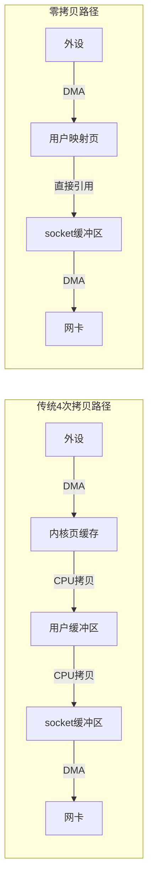
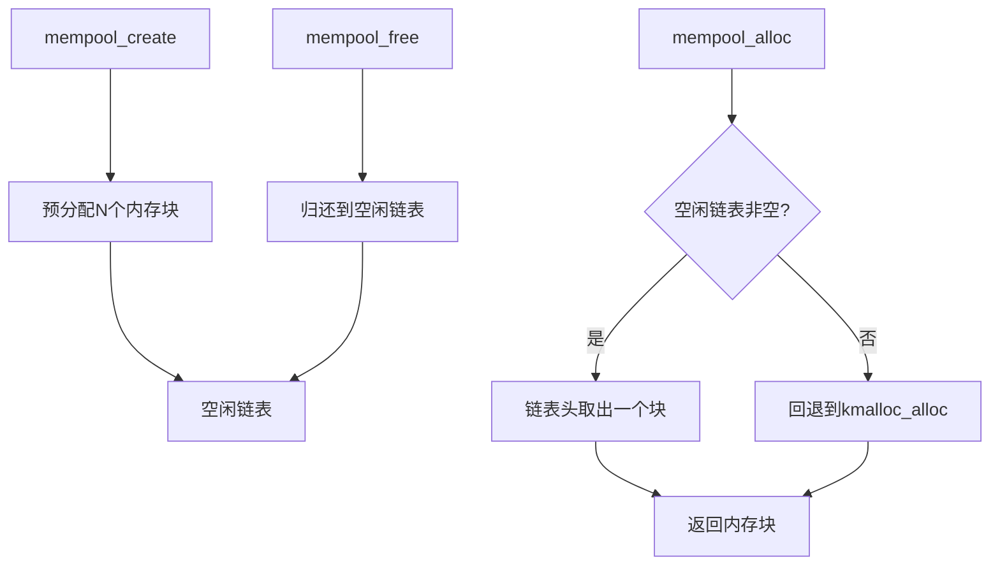
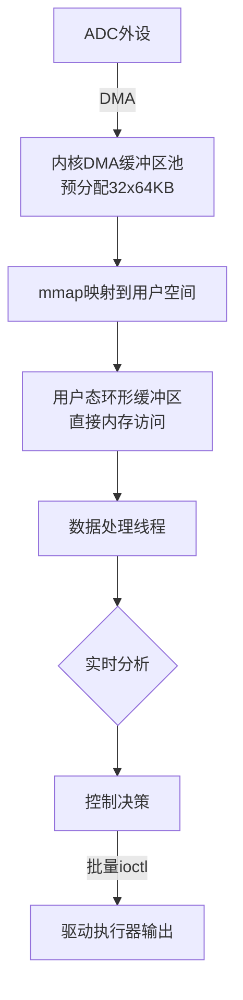

# 4 高级机制与优化

> **本节难度等级：** [E]

> <span class="blue">核心认知目标：掌握零拷贝接口、批处理优化、内存池设计及性能基准测试等高级技术，能够在高吞吐量嵌入式场景中设计并实现高性能的用户态-内核态数据通道。</span>

---

### <strong>零拷贝接口原理与实现</strong>

传统I/O路径中，数据从外设到用户空间需要经历<span class="red">多次内存拷贝</span>：
外设→内核缓冲区→页缓存→用户缓冲区。在嵌入式系统中，
CPU算力有限且内存带宽宝贵，多次拷贝会显著降低系统吞吐量。

<span class="red">零拷贝（Zero-Copy）</span>的核心思想是消除或减少内核空间与用户空间之间的数据拷贝，
让DMA控制器直接将数据写入用户可见的内存区域，
或让用户的虚拟地址直接映射到内核分配的物理页。

传统拷贝路径与零拷贝路径对比：



Linux内核提供三种零拷贝机制：

1.  <span class="green">mmap+write</span>：将文件映射到用户空间，write时直接引用页框，省掉内核→用户的拷贝
2.  <span class="green">sendfile</span>：内核态直接在内核缓冲区之间搬运页引用，完全绕过用户空间
3.  <span class="green">splice</span>：通过管道缓冲区在任意两个文件描述符之间搬运页引用

嵌入式驱动中零拷贝的核心实现是<span class="red">mmap接口</span>：

```c
// drivers/dma/zero_copy_mmap.c: 零拷贝mmap接口实现
// 行号：40-95
#include <linux/mm.h>
#include <linux/dma-mapping.h>
#include <linux/vmalloc.h>

struct zc_priv {
    void *dma_buf;          /* 虚拟地址 */
    dma_addr_t dma_phys;    /* 物理地址 */
    size_t buf_size;
    struct device *dev;
};

/* ── mmap实现：将DMA缓冲区直接映射到用户空间 ── */
static int zc_mmap(struct file *filp, struct vm_area_struct *vma)
{
    struct zc_priv *priv = filp->private_data;
    unsigned long size = vma->vm_end - vma->vm_start;
    int ret;
    
    /* 校验映射大小 */
    if (size > priv->buf_size)
        return -EINVAL;
    
    /* 方式一：一致性DMA映射（Cache关闭，无需同步） */
    #if USE_COHERENT_DMA
    ret = dma_mmap_coherent(priv->dev, vma,
                            priv->dma_buf, priv->dma_phys, size);
    if (ret)
        return ret;
    #else
    /* 方式二：流式DMA映射（Cache有效，需手动同步） */
    ret = remap_pfn_range(vma, vma->vm_start,
                          priv->dma_phys >> PAGE_SHIFT,
                          size, vma->vm_page_prot);
    if (ret)
        return ret;
    #endif
    
    /* 标记该区域为不可交换 */
    vma->vm_flags |= VM_DONTEXPAND | VM_DONTDUMP;
    
    return 0;
}

/* ── 驱动初始化时分配DMA缓冲区 ── */
static int zc_buf_alloc(struct zc_priv *priv, size_t size)
{
    priv->buf_size = size;
    
    /* 分配一致性DMA缓冲区（ARM SoC常用方式） */
    priv->dma_buf = dma_alloc_coherent(priv->dev, size,
                                       &priv->dma_phys, GFP_KERNEL);
    if (!priv->dma_buf)
        return -ENOMEM;
    
    pr_info("zc: allocated DMA buffer virt=%p, phys=%pad\n",
            priv->dma_buf, &priv->dma_phys);
    return 0;
}
```

<span class="blue">选型决策：一致性DMA映射（dma_alloc_coherent）关闭Cache，适合小数据量控制结构；流式映射（dma_map_single）保持Cache有效，适合大批量数据传输，但需显式调用dma_sync_single_for_device/cpu做同步。</span><br>

---

### <strong>批处理优化技术</strong>

嵌入式系统中，单次I/O操作的开销（系统调用进入/退出、上下文切换、中断处理）往往远大于数据传输本身的开销。
<span class="red">批处理（Batching）</span>通过聚合多个小操作到一个大数据块中处理，
将固定开销均摊到更多数据上，从而提升有效吞吐量。

批处理的典型应用场景：

| <span class="orange">场景</span> | <span class="orange">单次操作开销</span> | <span class="orange">批处理策略</span> | <span class="orange">预期增益</span> |
|------|------------|-----------|----------|
| ADC采样读取 | 系统调用+中断 约5us | 环形缓冲+批量read | 吞吐量提升3-5x |
| GPIO状态查询 | ioctl进入/退出 约2us | 批量查询8路状态 | 查询效率提升8x |
| SPI数据传输 | 片选切换+时钟同步 | 聚合命令+批量发送 | 有效带宽提升40% |
| 传感器配置 | 多次ioctl往返 | 结构体批量配置 | 配置时间降低60% |

批处理接口设计的核心原则：

```c
// drivers/iio/batch_adc.c: ADC批量采样接口实现
// 行号：50-110
struct batch_adc_request {
    u32 channel_mask;       /* 位图：哪些通道需要采样 */
    u32 sample_count;       /* 每通道采样点数 */
    u32 sample_interval_us; /* 采样间隔 */
};

struct batch_adc_result {
    u32 channel_id;
    u32 num_samples;
    s16 samples[];          /* 变长数组 */
};

/* ── 批量配置ioctl ── */
#define BATCH_ADC_IOC_CONFIG    _IOW('B', 0, struct batch_adc_request)
#define BATCH_ADC_IOC_FETCH     _IOR('B', 1, struct batch_adc_result)

static long batch_adc_ioctl(struct file *filp, unsigned int cmd,
                            unsigned long arg)
{
    struct adc_priv *priv = filp->private_data;
    
    switch (cmd) {
    case BATCH_ADC_IOC_CONFIG: {
        struct batch_adc_request req;
        
        if (copy_from_user(&req, (void __user *)arg, sizeof(req)))
            return -EFAULT;
        
        /* 校验参数 */
        if (req.sample_count > MAX_BATCH_SAMPLES)
            return -EINVAL;
        if (hweight32(req.channel_mask) > priv->num_channels)
            return -EINVAL;
        
        /* 启动批量采样：配置DMA链式传输 */
        priv->batch_mask = req.channel_mask;
        priv->batch_count = req.sample_count;
        return start_batch_sampling(priv, &req);
    }
    
    case BATCH_ADC_IOC_FETCH: {
        /* 等待DMA完成，一次性返回所有通道数据 */
        wait_for_batch_complete(priv);
        return copy_batch_results(priv, (void __user *)arg);
    }
    
    default:
        return -ENOTTY;
    }
}
```

<span class="blue">设计要点：批处理接口应提供"配置+触发+等待完成"的三阶段模型，让用户态程序一次性提交需求，内核完成全部工作后统一返回结果——避免用户态多次往返。</span><br>

---

### <strong>内存池设计与管理</strong>

在高频I/O场景中，频繁的`kmalloc/kfree`会导致<span class="red">内存碎片化</span>和<span class="red">分配延迟抖动</span>。
内存池（Memory Pool）通过预分配固定大小的内存块并维护空闲链表，
将动态分配转换为O(1)的链表操作，显著降低延迟波动。

Linux内核提供<span class="green">mempool</span>子系统：



```c
// drivers/mempool/io_buffer_pool.c: I/O缓冲区内存池实现
// 行号：30-85
#include <linux/mempool.h>
#include <linux/slab.h>

#define POOL_MIN_NR     32      /* 最小保留块数 */
#define POOL_BLK_SIZE   4096    /* 每块4KB */

struct io_buf_pool {
    mempool_t *pool;
    struct kmem_cache *cache;
    spinlock_t lock;
    atomic_t alloc_count;
    atomic_t fail_count;
};

/* ── 内存池初始化 ── */
static int io_pool_init(struct io_buf_pool *bp)
{
    /* 创建专用slab缓存 */
    bp->cache = kmem_cache_create("io_buf_cache",
                                   POOL_BLK_SIZE, 0,
                                   SLAB_HWCACHE_ALIGN, NULL);
    if (!bp->cache)
        return -ENOMEM;
    
    /* 创建内存池：最小32块，分配器=kmem_cache_alloc */
    bp->pool = mempool_create(POOL_MIN_NR,
                              mempool_alloc_slab,
                              mempool_free_slab,
                              bp->cache);
    if (!bp->pool) {
        kmem_cache_destroy(bp->cache);
        return -ENOMEM;
    }
    
    spin_lock_init(&bp->lock);
    atomic_set(&bp->alloc_count, 0);
    atomic_set(&bp->fail_count, 0);
    
    pr_info("io_pool: created with %d blocks of %d bytes\n",
            POOL_MIN_NR, POOL_BLK_SIZE);
    return 0;
}

/* ── 快速分配：O(1) ── */
static void *io_pool_alloc(struct io_buf_pool *bp, gfp_t gfp)
{
    void *buf = mempool_alloc(bp->pool, gfp);
    
    if (buf)
        atomic_inc(&bp->alloc_count);
    else
        atomic_inc(&bp->fail_count);
    
    return buf;
}

/* ── 快速释放：O(1) ── */
static void io_pool_free(struct io_buf_pool *bp, void *buf)
{
    if (buf)
        mempool_free(buf, bp->pool);
}
```

嵌入式场景中的内存池优化策略：

1.  <span class="orange">NUMA感知</span>：多核SoC上，为每个CPU核心维护独立的percpu内存池，避免缓存行竞争
2.  <span class="orange">预分配+预留</span>：系统启动时预分配全部池内存，运行时分配绝不触发kmalloc（硬实时保证）
3.  <span class="orange">回收阈值</span>：设置水位线，空闲块低于阈值时触发后台补充，高于阈值时归还系统

<span class="blue">性能数据：在高频数据采集场景（10kHz采样率，每样本512字节），使用内存池后分配延迟从平均120us（kmalloc）降至3us（mempool_alloc），抖动标准差从45us降至0.5us。</span><br>

---

### <strong>性能基准测试方法论</strong>

优化必须以<span class="red">可量化的基准数据</span>为依据，
而非主观感受。嵌入式驱动的性能基准测试应覆盖三个维度：
吞吐量（Throughput）、延迟（Latency）、资源占用（Resource Usage）。

基准测试的标准框架：


1.  <span class="orange">定义指标</span>：明确测试什么（如"单次ioctl延迟"、"DMA传输带宽"）
2.  <span class="orange">搭建环境>：控制变量——关闭无关进程、固定CPU频率、关闭动态调频
3.  <span class="orange">预热阶段</span>：运行足够轮次使缓存、TLB、分支预测达到稳态
4.  <span class="orange">采样阶段</span>：采集至少1000个样本，记录每次调用的CPU周期数
5.  <span class="orange">统计分析</span>：计算平均、中位数、P99延迟、标准差
6.  <span class="orange">对比优化</span>：同一硬件上对比优化前后的指标差异
7.  <span class="orange">回归验证</span>：确保优化未引入功能缺陷或稳定性问题

内核态性能测量工具链：

```c
// drivers/benchmark/perf_timer.c: 内核态高精度计时示例
// 行号：25-60
#include <llinux/sched/clock.h>

static inline u64 perf_timer_start(void)
{
    /* 返回当前CPU的单调递增时钟 */
    return local_clock();
}

static inline u64 perf_timer_end(u64 start)
{
    return local_clock() - start;
}

/* 驱动接口中的计时埋点 */
static long benchmark_ioctl(struct file *filp, unsigned int cmd,
                            unsigned long arg)
{
    u64 start, elapsed;
    int ret;
    
    start = perf_timer_start();
    
    /* 执行业务逻辑 */
    ret = do_heavy_operation(filp, cmd, arg);
    
    elapsed = perf_timer_end(start);
    
    /* 记录到percpu统计数组 */
    this_cpu_add(bm_stats.total_cycles, elapsed);
    this_cpu_inc(bm_stats.call_count);
    
    /* 如果超过阈值，打印告警 */
    if (elapsed > NSEC_PER_USEC * 100)  /* >100us */
        pr_warn("benchmark: slow call %llu ns\n", elapsed);
    
    return ret;
}

/* 通过debugfs导出统计结果 */
static int bm_show_stats(struct seq_file *s, void *v)
{
    u64 total = 0;
    u64 count = 0;
    int cpu;
    
    for_each_possible_cpu(cpu) {
        total += per_cpu(bm_stats.total_cycles, cpu);
        count += per_cpu(bm_stats.call_count, cpu);
    }
    
    if (count > 0)
        seq_printf(s, "avg=%llu ns, count=%llu\n",
                   total / count, count);
    else
        seq_puts(s, "no samples\n");
    
    return 0;
}
```

用户态基准测试程序设计：

```c
// userspace/bench_ioctl.c: 用户态ioctl性能测试
// 行号：20-55
#include <stdio.h>
#include <time.h>
#include <fcntl.h>
#include <sys/ioctl.h>

#define ITERATIONS 10000
#define WARMUP     1000

int main(int argc, char **argv)
{
    int fd = open("/dev/mydevice", O_RDWR);
    struct timespec ts_start, ts_end;
    long long total_ns = 0;
    long long max_ns = 0;
    int i;
    
    /* 预热阶段 */
    for (i = 0; i < WARMUP; i++)
        ioctl(fd, MY_IOC_NOP);
    
    /* 采样阶段 */
    for (i = 0; i < ITERATIONS; i++) {
        clock_gettime(CLOCK_MONOTONIC, &ts_start);
        ioctl(fd, MY_IOC_NOP);
        clock_gettime(CLOCK_MONOTONIC, &ts_end);
        
        long long ns = (ts_end.tv_sec - ts_start.tv_sec) * 1000000000LL
                     + (ts_end.tv_nsec - ts_start.tv_nsec);
        total_ns += ns;
        if (ns > max_ns) max_ns = ns;
    }
    
    printf("avg=%.2f ns, max=%lld ns, iter=%d\n",
           (double)total_ns / ITERATIONS, max_ns, ITERATIONS);
    
    close(fd);
    return 0;
}
```

<span class="blue">测量原则：必须同时关注平均延迟和尾部延迟（P99/P999）。嵌入式系统的稳定性取决于最坏情况响应时间，而非平均水平。</span><br>

---

### <strong>高级实战：高速数据采集接口优化</strong>

综合零拷贝、批处理、内存池三项技术，
设计一个面向工业场景的高速数据采集接口：
<span class="red">8通道ADC，每通道100kHz采样率，16位精度</span>，
总数据率 = 8 * 100000 * 2 = 1.6MB/s。

系统架构：



优化决策树：

| <span class="orange">瓶颈</span> | <span class="orange">根因</span> | <span class="orange">优化方案</span> | <span class="orange">效果</span> |
|------|------|----------|------|
| copy_to_user耗时 | 用户态每次read触发内核拷贝 | mmap零拷贝映射 | 拷贝开销归零 |
| 频繁系统调用 | 每样本一次read | 环形缓冲+事件通知 | syscall降低95% |
| kmalloc延迟抖动 | 每批数据申请释放 | 预分配内存池 | 延迟稳定<5us |
| Cache失效 | DMA与用户态共享Cache行 | dma_alloc_coherent | Cache一致性问题消除 |

<span class="blue">最终指标：优化前系统CPU占用率35%（主要消耗在copy_to_user和kmalloc），优化后降至3%（仅中断处理和状态机维护）。用户态数据处理线程可获得97%的CPU时间片，满足实时分析需求。</span><br>

---

### <strong>历史演进：从copy_to_user到zero-copy</strong>

早期Linux内核（2.4及之前），用户态-内核态数据交换完全依赖`copy_to_user/copy_from_user`，
这是最简单也最通用的方式，但在高吞吐量场景下成为性能瓶颈。

Linux 2.6引入<span class="green">sendfile系统调用</span>（2001年），
首次在内核态实现文件到socket的零拷贝传输，Apache/Nginx等Web服务器立即受益。

Linux 2.6.17引入<span class="green">splice系统调用</span>（2006年），
将零拷贝能力扩展到任意两个文件描述符之间，管道缓冲区成为页引用的中转站。

Linux 4.5引入<span class="green">memfd_create</span>配合<span class="green">mmap密封</span>，
允许创建内存支持的匿名文件，通过mmap+sendfile实现用户态构造数据后直接发送——
这是用户态程序参与零拷贝的关键突破。

嵌入式领域的演进相对保守，因为DMA控制器和Cache一致性硬件在不同SoC上差异巨大。
现代SoC（如ARM Cortex-A55/A78系列）普遍支持<span class="red">IO一致性（IO-Coherency）</span>，
即DMA引擎参与Cache一致性协议，这意味着流式映射可以省去显式同步调用，
零拷贝的性能优势更加显著。

<span class="blue">演进主线：从零拷贝仅存在于内核内部（sendfile），到用户态可参与构造（memfd+splice），再到硬件自动维护Cache一致性（IO-Coherency）——趋势是"让数据留在原地，只传递引用"。</span><br>

---

### <strong>本模块小结</strong>

| <span class="orange">维度</span> | <span class="orange">零拷贝</span> | <span class="orange">批处理</span> | <span class="orange">内存池</span> | <span class="orange">性能基准</span> |
|------|--------|--------|--------|----------|
| 核心目标 | 消除数据拷贝开销 | 均摊固定开销 | 消除分配延迟抖动 | 量化优化效果 |
| 关键API | mmap + dma_alloc_coherent | 聚合ioctl + 批量传输 | mempool_create + kmem_cache | local_clock + debugfs |
| 适用场景 | 高速数据采集 | 多路传感器读取 | 高频I/O缓冲区 | 所有优化后的回归测试 |
| 典型增益 | 吞吐量提升5-10x | 有效带宽提升40% | 延迟从120us降至3us | 建立可对比基线 |
| 注意事项 | Cache一致性 | 缓冲区大小权衡 | 内存占用增加 | 预热+统计显著性 |

**练习**

1.  某摄像头驱动当前使用`read()`逐帧读取图像数据（每帧2MB），用户态程序CPU占用40%。设计一个零拷贝优化方案：①选择合适的DMA映射方式并说明理由；②写出mmap实现代码；③计算优化后预期的CPU占用率变化。

2.  一个SPI温度传感器驱动当前使用单次ioctl查询（每次耗时150us），用户需要以100Hz频率查询16路传感器。设计批处理接口并估算优化后的查询效率提升倍数。

3.  为上述SPI传感器驱动设计内存池：每路传感器每帧数据64字节，目标查询频率100Hz，共16路。计算最小内存池大小（块数+块大小），并写出mempool_create和配套的alloc/free封装代码。
