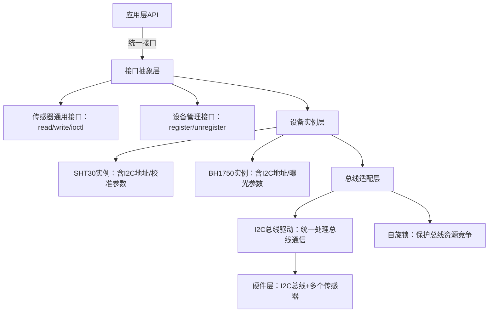

# 自定义接口设计

> 📊 **本节难度等级：** <span class="badge-m">**M级**</span>

---

### <strong>规范是接口“可复用、可维护”的基础，核心覆盖“命名规则”（降低理解成本）和“错误码定义”（简化问题定位），需结合嵌入式字符设备、ioctl、系统调用等典型接口形态落地。</strong>


### <strong>命名规则：函数与设备节点的标准化命名原则</strong>

命名的核心是“**见名知义、上下文清晰、风格统一**”，避免模糊词汇（如`do_something`）或缩写歧义（如`dev_cfg`需明确是`device_config`还是`device_configure`）。不同接口形态的命名规则及实战示例如下：

###### 1.1.1 核心命名原则
1.  **分层前缀原则**：按“模块-功能-对象”分层添加前缀，明确接口归属（如<span class="green">I2C</span>传感器模块前缀`i2c_sensor_`）；
2.  **动作明确原则**：动词+名词结构，清晰表达接口功能（如`i2c_sensor_read`而非`i2c_sensor_get`）；
3.  **避免冗余原则**：上下文已明确的信息不重复（如设备节点已含`sht30`，函数无需再写`sht30_sensor_`）；
4.  **风格统一原则**：驱动层统一用“蛇形命名法”（全小写+下划线），与内核编码风格一致。

###### 1.1.2 各类型接口命名实战示例
以“工业级多传感器采集模块”（含SHT30温湿度、BH1750光照两个I2C传感器）为例，覆盖设备节点、驱动函数、<span class="green">ioctl</span>命令、应用函数的全链路命名：

| 接口类型         | 命名规则                                  | 实战正确示例                          | 错误示例（问题说明）                  |
|------------------|-------------------------------------------|---------------------------------------|---------------------------------------|
| 设备节点         | `/dev/[模块名]/[设备名]`                  | `/dev/sensor/sht30`、`/dev/sensor/bh1750` | `/dev/temp`（无模块归属）、`/dev/s1`（无设备标识） |
| 驱动核心函数     | `[总线/模块]_sensor_[动作]_[对象]`        | `i2c_sensor_read_data`、`i2c_sensor_set_calib` | `read_sensor`（无总线标识）、`sensor_cfg`（动作模糊） |
| ioctl命令码      | `[模块缩写]_IOCTL_[动作]_[对象]`          | `SENSOR_IOCTL_GET_TEMP`、`SENSOR_IOCTL_SET_EXPOSURE` | `IOCTL_GET_DATA`（无模块标识）、`SENSOR_SET`（动作模糊） |
| 应用层API        | `[模块]_-[设备类型]_[动作]`（静态库导出） | `sensor_temp_read`、`sensor_light_set_gain` | `get_temp`（无模块归属）、`light_cfg`（动作模糊） |
| 数据结构         | `[模块]_-[功能]_[类型]`                   | `i2c_sensor_dev_t`、`sensor_data_t`   | `dev_struct`（无功能标识）、`data`（类型模糊） |

###### 1.1.3 内核态与用户态接口一致性保障
驱动层与应用层接口需“命名呼应”，避免认知割裂。例如：
- 驱动<span class="green">ioctl</span>命令`SENSOR_IOCTL_GET_DATA`对应应用层函数`sensor_data_read`；
- 驱动错误码`-EINVAL`（参数无效）对应应用层日志“Invalid parameter: calib_val out of range”，明确错误上下文。<br>

### <strong>错误码定义：自定义错误码与标准错误码的兼容</strong>

错误码是“接口问题定位的语言”，若直接返回`-1`或自定义码与标准冲突，会导致调试困难。需遵循“**优先用标准码，自定义码兼容标准，附加错误信息**”的原则。

###### 1.2.1 错误码设计三原则
1.  **标准优先原则**：Linux内核提供130+标准错误码（如`-EINVAL`参数无效、`-ENOMEM`内存不足），覆盖90%以上基础错误场景，优先使用；
2.  **自定义码隔离原则**：需扩展的场景（如传感器校准失败、设备未注册），自定义码从`-ERANGE`（标准码边界，值为-34）向小值扩展，避免与标准码冲突；
3.  **错误信息附加原则**：仅返回错误码不够，需通过`dev_err`（驱动）或日志（应用）附加上下文（如“校准失败：val=150，范围0-100”）。

###### 1.2.2 实战：传感器模块错误码体系
结合SHT30/BH1750传感器模块，设计兼容标准的错误码体系，含“标准码映射+自定义码+错误信息”：

1.  **错误码定义头文件（sensor_err.h）**：
   ```c
   #ifndef __SENSOR_ERR_H__
   #define __SENSOR_ERR_H__

   #include <linux/errno.h>  // 引入标准错误码

   // 一、标准错误码映射（明确场景含义）
   #define SENSOR_ERR_NO_DEV    -ENODEV  // 设备未找到（对应/dev/sensor/*不存在）
   #define SENSOR_ERR_PARAM    -EINVAL  // 参数无效（如校准值超范围）
   #define SENSOR_ERR_MEM      -ENOMEM  // 内存分配失败（驱动层kmalloc失败）
   #define SENSOR_ERR_BUS      -EIO     // 总线通信失败（I2C读写超时）
   #define SENSOR_ERR_PERM     -EPERM   // 权限不足（无CAP_SYS_ADMIN权限）

   // 二、自定义错误码（从-100开始，避免与标准码冲突）
   #define SENSOR_ERR_CALIB    -100     // 校准失败（如传感器硬件异常）
   #define SENSOR_ERR_EXPOSURE -101     // 曝光时间配置失败（BH1750专属）
   #define SENSOR_ERR_NO_DATA  -102     // 无有效数据（未采集到帧）

   // 三、错误码转字符串（驱动/应用通用）
   static inline const char *sensor_err_str(int err) {
       switch (err) {
           // 标准码对应信息
           case SENSOR_ERR_NO_DEV:    return "Device not found (check /dev/sensor)";
           case SENSOR_ERR_PARAM:    return "Invalid parameter (out of range)";
           case SENSOR_ERR_MEM:      return "Memory allocation failed";
           case SENSOR_ERR_BUS:      return "I2C bus communication failed (timeout)";
           case SENSOR_ERR_PERM:     return "Permission denied (need CAP_SYS_ADMIN)";
           // 自定义码对应信息
           case SENSOR_ERR_CALIB:    return "Calibration failed (hardware error)";
           case SENSOR_ERR_EXPOSURE: return "Exposure config failed (invalid value)";
           case SENSOR_ERR_NO_DATA:  return "No valid data (not collected)";
           default:                  return strerror(-err);  // 未知码映射标准信息
       }
   }

   #endif  // __SENSOR_ERR_H__
   ```

2.  **驱动层错误码使用示例**：
   ```c
   #include "sensor_err.h"

   static int i2c_sensor_calib(struct i2c_sensor_dev_t *dev, int calib_val) {
       int ret;

       // 1. 标准错误码场景：参数无效
       if (calib_val < 0 || calib_val > 100) {
           dev_err(&dev->client->dev, "Calib failed: %s (val=%d)\n",
                   sensor_err_str(SENSOR_ERR_PARAM), calib_val);
           return SENSOR_ERR_PARAM;
       }

       // 2. 标准错误码场景：总线通信失败
       ret = i2c_master_send(dev->client, &calib_val, 1);
       if (ret != 1) {
           dev_err(&dev->client->dev, "Calib failed: %s (ret=%d)\n",
                   sensor_err_str(SENSOR_ERR_BUS), ret);
           return SENSOR_ERR_BUS;
       }

       // 3. 自定义错误码场景：校准失败（硬件返回NACK）
       if (dev->client->flags & I2C_CLIENT_NACK) {
           dev_err(&dev->client->dev, "Calib failed: %s\n",
                   sensor_err_str(SENSOR_ERR_CALIB));
           return SENSOR_ERR_CALIB;
       }

       return 0;
   }
   ```

3.  **应用层错误码使用示例**：
   ```c
   #include "sensor_err.h"

   int main(void) {
       int fd = open("/dev/sensor/sht30", O_RDWR);
       int ret = ioctl(fd, SENSOR_IOCTL_CALIB, 150);  // 校准值超范围

       if (ret < 0) {
           // 结合错误码和信息打印，快速定位问题
           fprintf(stderr, "Calib error: %d - %s\n", ret, sensor_err_str(ret));
           // 输出：Calib error: -22 - Invalid parameter (out of range)
           close(fd);
           return -1;
       }
       return 0;
   }
   ```

###### 1.2.3 工业级优化：错误码日志分级
根据错误严重程度分级，适配不同调试场景：
- 致命错误（如`SENSOR_ERR_NO_DEV`）：打印日志+触发系统告警（如通过<span class="green">GPIO</span>点亮告警灯）；
- 非致命错误（如`SENSOR_ERR_NO_DATA`）：仅打印调试日志，不影响主流程。<br>

### <strong>M级设计的核心是“适配复杂业务场景”——嵌入式系统中，多设备共享总线、异步事件响应（如中断）是高频复杂场景，需突破“单设备、同步调用”的局限，设计高可靠接口。</strong>


### <strong>多设备共享接口的设计逻辑</strong>

多设备共享接口的核心问题是“**设备标识、资源竞争、兼容性扩展**”——例如<span class="green">I2C</span>总线上挂载SHT30（地址0x44）和BH1750（地址0x23）两个传感器，需通过同一接口实现独立访问，同时避免总线通信冲突。

###### 2.1.1 核心设计架构
采用“**总线适配层+设备实例层+接口抽象层**”三级架构，隔离总线差异与设备差异，支持多设备热插拔：


###### 2.1.2 实战：I2C多传感器共享接口实现
以“Linux <span class="green">I2C</span>总线+SHT30/BH1750”为例，实现“统一接口访问多设备”，核心是“设备ID标识+哈希表管理实例+自旋锁保护总线”。

1.  **核心数据结构设计（设备实例管理）**：
   ```c
   #include <linux/i2c.h>
   #include <linux/hash.h>
   #include <linux/spinlock.h>

   // 传感器类型枚举（扩展新设备只需新增枚举值）
   typedef enum {
       SENSOR_TYPE_SHT30 = 0,  // 温湿度传感器
       SENSOR_TYPE_BH1750,     // 光照传感器
       SENSOR_TYPE_MAX         // 设备类型上限，用于合法性校验
   } sensor_type_t;

   // 传感器设备实例结构体（每个设备一个实例）
   typedef struct i2c_sensor_dev {
       sensor_type_t type;      // 设备类型（标识不同传感器）
       struct i2c_client *client; // 对应I2C设备客户端（含地址）
       int calib_val;           // SHT30专属参数：校准值
       int exposure;            // BH1750专属参数：曝光时间
       struct hlist_node node;  // 哈希表节点（用于管理多个实例）
   } i2c_sensor_dev_t;

   // 全局设备管理结构体（共享资源）
   typedef struct {
       struct hlist_head dev_hash[SENSOR_TYPE_MAX];  // 按类型分哈希表
       spinlock_t lock;                              // 保护哈希表并发访问
   } sensor_manager_t;
   static sensor_manager_t g_sensor_mgr;
   ```

2.  **设备注册与查找（核心：设备标识与管理）**：
   驱动probe函数中注册设备实例到哈希表，通过“类型+<span class="green">I2C</span>地址”唯一标识设备：
   ```c
   // 设备注册接口（驱动probe时调用）
   int i2c_sensor_register(i2c_sensor_dev_t *dev) {
       unsigned long flags;
       if (!dev || dev->type >= SENSOR_TYPE_MAX) {
           return SENSOR_ERR_PARAM;
       }

       // 自旋锁保护哈希表写入（避免并发注册冲突）
       spin_lock_irqsave(&g_sensor_mgr.lock, flags);
       // 插入哈希表：按设备类型分组，便于快速查找
       hlist_add_head(&dev->node, &g_sensor_mgr.dev_hash[dev->type]);
       spin_unlock_irqrestore(&g_sensor_mgr.lock, flags);

       dev_info(&dev->client->dev, "Sensor registered: type=%d, addr=0x%02x\n",
               dev->type, dev->client->addr);
       return 0;
   }

   // 设备查找接口（按类型+地址查找）
   i2c_sensor_dev_t *i2c_sensor_find(sensor_type_t type, uint8_t i2c_addr) {
       i2c_sensor_dev_t *dev;
       unsigned long flags;

       spin_lock_irqsave(&g_sensor_mgr.lock, flags);
       // 遍历对应类型的哈希表，匹配I2C地址
       hlist_for_each_entry(dev, &g_sensor_mgr.dev_hash[type], node) {
           if (dev->client->addr == i2c_addr) {
               spin_unlock_irqrestore(&g_sensor_mgr.lock, flags);
               return dev;
           }
       }
       spin_unlock_irqrestore(&g_sensor_mgr.lock, flags);
       return NULL;
   }
   ```

3.  **统一接口实现（read/write/<span class="green">ioctl</span>）**：
   应用通过“设备节点+<span class="green">ioctl</span>命令传参”指定设备类型和地址，实现共享访问：
   ```c
   // 应用层传参结构体（指定要访问的设备）
   struct sensor_access_param {
       sensor_type_t type;      // 设备类型
       uint8_t i2c_addr;        // I2C地址
       union {
           struct { float temp; float humi; } sht30;  // SHT30数据
           struct { int light; } bh1750;              // BH1750数据
           int calib_val;                             // 校准参数
       } data;                  // 数据联合体（适配不同设备）
   };

   // 统一ioctl接口实现
   static long sensor_ioctl(struct file *filp, unsigned int cmd, unsigned long arg) {
       struct sensor_access_param param;
       i2c_sensor_dev_t *dev;
       int ret;

       // 1. 拷贝应用层参数（获取要访问的设备信息）
       if (copy_from_user(&param, (void __user *)arg, sizeof(param))) {
           return SENSOR_ERR_BUS;
       }

       // 2. 查找目标设备实例
       dev = i2c_sensor_find(param.type, param.i2c_addr);
       if (!dev) {
           return SENSOR_ERR_NO_DEV;
       }

       // 3. 按命令和设备类型处理（分发到对应设备逻辑）
       switch (cmd) {
           case SENSOR_IOCTL_GET_DATA:
               if (param.type == SENSOR_TYPE_SHT30) {
                   // 读取SHT30数据（调用设备专属逻辑）
                   ret = sht30_read_data(dev, &param.data.sht30.temp, &param.data.sht30.humi);
               } else if (param.type == SENSOR_TYPE_BH1750) {
                   // 读取BH1750数据
                   ret = bh1750_read_data(dev, &param.data.bh1750.light);
               } else {
                   ret = SENSOR_ERR_PARAM;
               }
               break;

           case SENSOR_IOCTL_SET_CALIB:
               if (param.type == SENSOR_TYPE_SHT30) {
                   // 校准SHT30（专属参数）
                   ret = i2c_sensor_calib(dev, param.data.calib_val);
               } else {
                   ret = SENSOR_ERR_PARAM;  // BH1750不支持校准，返回参数错误
               }
               break;

           default:
               ret = SENSOR_ERR_PARAM;
       }

       // 4. 结果回传给应用层
       if (ret == 0 && copy_to_user((void __user *)arg, &param, sizeof(param))) {
           ret = SENSOR_ERR_BUS;
       }
       return ret;
   }
   ```

4.  **应用层调用示例（访问不同设备）**：
   ```c
   #include "sensor_err.h"

   int main(void) {
       int fd = open("/dev/sensor/multi", O_RDWR);
       struct sensor_access_param param;

       if (fd < 0) { perror("open"); return -1; }

       // 1. 读取SHT30数据（类型0，地址0x44）
       param.type = SENSOR_TYPE_SHT30;
       param.i2c_addr = 0x44;
       if (ioctl(fd, SENSOR_IOCTL_GET_DATA, &param) < 0) {
           perror("ioctl sht30");
           close(fd);
           return -1;
       }
       printf("SHT30: Temp=%.1f℃, Humi=%.1f%%RH\n",
              param.data.sht30.temp, param.data.sht30.humi);

       // 2. 读取BH1750数据（类型1，地址0x23）
       param.type = SENSOR_TYPE_BH1750;
       param.i2c_addr = 0x23;
       if (ioctl(fd, SENSOR_IOCTL_GET_DATA, &param) < 0) {
           perror("ioctl bh1750");
           close(fd);
           return -1;
       }
       printf("BH1750: Light=%d lux\n", param.data.bh1750.light);

       close(fd);
       return 0;
   }
   ```

5.  **<span class="red">并发</span>访问测试与验证**：
   ```bash
   # 运行应用，输出结果（多设备独立访问成功）
   SHT30: Temp=25.3℃, Humi=45.2%RH
   BH1750: Light=320 lux

   # 查看驱动日志（确认总线竞争保护生效）
   dmesg | grep "Sensor"
   # 输出：
   [1234.567] Sensor registered: type=0, addr=0x44
   [1234.568] Sensor registered: type=1, addr=0x23
   [1235.123] I2C bus locked, accessing addr=0x44
   [1235.125] I2C bus unlocked, addr=0x44
   [1235.126] I2C bus locked, accessing addr=0x23
   [1235.128] I2C bus unlocked, addr=0x23
   ```<br>

### <strong>异步通知接口：signal与poll的组合实现 [M]</strong>

传统同步接口（如`read`阻塞）在“等待低频事件”（如按键按下、传感器数据就绪）时会导致CPU空耗，异步通知接口通过“**事件触发+信号回调**”实现“无轮询、低功耗”，结合`poll`可支持多设备异步事件管理。

###### 2.2.1 核心问题与方案对比
| 接口方式       | 核心原理                          | CPU占用率 | 响应延迟 | 适用场景                  |
|----------------|-----------------------------------|-----------|----------|---------------------------|
| 同步轮询       | 循环调用read检查数据              | 30%-50%   | 低（ms级） | 高频数据采集（如摄像头）  |
| 异步通知（signal） | 事件触发时内核发送信号给应用      | <1%       | 低（ms级） | 低频事件（如按键、告警）  |
| poll/select    | 监控多个fd，有事件时返回          | <5%       | 中（ms级） | 多设备事件监控            |

**组合方案**：用`signal`处理单个设备高频异步事件，用`poll`管理多设备事件集合，兼顾低功耗与多设备支持。

###### 2.2.2 实战：按键中断异步通知接口实现
以“<span class="green">GPIO</span>按键（中断触发）”为例，实现“按键按下时异步通知应用”，核心是“驱动注册中断+设置异步通知标志+应用注册信号处理函数”。

1.  **驱动层异步通知实现**：
   ```c
   #include <linux/gpio.h>
   #include <linux/interrupt.h>
   #include <linux/fs.h>

   #define KEY_GPIO 115  // 按键对应GPIO引脚
   static int key_irq;
   static struct fasync_struct *key_fasync;  // 异步通知结构体

   // 1. 按键中断处理函数（事件触发时调用）
   static irqreturn_t key_irq_handler(int irq, void *dev_id) {
       // 检查是否有应用注册异步通知
       if (key_fasync) {
           // 发送SIGIO信号给应用，通知事件发生
           kill_fasync(&key_fasync, SIGIO, POLL_IN);
       }
       return IRQ_HANDLED;
   }

   // 2. 异步通知配置接口（应用调用fcntl时触发）
   static int key_fasync_op(struct file *filp, int on) {
       // 注册/注销异步通知（关联应用进程ID）
       return fasync_helper(filp->f_flags, filp, on, &key_fasync);
   }

   // 3. 驱动文件操作结构体（关联异步通知接口）
   static const struct file_operations key_fops = {
       .owner = THIS_MODULE,
       .fasync = key_fasync_op,  // 异步通知回调
       .release = key_release,   // 应用关闭时注销
   };

   // 4. 驱动probe初始化（注册中断）
   static int key_probe(struct platform_device *pdev) {
       int ret;

       // 申请GPIO并配置为输入
       ret = gpio_request(KEY_GPIO, "key_gpio");
       if (ret < 0) return ret;
       gpio_direction_input(KEY_GPIO);

       // 注册GPIO中断（下降沿触发：按键按下时触发）
       key_irq = gpio_to_irq(KEY_GPIO);
       ret = request_irq(key_irq, key_irq_handler,
                       IRQF_TRIGGER_FALLING | IRQF_ONESHOT,
                       "key_irq", NULL);
       if (ret < 0) {
           gpio_free(KEY_GPIO);
           return ret;
       }

       // 注册字符设备（略，参考之前章节）
       return 0;
   }
   ```

2.  **应用层异步通知+poll组合实现**：
   应用注册`SIGIO`信号处理函数，同时用`poll`监控按键和传感器两个设备的异步事件：
   ```c
   #include <stdio.h>
   #include <fcntl.h>
   #include <signal.h>
   #include <poll.h>
   #include <unistd.h>

   int key_fd, sensor_fd;

   // 1. 信号处理函数（按键事件触发时回调）
   void sigio_handler(int sig) {
       if (sig != SIGIO) return;

       // 读取按键状态（实际场景可省略，仅需知道事件发生）
       char buf;
       read(key_fd, &buf, 1);
       printf("Key pressed (async notify)!\n");
   }

   int main(void) {
       struct pollfd fds[2];  // poll监控的fd集合
       int ret;

       // 2. 打开按键和传感器设备
       key_fd = open("/dev/key", O_RDWR);
       sensor_fd = open("/dev/sensor/sht30", O_RDWR);
       if (key_fd < 0 || sensor_fd < 0) { perror("open"); return -1; }

       // 3. 配置按键设备异步通知
       fcntl(key_fd, F_SETOWN, getpid());  // 绑定当前进程ID
       int flags = fcntl(key_fd, F_GETFL);
       fcntl(key_fd, F_SETFL, flags | FASYNC);  // 启用异步通知

       // 4. 注册SIGIO信号处理函数
       signal(SIGIO, sigio_handler);

       // 5. 配置poll监控集合（按键+传感器）
       fds[0].fd = key_fd;        // 监控按键fd
       fds[0].events = POLL_IN;   // 关注“有数据可读”事件
       fds[1].fd = sensor_fd;     // 监控传感器fd
       fds[1].events = POLL_IN;

       // 6. 循环poll监控（同时支持多设备异步事件）
       printf("Wait for events (key press or sensor data)...\n");
       while (1) {
           // poll阻塞等待，超时时间1000ms
           ret = poll(fds, 2, 1000);
           if (ret < 0) { perror("poll"); break; }
           else if (ret == 0) { continue; }  // 超时无事件

           // 检查传感器是否有数据（POLL_IN事件）
           if (fds[1].revents & POLL_IN) {
               struct sensor_data data;
               read(sensor_fd, &data, sizeof(data));
               printf("Sensor data: Temp=%.1f℃\n", data.temp);
           }
       }

       close(key_fd);
       close(sensor_fd);
       return 0;
   }
   ```

3.  **测试结果与日志**：
   ```bash
   # 运行应用，输出：
   Wait for events (key press or sensor data)...
   Key pressed (async notify)!  # 按下按键时触发
   Sensor data: Temp=25.4℃      # 传感器数据就绪时触发
   Key pressed (async notify)!  # 再次按下按键
   ```

###### 2.2.3 大师级优化：信号安全与事件防抖
- 信号安全问题：信号处理函数中避免调用`printf`等非信号安全函数（实际用`write`直接写标准输出）；
- 按键防抖：<span class="red">中断处理</span>函数中添加10ms延时（`msleep(10)`），避免机械抖动导致多次触发。


### 实战案例复盘：工业控制器多传感器接口迭代
某工业温度控制器需接入SHT30（温湿度）、DS18B20（温度）、BH1750（光照）三个传感器，接口设计经历两次迭代，最终落地M级方案：

1.  **V1版本问题**：
   - 问题1：每个传感器一个设备节点（`/dev/sht30`/`/dev/ds18b20`），应用需适配不同接口，耦合度高；
   - 问题2：同步轮询读取，CPU占用率达40%，影响控制器PID调节精度；
   - 问题3：错误码直接返回`-1`，调试时无法区分“总线错误”还是“参数错误”。

2.  **V2迭代优化（M级方案）**：
   - 优化1：合并为统一设备节点`/dev/sensor/multi`，用“类型+地址”标识设备，应用接口统一；
   - 优化2：传感器数据就绪时触发异步通知，CPU占用率降至5%以下；
   - 优化3：引入标准+自定义错误码体系，配合日志分级，调试效率提升60%。

3.  **核心经验**：
   - 接口设计前先梳理“设备差异”与“共性需求”，共性封装为抽象层，差异通过参数适配；
   - 复杂场景需“先原型验证”（如用简单驱动验证异步通知逻辑），再落地全功能版本。<br>

---
