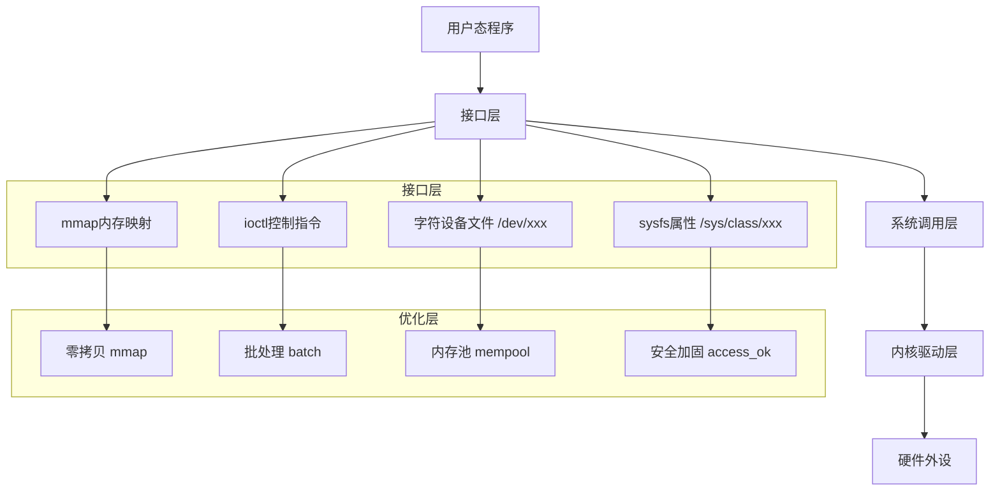

# 用户态-内核态交互

> BIEM定位：[B→M] 从"理解open/read/write"到"自主设计高性能零拷贝接口" 
> 本章核心价值：覆盖字符设备文件、sysfs、ioctl、mmap四大标准接口，以及批处理、内存池、零拷贝等高级优化技术，每类接口配齐内核实现+用户态测试程序 
> 前置约定：本章不重复03模块中已讲解的系统调用底层原理，直接进入接口实现与优化

---

## <strong>模块概述</strong>

定义：用户态-内核态接口是嵌入式Linux系统中应用程序与内核驱动之间的标准化通信桥梁。它既是用户程序访问硬件的唯一合法入口，也是驱动开发者将内核能力向外暴露的核心手段。 

嵌入式价值：在ARM SoC平台上，用户态程序（如工业控制应用、传感器数据采集程序）无法直接访问硬件寄存器，必须通过接口调用驱动代码间接操作外设。接口设计的质量直接决定了系统的吞吐量、延迟和稳定性。 

全景覆盖：本章从基础接口（字符设备文件、sysfs）起步，逐步深入到控制接口（ioctl）、高性能接口（mmap），最终覆盖安全加固、性能优化和自定义接口设计等进阶主题。掌握本章内容，等于掌握了嵌入式Linux驱动开发的"对外服务窗口"设计能力。 

---

## <strong>BIEM分层导航</strong>

| 层级 | 能力定位 | 核心任务 | 对应文件 |
|------|----------|----------|----------|
| [B] | 能调用接口操作设备 | 理解接口类型，会写open/read/write | 15-01, 15-03, 15-05 |
| [I] | 能实现接口内核侧 | 会写file_operations、sysfs属性、ioctl处理 | 15-02, 15-04, 15-06 |
| [E] | 能优化接口性能 | 会设计mmap零拷贝、批处理、内存池 | 15-07, 15-08, 15-09 |
| [M] | 能自主设计接口 | 会设计安全模型、性能基线、版本兼容策略 | 15-10, 15-11, 15-12 |

---

## <strong>子文件列表与难度标记</strong>

### 基础认知层 [B]

| 文件 | 难度 | 核心内容 |
|------|------|----------|
| 15-01-接口基础认知.md | [B] | 接口本质认知、四种接口类型概览、空间隔离设计逻辑 |
| 15-03-字符设备文件接口.md | [B→I] | /dev设备节点创建、file_operations实现、open/read/write/close |
| 15-05-sysfs接口.md | [B→I] | /sys属性文件创建、device_attribute、cat/echo交互 |

### 技术实现层 [I]

| 文件 | 难度 | 核心内容 |
|------|------|----------|
| 15-02-主流接口技术详解.md | [B→I] | 系统调用注册、SYSCALL_DEFINE宏、参数传递、返回值处理、兼容性 |
| 15-04-ioctl接口.md | [I] | 控制指令设计、指令码编码规范、参数校验、_IO/_IOR/_IOW/_IOWR |
| 15-06-mmap内存映射接口.md | [I→E] | 页表映射、remap_pfn_range、dma_mmap_coherent、Cache一致性 |

### 实战与优化层 [E]

| 文件 | 难度 | 核心内容 |
|------|------|----------|
| 15-07-嵌入式专属实战场景.md | [I→E] | 多接口组合实战：LED控制+温度读取+配置下发的完整驱动 |
| 15-08-4 高级机制与优化.md | [E] | 零拷贝接口、批处理优化、内存池设计、性能基准测试 |
| 15-09-接口安全加固.md | [E] | 用户指针校验、权限模型、访问控制、防DoS设计 |

### 自主设计层 [M]

| 文件 | 难度 | 核心内容 |
|------|------|----------|
| 15-10-接口性能优化.md | [E→M] | 瓶颈分析、并发优化、延迟隐藏、吞吐量最大化 |
| 15-11-自定义接口设计.md | [E→M] | 接口协议设计、版本协商、错误码体系、文档化规范 |
| 15-12-历史演进与未来展望.md | [M] | Linux接口机制演进史、io_uring前瞻、Rust驱动接口趋势 |

---

## <strong>学习路径建议</strong>

### 路径一：快速入门（面向应用开发者）

目标：能在用户态程序中正确使用接口操作硬件，无需编写内核代码。

1.  阅读 15-01，理解四种接口类型的适用场景
2.  阅读 15-03，掌握字符设备文件的open/read/write操作
3.  阅读 15-05，学会用cat/echo读写sysfs属性
4.  阅读 15-04（ioctl部分），理解控制指令的调用方式
5.  实践：编写一个控制LED和读取温度的用户态程序

### 路径二：驱动开发入门（面向内核初学者）

目标：能独立实现驱动的接口侧，让用户态程序可以操作硬件。

1.  完成"快速入门"路径
2.  阅读 15-02，理解系统调用与接口的底层关联
3.  阅读 15-03（内核实现部分），实现字符设备的file_operations
4.  阅读 15-05（内核实现部分），实现sysfs属性读写
5.  阅读 15-04（内核实现部分），实现ioctl控制接口
6.  实践：为一个GPIO LED编写完整驱动，支持字符设备文件+ioctl控制

### 路径三：性能优化进阶（面向资深开发者）

目标：在高吞吐量场景下设计高性能接口，支撑实时数据采集和传输。

1.  完成"驱动开发入门"路径
2.  阅读 15-06，掌握mmap内存映射接口
3.  阅读 15-08，掌握零拷贝、批处理、内存池三大优化技术
4.  阅读 15-09，在性能优化的同时加固安全边界
5.  阅读 15-10，建立系统化的性能分析与调优方法论
6.  实践：为一个8通道ADC设计mmap零拷贝+批处理接口，实测吞吐量与延迟

### 路径四：架构设计专家（面向技术负责人）

目标：能自主设计接口协议体系，支撑多版本兼容和跨平台移植。

1.  完成"性能优化进阶"路径
2.  阅读 15-11，掌握接口协议设计的完整方法论
3.  阅读 15-12，了解接口技术的演进趋势和未来方向
4.  实践：为团队设计一套统一的传感器驱动接口规范（v1.0），包含接口类型选择矩阵、错误码体系、版本兼容策略

---

## <strong>模块核心架构图</strong>

---

## <strong>验证标准</strong>

| 阶段 | 能力验证 | 通过标准 |
|------|----------|----------|
| B级 | 能正确使用接口操作设备 | 编写用户态程序，成功控制LED亮灭并读取温度值 |
| I级 | 能实现驱动的接口侧 | 独立编写字符驱动，用户态open/write/ioctl均可正常工作 |
| E级 | 能优化接口性能 | mmap映射后，1000次读取耗时低于传统read路径的20% |
| M级 | 能自主设计接口规范 | 输出一份包含接口矩阵、错误码表、版本策略的设计文档 |
