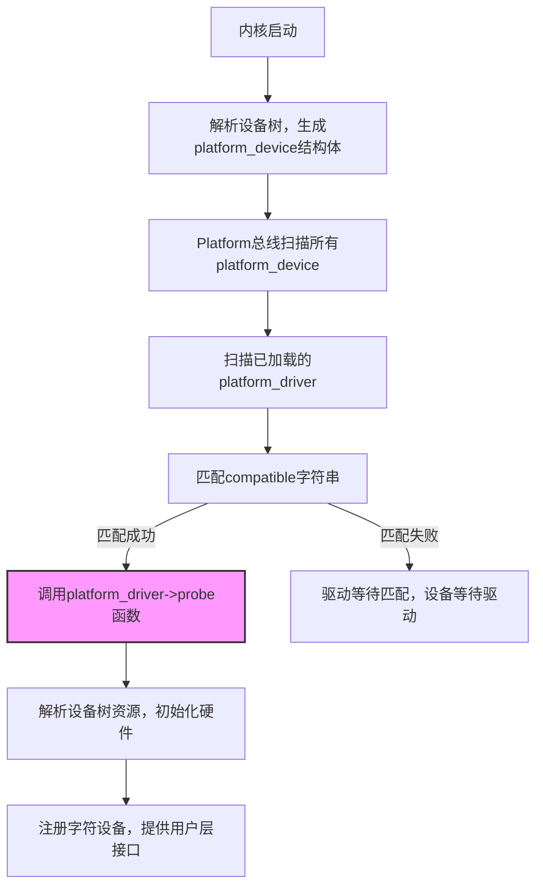

# 进阶适配：设备树与Platform框架绑定

> 📊 **本节难度等级：** **IE级**

---

### <strong>设备树DT节点编写：compatible属性、GPIO资源的DTS配置</strong>

设备树（Device Tree，DT）是嵌入式Linux解决“驱动与硬件紧耦合”的核心机制，
替代了传统“硬编码硬件参数到驱动”的方式；Platform框架则是内核“设备-驱动分离”模型的实现载体，二者结合可让驱动适配不同硬件版本时仅修改设备树，无需改动驱动代码。
I级开发者需掌握设备树核心语法，E级需理解工业级设备树的兼容性设计。

1. 设备树核心价值（I级）
传统字符设备驱动的痛点：若需将LED驱动从GPIO17适配到GPIO27，需修改驱动代码中`#define LED_GPIO 17`并重新编译；
设备树+Platform的优势：仅修改设备树中GPIO配置，驱动代码无需改动，通过“驱动匹配设备树属性”自动适配硬件，符合工业级“一次开发、多硬件适配”的要求。 

### <strong>Platform驱动整合：`probe`函数中解析设备树GPIO资源</strong>

Platform框架是内核针对“片上外设”设计的总线驱动模型，
核心是“设备（设备树）-驱动（Platform驱动）”分离：设备树描述硬件资源，Platform驱动实现业务逻辑，内核通过`compatible`字符串完成自动绑定。
I级需掌握驱动结构体定义与probe函数解析资源，E级需掌握工业级错误处理与资源管理。

##### 1. Platform框架核心原理（I级，流程图+文字解析）

- 核心优势[I]：
  1. 解耦：硬件资源（GPIO/中断）在设备树定义，驱动仅处理逻辑，适配不同硬件只需改设备树；
  2. 自动绑定：内核无需手动注册设备，通过`compatible`自动匹配；
  3. 标准化：遵循内核设备模型，便于维护与扩展。 

### <strong>热插拔支持：驱动`probe`/`remove`的动态触发逻辑
热插拔（Hot Plug）是工业级设备的核心需求（如可插拔LED模块、外设热插拔），Platform框架通过`probe`/`remove`函数实现动态触发，I级需理解触发条件，E级需掌握工业级适配规范。</strong>

1. 热插拔核心机制（E级，流程图+解析）

- 触发条件[I]：
  1. `probe`触发：①驱动加载时，已存在匹配的`platform_device`；②设备插入（热插拔），生成匹配的`platform_device`；③设备树启用（`status="okay"`），内核生成`platform_device`。
  2. `remove`触发：①驱动卸载（`rmmod`）；②设备移除（热插拔）；③设备树禁用（`status="disabled"`）；④内核重启/关机。 

---
