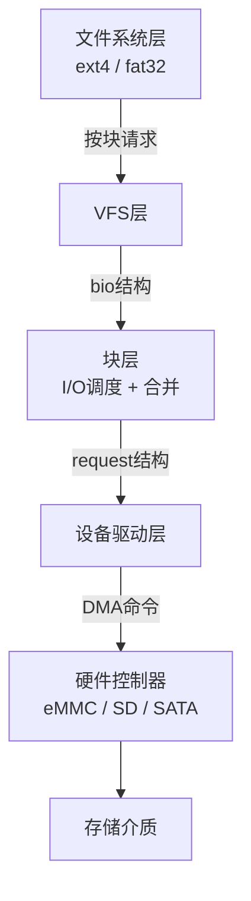
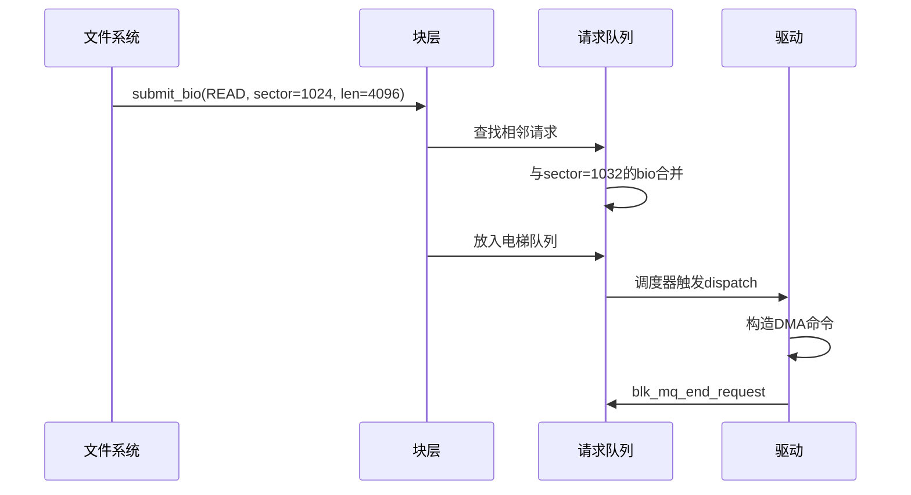
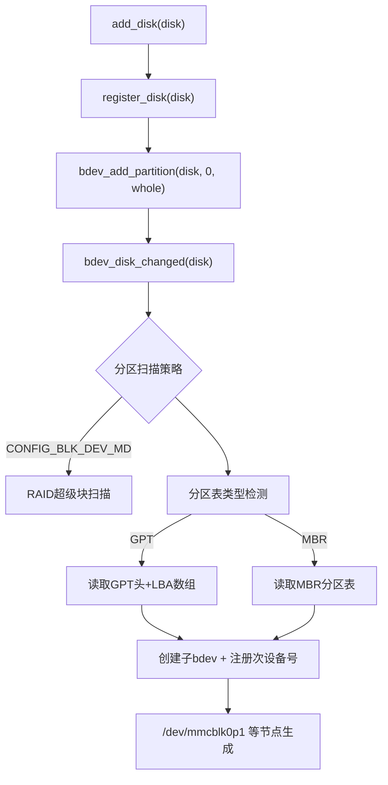
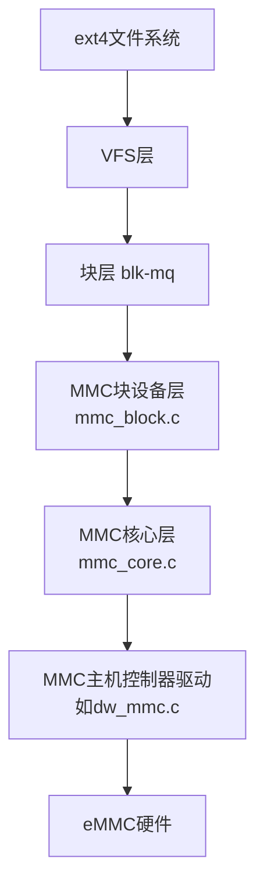

# 3 块设备驱动框架

> **本节难度等级：** [I→E]

> <span class="blue">核心认知目标：理解块设备与字符设备的本质差异，掌握请求队列、gendisk结构、分区表管理等核心机制，能够基于Linux块层框架实现eMMC等嵌入式存储介质的块设备驱动。</span>

---

### <strong>块设备核心概念与字符设备差异</strong>

<span class="red">块设备</span>（Block Device）与<span class="red">字符设备</span>的根本差异在于数据访问模式：
字符设备以字节流方式顺序访问，而块设备以固定大小的数据块为单位随机访问。
这一差异决定了二者在内核中的实现架构完全不同。

| <span class="orange">维度</span> | <span class="orange">字符设备</span> | <span class="orange">块设备</span> |
|------|----------|----------|
| 访问粒度 | 字节（1B） | 扇区（通常512B/1024B/4096B） |
| 访问模式 | 顺序流 | 随机寻址 |
| I/O调度 | 无（直接传递） | 有（电梯算法/ deadline/ CFQ/ BFQ/ MQ） |
| 缓冲策略 | 通常无缓冲 | 页缓存（Page Cache） |
| 内核结构 | cdev + file_operations | gendisk + block_device_operations |
| 典型硬件 | UART、GPIO、LED | eMMC、SD卡、SSD、NAND Flash |
| 用户态接口 | read/write/ioctl | 文件系统（ext4）或裸设备dd |

块设备的核心抽象是<span class="green">扇区</span>（Sector），
所有I/O操作必须以扇区为单位对齐。
现代存储介质普遍采用4KB（8个512B扇区）作为物理页大小，
但内核仍以512B扇区为逻辑单位向上层暴露接口。



<span class="blue">核心认知：块设备驱动不直接与用户程序交互——用户程序通过文件系统（如ext4）访问块设备，文件系统通过bio/request结构向块设备驱动提交I/O请求。驱动开发者的职责是将内核标准化的I/O请求翻译成硬件控制器可执行的命令。</span><br>

---

### <strong>请求队列与I/O调度</strong>

Linux块层维护<span class="red">请求队列</span>（Request Queue），
用于汇集、合并和调度来自上层的I/O请求。
理解请求队列的工作机制，是编写高性能块设备驱动的关键。

从bio到request的转换流程：



现代内核使用<span class="green">Multi-Queue（MQ）</span>架构替代旧版的单队列电梯调度器：

| <span class="orange">组件</span> | <span class="orange">职责</span> | <span class="orange">关键结构</span> |
|------|------|----------|
| Software Queue（sw queue） | 按CPU核心缓存I/O请求，避免锁竞争 | blk_mq_ctx |
| Hardware Queue（hw queue） | 按硬件队列深度提交请求 | blk_mq_hw_ctx |
| Tag分配 | 为每个request分配唯一标识，支持硬件乱序完成 | sbitmap |
| I/O调度器 | 在sw queue层面做合并与排序 | mq-deadline / kyber / bfq |

```c
// drivers/block/myblk.c: 请求队列初始化与处理
// 行号：40-90
#include <linux/blk-mq.h>

#define MYBLK_QUEUE_DEPTH   32
#define MYBLK_HW_QUEUE_NUM  1

static const struct blk_mq_ops myblk_mq_ops = {
    .queue_rq = myblk_queue_rq,     /* 入队处理 */
    .commit_rqs = myblk_commit_rqs, /* 批量提交 */
};

static int myblk_queue_rq(struct blk_mq_hw_ctx *hctx,
                          const struct blk_mq_queue_data *bd)
{
    struct request *req = bd->rq;
    struct myblk_dev *dev = hctx->queue->dqueuedata;
    
    /* 从request提取关键参数 */
    sector_t sector = blk_rq_pos(req);      /* 起始扇区 */
    unsigned int nr_sectors = blk_rq_sectors(req); /* 扇区数 */
    int rw = rq_data_dir(req);               /* READ=0, WRITE=1 */
    
    /* 将request加入驱动的待处理列表 */
    spin_lock(&dev->list_lock);
    list_add_tail(&req->queuelist, &dev->pending_list);
    spin_unlock(&dev->list_lock);
    
    /* 触发硬件处理（或调度workqueue延后处理） */
    queue_work(dev->workqueue, &dev->work);
    
    return BLK_MQ_RQ_QUEUE_OK;
}

/* ── workqueue处理函数：批量构造命令 ── */
static void myblk_work_handler(struct work_struct *work)
{
    struct myblk_dev *dev = container_of(work, struct myblk_dev, work);
    struct request *req, *next;
    LIST_HEAD(process_list);
    
    /* 批量取出待处理请求 */
    spin_lock_irq(&dev->list_lock);
    list_splice_init(&dev->pending_list, &process_list);
    spin_unlock_irq(&dev->list_lock);
    
    list_for_each_entry_safe(req, next, &process_list, queuelist) {
        /* 构造硬件命令并提交 */
        myblk_submit_cmd(dev, req);
    }
}
```

<span class="blue">关键设计：MQ架构下，驱动不应在.queue_rq中执行耗时操作，而应快速将request加入待处理列表并返回。实际的硬件提交应在workqueue或中断上下文完成，这是避免阻塞I/O调度线程的核心原则。</span><br>

---

### <strong>gendisk结构与设备注册</strong>

<span class="red">gendisk</span>（通用磁盘）结构是块设备在内核中的核心抽象，
它代表一个可被分区、格式化、挂载的存储设备。
每个块设备驱动必须分配并注册一个gendisk实例。

gendisk的关键字段：

| <span class="orange">字段</span> | <span class="orange">类型</span> | <span class="orange">说明</span> |
|------|------|------|
| disk_name | char[32] | 设备名称，如"mmcblk0" |
| first_minor | int | 起始次设备号 |
| minors | int | 支持的最大分区数 |
| fops | block_device_operations* | 块设备操作表 |
| queue | request_queue* | 关联的请求队列 |
| part_tbl | disk_part_tbl* | 分区表 |
| private_data | void* | 驱动私有数据 |
| flags | unsigned int | GENHD_FL_*标志 |

```c
// drivers/block/myblk.c: gendisk分配与注册
// 行号：100-160
#include <linux/genhd.h>

static int myblk_create_disk(struct myblk_dev *dev)
{
    struct gendisk *disk;
    
    /* 1. 分配gendisk结构 */
    disk = alloc_disk(1);  /*  minors=1，仅支持1个分区（裸设备） */
    if (!disk)
        return -ENOMEM;
    
    /* 2. 初始化请求队列（MQ模式） */
    dev->tag_set.ops = &myblk_mq_ops;
    dev->tag_set.nr_hw_queues = MYBLK_HW_QUEUE_NUM;
    dev->tag_set.queue_depth = MYBLK_QUEUE_DEPTH;
    dev->tag_set.numa_node = NUMA_NO_NODE;
    dev->tag_set.cmd_size = sizeof(struct myblk_cmd);
    
    ret = blk_mq_alloc_tag_set(&dev->tag_set);
    if (ret) {
        put_disk(disk);
        return ret;
    }
    
    dev->queue = blk_mq_init_queue(&dev->tag_set);
    if (IS_ERR(dev->queue)) {
        blk_mq_free_tag_set(&dev->tag_set);
        put_disk(disk);
        return PTR_ERR(dev->queue);
    }
    
    /* 3. 填充gendisk字段 */
    disk->major = dev->major;
    disk->first_minor = dev->first_minor;
    disk->fops = &myblk_fops;
    disk->queue = dev->queue;
    disk->private_data = dev;
    snprintf(disk->disk_name, sizeof(disk->disk_name),
             "myblk%%d", dev->idx);
    
    /* 设置容量（以512B扇区为单位） */
    set_capacity(disk, dev->capacity_sectors);
    
    /* 4. 注册到内核 */
    dev->disk = disk;
    add_disk(disk);  /* 此时设备在/dev下可见 */
    
    pr_info("myblk: registered disk %s, capacity=%llu sectors\n",
            disk->disk_name, dev->capacity_sectors);
    return 0;
}
```

块设备操作表（block_device_operations）是字符设备file_operations的块设备等价物，
但接口更为精简：

```c
// drivers/block/myblk.c: 块设备操作表
// 行号：165-195
static const struct block_device_operations myblk_fops = {
    .owner          = THIS_MODULE,
    .open           = myblk_open,
    .release        = myblk_release,
    .ioctl          = myblk_ioctl,
    .compat_ioctl   = myblk_compat_ioctl,
    .getgeo         = myblk_getgeo,      /* 用于fdisk等工具获取磁盘几何信息 */
};

static int myblk_open(struct block_device *bdev, fmode_t mode)
{
    struct myblk_dev *dev = bdev->bd_disk->private_data;
    
    mutex_lock(&dev->mutex);
    dev->open_count++;
    mutex_unlock(&dev->mutex);
    
    return 0;
}

static void myblk_release(struct gendisk *disk, fmode_t mode)
{
    struct myblk_dev *dev = disk->private_data;
    
    mutex_lock(&dev->mutex);
    dev->open_count--;
    if (dev->open_count == 0) {
        /* 可选：执行卸载前的刷新操作 */
        myblk_flush_cache(dev);
    }
    mutex_unlock(&dev->mutex);
}
```

<span class="blue">关键顺序：必须先alloc_disk()，再初始化请求队列，最后add_disk()。add_disk之后设备立即可用，用户态可立即看到/dev/myblk0节点并发起I/O。</span><br>

---

### <strong>分区表识别与管理</strong>

块设备的分区信息由内核的<span class="red">分区表解析器</span>在add_disk()时自动扫描识别。
驱动本身通常不参与分区解析——这是块层通用功能。
但驱动开发者需要理解分区如何与gendisk关联，以便调试分区识别失败的问题。

分区扫描触发点：



分区在内核中的表示：

```c
// include/linux/genhd.h: 分区结构核心字段
struct hd_struct {
    sector_t start_sect;    /* 分区起始扇区（相对于磁盘） */
    sector_t nr_sects;      /* 分区扇区数 */
    int policy;             /* 只读/读写策略 */
    int partno;             /* 分区号（如p1=1） */
    struct device __dev;    /* sysfs设备对象 */
};

struct disk_part_tbl {
    struct rcu_head rcu_head;
    int len;
    struct hd_struct __rcu *last_lookup;
    struct hd_struct __rcu *part[];
};
```

嵌入式开发中常见的分区表类型：

| <span class="orange">类型</span> | <span class="orange">存储位置</span> | <span class="orange">最大分区数</span> | <span class="orange">嵌入式适用性</span> |
|------|----------|------------|------------|
| MBR | 扇区0 | 4主+扩展 | 传统，逐渐被GPT替代 |
| GPT | 扇区1-33 | 128+ | 推荐，支持大容量eMMC |
| 裸分区 | 无分区表 | 1 | 启动加载器（u-boot/SPL）常用 |
| MTD分区 | 内核参数mtdparts | 任意 | 裸NAND Flash专用 |

分区识别失败的常见原因：
1.  驱动报告的capacity_sectors不准确，导致分区表解析越界
2.  eMMC的EXT_CSD配置与驱动解析的分区类型不一致
3.  GPT的备份分区表损坏，驱动只读取主表导致误判

<span class="blue">调试方法：通过`blockdev --report /dev/mmcblk0`查看块层识别的分区信息；通过`dmesg | grep -i partition`查看内核分区扫描日志；通过`fdisk -l /dev/mmcblk0`验证分区表解析结果。</span><br>

---

### <strong>实战：eMMC块设备驱动实现</strong>

eMMC（Embedded MultiMediaCard）是嵌入式系统最常用的存储介质之一，
本节演示基于Linux MMC子系统的eMMC块设备驱动最小实现。

eMMC在Linux内核中的分层：



驱动开发者通常只需实现最底层——<span class="green">MMC主机控制器驱动</span>。
MMC核心层和块层由内核维护，提供标准API供主机控制器驱动注册。

```c
// drivers/mmc/host/dw_mmc.c: eMMC主机控制器驱动核心片段
// 行号：400-470
#include <linux/mmc/host.h>
#include <linux/mmc/mmc.h>
#include <linux/dmaengine.h>

struct dw_mmc_priv {
    void __iomem *regs;
    struct clk *clk;
    struct dma_chan *dma_tx;
    struct dma_chan *dma_rx;
    struct mmc_host *mmc;
    struct mmc_request *mrq;
    spinlock_t lock;
};

/* ── 主机控制器操作表 ── */
static const struct mmc_host_ops dw_mmc_ops = {
    .request    = dw_mmc_request,       /* 提交MMC请求 */
    .set_ios    = dw_mmc_set_ios,       /* 配置时钟/总线宽度 */
    .get_cd     = dw_mmc_get_cd,        /* 检测卡插入 */
    .start_signal_voltage_switch = dw_mmc_voltage_switch,
};

/* ── 核心函数：处理来自MMC核心的请求 ── */
static void dw_mmc_request(struct mmc_host *mmc, struct mmc_request *mrq)
{
    struct dw_mmc_priv *priv = mmc_priv(mmc);
    struct mmc_data *data = mrq->data;
    unsigned long flags;
    
    spin_lock_irqsave(&priv->lock, flags);
    priv->mrq = mrq;
    spin_unlock_irqrestore(&priv->lock, flags);
    
    /* 配置命令参数 */
    dw_mmc_set_command(priv, mrq->cmd);
    
    /* 如果有数据传输，配置DMA */
    if (data) {
        if (data->flags & MMC_DATA_READ)
            dw_mmc_setup_dma_rx(priv, data);
        else
            dw_mmc_setup_dma_tx(priv, data);
    }
    
    /* 启动命令执行 */
    dw_mmc_start_command(priv);
}

/* ── DMA完成中断：通知MMC核心请求完成 ── */
static void dw_mmc_dma_complete(void *param)
{
    struct dw_mmc_priv *priv = param;
    struct mmc_request *mrq;
    unsigned long flags;
    
    spin_lock_irqsave(&priv->lock, flags);
    mrq = priv->mrq;
    priv->mrq = NULL;
    spin_unlock_irqrestore(&priv->lock, flags);
    
    if (mrq) {
        /* 标记数据完成 */
        if (mrq->data)
            mrq->data->error = 0;
        mrq->cmd->error = 0;
        
        /* 通知MMC核心层，触发块层回调 */
        mmc_request_done(priv->mmc, mrq);
    }
}
```

eMMC驱动初始化流程：

| <span class="orange">步骤</span> | <span class="orange">操作</span> | <span class="orange">关键API</span> |
|------|------|----------|
| 1 | 分配mmc_host结构 | mmc_alloc_host(sizeof(priv), dev) |
| 2 | 填充主机参数 | mmc->f_min/f_max, mmc->ocr_avail |
| 3 | 注册操作表 | mmc->ops = &dw_mmc_ops |
| 4 | 初始化硬件 | 时钟配置、GPIO、DMA通道申请 |
| 5 | 注册到MMC核心 | mmc_add_host(mmc) |
| 6 | 块层自动识别 | 扫描eMMC CID/CSD/EXT_CSD，创建mmcblk0 |

<span class="blue">关键要点：eMMC驱动不直接操作gendisk和请求队列——这些由MMC核心层和块层（mmc_block.c）自动管理。主机控制器驱动只需正确实现mmc_host_ops接口，完成"接收MMC命令→配置硬件→执行→中断回调→通知完成"的闭环。</span><br>

---

### <strong>历史演进：从bio到Multi-Queue</strong>

Linux块层的I/O架构经历了四代演进，每次演进都是为了适应存储硬件性能的提升。

第一代<span class="green">单队列电梯算法</span>（Linux 2.4-3.12）：
所有I/O请求进入单一队列，由电梯算法（CFQ/BFQ/Deadline/NOOP）排序合并后提交给驱动。
瓶颈：单队列锁竞争限制多核并发，高IOPS设备（NVMe SSD）的队列深度无法充分利用。

第二代<span class="green">Multi-Queue雏形</span>（Linux 3.13，blk-mq实验）：
引入软件队列（percpu）+ 硬件队列（per device queue）的两级队列模型，
但调度器未完全适配。

第三代<span class="green">blk-mq成熟</span>（Linux 4.0+）：
新调度器mq-deadline/kyber/bfq专门为MQ架构设计，支持NVMe设备的65535级队列深度。
NVMe驱动成为blk-mq的首个大规模用户。

第四代<span class="green">hybrid polling</span>（Linux 4.10+）：
对于低延迟NVMe设备，传统中断方式的开销（约2-5us）大于I/O本身（约1us）。
引入轮询模式：CPU主动轮询完成状态，消除中断上下文切换开销。

嵌入式eMMC/SMMC场景的特殊性：
eMMC控制器通常只支持单队列（深度1-32），blk-mq的MQ优势不如NVMe显著。
但现代SoC（如瑞芯微RK3588）的eMMC控制器支持双队列+门铃中断，
blk-mq的多队列模型可以匹配硬件能力，减少锁竞争。

<span class="blue">演进主线：块层架构从"单队列单锁"向"多队列无锁"演进，驱动力是存储硬件性能（IOPS/带宽）超过单CPU核心处理能力。嵌入式领域受益点在于：多核SoC上不同CPU核心的I/O请求可进入不同软件队列，避免全局锁竞争。</span><br>

---

### <strong>本模块小结</strong>

| <span class="orange">维度</span> | <span class="orange">块设备概念</span> | <span class="orange">请求队列</span> | <span class="orange">gendisk</span> | <span class="orange">分区表</span> | <span class="orange">eMMC实战</span> |
|------|----------|--------|--------|--------|----------|
| 核心抽象 | 扇区级随机访问 | bio→request→dispatch | disk+queue+fops | GPT/MBR解析 | mmc_host_ops |
| 与字符设备差异 | 块对齐+缓存+调度 | 合并+排序+多队列 | 分区支持 | 自动扫描 | 分层架构 |
| 关键结构 | sector_t | blk_mq_tag_set | gendisk | hd_struct | mmc_host |
| 注册顺序 | 无 | tag_set→queue→disk | alloc_disk→add_disk | add_disk时扫描 | alloc_host→add_host |
| 调试接口 | /sys/block | /sys/block/xxx/queue | /proc/partitions | blockdev/fdisk | dmesg/mmc utils |

**练习**

1.  某eMMC驱动使用blk-mq的.queue_rq在收到请求后立即启动DMA传输，导致在大量小I/O（512B随机读）时CPU占用率飙升至60%。分析瓶颈原因，给出"快速入队+延后批量提交"的优化方案并写出核心代码。

2.  一个自定义块设备驱动alloc_disk(16)注册了设备，但用户只看到/dev/myblk0而没有任何分区节点。排查分区表扫描失败的可能原因，列出3种检查方法（内核日志、sysfs、命令行工具）。

3.  基于MMC核心层框架，为一个假设的SPI接口SD卡控制器编写mmc_host_ops操作表的最小实现：只需实现request和set_ios两个函数，set_ios中配置SPI时钟频率和总线宽度，request中将MMC命令翻译成SPI命令序列并启动传输。写出完整代码并说明与eMMC主机控制器驱动的主要差异。
