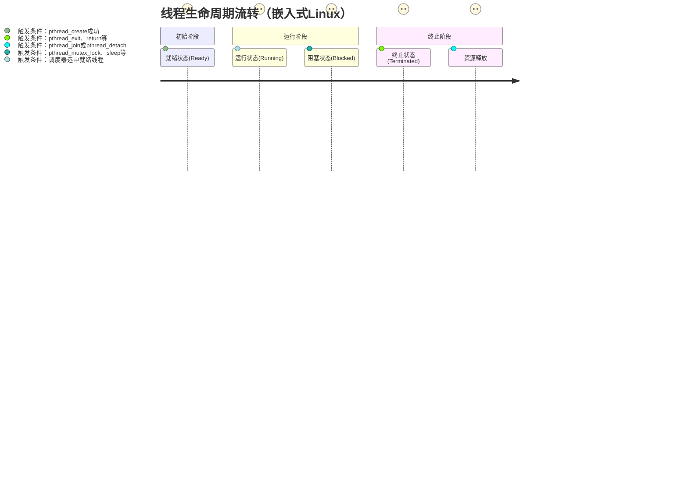

# 第2章 pthread核心API实战

> 📊 **本节难度等级：** <span class="badge-i">**I级**</span>

---

### <strong>pthread（POSIX Threads）是嵌入式Linux多线程开发的标准接口，而“线程生命周期管理”是pthread API的核心应用场景——从线程创建时的资源配置，到运行中的主动/被动终止，再到退出后的资源回收，每个环节都直接影响嵌入式系统的稳定性（如内存泄漏、僵尸线程）和实时性（如创建开销过高）。本节以“生命周期流转”为线索，逐个拆解创建、终止、回收的核心API，配套嵌入式实战代码（含栈配置、参数传递等细节），并针对“线程创建失败”“僵尸线程”等高频问题给出排查方案，最终落地一套可直接复用的管理模板。</strong>


### <strong>一、线程生命周期总览：从创建到退出的完整流转</strong>

在开始API实战前，需先明确嵌入式Linux中线程的核心生命周期状态及流转逻辑——这是理解API调用时机的基础。线程从创建到最终退出，会经历“就绪→运行→阻塞→终止”四大核心状态，流转过程及触发条件如下：



从嵌入式开发视角看，生命周期管理的核心目标是：**以最小资源开销创建线程、以安全方式终止线程、及时回收线程资源避免泄漏**。接下来围绕“创建→终止→回收”三个关键节点，展开API实战与问题解决。<br>

### <strong>二、线程创建：pthread_create核心API与嵌入式适配</strong>

`pthread_create`是线程生命周期的“起点”，其核心作用是向内核申请线程资源（PCB、栈空间等）并将线程加入就绪队列。嵌入式场景中，线程创建的关键痛点是“默认配置不适配资源约束”（如默认8MB栈浪费RAM）和“参数传递不当导致野指针”，需通过API参数精细化配置解决。

### 2.1 核心API解析：pthread_create参数与返回值
`pthread_create`的函数原型及参数含义如下，嵌入式开发中需重点关注`attr`（线程属性）和`arg`（线程参数）两个核心参数：
```c
#include <pthread.h>
// 返回值：0表示创建成功，非0为错误码（需用strerror解析，而非perror）
int pthread_create(
    pthread_t *thread,          // [输出] 线程ID，用于后续管理（如回收、终止）
    const pthread_attr_t *attr, // [输入] 线程属性（栈大小、分离状态等，NULL为默认属性）
    void *(*start_routine)(void*), // [输入] 线程执行的函数（必须是void*入参、void*返回的函数指针）
    void *arg                   // [输入] 传递给start_routine的参数（需注意生命周期）
);
```

#### 关键参数深度解读（嵌入式重点）
1.  **线程ID（pthread_t）**：  
    是线程的唯一标识，用于后续`pthread_join`（回收）、`pthread_kill`（发信号）等操作。需注意：`pthread_t`不是整数类型（不同架构定义不同，如ARM为无符号长整型），不能直接用`printf("%d")`打印，嵌入式中需用`pthread_self()`获取当前线程ID，或用`printf("%lu", (unsigned long)pthread_self())`打印。

2.  **线程属性（pthread_attr_t）**：  
    默认值（NULL）下，线程栈大小为8MB（可通过`ulimit -s`查看），这对嵌入式RAM（如64MB）极不友好。嵌入式开发必须通过`pthread_attr_t`自定义属性，核心配置项为“栈大小”和“分离状态”，配置步骤如下：
    ```c
    pthread_attr_t attr;
    pthread_attr_init(&attr); // 初始化属性结构体（必须先初始化再配置）
    
    // 1. 配置栈大小（嵌入式常用32KB~128KB，需大于PTHREAD_STACK_MIN（16KB））
    size_t stack_size = 32 * 1024; // 32KB栈
    pthread_attr_setstacksize(&attr, stack_size);
    
    // 2. 配置分离状态（PTHREAD_CREATE_DETACHED：创建后自动分离，无需join）
    pthread_attr_setdetachstate(&attr, PTHREAD_CREATE_DETACHED);
    
    // 3. 用自定义属性创建线程
    pthread_create(&tid, &attr, thread_func, NULL);
    
    pthread_attr_destroy(&attr); // 销毁属性结构体（释放资源）
    ```

3.  **线程参数（arg）**：  
    传递给线程函数的参数，嵌入式开发中极易因“参数生命周期”导致野指针——若传递局部变量地址，主线程退出后局部变量被释放，子线程访问时会触发段错误。核心解决方案有两种：
    - 方案1：传递全局变量/静态变量地址（生命周期与进程一致）；
    - 方案2：动态分配内存（`malloc`）传递，子线程内使用完成后手动`free`。


### 2.2 嵌入式实战：线程创建的完整示例（含参数传递+栈配置）
以“传感器数据采集线程”为例，实现嵌入式场景下的标准创建流程：配置32KB栈大小、传递动态分配的采集参数、打印线程ID，同时处理创建失败的错误（嵌入式开发中必须检查返回值）：
```c
#include <pthread.h>
#include <stdio.h>
#include <stdlib.h>
#include <string.h>
#include <unistd.h>

// 传感器采集参数（自定义结构体，通过动态内存传递）
typedef struct {
    int sensor_id;    // 传感器ID
    int sample_freq;  // 采样频率（Hz）
    char name[32];    // 传感器名称
} SensorParam;

// 采集线程函数：接收参数并执行采样逻辑
void *sensor_collect_thread(void *arg) {
    SensorParam *param = (SensorParam *)arg;
    // 打印线程ID（嵌入式中常用unsigned long转换）
    printf("Collect thread ID: %lu, sensor ID: %d\n", 
           (unsigned long)pthread_self(), param->sensor_id);
    
    // 模拟采集逻辑（按频率采样）
    while (1) {
        printf("Sensor %s collect data: %d\n", param->name, rand() % 100);
        usleep(1000000 / param->sample_freq); // 按频率休眠
    }
    
    // 释放动态分配的参数（子线程内释放，避免内存泄漏）
    free(param);
    pthread_exit(NULL); // 主动终止线程（后续讲解）
}

int main() {
    pthread_t collect_tid;
    pthread_attr_t attr;
    int ret;

    // 1. 初始化线程属性并配置栈大小
    ret = pthread_attr_init(&attr);
    if (ret != 0) {
        fprintf(stderr, "pthread_attr_init failed: %s\n", strerror(ret));
        return -1;
    }
    size_t stack_size = 32 * 1024; // 32KB栈（适配嵌入式RAM约束）
    ret = pthread_attr_setstacksize(&attr, stack_size);
    if (ret != 0) {
        fprintf(stderr, "Set stack size failed: %s\n", strerror(ret));
        pthread_attr_destroy(&attr);
        return -1;
    }

    // 2. 动态分配并初始化采集参数（避免局部变量生命周期问题）
    SensorParam *param = (SensorParam *)malloc(sizeof(SensorParam));
    if (param == NULL) {
        perror("malloc param failed");
        pthread_attr_destroy(&attr);
        return -1;
    }
    param->sensor_id = 1;
    param->sample_freq = 10; // 10Hz采样
    strncpy(param->name, "Temperature", sizeof(param->name)-1);

    // 3. 创建采集线程
    ret = pthread_create(&collect_tid, &attr, sensor_collect_thread, (void *)param);
    if (ret != 0) {
        fprintf(stderr, "pthread_create failed: %s\n", strerror(ret));
        free(param); // 创建失败需释放参数，避免泄漏
        pthread_attr_destroy(&attr);
        return -1;
    }

    // 4. 销毁属性结构体（创建成功后属性已不再需要）
    pthread_attr_destroy(&attr);

    // 主线程阻塞等待（避免主线程提前退出导致子线程终止）
    pthread_join(collect_tid, NULL); // 后续讲解回收逻辑
    return 0;
}
```

### 2.3 高频问题排查：线程创建失败的3类核心原因
嵌入式开发中`pthread_create`失败率远高于通用PC，核心原因集中在“资源不足”“参数错误”两类，以下是3种高频场景及排查方案：

| 失败错误码 | 核心原因（嵌入式场景）                          | 排查与解决方法                                                                 |
|------------|-----------------------------------------------|------------------------------------------------------------------------------|
| EAGAIN     | 系统资源不足（如RAM耗尽、线程数量达到内核限制）  | 1. 用`free -m`查看RAM剩余，减小线程栈大小（如从32KB缩至16KB）；<br>2. 用`cat /proc/sys/kernel/threads-max`查看线程数上限，必要时修改内核参数 |
| EINVAL     | 线程属性无效（如栈大小小于PTHREAD_STACK_MIN）   | 1. 用`printf("%d\n", PTHREAD_STACK_MIN)`查看最小栈大小（通常16384字节）；<br>2. 确保栈大小配置≥最小栈，且为系统页大小整数倍（如4KB对齐） |
| EFAULT     | 线程ID或属性结构体地址无效（如野指针）          | 1. 检查`pthread_t *thread`是否为有效指针（非NULL）；<br>2. 确保`pthread_attr_t`已初始化（未初始化会导致地址无效） |

**排查工具**：创建失败时，除打印错误码外，可通过`dmesg | grep -i thread`查看内核日志，定位“栈空间不足”“权限不够”等深层原因。<br>

### <strong>三、线程终止：主动退出与被动终止的安全实现</strong>

线程终止是生命周期的“收尾阶段”，嵌入式场景中需重点关注“资源释放”（如打开的文件描述符、动态内存）和“优雅退出”（如避免数据半写入）。线程终止分为“主动终止”和“被动终止”两类，对应不同的API及使用场景。

### 3.1 主动终止：pthread_exit与return的正确使用
主动终止是线程自主退出的场景（如任务执行完成、检测到异常），核心通过`pthread_exit`函数或线程函数`return`实现，两者的区别及嵌入式适配如下：

#### （1）核心API与差异对比
| 终止方式       | 核心API/语法                  | 适用场景                                  | 嵌入式注意事项                                                                 |
|----------------|-------------------------------|-------------------------------------------|------------------------------------------------------------------------------|
| pthread_exit   | `void pthread_exit(void *retval);` | 线程函数中任意位置终止（如异常分支）      | retval是线程退出状态（需传递全局/动态内存地址，避免局部变量）；调用后不会返回，需确保之前释放关键资源 |
| return         | 线程函数末尾`return (void *)status;` | 线程函数正常执行完成后终止                | 退出状态传递逻辑与pthread_exit一致；比pthread_exit更简洁，推荐正常流程使用 |

#### （2）嵌入式实战：带状态返回的主动终止
线程终止时需向主线程返回执行结果（如采集线程返回“采样成功次数”），此时需注意“返回值的生命周期”——不能返回局部变量地址（线程终止后局部变量被释放），需用全局变量或动态内存：
```c
#include <pthread.h>
#include <stdio.h>
#include <stdlib.h>

// 全局变量：存储线程退出状态（生命周期与进程一致）
int g_collect_count = 0;

void *collect_thread(void *arg) {
    // 模拟采集10次后主动终止
    for (int i = 0; i < 10; i++) {
        g_collect_count++;
        usleep(100000);
    }

    // 方式1：return返回全局变量地址（推荐，简洁）
    return (void *)&g_collect_count;

    // 方式2：pthread_exit返回动态内存地址（需主线程释放）
    // int *ret = malloc(sizeof(int));
    // *ret = g_collect_count;
    // pthread_exit((void *)ret);
}

int main() {
    pthread_t tid;
    pthread_create(&tid, NULL, collect_thread, NULL);

    // 主线程回收线程并获取退出状态
    void *ret_val;
    pthread_join(tid, &ret_val);
    // 解析返回值（根据终止方式对应类型转换）
    printf("Collect thread exit, count: %d\n", *(int *)ret_val);

    // 若用方式2（动态内存返回），需主线程释放
    // free(ret_val);
    return 0;
}
```

### 3.2 被动终止：pthread_cancel与信号终止的风险控制
被动终止是“外部触发”的线程退出（如主线程强制终止异常线程），核心通过`pthread_cancel`函数或信号（如SIGTERM）实现。嵌入式场景中需谨慎使用被动终止——若线程持有互斥锁或正在操作硬件，强制终止会导致死锁或硬件状态异常。

#### （1）pthread_cancel核心用法与风险规避
`pthread_cancel`的作用是向目标线程发送“取消请求”，线程会在“取消点”（如`sleep`、`read`等系统调用）处响应并终止。使用时需配合“线程清理函数”释放资源，避免泄漏：
```c
#include <pthread.h>
#include <stdio.h>
#include <unistd.h>

// 线程清理函数：被动终止时释放资源（如互斥锁、文件描述符）
void thread_cleanup(void *arg) {
    // arg传递需清理的资源（如文件描述符）
    int fd = *(int *)arg;
    close(fd); // 关闭打开的文件
    printf("Thread cleaned up: close fd %d\n", fd);
}

void *work_thread(void *arg) {
    // 1. 打开资源（模拟硬件设备文件）
    int fd = open("/dev/sensor0", O_RDONLY);
    if (fd < 0) {
        perror("open sensor failed");
        pthread_exit(NULL);
    }

    // 2. 注册清理函数（可注册多个，按栈序执行）
    // 注意：push和pop必须成对出现，即使线程正常终止也会执行
    pthread_cleanup_push(thread_cleanup, (void *)&fd);

    // 3. 模拟业务逻辑（包含取消点usleep）
    while (1) {
        char buf[32];
        read(fd, buf, sizeof(buf)); // 系统调用，也是取消点
        printf("Read sensor data: %s\n", buf);
        usleep(100000); // 取消点：收到cancel请求后会在此响应
    }

    // 4. 清理函数弹出（参数0表示执行清理函数）
    pthread_cleanup_pop(1);
    pthread_exit(NULL);
}

int main() {
    pthread_t tid;
    pthread_create(&tid, NULL, work_thread, NULL);

    // 主线程运行3秒后，强制终止工作线程
    sleep(3);
    int ret = pthread_cancel(tid);
    if (ret != 0) {
        fprintf(stderr, "pthread_cancel failed: %s\n", strerror(ret));
    }

    // 回收线程资源
    pthread_join(tid, NULL);
    printf("Work thread terminated\n");
    return 0;
}
```

**嵌入式关键注意**：  
- 若线程执行的是“无取消点”的循环（如纯计算逻辑），`pthread_cancel`会失效，需在循环中插入`pthread_testcancel()`主动检测取消请求；
- 硬件操作线程（如CAN总线发送）被强制终止前，需通过清理函数恢复硬件状态（如将总线设为休眠模式），避免硬件异常。

#### （2）信号终止：pthread_kill的使用边界
`pthread_kill`用于向指定线程发送信号（如SIGTERM），触发线程终止——但嵌入式场景中需严格限制使用，仅在“线程无响应”等极端场景下使用，且必须在信号处理函数中实现优雅退出：
```c
#include <signal.h>
#include <pthread.h>
#include <stdio.h>

volatile int g_exit_flag = 0; // 退出标志（volatile避免编译器优化）

// 信号处理函数：收到SIGTERM后设置退出标志
void sigterm_handler(int sig) {
    g_exit_flag = 1;
}

void *work_thread(void *arg) {
    // 注册信号处理函数（仅当前线程生效）
    struct sigaction sa;
    sa.sa_handler = sigterm_handler;
    sigemptyset(&sa.sa_mask);
    sa.sa_flags = 0;
    sigaction(SIGTERM, &sa, NULL);

    // 业务循环：检测到退出标志后优雅退出
    while (!g_exit_flag) {
        printf("Working...\n");
        usleep(100000);
    }

    // 释放资源（优雅退出）
    printf("Thread exit gracefully\n");
    pthread_exit(NULL);
}

int main() {
    pthread_t tid;
    pthread_create(&tid, NULL, work_thread, NULL);

    // 3秒后向线程发送SIGTERM信号
    sleep(3);
    pthread_kill(tid, SIGTERM); // 定向发送信号

    pthread_join(tid, NULL);
    return 0;
}
```<br>

### <strong>四、线程回收：避免僵尸线程的核心手段</strong>

线程终止后并不会立即释放所有资源（如PCB、栈空间），而是进入“终止状态”（类似进程的僵尸状态），需通过`pthread_join`或`pthread_detach`主动回收——嵌入式系统中若长期不回收，会导致资源耗尽（如RAM被终止线程的栈空间占用）。

### 4.1 核心API解析：join与detach的适用场景
线程回收的两个核心API功能互补，嵌入式开发中需根据“是否需要获取线程退出状态”选择使用：

| 回收方式   | 核心API                                  | 核心作用                                  | 嵌入式适用场景                                  |
|------------|------------------------------------------|-------------------------------------------|-----------------------------------------------|
| 阻塞回收   | `int pthread_join(pthread_t thread, void **retval);` | 阻塞主线程，等待目标线程终止后回收资源，同时获取退出状态 | 需要获取线程执行结果的场景（如数据处理线程返回解析结果） |
| 分离回收   | `int pthread_detach(pthread_t thread);`   | 将线程设为“分离状态”，终止后自动回收资源，无需手动join | 无需获取结果的后台线程（如日志打印、心跳检测线程） |

#### （1）阻塞回收：pthread_join获取退出状态
`pthread_join`是嵌入式开发中最常用的回收方式，其核心价值是“获取线程退出状态”（如判断采集线程是否正常完成）和“同步主线程与子线程”（避免主线程提前退出）。关键用法如下：
```c
#include <pthread.h>
#include <stdio.h>
#include <stdlib.h>

// 业务线程：返回执行结果（0表示成功，1表示失败）
void *calc_thread(void *arg) {
    int *input = (int *)arg;
    if (*input < 0) {
        // 异常场景：返回失败状态（动态内存存储结果）
        int *err_ret = malloc(sizeof(int));
        *err_ret = 1;
        pthread_exit((void *)err_ret);
    }

    // 正常场景：返回计算结果
    int *result = malloc(sizeof(int));
    *result = *input * 2;
    pthread_exit((void *)result);
}

int main() {
    pthread_t tid;
    int input = 10;

    pthread_create(&tid, NULL, calc_thread, &input);

    // 阻塞回收线程并获取退出状态
    void *ret_val;
    int ret = pthread_join(tid, &ret_val);
    if (ret != 0) {
        fprintf(stderr, "pthread_join failed: %s\n", strerror(ret));
        return -1;
    }

    // 解析退出状态（根据线程约定的规则判断成功/失败）
    int *result = (int *)ret_val;
    if (*result == 1) {
        fprintf(stderr, "Calc thread failed\n");
    } else {
        printf("Calc result: %d\n", *result);
    }

    // 释放线程返回的动态内存（必须由回收者释放）
    free(ret_val);
    return 0;
}
```

**嵌入式关键注意**：  
- `pthread_join`是“一对一”回收，一个线程只能被一个线程回收，重复回收会返回EINVAL错误；
- 若不需要获取退出状态，`retval`可设为NULL（如前面的采集线程示例），但仍需调用`pthread_join`避免僵尸线程。

#### （2）分离回收：pthread_detach自动释放资源
对于“日志打印”“心跳检测”等无需返回结果的线程，使用`pthread_detach`将其设为“分离状态”后，线程终止时会自动回收资源，无需主线程调用`pthread_join`——这能减少主线程的阻塞开销，适合嵌入式实时场景。

分离回收有两种实现方式，根据“创建时机”选择：
1.  **创建时设置分离属性**（推荐，效率更高）：  
    通过`pthread_attr_setdetachstate`配置属性，创建线程时直接设为分离状态：
    ```c
    pthread_attr_t attr;
    pthread_attr_init(&attr);
    // 设为分离状态
    pthread_attr_setdetachstate(&attr, PTHREAD_CREATE_DETACHED);
    // 创建线程后无需join，终止后自动回收
    pthread_create(&tid, &attr, log_thread, NULL);
    pthread_attr_destroy(&attr);
    ```

2.  **创建后调用pthread_detach**（灵活，适合动态决定分离）：  
    线程创建后，通过`pthread_detach`将其转为分离状态，适合“根据运行时条件决定是否分离”的场景：
    ```c
    pthread_t tid;
    pthread_create(&tid, NULL, heartbeat_thread, NULL);

    // 运行时判断：心跳线程设为分离状态
    int ret = pthread_detach(tid);
    if (ret != 0) {
        fprintf(stderr, "pthread_detach failed: %s\n", strerror(ret));
    }
    // 无需join，线程终止后自动回收
    ```

### 4.2 高频问题：僵尸线程的产生与排查
嵌入式系统中“僵尸线程”是资源泄漏的常见根源——线程终止后未被`join`或`detach`，导致PCB和栈空间长期占用RAM。以下是僵尸线程的识别与解决方法：

#### （1）僵尸线程的识别
通过`ps`命令查看线程状态，僵尸线程的`STAT`列会显示为`Z`（Zombie），具体命令：
```bash
# 查看进程下所有线程的状态（替换1234为进程ID）
ps -L -o pid,tid,stat,cmd -p 1234
```
输出示例（tid为1235的线程是僵尸线程）：
```
  PID   TID STAT CMD
 1234  1234 S    ./thread_demo
 1234  1235 Z    ./thread_demo
```

#### （2）僵尸线程的解决方法
1.  **根治方案**：确保每个线程都有回收机制——需要结果的用`pthread_join`，不需要的用`pthread_detach`；
2.  **应急方案**：若主线程无法阻塞（如实时控制线程），用`pthread_tryjoin_np`非阻塞回收（GNU扩展API，嵌入式GCC支持）：
    ```c
    // 非阻塞回收线程，适合实时主线程
    void check_and_reap_thread(pthread_t tid) {
        void *ret_val;
        int ret = pthread_tryjoin_np(tid, &ret_val);
        if (ret == 0) {
            // 回收成功，释放返回值
            free(ret_val);
            printf("Thread reaped successfully\n");
        } else if (ret == EBUSY) {
            // 线程仍在运行，无需处理
            return;
        } else {
            fprintf(stderr, "Try join failed: %s\n", strerror(ret));
        }
    }
    ```<br>

### <strong>五、嵌入式实战：线程生命周期管理完整模板</strong>

结合前面的API实战，整理一套“传感器采集+数据处理”的嵌入式线程管理完整模板，覆盖创建（栈配置+参数传递）、终止（优雅退出+清理资源）、回收（join+detach结合）全流程，可直接复用：

```c
#include <pthread.h>
#include <stdio.h>
#include <stdlib.h>
#include <string.h>
#include <unistd.h>
#include <signal.h>

// 全局退出标志（用于信号触发优雅退出）
volatile int g_global_exit = 0;

// 传感器数据结构体（采集线程→处理线程传递数据）
typedef struct {
    int id;
    int value;
} SensorData;

// 处理线程：接收采集数据，用join回收获取结果
void *process_thread(void *arg) {
    SensorData *data = (SensorData *)arg;
    printf("Process thread ID: %lu\n", (unsigned long)pthread_self());

    // 处理逻辑
    while (!g_global_exit) {
        printf("Process data: sensor %d, value %d\n", data->id, data->value);
        data->value = rand() % 100; // 模拟更新数据
        usleep(500000); // 500ms处理一次
    }

    // 正常终止，返回处理结果
    int *result = malloc(sizeof(int));
    *result = 0; // 0表示处理成功
    printf("Process thread exit\n");
    return (void *)result;
}

// 采集线程：后台运行，用detach自动回收
void *collect_thread(void *arg) {
    SensorData *data = (SensorData *)arg;
    printf("Collect thread ID: %lu\n", (unsigned long)pthread_self());

    // 注册清理函数：释放数据缓冲区
    pthread_cleanup_push(free, data);

    // 采集逻辑
    while (!g_global_exit) {
        data->value = rand() % 100; // 模拟采集
        usleep(100000); // 100Hz采集
    }

    // 执行清理函数并退出
    pthread_cleanup_pop(1);
    printf("Collect thread exit\n");
    pthread_exit(NULL);
}

// 信号处理函数：触发全局退出
void sigint_handler(int sig) {
    g_global_exit = 1;
}

int main() {
    // 注册信号：接收Ctrl+C触发优雅退出
    struct sigaction sa;
    sa.sa_handler = sigint_handler;
    sigemptyset(&sa.sa_mask);
    sa.sa_flags = 0;
    sigaction(SIGINT, &sa, NULL);

    // 1. 初始化共享数据（采集→处理线程传递）
    SensorData *data = (SensorData *)malloc(sizeof(SensorData));
    if (data == NULL) {
        perror("malloc data failed");
        return -1;
    }
    data->id = 1;
    data->value = 0;

    // 2. 创建处理线程（需join回收结果）
    pthread_t process_tid;
    pthread_attr_t process_attr;
    pthread_attr_init(&process_attr);
    pthread_attr_setstacksize(&process_attr, 32 * 1024); // 32KB栈
    if (pthread_create(&process_tid, &process_attr, process_thread, data) != 0) {
        perror("Create process thread failed");
        free(data);
        return -1;
    }
    pthread_attr_destroy(&process_attr);

    // 3. 创建采集线程（detach自动回收）
    pthread_t collect_tid;
    pthread_attr_t collect_attr;
    pthread_attr_init(&collect_attr);
    pthread_attr_setstacksize(&collect_attr, 16 * 1024); // 16KB栈
    pthread_attr_setdetachstate(&collect_attr, PTHREAD_CREATE_DETACHED); // 分离状态
    if (pthread_create(&collect_tid, &collect_attr, collect_thread, data) != 0) {
        perror("Create collect thread failed");
        pthread_join(process_tid, NULL);
        free(data);
        return -1;
    }
    pthread_attr_destroy(&collect_attr);

    // 4. 回收处理线程，等待其优雅退出
    void *proc_ret;
    pthread_join(process_tid, &proc_ret);
    int *proc_result = (int *)proc_ret;
    printf("Process thread result: %d\n", *proc_result);
    free(proc_ret);

    // 释放共享数据
    free(data);
    printf("All threads exited, resources released\n");
    return 0;
}
```<br>

### <strong>嵌入式Linux多线程开发的“精细控制”，核心是通过API干预内核的线程调度逻辑、CPU资源分配及调试标识，最终实现“实时性保障、资源高效利用、调试便捷性提升”三大目标。对于电机控制、工业数据采集等核心场景，仅完成线程的创建与回收远远不够——调度策略选错会导致控制延迟超标，CPU亲和性未配置会因核心切换浪费算力，线程无命名会让调试时“分不清哪个是核心线程”。本节聚焦“调度策略与优先级”“CPU亲和性绑定”“线程命名与调试适配”三大核心维度，逐个拆解pthread核心API的实战用法，配套嵌入式场景代码（如多核网关、硬实时控制），并针对“调度配置失效”“亲和性绑定失败”等高频问题给出排查方案，最终落地可复用的精细控制模板。</strong>


### <strong>一、精细控制的核心价值：嵌入式场景的“刚需”</strong>

在通用PC开发中，线程的调度与CPU分配可依赖内核默认逻辑，但嵌入式场景的“资源约束”与“实时性要求”，让精细控制成为刚需，具体体现在三个核心场景：
1.  **硬实时控制场景**（如车载ESC、工业机器人）：需通过调度策略配置（SCHED_FIFO）+ 优先级提升，确保核心线程的响应延迟稳定在1ms内；
2.  **多核算力优化场景**（如AI视觉网关）：需通过CPU亲和性将采集、推理、显示线程绑定到不同核心，避免跨核心上下文切换导致的算力损耗；
3.  **复杂系统调试场景**（如多线程网关）：需给线程命名（如“sensor-collect”“npu-infer”），通过`ps`/`top`命令可快速定位异常线程（如CPU占用100%的线程）。

后续内容围绕“调度→亲和性→命名”的逻辑展开，每个维度均遵循“API解析→嵌入式实战→问题排查”的实战路径。<br>

### <strong>二、调度策略与优先级控制：实时性的“核心抓手”</strong>

线程的调度策略与优先级直接决定“内核何时分配CPU给线程”，是嵌入式实时性优化的核心手段。嵌入式开发中需重点掌握`pthread_setschedparam`（动态修改调度参数）、`pthread_attr_setschedpolicy`（创建时配置调度策略）两组API，以及优先级继承的配置方法（解决优先级反转）。

### 2.1 核心API解析：调度策略与优先级配置
#### （1）调度策略类型及嵌入式适配
Linux支持的三类核心调度策略，其嵌入式适配场景及API配置方式如下表，需重点区分硬实时与软实时的选型差异：

| 调度策略       | 核心逻辑                                  | 嵌入式适配场景                          | 优先级范围 | 配置API                                  |
|----------------|-------------------------------------------|---------------------------------------|------------|------------------------------------------|
| SCHED_FIFO     | 先来先服务，高优先级抢占低优先级，直到主动释放CPU | 硬实时任务（电机控制、CAN总线处理）    | 1~99       | pthread_attr_setschedpolicy + SCHED_FIFO |
| SCHED_RR       | 时间片轮转，同优先级线程按时间片切换，高优先级可抢占 | 软实时任务（多媒体播放、MQTT上报）      | 1~99       | pthread_attr_setschedpolicy + SCHED_RR   |
| SCHED_OTHER    | 分时调度（默认），按时间片轮转，优先级仅为nice值 | 非实时任务（日志打印、配置解析）        | 0（固定）  | 无需主动配置（默认）                      |

#### （2）核心API函数原型
- 线程创建时配置调度策略（通过属性结构体）：
  ```c
  // 初始化属性结构体后，设置调度策略
  int pthread_attr_setschedpolicy(pthread_attr_t *attr, int policy);
  // 设置调度优先级（需与策略配套）
  int pthread_attr_setschedparam(pthread_attr_t *attr, const struct sched_param *param);
  ```
- 线程运行时动态修改调度参数（灵活调整）：
  ```c
  // 动态修改线程的调度策略和优先级
  int pthread_setschedparam(pthread_t thread, int policy, const struct sched_param *param);
  // 获取当前线程的调度参数
  int pthread_getschedparam(pthread_t thread, int *policy, struct sched_param *param);
  ```
  其中`struct sched_param`结构体核心字段为`sched_priority`（优先级值），仅在SCHED_FIFO/SCHED_RR策略下有效。

### 2.2 嵌入式实战：硬实时线程的调度配置
以“工业电机控制线程”为例，实现硬实时调度配置：采用SCHED_FIFO策略（确保高优先级抢占），优先级设为80（避免最高优先级独占CPU），同时配置优先级继承的互斥锁（解决优先级反转），确保控制延迟稳定在500us内。

```c
#include <pthread.h>
#include <stdio.h>
#include <stdlib.h>
#include <string.h>
#include <unistd.h>

#define MOTOR_CTRL_PRIORITY 80  // 电机控制线程优先级（1~99）
#define MOTOR_CTRL_CORE 0       // 后续亲和性绑定的核心

// 共享资源：电机控制参数（需互斥保护）
typedef struct {
    int speed;      // 电机转速
    int direction;  // 转动方向
} MotorParam;

MotorParam g_motor_param = {0, 0};
pthread_mutex_t g_motor_mutex;

// 电机控制线程（硬实时）
void *motor_ctrl_thread(void *arg) {
    // 1. 配置线程调度策略：SCHED_FIFO + 优先级80
    struct sched_param param;
    param.sched_priority = MOTOR_CTRL_PRIORITY;
    int policy = SCHED_FIFO;
    
    // 动态修改调度参数（也可创建时通过属性配置）
    int ret = pthread_setschedparam(pthread_self(), policy, &param);
    if (ret != 0) {
        fprintf(stderr, "Set sched param failed: %s\n", strerror(ret));
        pthread_exit(NULL);
    }

    // 2. 验证调度配置是否生效
    pthread_getschedparam(pthread_self(), &policy, &param);
    printf("Motor ctrl thread: policy=%d(FIFO=1), priority=%d\n", 
           policy, param.sched_priority);

    // 3. 硬实时控制逻辑（循环执行，每次＜500us）
    while (1) {
        // 加锁访问共享参数（优先级继承避免反转）
        pthread_mutex_lock(&g_motor_mutex);
        // 模拟电机控制：根据参数调整转速和方向
        printf("Control motor: speed=%d, direction=%d\n", 
               g_motor_param.speed, g_motor_param.direction);
        pthread_mutex_unlock(&g_motor_mutex);

        usleep(1000);  // 1ms控制周期（留出CPU给其他线程）
    }

    pthread_exit(NULL);
}

// 参数配置线程（非实时，低优先级）
void *param_config_thread(void *arg) {
    // 配置为非实时策略（默认SCHED_OTHER）
    struct sched_param param;
    param.sched_priority = 0;
    pthread_setschedparam(pthread_self(), SCHED_OTHER, &param);

    int speed = 0;
    while (1) {
        // 修改电机参数（触发优先级继承）
        pthread_mutex_lock(&g_motor_mutex);
        g_motor_param.speed = (speed++ % 10) * 100;  // 转速0~900
        g_motor_param.direction = speed % 2;         // 方向切换
        pthread_mutex_unlock(&g_motor_mutex);

        sleep(1);  // 1秒更新一次参数
    }
}

int main() {
    // 初始化互斥锁：开启优先级继承（解决优先级反转）
    pthread_mutexattr_t mutex_attr;
    pthread_mutexattr_init(&mutex_attr);
    // 配置互斥锁协议为优先级继承
    pthread_mutexattr_setprotocol(&mutex_attr, PTHREAD_PRIO_INHERIT);
    pthread_mutex_init(&g_motor_mutex, &mutex_attr);
    pthread_mutexattr_destroy(&mutex_attr);

    // 创建硬实时控制线程和配置线程
    pthread_t ctrl_tid, config_tid;
    pthread_create(&ctrl_tid, NULL, motor_ctrl_thread, NULL);
    pthread_create(&config_tid, NULL, param_config_thread, NULL);

    // 等待线程（主线程可执行其他逻辑）
    pthread_join(ctrl_tid, NULL);
    pthread_join(config_tid, NULL);

    pthread_mutex_destroy(&g_motor_mutex);
    return 0;
}
```

### 2.3 高频问题排查：调度配置失效的4类核心原因
嵌入式开发中调度策略或优先级配置失败是高频问题，核心原因集中在“权限不足”“参数错误”“内核限制”三类，以下是典型场景及解决方法：

| 失败现象                | 核心原因（嵌入式场景）                          | 排查与解决方法                                                                 |
|-------------------------|-----------------------------------------------|------------------------------------------------------------------------------|
| 调用pthread_setschedparam返回EPERM | 进程无权限修改调度策略（默认普通用户无权限）    | 1. 用`sudo`运行程序（调试阶段）；<br>2. 给程序添加CAP_SYS_NICE权限：`sudo setcap CAP_SYS_NICE+ep ./motor_ctrl` |
| 优先级设置为100返回EINVAL | 优先级超出范围（Linux默认1~99，1最高，99最低） | 1. 优先级设为1~99之间的值，硬实时任务建议50~90（预留最高优先级给内核）；<br>2. 用`cat /proc/sys/kernel/sched_priority_max`查看系统最大优先级 |
| SCHED_FIFO线程无法抢占其他线程 | 线程未主动释放CPU（如无休眠/系统调用）          | 1. 在SCHED_FIFO线程的循环中加入`usleep`/`pthread_yield`主动释放CPU；<br>2. 确保控制逻辑执行时间＜10ms（避免独占CPU） |
| 优先级继承未生效         | 互斥锁未配置PTHREAD_PRIO_INHERIT协议            | 1. 检查互斥锁初始化代码，确保调用`pthread_mutexattr_setprotocol`；<br>2. 确认内核支持优先级继承（大部分嵌入式Linux内核已支持） |

**调试工具**：用`chrt`命令查看/验证线程调度配置（嵌入式常用）：
```bash
# 查看PID为1234的线程调度策略和优先级
chrt -p 1234
# 输出示例：pid 1234's current scheduling policy: SCHED_FIFO
# pid 1234's current scheduling priority: 80
```<br>

### <strong>三、CPU亲和性绑定：多核场景的“算力优化”</strong>

CPU亲和性（CPU Affinity）用于将线程绑定到指定的CPU核心上，嵌入式多核场景中（如ARM Cortex-A53四核），通过亲和性绑定可减少“跨核心上下文切换”的算力损耗，同时避免实时线程被其他线程干扰。嵌入式开发中需重点掌握`pthread_setaffinity_np`（绑定）和`pthread_getaffinity_np`（获取）两组API。

### 3.1 核心API解析：亲和性绑定的实现
亲和性通过`cpu_set_t`结构体描述“线程可运行的核心集合”，核心API函数原型及用法如下：
```c
#include <pthread.h>
#include <sched.h>

// 绑定线程到指定CPU核心集合
int pthread_setaffinity_np(pthread_t thread, size_t cpusetsize, const cpu_set_t *cpuset);
// 获取线程当前的CPU核心集合
int pthread_getaffinity_np(pthread_t thread, size_t cpusetsize, cpu_set_t *cpuset);

// cpu_set_t操作宏（核心）
CPU_ZERO(&cpuset);    // 初始化核心集合（清空）
CPU_SET(core_id, &cpuset);  // 将core_id加入集合
CPU_ISSET(core_id, &cpuset); // 判断core_id是否在集合中
CPU_CLR(core_id, &cpuset);  // 从集合中移除core_id
```

**嵌入式关键注意**：  
- 核心编号从0开始（如四核CPU核心编号为0、1、2、3），可通过`cat /proc/cpuinfo | grep "processor"`查看核心数量及编号；
- `cpusetsize`参数需设为`sizeof(cpu_set_t)`，避免参数错误导致绑定失败。

### 3.2 嵌入式实战：多核网关的线程亲和性配置
以“AI视觉网关”为例，该场景有采集、预处理、推理、显示4个核心线程，通过亲和性绑定到四核CPU的不同核心，同时将推理线程绑定的核心通过内核参数隔离（避免其他进程占用），最大化多核算力利用率：

```c
#include <pthread.h>
#include <stdio.h>
#include <string.h>
#include <unistd.h>

// 核心分配规划（四核CPU：0~3）
#define COLLECT_CORE 0    // 采集线程核心
#define PREPROC_CORE 1    // 预处理线程核心
#define INFER_CORE 2      // 推理线程核心（隔离核心）
#define DISPLAY_CORE 3    // 显示线程核心

// 线程函数：绑定到指定核心并执行业务逻辑
void *thread_func(void *arg) {
    int core_id = *(int *)arg;
    char *thread_name = (char *)arg + sizeof(int);  // 传递线程名

    // 1. 初始化CPU核心集合，仅加入目标核心
    cpu_set_t cpuset;
    CPU_ZERO(&cpuset);
    CPU_SET(core_id, &cpuset);

    // 2. 绑定线程到目标核心
    int ret = pthread_setaffinity_np(pthread_self(), sizeof(cpuset), &cpuset);
    if (ret != 0) {
        fprintf(stderr, "Bind core %d failed: %s\n", core_id, strerror(ret));
        pthread_exit(NULL);
    }

    // 3. 验证绑定结果
    cpu_set_t get_cpuset;
    CPU_ZERO(&get_cpuset);
    pthread_getaffinity_np(pthread_self(), sizeof(get_cpuset), &get_cpuset);
    for (int i = 0; i < 4; i++) {
        if (CPU_ISSET(i, &get_cpuset)) {
            printf("Thread %s: bound to core %d\n", thread_name, i);
            break;
        }
    }

    // 4. 模拟业务逻辑（循环执行）
    while (1) {
        if (core_id == INFER_CORE) {
            printf("Infer thread: processing frame\n");
            usleep(20000);  // 推理耗时20ms（高算力消耗）
        } else {
            usleep(10000);  // 其他线程耗时10ms
        }
    }

    pthread_exit(NULL);
}

int main() {
    // 检查CPU核心数量（确保为四核）
    int core_count = sysconf(_SC_NPROCESSORS_CONF);
    if (core_count < 4) {
        fprintf(stderr, "Need at least 4 CPU cores\n");
        return -1;
    }

    // 线程参数：核心ID + 线程名（传递给线程函数）
    struct ThreadArg {
        int core_id;
        char name[16];
    } args[4] = {
        {COLLECT_CORE, "sensor-collect"},
        {PREPROC_CORE, "img-preproc"},
        {INFER_CORE, "npu-infer"},
        {DISPLAY_CORE, "screen-display"}
    };

    // 创建4个线程并绑定到不同核心
    pthread_t tids[4];
    for (int i = 0; i < 4; i++) {
        pthread_create(&tids[i], NULL, thread_func, &args[i]);
    }

    // 等待线程（主线程可执行监控逻辑）
    for (int i = 0; i < 4; i++) {
        pthread_join(tids[i], NULL);
    }

    return 0;
}
```

### 3.3 嵌入式进阶：核心隔离与算力独占
对于硬实时场景（如电机控制、精密测量），仅绑定核心还不够——内核进程（如kworker）或其他用户进程仍可能占用该核心，导致实时线程响应延迟波动。此时需通过“内核核心隔离”实现算力独占，步骤如下：

1.  **修改内核启动参数，隔离目标核心**：  
    在bootloader（如U-Boot）的启动参数中添加`isolcpus=2`（隔离核心2），让内核进程和非实时进程不使用该核心：
    ```bash
    # 示例：隔离核心2，启动参数添加
    console=ttyS0,115200 root=/dev/mmcblk0p2 isolcpus=2
    ```

2.  **将实时线程绑定到隔离核心**：  
    在代码中通过亲和性绑定，将硬实时线程绑定到隔离的核心2，此时该核心仅运行该实时线程，无其他干扰：
    ```c
    #define RT_CORE 2  // 隔离的核心
    // 绑定代码（同3.2节）
    CPU_SET(RT_CORE, &cpuset);
    pthread_setaffinity_np(pthread_self(), sizeof(cpuset), &cpuset);
    ```

3.  **验证核心隔离效果**：  
    通过`top -H`命令查看核心2的占用情况，若仅实时线程运行，说明隔离成功；也可通过`perf sched latency`分析调度延迟，隔离后最大延迟可从1ms降至100us以内。

### 3.4 高频问题排查：亲和性绑定失败的原因
| 失败现象                | 核心原因                          | 排查与解决方法                                                                 |
|-------------------------|-----------------------------------|------------------------------------------------------------------------------|
| 绑定核心3返回EINVAL     | 核心编号超出实际核心数量          | 1. 用`cat /proc/cpuinfo | grep "processor" | wc -l`查看核心数量；<br>2. 核心编号设为0~(核心数-1) |
| 绑定后线程仍在其他核心运行 | 核心隔离未配置，内核进程占用目标核心 | 1. 按3.3节配置核心隔离；<br>2. 用`taskset -pc 2 1234`（1234为线程ID）强制绑定，验证是否生效 |
| 单核CPU绑定核心1失败    | 仅单核CPU，核心编号只能为0        | 1. 单核场景无需亲和性绑定（无跨核心切换）；<br>2. 代码中添加核心数量判断，单核时跳过绑定 |<br>

### <strong>四、线程命名与调试适配：复杂系统的“定位利器”</strong>

嵌入式复杂系统（如多线程网关、工业控制器）中，线程数量可能达10+，默认线程名（如“a.out”“thread-1”）无法区分业务逻辑，导致调试时难以定位异常线程（如CPU占用100%的线程）。通过`pthread_setname_np`给线程命名，可大幅提升调试效率。

### 4.1 核心API解析：线程命名与获取
Linux系统提供`pthread_setname_np`（命名）和`pthread_getname_np`（获取名称）API，需注意不同系统的差异（如Linux支持，其他POSIX系统可能不支持），函数原型如下：
```c
#include <pthread.h>

// 给线程命名（name长度限制：Linux下15个字符+1个结束符）
int pthread_setname_np(pthread_t thread, const char *name);
// 获取线程名称（buf需足够大，建议至少16字节）
int pthread_getname_np(pthread_t thread, char *buf, size_t buflen);
```

### 4.2 嵌入式实战：线程命名与调试验证
以“多线程传感器网关”为例，给采集、解析、上报、日志4个线程命名，然后通过`ps`/`top`命令验证命名效果，快速定位异常线程：

```c
#include <pthread.h>
#include <stdio.h>
#include <string.h>
#include <unistd.h>

// 采集线程：命名为"sensor-collect"
void *collect_thread(void *arg) {
    // 给当前线程命名
    pthread_setname_np(pthread_self(), "sensor-collect");

    // 模拟采集逻辑
    while (1) {
        printf("Collect sensor data\n");
        sleep(1);
    }
}

// 解析线程：命名为"data-parse"
void *parse_thread(void *arg) {
    pthread_setname_np(pthread_self(), "data-parse");
    while (1) {
        printf("Parse sensor data\n");
        sleep(1);
    }
}

// 上报线程：命名为"data-report"
void *report_thread(void *arg) {
    pthread_setname_np(pthread_self(), "data-report");
    while (1) {
        printf("Report data to cloud\n");
        sleep(2);
    }
}

// 日志线程：命名为"log-service"
void *log_thread(void *arg) {
    pthread_setname_np(pthread_self(), "log-service");
    while (1) {
        printf("Write log to file\n");
        sleep(3);
    }
}

int main() {
    pthread_t t1, t2, t3, t4;
    pthread_create(&t1, NULL, collect_thread, NULL);
    pthread_create(&t2, NULL, parse_thread, NULL);
    pthread_create(&t3, NULL, report_thread, NULL);
    pthread_create(&t4, NULL, log_thread, NULL);

    // 主线程命名为"gateway-main"
    pthread_setname_np(pthread_self(), "gateway-main");

    // 验证线程名称（获取并打印）
    char name[16];
    pthread_getname_np(t1, name, sizeof(name));
    printf("Thread t1 name: %s\n", name);

    pthread_join(t1, NULL);
    pthread_join(t2, NULL);
    pthread_join(t3, NULL);
    pthread_join(t4, NULL);

    return 0;
}
```

### 4.3 调试验证：通过命令查看线程名称
嵌入式系统中通过以下命令快速查看线程名称及状态，定位异常线程：
1.  **ps命令查看线程列表**：  
    ```bash
    ps -L -o pid,tid,comm -p 1234  # 1234为进程ID
    ```
    输出示例（清晰看到每个线程的名称）：
    ```
      PID   TID COMM
     1234  1234 gateway-main
     1234  1235 sensor-collect
     1234  1236 data-parse
     1234  1237 data-report
     1234  1238 log-service
    ```

2.  **top命令动态监控**：  
    执行`top -H -p 1234`，按`c`键显示线程名称，可实时查看每个线程的CPU占用率——若“sensor-collect”线程CPU占用100%，可快速定位并调试。

### 4.4 高频问题排查：线程命名失败的原因
| 失败现象                | 核心原因                          | 排查与解决方法                                                                 |
|-------------------------|-----------------------------------|------------------------------------------------------------------------------|
| 命名后ps显示不全        | 线程名长度超过15个字符（Linux限制） | 1. 线程名缩短至15个字符内（如“sensor-collect”为13个字符，合法）；<br>2. 用缩写（如“log-svc”替代“log-service”） |
| pthread_setname_np返回EINVAL | 线程ID无效（如已终止的线程）      | 1. 确保命名操作在_thread_create成功后执行；<br>2. 用pthread_self()给当前线程命名（避免线程ID错误） |
| 不同线程名称相同        | 命名逻辑错误（如复用同一字符串）  | 1. 给每个线程分配独立的名称字符串；<br>2. 动态生成名称（如“thread-1”“thread-2”） |<br>

### <strong>五、嵌入式实战：线程精细控制完整模板</strong>

整合调度、亲和性、命名三大维度，给出“硬实时电机控制线程”的完整控制模板，可直接用于工业、车载等嵌入式场景：

```c
#include <pthread.h>
#include <stdio.h>
#include <stdlib.h>
#include <string.h>
#include <unistd.h>
#include <sched.h>

// 配置参数（根据硬件调整）
#define RT_THREAD_NAME "motor-ctrl"  // 线程名
#define RT_SCHED_POLICY SCHED_FIFO    // 调度策略（硬实时）
#define RT_PRIORITY 80               // 优先级
#define RT_CORE 2                    // 绑定的核心（已通过isolcpus隔离）
#define STACK_SIZE 32 * 1024         // 线程栈大小（32KB）

// 共享资源：电机参数
typedef struct {
    int speed;
    int direction;
} MotorParam;
MotorParam g_param = {0, 0};
pthread_mutex_t g_mutex;

// 线程清理函数：释放资源
void thread_cleanup(void *arg) {
    pthread_mutex_unlock(&g_mutex);
    printf("Thread cleanup: release mutex\n");
}

// 硬实时电机控制线程
void *rt_motor_thread(void *arg) {
    // 1. 线程命名
    pthread_setname_np(pthread_self(), RT_THREAD_NAME);

    // 2. 配置CPU亲和性（绑定到隔离核心）
    cpu_set_t cpuset;
    CPU_ZERO(&cpuset);
    CPU_SET(RT_CORE, &cpuset);
    if (pthread_setaffinity_np(pthread_self(), sizeof(cpuset), &cpuset) != 0) {
        fprintf(stderr, "Bind core failed\n");
        pthread_exit(NULL);
    }

    // 3. 配置调度策略和优先级
    struct sched_param param;
    param.sched_priority = RT_PRIORITY;
    if (pthread_setschedparam(pthread_self(), RT_SCHED_POLICY, &param) != 0) {
        fprintf(stderr, "Set sched failed (need root/cap_nice)\n");
        pthread_exit(NULL);
    }

    // 4. 验证配置
    int policy;
    cpu_set_t get_cpu;
    char name[16];
    pthread_getschedparam(pthread_self(), &policy, &param);
    pthread_getaffinity_np(pthread_self(), sizeof(get_cpu), &get_cpu);
    pthread_getname_np(pthread_self(), name, sizeof(name));
    printf("RT Thread: name=%s, policy=%d, priority=%d, core=%d\n",
           name, policy, param.sched_priority,
           CPU_ISSET(RT_CORE, &get_cpu) ? RT_CORE : -1);

    // 5. 业务逻辑
    while (1) {
        pthread_mutex_lock(&g_mutex);
        // 注册清理函数（防止信号/取消导致死锁）
        pthread_cleanup_push(thread_cleanup, NULL);

        // 执行电机控制逻辑（＜500us）
        g_param.speed = (g_param.speed + 100) % 1000;
        g_param.direction = g_param.speed % 2;
        printf("Motor control: speed=%d, dir=%d\n", g_param.speed, g_param.direction);

        pthread_cleanup_pop(1);
        usleep(1000);  // 1ms控制周期
    }

    pthread_exit(NULL);
}

int main() {
    // 初始化互斥锁（开启优先级继承）
    pthread_mutexattr_t mutex_attr;
    pthread_mutexattr_init(&mutex_attr);
    pthread_mutexattr_setprotocol(&mutex_attr, PTHREAD_PRIO_INHERIT);
    pthread_mutex_init(&g_mutex, &mutex_attr);
    pthread_mutexattr_destroy(&mutex_attr);

    // 初始化线程属性（栈大小）
    pthread_attr_t thread_attr;
    pthread_attr_init(&thread_attr);
    pthread_attr_setstacksize(&thread_attr, STACK_SIZE);

    // 创建硬实时线程
    pthread_t tid;
    if (pthread_create(&tid, &thread_attr, rt_motor_thread, NULL) != 0) {
        perror("Create RT thread failed");
        return -1;
    }

    pthread_attr_destroy(&thread_attr);
    pthread_join(tid, NULL);
    pthread_mutex_destroy(&g_mutex);

    return 0;
}
```

**编译与运行命令**：
```bash
# 交叉编译（ARM架构）
arm-linux-gnueabihf-gcc rt_motor.c -o rt_motor -lpthread -fstack-protector-all
# 添加权限（避免调度配置失败）
sudo setcap CAP_SYS_NICE+ep ./rt_motor
# 运行
./rt_motor
# 验证
ps -L -o pid,tid,comm,pri -p $(pgrep rt_motor)
```<br>

### <strong>嵌入式Linux开发中，“线程创建”是高频操作，但重复编写基础配置代码（如栈大小、属性初始化、资源清理）不仅低效，还易因遗漏关键步骤（如栈溢出防护、参数生命周期管理）引发隐患。本节基于前面章节的pthread核心API（创建、属性配置、回收、清理），提炼出**3套嵌入式场景化标准模板**——分别适配“基础通用场景”“硬实时控制场景”“后台守护场景”，覆盖日志打印、电机控制、心跳检测等典型需求。每个模板均包含“核心配置+完整代码+关键解析+编译运行命令”，并配套“模板适配指南”和“错误规避清单”，确保用户可直接复用并快速适配自身硬件。</strong>


### <strong>一、模板设计核心原则：嵌入式场景适配
嵌入式系统的“资源约束”“实时性差异”“稳定性要求”决定了线程创建模板不能“一刀切”，需遵循三大核心设计原则，这也是所有模板的共性基础：
1.  **资源可控**：强制配置栈大小（默认8MB太浪费RAM），避免线程栈溢出或内存浪费；
2.  **安全退出**：必加线程清理函数（释放互斥锁、文件描述符），支持主动/被动终止时的资源回收；
3.  **场景差异化**：根据实时性需求配置调度策略（如硬实时用SCHED_FIFO，非实时用默认），根据回收需求配置分离状态（后台线程用detach）。

后续模板均基于这三大原则，针对不同场景细化配置。</strong>

嵌入式系统的“资源约束”“实时性差异”“稳定性要求”决定了线程创建模板不能“一刀切”，需遵循三大核心设计原则，这也是所有模板的共性基础：
1.  **资源可控**：强制配置栈大小（默认8MB太浪费RAM），避免线程栈溢出或内存浪费；
2.  **安全退出**：必加线程清理函数（释放互斥锁、文件描述符），支持主动/被动终止时的资源回收；
3.  **场景差异化**：根据实时性需求配置调度策略（如硬实时用SCHED_FIFO，非实时用默认），根据回收需求配置分离状态（后台线程用detach）。

后续模板均基于这三大原则，针对不同场景细化配置。<br>

### <strong>二、场景1：基础通用模板（非实时场景）</strong>

### 2.1 模板说明
- **适配场景**：日志打印、数据上报、配置解析等非实时任务（响应延迟要求＜100ms，无严格实时性）；
- **核心配置**：32KB栈（适配64MB+RAM）、动态参数传递（避免局部变量生命周期问题）、join回收（需获取执行结果）；
- **核心保障**：编译期栈溢出防护、参数动态内存管理、线程清理函数。

### 2.2 完整代码模板
```c
#include <pthread.h>
#include <stdio.h>
#include <stdlib.h>
#include <string.h>
#include <unistd.h>

/************************* 1. 配置参数（按需修改） *************************/
#define THREAD_NAME     "data-report"  // 线程名（调试用）
#define THREAD_STACK_SIZE 32 * 1024    // 线程栈大小（32KB，最小≥16KB）
#define REPORT_INTERVAL 1000000        // 业务周期（1秒，单位：微秒）

/************************* 2. 线程参数与共享资源 *************************/
// 线程输入参数（根据业务扩展）
typedef struct {
    int dev_id;         // 设备ID
    char server_ip[32]; // 上报服务器IP
} ThreadInputParam;

// 线程输出结果（根据业务扩展）
typedef struct {
    int report_count;   // 成功上报次数
    int err_code;       // 错误码（0表示正常）
} ThreadOutputResult;

// 共享资源（如需要，加互斥锁保护）
pthread_mutex_t g_shared_mutex;

/************************* 3. 线程清理函数（必加） *************************/
// 功能：线程终止时释放资源（主动/被动终止均会执行）
// 参数：arg - 需清理的资源（如文件描述符、互斥锁）
void thread_cleanup_handler(void *arg) {
    ThreadInputParam *input = (ThreadInputParam *)arg;
    printf("[%s] Cleanup: release resources\n", THREAD_NAME);
    
    // 1. 释放输入参数（动态内存分配的参数）
    if (input != NULL) {
        free(input);
    }
    
    // 2. 释放共享资源锁（若持有）
    if (pthread_mutex_trylock(&g_shared_mutex) == 0) {
        pthread_mutex_unlock(&g_shared_mutex);
    }
}

/************************* 4. 核心业务线程函数 *************************/
// 功能：线程核心业务逻辑（数据上报示例）
// 参数：arg - 输入参数（ThreadInputParam* 类型）
// 返回：线程输出结果（ThreadOutputResult* 类型，动态内存分配）
void *thread_business_func(void *arg) {
    ThreadInputParam *input = (ThreadInputParam *)arg;
    ThreadOutputResult *output = (ThreadOutputResult *)malloc(sizeof(ThreadOutputResult));
    if (output == NULL) {
        fprintf(stderr, "[%s] Malloc output failed\n", THREAD_NAME);
        pthread_exit(NULL);
    }
    // 初始化输出结果
    output->report_count = 0;
    output->err_code = 0;

    // 1. 线程命名（调试时可通过ps命令查看）
    pthread_setname_np(pthread_self(), THREAD_NAME);

    // 2. 注册清理函数（栈式执行，push和pop必须成对）
    // 注意：arg传递需清理的资源（这里传递输入参数）
    pthread_cleanup_push(thread_cleanup_handler, (void *)input);

    // 3. 核心业务逻辑循环
    while (1) {
        // （可选）操作共享资源（加锁保护）
        pthread_mutex_lock(&g_shared_mutex);
        printf("[%s] DevID=%d, Report to %s, Count=%d\n",
               THREAD_NAME, input->dev_id, input->server_ip, output->report_count);
        pthread_mutex_unlock(&g_shared_mutex);

        // 模拟业务执行（如数据采集、上报）
        usleep(REPORT_INTERVAL);
        output->report_count++;

        // （可选）退出条件（如收到退出标志）
        if (output->report_count >= 10) { // 上报10次后退出
            printf("[%s] Report finished, exit\n", THREAD_NAME);
            break;
        }
    }

    // 4. 执行清理函数（参数1表示执行，0表示不执行）
    pthread_cleanup_pop(1);

    // 5. 返回执行结果（主线程需释放该内存）
    pthread_exit((void *)output);
}

/************************* 5. 线程创建封装函数 *************************/
// 功能：封装线程创建逻辑，简化调用
// 参数：input - 输入参数（内部会复制，调用者无需管理）
// 返回：0成功，非0失败
int thread_create_wrapper(pthread_t *thread_id, const ThreadInputParam *input) {
    if (thread_id == NULL || input == NULL) {
        fprintf(stderr, "Invalid input parameter\n");
        return -1;
    }

    // 1. 初始化线程属性（核心配置：栈大小）
    pthread_attr_t thread_attr;
    int ret = pthread_attr_init(&thread_attr);
    if (ret != 0) {
        fprintf(stderr, "pthread_attr_init failed: %s\n", strerror(ret));
        return ret;
    }

    // 2. 配置栈大小（必须≥PTHREAD_STACK_MIN，通常16KB）
    ret = pthread_attr_setstacksize(&thread_attr, THREAD_STACK_SIZE);
    if (ret != 0) {
        fprintf(stderr, "Set stack size failed: %s\n", strerror(ret));
        pthread_attr_destroy(&thread_attr);
        return ret;
    }

    // 3. 复制输入参数（避免调用者传入局部变量导致野指针）
    ThreadInputParam *input_copy = (ThreadInputParam *)malloc(sizeof(ThreadInputParam));
    if (input_copy == NULL) {
        perror("Malloc input copy failed");
        pthread_attr_destroy(&thread_attr);
        return -1;
    }
    memcpy(input_copy, input, sizeof(ThreadInputParam));

    // 4. 创建线程
    ret = pthread_create(thread_id, &thread_attr, thread_business_func, (void *)input_copy);
    if (ret != 0) {
        fprintf(stderr, "pthread_create failed: %s\n", strerror(ret));
        free(input_copy);
        pthread_attr_destroy(&thread_attr);
        return ret;
    }

    // 5. 销毁属性结构体（创建后不再需要）
    pthread_attr_destroy(&thread_attr);
    return 0;
}

/************************* 6. 主函数（调用示例） *************************/
int main() {
    pthread_t thread_id;
    ThreadInputParam input = {
        .dev_id = 1001,
        .server_ip = "192.168.1.100"
    };
    ThreadOutputResult *output = NULL;

    // 初始化共享互斥锁
    pthread_mutex_init(&g_shared_mutex, NULL);

    // 1. 创建线程（调用封装函数）
    int ret = thread_create_wrapper(&thread_id, &input);
    if (ret != 0) {
        fprintf(stderr, "Thread create failed, ret=%d\n", ret);
        pthread_mutex_destroy(&g_shared_mutex);
        return ret;
    }

    // 2. 回收线程（阻塞等待线程退出，获取执行结果）
    ret = pthread_join(thread_id, (void **)&output);
    if (ret != 0) {
        fprintf(stderr, "pthread_join failed: %s\n", strerror(ret));
        pthread_mutex_destroy(&g_shared_mutex);
        return ret;
    }

    // 3. 解析线程执行结果
    if (output != NULL) {
        printf("[Main] Thread exit, Report count=%d, ErrCode=%d\n",
               output->report_count, output->err_code);
        free(output); // 释放线程返回的结果内存
    }

    // 4. 释放共享资源
    pthread_mutex_destroy(&g_shared_mutex);
    return 0;
}
```

### 2.3 关键细节解析
1.  **参数传递安全设计**：  
    模板中`thread_create_wrapper`会复制调用者传入的`input`参数（动态内存分配），避免调用者传入局部变量（主线程退出后局部变量失效）导致的野指针问题——这是嵌入式开发中参数传递的“黄金法则”。

2.  **清理函数的必要性**：  
    即使线程正常退出（`break`跳出循环），`pthread_cleanup_pop(1)`也会执行清理函数，释放输入参数和可能持有的互斥锁；若线程被`pthread_cancel`强制终止，清理函数同样会执行，避免资源泄漏。

3.  **编译期防护**：  
    编译时需添加`-fstack-protector-all`选项，编译器会插入栈守卫（Canary）检测栈溢出，配合32KB栈大小配置，从编译和运行两方面避免栈溢出崩溃。

### 2.4 编译与运行命令
```bash
# 1. 本地编译（x86架构，调试用）
gcc thread_basic_template.c -o thread_basic -lpthread -fstack-protector-all
# 2. 交叉编译（ARM架构，嵌入式部署，替换编译器为实际交叉编译器）
arm-linux-gnueabihf-gcc thread_basic_template.c -o thread_basic_arm -lpthread -fstack-protector-all
# 3. 运行与验证
./thread_basic_arm
# 4. 调试查看线程信息（嵌入式终端执行）
ps -L -o pid,tid,comm -p $(pgrep thread_basic)
```<br>

### <strong>三、场景2：硬实时控制模板（高实时场景）</strong>

### 3.1 模板说明
- **适配场景**：电机控制、CAN总线数据处理、精密测量等硬实时任务（响应延迟要求＜1ms，调度延迟稳定）；
- **核心配置**：32KB栈、SCHED_FIFO调度策略（硬实时）、优先级80、CPU亲和性绑定（多核隔离核心）、优先级继承（避免反转）；
- **核心保障**：实时调度、核心独占、死锁防护、优雅退出。

### 3.2 完整代码模板
```c
#include <pthread.h>
#include <stdio.h>
#include <stdlib.h>
#include <string.h>
#include <unistd.h>
#include <sched.h>

/************************* 1. 实时配置参数（关键！按需修改） *************************/
#define RT_THREAD_NAME     "motor-ctrl"  // 线程名
#define RT_THREAD_STACK    32 * 1024     // 栈大小（32KB）
#define RT_SCHED_POLICY    SCHED_FIFO    // 硬实时调度策略（SCHED_FIFO/SCHED_RR）
#define RT_PRIORITY        80            // 优先级（1~99，建议50~90）
#define RT_BIND_CORE       2             // 绑定的CPU核心（需提前通过isolcpus隔离）
#define CTRL_INTERVAL      1000          // 控制周期（1ms，单位：微秒）

/************************* 2. 实时任务参数与共享资源 *************************/
// 电机控制参数（共享资源，需互斥保护）
typedef struct {
    int speed;      // 目标转速（RPM）
    int direction;  // 转动方向（0：正转，1：反转）
} MotorCtrlParam;
MotorCtrlParam g_motor_param = {0, 0};

// 实时线程专用互斥锁（开启优先级继承）
pthread_mutex_t g_rt_mutex;

/************************* 3. 实时线程清理函数（防死锁核心） *************************/
void rt_thread_cleanup(void *arg) {
    // 强制释放互斥锁（避免被取消时持有锁导致死锁）
    if (pthread_mutex_trylock(&g_rt_mutex) == 0) {
        pthread_mutex_unlock(&g_rt_mutex);
        printf("[%s] Cleanup: release mutex\n", RT_THREAD_NAME);
    }
    // （可选）硬件状态复位（如电机停转）
    g_motor_param.speed = 0;
    printf("[%s] Cleanup: motor stopped\n", RT_THREAD_NAME);
}

/************************* 4. 硬实时核心业务函数 *************************/
void *rt_thread_business_func(void *arg) {
    // 1. 线程命名
    pthread_setname_np(pthread_self(), RT_THREAD_NAME);

    // 2. 配置CPU亲和性（绑定到隔离核心，避免跨核心切换）
    cpu_set_t cpuset;
    CPU_ZERO(&cpuset);
    CPU_SET(RT_BIND_CORE, &cpuset);
    int ret = pthread_setaffinity_np(pthread_self(), sizeof(cpuset), &cpuset);
    if (ret != 0) {
        fprintf(stderr, "[%s] Bind core failed: %s\n", RT_THREAD_NAME, strerror(ret));
        pthread_exit(NULL);
    }

    // 3. 配置硬实时调度策略与优先级
    struct sched_param sched_param;
    sched_param.sched_priority = RT_PRIORITY;
    ret = pthread_setschedparam(pthread_self(), RT_SCHED_POLICY, &sched_param);
    if (ret != 0) {
        // 权限不足：需root或添加CAP_SYS_NICE权限
        fprintf(stderr, "[%s] Set sched failed: %s (need root/cap_nice)\n",
                RT_THREAD_NAME, strerror(ret));
        pthread_exit(NULL);
    }

    // 4. 验证配置（确保实时参数生效）
    int policy;
    cpu_set_t get_cpuset;
    char thread_name[16];
    pthread_getschedparam(pthread_self(), &policy, &sched_param);
    pthread_getaffinity_np(pthread_self(), sizeof(get_cpuset), &get_cpuset);
    pthread_getname_np(pthread_self(), thread_name, sizeof(thread_name));
    printf("[%s] Config OK: Policy=%d(FIFO=1), Prio=%d, Core=%d\n",
           thread_name, policy, sched_param.sched_priority,
           CPU_ISSET(RT_BIND_CORE, &get_cpuset) ? RT_BIND_CORE : -1);

    // 5. 注册清理函数（必须在业务逻辑前注册）
    pthread_cleanup_push(rt_thread_cleanup, NULL);

    // 6. 硬实时控制循环（核心：执行时间＜控制周期，避免独占CPU）
    while (1) {
        // 加锁操作共享资源（优先级继承避免反转）
        pthread_mutex_lock(&g_rt_mutex);

        // 核心控制逻辑（必须轻量化，执行时间＜500us）
        g_motor_param.speed = (g_motor_param.speed + 100) % 1000; // 转速递增
        g_motor_param.direction = (g_motor_param.speed % 2000) / 1000; // 每1000RPM换向
        printf("[%s] Ctrl: Speed=%d RPM, Dir=%d\n",
               RT_THREAD_NAME, g_motor_param.speed, g_motor_param.direction);

        pthread_mutex_unlock(&g_rt_mutex);

        // 主动释放CPU（SCHED_FIFO必须加，避免独占）
        usleep(CTRL_INTERVAL);

        // （可选）紧急退出条件（如硬件故障）
        if (g_motor_param.speed < 0) {
            printf("[%s] Emergency exit: invalid speed\n", RT_THREAD_NAME);
            break;
        }
    }

    // 7. 执行清理函数并退出
    pthread_cleanup_pop(1);
    pthread_exit(NULL);
}

/************************* 5. 实时线程创建封装函数 *************************/
int rt_thread_create_wrapper(pthread_t *thread_id) {
    if (thread_id == NULL) {
        fprintf(stderr, "Invalid thread ID pointer\n");
        return -1;
    }

    // 1. 初始化线程属性（栈大小）
    pthread_attr_t thread_attr;
    int ret = pthread_attr_init(&thread_attr);
    if (ret != 0) {
        fprintf(stderr, "pthread_attr_init failed: %s\n", strerror(ret));
        return ret;
    }
    ret = pthread_attr_setstacksize(&thread_attr, RT_THREAD_STACK);
    if (ret != 0) {
        fprintf(stderr, "Set stack size failed: %s\n", strerror(ret));
        pthread_attr_destroy(&thread_attr);
        return ret;
    }

    // 2. 初始化实时互斥锁（开启优先级继承，解决反转）
    pthread_mutexattr_t mutex_attr;
    pthread_mutexattr_init(&mutex_attr);
    // 关键配置：互斥锁协议为优先级继承
    pthread_mutexattr_setprotocol(&mutex_attr, PTHREAD_PRIO_INHERIT);
    pthread_mutex_init(&g_rt_mutex, &mutex_attr);
    pthread_mutexattr_destroy(&mutex_attr);

    // 3. 创建实时线程
    ret = pthread_create(thread_id, &thread_attr, rt_thread_business_func, NULL);
    if (ret != 0) {
        fprintf(stderr, "Create RT thread failed: %s\n", strerror(ret));
        pthread_mutex_destroy(&g_rt_mutex);
        pthread_attr_destroy(&thread_attr);
        return ret;
    }

    pthread_attr_destroy(&thread_attr);
    return 0;
}

/************************* 6. 主函数（初始化与监控） *************************/
int main() {
    pthread_t rt_thread_id;

    // 1. 检查CPU核心数量（确保绑定的核心存在）
    int core_count = sysconf(_SC_NPROCESSORS_CONF);
    if (core_count <= RT_BIND_CORE) {
        fprintf(stderr, "CPU core %d not exists (total cores: %d)\n",
                RT_BIND_CORE, core_count);
        return -1;
    }

    // 2. 创建硬实时线程
    int ret = rt_thread_create_wrapper(&rt_thread_id);
    if (ret != 0) {
        fprintf(stderr, "RT thread create failed, ret=%d\n", ret);
        return ret;
    }

    // 3. 主线程监控逻辑（如接收停止指令）
    printf("[Main] RT thread running, press Ctrl+C to stop\n");
    sleep(10); // 运行10秒后停止
    pthread_cancel(rt_thread_id); // 发送取消请求

    // 4. 回收实时线程
    ret = pthread_join(rt_thread_id, NULL);
    if (ret != 0) {
        fprintf(stderr, "pthread_join failed: %s\n", strerror(ret));
        pthread_mutex_destroy(&g_rt_mutex);
        return ret;
    }

    // 5. 释放资源
    pthread_mutex_destroy(&g_rt_mutex);
    printf("[Main] RT thread exited\n");
    return 0;
}
```

### 3.3 实时性保障关键解析
1.  **核心隔离与亲和性绑定**：  
    模板需配合内核启动参数`isolcpus=2`（隔离核心2），确保该核心仅运行实时线程，无内核进程或其他用户线程干扰——这是硬实时延迟稳定的“硬件基础”。

2.  **优先级继承配置**：  
    互斥锁通过`pthread_mutexattr_setprotocol`配置为`PTHREAD_PRIO_INHERIT`，当低优先级线程持有锁时，内核会自动提升其优先级至最高等待线程的优先级，彻底解决优先级反转问题。

3.  **调度策略适配**：  
    选用`SCHED_FIFO`策略，高优先级线程可抢占低优先级线程，且一旦获取CPU会持续运行直到主动释放（`usleep`）——必须添加`usleep`或`pthread_yield`，避免独占CPU导致其他线程饿死。

### 3.4 编译与运行命令
```bash
# 1. 交叉编译（ARM硬实时部署）
arm-linux-gnueabihf-gcc rt_thread_template.c -o rt_motor_ctrl -lpthread -fstack-protector-all
# 2. 添加权限（避免调度配置权限不足）
sudo setcap CAP_SYS_NICE+ep ./rt_motor_ctrl
# 3. 运行（需内核已配置isolcpus=2）
./rt_motor_ctrl
# 4. 实时性测试（嵌入式终端执行，需安装cyclictest）
cyclictest -t1 -p90 -c2 -n -d10s # 测试核心2的调度延迟
```<br>

### <strong>四、场景3：后台守护线程模板（无回收需求场景）</strong>

### 4.1 模板说明
- **适配场景**：心跳检测、日志轮转、系统监控等后台任务（无需主线程回收，终止后自动释放资源）；
- **核心配置**：16KB小栈（节省RAM）、分离状态（PTHREAD_CREATE_DETACHED）、信号响应（支持优雅退出）；
- **核心保障**：资源轻量、自动回收、信号安全。

### 4.2 完整代码模板
```c
#include <pthread.h>
#include <stdio.h>
#include <stdlib.h>
#include <string.h>
#include <unistd.h>
#include <signal.h>

/************************* 1. 守护线程配置参数 *************************/
#define DAEMON_THREAD_NAME "heartbeat"  // 线程名
#define DAEMON_STACK_SIZE  16 * 1024    // 小栈（16KB，适配小RAM设备）
#define HEARTBEAT_INTERVAL 3000000      // 心跳周期（3秒）
#define LOG_FILE_PATH      "/var/heartbeat.log" // 日志路径

/************************* 2. 全局退出标志（信号安全） *************************/
// 原子变量：避免信号处理与线程逻辑的竞态
volatile atomic_t g_exit_flag = ATOMIC_INIT(0);

/************************* 3. 信号处理函数（优雅退出） *************************/
// 功能：接收SIGINT（Ctrl+C）、SIGTERM信号，触发退出
void signal_handler(int sig) {
    if (sig == SIGINT || sig == SIGTERM) {
        printf("[%s] Received exit signal: %d\n", DAEMON_THREAD_NAME, sig);
        __sync_fetch_and_or(&g_exit_flag, 1); // 原子操作设置标志
    }
}

/************************* 4. 守护线程清理函数 *************************/
void daemon_cleanup(void *arg) {
    // 关闭打开的文件（如日志文件）
    FILE *log_fd = (FILE *)arg;
    if (log_fd != NULL) {
        fprintf(log_fd, "Heartbeat daemon exited\n");
        fclose(log_fd);
        printf("[%s] Cleanup: close log file\n", DAEMON_THREAD_NAME);
    }
}

/************************* 5. 守护线程业务函数 *************************/
void *daemon_thread_business_func(void *arg) {
    // 1. 线程命名
    pthread_setname_np(pthread_self(), DAEMON_THREAD_NAME);

    // 2. 打开资源（如日志文件）
    FILE *log_fd = fopen(LOG_FILE_PATH, "a+");
    if (log_fd == NULL) {
        perror("Open log file failed");
        pthread_exit(NULL);
    }

    // 3. 注册清理函数（传递日志文件句柄）
    pthread_cleanup_push(daemon_cleanup, (void *)log_fd);

    // 4. 核心守护逻辑（心跳上报+日志记录）
    int heartbeat_count = 0;
    while (!__sync_fetch_and_add(&g_exit_flag, 0)) { // 原子读取退出标志
        // 模拟心跳：记录系统状态（如CPU占用）
        heartbeat_count++;
        time_t now = time(NULL);
        fprintf(log_fd, "[%s] Count=%d, Time=%s",
                DAEMON_THREAD_NAME, heartbeat_count, ctime(&now));
        fflush(log_fd); // 强制刷新，避免日志丢失

        printf("[%s] Heartbeat sent, count=%d\n", DAEMON_THREAD_NAME, heartbeat_count);
        sleep(HEARTBEAT_INTERVAL / 1000000); // 转换为秒
    }

    // 5. 执行清理函数并退出
    pthread_cleanup_pop(1);
    pthread_exit(NULL);
}

/************************* 6. 守护线程创建封装函数 *************************/
int daemon_thread_create_wrapper(pthread_t *thread_id) {
    if (thread_id == NULL) {
        fprintf(stderr, "Invalid thread ID pointer\n");
        return -1;
    }

    // 1. 初始化线程属性（核心：分离状态+栈大小）
    pthread_attr_t thread_attr;
    int ret = pthread_attr_init(&thread_attr);
    if (ret != 0) {
        fprintf(stderr, "pthread_attr_init failed: %s\n", strerror(ret));
        return ret;
    }

    // 关键配置1：设置为分离状态，终止后自动回收资源（无需join）
    ret = pthread_attr_setdetachstate(&thread_attr, PTHREAD_CREATE_DETACHED);
    if (ret != 0) {
        fprintf(stderr, "Set detach state failed: %s\n", strerror(ret));
        pthread_attr_destroy(&thread_attr);
        return ret;
    }

    // 关键配置2：小栈大小（节省RAM）
    ret = pthread_attr_setstacksize(&thread_attr, DAEMON_STACK_SIZE);
    if (ret != 0) {
        fprintf(stderr, "Set stack size failed: %s\n", strerror(ret));
        pthread_attr_destroy(&thread_attr);
        return ret;
    }

    // 2. 创建守护线程（分离状态，无需join）
    ret = pthread_create(thread_id, &thread_attr, daemon_thread_business_func, NULL);
    if (ret != 0) {
        fprintf(stderr, "Create daemon thread failed: %s\n", strerror(ret));
        pthread_attr_destroy(&thread_attr);
        return ret;
    }

    pthread_attr_destroy(&thread_attr);
    printf("[Main] Daemon thread created: %s\n", DAEMON_THREAD_NAME);
    return 0;
}

/************************* 7. 主函数（初始化与信号注册） *************************/
int main() {
    pthread_t daemon_thread_id;

    // 1. 注册信号处理函数（支持优雅退出）
    struct sigaction sa;
    memset(&sa, 0, sizeof(sa));
    sa.sa_handler = signal_handler;
    sigemptyset(&sa.sa_mask);
    sigaction(SIGINT, &sa, NULL);  // 处理Ctrl+C
    sigaction(SIGTERM, &sa, NULL); // 处理kill命令

    // 2. 创建后台守护线程
    int ret = daemon_thread_create_wrapper(&daemon_thread_id);
    if (ret != 0) {
        fprintf(stderr, "Daemon thread create failed, ret=%d\n", ret);
        return ret;
    }

    // 3. 主线程业务（如其他逻辑，无需等待守护线程）
    printf("[Main] Main thread running, press Ctrl+C to exit\n");
    while (!__sync_fetch_and_add(&g_exit_flag, 0)) {
        sleep(1);
    }

    printf("[Main] Main thread exited\n");
    return 0;
}
```

### 4.3 守护线程关键解析
1.  **分离状态配置**：  
    通过`pthread_attr_setdetachstate`设置为`PTHREAD_CREATE_DETACHED`，线程终止后内核会自动回收其PCB和栈资源，无需主线程调用`pthread_join`——这是后台线程的“资源自动管理”核心，适合无需获取执行结果的场景。

2.  **小栈优化**：  
    守护线程业务逻辑简单（如心跳、日志），栈需求小，配置16KB栈可大幅节省RAM（相比默认8MB，单线程节省7.968MB），适合RAM≤64MB的嵌入式设备。

3.  **信号安全退出**：  
    用原子变量`g_exit_flag`作为退出标志，信号处理函数通过原子操作修改，线程逻辑原子读取——避免普通全局变量的竞态问题，确保退出信号被安全响应。<br>

### <strong>五、模板适配与扩展指南</strong>

嵌入式硬件差异大（RAM大小、核心数、实时需求不同），需根据实际场景调整模板，以下是核心适配点及扩展方法：

### 5.1 核心适配点调整表
| 适配维度       | 调整场景                  | 调整方法                                                                 |
|----------------|---------------------------|--------------------------------------------------------------------------|
| 栈大小         | RAM＜64MB（如STM32MP1）   | 基础模板设为16KB，守护模板设为8KB（≥PTHREAD_STACK_MIN）                  |
| 调度策略       | 软实时场景（如MQTT上报）  | 硬实时模板中，将RT_SCHED_POLICY改为SCHED_RR，优先级设为50~60             |
| CPU亲和性      | 单核CPU（如ARM9）         | 硬实时模板中，删除亲和性绑定代码（单核无需绑定）                          |
| 分离状态       | 需获取守护线程结果        | 守护模板中，将分离状态改为默认，主线程调用pthread_join回收并获取结果      |
| 互斥锁         | 无共享资源                | 所有模板中，删除互斥锁初始化、加锁/解锁代码，减少开销                     |

### 5.2 模板扩展方向
1.  **多线程批量创建**：  
    若需创建多个同类型线程（如多个传感器采集线程），可封装`thread_create_batch`函数，循环调用模板创建函数，统一管理线程ID数组：
    ```c
// 代码示例：嵌入式多线程编程实践
    #define SENSOR_COUNT 4 // 4个传感器
    pthread_t sensor_tids[SENSOR_COUNT];

    int thread_create_batch() {
        ThreadInputParam input[SENSOR_COUNT];
        for (int i = 0; i < SENSOR_COUNT; i++) {
            input[i].dev_id = 1001 + i;
            strcpy(input[i].server_ip, "192.168.1.100");
            if (thread_create_wrapper(&sensor_tids[i], &input[i]) != 0) {
                return -1;
            }
        }
        return 0;
    }
    
```

2.  **线程状态监控**：  
    在模板中添加线程健康状态标志（如`volatile int g_thread_health`），线程定期更新状态，主线程定时检查，异常时重启线程：
    ```c
    volatile int g_thread_health = 1; // 1：健康，0：异常

    // 线程业务中定期更新
    g_thread_health = 1;

    // 主线程监控
    while (1) {
        if (g_thread_health == 0) {
            printf("Thread abnormal, restarting...\n");
            pthread_create(&thread_id, &attr, business_func, NULL);
        }
        g_thread_health = 0; // 重置标志
        sleep(1);
    }
    ```


## 六、常见错误规避清单
| 错误现象                | 错误原因                                  | 规避方法（模板已处理）                                                  |
|-------------------------|-------------------------------------------|-------------------------------------------------------------------------|
| 线程创建后崩溃          | 栈大小不足，或参数用局部变量导致野指针    | 1. 模板强制配置栈大小；2. 输入参数动态复制，避免局部变量                |
| 实时线程调度延迟超标    | 未隔离核心，或未主动释放CPU               | 1. 硬实时模板绑定隔离核心；2. 循环中加usleep主动释放                   |
| 守护线程内存泄漏        | 未设分离状态，终止后未回收                | 守护模板默认配置分离状态，自动回收资源                                  |
| 优先级反转导致实时性失效 | 互斥锁未开启优先级继承                    | 硬实时模板中，互斥锁配置PTHREAD_PRIO_INHERIT协议                        |
| 信号导致线程死锁        | 线程持有锁时被信号终止，未释放锁          | 所有模板注册清理函数，强制释放互斥锁                                    |<br>

---
<br>

---

### <strong>历史演进：POSIX线程标准的发展脉络</strong>

POSIX线程标准的起源可追溯至20世纪60年代多道程序设计系统的出现，当时操作系统开始探索在单一处理器上并发执行多个任务的可能性。1970年代，Unix系统引入进程概念，将资源分配与执行单元分离，为后续线程模型奠定了理论基础。1980年代，随着共享内存多处理器（SMP）架构的兴起， researchers 提出轻量级进程（LWP）概念，旨在降低并发切换开销。1995年，IEEE正式发布POSIX Threads标准（IEEE Std 1003.1c），定义了pthread API规范，使多线程编程首次具备跨平台一致性。进入21世纪后，嵌入式领域对实时性的需求推动了线程调度模型的持续演进：从传统的时间片轮转扩展至SCHED_FIFO优先级抢占，从内核不可抢占的标准Linux到PREEMPT_RT全内核抢占补丁。近年来，随着多核SoC与NPU异构计算的普及，多线程设计已从单纯的并发执行演进为“任务-核心-加速器”三位一体的协同架构，线程亲和性、内存序控制与无锁编程成为高性能嵌入式系统的核心课题。理解这一演进脉络，有助于开发者在不同硬件代际与系统版本间做出合理的技术选型。

---

<br>

---

<br>

---

## 小结

本章围绕pthread_create的参数传递与内存安全、pthread_exit与return的资源回收差异、清理函数pthread_cleanup的栈序执行、实时线程的优先级与亲和性配置展开，系统梳理了相关核心概念、API用法及嵌入式适配策略。关键要点包括：明确各机制的设计初衷与适用边界，掌握标准API的正确调用顺序与资源回收方式，理解并发场景下常见的陷阱（如竞态条件、优先级反转、内存泄漏）及其预防手段，最终能够根据具体嵌入式硬件资源与实时性要求，设计出稳定可靠的多线程应用架构。

---

### <strong>本章练习</strong>

1.  pthread_create传递动态内存与栈内存有什么区别？为什么栈内存在子线程返回后会导致段错误？
2.  pthread_cleanup_push/pop与普通资源释放有什么区别？请说明信号终止时清理函数的必要性。
3.  为什么实时线程需要绑定CPU核心？请结合缓存局部性和调度抖动说明亲和性配置的优势。

---

<br>
