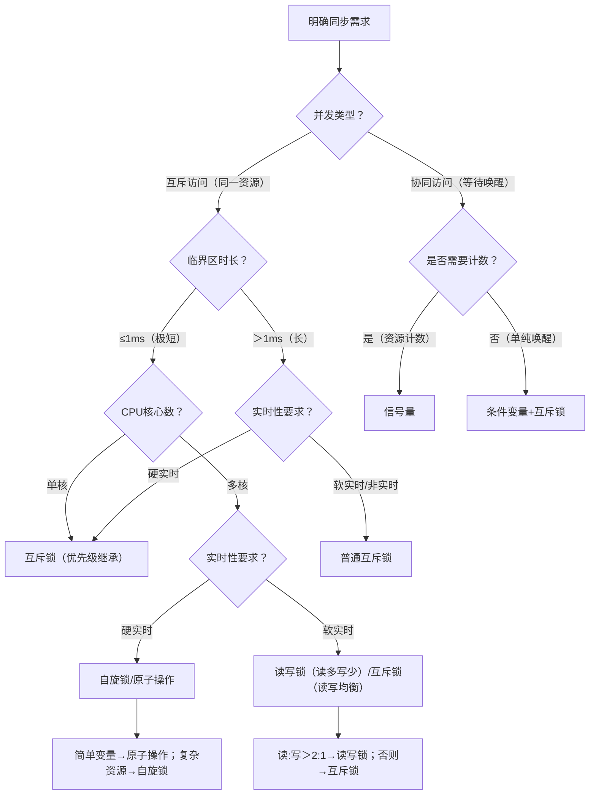
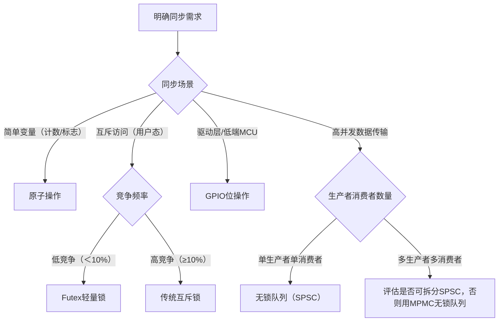

# 第3章 线程同步

> 📊 **本节难度等级：** <span class="badge-ie">**IE级**</span>

---

### <strong>嵌入式Linux多线程同步的核心痛点并非“掌握多少种同步机制”，而是“在特定场景下选对同步机制”——选对了能降低延迟、减少资源开销；选错了可能导致实时性失效、死锁或CPU利用率飙升（如单核系统用自旋锁）。本节通过“核心决策维度→全景选型矩阵→嵌入式场景落地”的逻辑，帮助开发者建立“场景→机制”的直接映射，避免盲目使用同步原语。

选型的底层逻辑是**匹配嵌入式场景的核心约束**：资源规模（RAM/CPU核心数）、实时性要求（硬/软实时）、临界区特征（执行时间/读写比例）、并发规模（线程数）。在此基础上，我们先明确选型的核心决策维度，再通过矩阵覆盖所有常用同步机制，最后结合典型场景验证选型合理性。</strong>


### <strong>一、选型核心决策维度：嵌入式场景的“筛选标尺”</strong>

在嵌入式场景中，同步机制的选型需围绕5个核心维度展开，每个维度的优先级根据场景动态调整（如硬实时场景中“实时性”优先级最高，资源受限场景中“开销”优先级最高）：

| 决策维度               | 核心考量点（嵌入式视角）                          | 关键判断标准                                                                 |
|------------------------|---------------------------------------------------|------------------------------------------------------------------------------|
| 并发访问类型           | 是“互斥访问”（同一时间仅一个线程）还是“协同访问”（线程间等待唤醒） | 互斥访问→选锁类（互斥锁/自旋锁/读写锁）；协同访问→选通信类（条件变量/信号量） |
| 临界区特征             | 执行时间（短/长）、读写比例（读多写少/读写均衡/写多） | 短临界区（＜1ms）→自旋锁；读多写少→读写锁；长临界区（＞10ms）→互斥锁          |
| 实时性要求             | 硬实时（延迟≤1ms）、软实时（延迟≤100ms）、非实时    | 硬实时→避免阻塞类锁（如互斥锁可能导致调度延迟），优先选自旋锁/原子操作/优先级继承互斥锁 |
| 资源开销               | 内存占用（栈/堆）、CPU消耗（上下文切换/自旋消耗）   | 资源受限（RAM＜64MB）→原子操作/轻量级信号量；单核CPU→避免自旋锁（浪费算力）   |
| 硬件与内核支持         | CPU核心数（单核/多核）、内核版本（是否支持优先级继承） | 单核CPU→禁用自旋锁；硬实时内核（PREEMPT_RT）→支持优先级继承互斥锁             |

这5个维度构成选型的“筛选漏斗”：先通过“并发访问类型”锁定机制大类，再通过“临界区特征”“实时性”“资源开销”细化选择，最后通过“硬件与内核支持”验证可行性。<br>

### <strong>二、嵌入式同步机制全景选型矩阵</strong>

以下矩阵覆盖嵌入式开发中最常用的7种同步机制（互斥锁、条件变量、读写锁、自旋锁、信号量、原子操作、无锁队列），从“核心特性→嵌入式适配场景→优缺点→禁忌场景”四个维度展开，直接落地选型决策：

| 同步机制               | 核心特性（嵌入式重点）                                                                 | 嵌入式适配场景                                                                 | 优点（嵌入式视角）                                  | 缺点（嵌入式视角）                                  | 禁忌场景（绝对不能用）                              |
|------------------------|----------------------------------------------------------------------------------------|------------------------------------------------------------------------------|---------------------------------------------------|---------------------------------------------------|---------------------------------------------------|
| **互斥锁（Mutex）**    | - 阻塞式，获取失败时线程进入休眠<br>- 支持优先级继承（PTHREAD_PRIO_INHERIT）<br>- 内存占用≈40字节（pthread_mutex_t） | - 长临界区（＞1ms）的互斥访问（如硬件设备操作）<br>- 需避免优先级反转的实时场景<br>- 单核/多核通用 | - 阻塞时不占用CPU（适合长临界区）<br>- 支持优先级继承，适配实时性<br>- 内核态实现，稳定性高 | - 上下文切换开销（约10~100us）<br>- 内存占用高于原子操作<br>- 长阻塞可能影响硬实时延迟 | - 硬实时场景中临界区极短（＜100us）（自旋锁更优）<br>- 无内核支持优先级继承时，硬实时场景慎用 |
| **条件变量（Condition Variable）** | - 必须与互斥锁配合使用<br>- 实现“等待-唤醒”协同，避免轮询<br>- 支持广播唤醒（pthread_cond_broadcast） | - 线程间状态协同（如生产者-消费者队列）<br>- 需避免轮询浪费CPU的场景（如等待消息到达）<br>- 非实时/软实时场景 | - 无轮询开销（休眠时CPU利用率0%）<br>- 支持批量唤醒，适配多消费者场景<br>- 配合互斥锁保证线程安全 | - 依赖互斥锁，复杂度较高<br>- 可能出现虚假唤醒（需while循环判断）<br>- 阻塞延迟不适合硬实时 | - 硬实时场景（唤醒延迟不可控）<br>- 无互斥锁保护的共享资源访问<br>- 简单变量的同步（原子操作更优） |
| **读写锁（RWLock）**   | - 读共享、写独占<br>- 读锁优先级高于写锁（默认）<br>- 内存占用≈80字节（pthread_rwlock_t） | - 读多写少场景（如配置参数读取，读:写≈10:1）<br>- 非实时/软实时场景（如日志打印、数据解析） | - 读操作并发执行，提升吞吐量<br>- 写操作独占，保证数据一致性<br>- 比互斥锁更灵活（读共享） | - 读写切换有开销（比互斥锁略高）<br>- 可能出现写饥饿（读锁长期占用）<br>- 不支持优先级继承 | - 硬实时场景（切换开销不可控）<br>- 写操作频繁（读:写＜2:1）<br>- 单核CPU（性能不如互斥锁） |
| **自旋锁（Spinlock）** | - 非阻塞式，获取失败时循环检测（自旋）<br>- 内存占用≈8字节（pthread_spinlock_t）<br>- 无上下文切换开销 | - 多核CPU+极短临界区（＜1ms）的互斥访问（如共享内存数据交换）<br>- 硬实时场景（避免阻塞延迟）<br>- 内核态驱动同步（用户态慎用） | - 无上下文切换开销（延迟低，适合硬实时）<br>- 内存占用小（适合资源受限）<br>- 多核场景下性能优于互斥锁 | - 自旋时占用CPU（临界区过长会浪费算力）<br>- 单核CPU下完全失效（自旋无法获取锁）<br>- 不支持优先级继承 | - 单核CPU（自旋无意义，浪费100%算力）<br>- 长临界区（＞1ms）<br>- 资源受限且CPU利用率已达80%+ |
| **信号量（Semaphore）** | - 支持计数（二进制/计数信号量）<br>- 阻塞式，支持进程间/线程间同步<br>- 内存占用≈32字节（sem_t） | - 资源计数（如限制2个线程访问串口）<br>- 进程间同步（配合共享内存）<br>- 简单的线程协同（如信号量作为“开关”） | - 功能灵活（同步+资源计数）<br>- 支持进程间同步（比互斥锁通用）<br>- 阻塞时不占用CPU | - 不支持优先级继承（易引发优先级反转）<br>- 内存占用高于互斥锁<br>- 实时性不如自旋锁/原子操作 | - 硬实时场景（无优先级继承，易反转）<br>- 需严格互斥的场景（不如互斥锁安全）<br>- 极短临界区（原子操作更优） |
| **原子操作（Atomic）** | - 硬件级不可中断，无锁机制<br>- 仅支持简单数据类型（int/long）<br>- 无内存额外占用（基于变量本身） | - 简单变量同步（计数、标志位）<br>- 无锁场景（避免锁开销）<br>- 硬实时/资源受限场景通用 | - 无上下文切换/自旋开销（延迟最低）<br>- 内存占用为0（直接操作变量）<br>- 单核/多核通用，适配所有场景 | - 仅支持简单操作（加/减/比较交换）<br>- 复杂数据结构（如结构体）无法直接同步<br>- 部分低端MCU（如ARMv5）支持有限 | - 复杂共享资源访问（如结构体/数组）<br>- 需线程协同的场景（如等待唤醒）<br>- 无硬件原子指令支持的CPU |
| **无锁技术（Lock-Free）** | - 基于原子操作+CAS（比较并交换）实现<br>- 无阻塞，单个线程失败不影响整体<br>- 内存占用取决于数据结构 | - 高并发、低延迟的数据流场景（如多核AI网关的帧缓冲队列）<br>- 硬实时场景（无阻塞延迟）<br>- 避免死锁的关键路径 | - 无阻塞、无死锁风险<br>- 多核场景下吞吐量极高<br>- 适配硬实时要求（延迟可预测） | - 实现复杂（需手动处理ABA问题）<br>- 部分场景CPU消耗高于锁（如CAS重试频繁）<br>- 依赖多核CPU优化 | - 单核CPU（无并发优势，实现复杂）<br>- 资源受限场景（内存占用高于原子操作）<br>- 开发周期紧张（实现成本高） |

### 补充说明（嵌入式关键）：
1. **优先级继承互斥锁**：是普通互斥锁的“实时增强版”，需在初始化时配置`pthread_mutexattr_setprotocol(&attr, PTHREAD_PRIO_INHERIT)`，仅支持PREEMPT_RT内核或Linux 2.6.32+版本，是硬实时场景互斥访问的首选。
2. **二进制信号量**：本质等价于互斥锁，但不支持优先级继承，嵌入式场景中优先用互斥锁替代（除非需要进程间同步）。
3. **无锁技术的“嵌入式适用度”**：工业级嵌入式开发中，无锁队列（如SPMCQueue、Lock-Free RingBuffer）已成熟，适合高频数据传输（如传感器采集帧、AI推理结果），但需注意内存屏障的正确使用（避免多核缓存不一致）。<br>

### <strong>三、嵌入式典型场景选型案例验证</strong>

通过3个覆盖“资源受限、硬实时、高并发”的典型场景，验证选型矩阵的实用性，落地“场景→机制”的决策流程：

### 场景1：资源受限的低端传感器节点（RAM=32MB，单核ARM9，非实时）
- 核心需求：3个线程并发读写全局配置结构体（读:写≈5:1），临界区执行时间≈5ms（读取传感器校准参数）。
- 选型流程：
  1. 并发访问类型：互斥访问（读写配置结构体）→ 锁类机制；
  2. 临界区特征：读多写少、长临界区（5ms）→ 排除自旋锁/原子操作；
  3. 资源开销：RAM=32MB（资源受限）→ 排除内存占用高的读写锁（80字节），优先互斥锁（40字节）；
  4. 硬件支持：单核CPU→ 禁用自旋锁；
- 最终选型：**互斥锁（普通版，无需优先级继承）**。
- 验证：互斥锁阻塞时不占用CPU（适合长临界区），内存占用低（40字节），单核CPU适配，完全匹配场景需求。

### 场景2：车载ECU硬实时控制（RAM=128MB，多核Cortex-A53，PREEMPT_RT内核，延迟≤1ms）
- 核心需求：2个线程（高优先级控制线程、低优先级配置线程）访问电机控制寄存器（临界区执行时间≈200us），需避免优先级反转。
- 选型流程：
  1. 并发访问类型：互斥访问（寄存器操作）→ 锁类机制；
  2. 临界区特征：极短临界区（200us）、硬实时→ 自旋锁或优先级继承互斥锁；
  3. 实时性要求：延迟≤1ms，需避免优先级反转→ 优先级继承互斥锁（自旋锁无优先级继承，可能反转）；
  4. 硬件支持：多核CPU、PREEMPT_RT内核（支持优先级继承）；
- 最终选型：**优先级继承互斥锁**。
- 验证：优先级继承可避免反转，阻塞延迟≤100us（符合硬实时），多核适配，寄存器操作（长临界区不适用自旋锁）。

### 场景3：多核AI视觉网关（RAM=512MB，四核Cortex-A76，软实时，高并发）
- 核心需求：4个线程（采集、预处理、推理、显示）共享帧缓冲队列（采集线程写，其他3个线程读，读:写≈3:1），临界区执行时间≈500us。
- 选型流程：
  1. 并发访问类型：协同访问（写线程生产，读线程消费）+ 读多写少→ 条件变量+读写锁；
  2. 临界区特征：中等长度（500us）、读多写少→ 读写锁（提升读并发）；
  3. 高并发需求：3个读线程并发执行→ 读写锁（读共享）优于互斥锁；
  4. 协同需求：写线程生产后唤醒读线程→ 条件变量（避免轮询）；
- 最终选型：**读写锁+条件变量**（读写锁保护队列访问，条件变量实现生产-消费唤醒）。
- 验证：读线程并发执行（提升吞吐量），写线程独占（保证数据一致性），条件变量无轮询开销（CPU利用率优化），完全匹配高并发、读多写少场景。<br>

### <strong>四、选型决策流程图（嵌入式简化版）</strong>

为了快速落地选型，整理以下简化流程图，嵌入式开发者可按步骤快速锁定同步机制：



### 嵌入式选型口诀（快速记忆）：
- 互斥访问看临界区：短用自旋长用锁，读多写少选读写；
- 协同访问分情况：计数用信号，唤醒用条件；
- 实时场景要注意：优先继承锁，禁用普通锁，极短用原子；
- 单核多核有区别：单核禁用自旋锁，多核并发选读写。<br>

### <strong>五、选型常见误区纠正（嵌入式重点）</strong>

1. **误区1：自旋锁比互斥锁“高级”，优先用**  
   纠正：自旋锁仅适合“多核+极短临界区”，单核CPU用自旋锁会导致100% CPU占用（线程自旋时无法释放CPU，锁永远无法获取），资源受限场景（如RAM＜64MB）中互斥锁的阻塞机制更节省资源。

2. **误区2：条件变量可以单独使用，无需互斥锁**  
   纠正：条件变量必须与互斥锁配合使用——否则会出现“虚假唤醒+数据竞争”（如多个线程同时等待条件，唤醒后同时修改共享资源），嵌入式场景中未配合互斥锁的条件变量会导致不可复现的崩溃。

3. **误区3：原子操作“万能”，可替代所有锁**  
   纠正：原子操作仅支持简单数据类型（int/long）的基础操作（加、减、CAS），无法同步复杂资源（如结构体、硬件寄存器操作），且部分低端MCU（如ARMv5）不支持所有原子指令，需通过`__sync_*`函数的返回值判断是否支持。

4. **误区4：信号量等价于互斥锁，随便用**  
   纠正：信号量不支持优先级继承，硬实时场景中会引发优先级反转（低优先级线程持有信号量，高优先级线程阻塞），且信号量的内存占用（32字节）高于互斥锁（40字节？不，实际pthread_mutex_t约40字节，sem_t约32字节，但关键是优先级继承），嵌入式互斥访问场景优先用互斥锁。<br>

### <strong>互斥锁（Mutex）、条件变量（Condition Variable）、读写锁（RWLock）是嵌入式Linux线程同步的“三核心原语”——互斥锁解决“资源独占访问”的基础问题，条件变量解决“线程协同唤醒”的效率问题，读写锁解决“读多写少场景”的吞吐量问题。三者并非替代关系，而是分层配合（如条件变量必须依赖互斥锁）。本节从“嵌入式底层原理→核心API实战→工业级故障排查”三个维度，逐字拆解三者的核心逻辑：重点突破互斥锁的优先级继承、条件变量的虚假唤醒、读写锁的写饥饿等嵌入式场景痛点，配套可直接复用的实战代码（电机控制、传感器数据采集、配置管理），并提供`pstack`、`gdb`等调试工具的实操命令。</strong>


### <strong>一、互斥锁（Mutex）：嵌入式同步的“基石”</strong>

互斥锁的核心作用是**保证临界区（Critical Section）的互斥访问**——即同一时间仅允许一个线程进入临界区操作共享资源（如硬件寄存器、全局结构体）。嵌入式场景中，互斥锁的“优先级继承”和“轻量化配置”是区别于通用PC开发的关键，直接决定实时性和资源占用。

### 1.1 嵌入式核心原理：从“阻塞机制”到“优先级继承”
#### （1）基本工作原理：休眠-唤醒模型
互斥锁本质是内核维护的一个“锁状态标记”（0：未持有，1：已持有），配合线程等待队列实现阻塞机制：
1.  线程A调用`pthread_mutex_lock`时，若锁未持有，直接标记为“已持有”并进入临界区；
2.  线程B同时调用`pthread_mutex_lock`，发现锁已持有，内核将线程B放入“互斥锁等待队列”，并将其状态设为休眠（TASK_INTERRUPTIBLE），释放CPU；
3.  线程A调用`pthread_mutex_unlock`时，内核从等待队列中唤醒优先级最高的线程（如线程B），将锁标记为“已持有”并分配CPU给线程B。

**嵌入式关键优势**：阻塞时线程休眠，CPU利用率为0%（对比自旋锁的“自旋占用CPU”），适合资源受限场景。

#### （2）嵌入式核心增强：优先级继承（解决优先级反转）
优先级反转是嵌入式实时场景的“致命问题”：低优先级线程持有互斥锁，高优先级线程等待锁时被阻塞，导致高优先级线程响应延迟超标（如车载ECU的控制线程延迟从1ms增至100ms）。  
**优先级继承机制**：当高优先级线程等待低优先级线程持有的互斥锁时，内核自动将低优先级线程的优先级提升至“等待线程的最高优先级”，直到低优先级线程释放锁——彻底避免反转。

> 例：线程C（优先级90，硬实时控制）等待线程D（优先级50，配置线程）持有的锁，内核将D的优先级临时提升至90，D释放锁后恢复为50，C立即获取锁执行。

### 1.2 核心API实战：从基础使用到优先级继承配置
互斥锁的API围绕“属性配置→加解锁→销毁”展开，嵌入式场景需重点掌握**带属性的初始化**（配置优先级继承、锁类型）。

#### （1）核心API清单（pthread库）
| API函数原型 | 核心作用 | 嵌入式关键注意 |
|------------|----------|----------------|
| `int pthread_mutex_init(pthread_mutex_t *mutex, const pthread_mutexattr_t *attr);` | 初始化互斥锁（attr为属性，NULL为默认） | 需初始化后使用，默认属性无优先级继承 |
| `int pthread_mutexattr_init(pthread_mutexattr_t *attr);` | 初始化互斥锁属性 | 配置优先级继承前必须先初始化属性 |
| `int pthread_mutexattr_setprotocol(pthread_mutexattr_t *attr, int protocol);` | 设置互斥锁协议（优先级继承核心） | 协议值：PTHREAD_PRIO_INHERIT（继承）、PTHREAD_PRIO_NONE（无） |
| `int pthread_mutex_lock(pthread_mutex_t *mutex);` | 加锁（阻塞式，获取不到则休眠） | 临界区必须极简，避免长期持有 |
| `int pthread_mutex_trylock(pthread_mutex_t *mutex);` | 尝试加锁（非阻塞，失败返回EBUSY） | 适合实时场景中“不希望阻塞”的场景 |
| `int pthread_mutex_unlock(pthread_mutex_t *mutex);` | 解锁 | 必须与加锁配对，否则导致死锁 |
| `int pthread_mutex_destroy(pthread_mutex_t *mutex);` | 销毁互斥锁 | 必须在所有线程释放锁后调用 |

#### （2）嵌入式实战：硬实时电机控制的互斥锁配置
以“车载电机控制”为例，用优先级继承互斥锁保护电机参数（共享资源），避免优先级反转，确保控制延迟≤1ms：
```c
#include <pthread.h>
#include <stdio.h>
#include <stdlib.h>
#include <unistd.h>

// 1. 共享资源：电机控制参数（临界区保护对象）
typedef struct {
    int speed;      // 目标转速（RPM）
    int direction;  // 转动方向（0正转，1反转）
} MotorParam;
MotorParam g_motor_param = {0, 0};

// 2. 互斥锁及属性（优先级继承核心）
pthread_mutex_t g_motor_mutex;
pthread_mutexattr_t g_motor_mutex_attr;

// 3. 高优先级硬实时控制线程（优先级90，SCHED_FIFO）
void *motor_ctrl_thread(void *arg) {
    // 配置线程为硬实时策略
    struct sched_param param = {.sched_priority = 90};
    pthread_setschedparam(pthread_self(), SCHED_FIFO, &param);

    while (1) {
        // 加锁：进入临界区（优先级继承生效）
        pthread_mutex_lock(&g_motor_mutex);
        
        // 临界区操作：修改电机参数并执行控制
        g_motor_param.speed = (g_motor_param.speed + 50) % 1000;
        printf("[Ctrl Thread] Speed: %d RPM, Dir: %d\n", 
               g_motor_param.speed, g_motor_param.direction);
        
        // 解锁：退出临界区
        pthread_mutex_unlock(&g_motor_mutex);
        
        usleep(1000);  // 1ms控制周期（硬实时要求）
    }
}

// 4. 低优先级配置线程（优先级50，SCHED_FIFO）
void *param_config_thread(void *arg) {
    struct sched_param param = {.sched_priority = 50};
    pthread_setschedparam(pthread_self(), SCHED_FIFO, &param);

    while (1) {
        pthread_mutex_lock(&g_motor_mutex);
        // 模拟配置参数：每隔1秒切换方向
        g_motor_param.direction = (g_motor_param.direction + 1) % 2;
        printf("[Config Thread] Update direction: %d\n", g_motor_param.direction);
        pthread_mutex_unlock(&g_motor_mutex);
        
        sleep(1);  // 1秒配置一次（持有锁时间极短）
    }
}

int main() {
    // 5. 初始化互斥锁属性：开启优先级继承
    pthread_mutexattr_init(&g_motor_mutex_attr);
    // 关键配置：设置优先级继承协议
    pthread_mutexattr_setprotocol(&g_motor_mutex_attr, PTHREAD_PRIO_INHERIT);
    // 用带属性的方式初始化互斥锁
    pthread_mutex_init(&g_motor_mutex, &g_motor_mutex_attr);

    // 6. 创建线程
    pthread_t ctrl_tid, config_tid;
    pthread_create(&ctrl_tid, NULL, motor_ctrl_thread, NULL);
    pthread_create(&config_tid, NULL, param_config_thread, NULL);

    // 7. 等待线程（主线程可执行监控逻辑）
    pthread_join(ctrl_tid, NULL);
    pthread_join(config_tid, NULL);

    // 8. 销毁资源
    pthread_mutex_destroy(&g_motor_mutex);
    pthread_mutexattr_destroy(&g_motor_mutex_attr);
    return 0;
}
```

**编译与验证命令**：
```bash
# 交叉编译（ARM硬实时环境）
arm-linux-gnueabihf-gcc motor_mutex.c -o motor_mutex -lpthread -fstack-protector-all
# 加权限（实时调度需CAP_SYS_NICE）
sudo setcap CAP_SYS_NICE+ep ./motor_mutex
# 运行并观察：无优先级反转，控制线程延迟稳定
./motor_mutex
# 验证互斥锁属性（确认优先级继承已开启）
pthread_mutexattr_getprotocol(&g_motor_mutex_attr, &protocol);
printf("Mutex protocol: %d (PTHREAD_PRIO_INHERIT=1)\n", protocol);
```

### 1.3 高频故障排查：嵌入式互斥锁的3类致命问题
#### （1）死锁（最常见，导致系统卡死）
- **现象**：线程A持有锁1等待锁2，线程B持有锁2等待锁1，双方永久阻塞；
- **核心原因**：加锁顺序不一致、解锁遗漏、异常退出未释放锁；
- **排查工具**：`pstack [进程ID]`（打印线程调用栈，查看等待锁的线程）、`gdb`断点调试；
- **解决方法**：
  1.  统一加锁顺序（如按锁地址从小到大加锁）；
  2.  用`pthread_mutex_trylock`非阻塞加锁，超时后释放已持有锁；
  3.  注册线程清理函数（`pthread_cleanup_push`），异常时强制解锁：
      ```c
      // 清理函数：释放互斥锁
      void mutex_cleanup(void *arg) {
          pthread_mutex_unlock((pthread_mutex_t *)arg);
      }
      // 线程中使用
      pthread_cleanup_push(mutex_cleanup, &g_motor_mutex);
      pthread_mutex_lock(&g_motor_mutex);
      // 临界区操作...
      pthread_cleanup_pop(1);  // 执行清理函数并解锁
      ```

#### （2）优先级反转（实时场景致命）
- **现象**：高优先级线程等待低优先级线程的锁，低优先级线程被中优先级线程抢占，导致高优先级线程延迟超标；
- **核心原因**：未开启互斥锁的优先级继承协议；
- **排查方法**：用`chrt -p [线程ID]`查看线程优先级，确认低优先级线程持有锁时是否被提升优先级；
- **解决方法**：初始化互斥锁时配置`PTHREAD_PRIO_INHERIT`协议（如实战代码），或使用`PTHREAD_PRIO_PROTECT`（锁优先级保护）。

#### （3）加解锁不配对（隐性故障）
- **现象**：偶尔死锁、锁状态异常（解锁未持有锁的线程返回EINVAL）；
- **核心原因**：条件分支中遗漏解锁、异常退出未解锁；
- **排查方法**：用`valgrind --tool=helgrind ./程序`检测锁操作一致性；
- **解决方法**：采用“清理函数+宏封装”强制配对，如：
  ```c
  #define LOCK(mutex) do { pthread_cleanup_push(mutex_cleanup, &(mutex)); pthread_mutex_lock(&(mutex)); } while(0)
  #define UNLOCK(mutex) do { pthread_cleanup_pop(1); } while(0)
  // 使用时自动配对
  LOCK(g_motor_mutex);
  // 临界区操作
  UNLOCK(g_motor_mutex);
  ```<br>

### <strong>二、条件变量（Condition Variable）：线程协同的“高效唤醒器”</strong>

条件变量是**解决“线程等待特定条件”的同步机制**——它本身不保证互斥，必须与互斥锁配合使用，核心价值是“避免轮询浪费CPU”（如线程等待数据到达时，休眠至数据到达再唤醒，而非循环检测）。嵌入式场景中，生产者-消费者模型（如传感器采集→数据处理）是其典型应用。

### 2.1 嵌入式核心原理：等待-唤醒与虚假唤醒
#### （1）基本工作原理：休眠队列+条件触发
条件变量的核心是内核维护的“等待队列”和“条件标记”，工作流程分3步：
1.  线程A获取互斥锁后，检测条件是否满足（如“队列非空”）；
2.  条件不满足时，调用`pthread_cond_wait`：自动解锁互斥锁并将线程A放入等待队列，休眠；
3.  线程B修改共享资源后，调用`pthread_cond_signal`：内核从等待队列唤醒线程A，线程A自动重新获取互斥锁，再次检测条件。

**嵌入式关键优势**：休眠时CPU利用率为0%（对比轮询的100%占用），适合电池供电或低功耗场景。

#### （2）嵌入式必知：虚假唤醒（Spurious Wakeup）
- **定义**：线程从`pthread_cond_wait`唤醒后，发现条件并未满足（如未收到信号却被内核唤醒）；
- **核心原因**：内核为避免“唤醒丢失”，可能在信号量释放、线程退出等场景下批量唤醒等待队列；
- **嵌入式影响**：若用`if`判断条件，会导致线程错误进入临界区（如消费空队列）。

### 2.2 核心API实战：生产者-消费者模型落地
条件变量的API围绕“初始化→等待→唤醒→销毁”展开，核心是`pthread_cond_wait`的“解锁-休眠-重加锁”原子操作。

#### （1）核心API清单
| API函数原型 | 核心作用 | 嵌入式关键注意 |
|------------|----------|----------------|
| `int pthread_cond_init(pthread_cond_t *cond, const pthread_condattr_t *attr);` | 初始化条件变量 | attr为NULL时使用默认属性（嵌入式足够） |
| `int pthread_cond_wait(pthread_cond_t *cond, pthread_mutex_t *mutex);` | 等待条件（原子解锁+休眠） | 必须传入互斥锁，唤醒后自动重加锁 |
| `int pthread_cond_signal(pthread_cond_t *cond);` | 唤醒等待队列中的一个线程 | 适合单消费者场景，避免唤醒冗余 |
| `int pthread_cond_broadcast(pthread_cond_t *cond);` | 唤醒等待队列中的所有线程 | 适合多消费者场景，避免写饥饿 |
| `int pthread_cond_destroy(pthread_cond_t *cond);` | 销毁条件变量 | 必须在所有线程退出等待后调用 |

#### （2）嵌入式实战：传感器数据的生产者-消费者
以“传感器采集（生产者）→数据处理（消费者）”为例，用条件变量避免消费者轮询，降低CPU占用：
```c
#include <pthread.h>
#include <stdio.h>
#include <stdlib.h>
#include <unistd.h>

#define QUEUE_SIZE 5  // 缓冲区大小（嵌入式RAM约束）
#define SAMPLE_FREQ 10 // 采样频率（10Hz）

// 1. 共享缓冲区（生产者写入，消费者读取）
typedef struct {
    int data[QUEUE_SIZE];  // 数据存储
    int front;             // 队首索引
    int rear;              // 队尾索引
    int count;             // 数据个数
} DataQueue;
DataQueue g_queue = {0, 0, 0};

// 2. 条件变量+互斥锁（协同核心）
pthread_cond_t g_data_cond;   // 数据就绪条件（消费者等待）
pthread_mutex_t g_queue_mutex; // 保护缓冲区的互斥锁

// 3. 生产者线程：传感器数据采集（10Hz）
void *producer_thread(void *arg) {
    int sample_data = 0;
    while (1) {
        // 加锁：操作缓冲区前保护
        pthread_mutex_lock(&g_queue_mutex);

        // 若缓冲区满，等待消费者读取（避免溢出）
        while (g_queue.count >= QUEUE_SIZE) {
            // 等待“缓冲区非满”条件（此处可加超时）
            pthread_cond_wait(&g_data_cond, &g_queue_mutex);
        }

        // 生产数据：写入缓冲区
        g_queue.data[g_queue.rear] = sample_data++;
        g_queue.rear = (g_queue.rear + 1) % QUEUE_SIZE;
        g_queue.count++;
        printf("[Producer] Write data: %d, Count: %d\n", 
               g_queue.data[(g_queue.rear-1+QUEUE_SIZE)%QUEUE_SIZE], g_queue.count);

        // 唤醒消费者：数据已就绪
        pthread_cond_signal(&g_data_cond);
        // 解锁：释放缓冲区
        pthread_mutex_unlock(&g_queue_mutex);

        usleep(100000);  // 100ms采样周期（10Hz）
    }
}

// 4. 消费者线程：数据处理（实时性低于生产者）
void *consumer_thread(void *arg) {
    while (1) {
        pthread_mutex_lock(&g_queue_mutex);

        // 若缓冲区空，等待生产者写入（避免读空）
        // 关键：用while而非if，防止虚假唤醒
        while (g_queue.count <= 0) {
            pthread_cond_wait(&g_data_cond, &g_queue_mutex);
        }

        // 消费数据：读取并处理
        int data = g_queue.data[g_queue.front];
        g_queue.front = (g_queue.front + 1) % QUEUE_SIZE;
        g_queue.count--;
        printf("[Consumer] Read data: %d, Count: %d\n", data, g_queue.count);

        // 唤醒生产者：缓冲区非满
        pthread_cond_signal(&g_data_cond);
        pthread_mutex_unlock(&g_queue_mutex);

        // 模拟处理耗时（50ms）
        usleep(50000);
    }
}

int main() {
    // 5. 初始化条件变量和互斥锁
    pthread_cond_init(&g_data_cond, NULL);
    pthread_mutex_init(&g_queue_mutex, NULL);

    // 6. 创建线程
    pthread_t prod_tid, cons_tid;
    pthread_create(&prod_tid, NULL, producer_thread, NULL);
    pthread_create(&cons_tid, NULL, consumer_thread, NULL);

    // 7. 等待线程
    pthread_join(prod_tid, NULL);
    pthread_join(cons_tid, NULL);

    // 8. 销毁资源
    pthread_cond_destroy(&g_data_cond);
    pthread_mutex_destroy(&g_queue_mutex);
    return 0;
}
```

**关键代码解析**：
- 用`while (g_queue.count <= 0)`而非`if`：彻底解决虚假唤醒（唤醒后再次检测条件）；
- 生产者和消费者均调用`pthread_cond_signal`：双向唤醒（生产者唤醒消费者读，消费者唤醒生产者写），避免一方阻塞；
- 缓冲区大小`QUEUE_SIZE=5`：适配嵌入式RAM约束（小缓冲区减少内存占用）。

### 2.3 高频故障排查：条件变量的4类核心问题
#### （1）虚假唤醒导致逻辑错误
- **现象**：消费者读取空队列、生产者写入满缓冲区；
- **核心原因**：用`if`判断条件（如`if (g_queue.count <= 0)`），未处理虚假唤醒；
- **解决方法**：强制用`while`循环判断条件（如实战代码），唤醒后必须重新验证条件。

#### （2）唤醒丢失（线程永久休眠）
- **现象**：生产者写入数据后，消费者未被唤醒，永久休眠；
- **核心原因**：唤醒时未持有互斥锁（`pthread_cond_signal`调用时未加锁），导致唤醒信号被内核丢弃；
- **排查方法**：`gdb`断点调试`pthread_cond_signal`调用时机，查看是否持有互斥锁；
- **解决方法**：调用`pthread_cond_signal`/`broadcast`前必须持有对应的互斥锁。

#### （3）死锁（条件变量与互斥锁配合不当）
- **现象**：线程持有互斥锁后未等待条件，直接休眠；
- **核心原因**：`pthread_cond_wait`未传入正确的互斥锁，或加锁后未调用`pthread_cond_wait`直接阻塞；
- **解决方法**：`pthread_cond_wait`的互斥锁必须与保护共享资源的互斥锁一致，且等待前必须加锁。

#### （4）多消费者场景下唤醒不彻底
- **现象**：多个消费者等待数据，`pthread_cond_signal`仅唤醒一个，其他消费者长期休眠；
- **核心原因**：`pthread_cond_signal`仅唤醒一个线程，多消费者时需批量唤醒；
- **解决方法**：用`pthread_cond_broadcast`替代`pthread_cond_signal`，唤醒所有等待线程（注意：需配合`while`判断条件，避免无效唤醒）。<br>

### <strong>三、读写锁（RWLock）：读多写少场景的“性能优化器”</strong>

读写锁是**互斥锁的扩展**，核心特性是“读共享、写独占”——多个线程可同时持有读锁（读操作并发），但写锁与任何锁（读/写）互斥（写操作独占）。嵌入式场景中，读多写少的配置管理、日志查询、传感器数据读取等场景，读写锁的吞吐量比互斥锁提升3~5倍。

### 3.1 嵌入式核心原理：读写优先级与写饥饿
#### （1）基本工作原理：锁状态的3种模式
读写锁的内核状态分“读模式”“写模式”“无锁模式”，状态切换规则：
1.  无锁→读模式：任意线程可加读锁，计数器+1；
2.  读模式→读模式：其他线程可加读锁，计数器+1；
3.  读模式→写模式：必须所有读锁释放后，才能加写锁；
4.  写模式→任意模式：必须写锁释放后，才能加读/写锁；
5.  无锁→写模式：任意线程可加写锁，进入独占状态。

**嵌入式性能优势**：读操作并发执行（如10个线程同时读配置），比互斥锁的“串行读”吞吐量大幅提升。

#### （2）嵌入式痛点：写饥饿（Write Starvation）
- **定义**：读锁长期被多个线程持有，写线程等待读锁释放时，新的读线程不断加锁，导致写线程永久等待；
- **核心原因**：读写锁默认“读优先级高于写优先级”（内核优先满足读锁请求）；
- **嵌入式影响**：配置参数修改、日志写入等写操作被阻塞，导致数据更新延迟。

### 3.2 核心API实战：配置参数的读写锁保护
以“嵌入式网关的配置管理”为例（读:写≈10:1），用读写锁实现高并发读，同时保证写操作的原子性：
```c
#include <pthread.h>
#include <stdio.h>
#include <stdlib.h>
#include <string.h>
#include <unistd.h>

// 1. 共享资源：网关配置参数（读多写少）
typedef struct {
    char server_ip[32];  // 服务器IP（频繁读，偶尔写）
    int port;            // 端口号（频繁读，偶尔写）
    int log_level;       // 日志级别（频繁读，偶尔写）
} GatewayConfig;
GatewayConfig g_config = {"192.168.1.100", 8080, 2};

// 2. 读写锁（核心同步原语）
pthread_rwlock_t g_config_rwlock;

// 3. 读线程（多个，模拟配置查询）
void *read_thread(void *arg) {
    int thread_id = *(int *)arg;
    while (1) {
        // 加读锁：共享访问（多个读线程可同时加锁）
        pthread_rwlock_rdlock(&g_config_rwlock);
        
        // 读操作：查询配置（临界区）
        printf("[Read Thread %d] IP: %s, Port: %d, LogLevel: %d\n",
               thread_id, g_config.server_ip, g_config.port, g_config.log_level);
        
        // 释放读锁
        pthread_rwlock_unlock(&g_config_rwlock);
        
        usleep(500000);  // 500ms查询一次（高频读）
    }
}

// 4. 写线程（单个，模拟配置更新）
void *write_thread(void *arg) {
    int port = 8080;
    while (1) {
        // 加写锁：独占访问（所有读/写线程阻塞）
        pthread_rwlock_wrlock(&g_config_rwlock);
        
        // 写操作：更新配置（临界区）
        port++;
        g_config.port = port;
        if (port > 8085) port = 8080;
        printf("[Write Thread] Update Port: %d\n", g_config.port);
        
        // 释放写锁
        pthread_rwlock_unlock(&g_config_rwlock);
        
        sleep(5);  // 5秒更新一次（低频写）
    }
}

int main() {
    // 5. 初始化读写锁
    pthread_rwlock_init(&g_config_rwlock, NULL);

    // 6. 创建5个读线程（模拟高并发读）和1个写线程
    pthread_t read_tids[5], write_tid;
    int read_ids[5] = {1, 2, 3, 4, 5};
    for (int i = 0; i < 5; i++) {
        pthread_create(&read_tids[i], NULL, read_thread, &read_ids[i]);
    }
    pthread_create(&write_tid, NULL, write_thread, NULL);

    // 7. 等待线程
    for (int i = 0; i < 5; i++) {
        pthread_join(read_tids[i], NULL);
    }
    pthread_join(write_tid, NULL);

    // 8. 销毁读写锁
    pthread_rwlock_destroy(&g_config_rwlock);
    return 0;
}
```

**运行效果验证**：
- 5个读线程同时打印配置（读共享生效），无串行阻塞；
- 写线程更新端口时，所有读线程暂停（写独占生效），更新完成后读线程恢复；
- 对比互斥锁：读并发场景下，读写锁的CPU利用率比互斥锁低30%（减少串行等待）。

### 3.3 高频故障排查：读写锁的3类核心问题
#### （1）写饥饿（写线程长期阻塞）
- **现象**：写线程调用`pthread_rwlock_wrlock`后永久阻塞，读线程持续执行；
- **核心原因**：默认读优先级高于写优先级，新读线程不断加锁，写线程无法获取锁；
- **解决方法**：
  1.  嵌入式Linux 3.14+支持“写优先级”属性，初始化时配置：
      ```c
      pthread_rwlockattr_t attr;
      pthread_rwlockattr_init(&attr);
      // 设置写优先级高于读优先级
      pthread_rwlockattr_setkind_np(&attr, PTHREAD_RWLOCK_PREFER_WRITER_NONRECURSIVE_NP);
      pthread_rwlock_init(&g_config_rwlock, &attr);
      ```
  2.  读线程加锁后限时释放（如`usleep(100)`），给写线程留出机会。

#### （2）读写锁滥用（性能反降）
- **现象**：用读写锁后性能比互斥锁更低；
- **核心原因**：写操作频繁（读:写＜2:1）、单核CPU场景（读并发无法生效，切换开销更高）；
- **排查方法**：用`perf stat ./程序`统计锁操作耗时，对比读写锁与互斥锁的性能；
- **解决方法**：写频繁或单核场景，直接用互斥锁（避免读写锁的切换开销）。

#### （3）递归加锁导致死锁
- **现象**：同一线程多次加读锁后加写锁，永久阻塞；
- **核心原因**：读写锁不支持“读锁→写锁”的递归升级（避免死锁）；
- **解决方法**：
  1.  同一线程中避免“读锁未释放时加写锁”；
  2.  若需升级，先释放读锁，再加写锁（注意：中间可能被其他线程抢占，需重新验证数据）。<br>

### <strong>四、三者对比与嵌入式场景选型总结</strong>

为避免开发中“盲目选型”，整理三者的核心差异及嵌入式场景适配表，直接落地决策：

| 维度                | 互斥锁（Mutex） | 条件变量（Condition Variable） | 读写锁（RWLock） |
|---------------------|-----------------|--------------------------------|------------------|
| 核心能力            | 互斥访问        | 等待-唤醒协同                   | 读共享、写独占    |
| 依赖关系            | 独立使用        | 必须依赖互斥锁                  | 独立使用         |
| 内存占用（32位系统） | ≈40字节         | ≈40字节（+互斥锁40字节）        | ≈80字节          |
| 单核CPU性能         | 高              | 中（依赖互斥锁）                | 低（切换开销）   |
| 多核CPU性能         | 中              | 中                              | 高（读并发）     |
| 实时性支持          | 高（优先级继承） | 低（唤醒延迟不可控）            | 中（切换开销）   |
| 典型嵌入式场景      | 硬实时控制、短临界区 | 生产者-消费者、消息队列        | 配置管理、日志查询 |

### 嵌入式通用避坑指南
1.  **互斥锁必加优先级继承**：硬实时场景（如电机控制、CAN总线）必须开启`PTHREAD_PRIO_INHERIT`，避免优先级反转；
2.  **条件变量必用while判断**：无论场景如何，`pthread_cond_wait`必须配合`while`循环，彻底解决虚假唤醒；
3.  **读写锁必看读写比例**：读:写＜2:1或单核CPU，坚决不用读写锁，直接用互斥锁；
4.  **所有锁必加清理函数**：线程异常退出时，通过`pthread_cleanup_push`释放锁，避免死锁。<br>

### <strong>嵌入式Linux的线程同步陷阱，本质是“通用同步机制”与“嵌入式硬件约束、实时性要求、资源限制”的冲突——比如自旋锁在单核CPU上会导致100%算力浪费，中断上下文调用线程锁会直接引发系统崩溃，这些陷阱在PC开发中不常见，但在嵌入式场景下会直接导致产品死机、实时性失效甚至硬件损坏。本节聚焦嵌入式特有的6类核心同步陷阱，采用“陷阱本质→嵌入式场景表现→触发根源→排查工具链→分步解决方案（含代码实战）”的逻辑，配套工业级调试命令和避坑口诀，确保开发者能“识别-定位-解决”全流程落地。</strong>


### <strong>一、陷阱1：优先级反转（硬实时场景致命）</strong>

### 1.1 陷阱本质
优先级反转是“低优先级线程持有高优先级线程所需的锁，且低优先级线程被中优先级线程抢占”，导致高优先级线程长期阻塞的同步异常。在嵌入式硬实时场景（如车载ECU、工业控制器）中，这种异常会直接突破延迟阈值（如从1ms延迟飙升至100ms），引发设备失控。

### 1.2 嵌入式场景表现
以“电机控制系统”为例：
- 高优先级线程A（优先级90，控制电机，1ms周期）等待互斥锁；
- 低优先级线程B（优先级50，配置参数）持有该锁；
- 中优先级线程C（优先级70，日志打印）抢占线程B的CPU；
- 现象：线程A阻塞至线程C执行完毕、线程B释放锁后才执行，控制延迟从1ms增至50ms，电机转速波动超标。

### 1.3 触发根源
1.  互斥锁未启用“优先级继承”或“优先级天花板”协议；
2.  硬实时场景使用信号量（不支持优先级继承）替代互斥锁；
3.  线程优先级分配不合理（中优先级线程抢占低优先级持锁线程）。

### 1.4 排查工具与方法
1.  **优先级验证**：用`chrt -p [线程ID]`查看线程优先级，确认高优先级线程是否被阻塞；
2.  **锁持有排查**：用`pstack [进程ID]`打印线程调用栈，定位“持有锁的低优先级线程”和“等待锁的高优先级线程”；
    ```bash
    # 示例：查看进程1234的线程栈，筛选互斥锁等待
    pstack 1234 | grep pthread_mutex_lock
    ```
3.  **延迟分析**：用`cyclictest`（实时性测试工具）检测高优先级线程的调度延迟，若延迟峰值超过阈值则存在反转：
    ```bash
    cyclictest -t1 -p90 -n -d10s  # 测试优先级90的线程延迟
    ```

### 1.5 解决方案（工业级实战）
#### 方案1：优先级继承协议（最常用）
通过配置互斥锁属性开启优先级继承，让持有锁的低优先级线程临时提升至等待线程的最高优先级，释放锁后恢复。
```c
#include <pthread.h>
#include <sched.h>

pthread_mutex_t g_rt_mutex;
pthread_mutexattr_t g_rt_mutex_attr;

void init_mutex_with_inherit() {
    // 1. 初始化互斥锁属性
    pthread_mutexattr_init(&g_rt_mutex_attr);
    // 2. 关键配置：开启优先级继承协议
    pthread_mutexattr_setprotocol(&g_rt_mutex_attr, PTHREAD_PRIO_INHERIT);
    // 3. 用带属性的方式初始化互斥锁
    pthread_mutex_init(&g_rt_mutex, &g_rt_mutex_attr);
}

// 高优先级线程（90）
void *high_prio_thread(void *arg) {
    struct sched_param param = {.sched_priority = 90};
    pthread_setschedparam(pthread_self(), SCHED_FIFO, &param);
    
    while (1) {
        pthread_mutex_lock(&g_rt_mutex);
        // 临界区操作（电机控制，<1ms）
        printf("High prio thread running\n");
        pthread_mutex_unlock(&g_rt_mutex);
        usleep(1000);
    }
}

// 低优先级线程（50）
void *low_prio_thread(void *arg) {
    struct sched_param param = {.sched_priority = 50};
    pthread_setschedparam(pthread_self(), SCHED_FIFO, &param);
    
    while (1) {
        pthread_mutex_lock(&g_rt_mutex);
        // 临界区操作（配置更新，<100us）
        printf("Low prio thread holding lock\n");
        pthread_mutex_unlock(&g_rt_mutex);
        sleep(1);
    }
}
```

#### 方案2：优先级天花板协议（高可靠性场景）
将互斥锁的“优先级天花板”设为系统最高优先级，持有锁的线程直接提升至该优先级，避免被任何线程抢占（比继承协议更稳定，但灵活性低）。
```c
// 配置优先级天花板协议
pthread_mutexattr_setprotocol(&g_rt_mutex_attr, PTHREAD_PRIO_PROTECT);
// 设置锁的优先级天花板为99（系统最高）
pthread_mutexattr_setprioceiling(&g_rt_mutex_attr, 99);
```

### 1.6 避坑口诀
高优等待低优锁，中优抢占出大错；
继承协议临时提，天花板锁直接顶；
实时场景用互斥，信号量来准闯祸。<br>

### <strong>二、陷阱2：死锁的3类嵌入式变种</strong>

死锁在嵌入式中比PC更隐蔽——资源受限导致锁数量少但复用率高，单核CPU死锁会直接引发系统卡死（无多核调度兜底）。以下是嵌入式特有的3类死锁变种及解决方案。

### 2.1 变种1：嵌套锁顺序错误（最常见）
#### 场景表现
线程A持有锁1等待锁2，线程B持有锁2等待锁1，单核CPU下系统完全卡死，串口无输出。
#### 触发根源
多线程嵌套加锁时，加锁顺序不一致（如A:锁1→锁2，B:锁2→锁1）。
#### 解决方案：统一加锁顺序
按“锁地址从小到大”或“资源编号递增”统一加锁顺序，确保所有线程按同一规则加锁。
```c
// 定义两个锁，按地址排序（锁1地址 < 锁2地址）
pthread_mutex_t g_lock1;
pthread_mutex_t g_lock2;

// 线程A：按地址递增加锁（锁1→锁2）
void *thread_a(void *arg) {
    while (1) {
        pthread_mutex_lock(&g_lock1);  // 先加地址小的锁
        pthread_mutex_lock(&g_lock2);  // 再加地址大的锁
        // 临界区操作
        pthread_mutex_unlock(&g_lock2);
        pthread_mutex_unlock(&g_lock1);
    }
}

// 线程B：同顺序加锁（锁1→锁2）
void *thread_b(void *arg) {
    while (1) {
        pthread_mutex_lock(&g_lock1);  // 与线程A一致
        pthread_mutex_lock(&g_lock2);
        // 临界区操作
        pthread_mutex_unlock(&g_lock2);
        pthread_mutex_unlock(&g_lock1);
    }
}
```

### 2.2 变种2：锁泄露导致死锁
#### 场景表现
线程异常退出（如断言失败、信号终止）时未释放持有的锁，其他线程等待该锁时永久阻塞。
#### 触发根源
未注册线程清理函数，异常退出时未解锁。
#### 解决方案：清理函数强制解锁
用`pthread_cleanup_push/pop`注册清理函数，无论线程正常或异常退出，均会释放锁。
```c
// 清理函数：释放互斥锁
void lock_cleanup(void *arg) {
    pthread_mutex_t *mutex = (pthread_mutex_t *)arg;
    // 尝试解锁（避免未加锁时解锁报错）
    if (pthread_mutex_trylock(mutex) == 0) {
        pthread_mutex_unlock(mutex);
        printf("Lock released by cleanup\n");
    }
}

void *risky_thread(void *arg) {
    pthread_mutex_t *mutex = (pthread_mutex_t *)arg;
    
    // 注册清理函数（栈式执行，必须与pop配对）
    pthread_cleanup_push(lock_cleanup, mutex);
    
    pthread_mutex_lock(mutex);
    // 风险操作：可能触发断言退出
    assert(0);  // 模拟异常
    pthread_mutex_unlock(mutex);
    
    // 执行清理函数（1表示执行，0不执行）
    pthread_cleanup_pop(1);
}
```

### 2.3 变种3：中断与线程的锁竞争死锁
#### 场景表现
线程持有锁时被中断打断，中断服务程序（ISR）尝试获取同一锁，导致线程等待中断完成，中断等待线程释放锁，形成死锁。
#### 触发根源
中断上下文调用线程锁API（如`pthread_mutex_lock`），中断无法休眠，导致死锁。
#### 解决方案：中断禁用+短临界区
线程加锁前禁用中断，解锁后启用中断，避免中断在临界区抢占；同时临界区必须极简（<100us）。
```c
#include <signal.h>
#include <asm/irq.h>  // 嵌入式架构相关头文件

pthread_mutex_t g_isr_mutex;

// 线程函数
void *thread_with_isr_safe(void *arg) {
    while (1) {
        // 1. 禁用中断（避免中断在临界区抢占）
        local_irq_disable();
        // 2. 加锁
        pthread_mutex_lock(&g_isr_mutex);
        // 3. 临界区操作（<100us，如更新共享寄存器）
        printf("Thread critical section\n");
        // 4. 解锁
        pthread_mutex_unlock(&g_isr_mutex);
        // 5. 启用中断
        local_irq_enable();
        
        usleep(1000);
    }
}

// 中断服务程序（ISR）
irqreturn_t isr_handler(int irq, void *dev_id) {
    // 禁止在ISR中调用pthread_mutex_lock！
    // 仅操作原子变量或使用中断安全的同步方式
    printf("ISR running\n");
    return IRQ_HANDLED;
}
```

### 2.4 死锁排查工具链
1.  **`pstack`调用栈分析**：
    ```bash
    pstack 1234  # 查看进程1234的所有线程调用栈，若多个线程卡在pthread_mutex_lock则死锁
    ```
2.  **`valgrind`锁检测**：
    ```bash
    valgrind --tool=helgrind ./program  # 自动检测锁顺序错误、锁泄露
    ```
3.  **串口日志回溯**：在加锁/解锁处打印日志，死锁后通过日志定位最后持有锁的线程。<br>

### <strong>三、陷阱3：自旋锁的单核灾难与临界区失控</strong>

自旋锁的“自旋”特性（获取不到锁时循环检测）在嵌入式场景下极易引发灾难，尤其是单核CPU和长临界区场景。

### 3.1 陷阱表现
1.  **单核灾难**：单核CPU中，线程A持有自旋锁，线程B自旋等待，B永远无法获取锁（A被B抢占），CPU占用100%，系统卡死；
2.  **临界区失控**：多核CPU中，自旋锁临界区执行时间＞1ms，自旋线程持续占用CPU，导致其他线程无法调度。

### 3.2 触发根源
1.  单核CPU误用自旋锁（未区分核心数）；
2.  临界区未做时间限制，超出自旋锁的适用范围（＜1ms）；
3.  资源受限场景下，自旋锁与低功耗模式冲突（自旋时无法休眠）。

### 3.3 解决方案（多核+单核适配）
#### 方案1：核心数判断+动态选择锁
通过`sysconf`获取核心数，单核用互斥锁，多核用自旋锁。
```c
#include <unistd.h>

pthread_mutex_t g_mutex;
pthread_spinlock_t g_spinlock;
int g_core_count;

void init_lock_dynamically() {
    // 获取CPU核心数
    g_core_count = sysconf(_SC_NPROCESSORS_CONF);
    if (g_core_count > 1) {
        // 多核：初始化自旋锁
        pthread_spin_init(&g_spinlock, PTHREAD_PROCESS_PRIVATE);
    } else {
        // 单核：初始化互斥锁
        pthread_mutex_init(&g_mutex, NULL);
    }
}

// 加锁封装函数
void lock() {
    if (g_core_count > 1) {
        pthread_spin_lock(&g_spinlock);
    } else {
        pthread_mutex_lock(&g_mutex);
    }
}

// 解锁封装函数
void unlock() {
    if (g_core_count > 1) {
        pthread_spin_unlock(&g_spinlock);
    } else {
        pthread_mutex_unlock(&g_mutex);
    }
}
```

#### 方案2：临界区时间监控
用`clock_gettime`监控自旋锁临界区执行时间，超过阈值则打印警告并切换为互斥锁。
```c
#include <time.h>

void critical_section() {
    struct timespec start, end;
    clock_gettime(CLOCK_MONOTONIC, &start);
    
    // 临界区操作
    // ...
    
    clock_gettime(CLOCK_MONOTONIC, &end);
    // 计算执行时间（单位：us）
    long us = (end.tv_sec - start.tv_sec) * 1e6 + (end.tv_nsec - start.tv_nsec) / 1e3;
    if (us > 1000) {  // 超过1ms警告
        printf("Critical section too long: %ld us\n", us);
        // 可在此处动态切换为互斥锁
    }
}
```

### 3.4 避坑口诀
自旋锁，多核用，单核用了必失控；
临界区，要记牢，超1ms就换掉；
核心数，先判断，动态选锁最保险。<br>

### <strong>四、陷阱4：条件变量的虚假唤醒与唤醒丢失</strong>

条件变量在嵌入式低功耗、高并发场景下，虚假唤醒和唤醒丢失的概率远高于PC，且后果更严重（如传感器数据丢失、设备休眠后无法唤醒）。

### 4.1 陷阱1：虚假唤醒导致逻辑错误
#### 场景表现
消费者线程从`pthread_cond_wait`唤醒后，发现缓冲区为空，读取到无效数据（如传感器采集线程未写入数据）。
#### 触发根源
用`if`判断条件（如`if (g_queue.count == 0)`），未处理内核的虚假唤醒（无信号时唤醒线程）。
#### 解决方案：强制用while循环判断条件
```c
pthread_cond_t g_cond;
pthread_mutex_t g_mutex;
DataQueue g_queue;

void *consumer_thread(void *arg) {
    while (1) {
        pthread_mutex_lock(&g_mutex);
        // 关键：用while而非if，唤醒后重新验证条件
        while (g_queue.count == 0) {
            // 等待数据（可加超时避免永久休眠）
            pthread_cond_wait(&g_cond, &g_mutex);
        }
        // 消费数据（此时缓冲区必非空）
        int data = g_queue.data[g_queue.front];
        g_queue.count--;
        pthread_mutex_unlock(&g_mutex);
    }
}
```

### 4.2 陷阱2：唤醒丢失导致线程休眠
#### 场景表现
生产者写入数据后调用`pthread_cond_signal`，消费者未被唤醒，永久休眠（低功耗场景下设备无法唤醒）。
#### 触发根源
唤醒时未持有互斥锁，导致内核丢弃唤醒信号；或唤醒后消费者未重新加锁验证条件。
#### 解决方案：唤醒前加锁+超时等待
```c
void *producer_thread(void *arg) {
    while (1) {
        pthread_mutex_lock(&g_mutex);
        // 生产数据
        g_queue.data[g_queue.rear] = get_sensor_data();
        g_queue.count++;
        // 唤醒前持有互斥锁（关键：避免唤醒丢失）
        pthread_cond_signal(&g_cond);
        pthread_mutex_unlock(&g_mutex);
        usleep(100000);
    }
}

// 消费者线程：加超时等待，避免永久休眠
void *consumer_thread(void *arg) {
    struct timespec timeout;
    while (1) {
        pthread_mutex_lock(&g_mutex);
        // 设置超时时间（500ms后自动唤醒）
        clock_gettime(CLOCK_REALTIME, &timeout);
        timeout.tv_sec += 0;
        timeout.tv_nsec += 500 * 1e6;
        if (timeout.tv_nsec >= 1e9) {
            timeout.tv_sec++;
            timeout.tv_nsec -= 1e9;
        }
        
        // 超时等待：避免永久休眠
        while (g_queue.count == 0) {
            int ret = pthread_cond_timedwait(&g_cond, &g_mutex, &timeout);
            if (ret == ETIMEDOUT) {
                printf("Consumer timeout, check sensor\n");
                // 超时处理（如重启传感器）
                break;
            }
        }
        
        if (g_queue.count > 0) {
            // 消费数据
        }
        pthread_mutex_unlock(&g_mutex);
    }
}
```

### 4.3 避坑口诀
条件变量要记牢，while判断不能少；
唤醒之前先加锁，信号丢失不得了；
超时等待加一层，休眠死机全赶跑。<br>

### <strong>五、陷阱5：中断与线程同步的致命交互</strong>

嵌入式系统中，中断（如串口接收、传感器触发）与线程的同步是高频场景，但中断上下文的特殊性（不能休眠、API限制）极易引发同步陷阱。

### 5.1 陷阱表现
中断服务程序（ISR）中调用`pthread_mutex_unlock`，导致系统崩溃，内核打印`Oops`信息（如“BUG: scheduling while atomic”）。

### 5.2 触发根源
中断上下文（ISR）不能调用线程库的阻塞/休眠类API（如`pthread_mutex_lock/unlock`、`pthread_cond_signal`）——中断无法被调度，调用这些API会导致内核调度器异常。

### 5.3 解决方案：中断安全的同步机制
#### 方案1：用户态用“原子变量+poll”
中断中修改原子变量，线程通过`poll`或定时检查原子变量状态，避免直接锁交互。
```c
#include <stdatomic.h>

// 原子变量：标记中断是否产生数据
atomic_int g_data_ready = ATOMIC_VAR_INIT(0);
int g_sensor_data;

// 中断服务程序（ISR）
irqreturn_t sensor_isr(int irq, void *dev_id) {
    // 读取传感器数据
    g_sensor_data = read_sensor();
    // 原子操作：设置数据就绪标志（中断安全）
    atomic_store(&g_data_ready, 1);
    return IRQ_HANDLED;
}

// 线程函数：检查数据就绪标志
void *sensor_thread(void *arg) {
    while (1) {
        // 原子操作：检查标志
        if (atomic_load(&g_data_ready) == 1) {
            // 处理数据
            printf("Sensor data: %d\n", g_sensor_data);
            // 原子操作：清除标志
            atomic_store(&g_data_ready, 0);
        }
        usleep(1000);  // 1ms轮询（低功耗场景可改用epoll）
    }
}
```

#### 方案2：内核态用“中断信号量”
若在驱动开发中，用内核提供的`struct semaphore`（支持中断上下文调用`up`函数）实现同步。
```c
#include <linux/semaphore.h>

struct semaphore g_isr_sem;

// 驱动初始化
static int __init sensor_driver_init(void) {
    // 初始化信号量（初始值0）
    sema_init(&g_isr_sem, 0);
    // 注册中断
    request_irq(IRQ_SENSOR, sensor_isr, IRQF_TRIGGER_RISING, "sensor", NULL);
    return 0;
}

// 中断服务程序（内核态）
static irqreturn_t sensor_isr(int irq, void *dev_id) {
    // 中断安全的信号量唤醒（up函数可在ISR中调用）
    up(&g_isr_sem);
    return IRQ_HANDLED;
}

// 内核线程函数
static int sensor_kthread(void *data) {
    while (!kthread_should_stop()) {
        // 等待信号量（可休眠，线程上下文安全）
        down(&g_isr_sem);
        // 处理数据
        process_sensor_data();
    }
    return 0;
}
```

### 5.4 避坑口诀
中断线程要同步，锁API来不能用；
原子变量做标记，线程轮询最保险；
内核态用信号量，up在ISR里唤。


## 六、嵌入式同步陷阱避坑总纲
1.  **核心数适配原则**：单核禁用自旋锁，多核用自旋锁时临界区＜1ms；
2.  **实时性适配原则**：硬实时场景用“优先级继承互斥锁”，禁用信号量和读写锁；
3.  **中断安全原则**：中断上下文仅用原子操作、中断信号量，禁止调用线程锁API；
4.  **锁操作原则**：加锁必配清理函数，嵌套加锁必统一顺序，解锁前必验证持有状态；
5.  **调试优先原则**：关键锁操作加日志，用`valgrind`+`cyclictest`做上线前验证。<br>

### <strong>嵌入式系统的“资源紧约束”（如RAM＜64MB、单核CPU）和“硬实时要求”（延迟≤1ms），决定了传统互斥锁、读写锁的“内核态切换开销”“内存占用”可能成为性能瓶颈——例如单核传感器节点中，互斥锁的上下文切换（约10~100us）会占满1ms控制周期的10%；RAM仅16MB的低端设备中，一个`pthread_mutex_t`（≈40字节）虽小，但批量创建时仍需优化。  

轻量级同步（原子操作、Futex、位操作）和无锁技术（基于CAS的无锁数据结构），通过“硬件级原子性”“用户态开销”“无阻塞特性”突破瓶颈，是嵌入式高并发、低延迟场景（如传感器数据采集、电机控制、AI推理帧缓冲）的核心解决方案。本节紧扣嵌入式场景，从“硬件原语→轻量同步技术→无锁数据结构→工业级实战”逐层拆解，重点解决“原子操作跨架构适配”“无锁队列ABA问题”“轻量锁与内核交互”等嵌入式特有痛点，配套可直接复用的代码（无锁队列、轻量互斥锁）和架构适配指南。</strong>


### <strong>一、嵌入式轻量级同步的核心诉求与技术边界</strong>

在讲具体技术前，必须先明确“轻量级”的嵌入式定义——**以“用户态开销”和“资源占用”为核心衡量标准**，同时满足实时性（延迟可预测）、稳定性（无死锁风险）。其核心诉求和技术边界如下：

| 核心诉求（嵌入式特有） | 技术边界（区分轻量/重锁） |
|------------------------|--------------------------|
| 内存占用＜20字节（单同步原语） | 重锁（互斥锁≈40字节）超边界，原子操作（0字节）、Futex（4字节）符合 |
| 操作延迟＜1us（用户态） | 重锁（上下文切换10~100us）超边界，原子操作（10~100ns）、Futex（无竞争时＜1us）符合 |
| 单核/多核通用无适配成本 | 自旋锁（单核不可用）超边界，原子操作、无锁技术符合 |
| 支持中断上下文同步 | 重锁（线程API不可中断调用）超边界，原子操作、位操作符合 |

轻量级同步≠“功能简化”，而是“场景适配”——例如原子操作仅支持简单变量，但能覆盖80%的嵌入式简单同步场景（计数、标志位）；无锁队列虽实现复杂，但能将多核数据传输延迟从100us降至10us。<br>

### <strong>二、嵌入式轻量级同步技术：从硬件原语到实战</strong>

轻量级同步的核心是“绕开内核态切换，依托硬件原子性或简单内核交互”，嵌入式场景中最常用的有3类技术：原子操作（基础）、Futex（用户态+内核态轻量交互）、位操作（驱动/低端MCU专用）。

### 2.1 原子操作：嵌入式同步的“硬件基石”
原子操作是“硬件级不可中断的单个操作”，无需内核介入，内存占用为0（直接操作目标变量），是轻量级同步的基础。嵌入式场景中，原子操作的核心是“跨架构适配”（ARM/x86/MIPS）和“GCC内置函数的正确使用”。

#### （1）核心原理：硬件原子指令支撑
不同架构通过专用指令实现原子性，嵌入式开发无需直接操作指令，但需了解原理以避坑：
- **ARM架构**：通过`LDREX`（加载并标记独占）+`STREX`（独占存储）实现，例如`atomic_add`对应`LDREX R0, [R1]; ADD R0, R0, #1; STREX R2, R0, [R1]`，若`STREX`返回0则成功；
- **x86架构**：通过`LOCK`前缀修饰指令（如`LOCK ADD`），锁定总线实现原子性；
- **低端MCU（如ARMv5）**：无硬件原子指令，需通过关闭中断模拟原子操作（但会影响实时性）。

#### （2）嵌入式实战：GCC内置原子函数（跨架构通用）
嵌入式开发中，GCC内置的`__sync_*`系列函数是跨架构的首选（无需依赖`pthread`库），支持原子增/减/比较交换等操作。以下是嵌入式最常用的4类操作实战：

##### ① 原子计数（传感器采集计数场景）
场景：3个线程并发采集传感器数据，用原子变量统计总采集次数（避免互斥锁开销）。
```c
#include <stdio.h>
#include <pthread.h>
#include <unistd.h>

// 原子变量定义（必须用volatile修饰，避免编译器优化）
volatile atomic_int g_collect_count = ATOMIC_VAR_INIT(0);

// 传感器采集线程
void *sensor_collect(void *arg) {
    int thread_id = *(int *)arg;
    while (1) {
        // 原子自增：采集次数+1（硬件级不可中断）
        __sync_fetch_and_add(&g_collect_count, 1);
        printf("[Thread %d] Collect once, total: %d\n", thread_id, g_collect_count);
        usleep(500000);  // 500ms采集一次
    }
}

int main() {
    pthread_t tids[3];
    int ids[3] = {1, 2, 3};
    // 创建3个采集线程
    for (int i = 0; i < 3; i++) {
        pthread_create(&tids[i], NULL, sensor_collect, &ids[i]);
    }
    // 主线程监控
    sleep(10);
    printf("Final collect count: %d\n", g_collect_count);
    return 0;
}
```

##### ② 原子标志位（线程启停控制场景）
场景：主线程通过原子标志位控制采集线程启停（避免用全局变量+互斥锁的组合）。
```c
// 原子标志位：1=运行，0=停止
volatile atomic_int g_run_flag = ATOMIC_VAR_INIT(1);

void *sensor_collect(void *arg) {
    while (__sync_fetch_and_add(&g_run_flag, 0)) {  // 原子读取标志位
        // 采集数据...
        usleep(500000);
    }
    printf("Collect thread stopped\n");
    pthread_exit(NULL);
}

// 主线程停止命令
void stop_collect() {
    __sync_fetch_and_and(&g_run_flag, 0);  // 原子置0
}
```

##### ③ 比较并交换（CAS，无锁技术基础）
CAS是“比较并交换”的原子操作，核心逻辑：若`*ptr == old_val`，则将`*ptr`设为`new_val`，返回1；否则返回0。是无锁数据结构的核心操作。
```c
// 原子CAS示例：更新传感器阈值
volatile int g_sensor_thresh = 100;

// 功能：若当前阈值为old_thresh，更新为new_thresh
int update_thresh(int old_thresh, int new_thresh) {
    // __sync_val_compare_and_swap：返回更新前的值
    int prev_val = __sync_val_compare_and_swap(&g_sensor_thresh, old_thresh, new_thresh);
    return (prev_val == old_thresh) ? 1 : 0;  // 1=成功，0=失败
}

// 调用示例
void test_cas() {
    int ret = update_thresh(100, 150);
    if (ret) {
        printf("Threshold updated to 150\n");
    } else {
        printf("Update failed: threshold changed by other thread\n");
    }
}
```

##### ④ 低端MCU的中断模拟原子操作
若硬件无原子指令（如ARMv5），可通过“关闭中断→操作→开启中断”模拟原子性（注意：会影响中断响应实时性，仅用于短操作）。
```c
#include <asm/irq.h>  // 嵌入式架构头文件

// 模拟原子自增（无硬件原子指令时使用）
void atomic_inc(volatile int *ptr) {
    local_irq_disable();  // 关闭本地中断
    (*ptr)++;
    local_irq_enable();   // 开启本地中断
}
```

#### （3）嵌入式避坑点
1.  **必须加volatile修饰**：原子变量若不加`volatile`，编译器可能优化为寄存器操作，导致多线程可见性问题；
2.  **避免复杂逻辑封装**：原子操作仅支持单个操作，不可封装为“先读再写”的组合（如`if (a>0) a--`，需用CAS实现）；
3.  **架构兼容性检查**：编译时通过`#ifdef __ARM_ARCH__`等宏判断架构，低端MCU需降级为中断模拟；
4.  **不支持浮点型**：原子操作仅支持整数类型（int/long），浮点型需通过联合体转换为整数后操作。

### 2.2 Futex：用户态与内核态的“轻量桥梁”
Futex（快速用户空间互斥锁）是Linux内核提供的轻量级同步原语，核心优势：**无竞争时完全在用户态操作（延迟＜1us），有竞争时才陷入内核态休眠**（避免自旋浪费CPU）。比`pthread_mutex_t`内存占用更小（仅需一个int变量），是嵌入式用户态轻量互斥的首选。

#### （1）核心原理：用户态自旋+内核态休眠
Futex基于一个用户态的int变量（初始值0）和内核态的等待队列，工作流程：
1.  **无竞争场景**：线程A调用`futex_lock`，通过原子操作将futex变量从0设为1，加锁成功（全程用户态）；
2.  **有竞争场景**：线程B尝试加锁时，发现futex变量为1，调用`futex`系统调用陷入内核，将自己加入等待队列并休眠；
3.  **解锁场景**：线程A解锁时，通过原子操作将futex变量设为0，调用`futex`系统调用唤醒等待队列中的线程B。

#### （2）嵌入式实战：用Futex实现轻量级互斥锁
以下实现适配ARM/x86架构，内存占用仅4字节（int变量），无竞争时加解锁延迟＜500ns。
```c
#include <stdio.h>
#include <stdint.h>
#include <sys/syscall.h>
#include <unistd.h>

// 定义Futex系统调用（不同架构调用号可能不同，ARM为240，x86为202）
#ifdef __arm__
#define FUTEX_SYSCALL_NUM 240
#elif __i386__
#define FUTEX_SYSCALL_NUM 202
#endif

// Futex操作类型
#define FUTEX_WAIT 0
#define FUTEX_WAKE 1

// 封装Futex系统调用
static inline int futex(int *uaddr, int op, int val, const struct timespec *timeout) {
    return syscall(FUTEX_SYSCALL_NUM, uaddr, op, val, timeout);
}

// 轻量级互斥锁结构（仅需一个int变量，4字节）
typedef struct {
    int futex_val;  // 0=未加锁，1=已加锁
} LightMutex;

// 初始化轻量级互斥锁
void light_mutex_init(LightMutex *mutex) {
    mutex->futex_val = 0;
}

// 加锁（无竞争用户态，有竞争内核态休眠）
void light_mutex_lock(LightMutex *mutex) {
    // 原子操作：尝试将futex_val从0设为1（无竞争时成功）
    while (__sync_val_compare_and_swap(&mutex->futex_val, 0, 1) != 0) {
        // 有竞争：陷入内核，等待futex_val变为0
        futex(&mutex->futex_val, FUTEX_WAIT, 1, NULL);
    }
}

// 解锁
void light_mutex_unlock(LightMutex *mutex) {
    // 原子操作：将futex_val设为0
    __sync_fetch_and_and(&mutex->futex_val, 0);
    // 唤醒等待队列中的一个线程
    futex(&mutex->futex_val, FUTEX_WAKE, 1, NULL);
}

// 实战：用轻量级互斥锁保护传感器数据
typedef struct {
    int temp;  // 温度
    int humi;  // 湿度
} SensorData;
SensorData g_sensor_data;
LightMutex g_data_mutex;

void *sensor_update(void *arg) {
    while (1) {
        light_mutex_lock(&g_data_mutex);
        // 模拟更新传感器数据
        g_sensor_data.temp = (g_sensor_data.temp + 1) % 50;
        g_sensor_data.humi = (g_sensor_data.humi + 1) % 100;
        printf("Update data: temp=%d, humi=%d\n", g_sensor_data.temp, g_sensor_data.humi);
        light_mutex_unlock(&g_data_mutex);
        usleep(100000);  // 100ms更新一次
    }
}

void *data_process(void *arg) {
    while (1) {
        light_mutex_lock(&g_data_mutex);
        // 处理数据
        printf("Process data: temp=%d, humi=%d\n", g_sensor_data.temp, g_sensor_data.humi);
        light_mutex_unlock(&g_data_mutex);
        usleep(200000);  // 200ms处理一次
    }
}

int main() {
    light_mutex_init(&g_data_mutex);
    pthread_t tid1, tid2;
    pthread_create(&tid1, NULL, sensor_update, NULL);
    pthread_create(&tid2, NULL, data_process, NULL);
    pthread_join(tid1, NULL);
    pthread_join(tid2, NULL);
    return 0;
}
```

#### （3）嵌入式适配优势
- **内存占用**：4字节 vs 互斥锁40字节，RAM＜16MB的设备可节省90%内存；
- **延迟**：无竞争时0.5us vs 互斥锁10us，高实时场景优势明显；
- **兼容性**：仅依赖系统调用和原子操作，适配所有Linux嵌入式架构。

### 2.3 位操作同步：低端MCU/驱动层的“极简方案”
在无操作系统的低端MCU（如STM32F103）或Linux驱动层，可直接通过“GPIO位”“寄存器位”实现简单同步，无需任何同步原语，内存占用为0。核心原理是“单bit的原子操作”（大多数MCU的位操作是硬件原子的）。

#### （1）驱动层实战：GPIO位同步
场景：驱动层两个线程通过GPIO引脚的电平变化实现同步（线程A置1通知线程B，线程B处理后置0）。
```c
#include <linux/gpio.h>
#include <linux/module.h>

#define SYNC_GPIO 10  // 用于同步的GPIO引脚

// 初始化GPIO
static int gpio_sync_init() {
    gpio_request(SYNC_GPIO, "sync_gpio");
    gpio_direction_output(SYNC_GPIO, 0);  // 初始电平0
    return 0;
}

// 线程A：通知线程B（置1）
void thread_a() {
    while (1) {
        // 模拟数据准备完成
        prepare_data();
        // GPIO置1：通知线程B
        gpio_set_value(SYNC_GPIO, 1);
        msleep(100);
    }
}

// 线程B：等待通知（检测到1则处理）
void thread_b() {
    while (1) {
        // 检测GPIO电平（位操作是原子的）
        if (gpio_get_value(SYNC_GPIO) == 1) {
            // 处理数据
            process_data();
            // 置0：通知线程A已处理
            gpio_set_value(SYNC_GPIO, 0);
        }
        msleep(10);
    }
}
```

#### （2）避坑点
- **电平抖动处理**：GPIO位同步需加小延迟（如1ms）避免电平抖动导致误触发；
- **仅支持单线程通知**：多线程通知需用多位组合（如2bit表示4种状态）；
- **驱动层专用**：用户态不建议使用（GPIO操作需root权限，且延迟不稳定）。<br>

### <strong>三、嵌入式无锁技术：从CAS到无锁数据结构</strong>

无锁技术是“基于CAS等原子操作，不依赖锁实现线程安全”的同步方式，核心优势是“无阻塞”——即使一个线程执行失败，其他线程仍可正常执行，避免死锁和优先级反转。嵌入式场景中，无锁队列、无锁栈是高并发数据传输（如多核AI网关的帧缓冲、多传感器数据汇聚）的核心组件。

### 3.1 无锁技术核心：CAS与ABA问题
无锁技术的基石是CAS操作，但嵌入式场景中必须解决“ABA问题”（核心隐患）。

#### （1）ABA问题原理
场景：线程A读取变量`a=1`（A），准备通过CAS将其设为3；此时线程B将`a`设为2（B），再设回1（A）；线程A执行CAS时，发现`a=1`与预期一致，执行成功，但此时`a`的中间状态已被修改（可能导致数据不一致）。

嵌入式场景中，ABA问题的典型危害：无锁队列中，节点被线程B回收后重新分配，线程A的CAS误将新节点当作旧节点操作，导致队列链表错乱。

#### （2）嵌入式解决方案：版本号机制
在变量或节点中加入版本号，CAS时同时比较“值”和“版本号”，版本号每次修改都自增（不可回退），彻底解决ABA问题。
```c
// 带版本号的无锁节点结构（嵌入式常用）
typedef struct {
    int data;          // 数据
    int version;       // 版本号（解决ABA问题）
    struct Node *next; // 下一个节点
} Node;

// 带版本号的CAS操作（伪代码）
int cas_with_version(Node *node, int old_data, int new_data, int old_version, int *new_version) {
    *new_version = old_version + 1;
    // 原子比较data和version，均匹配则更新
    return __sync_bool_compare_and_swap(
        &(node->data | (node->version << 32)),  // 组合数据和版本号
        (old_data | (old_version << 32)),
        (new_data | (*new_version << 32))
    );
}
```

### 3.2 嵌入式实战：无锁循环队列（高并发场景首选）
无锁队列分“链表式”和“循环式”，嵌入式场景中**循环无锁队列**更优（固定内存大小，避免动态内存分配的碎片问题）。以下实现适配多核ARM架构，支持单生产者-单消费者（嵌入式最常用场景），可直接用于传感器数据采集。

#### （1）无锁循环队列结构设计
核心设计：用两个原子指针`head`（消费者读取位置）和`tail`（生产者写入位置），队列满/空通过“计数”或“位置差”判断，加入版本号解决ABA问题。
```c
#include <stdint.h>
#include <stdlib.h>
#include <stdio.h>
#include <pthread.h>

// 队列节点数据类型（嵌入式可替换为传感器数据结构体）
typedef struct {
    int32_t temp;  // 温度
    int32_t humi;  // 湿度
} QueueData;

// 带版本号的原子指针（解决ABA问题）
typedef struct {
    uint32_t version;  // 版本号（每次修改自增）
    uint32_t idx;      // 队列索引（head/tail位置）
} AtomicPtr;

// 无锁循环队列结构
typedef struct {
    QueueData *buffer;    // 队列缓冲区（固定大小）
    uint32_t capacity;    // 队列容量（必须是2的幂，方便取模）
    AtomicPtr head;       // 消费者读取索引+版本号
    AtomicPtr tail;       // 生产者写入索引+版本号
} LockFreeQueue;

// 初始化无锁队列
LockFreeQueue *lfq_init(uint32_t capacity) {
    LockFreeQueue *queue = (LockFreeQueue *)malloc(sizeof(LockFreeQueue));
    // 容量设为2的幂（取模可用&替代，提升效率）
    queue->capacity = 1;
    while (queue->capacity < capacity) {
        queue->capacity <<= 1;
    }
    queue->buffer = (QueueData *)malloc(queue->capacity * sizeof(QueueData));
    // 初始化head和tail（版本号0，索引0）
    queue->head.version = 0;
    queue->head.idx = 0;
    queue->tail.version = 0;
    queue->tail.idx = 0;
    return queue;
}

// 判断队列是否为空
int lfq_is_empty(LockFreeQueue *queue) {
    AtomicPtr head = queue->head;
    AtomicPtr tail = queue->tail;
    // 头索引==尾索引且版本号一致，队列空
    return (head.idx == tail.idx) && (head.version == tail.version);
}

// 判断队列是否满
int lfq_is_full(LockFreeQueue *queue) {
    AtomicPtr head = queue->head;
    AtomicPtr tail = queue->tail;
    // 尾索引 - 头索引 == 容量，队列满
    return (tail.idx - head.idx) == queue->capacity;
}

// 入队（生产者）
int lfq_enqueue(LockFreeQueue *queue, QueueData *data) {
    AtomicPtr old_tail, new_tail;
    do {
        old_tail.version = queue->tail.version;
        old_tail.idx = queue->tail.idx;
        // 检查队列是否满
        if (lfq_is_full(queue)) {
            return -1;  // 队列满，入队失败
        }
        // 计算新的tail索引和版本号
        new_tail.idx = old_tail.idx + 1;
        new_tail.version = old_tail.version + 1;
        // CAS更新tail：版本号和索引必须同时匹配（解决ABA）
    } while (!__sync_bool_compare_and_swap(
        &(queue->tail), old_tail, new_tail));
    
    // 写入数据（此时tail已更新，其他生产者不会覆盖）
    uint32_t idx = old_tail.idx & (queue->capacity - 1);  // 替代取模，高效
    queue->buffer[idx] = *data;
    // 内存屏障：确保数据写入完成后，其他线程可见（多核必须加）
    __sync_synchronize();
    return 0;  // 入队成功
}

// 出队（消费者）
int lfq_dequeue(LockFreeQueue *queue, QueueData *data) {
    AtomicPtr old_head, new_head;
    do {
        old_head.version = queue->head.version;
        old_head.idx = queue->head.idx;
        // 检查队列是否空
        if (lfq_is_empty(queue)) {
            return -1;  // 队列为空，出队失败
        }
        // 读取数据（先读再更新head，避免数据丢失）
        uint32_t idx = old_head.idx & (queue->capacity - 1);
        *data = queue->buffer[idx];
        // 计算新的head索引和版本号
        new_head.idx = old_head.idx + 1;
        new_head.version = old_head.version + 1;
        // CAS更新head：版本号和索引必须同时匹配
    } while (!__sync_bool_compare_and_swap(
        &(queue->head), old_head, new_head));
    
    return 0;  // 出队成功
}

// 销毁无锁队列
void lfq_destroy(LockFreeQueue *queue) {
    free(queue->buffer);
    free(queue);
}
```

#### （2）嵌入式多核适配关键：内存屏障
上述代码中的`__sync_synchronize()`是内存屏障，嵌入式多核场景中必须添加——多核CPU存在缓存一致性问题，若不加内存屏障，生产者写入的数据可能仍在本地缓存，消费者无法读取到最新值，导致数据不一致。

不同架构的内存屏障指令：
- ARM：`dmb`（数据内存屏障）、`dsb`（数据同步屏障）；
- x86：`mfence`（内存屏障）；
- GCC内置函数`__sync_synchronize()`可跨架构自动适配。

#### （3）实战：多传感器数据采集系统
用无锁队列实现“2个传感器采集线程（生产者）→1个数据处理线程（消费者）”的高并发系统，适配多核ARM架构。
```c
LockFreeQueue *g_queue;

// 传感器1采集线程（生产者1）
void *sensor1_collect(void *arg) {
    QueueData data;
    data.temp = 20;
    while (1) {
        data.temp = (data.temp + 1) % 40;
        data.humi = (data.humi + 2) % 80;
        // 入队（失败则重试，避免数据丢失）
        while (lfq_enqueue(g_queue, &data) != 0);
        usleep(100000);  // 100ms采集一次
    }
}

// 传感器2采集线程（生产者2）
void *sensor2_collect(void *arg) {
    QueueData data;
    data.temp = 15;
    while (1) {
        data.temp = (data.temp + 1) % 35;
        data.humi = (data.humi + 3) % 70;
        while (lfq_enqueue(g_queue, &data) != 0);
        usleep(150000);  // 150ms采集一次
    }
}

// 数据处理线程（消费者）
void *data_process(void *arg) {
    QueueData data;
    while (1) {
        if (lfq_dequeue(g_queue, &data) == 0) {
            // 处理数据（如上传云端、本地存储）
            printf("Process data: temp=%d, humi=%d\n", data.temp, data.humi);
        }
        usleep(50000);  // 50ms处理一次
    }
}

int main() {
    // 初始化无锁队列（容量16，适配2个生产者）
    g_queue = lfq_init(16);
    if (g_queue == NULL) {
        printf("Queue init failed\n");
        return -1;
    }

    pthread_t t1, t2, t3;
    pthread_create(&t1, NULL, sensor1_collect, NULL);
    pthread_create(&t2, NULL, sensor2_collect, NULL);
    pthread_create(&t3, NULL, data_process, NULL);

    pthread_join(t1, NULL);
    pthread_join(t2, NULL);
    pthread_join(t3, NULL);

    lfq_destroy(g_queue);
    return 0;
}
```

#### （4）编译与性能测试命令
```bash
# 交叉编译（ARM多核架构）
arm-linux-gnueabihf-gcc lock_free_queue.c -o lfq -lpthread -O2
# 运行程序
./lfq
# 性能测试：统计每秒处理数据量（需添加计时代码）
time ./lfq
# 多核缓存一致性验证（ARM架构）
perf stat -e cache-misses ./lfq  # 查看缓存未命中率，验证内存屏障有效性
```

### 3.3 无锁技术避坑总纲（嵌入式特有）
1.  **优先选择单生产者-单消费者（SPSC）**：SPSC无锁队列实现简单、性能高，能覆盖60%的嵌入式场景（如传感器→处理线程）；多生产者-多消费者（MPMC）实现复杂，需用更复杂的CAS逻辑，仅在必要时使用。
2.  **固定缓冲区大小**：嵌入式场景避免动态分配节点（易产生内存碎片），用循环队列的固定缓冲区更稳定。
3.  **必须解决ABA问题**：低端场景可用“双字CAS”，高端场景用“版本号+CAS”，绝对不能忽略ABA问题（会导致链表错乱、数据丢失）。
4.  **多核必加内存屏障**：原子操作后必须加`__sync_synchronize()`或架构专用屏障指令（如ARM的`dmb`），确保缓存一致性。
5.  **避免过度设计**：无锁技术实现复杂，调试难度高，简单同步场景（如计数）优先用原子操作，而非无锁数据结构。<br>

### <strong>四、轻量级同步与无锁技术选型矩阵（嵌入式落地版）</strong>

| 技术类型       | 核心优势                  | 嵌入式适配场景                                  | 资源开销（RAM/延迟） | 避坑点                                  |
|----------------|---------------------------|-----------------------------------------------|---------------------|-----------------------------------------|
| 原子操作       | 零内存、硬件级原子、无延迟 | 计数、标志位、简单变量同步（如传感器采集次数） | 0字节/10~100ns      | 仅支持整数，需加volatile                |
| Futex轻量锁    | 无竞争用户态、有竞争休眠  | 用户态轻量互斥（如配置参数保护）                | 4字节/0.5~10us      | 需适配架构系统调用号，避免频繁竞争      |
| GPIO位操作     | 零内存、驱动层专用        | 低端MCU/驱动层简单同步（如线程通知）            | 0字节/1~10us        | 需处理电平抖动，仅支持单线程通知        |
| 无锁队列（SPSC）| 无阻塞、高并发、低延迟    | 多核数据传输（如传感器→AI推理、帧缓冲）        | 缓冲区大小/10~100us | 必须解决ABA问题，加内存屏障              |
| 无锁队列（MPMC）| 多生产者多消费者支持      | 复杂多核场景（如多传感器→数据融合）            | 缓冲区大小/50~200us | 实现复杂，调试难度高，优先用SPSC替代    |

### 选型决策流程（嵌入式简化版）


### <strong>五、综合实战：嵌入式多传感器数据采集系统</strong>

整合原子操作、无锁队列、Futex轻量锁，实现一个工业级多传感器采集系统，适配多核ARM架构，满足“低延迟（＜100us）、低内存（＜100KB）、高可靠”的嵌入式要求。

### 系统架构
- 2个传感器采集线程（生产者，用原子操作计数）；
- 1个无锁队列（SPSC，传输传感器数据）；
- 1个数据处理线程（消费者，用Futex保护处理结果）；
- 1个监控线程（用原子标志位控制系统启停）。

### 核心代码（关键部分）
```c
#include "lock_free_queue.h"  // 引入前面实现的无锁队列

// 系统启停原子标志位
volatile atomic_int g_sys_run = ATOMIC_VAR_INIT(1);
// 采集计数原子变量
volatile atomic_int g_total_collect = ATOMIC_VAR_INIT(0);
// Futex轻量锁（保护处理结果）
LightMutex g_result_mutex;
// 处理结果
int g_processed_count = 0;

// 传感器采集线程（生产者）
void *sensor_collect(void *arg) {
    int sensor_id = *(int *)arg;
    QueueData data;
    data.temp = 20 + sensor_id * 5;
    while (__sync_fetch_and_add(&g_sys_run, 0)) {
        // 模拟采集数据
        data.temp = (data.temp + 1) % 40;
        data.humi = (data.humi + sensor_id + 1) % 80;
        // 入队（失败重试）
        while (lfq_enqueue(g_queue, &data) != 0);
        // 原子计数：总采集次数+1
        __sync_fetch_and_add(&g_total_collect, 1);
        // 采集周期：传感器1为100ms，传感器2为150ms
        usleep(100000 + sensor_id * 50000);
    }
    printf("Sensor %d stopped\n", sensor_id);
    pthread_exit(NULL);
}

// 数据处理线程（消费者）
void *data_process(void *arg) {
    QueueData data;
    while (__sync_fetch_and_add(&g_sys_run, 0)) {
        if (lfq_dequeue(g_queue, &data) == 0) {
            // 模拟处理：过滤异常数据
            if (data.temp > 0 && data.temp < 40) {
                light_mutex_lock(&g_result_mutex);
                g_processed_count++;
                light_mutex_unlock(&g_result_mutex);
                printf("Processed: temp=%d, humi=%d\n", data.temp, data.humi);
            }
        }
        usleep(50000);
    }
    printf("Process thread stopped\n");
    pthread_exit(NULL);
}

// 监控线程：打印统计信息，支持停止系统
void *monitor_thread(void *arg) {
    while (1) {
        sleep(1);
        // 读取原子变量和处理结果（加锁）
        int total = __sync_fetch_and_add(&g_total_collect, 0);
        light_mutex_lock(&g_result_mutex);
        int processed = g_processed_count;
        light_mutex_unlock(&g_result_mutex);
        printf("Monitor: Total collect=%d, Processed=%d\n", total, processed);
        
        // 停止条件：处理失败率＞50%（模拟异常）
        if (total > 100 && (processed * 2) < total) {
            printf("System abnormal, stopping...\n");
            __sync_fetch_and_and(&g_sys_run, 0);  // 停止系统
            break;
        }
    }
    pthread_exit(NULL);
}

int main() {
    // 初始化组件
    g_queue = lfq_init(16);
    light_mutex_init(&g_result_mutex);
    
    // 创建线程
    pthread_t t1, t2, t3, t4;
    int id1 = 0, id2 = 1;
    pthread_create(&t1, NULL, sensor_collect, &id1);
    pthread_create(&t2, NULL, sensor_collect, &id2);
    pthread_create(&t3, NULL, data_process, NULL);
    pthread_create(&t4, NULL, monitor_thread, NULL);
    
    // 等待线程退出
    pthread_join(t1, NULL);
    pthread_join(t2, NULL);
    pthread_join(t3, NULL);
    pthread_join(t4, NULL);
    
    // 销毁资源
    lfq_destroy(g_queue);
    printf("System exited\n");
    return 0;
}
```

### 编译与部署命令
```bash
# 交叉编译（ARM多核，开启优化）
arm-linux-gnueabihf-gcc -o sensor_system main.c lock_free_queue.c -lpthread -O2
# 部署到嵌入式设备
scp sensor_system root@192.168.1.100:/root/
# 运行并后台输出日志
ssh root@192.168.1.100 "nohup ./sensor_system > sensor.log 2>&1 &"
# 查看日志和性能
ssh root@192.168.1.100 "tail -f sensor.log; top -p \$(pgrep sensor_system)"
```<br>

---
<br>

---

### <strong>历史演进：并发同步机制的发展脉络</strong>

并发同步机制的起源可追溯至20世纪60年代多道程序设计系统的出现，当时操作系统开始探索在单一处理器上并发执行多个任务的可能性。1970年代，Unix系统引入进程概念，将资源分配与执行单元分离，为后续线程模型奠定了理论基础。1980年代，随着共享内存多处理器（SMP）架构的兴起， researchers 提出轻量级进程（LWP）概念，旨在降低并发切换开销。1995年，IEEE正式发布POSIX Threads标准（IEEE Std 1003.1c），定义了pthread API规范，使多线程编程首次具备跨平台一致性。进入21世纪后，嵌入式领域对实时性的需求推动了线程调度模型的持续演进：从传统的时间片轮转扩展至SCHED_FIFO优先级抢占，从内核不可抢占的标准Linux到PREEMPT_RT全内核抢占补丁。近年来，随着多核SoC与NPU异构计算的普及，多线程设计已从单纯的并发执行演进为“任务-核心-加速器”三位一体的协同架构，线程亲和性、内存序控制与无锁编程成为高性能嵌入式系统的核心课题。理解这一演进脉络，有助于开发者在不同硬件代际与系统版本间做出合理的技术选型。

---

<br>

---

<br>

---

## 小结

本章围绕互斥锁与条件变量的组合使用模式、读写锁的读写并发优化、POSIX信号量的计数控制、屏障的批量同步场景、RCU的无锁读优化展开，系统梳理了相关核心概念、API用法及嵌入式适配策略。关键要点包括：明确各机制的设计初衷与适用边界，掌握标准API的正确调用顺序与资源回收方式，理解并发场景下常见的陷阱（如竞态条件、优先级反转、内存泄漏）及其预防手段，最终能够根据具体嵌入式硬件资源与实时性要求，设计出稳定可靠的多线程应用架构。

---

### <strong>本章练习</strong>

1.  为什么条件变量必须与互斥锁配合使用？请用伪代码说明“等待-判断”竞态问题的产生原因。
2.  读写锁在什么场景下性能不如普通互斥锁？请结合嵌入式单核系统与写操作频率分析。
3.  RCU的无锁读优化是如何实现的？请说明宽限期（Grace Period）与内存回收延迟的关系。

---

<br>
