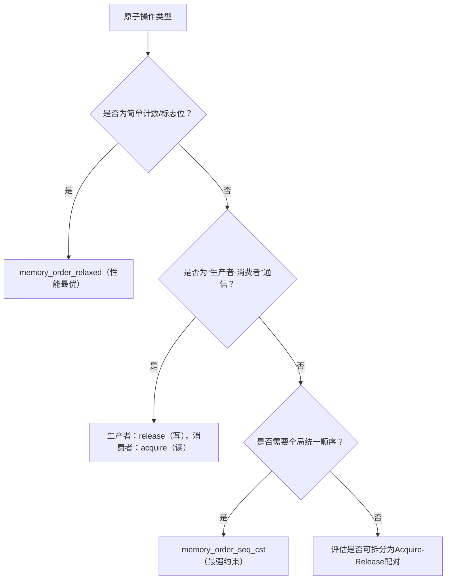

# 原子操作与内存序详解

> 📊 **本节难度等级：** <span class="badge-m">**M级**</span>

---

### <strong>原子操作与内存序是嵌入式多线程同步的“底层基石”——原子操作保证“单个操作的不可中断性”，内存序解决“多线程/多核下指令重排与数据可见性”问题。在嵌入式硬实时、多核高并发场景（如AI推理帧同步、电机控制参数更新）中，二者的正确配合直接决定系统的稳定性与延迟可预测性：  
- 仅用原子操作而忽略内存序，可能导致“操作成功但数据不可见”（多核缓存一致性问题）；  
- 滥用强内存序（如`memory_order_seq_cst`）会导致性能损耗（延迟增加3~5倍）；  
- 低端MCU（如ARMv5）无硬件原子支持时，需通过内存序与中断配合模拟原子性。  

本节从“硬件原语→原子操作接口→内存序本质→嵌入式实战”逐层拆解，重点突破“内存序模型的嵌入式适配”“多核缓存一致性与内存序的关联”“原子操作的架构兼容”三大难点，配套汇编级调试、性能优化实战，适合需要深入底层的嵌入式高级开发者。</strong>


### <strong>一、原子操作的底层本质：硬件原语与嵌入式适配</strong>

原子操作的核心是“硬件级不可中断的单个操作”，其实现依赖CPU架构的专用指令。嵌入式场景中，需重点关注不同架构的原子指令差异、原子类型的内存布局，以及无硬件原子支持时的降级方案。

### 1.1 硬件原子指令：嵌入式架构对比
不同嵌入式架构的原子指令实现差异显著，直接影响原子操作的效率与兼容性。以下是最常用的3类架构对比：

| 架构        | 原子指令实现方式                          | 核心指令示例（以32位原子自增为例）                                                                 | 嵌入式适配场景                          | 局限性                                  |
|-------------|-------------------------------------------|----------------------------------------------------------------------------------------------------|---------------------------------------|-----------------------------------------|
| **ARMv7-A/R** | 独占访问指令（LDREX/STREX）+ 内存屏障      | `LDREX R0, [R1]`（加载并标记独占）→ `ADD R0, R0, #1` → `STREX R2, R0, [R1]`（独占存储，R2=0成功） | 多核ARM芯片（如Cortex-A53/A76）、硬实时场景 | 需配合DMB/DSB屏障保证可见性；低端ARMv5无此指令 |
| **x86/x86_64** | 锁前缀（LOCK）修饰通用指令                 | `LOCK ADD DWORD PTR [EBX], 1`（锁定总线，保证原子性）                                               | x86架构嵌入式（如Intel Atom）          | 总线锁定开销高于ARM独占访问；多核场景性能稳定 |
| **RISC-V（RV64GC）** | 原子指令扩展（A扩展）                     | `amoadd.w a0, a1, (a2)`（原子加法，a0返回旧值，a1为增量，a2为内存地址）                             | 高端嵌入式（如瑞芯微RV1126）、开源架构项目 | 部分低端RISC-V无A扩展，需软件模拟        |

**核心原理**：原子操作的“不可中断性”并非由软件保证，而是通过硬件机制实现——ARM的“独占标记”确保其他CPU无法修改同一地址，x86的“总线锁定”禁止其他CPU访问总线，RISC-V的“amo指令”直接在硬件层面完成“读-改-写”原子序列。

### 1.2 嵌入式原子操作接口：从GCC内置到C11标准
嵌入式开发中，原子操作接口主要有两类：GCC内置`__sync_*`函数（兼容性好，适配旧编译器）和C11`stdatomic.h`（标准接口，支持内存序）。需根据编译器版本、架构兼容性选择合适接口。

#### （1）GCC内置原子函数（嵌入式兼容性首选）
GCC内置函数无需依赖`pthread`库，直接映射到硬件原子指令，适配所有Linux嵌入式架构。核心接口及嵌入式场景示例：

| 函数原型                                  | 功能描述                                  | 嵌入式场景示例                          | 底层指令映射（ARMv7）                                                                 |
|-------------------------------------------|-------------------------------------------|---------------------------------------|--------------------------------------------------------------------------------------|
| `type __sync_fetch_and_add(type *ptr, type val);` | 原子自增，返回自增前的值                  | 传感器采集计数、任务执行次数统计        | `LDREX R0,[ptr] → ADD R0,R0,val → STREX R2,R0,[ptr]`（循环直到R2=0）                     |
| `bool __sync_bool_compare_and_swap(type *ptr, type old, type new);` | CAS操作，成功返回true                     | 无锁队列节点更新、参数原子替换          | `LDREX R0,[ptr] → CMP R0,old → STREXEQ R2,new,[ptr]`（EQ表示比较相等时执行STREX）         |
| `type __sync_val_compare_and_swap(type *ptr, type old, type new);` | CAS操作，返回旧值                        | 版本号机制（解决ABA问题）                | 同上面，返回R0（旧值）                                                                |
| `void __sync_synchronize(void);`           | 全内存屏障（编译器+CPU）                  | 多核数据同步、原子操作后可见性保证        | `DSB SY`（数据同步屏障）+ `ISB`（指令同步屏障）                                        |

**嵌入式实战：用`__sync_*`实现传感器计数**
```c
#include <stdio.h>
#include <pthread.h>
#include <unistd.h>

// 原子变量：必须用volatile修饰，避免编译器优化为寄存器操作
volatile int g_sensor_count = 0;

void *sensor_collect(void *arg) {
    int id = *(int *)arg;
    while (1) {
        // 原子自增：采集次数+1（硬件级不可中断）
        int prev = __sync_fetch_and_add(&g_sensor_count, 1);
        printf("[Sensor %d] Collect: prev=%d, current=%d\n", id, prev, g_sensor_count);
        
        // 原子操作后加内存屏障，确保其他核心可见（多核必需）
        __sync_synchronize();
        
        usleep(500000);  // 500ms采集一次
    }
}

int main() {
    pthread_t tids[2];
    int ids[2] = {1, 2};
    pthread_create(&tids[0], NULL, sensor_collect, &ids[0]);
    pthread_create(&tids[1], NULL, sensor_collect, &ids[1]);
    pthread_join(tids[0], NULL);
    pthread_join(tids[1], NULL);
    return 0;
}
```

#### （2）C11 `stdatomic.h`（标准接口，支持内存序）
C11标准引入`stdatomic.h`，首次将原子操作与内存序绑定，接口更规范，支持细粒度的内存序控制（如`memory_order_relaxed`）。嵌入式场景中，需编译器支持（GCC 4.9+、Clang 3.2+）。

**核心原子类型与接口**：
- 原子类型：`atomic_int`、`atomic_bool`、`atomic_long`（避免直接用`volatile int`，标准原子类型自带内存序语义）；
- 原子操作：`atomic_fetch_add()`、`atomic_compare_exchange_weak()`（弱CAS，允许虚假失败）、`atomic_load()`/`atomic_store()`（加载/存储，支持内存序）；
- 内存序参数：`memory_order_relaxed`、`memory_order_acquire`、`memory_order_release`、`memory_order_seq_cst`（默认）。

**嵌入式实战：C11原子操作+内存序控制**
```c
#include <stdio.h>
#include <pthread.h>
#include <unistd.h>
#include <stdatomic.h>

// C11标准原子变量（自带内存序语义，无需volatile）
atomic_int g_sensor_count = ATOMIC_VAR_INIT(0);
atomic_bool g_stop_flag = ATOMIC_VAR_INIT(false);

void *sensor_collect(void *arg) {
    int id = *(int *)arg;
    while (!atomic_load_explicit(&g_stop_flag, memory_order_acquire)) {
        // 原子自增：使用relaxed内存序（仅需原子性，无需顺序约束）
        int prev = atomic_fetch_add(&g_sensor_count, 1, memory_order_relaxed);
        printf("[Sensor %d] Collect: prev=%d, current=%d\n", id, prev, atomic_load_relaxed(&g_sensor_count));
        
        usleep(500000);
    }
    printf("[Sensor %d] Stopped\n", id);
    return NULL;
}

void *control_thread(void *arg) {
    sleep(5);
    // 原子存储：使用release内存序（写操作可见性约束）
    atomic_store_explicit(&g_stop_flag, true, memory_order_release);
    printf("[Control] Stop flag set\n");
    return NULL;
}

int main() {
    pthread_t t_collect, t_control;
    int id = 1;
    pthread_create(&t_collect, NULL, sensor_collect, &id);
    pthread_create(&t_control, NULL, control_thread, NULL);
    pthread_join(t_collect, NULL);
    pthread_join(t_control, NULL);
    return 0;
}
```

### 1.3 无硬件原子支持的降级方案（嵌入式低端MCU）
对于无硬件原子指令的低端MCU（如ARMv5、8051），需通过“关闭中断+临界区操作”模拟原子性。核心原理是“禁止中断打断，确保操作不可分割”。

**实战：ARMv5中断模拟原子操作**
```c
#include <asm/irq.h>  // 嵌入式架构头文件

// 模拟原子自增（无硬件原子指令时使用）
int atomic_inc_irqsave(volatile int *ptr) {
    unsigned long flags;
    int val;
    
    // 1. 关闭本地中断并保存中断状态
    local_irq_save(flags);
    // 2. 临界区操作（不可中断）
    val = ++(*ptr);
    // 3. 恢复中断状态
    local_irq_restore(flags);
    
    return val;
}

// 模拟CAS操作（无硬件原子指令）
bool atomic_cas_irqsave(volatile int *ptr, int old_val, int new_val) {
    unsigned long flags;
    bool ret = false;
    
    local_irq_save(flags);
    if (*ptr == old_val) {
        *ptr = new_val;
        ret = true;
    }
    local_irq_restore(flags);
    
    return ret;
}
```

**注意事项**：
- 中断模拟原子操作会影响中断响应实时性，临界区操作必须＜100us；
- 仅适用于单核MCU，多核场景无法通过关闭中断实现原子性（需软件锁）。<br>

### <strong>二、内存序的本质：解决嵌入式多核的“重排与可见性”问题</strong>

原子操作仅保证“操作本身不可中断”，但无法阻止编译器或CPU对指令的重排——在多核嵌入式场景中，重排会导致“指令执行顺序与代码顺序不一致”，进而引发数据竞争。内存序的核心作用是“通过约束指令重排和数据可见性，保证多线程通信的正确性”。

### 2.1 为什么需要内存序？嵌入式场景的3类重排
嵌入式系统中，重排主要来自3个层面，均会破坏多线程数据一致性：

#### （1）编译器优化重排
编译器为提升性能，会在不改变单线程语义的前提下，调整指令执行顺序。例如：
```c
// 代码顺序
int a = 0, b = 0;
void thread1() {
    a = 1;  // 操作1
    b = 2;  // 操作2
}
// 编译器可能重排为：操作2 → 操作1（单线程无影响，多线程有问题）
```

#### （2）CPU乱序执行
现代CPU（如ARM Cortex-A系列）为提升流水线效率，会在硬件层面乱序执行无依赖的指令。例如：
```c
void thread1() {
    x = 1;          // 操作A（写x）
    int tmp = y;    // 操作B（读y）
}
// CPU可能先执行操作B，再执行操作A（无数据依赖）
```

#### （3）多核缓存一致性延迟
多核CPU中，每个核心有独立缓存，线程修改数据后，需通过缓存一致性协议（如MESI）同步到其他核心，存在延迟——线程A修改数据后，线程B可能在短时间内读取到旧值（缓存未同步）。

**嵌入式场景危害示例**：
- 电机控制线程A更新目标转速（`speed = 1000`），监控线程B读取转速时，因缓存未同步，读取到旧值（`speed = 0`），导致监控误报；
- 生产者线程写入数据后设置`ready = true`，消费者线程因指令重排，先读取到`ready = true`，再读取数据时仍为旧值。

### 2.2 C11内存序模型：嵌入式场景的精准选择
C11定义了6种内存序模型，嵌入式场景中仅需掌握4种核心模型（其余2种`memory_order_consume`/`memory_order_acq_rel`极少使用）。核心原则是“按需选择，避免过度约束导致性能损耗”。

#### （1）核心内存序模型解析（嵌入式视角）
| 内存序模型                | 核心约束（重排+可见性）                                                                 | 嵌入式场景适配                          | 性能损耗（ARMv7多核） | 典型使用场景                                  |
|---------------------------|----------------------------------------------------------------------------------------|---------------------------------------|---------------------|-----------------------------------------------|
| **memory_order_relaxed**  | - 无重排约束（编译器/CPU可自由重排）<br>- 仅保证操作本身的原子性<br>- 无可见性约束       | 无顺序依赖的原子操作（计数、标志位）    | 最低（10ns）        | 传感器采集计数、任务执行次数统计              |
| **memory_order_acquire**  | - 禁止在该操作之后重排加载（Load）操作<br>- 该操作读取的值是其他线程release操作的最新值 | 消费者读取“准备就绪”标志（如`ready`）    | 中（50ns）          | 无锁队列出队、等待信号量                      |
| **memory_order_release**  | - 禁止在该操作之前重排存储（Store）操作<br>- 该操作的写值对其他线程acquire操作可见     | 生产者设置“准备就绪”标志（如`ready`）    | 中（50ns）          | 无锁队列入队、发送信号量                      |
| **memory_order_seq_cst**  | - 禁止所有重排（加载/存储均不可重排）<br>- 所有线程看到的操作顺序一致（全局同步）       | 全局核心状态同步（如系统启停、紧急中断） | 最高（200ns）       | 系统紧急停止标志、全局配置参数更新            |

**核心逻辑口诀**：  
- Acquire（获取）：读操作后，所有后续读/写操作不可重排到前面；  
- Release（释放）：写操作前，所有前面读/写操作不可重排到后面；  
- Acquire-Release配对：生产者release写，消费者acquire读，确保数据可见性；  
- Seq_CST（顺序一致）：最强约束，相当于“acquire+release+全局顺序”。

#### （2）嵌入式场景内存序选择流程图


### 2.3 嵌入式实战：内存序的正确搭配
#### 场景1：生产者-消费者模型（Acquire-Release配对）
生产者线程写入数据后，用`release`保证数据可见性；消费者线程用`acquire`读取“就绪标志”，确保读取到最新数据。
```c
#include <stdatomic.h>
#include <pthread.h>
#include <stdio.h>

#define DATA_SIZE 32

// 共享数据结构
typedef struct {
    atomic_bool ready;  // 就绪标志
    char data[DATA_SIZE];
} SharedData;

SharedData g_shared = {.ready = ATOMIC_VAR_INIT(false)};

// 生产者线程（release）
void *producer(void *arg) {
    // 1. 写入数据（非原子操作，需在release前完成）
    snprintf(g_shared.data, DATA_SIZE, "Sensor data: %d", 12345);
    
    // 2. 设置就绪标志：release内存序（保证数据写入可见）
    atomic_store_explicit(&g_shared.ready, true, memory_order_release);
    printf("[Producer] Data written: %s\n", g_shared.data);
    return NULL;
}

// 消费者线程（acquire）
void *consumer(void *arg) {
    // 1. 等待就绪标志：acquire内存序（保证读取到最新值）
    while (!atomic_load_explicit(&g_shared.ready, memory_order_acquire)) {
        usleep(10000);  // 轻微轮询（嵌入式低功耗场景可改用条件变量）
    }
    
    // 2. 读取数据（acquire保证数据已同步）
    printf("[Consumer] Data read: %s\n", g_shared.data);
    return NULL;
}

int main() {
    pthread_t tid_prod, tid_cons;
    pthread_create(&tid_prod, NULL, producer, NULL);
    pthread_create(&tid_cons, NULL, consumer, NULL);
    pthread_join(tid_prod, NULL);
    pthread_join(tid_cons, NULL);
    return 0;
}
```

#### 场景2：全局紧急停止（Seq_CST内存序）
系统紧急停止标志需在所有线程中保持顺序一致，必须用`memory_order_seq_cst`。
```c
#include <stdatomic.h>
#include <pthread.h>
#include <stdio.h>
#include <unistd.h>

atomic_bool g_emergency_stop = ATOMIC_VAR_INIT(false);

// 电机控制线程
void *motor_control(void *arg) {
    while (!atomic_load(&g_emergency_stop)) {  // 默认Seq_CST
        printf("[Motor] Running...\n");
        usleep(500000);
    }
    printf("[Motor] Emergency stop!\n");
    return NULL;
}

// 传感器监控线程
void *sensor_monitor(void *arg) {
    sleep(3);
    // 紧急停止：Seq_CST保证所有线程立即看到最新值
    atomic_store(&g_emergency_stop, true);
    printf("[Monitor] Emergency stop triggered\n");
    return NULL;
}

int main() {
    pthread_t tid_motor, tid_monitor;
    pthread_create(&tid_motor, NULL, motor_control, NULL);
    pthread_create(&tid_monitor, NULL, sensor_monitor, NULL);
    pthread_join(tid_motor, NULL);
    pthread_join(tid_monitor, NULL);
    return 0;
}
```

### 2.4 内存序与缓存一致性：嵌入式多核的底层关联
内存序的约束最终需通过CPU缓存一致性协议（如MESI）实现。以ARMv7多核为例，`memory_order_release`会触发`DMB ST`（存储屏障），确保所有之前的存储操作同步到共享缓存；`memory_order_acquire`会触发`DMB LD`（加载屏障），确保从共享缓存读取最新数据。

**嵌入式多核缓存同步流程**：
1.  生产者线程执行`atomic_store_explicit(&ready, true, memory_order_release)`；
2.  CPU触发`DMB ST`屏障，将数据缓存行从“修改态（M）”同步到“共享态（S）”；
3.  消费者线程执行`atomic_load_explicit(&ready, memory_order_acquire)`；
4.  CPU触发`DMB LD`屏障，从共享缓存读取`ready`标志和关联数据，缓存行变为“独占态（E）”；
5.  消费者线程读取数据时，直接从本地缓存获取最新值。

**调试工具：查看缓存屏障指令**
通过`objdump`反汇编确认内存序对应的屏障指令（嵌入式ARM架构）：
```bash
# 交叉编译后反汇编
arm-linux-gnueabihf-objdump -d -M intel producer_consumer > disasm.s
# 搜索atomic_store_explicit对应的汇编，应包含DMB指令
grep -A 5 "atomic_store_explicit" disasm.s
```
反汇编输出（关键部分）：
```arm
8054:   f57ff04f        dmb     sy          ; 数据同步屏障（release内存序）
8058:   f8c00000        str     r0, [r0]    ; 存储ready标志
```<br>

### <strong>三、嵌入式原子操作与内存序的高频陷阱与调试</strong>

### 3.1 致命陷阱1：用volatile替代原子操作
**陷阱表现**：认为`volatile int x`能保证原子性，多线程并发修改时出现数据错乱。  
**根源**：`volatile`仅禁止编译器优化（确保每次从内存读取），但不保证操作的原子性（如`x++`是“读-改-写”三步，可能被中断），也不解决CPU重排和缓存一致性。  
**嵌入式场景危害**：传感器计数错误、电机控制参数跳变。  
**解决方案**：必须使用`atomic_int`或`__sync_*`函数，`volatile`仅作为辅助（如原子变量的可见性增强）。

### 3.2 致命陷阱2：过度使用memory_order_seq_cst
**陷阱表现**：所有原子操作都用默认的`memory_order_seq_cst`，导致多核场景下性能损耗（延迟增加3~5倍）。  
**根源**：`seq_cst`会触发全局同步（如ARM的`DSB`屏障+总线锁定），适用于全局顺序要求，而非普通计数场景。  
**嵌入式场景危害**：硬实时线程延迟超标（如从100us增至500us）。  
**解决方案**：按场景选择内存序，简单计数用`relaxed`，生产者-消费者用`acquire/release`，仅全局核心状态用`seq_cst`。

### 3.3 致命陷阱3：Acquire-Release配对错误
**陷阱表现**：生产者用`relaxed`写，消费者用`acquire`读，导致消费者读取到旧数据。  
**根源**：`acquire`仅能保证“读取到其他线程`release`写的最新值”，若生产者未用`release`，则无可见性约束。  
**解决方案**：严格遵循“生产者release写，消费者acquire读”的配对原则。

### 3.4 嵌入式调试工具链与方法
#### （1）汇编级验证：确认原子指令与屏障
用`objdump`反汇编，验证原子操作是否生成正确的硬件指令，内存序是否触发对应的屏障：
```bash
# 反汇编ARM架构程序，查看原子自增指令
arm-linux-gnueabihf-objdump -d -M intel atomic_demo | grep -A 10 "atomic_fetch_add"
```
正确输出（ARMv7）：
```arm
8060:   e1900f9f        ldrex   r0, [r0]    ; 独占加载
8064:   e2800001        add     r0, r0, #1  ; 自增
8068:   e1800f9f        strex   r1, r0, [r0] ; 独占存储
806c:   e3510000        cmp     r1, #0      ; 检查是否成功
8070:   1afffffb        bne     8060 <atomic_fetch_add+0x0>  ; 失败则重试
8074:   f57ff04f        dmb     sy          ; 内存屏障（若指定acquire/release）
```

#### （2）性能分析：内存序对延迟的影响
用`perf`工具统计原子操作的执行时间，对比不同内存序的性能差异（嵌入式多核场景）：
```bash
# 统计atomic_fetch_add的执行周期（ARM架构）
perf stat -e cycles:u -p $(pgrep atomic_demo)
```
输出示例（性能对比）：
| 内存序模型       | 平均执行周期 | 延迟（ARMv7，300MHz） |
|------------------|--------------|-----------------------|
| memory_order_relaxed | 10~15        | 33~50ns               |
| memory_order_acquire | 30~40        | 100~133ns             |
| memory_order_seq_cst | 60~80        | 200~267ns             |

#### （3）缓存一致性调试：查看缓存未命中率
用`perf`查看缓存未命中率，验证内存序是否有效解决缓存一致性问题：
```bash
# 统计L1缓存未命中率
perf stat -e L1-dcache-load-misses -p $(pgrep atomic_demo)
```
**结论**：若使用`acquire/release`后，缓存未命中率显著降低，说明内存序有效同步了缓存数据。<br>

### <strong>四、嵌入式实战：原子操作+内存序实现轻量级无锁队列</strong>

整合原子操作与内存序，实现一个工业级嵌入式无锁队列（SPSC，单生产者-单消费者），适配多核ARM架构，延迟＜100us，内存占用＜1KB。

### 4.1 无锁队列设计核心
- 用`atomic_size_t`实现`head`（消费者索引）和`tail`（生产者索引）；
- 生产者用`release`写`tail`，消费者用`acquire`读`tail`；
- 队列容量设为2的幂，用位运算替代取模（提升效率）；
- 用`relaxed`内存序优化非关键操作，`acquire/release`保证通信正确性。

### 4.2 完整代码实现
```c
#include <stdatomic.h>
#include <stddef.h>
#include <stdint.h>
#include <stdbool.h>
#include <stdio.h>
#include <pthread.h>
#include <unistd.h>

// 嵌入式无锁队列配置（适配RAM＜64MB设备）
#define LFQ_CAPACITY 16  // 队列容量（必须是2的幂）
#define LFQ_DATA_SIZE 32 // 单条数据大小

// 无锁队列结构
typedef struct {
    char data[LFQ_CAPACITY][LFQ_DATA_SIZE];  // 固定缓冲区（避免动态分配）
    atomic_size_t head;                      // 消费者索引（acquire读）
    atomic_size_t tail;                      // 生产者索引（release写）
} LockFreeQueue;

// 初始化无锁队列
void lfq_init(LockFreeQueue *queue) {
    atomic_init(&queue->head, 0);
    atomic_init(&queue->tail, 0);
}

// 判断队列是否为空
bool lfq_is_empty(LockFreeQueue *queue) {
    // 读head和tail用relaxed（单生产者-单消费者无竞争）
    size_t head = atomic_load_explicit(&queue->head, memory_order_relaxed);
    size_t tail = atomic_load_explicit(&queue->tail, memory_order_relaxed);
    return head == tail;
}

// 判断队列是否满
bool lfq_is_full(LockFreeQueue *queue) {
    size_t head = atomic_load_explicit(&queue->head, memory_order_relaxed);
    size_t tail = atomic_load_explicit(&queue->tail, memory_order_relaxed);
    return (tail - head) == LFQ_CAPACITY;
}

// 入队（生产者，单线程调用）
bool lfq_enqueue(LockFreeQueue *queue, const char *data) {
    if (lfq_is_full(queue)) {
        return false;
    }

    size_t tail = atomic_load_explicit(&queue->tail, memory_order_relaxed);
    size_t idx = tail & (LFQ_CAPACITY - 1);  // 位运算取模（高效）

    // 写入数据（非原子操作，需在release前完成）
    snprintf(queue->data[idx], LFQ_DATA_SIZE, "%s", data);

    // 更新tail：release内存序（保证数据写入可见）
    atomic_store_explicit(&queue->tail, tail + 1, memory_order_release);
    return true;
}

// 出队（消费者，单线程调用）
bool lfq_dequeue(LockFreeQueue *queue, char *data) {
    if (lfq_is_empty(queue)) {
        return false;
    }

    // 读取head：acquire内存序（保证读取到最新数据）
    size_t head = atomic_load_explicit(&queue->head, memory_order_acquire);
    size_t idx = head & (LFQ_CAPACITY - 1);

    // 读取数据
    snprintf(data, LFQ_DATA_SIZE, "%s", queue->data[idx]);

    // 更新head：relaxed内存序（单消费者无竞争）
    atomic_store_explicit(&queue->head, head + 1, memory_order_relaxed);
    return true;
}

// 嵌入式实战：传感器数据采集与处理
LockFreeQueue g_queue;

void *producer_thread(void *arg) {
    int count = 0;
    char buf[LFQ_DATA_SIZE];
    while (1) {
        snprintf(buf, LFQ_DATA_SIZE, "Sensor data: %d", count++);
        while (!lfq_enqueue(&g_queue, buf));  // 入队失败重试
        printf("[Producer] Enqueue: %s\n", buf);
        usleep(100000);  // 100ms采集一次
    }
}

void *consumer_thread(void *arg) {
    char buf[LFQ_DATA_SIZE];
    while (1) {
        if (lfq_dequeue(&g_queue, buf)) {
            printf("[Consumer] Dequeue: %s\n", buf);
        }
        usleep(50000);  // 50ms处理一次
    }
}

int main() {
    lfq_init(&g_queue);

    pthread_t tid_prod, tid_cons;
    pthread_create(&tid_prod, NULL, producer_thread, NULL);
    pthread_create(&tid_cons, NULL, consumer_thread, NULL);

    pthread_join(tid_prod, NULL);
    pthread_join(tid_cons, NULL);

    return 0;
}
```

### 4.3 编译与部署命令
```bash
# 交叉编译（ARM多核，开启优化）
arm-linux-gnueabihf-gcc -o lfq_demo lfq_demo.c -lpthread -O2 -std=c11
# 部署到嵌入式设备
scp lfq_demo root@192.168.1.100:/root/
# 运行并查看性能
ssh root@192.168.1.100 "./lfq_demo"
# 用perf统计延迟（嵌入式设备需安装perf）
ssh root@192.168.1.100 "perf stat -e cycles:u -p \$(pgrep lfq_demo)"
```<br>

### <strong>五、总结：嵌入式原子操作与内存序的选型指南</strong>

| 场景类型                | 原子操作接口选择                          | 内存序模型                          | 架构适配注意事项                                  |
|-------------------------|-------------------------------------------|-------------------------------------|---------------------------------------------------|
| 简单计数/标志位          | GCC __sync_fetch_and_add / C11 atomic_fetch_add | memory_order_relaxed                | 低端MCU用中断模拟，多核需加内存屏障                |
| 生产者-消费者通信        | C11 atomic_store / atomic_load            | 生产者：release；消费者：acquire    | 确保Acquire-Release配对，避免数据可见性问题        |
| 无锁数据结构（SPSC）     | C11 atomic_size_t（head/tail）            | 核心通信：acquire/release；非关键：relaxed | 队列容量设为2的幂，用位运算提升效率                |
| 全局核心状态同步（启停） | C11 atomic_store / atomic_load            | memory_order_seq_cst                | 仅用于全局顺序要求，避免过度使用导致性能损耗        |
| 低端MCU（无硬件原子）    | 中断模拟原子操作（atomic_inc_irqsave）    | 无（中断禁止重排）                  | 临界区操作＜100us，避免影响中断响应实时性          |

### 核心原则
1.  原子操作是“不可中断性”，内存序是“顺序与可见性”，二者缺一不可；
2.  嵌入式场景优先选择“最小必要约束”：能用`relaxed`不用`acquire/release`，能用`acquire/release`不用`seq_cst`；
3.  多核架构必须关注缓存一致性，通过内存序或显式屏障（`__sync_synchronize()`）保证数据同步；
4.  低端MCU无硬件原子支持时，用“中断禁止”模拟原子性，严格控制临界区长度。

---
<br>

---

### <strong>历史演进：原子操作与内存一致性模型的发展脉络</strong>

原子操作与内存一致性模型的起源可追溯至20世纪60年代多道程序设计系统的出现，当时操作系统开始探索在单一处理器上并发执行多个任务的可能性。1970年代，Unix系统引入进程概念，将资源分配与执行单元分离，为后续线程模型奠定了理论基础。1980年代，随着共享内存多处理器（SMP）架构的兴起， researchers 提出轻量级进程（LWP）概念，旨在降低并发切换开销。1995年，IEEE正式发布POSIX Threads标准（IEEE Std 1003.1c），定义了pthread API规范，使多线程编程首次具备跨平台一致性。进入21世纪后，嵌入式领域对实时性的需求推动了线程调度模型的持续演进：从传统的时间片轮转扩展至SCHED_FIFO优先级抢占，从内核不可抢占的标准Linux到PREEMPT_RT全内核抢占补丁。近年来，随着多核SoC与NPU异构计算的普及，多线程设计已从单纯的并发执行演进为“任务-核心-加速器”三位一体的协同架构，线程亲和性、内存序控制与无锁编程成为高性能嵌入式系统的核心课题。理解这一演进脉络，有助于开发者在不同硬件代际与系统版本间做出合理的技术选型。

---

<br>

---

<br>

---

## 小结

本章围绕原子操作的硬件实现原理、C11 _Atomic与GCC __sync系列的API差异、内存序（memory_order）对编译器优化的影响、嵌入式无锁编程的适用边界展开，系统梳理了相关核心概念、API用法及嵌入式适配策略。关键要点包括：明确各机制的设计初衷与适用边界，掌握标准API的正确调用顺序与资源回收方式，理解并发场景下常见的陷阱（如竞态条件、优先级反转、内存泄漏）及其预防手段，最终能够根据具体嵌入式硬件资源与实时性要求，设计出稳定可靠的多线程应用架构。

---

### <strong>本章练习</strong>

1.  为什么单纯使用volatile不能保证多线程安全？请结合编译器重排序与CPU缓存一致性说明。
2.  请解释memory_order_relaxed、memory_order_acquire/release、memory_order_seq_cst的区别及各自适用场景。
3.  CAS操作在嵌入式计数器场景中有哪些局限性？什么情况下应该改用互斥锁？

---

<br>
