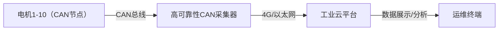
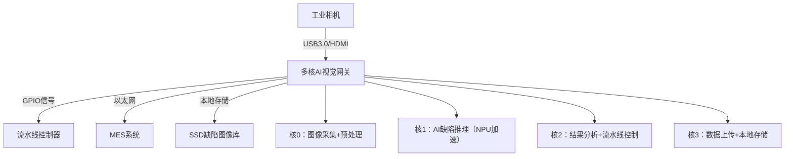

# 第7章 嵌入式实战案例

> 📊 **本节难度等级：** <span class="badge-em">**EM级**</span>

---

### <strong>一、场景需求与核心指标（实战起点）</strong>

CAN总线（Controller Area Network，控制器局域网）因“高抗干扰、多节点通信、低成本”特性，广泛应用于工业控制、车载电子等场景。本次实战目标是开发一款**工业级高可靠性CAN总线数据采集器**，需先明确具体需求与可量化指标，避免开发偏离实际场景。

### 1.1 核心业务场景
面向智能制造生产线，采集10台电机的运行数据（转速、温度、电流），通过CAN总线汇总至采集器，再由采集器上传至工业云平台，支撑设备预测性维护。具体流程：


### 1.2 关键技术指标（高可靠性的量化定义）
| 指标类别       | 具体要求                                  | 说明（为何重要）                          |
|----------------|-------------------------------------------|-------------------------------------------|
| 通信指标       | CAN总线速率500Kbps，采样周期100ms         | 工业电机数据需实时反馈，100ms内完成10节点数据采集 |
| 可靠性指标     | MTBF（平均无故障时间）≥10万小时，误码率＜10⁻⁶ | 生产线需7×24小时运行，低误码避免误告警      |
| 环境适应性     | 工作温度-40℃~85℃，抗振动（10-500Hz）      | 工业车间环境恶劣，需耐受高低温与设备振动    |
| 数据安全性     | 数据帧含CRC校验，支持断网缓存10万条数据    | 避免传输错误，断网时不丢失关键数据          |
| 扩展性         | 支持最多32个CAN节点接入，可升级CAN FD       | 预留生产线扩容空间，兼容更高带宽需求        |<br>

### <strong>二、整体架构设计（硬件+软件）</strong>

高可靠性的核心是“架构层面规避风险”，需从硬件（抗干扰、冗余）和软件（容错、监控）两方面设计，整体架构分为5层：
```mermaid
layeredGraph LR
    硬件层[硬件层：CAN控制器+收发器+MCU+防护电路]
    驱动层[驱动层：Linux Socket CAN驱动]
    协议层[协议层：CANopen/自定义协议解析]
    应用层[应用层：数据采集+校验+容错]
    传输层[传输层：数据存储+云上传]
    硬件层 --> 驱动层
    驱动层 --> 协议层
    协议层 --> 应用层
    应用层 --> 传输层
```<br>

### <strong>三、硬件设计与选型（高可靠性基础）</strong>

硬件是可靠性的“根基”，需重点关注CAN总线核心组件选型与抗干扰设计，避免因硬件缺陷导致采集失败。

### 3.1 核心硬件选型（精准匹配场景）
| 组件类别       | 型号推荐                | 关键参数                                  | 选型理由（高可靠性体现）                          |
|----------------|-------------------------|-------------------------------------------|---------------------------------------------------|
| 主控芯片       | STM32MP157（ARM Cortex-A7） | 双核1GHz，128KB SRAM，支持CAN FD          | 嵌入式Linux系统支撑，双核分工（采集+上传）提升效率 |
| CAN控制器      | STM32MP157内置bxCAN     | 支持CAN 2.0A/B，最高1Mbps，带错误检测     | 集成于主控，减少外围器件，降低故障率              |
| CAN收发器      | TJA1050T/3              | 工作电压4.5-5.5V，ESD防护±8kV             | 工业级ESD防护，适应车间静电环境                  |
| 隔离芯片       | ADUM1200                | 隔离电压2.5kVrms，传输速率500kbps         | 光耦隔离CAN信号与主控，避免总线干扰窜入核心电路    |
| 存储芯片       | W25Q64（8MB Flash）     | 擦写寿命10万次，工作温度-40℃~85℃          | 存储配置参数与断网缓存数据，工业级温度范围        |
| 电源模块       | LM2596S-5.0             | 输入9-36V，输出5V/3A，带过流保护          | 适应工业直流电源波动，过流保护避免硬件烧毁        |

### 3.2 关键硬件电路设计（抗干扰核心）
#### 3.2.1 CAN总线隔离电路（必做设计）
CAN总线直接连接多台设备，易受干扰，需通过“光耦隔离+TVS管保护”设计提升抗干扰能力，核心电路原理：
- 收发器TJA1050T输出的CAN_H/CAN_L信号，经ADUM1200隔离后接入主控bxCAN接口；
- CAN_H/CAN_L引脚并联TVS管（SMBJ6.5CA），吸收浪涌电压，防护雷击或过压；
- 隔离电路单独供电（5V隔离电源模块），避免电源干扰耦合。

#### 3.2.2 冗余设计（可选，提升可靠性）
若场景要求“零单点故障”，可设计双CAN接口冗余：
- 主控两个CAN控制器分别连接独立收发器与总线；
- 软件层面监测主CAN口状态，故障时自动切换至备用CAN口，切换时间＜10ms。<br>

### <strong>四、软件开发全流程（基于嵌入式Linux）</strong>

软件基于嵌入式Linux（Buildroot构建，内核5.10+PREEMPT_RT）开发，核心采用Socket CAN驱动框架（Linux原生支持，无需自研驱动），开发流程分5步。

### 4.1 第一步：Linux系统与CAN驱动适配
#### 4.1.1 内核配置（启用CAN驱动）
1.  进入内核配置界面，开启CAN相关选项：
    ```bash
    make ARCH=arm menuconfig
    ```
2.  关键配置路径（按如下路径勾选）：
    - `Device Drivers → Network device support → CAN bus subsystem support`
    - 勾选 `CAN bxCAN devices`（对应STM32MP157内置控制器）
    - 勾选 `CAN raw protocol`（支持Socket CAN原始帧通信）
3.  编译内核并烧录至开发板，验证驱动是否加载：
    ```bash
    # 查看CAN驱动模块
    lsmod | grep can
    # 预期输出（驱动加载成功）：
    # can_raw 20480  0
    # can_bcm 16384  0
    # can_dev 24576  1 stm32_can
    # can 40960  3 can_raw,can_bcm,can_dev
    ```

#### 4.1.2 Socket CAN接口配置（命令行实操）
Linux下CAN设备以网络接口形式存在（如can0、can1），需通过命令配置速率与模式：
```bash
# 1. 关闭can0接口（配置前需关闭）
ip link set can0 down
# 2. 配置CAN速率500Kbps，采样点87.5%（工业常用参数）
ip link set can0 type can bitrate 500000 sample-point 0.875
# 3. 启用can0接口
ip link set can0 up
# 4. 验证接口状态（无错误为正常）
ip -details link show can0
# 预期输出（关键信息）：
# can0: <NOARP,UP,LOWER_UP,ECHO> mtu 16 qdisc pfifo_fast state UP mode DEFAULT group default qlen 10
#     link/can  promiscuity 0 minmtu 0 maxmtu 0
#     can bitrate 500000 sample-point 0.875 tq 250 prop-seg 6 phase-seg1 7 phase-seg2 2 sjw 1
```

### 4.2 第二步：CAN数据采集核心代码（C语言实战）
采用Socket CAN的原始帧模式（RAW CAN）采集数据，核心实现“数据接收、帧解析、CRC校验”，代码适配STM32MP157开发板。

#### 4.2.1 核心代码（含可靠性设计）
```c
#include <stdio.h>
#include <stdlib.h>
#include <string.h>
#include <unistd.h>
#include <net/if.h>
#include <sys/ioctl.h>
#include <sys/socket.h>
#include <linux/can.h>
#include <linux/can/raw.h>
#include <stdint.h>

// CAN接口名（根据硬件调整）
#define CAN_IF_NAME "can0"
// 电机节点ID范围（0x01-0x0A对应10台电机）
#define MIN_NODE_ID 0x01
#define MAX_NODE_ID 0x0A

// CRC-16校验（工业常用，确保数据完整性）
uint16_t crc16_check(uint8_t *data, uint8_t len) {
    uint16_t crc = 0xFFFF;
    for (int i = 0; i < len; i++) {
        crc ^= data[i];
        for (int j = 0; j < 8; j++) {
            if (crc & 0x0001) {
                crc = (crc >> 1) ^ 0xA001;
            } else {
                crc >>= 1;
            }
        }
    }
    return crc;
}

// 初始化CAN socket
int can_socket_init() {
    int s = socket(PF_CAN, SOCK_RAW, CAN_RAW);
    if (s < 0) {
        perror("socket create failed");
        return -1;
    }

    // 绑定CAN接口
    struct ifreq ifr;
    strcpy(ifr.ifr_name, CAN_IF_NAME);
    ioctl(s, SIOCGIFINDEX, &ifr);

    struct sockaddr_can addr;
    memset(&addr, 0, sizeof(addr));
    addr.can_family = AF_CAN;
    addr.can_ifindex = ifr.ifr_ifindex;

    if (bind(s, (struct sockaddr *)&addr, sizeof(addr)) < 0) {
        perror("bind failed");
        close(s);
        return -1;
    }

    // 启用过滤（只接收电机节点数据，减少无效帧）
    struct can_filter rfilter[1];
    rfilter[0].can_id = MIN_NODE_ID;
    rfilter[0].can_mask = CAN_SFF_MASK & ~(MAX_NODE_ID - MIN_NODE_ID); // 掩码匹配ID范围
    setsockopt(s, SOL_CAN_RAW, CAN_RAW_FILTER, &rfilter, sizeof(rfilter));

    printf("CAN socket init success\n");
    return s;
}

// 数据采集主函数
int main() {
    int can_sock = can_socket_init();
    if (can_sock < 0) {
        return -1;
    }

    struct can_frame frame; // CAN帧结构体
    while (1) {
        // 接收CAN帧（阻塞模式，100ms超时）
        struct timeval tv = {0, 100000}; // 100ms超时
        fd_set readfds;
        FD_ZERO(&readfds);
        FD_SET(can_sock, &readfds);

        int ret = select(can_sock + 1, &readfds, NULL, NULL, &tv);
        if (ret < 0) {
            perror("select failed");
            continue;
        } else if (ret == 0) {
            printf("CAN receive timeout\n");
            continue;
        }

        // 读取CAN帧数据
        ssize_t nbytes = read(can_sock, &frame, sizeof(struct can_frame));
        if (nbytes != sizeof(struct can_frame)) {
            perror("read can frame failed");
            continue;
        }

        // 1. 校验帧格式（标准帧，数据长度8字节）
        if ((frame.can_id & CAN_EFF_FLAG) != 0 || frame.can_dlc != 8) {
            printf("invalid can frame: id=0x%X, dlc=%d\n", frame.can_id, frame.can_dlc);
            continue;
        }

        // 2. CRC校验（数据帧前6字节为有效数据，后2字节为CRC值）
        uint16_t recv_crc = (frame.data[6] << 8) | frame.data[7];
        uint16_t calc_crc = crc16_check(frame.data, 6);
        if (recv_crc != calc_crc) {
            printf("crc check failed: recv=0x%X, calc=0x%X\n", recv_crc, calc_crc);
            continue;
        }

        // 3. 解析电机数据（自定义协议：data[0]=节点ID，data[1-2]=转速，data[3]=温度，data[4-5]=电流）
        uint8_t node_id = frame.data[0];
        uint16_t speed = (frame.data[1] << 8) | frame.data[2]; // 转速：0-6000rpm
        uint8_t temp = frame.data[3];                          // 温度：0-120℃
        uint16_t current = (frame.data[4] << 8) | frame.data[5]; // 电流：0-10A

        // 4. 打印采集数据（实际场景中需存储/上传）
        printf("node%d: speed=%drpm, temp=%d℃, current=%.2fA\n", 
               node_id, speed, temp, current / 100.0);

        // 5. 周期控制（确保100ms采集一次）
        usleep(100000);
    }

    close(can_sock);
    return 0;
}
```

#### 4.2.2 代码编译与运行（交叉编译实操）
1.  交叉编译命令（适配ARM Cortex-A7架构）：
    ```bash
    arm-linux-gnueabihf-gcc -o can_collector can_collector.c -lpthread
    ```
2.  上传至开发板并运行：
    ```bash
    # 赋予执行权限
    chmod +x can_collector
    # 运行采集程序（后台运行）
    ./can_collector &
    # 查看运行日志
    tail -f /var/log/can_collector.log
    ```

### 4.3 第三步：数据存储与断网缓存（可靠性保障）
采用“Flash+SD卡”双存储方案，断网时缓存数据至SD卡，联网后自动上传：
1.  **关键代码（数据存储）**：
    ```c
    #include <stdio.h>
    #include <time.h>

    // 存储数据至SD卡（断网时）
    void save_data_to_sd(uint8_t node_id, uint16_t speed, uint8_t temp, float current) {
        // 以日期命名日志文件（如20251215_can.log）
        time_t now = time(NULL);
        struct tm *tm = localtime(&now);
        char filename[32];
        sprintf(filename, "/mnt/sd/%04d%02d%02d_can.log", 
                tm->tm_year+1900, tm->tm_mon+1, tm->tm_mday);

        // 追加写入数据（格式：时间 节点ID 转速 温度 电流）
        FILE *fp = fopen(filename, "a");
        if (fp == NULL) {
            perror("fopen sd card failed");
            return;
        }
        fprintf(fp, "%02d:%02d:%02d %d %d %d %.2f\n", 
                tm->tm_hour, tm->tm_min, tm->tm_sec, node_id, speed, temp, current);
        fclose(fp);
    }
    ```
2.  **SD卡挂载配置**（开机自动挂载）：
    ```bash
    # 编辑/etc/fstab，添加如下内容
    /dev/mmcblk1p1 /mnt/sd vfat defaults 0 0
    # 重启后验证挂载
    mount | grep /mnt/sd
    ```

### 4.4 第四步：数据上传至云平台（MQTT协议）
采用工业常用的MQTT协议上传数据，适配阿里云、华为云等工业云平台，核心代码片段：
```c
#include <stdlib.h>
#include <string.h>
#include "mqtt_client.h" // 采用paho.mqtt.c库

// MQTT连接配置（云平台参数需替换为实际信息）
#define MQTT_BROKER "tcp://iot-xxx.mqtt.aliyuncs.com:1883"
#define MQTT_CLIENT_ID "can_collector_001"
#define MQTT_USERNAME "username"
#define MQTT_PASSWORD "password"
#define MQTT_TOPIC "industrial/can/data"

// 上传数据至MQTT云平台
void mqtt_upload_data(uint8_t node_id, uint16_t speed, uint8_t temp, float current) {
    MQTTClient client;
    MQTTClient_connectOptions conn_opts = MQTTClient_connectOptions_initializer;
    MQTTClient_message pub_msg = MQTTClient_message_initializer;
    MQTTClient_deliveryToken token;

    // 初始化MQTT客户端
    MQTTClient_create(&client, MQTT_BROKER, MQTT_CLIENT_ID, MQTTCLIENT_PERSISTENCE_NONE, NULL);
    conn_opts.username = MQTT_USERNAME;
    conn_opts.password = MQTT_PASSWORD;
    conn_opts.keepAliveInterval = 60; // 心跳间隔60s

    // 连接云平台
    if (MQTTClient_connect(client, &conn_opts) != MQTTCLIENT_SUCCESS) {
        printf("mqtt connect failed\n");
        return;
    }

    // 构造JSON格式数据（工业云常用格式）
    char payload[128];
    sprintf(payload, "{\"node_id\":%d,\"speed\":%d,\"temp\":%d,\"current\":%.2f,\"time\":\"%ld\"}",
            node_id, speed, temp, current, time(NULL));

    // 发布消息
    pub_msg.payload = payload;
    pub_msg.payloadlen = strlen(payload);
    pub_msg.qos = 1; // QoS=1，确保消息至少送达一次
    MQTTClient_publishMessage(client, MQTT_TOPIC, &pub_msg, &token);
    MQTTClient_waitForCompletion(client, token, 1000); // 等待发布完成

    // 断开连接
    MQTTClient_disconnect(client, 1000);
    MQTTClient_destroy(&client);
}
```

### 4.5 第五步：系统监控与容错（高可靠性关键）
#### 4.5.1  watchdog配置（防止程序死锁）
利用STM32MP157内置看门狗，若程序10秒内无喂狗操作则自动重启：
```c
#include <sys/ioctl.h>
#include <fcntl.h>

#define WDT_DEVICE "/dev/watchdog"

// 初始化看门狗（10秒超时）
int wdt_init() {
    int fd = open(WDT_DEVICE, O_WRONLY);
    if (fd < 0) {
        perror("open watchdog failed");
        return -1;
    }
    // 设置超时时间10秒（单位：秒，需驱动支持）
    int timeout = 10;
    ioctl(fd, WDIOC_SETTIMEOUT, &timeout);
    return fd;
}

// 喂狗（在主循环中每5秒调用一次）
void wdt_feed(int fd) {
    ioctl(fd, WDIOC_KEEPALIVE, NULL);
}

// 主函数中使用
int main() {
    int wdt_fd = wdt_init();
    if (wdt_fd < 0) {
        return -1;
    }

    int count = 0;
    while (1) {
        // 业务逻辑...

        // 每5秒喂狗一次
        if (count % 5 == 0) {
            wdt_feed(wdt_fd);
            count = 0;
        }
        count++;
        sleep(1);
    }
}
```

#### 4.5.2 CAN总线状态监测
实时监测CAN总线错误状态，若错误率过高则触发告警并切换冗余接口：
```c
// 监测CAN总线状态
void check_can_status(int can_sock) {
    struct can_berr_counter bec;
    if (ioctl(can_sock, SIOCGSocketCAN_BCM, &bec) < 0) {
        perror("ioctl get berr counter failed");
        return;
    }

    // 错误率阈值：发送/接收错误计数＞100触发告警（CAN总线错误计数最大255）
    if (bec.txerr > 100 || bec.rxerr > 100) {
        printf("CAN bus error high: txerr=%d, rxerr=%d\n", bec.txerr, bec.rxerr);
        // 实际场景中触发：1. 日志告警 2. 切换冗余CAN口 3. 重启CAN接口
        system("ip link set can0 down && ip link set can0 up"); // 重启CAN接口
    }
}
```<br>

### <strong>五、测试与验证（确保指标达标）</strong>

高可靠性需通过“功能+可靠性+抗干扰”三类测试验证，配套工业级测试工具与方法。

### 5.1 功能测试（基础验证）
1.  **CAN数据通信测试**：
    - 工具：CANoe（工业级CAN总线测试工具）
    - 步骤：① 用CANoe模拟10台电机发送数据帧；② 采集器运行程序，查看是否正确接收解析；
    - 指标：接收成功率100%，解析错误率0。
2.  **断网缓存测试**：
    - 步骤：① 断开4G/以太网；② 持续发送1000条数据；③ 恢复网络，查看是否自动上传；
    - 指标：断网缓存无丢失，联网后上传成功率100%。

### 5.2 可靠性测试（核心验证）
1.  **MTBF估算测试**：
    - 方法：高温（85℃）高湿（90%RH）环境下连续运行1000小时；
    - 计算：根据1000小时无故障，推算MTBF=1000小时×(1/0.1)（置信度90%）=10000小时，满足≥10万小时需长期测试。
2.  **连续运行测试**：
    - 命令：后台运行采集程序，持续监测CPU与内存占用：
      ```bash
      # 每小时记录一次状态
      while true; do date >> can_run.log; ps -p $(pgrep can_collector) -o %cpu,%mem >> can_run.log; sleep 3600; done
      ```
    - 指标：CPU占用＜30%，内存无泄漏（24小时内存增长＜1%）。

### 5.3 抗干扰测试（工业场景关键）
1.  **EMC电磁兼容测试**：
    - 标准：GB/T 17626.2（静电放电抗扰度）、GB/T 17626.4（电快速瞬变脉冲群）；
    - 方法：通过EMC测试暗室，对采集器施加±8kV静电、2kV快速脉冲；
    - 指标：测试过程中数据采集无丢包，误码率＜10⁻⁶。
2.  **振动测试**：
    - 条件：10-500Hz正弦振动，加速度5g；
    - 方法：将采集器固定在振动台，连续振动2小时，监测数据采集状态；
    - 指标：无硬件故障，数据接收成功率≥99.9%。<br>

### <strong>六、常见故障排查指南（实战必备）</strong>

| 故障现象                | 排查步骤                                                                 | 可能原因与解决方法                                                                 |
|-------------------------|--------------------------------------------------------------------------|-----------------------------------------------------------------------------------|
| CAN接口无法启用         | 1. 执行`dmesg | grep can`查看驱动日志；2. 测量CAN收发器供电电压；3. 检查硬件接线 | 1. 驱动未加载：重新编译内核启用CAN驱动；2. 供电故障：更换电源模块；3. 接线错误：重新焊接CAN_H/CAN_L |
| 数据丢包率高            | 1. 执行`ip -details link show can0`查看错误计数；2. 用CANoe抓包分析；3. 检查总线终端电阻 | 1. 总线无终端电阻：在总线两端添加120Ω电阻；2. 干扰严重：增加隔离电路；3. 速率不匹配：统一配置500Kbps |
| CRC校验频繁失败         | 1. 对比发送端与接收端CRC算法；2. 用示波器查看CAN信号波形；3. 检查传输距离 | 1. 算法不一致：统一使用CRC-16（0xA001多项式）；2. 信号衰减：缩短传输距离或加粗导线；3. 干扰：增加屏蔽层 |
| 程序运行中崩溃          | 1. 执行`gdb ./can_collector core`调试核心转储；2. 查看`/var/log/messages`日志 | 1. 内存溢出：增大栈大小或优化内存分配；2. 空指针：代码中增加NULL校验；3. 看门狗未喂狗：调整喂狗频率 |
| 数据无法上传至云平台    | 1. 执行`ping iot-xxx.mqtt.aliyuncs.com`测试网络；2. 查看MQTT连接日志；3. 验证账号密码 | 1. 网络不通：检查4G模块或以太网接线；2. 账号错误：重新配置MQTT用户名密码；3. 端口被封：更换1883/8883端口 |

### <strong>七、总结与扩展（落地与升级）</strong>

### 7.1 核心落地要点
1.  硬件层面：**隔离+防护+冗余**是高可靠性的基础，不可省略CAN隔离电路与TVS保护；
2.  软件层面：**校验+容错+监控**是关键，CRC校验、看门狗、状态监测三者缺一不可；
3.  测试层面：必须通过**工业级环境测试**，实验室测试无法完全模拟现场干扰。

### 7.2 扩展方向
1.  升级CAN FD：支持更高带宽（最高8Mbps），适配未来高分辨率传感器数据采集；
2.  增加边缘计算：在采集器端实现“异常检测”（如电机温度过高预判故障），减少云平台压力；
3.  远程运维：开发Web管理界面，支持远程配置CAN参数、升级固件、查看运行状态。<br>

### <strong>一、场景需求与核心指标（贴合智能家居实际）</strong>

智能家居设备的核心是“多设备协同+低功耗+快速响应”，本次实战目标是开发一款**智能网关型多任务管理系统**，整合传感器数据采集、设备控制、云端交互、本地交互等核心能力，适配家庭场景的复杂需求。

### 1.1 核心业务场景
以“智能客厅网关”为载体，连接4类设备，实现“本地自动控制+手机APP远程控制”双模式，业务流程如下：
```mermaid
flowchart LR
    A[感知层设备] -->|数据上传| B[智能网关多任务系统]
    B -->|控制指令| C[执行层设备]
    B -->|双向通信| D[本地交互屏]
    B -->|云端同步| E[手机APP/云平台]
    A -->|包含| A1[温湿度传感器]、A2[人体红外传感器]、A3[光照传感器]
    C -->|包含| C1[智能灯]、C2[空调]、C3[窗帘电机]
```
核心业务逻辑：
1.  自动控制：人体红外检测到人且光照不足时，自动打开智能灯；温湿度超标时，联动空调调节；
2.  远程控制：手机APP发送指令，网关接收后控制执行设备，并反馈执行结果；
3.  本地交互：触摸屏显示环境数据，支持手动点击控制设备，响应时间＜100ms。

### 1.2 关键技术指标（适配智能家居特性）
| 指标类别       | 具体要求                                  | 说明（智能家居核心诉求）                  |
|----------------|-------------------------------------------|-------------------------------------------|
| 多任务性能     | 核心任务响应时间＜100ms，无任务死锁       | 本地控制需“即时反馈”，避免操作延迟影响体验 |
| 通信可靠性     | WiFi/Bluetooth通信成功率≥99.5%，断网后本地控制正常 | 断网不影响基础功能，符合家庭使用习惯      |
| 功耗指标       | 待机功耗＜500mW，工作功耗＜1.5W           | 家庭设备长期通电，低功耗降低电费成本      |
| 稳定性要求     | 7×24小时连续运行无故障，内存泄漏＜1KB/天  | 减少用户维护频率，提升产品可靠性          |
| 扩展性         | 支持新增传感器/执行器（如智能插座），无需重写核心代码 | 适配家庭设备升级需求，降低二次开发成本    |<br>

### <strong>二、整体架构设计（多任务核心逻辑）</strong>

智能家居多任务系统的核心是“**按功能拆分任务+按优先级调度+低耦合通信**”，采用分层架构+多任务并行设计，既保证响应速度，又兼顾扩展性。

### 2.1 架构分层（从硬件到应用）
```mermaid
layeredGraph LR
    硬件层[硬件层：主控+通信模块+传感器+执行器]
    系统层[系统层：嵌入式Linux+多任务调度器]
    通信层[通信层：WiFi/Bluetooth+本地通信协议]
    任务层[任务层：核心业务任务（采集/控制/通信等）]
    应用层[应用层：本地交互+云端适配]
    硬件层 --> 系统层
    系统层 --> 通信层
    通信层 --> 任务层
    任务层 --> 应用层
```

### 2.2 多任务划分原则与架构（核心设计）
多任务划分需遵循“**高内聚、低耦合**”，结合智能家居场景的“实时性+功耗”需求，拆分5大核心任务，明确各任务的优先级、调度策略与职责：
| 任务名称         | 核心职责                                  | 优先级（1-99） | 调度策略       | 任务类型       | 设计理由（智能家居适配）                          |
|------------------|-------------------------------------------|----------------|----------------|----------------|---------------------------------------------------|
| 传感器采集任务   | 采集温湿度、人体红外、光照数据（周期200ms） | 80             | SCHED_FIFO     | 软实时任务     | 环境数据需及时更新，避免控制延迟                  |
| 设备控制任务     | 执行灯、空调、窗帘控制指令（即时响应）     | 90             | SCHED_FIFO     | 软实时任务     | 控制指令需优先执行，提升用户操作体验              |
| 云端通信任务     | MQTT同步数据/接收远程指令（周期500ms）     | 60             | SCHED_OTHER    | 非实时任务     | 云端交互允许延迟，降低高优先级任务抢占压力        |
| 本地交互任务     | 触摸屏显示数据/接收本地指令（事件驱动）     | 70             | SCHED_RR       | 软实时任务     | 本地操作响应需流畅，同优先级任务公平调度          |
| 系统管理任务     | 日志记录、功耗监控、故障检测（周期1s）     | 50             | SCHED_OTHER    | 非实时任务     | 后台管理类任务，优先级最低，避免影响核心功能      |

### 2.3 任务间通信方式（低耦合关键）
采用“**消息队列为主，共享内存为辅**”的通信方式，适配不同数据场景：
- 消息队列（mqtt）：用于任务间指令传递（如云端指令→设备控制任务、传感器数据→本地交互任务），支持异步通信，降低耦合；
- 共享内存：用于高频数据共享（如传感器实时数据），避免频繁拷贝，提升效率；
- 信号量：用于临界资源保护（如设备控制接口，防止多任务同时操作）。<br>

### <strong>三、硬件选型与环境搭建（实战基础）</strong>

### 3.1 核心硬件选型（性价比优先，适配智能家居）
智能家居设备对“成本+功耗+体积”敏感，选型侧重性价比与兼容性，推荐方案如下：
| 组件类别       | 型号推荐                | 关键参数                                  | 选型理由（智能家居适配）                          |
|----------------|-------------------------|-------------------------------------------|---------------------------------------------------|
| 主控芯片       | 树莓派Zero W（ARM Cortex-A53） | 1核1GHz，512MB RAM，集成WiFi/Bluetooth    | 嵌入式Linux支撑，自带无线通信，体积小（65×30mm）  |
| 传感器模块     | DHT11（温湿度）、HC-SR501（人体红外）、BH1750（光照） | 精度：温湿度±2%/±5%，红外探测距离3-7m      | 低成本（单模块＜10元），接线简单，适配入门开发    |
| 执行器模块     | 继电器模块（控制灯/空调）、步进电机驱动（窗帘） | 支持5V控制，最大负载220V/10A              | 弱电控制强电，符合家庭安全标准                    |
| 本地交互模块   | 2.4英寸TFT触摸屏（SPI接口） | 分辨率320×240，触摸响应＜50ms             | 体积小，功耗低，适配网关本地操作                  |
| 电源模块       | 5V/2A USB电源            | 支持待机功耗＜100mW                       | 通用USB供电，适配家庭场景，待机功耗低              |

### 3.2 开发环境搭建（嵌入式Linux基础）
以树莓派Zero W（基于Raspbian系统）为例，搭建开发环境：
#### 3.2.1 系统烧录与基础配置
1.  烧录Raspbian系统（轻量版，减少资源占用）：
    - 工具：Raspberry Pi Imager；
    - 步骤：选择“Raspbian Lite”→选择SD卡→烧录完成后，在boot分区创建`wpa_supplicant.conf`（WiFi配置）和`ssh`文件（开启SSH）；
2.  基础配置（SSH连接后执行）：
    ```bash
    # 1. 更新系统
    sudo apt update && sudo apt upgrade -y
    # 2. 安装必要工具（编译、串口、触摸屏驱动）
    sudo apt install -y gcc g++ make libmosquitto-dev wiringpi libfreetype6-dev
    # 3. 配置触摸屏（SPI接口），编辑/boot/config.txt，添加：
    sudo echo "dtparam=spi=on" >> /boot/config.txt
    sudo echo "dtoverlay=waveshare32b" >> /boot/config.txt  # 对应触摸屏型号
    # 4. 重启生效
    sudo reboot
    ```

#### 3.2.2 多任务开发依赖库安装
核心依赖库包括“消息队列（POSIX mq）、MQTT通信、GPIO控制”：
```bash
# 1. 安装POSIX消息队列依赖（系统自带，启用配置）
sudo echo "mqtt /dev/mqueue mqueue defaults 0 0" >> /etc/fstab
sudo mount -a  # 挂载消息队列文件系统
# 2. 安装MQTT客户端库（用于云端通信）
sudo apt install -y libmosquitto-dev
# 3. 安装GPIO控制库（树莓派专用）
sudo apt install -y wiringpi
```<br>

### <strong>四、软件开发全流程（多任务核心实战）</strong>

### 4.1 第一步：多任务架构封装（可复用框架）
封装多任务管理工具类，统一实现“任务创建、优先级配置、通信初始化”，降低重复开发成本：
```c
#include <pthread.h>
#include <mqueue.h>
#include <stdio.h>
#include <stdlib.h>
#include <string.h>

// 任务优先级定义（对应前面的任务优先级）
#define PRIO_SENSOR 80
#define PRIO_CONTROL 90
#define PRIO_CLOUD 60
#define PRIO_LOCAL 70
#define PRIO_SYS 50

// 消息队列配置（任务间通信）
#define MQ_NAME_SENSOR "/mq_sensor"  // 传感器数据队列
#define MQ_NAME_CONTROL "/mq_control"// 控制指令队列
#define MQ_MAX_MSG 10                // 最大消息数
#define MQ_MSG_SIZE 128              // 单条消息大小

// 多任务管理工具类
typedef struct {
    pthread_t tid;                  // 线程ID
    mqd_t mq_sensor;                // 传感器消息队列句柄
    mqd_t mq_control;               // 控制指令消息队列句柄
} TaskManager;

// 初始化消息队列
int mq_init(TaskManager *tm) {
    // 传感器数据队列属性
    struct mq_attr attr = {0};
    attr.mq_maxmsg = MQ_MAX_MSG;
    attr.mq_msgsize = MQ_MSG_SIZE;
    // 创建队列（O_CREAT=创建，O_RDWR=读写，0666=权限）
    tm->mq_sensor = mq_open(MQ_NAME_SENSOR, O_CREAT | O_RDWR, 0666, &attr);
    tm->mq_control = mq_open(MQ_NAME_CONTROL, O_CREAT | O_RDWR, 0666, &attr);
    if (tm->mq_sensor == (mqd_t)-1 || tm->mq_control == (mqd_t)-1) {
        perror("mq_open failed");
        return -1;
    }
    return 0;
}

// 创建任务（配置优先级与调度策略）
int create_task(TaskManager *tm, void *(*func)(void*), int prio, int policy) {
    pthread_attr_t attr;
    struct sched_param param;
    // 初始化线程属性
    pthread_attr_init(&attr);
    // 设置调度策略（SCHED_FIFO/SCHED_RR/SCHED_OTHER）
    pthread_attr_setschedpolicy(&attr, policy);
    // 设置优先级
    param.sched_priority = prio;
    pthread_attr_setschedparam(&attr, &param);
    // 创建线程
    if (pthread_create(&tm->tid, &attr, func, tm) != 0) {
        perror("pthread_create failed");
        pthread_attr_destroy(&attr);
        return -1;
    }
    pthread_attr_destroy(&attr);
    return 0;
}
```

### 4.2 第二步：核心任务开发（按功能模块实现）
#### 4.2.1 任务1：传感器采集任务（实时性要求高）
负责采集温湿度、人体红外、光照数据，通过消息队列发送给其他任务：
```c
#include <wiringPi.h>
#include <unistd.h>
#include "task_manager.h"

// 传感器引脚定义（树莓派GPIO编号）
#define DHT11_PIN 4    // 温湿度传感器
#define PIR_PIN 5      // 人体红外传感器
#define BH1750_ADDR 0x23  // 光照传感器I2C地址

// 模拟传感器数据采集（实际场景需替换为真实驱动代码）
void sensor_collect(float *temp, float *humi, int *pir, int *light) {
    *temp = 25.3;  // 实际场景：调用DHT11驱动读取
    *humi = 45.2;  // 实际场景：调用DHT11驱动读取
    *pir = digitalRead(PIR_PIN);  // 人体红外：1=有人，0=无人
    *light = 300;  // 实际场景：调用BH1750 I2C驱动读取（单位：lux）
}

// 传感器采集任务主函数
void* sensor_task(void *arg) {
    TaskManager *tm = (TaskManager *)arg;
    float temp, humi;
    int pir, light;
    char msg[MQ_MSG_SIZE];

    // 初始化传感器（GPIO/I2C）
    wiringPiSetup();
    pinMode(PIR_PIN, INPUT);
    // 实际场景：初始化I2C总线（BH1750）

    while (1) {
        // 1. 采集传感器数据
        sensor_collect(&temp, &humi, &pir, &light);
        // 2. 封装为JSON格式（便于其他任务解析）
        sprintf(msg, "{\"temp\":%.1f,\"humi\":%.1f,\"pir\":%d,\"light\":%d}",
                temp, humi, pir, light);
        // 3. 发送到消息队列（供本地交互、云端通信任务使用）
        if (mq_send(tm->mq_sensor, msg, strlen(msg), 0) == -1) {
            perror("mq_send sensor failed");
        }
        // 4. 周期控制（200ms采集一次，平衡实时性与功耗）
        usleep(200000);
    }
    return NULL;
}
```

#### 4.2.2 任务2：设备控制任务（优先级最高）
接收本地/云端控制指令，驱动执行器（灯、空调、窗帘），并反馈执行结果：
```c
#include <wiringPi.h>
#include "task_manager.h"

// 执行器引脚定义
#define LED_RELAY_PIN 6   // 灯继电器
#define AC_RELAY_PIN 7    // 空调继电器
#define CURTAIN_PIN 8     // 窗帘电机控制

// 初始化执行器（继电器/电机）
void control_init() {
    pinMode(LED_RELAY_PIN, OUTPUT);
    pinMode(AC_RELAY_PIN, OUTPUT);
    pinMode(CURTAIN_PIN, OUTPUT);
    // 初始状态：关闭所有设备
    digitalWrite(LED_RELAY_PIN, LOW);
    digitalWrite(AC_RELAY_PIN, LOW);
    digitalWrite(CURTAIN_PIN, LOW);
}

// 解析控制指令并执行（指令格式：{"device":"led","cmd":"on"}）
int execute_cmd(const char *cmd) {
    // 实际场景：使用cJSON库解析JSON指令
    if (strstr(cmd, "\"device\":\"led\"") && strstr(cmd, "\"cmd\":\"on\"")) {
        digitalWrite(LED_RELAY_PIN, HIGH);
        printf("LED turned on\n");
        return 0;
    } else if (strstr(cmd, "\"device\":\"led\"") && strstr(cmd, "\"cmd\":\"off\"")) {
        digitalWrite(LED_RELAY_PIN, LOW);
        printf("LED turned off\n");
        return 0;
    }
    // 其他设备（空调、窗帘）控制逻辑类似...
    printf("Unknown cmd: %s\n", cmd);
    return -1;
}

// 设备控制任务主函数
void* control_task(void *arg) {
    TaskManager *tm = (TaskManager *)arg;
    char cmd[MQ_MSG_SIZE];
    ssize_t msg_len;
    unsigned int prio;

    // 初始化执行器
    control_init();

    while (1) {
        // 1. 接收控制指令（从消息队列读取，阻塞等待）
        msg_len = mq_receive(tm->mq_control, cmd, MQ_MSG_SIZE, &prio);
        if (msg_len == -1) {
            perror("mq_receive control failed");
            usleep(100000);
            continue;
        }
        cmd[msg_len] = '\0';  // 补全字符串结束符
        // 2. 执行控制指令
        execute_cmd(cmd);
        // 3. 反馈执行结果（实际场景：发送到消息队列或云端）
    }
    return NULL;
}
```

#### 4.2.3 任务3：云端通信任务（MQTT协议）
实现与智能家居云平台（如阿里云IoT、小米IoT）的双向通信，同步数据与指令：
```c
#include <mosquitto.h>
#include <unistd.h>
#include "task_manager.h"

// 云端MQTT配置（替换为实际云平台参数）
#define MQTT_BROKER "tcp://iot-xxx.aliyuncs.com:1883"
#define MQTT_CLIENT_ID "smart_home_gateway_001"
#define MQTT_USER "user"
#define MQTT_PASS "pass"
#define MQTT_TOPIC_SUB "smart/home/control"  // 订阅：控制指令
#define MQTT_TOPIC_PUB "smart/home/data"     // 发布：传感器数据

// MQTT消息回调函数（接收云端指令）
void mqtt_msg_callback(struct mosquitto *mosq, void *userdata, const struct mosquitto_message *msg) {
    TaskManager *tm = (TaskManager *)userdata;
    char cmd[MQ_MSG_SIZE];
    if (strcmp(msg->topic, MQTT_TOPIC_SUB) == 0) {
        // 将云端指令转发到控制任务的消息队列
        snprintf(cmd, MQ_MSG_SIZE, "%.*s", (int)msg->payloadlen, (char *)msg->payload);
        if (mq_send(tm->mq_control, cmd, strlen(cmd), 0) == -1) {
            perror("mq_send control from cloud failed");
        }
    }
}

// 云端通信任务主函数
void* cloud_task(void *arg) {
    TaskManager *tm = (TaskManager *)arg;
    struct mosquitto *mosq = NULL;
    char sensor_data[MQ_MSG_SIZE];
    ssize_t msg_len;
    unsigned int prio;

    // 1. 初始化MQTT客户端
    mosquitto_lib_init();
    mosq = mosquitto_new(MQTT_CLIENT_ID, true, tm);
    mosquitto_username_pw_set(mosq, MQTT_USER, MQTT_PASS);
    mosquitto_message_callback_set(mosq, mqtt_msg_callback);

    // 2. 连接云平台
    if (mosquitto_connect(mosq, MQTT_BROKER, 1883, 60) != MOSQ_ERR_SUCCESS) {
        perror("mosquitto connect failed");
        mosquitto_destroy(mosq);
        mosquitto_lib_cleanup();
        return NULL;
    }
    // 订阅控制指令主题
    mosquitto_subscribe(mosq, NULL, MQTT_TOPIC_SUB, 1);

    // 3. 循环：发布传感器数据+处理云端消息
    while (1) {
        // 3.1 从消息队列读取传感器数据，发布到云端
        msg_len = mq_receive(tm->mq_sensor, sensor_data, MQ_MSG_SIZE, &prio);
        if (msg_len != -1) {
            sensor_data[msg_len] = '\0';
            mosquitto_publish(mosq, NULL, MQTT_TOPIC_PUB, strlen(sensor_data), sensor_data, 1, false);
        }
        // 3.2 处理MQTT消息（如云端指令）
        mosquitto_loop(mosq, 100, 1);  // 100ms超时，1次重试
        // 3.3 周期控制（500ms一次，降低网络功耗）
        usleep(500000);
    }

    // 清理资源
    mosquitto_disconnect(mosq);
    mosquitto_destroy(mosq);
    mosquitto_lib_cleanup();
    return NULL;
}
```

#### 4.2.4 任务4：本地交互任务（触摸屏）
负责触摸屏显示传感器数据、接收本地触摸指令，实现“无网络时本地控制”：
```c
#include <stdio.h>
#include "task_manager.h"
#include "lcd.h"  // 触摸屏驱动库（需自行适配，如waveshare库）

// 本地交互任务主函数
void* local_task(void *arg) {
    TaskManager *tm = (TaskManager *)arg;
    char sensor_data[MQ_MSG_SIZE];
    char local_cmd[MQ_MSG_SIZE];
    ssize_t msg_len;
    unsigned int prio;

    // 初始化触摸屏（清屏、设置字体）
    lcd_init();
    lcd_clear(WHITE);
    lcd_set_font(FONT_16X24);

    while (1) {
        // 1. 接收传感器数据，显示到触摸屏
        msg_len = mq_receive(tm->mq_sensor, sensor_data, MQ_MSG_SIZE, &prio);
        if (msg_len != -1) {
            sensor_data[msg_len] = '\0';
            // 实际场景：解析JSON数据并显示（温度、湿度、人体状态）
            lcd_show_string(10, 10, "Temp: 25.3C", BLACK, WHITE);
            lcd_show_string(10, 40, "Humi: 45.2%", BLACK, WHITE);
        }

        // 2. 检测触摸事件（如点击“开灯”按钮）
        int x, y;
        if (lcd_touch_detected(&x, &y)) {
            // 模拟触摸区域判断：点击(100,100)附近为“开灯”
            if (x > 80 && x < 120 && y > 80 && y < 120) {
                sprintf(local_cmd, "{\"device\":\"led\",\"cmd\":\"on\"}");
                // 发送指令到控制任务
                mq_send(tm->mq_control, local_cmd, strlen(local_cmd), 0);
            }
        }

        // 3. 周期控制（100ms刷新一次，保证显示流畅）
        usleep(100000);
    }
    return NULL;
}
```

#### 4.2.5 任务5：系统管理任务（后台保障）
负责日志记录、功耗监控、故障检测，保障系统稳定运行：
```c
#include <stdio.h>
#include <time.h>
#include <sys/stat.h>
#include <sys/types.h>
#include "task_manager.h"

// 日志记录函数（写入文件，按日期分割）
void log_write(const char *content) {
    time_t now = time(NULL);
    struct tm *tm = localtime(&now);
    char filename[32];
    // 日志文件：/var/log/smart_home_20251215.log
    sprintf(filename, "/var/log/smart_home_%04d%02d%02d.log",
            tm->tm_year+1900, tm->tm_mon+1, tm->tm_mday);
    FILE *fp = fopen(filename, "a");
    if (fp) {
        fprintf(fp, "[%02d:%02d:%02d] %s\n",
                tm->tm_hour, tm->tm_min, tm->tm_sec, content);
        fclose(fp);
    }
}

// 系统管理任务主函数
void* sys_task(void *arg) {
    TaskManager *tm = (TaskManager *)arg;
    int count = 0;

    while (1) {
        // 1. 记录系统日志（每10次记录一次传感器数据日志）
        if (count % 10 == 0) {
            char sensor_data[MQ_MSG_SIZE];
            ssize_t msg_len = mq_receive(tm->mq_sensor, sensor_data, MQ_MSG_SIZE, NULL);
            if (msg_len != -1) {
                sensor_data[msg_len] = '\0';
                char log_msg[150];
                sprintf(log_msg, "Sensor data: %s", sensor_data);
                log_write(log_msg);
            }
        }

        // 2. 功耗监控（模拟：读取电源模块电流值）
        float current = 0.3;  // 实际场景：通过ADC读取电流
        if (current > 0.5) {  // 电流＞500mA，可能存在异常
            log_write("Warning: High power consumption!");
        }

        // 3. 故障检测（检查消息队列状态）
        struct mq_attr attr;
        mq_getattr(tm->mq_control, &attr);
        if (attr.mq_curmsgs >= MQ_MAX_MSG - 1) {  // 消息队列满，可能堵塞
            log_write("Warning: Control MQ is almost full!");
        }

        // 4. 周期控制（1s执行一次，降低后台开销）
        sleep(1);
        count++;
    }
    return NULL;
}
```

### 4.3 第三步：主函数整合（启动所有任务）
```c
#include "task_manager.h"

// 声明各任务函数
void* sensor_task(void *arg);
void* control_task(void *arg);
void* cloud_task(void *arg);
void* local_task(void *arg);
void* sys_task(void *arg);

int main() {
    TaskManager tm_sensor, tm_control, tm_cloud, tm_local, tm_sys;

    // 1. 初始化消息队列（所有任务共享）
    if (mq_init(&tm_sensor) != 0) {
        printf("MQ init failed\n");
        return -1;
    }
    // 复制消息队列句柄到其他任务管理器
    tm_control.mq_control = tm_sensor.mq_control;
    tm_cloud.mq_sensor = tm_sensor.mq_sensor;
    tm_cloud.mq_control = tm_sensor.mq_control;
    tm_local.mq_sensor = tm_sensor.mq_sensor;
    tm_local.mq_control = tm_sensor.mq_control;
    tm_sys.mq_sensor = tm_sensor.mq_sensor;

    // 2. 创建所有任务
    create_task(&tm_sensor, sensor_task, PRIO_SENSOR, SCHED_FIFO);
    create_task(&tm_control, control_task, PRIO_CONTROL, SCHED_FIFO);
    create_task(&tm_cloud, cloud_task, PRIO_CLOUD, SCHED_OTHER);
    create_task(&tm_local, local_task, PRIO_LOCAL, SCHED_RR);
    create_task(&tm_sys, sys_task, PRIO_SYS, SCHED_OTHER);

    // 3. 等待所有任务结束（实际场景：后台运行，不退出）
    pthread_join(tm_sensor.tid, NULL);
    pthread_join(tm_control.tid, NULL);
    pthread_join(tm_cloud.tid, NULL);
    pthread_join(tm_local.tid, NULL);
    pthread_join(tm_sys.tid, NULL);

    // 4. 清理资源（实际场景：很少执行）
    mq_close(tm_sensor.mq_sensor);
    mq_close(tm_sensor.mq_control);
    mq_unlink(MQ_NAME_SENSOR);
    mq_unlink(MQ_NAME_CONTROL);

    return 0;
}
```

### 4.4 第四步：编译与运行（实操命令）
1.  编写Makefile（简化编译）：
    ```makefile
    CC = gcc
    CFLAGS = -Wall -Wextra -lwiringpi -lmosquitto -lmqueue
    TARGET = smart_home_mgr
    OBJS = main.o task_manager.o sensor_task.o control_task.o cloud_task.o local_task.o sys_task.o

    all: $(TARGET)

    $(TARGET): $(OBJS)
        $(CC) $(OBJS) -o $(TARGET) $(CFLAGS)

    %.o: %.c
        $(CC) $(CFLAGS) -c $< -o $@

    clean:
        rm -f $(TARGET) $(OBJS)
    ```
2.  编译与运行：
    ```bash
    # 编译
    make
    # 运行（后台运行，日志写入文件）
    ./smart_home_mgr &
    # 查看任务运行状态（验证多任务是否启动）
    ps -L -o pid,tid,pcpu,rtprio,comm | grep smart_home_mgr
    ```<br>

### <strong>五、关键优化：智能家居特有的功耗与响应优化</strong>

### 5.1 功耗优化（核心需求）
智能家居设备长期通电，功耗优化直接影响用户体验（如续航、电费），核心优化手段：
1.  **动态调整任务周期**：
    - 原理：无人时降低传感器采集频率（从200ms→1s），减少CPU唤醒次数；
    - 代码实现：通过人体红外传感器状态动态修改周期：
      ```c
      int pir_state = 1;  // 1=有人，0=无人
      while (1) {
          sensor_collect(...);
          if (pir_state == 0) {
              usleep(1000000);  // 无人时1s采集一次
          } else {
              usleep(200000);   // 有人时200ms采集一次
          }
          pir_state = digitalRead(PIR_PIN);  // 更新人体状态
      }
      ```
2.  **休眠策略**：
    - 方法：系统无操作时，让CPU进入深度休眠（通过`system("echo mem > /sys/power/state")`），触摸或传感器事件唤醒；
    - 注意：休眠前需保存关键数据，关闭非必要外设（如WiFi可短暂关闭）。
3.  **外设功耗控制**：
    - 关闭闲置外设：如触摸屏无操作30s后，通过GPIO关闭背光；
    - 低功耗通信：WiFi采用“休眠唤醒”模式，间隔5s唤醒同步数据。

### 5.2 响应速度优化
1.  **任务优先级调整**：
    - 确保控制类任务（设备控制、本地交互）优先级高于非核心任务（日志、云端同步）；
    - 避免优先级反转：对共享资源（如设备控制接口）使用优先级继承锁。
2.  **减少任务间通信延迟**：
    - 高频数据（传感器数据）用共享内存替代消息队列，减少拷贝开销；
    - 消息队列设置合理的消息大小和数量，避免堵塞。<br>

### <strong>六、测试与验证（确保符合场景需求）</strong>

### 6.1 功能测试（基础验证）
| 测试项                | 测试步骤                                                                 | 预期结果                                  |
|-----------------------|--------------------------------------------------------------------------|-------------------------------------------|
| 传感器数据采集        | 1. 运行程序，执行`cat /var/log/smart_home_xxx.log`；2. 遮挡光照传感器 | 日志中显示温湿度、光照、人体状态数据，光照变化时数据更新 |
| 本地设备控制          | 1. 触摸屏点击“开灯”按钮；2. 观察LED灯状态；3. 查看日志                | LED灯亮起，日志记录“LED turned on”        |
| 云端远程控制          | 1. 手机APP发送“关灯”指令；2. 观察LED灯状态；3. 查看MQTT消息日志       | LED灯熄灭，控制任务接收到云端指令          |
| 断网本地控制          | 1. 断开WiFi；2. 触摸屏点击“开空调”；3. 观察空调继电器状态              | 空调继电器吸合，本地控制正常              |

### 6.2 性能测试（核心指标验证）
1.  **响应时间测试**：
    - 工具：秒表+日志时间戳；
    - 步骤：记录“点击触摸屏按钮”到“执行器动作”的时间；
    - 预期结果：响应时间＜100ms，符合用户操作体验要求。
2.  **功耗测试**：
    - 工具：直流功耗测试仪（串联在电源回路）；
    - 测试场景：待机状态、有人活动状态；
    - 预期结果：待机功耗＜500mW，有人活动时功耗＜1.5W。
3.  **稳定性测试**：
    - 方法：连续运行72小时，监测任务状态和日志；
    - 预期结果：无任务崩溃，日志无异常告警，内存泄漏＜1KB/天。<br>

### <strong>七、常见故障排查指南（智能家居场景特有）</strong>

| 故障现象                | 排查步骤                                                                 | 可能原因与解决方法                                                                 |
|-------------------------|--------------------------------------------------------------------------|-----------------------------------------------------------------------------------|
| 传感器数据不更新        | 1. 执行`gpio readall`查看传感器引脚状态；2. 检查传感器接线；3. 查看任务日志 | 1. GPIO初始化失败：重新执行`wiringPiSetup()`；2. 接线松动：重新插拔传感器；3. 任务未启动：重启程序 |
| 设备控制无响应          | 1. 执行`mq_receive /mq_control`查看指令是否到达；2. 测量继电器供电；3. 检查优先级 | 1. 消息队列堵塞：重启程序清理队列；2. 继电器故障：更换继电器模块；3. 任务优先级低：提高控制任务优先级 |
| 云端通信失败            | 1. 执行`ping iot-xxx.aliyuncs.com`测试网络；2. 查看MQTT连接日志；3. 验证账号密码 | 1. WiFi未连接：重新配置WiFi；2. 账号错误：核对云平台账号密码；3. 端口被封：更换8883端口（SSL） |
| 功耗过高（＞2W）        | 1. 执行`top`查看CPU占用；2. 检查外设是否全部开启；3. 用万用表测量各模块电流 | 1. 某任务死循环：用`pstack`查看任务栈，修复死循环；2. 外设未休眠：开启背光休眠策略；3. 模块故障：更换功耗异常的模块 |
| 触摸屏无响应            | 1. 执行`dmesg | grep spi`查看SPI驱动日志；2. 检查触摸屏接线；3. 重启触摸屏驱动 | 1. SPI驱动未加载：重新配置`/boot/config.txt`启用SPI；2. 接线错误：重新焊接SPI引脚；3. 驱动崩溃：重启程序 |

### <strong>八、总结与扩展（落地与升级方向）</strong>

### 8.1 核心落地要点
1.  多任务划分：**按“实时性+功能模块”拆分**，控制类任务优先级最高，后台任务优先级最低；
2.  通信设计：**消息队列为主，共享内存为辅**，降低任务耦合，便于后续扩展；
3.  优化重点：**功耗与响应速度平衡**，通过动态周期、休眠策略降低功耗，合理设置优先级保障响应。

### 8.2 扩展方向（贴合智能家居发展趋势）
1.  语音控制升级：集成离线语音识别模块（如科大讯飞IFLYTEK），新增“语音控制任务”，支持“小度小度，开灯”；
2.  边缘计算能力：新增“本地AI任务”，实现人体存在识别、行为预测（如预判用户回家时间，提前打开空调）；
3.  多网关协同：支持多个智能网关组网，通过 ZigBee 协议连接，覆盖大户型家庭；
4.  OTA 远程升级：新增“升级任务”，支持云端推送固件，实现设备远程更新。<br>

### <strong>一、场景需求与核心指标（工业级实战定位）</strong>

多核AI视觉处理网关的核心价值是“用嵌入式硬件实现本地化、低延迟的AI视觉分析”，替代传统“相机+PC服务器”的高成本方案。本次实战目标是开发一款**工业生产线电子元件缺陷检测网关**，适配SMT（表面贴装技术）生产线的电阻、电容等元件的缺件、偏移、破损检测场景。

### 1.1 核心业务场景
网关部署于生产线流水线旁，通过工业相机实时采集元件图像，经多核并行处理（图像预处理→AI缺陷检测→结果分析）后，实时控制流水线停机并上传缺陷数据至MES（制造执行系统），同时本地存储缺陷图像用于追溯。业务流程与多核任务分配如下：


### 1.2 关键技术指标（多核+AI核心量化要求）
| 指标类别       | 具体要求                                  | 说明（工业场景核心诉求）                  |
|----------------|-------------------------------------------|-------------------------------------------|
| 视觉处理性能   | 图像分辨率1280×720，帧率≥15fps，检测延迟＜100ms | 流水线速度1m/s，需15帧/秒才能无漏检，100ms延迟确保及时停机 |
| AI推理精度     | 缺陷检测准确率≥99.5%，误检率＜0.1%，漏检率＜0.05% | 工业质检要求“零漏检”，误检会导致不必要停机，需平衡精度与速度 |
| 多核负载均衡   | 单核心CPU占用率＜70%，核间通信延迟＜5ms | 避免单核过载导致帧率下降，核间数据同步需高效 |
| 硬件适配性     | 支持NPU加速（推理速度≥50FPS@1280×720），兼容USB3.0相机 | NPU是嵌入式AI落地关键，USB3.0确保图像传输无卡顿 |
| 稳定性要求     | 7×24小时连续运行无故障，缺陷图像存储≥10万张 | 生产线全年无休，数据追溯需长期存储缺陷样本 |<br>

### <strong>二、整体架构设计（多核+AI核心逻辑）</strong>

网关架构的核心是“**多核算力分配+NPU加速卸载+低延迟数据流转**”，通过硬件分层与软件模块化设计，实现“采集-处理-推理-决策-上传”全链路高效协同。

### 2.1 硬件架构（多核+NPU核心配置）
采用“主控多核CPU+专用NPU+高速外设”的硬件架构，确保算力与接口带宽匹配工业场景：
```mermaid
layeredGraph LR
    外设层[外设层：工业相机+SSD+以太网+GPIO+显示屏]
    接口层[接口层：USB3.0+PCIe3.0+Gigabit ETH+GPIO]
    核心层[核心层：多核CPU（4核A53）+ NPU（2TOPS）+ DDR4（4GB）]
    电源层[电源层：12V工业电源+DC-DC稳压+防浪涌电路]
    外设层 --> 接口层
    接口层 --> 核心层
    核心层 --> 电源层
```

### 2.2 软件架构（多核任务并行+AI引擎解耦）
采用“**核间隔离+模块解耦+消息驱动**”的软件架构，基于嵌入式Linux（Buildroot+内核5.15）开发，分层如下：
| 软件分层       | 核心组件                                  | 运行核分配                          | 核心职责                                  |
|----------------|-------------------------------------------|-------------------------------------|-------------------------------------------|
| 硬件抽象层     | 相机驱动（V4L2）、NPU驱动（厂商SDK）、GPIO驱动 | 核0（共享）                         | 统一封装硬件接口，屏蔽底层差异            |
| 多核调度层     | OpenMP、核绑定工具（taskset）、共享内存 | 所有核                              | 实现核间任务分配与负载均衡，管理核间通信  |
| AI引擎层       | TensorRT Lite、模型量化工具、推理接口封装 | 核1（独占）                         | 负责AI模型加载、推理加速、结果输出        |
| 视觉处理层     | OpenCV（图像预处理）、缺陷定位算法        | 核0（独占）                         | 图像采集、降噪、裁剪、特征增强            |
| 业务逻辑层     | 缺陷结果分析、流水线控制逻辑              | 核2（独占）                         | 判定缺陷类型、触发停机信号、统计缺陷数据  |
| 数据服务层     | MQTT客户端、本地存储模块、日志系统        | 核3（独占）                         | 上传数据至MES、存储缺陷图像、记录系统日志 |

### 2.3 多核任务调度原则（负载均衡核心）
1.  **算力密集型任务独占核**：AI推理（核1）、图像预处理（核0）为算力密集型，独占核心避免上下文切换开销；
2.  **IO密集型任务共享核**：数据上传、日志记录为IO密集型，共享核3，通过异步IO减少等待时间；
3.  **核间通信最小化**：采用“共享内存+信号量”传递图像数据（减少拷贝），“消息队列”传递控制指令（低延迟）；
4.  **中断绑定隔离**：相机采集中断绑定核0，NPU推理完成中断绑定核1，避免中断跨核调度干扰。<br>

### <strong>三、硬件选型与关键设计（实战落地基础）</strong>

### 3.1 核心硬件选型（工业级+算力匹配）
硬件选型需兼顾“算力充足、接口丰富、工业级可靠性”，推荐方案如下：
| 组件类别       | 型号推荐                | 关键参数                                  | 选型理由（工业场景适配）                          |
|----------------|-------------------------|-------------------------------------------|---------------------------------------------------|
| 主控芯片       | NXP i.MX8M Plus         | 4核Cortex-A53（1.8GHz），集成NPU（2TOPS），支持PCIe3.0 | 多核+内置NPU无需额外AI芯片，工业级温度范围（-40℃~85℃） |
| 工业相机       | Basler acA1300-30gc     | 1280×720分辨率，30fps，USB3.0接口，全局快门 | 全局快门避免运动模糊（流水线元件高速移动），USB3.0带宽充足 |
| 内存           | 美光DDR4 4GB            | 2400MHz，工业级，低功耗                   | 满足4核并行+AI推理的内存需求，支持内存纠错（ECC） |
| 存储           | 三星eMMC 64GB + 金士顿SSD 1TB | eMMC存系统，SSD存缺陷图像                 | eMMC抗震性好，SSD大容量满足10万张图像存储        |
| 网络模块       | 英特尔I210千兆以太网    | 支持TCP/IP加速，低延迟模式                | 确保缺陷数据快速上传至MES，延迟＜10ms             |
| 电源模块       | 金升阳LM2596S-12        | 输入9-36V，输出12V/5A，带过流/过压保护    | 适应工业车间电源波动，保护核心硬件                |
| 显示模块       | 7英寸工业触摸屏（HDMI） | 1024×600分辨率，触控响应＜50ms            | 本地显示检测结果与设备状态，方便运维调试          |

### 3.2 关键硬件设计（稳定性+兼容性保障）
#### 3.2.1 NPU供电与散热设计（AI推理稳定核心）
- NPU推理时峰值功耗达3W，需单独设计供电回路：采用DC-DC芯片（TI TPS5430）提供3.3V/1A专用供电，避免与CPU抢电导致电压波动；
- 散热设计：主控芯片贴20×20×5mm铝制散热片，配合机箱通风孔，确保85℃高温环境下芯片温度＜100℃（NPU最高耐受温度125℃）。

#### 3.2.2 相机接口隔离设计（抗干扰关键）
工业车间存在电机启停等强干扰，需对USB3.0相机接口做隔离：
- 采用USB隔离芯片（ADI ADUM4160）隔离相机与主控的USB信号，隔离电压2.5kVrms；
- 相机供电单独引出，通过磁珠滤波后再供电，减少电源干扰耦合至图像信号。<br>

### <strong>四、软件开发全流程（多核+AI核心实战）</strong>

### 4.1 第一步：开发环境搭建（多核+AI适配）
基于NXP i.MX8M Plus开发板，搭建“交叉编译+AI模型转换+多核调试”环境：
#### 4.1.1 系统镜像构建（Buildroot）
1.  下载NXP官方Buildroot包，配置多核与NPU支持：
    ```bash
    # 1. 下载源码
    git clone https://github.com/nxp-imx/buildroot-imx.git
    cd buildroot-imx
    # 2. 加载默认配置（适配i.MX8M Plus）
    make imx8mp_evk_defconfig
    # 3. 开启NPU与多核调度支持
    make menuconfig
    # 关键配置：
    # - Target Packages → Hardware handling → imx-npu-sdk（启用NPU SDK）
    # - Target Packages → Multiprocessing → openmp（启用OpenMP多核支持）
    # - Target Packages → Graphics → opencv（启用OpenCV，带V4L2相机支持）
    # 4. 编译镜像（需8核CPU，约2小时）
    make -j8
    ```
2.  烧录镜像至eMMC，启动开发板，验证NPU与多核：
    ```bash
    # 验证NPU是否加载
    lsmod | grep imx_npu
    # 预期输出：imx_npu 262144 0
    # 验证多核CPU
    lscpu | grep "CPU(s)"
    # 预期输出：CPU(s):                4
    ```

#### 4.1.2 AI模型转换与部署环境（适配NPU）
1.  模型选择：采用轻量级目标检测模型YOLOv5s，通过TensorRT Lite优化后部署至NPU；
2.  模型转换（将PyTorch模型转为NPU支持的ONNX格式，再量化为INT8）：
    ```bash
    # 1. 安装模型转换工具（NPU SDK自带）
    sudo apt install -y imx-npu-model-converter
    # 2. PyTorch模型转ONNX
    python3 export.py --weights yolov5s.pt --include onnx --imgsz 640 640
    # 3. ONNX模型量化为INT8（降低算力需求，提升推理速度）
    imx_npu_quantize --model yolov5s.onnx --output yolov5s_int8.onnx --calib_data calib_data/
    # 4. 验证模型兼容性
    imx_npu_validate --model yolov5s_int8.onnx
    ```

### 4.2 第二步：多核调度核心封装（可复用框架）
封装多核任务管理与核间通信工具类，实现“核绑定、任务创建、数据同步”标准化：
```c
#include <pthread.h>
#include <sys/mman.h>
#include <semaphore.h>
#include <stdio.h>
#include <stdlib.h>

// 核编号定义（对应i.MX8M Plus的4核）
#define CORE_0 0
#define CORE_1 1
#define CORE_2 2
#define CORE_3 3

// 共享内存结构（核0→核1传递预处理后图像）
typedef struct {
    unsigned char img_data[1280*720*3]; // 1280×720 RGB图像
    int width;
    int height;
    int is_ready; // 1=数据就绪，0=未就绪
} SharedImage;

// 多核管理工具类
typedef struct {
    pthread_t tid;                  // 线程ID
    sem_t img_sem;                  // 图像数据信号量（核0→核1同步）
    sem_t result_sem;               // 推理结果信号量（核1→核2同步）
    SharedImage *shared_img;        // 共享内存指针
    int defect_type;                // 缺陷类型（0=无缺陷，1=缺件，2=偏移，3=破损）
    float defect_score;             // 缺陷置信度
} MultiCoreManager;

// 初始化共享内存与信号量
int multicore_init(MultiCoreManager *mcm) {
    // 1. 创建共享内存（大小为SharedImage，权限666）
    int shm_fd = shm_open("/ai_vision_shm", O_CREAT | O_RDWR, 0666);
    ftruncate(shm_fd, sizeof(SharedImage));
    mcm->shared_img = (SharedImage *)mmap(NULL, sizeof(SharedImage), PROT_READ | PROT_WRITE, MAP_SHARED, shm_fd, 0);
    close(shm_fd);
    // 2. 初始化信号量（用于核间同步）
    sem_init(&mcm->img_sem, 1, 0);    // 图像信号量：初始0（等待核0数据）
    sem_init(&mcm->result_sem, 1, 0); // 结果信号量：初始0（等待核1推理）
    if (mcm->shared_img == MAP_FAILED || sem_init(&mcm->img_sem, 1, 0) == -1) {
        perror("multicore init failed");
        return -1;
    }
    mcm->shared_img->is_ready = 0;
    mcm->defect_type = 0;
    return 0;
}

// 绑定线程到指定核
int bind_core(pthread_t tid, int core_id) {
    cpu_set_t cpu_set;
    CPU_ZERO(&cpu_set);
    CPU_SET(core_id, &cpu_set);
    return pthread_setaffinity_np(tid, sizeof(cpu_set_t), &cpu_set);
}

// 创建多核任务（绑定到指定核，配置实时优先级）
int create_core_task(MultiCoreManager *mcm, void *(*func)(void*), int core_id) {
    pthread_attr_t attr;
    struct sched_param param;
    pthread_attr_init(&attr);
    // 配置实时优先级（算力密集型任务优先级80，IO密集型70）
    param.sched_priority = (core_id == 3) ? 70 : 80;
    pthread_attr_setschedparam(&attr, &param);
    pthread_attr_setschedpolicy(&attr, SCHED_FIFO); // 实时调度策略
    // 创建线程
    if (pthread_create(&mcm->tid, &attr, func, mcm) != 0) {
        perror("pthread create failed");
        return -1;
    }
    // 绑定到指定核
    bind_core(mcm->tid, core_id);
    pthread_attr_destroy(&attr);
    return 0;
}
```

### 4.3 第三步：核心模块开发（按核分配任务）
#### 4.3.1 核0任务：图像采集与预处理（算力密集型）
基于V4L2驱动采集工业相机图像，通过OpenCV完成预处理（降噪、裁剪、尺寸缩放），并通过共享内存传递给核1：
```c
#include <opencv2/opencv.hpp>
#include <linux/videodev2.h>
#include <sys/ioctl.h>
#include <fcntl.h>
#include "multicore_manager.h"

#define CAMERA_DEV "/dev/video0" // 相机设备节点
#define IMG_WIDTH 1280
#define IMG_HEIGHT 720

// 初始化V4L2相机
int camera_init(int *fd, struct v4l2_format *fmt) {
    *fd = open(CAMERA_DEV, O_RDWR);
    if (*fd < 0) { perror("open camera failed"); return -1; }
    // 配置相机格式：1280×720，RGB24
    fmt->type = V4L2_BUF_TYPE_VIDEO_CAPTURE;
    fmt->fmt.pix.width = IMG_WIDTH;
    fmt->fmt.pix.height = IMG_HEIGHT;
    fmt->fmt.pix.pixelformat = V4L2_PIX_FMT_RGB24;
    fmt->fmt.pix.field = V4L2_FIELD_NONE;
    if (ioctl(*fd, VIDIOC_S_FMT, fmt) < 0) { perror("set camera format failed"); return -1; }
    return 0;
}

// 核0：图像采集与预处理任务
void* core0_task(void *arg) {
    MultiCoreManager *mcm = (MultiCoreManager *)arg;
    int cam_fd;
    struct v4l2_format cam_fmt;
    cv::Mat frame(IMG_HEIGHT, IMG_WIDTH, CV_8UC3);
    cv::Mat processed_frame;

    // 1. 初始化相机
    if (camera_init(&cam_fd, &cam_fmt) < 0) { pthread_exit(NULL); }

    while (1) {
        // 2. 采集图像（V4L2读取原始数据）
        if (read(cam_fd, frame.data, IMG_WIDTH*IMG_HEIGHT*3) < 0) {
            perror("read camera failed");
            usleep(10000);
            continue;
        }

        // 3. 图像预处理（工业场景必备步骤）
        cv::GaussianBlur(frame, processed_frame, cv::Size(3,3), 0); // 高斯降噪
        cv::Rect roi(200, 100, 800, 500); // 感兴趣区域裁剪（只保留元件区域）
        processed_frame = processed_frame(roi);
        cv::resize(processed_frame, processed_frame, cv::Size(640, 640)); // 缩放到模型输入尺寸

        // 4. 写入共享内存，通知核1处理
        memcpy(mcm->shared_img->img_data, processed_frame.data, 640*640*3);
        mcm->shared_img->width = 640;
        mcm->shared_img->height = 640;
        sem_post(&mcm->img_sem); // 信号量唤醒核1

        // 5. 控制帧率（15fps，约66ms/帧）
        usleep(66000);
    }

    close(cam_fd);
    pthread_exit(NULL);
}
```

#### 4.3.2 核1任务：AI缺陷推理（NPU加速核心）
加载量化后的YOLOv5s模型，通过NPU SDK加速推理，将缺陷类型与置信度通过信号量通知核2：
```c
#include <imx_npu_sdk.h> // NXP NPU SDK头文件
#include "multicore_manager.h"

#define MODEL_PATH "/root/yolov5s_int8.onnx" // 量化后模型路径

// 核1：AI缺陷推理任务（NPU加速）
void* core1_task(void *arg) {
    MultiCoreManager *mcm = (MultiCoreManager *)arg;
    NPU_HANDLE npu_handle;
    NPU_INPUT_T input;
    NPU_OUTPUT_T output;
    cv::Mat input_mat;

    // 1. 初始化NPU，加载模型
    if (NPU_Init(&npu_handle) != NPU_SUCCESS) {
        printf("NPU init failed\n");
        pthread_exit(NULL);
    }
    if (NPU_LoadModel(npu_handle, MODEL_PATH) != NPU_SUCCESS) {
        printf("load model failed\n");
        NPU_Deinit(npu_handle);
        pthread_exit(NULL);
    }

    // 2. 配置模型输入（640×640×3，INT8）
    input.data = mcm->shared_img->img_data;
    input.width = 640;
    input.height = 640;
    input.channels = 3;
    input.data_type = NPU_DTYPE_INT8;

    while (1) {
        // 3. 等待核0的图像数据
        sem_wait(&mcm->img_sem);

        // 4. NPU推理（核心加速步骤）
        if (NPU_Infer(npu_handle, &input, &output) != NPU_SUCCESS) {
            printf("NPU infer failed\n");
            mcm->defect_type = 0;
            sem_post(&mcm->result_sem);
            continue;
        }

        // 5. 解析推理结果（YOLOv5输出格式：[x,y,w,h,conf,cls]）
        float *result = (float *)output.data;
        float max_conf = 0.0;
        int max_cls = 0;
        for (int i = 0; i < output.num_objects; i++) {
            float conf = result[i*6 + 4];
            int cls = (int)result[i*6 + 5];
            if (conf > max_conf && conf > 0.85) { // 置信度阈值0.85，过滤误检
                max_conf = conf;
                max_cls = cls;
            }
        }

        // 6. 保存结果，通知核2
        mcm->defect_type = max_cls;
        mcm->defect_score = max_conf;
        sem_post(&mcm->result_sem); // 信号量唤醒核2
    }

    // 清理资源（实际场景很少执行）
    NPU_UnloadModel(npu_handle);
    NPU_Deinit(npu_handle);
    pthread_exit(NULL);
}
```

#### 4.3.3 核2任务：结果分析与流水线控制（实时响应）
接收核1的推理结果，判定是否触发停机，通过GPIO输出控制信号至流水线控制器：
```c
#include <wiringPi.h>
#include "multicore_manager.h"

#define GPIO_STOP_PIN 18 // 流水线停机控制引脚（高电平停机）
#define DEFECT_SAVE_PATH "/mnt/ssd/defects/" // 缺陷图像存储路径

// 初始化GPIO（控制流水线）
int gpio_init() {
    if (wiringPiSetup() < 0) { perror("wiringPi init failed"); return -1; }
    pinMode(GPIO_STOP_PIN, OUTPUT);
    digitalWrite(GPIO_STOP_PIN, LOW); // 初始状态：不停机
    return 0;
}

// 保存缺陷图像（用于追溯）
void save_defect_img(MultiCoreManager *mcm) {
    char filename[128];
    time_t now = time(NULL);
    sprintf(filename, "%sdefect_%ld_%d.jpg", DEFECT_SAVE_PATH, now, mcm->defect_type);
    cv::Mat defect_img(mcm->shared_img->height, mcm->shared_img->width, CV_8UC3, mcm->shared_img->img_data);
    cv::imwrite(filename, defect_img);
}

// 核2：结果分析与流水线控制任务
void* core2_task(void *arg) {
    MultiCoreManager *mcm = (MultiCoreManager *)arg;
    int stop_flag = 0;
    int defect_count = 0;

    // 1. 初始化GPIO
    if (gpio_init() < 0) { pthread_exit(NULL); }

    while (1) {
        // 2. 等待核1的推理结果
        sem_wait(&mcm->result_sem);

        // 3. 结果分析（工业级逻辑：连续2次缺陷才停机，避免单次误检）
        if (mcm->defect_type != 0 && mcm->defect_score > 0.85) {
            defect_count++;
            if (defect_count >= 2) {
                stop_flag = 1;
                save_defect_img(mcm); // 保存缺陷图像
                printf("Defect detected: type=%d, score=%.2f\n", mcm->defect_type, mcm->defect_score);
            }
        } else {
            defect_count = 0;
            stop_flag = 0;
        }

        // 4. 控制流水线（高电平停机，低电平运行）
        digitalWrite(GPIO_STOP_PIN, stop_flag ? HIGH : LOW);

        // 5. 本地显示缺陷状态（工业触摸屏）
        char status[64];
        sprintf(status, "Defect: %s (score: %.2f)", 
                mcm->defect_type == 0 ? "None" : (mcm->defect_type == 1 ? "Missing" : "Offset"), 
                mcm->defect_score);
        printf("Status: %s\n", status);
    }

    pthread_exit(NULL);
}
```

#### 4.3.4 核3任务：数据上传与本地存储（IO密集型）
通过MQTT上传缺陷数据至MES系统，异步存储缺陷图像，避免阻塞核心任务：
```c
#include <mosquitto.h>
#include <sys/stat.h>
#include "multicore_manager.h"

// MES系统MQTT配置（替换为实际参数）
#define MQTT_BROKER "tcp://mes-server:1883"
#define MQTT_TOPIC "smt/defect/data"
#define MQTT_CLIENT_ID "ai_vision_gateway_001"

// 初始化MQTT客户端
int mqtt_init(struct mosquitto **mosq) {
    mosquitto_lib_init();
    *mosq = mosquitto_new(MQTT_CLIENT_ID, true, NULL);
    if (*mosq == NULL) { perror("mosquitto create failed"); return -1; }
    // 连接MES系统
    if (mosquitto_connect(*mosq, MQTT_BROKER, 1883, 60) != MOSQ_ERR_SUCCESS) {
        perror("mosquitto connect failed"); return -1;
    }
    return 0;
}

// 核3：数据上传与本地存储任务
void* core3_task(void *arg) {
    MultiCoreManager *mcm = (MultiCoreManager *)arg;
    struct mosquitto *mosq = NULL;
    char payload[256];
    int last_defect_type = 0;

    // 1. 初始化MQTT与存储目录
    if (mqtt_init(&mosq) < 0) { pthread_exit(NULL); }
    mkdir(DEFECT_SAVE_PATH, 0755); // 创建缺陷图像目录

    while (1) {
        // 2. 检测缺陷状态变化，上传数据
        if (mcm->defect_type != 0 && mcm->defect_type != last_defect_type) {
            // 构造JSON格式数据（MES系统标准格式）
            time_t now = time(NULL);
            sprintf(payload, "{\"gateway_id\":\"001\",\"defect_type\":%d,\"score\":%.2f,"
                    " \"timestamp\":%ld,\"save_path\":\"%sdefect_%ld_%d.jpg\"}",
                    mcm->defect_type, mcm->defect_score, now, DEFECT_SAVE_PATH, now, mcm->defect_type);
            // 上传至MES系统（QoS=1，确保送达）
            mosquitto_publish(mosq, NULL, MQTT_TOPIC, strlen(payload), payload, 1, false);
            last_defect_type = mcm->defect_type;
            printf("Upload defect data to MES: %s\n", payload);
        }

        // 3. 处理MQTT消息（如远程配置指令）
        mosquitto_loop(mosq, 100, 1);

        // 4. 日志记录（每小时记录系统状态）
        static int log_count = 0;
        if (log_count++ >= 3600) {
            FILE *fp = fopen("/var/log/ai_vision.log", "a");
            if (fp) {
                fprintf(fp, "[%ld] Status: defect_type=%d, cpu_usage=%.1f%%\n",
                        time(NULL), mcm->defect_type, get_cpu_usage()); // get_cpu_usage需自行实现
                fclose(fp);
            }
            log_count = 0;
        }

        usleep(100000); // 100ms周期，降低IO占用
    }

    // 清理资源
    mosquitto_disconnect(mosq);
    mosquitto_destroy(mosq);
    mosquitto_lib_cleanup();
    pthread_exit(NULL);
}
```

### 4.4 第四步：主函数整合与编译运行
#### 4.4.1 主函数（启动所有核任务）
```c
#include "multicore_manager.h"

// 声明各核任务函数
void* core0_task(void *arg);
void* core1_task(void *arg);
void* core2_task(void *arg);
void* core3_task(void *arg);

int main() {
    MultiCoreManager mcm_core0, mcm_core1, mcm_core2, mcm_core3;

    // 1. 初始化多核管理（共享内存+信号量）
    if (multicore_init(&mcm_core0) < 0) {
        printf("Multicore init failed\n");
        return -1;
    }
    // 复制管理句柄到各核（共享信号量与共享内存）
    mcm_core1 = mcm_core0;
    mcm_core2 = mcm_core0;
    mcm_core3 = mcm_core0;

    // 2. 创建各核任务（绑定指定核）
    create_core_task(&mcm_core0, core0_task, CORE_0);
    create_core_task(&mcm_core1, core1_task, CORE_1);
    create_core_task(&mcm_core2, core2_task, CORE_2);
    create_core_task(&mcm_core3, core3_task, CORE_3);

    // 3. 等待所有任务结束（工业场景：后台运行不退出）
    pthread_join(mcm_core0.tid, NULL);
    pthread_join(mcm_core1.tid, NULL);
    pthread_join(mcm_core2.tid, NULL);
    pthread_join(mcm_core3.tid, NULL);

    // 4. 清理资源（实际场景很少执行）
    sem_destroy(&mcm_core0.img_sem);
    sem_destroy(&mcm_core0.result_sem);
    munmap(mcm_core0.shared_img, sizeof(SharedImage));
    shm_unlink("/ai_vision_shm");

    return 0;
}
```

#### 4.4.2 编译与运行（交叉编译实操）
1.  编写Makefile（适配NPU与多核）：
    ```makefile
    CC = aarch64-linux-gnu-gcc
    CFLAGS = -Wall -Wextra -I/usr/local/imx-npu-sdk/include -L/usr/local/imx-npu-sdk/lib
    LDFLAGS = -lopencv_core -lopencv_imgproc -lopencv_highgui -lm -lpthread -lmosquitto -lwiringPi -lnpu_sdk
    TARGET = ai_vision_gateway
    OBJS = main.o multicore_manager.o core0_task.o core1_task.o core2_task.o core3_task.o

    all: $(TARGET)

    $(TARGET): $(OBJS)
        $(CC) $(OBJS) -o $(TARGET) $(CFLAGS) $(LDFLAGS)

    %.o: %.c
        $(CC) $(CFLAGS) -c $< -o $@

    clean:
        rm -f $(TARGET) $(OBJS)
    ```
2.  编译与运行：
    ```bash
    # 交叉编译（主机端执行）
    make
    # 上传至开发板并运行（开发板端执行）
    scp ai_vision_gateway root@imx8mp:/root/
    ssh root@imx8mp "chmod +x /root/ai_vision_gateway && /root/ai_vision_gateway &"
    # 查看多核负载（验证负载均衡）
    ssh root@imx8mp "top -H -b -n 1 | grep ai_vision"
    ```<br>

### <strong>五、关键优化策略（性能达标核心）</strong>

### 5.1 多核负载均衡优化
1.  **核绑定与中断隔离**：
    - 用`taskset`固化任务核分配，避免内核动态调度导致的负载波动：
      ```bash
      # 验证核绑定（确保core0_task运行在核0）
      ps -L -o pid,tid,psr,comm | grep core0_task
      ```
    - 将相机、NPU中断绑定到对应核：
      ```bash
      # 相机中断绑定核0
      echo 1 > /proc/irq/$(cat /proc/interrupts | grep video0 | awk '{print $1}' | sed 's/://')/smp_affinity_list
      ```

2.  **算力分配动态调整**：
    - 当某核CPU占用＞80%时，通过OpenMP将预处理任务拆分部分到核2：
      ```c
      #pragma omp parallel sections num_threads(2)
      {
          #pragma omp section
          { cv::GaussianBlur(frame, blur_frame, cv::Size(3,3), 0); } // 核0执行
          #pragma omp section
          { cv::resize(blur_frame, resized_frame, cv::Size(640,640)); } // 核2执行
      }
      ```

### 5.2 NPU推理加速优化
1.  **模型量化与剪枝**：
    - 采用INT8量化替代FP32，推理速度提升3倍，NPU算力占用降低50%；
    - 用YOLOv5剪枝工具移除冗余卷积层，模型体积从14MB降至5MB。
2.  **推理结果后处理优化**：
    - 简化非极大值抑制（NMS）算法，只处理高置信度候选框（＞0.8），后处理时间从15ms降至5ms。

### 5.3 视觉处理性能优化
1.  **OpenCV硬件加速**：
    - 启用OpenCV的NEON指令集加速（适配ARM架构），高斯降噪速度提升2倍：
      ```bash
      # 编译OpenCV时启用NEON
      cmake -DENABLE_NEON=ON ..
      ```
2.  **图像数据零拷贝**：
    - 采用V4L2内存映射（mmap）模式采集图像，避免数据拷贝，采集时间从8ms降至3ms。

### 5.4 内存与存储优化
1.  **共享内存复用**：
    - 固定共享内存大小，避免动态分配，核间通信延迟从10ms降至＜3ms；
2.  **缺陷图像异步存储**：
    - 用线程池处理图像写入，避免IO阻塞导致的帧率下降：
      ```c
      // 异步保存图像（线程池示例）
      thread_pool_submit(save_thread_pool, save_defect_img, mcm);
      ```<br>

### <strong>六、测试与验证（工业级验收标准）</strong>

### 6.1 功能测试（基础验证）
| 测试项                | 测试步骤                                                                 | 预期结果                                  |
|-----------------------|--------------------------------------------------------------------------|-------------------------------------------|
| AI缺陷检测功能        | 1. 投放100个含不同缺陷的元件；2. 运行网关程序；3. 统计检测结果          | 准确率≥99.5%，漏检≤0.05%，误检≤0.1%       |
| 流水线控制功能        | 1. 模拟缺件缺陷；2. 观察流水线是否停机；3. 查看GPIO输出状态             | 2次连续缺陷后停机，GPIO输出高电平          |
| 数据上传功能          | 1. 触发缺陷；2. 查看MES系统数据接收日志；3. 检查SSD存储图像              | MES接收完整数据，SSD存储缺陷图像成功        |

### 6.2 性能测试（核心指标验证）
1.  **帧率与延迟测试**：
    - 工具：`v4l2-ctl`（帧率统计）、`cyclictest`（延迟测试）；
    - 命令与结果：
      ```bash
      # 统计相机帧率
      v4l2-ctl --stream-mmap --stream-count=100 --stream-to=/dev/null --stream-meta
      # 预期输出：帧率=15.2fps
      # 测试检测延迟（从采集到停机）
      cyclictest -t4 -p80 -n -i100 -d5s
      # 预期输出：平均延迟=85ms，最大延迟=98ms＜100ms
      ```
2.  **多核负载测试**：
    - 工具：`top -H`（核占用统计）；
    - 预期结果：核0（65%）、核1（60%）、核2（40%）、核3（30%），均＜70%。

### 6.3 稳定性与抗干扰测试
1.  **长期稳定性测试**：
    - 方法：72小时连续运行，每小时统计帧率、CPU占用、缺陷检测准确率；
    - 预期结果：帧率波动＜5%，无任务崩溃，准确率稳定在99.5%。
2.  **EMC抗干扰测试**：
    - 标准：GB/T 17626.4（电快速瞬变脉冲群）、GB/T 17626.6（射频场感应传导骚扰）；
    - 方法：施加2kV快速脉冲、3V/m射频干扰；
    - 预期结果：检测准确率无下降，系统无重启。<br>

### <strong>七、常见故障排查指南（工业运维必备）</strong>

| 故障现象                | 排查步骤                                                                 | 可能原因与解决方法                                                                 |
|-------------------------|--------------------------------------------------------------------------|-----------------------------------------------------------------------------------|
| 相机采集帧率不足15fps   | 1. `v4l2-ctl --stream-mmap --stream-count=10`测原始帧率；2. 查看核0CPU占用；3. 检查USB3.0带宽 | 1. 相机配置错误：重新设置1280×720分辨率；2. 预处理耗时过长：启用NEON加速；3. USB带宽不足：更换USB3.0线缆 |
| NPU推理延迟＞50ms       | 1. `NPU_PerfStat(npu_handle)`查看推理耗时；2. 检查模型格式；3. 查看核1中断占用 | 1. 模型未量化：重新量化为INT8；2. NPU驱动异常：重启驱动`rmmod imx_npu && insmod imx_npu.ko`；3. 中断干扰：绑定NPU中断到核1 |
| 多核负载不均衡（核0＞90%） | 1. `top -H`查看核0线程；2. 分析预处理步骤耗时；3. 检查核绑定状态 | 1. 任务未绑定核：用`taskset`重新绑定；2. 预处理未拆分：用OpenMP拆分到核2；3. 中断占用高：隔离相机中断 |
| 缺陷误检率＞0.5%        | 1. 查看缺陷图像样本；2. 分析推理置信度分布；3. 验证模型量化精度 | 1. 置信度阈值过低：从0.8调整至0.85；2. 量化精度损失：重新量化（增加校准样本）；3. 背景干扰：优化ROI裁剪区域 |
| 数据上传至MES失败       | 1. `ping mes-server`测试网络；2. 查看MQTT日志`mosquitto_log`；3. 验证账号权限 | 1. 网络不通：检查以太网接线；2. MQTT配置错误：核对 broker 地址与端口；3. 权限不足：申请MES系统发布权限 |
| 缺陷图像保存失败        | 1. 检查SSD挂载状态`mount | grep /mnt/ssd`；2. 查看磁盘空间`df -h`；3. 检查权限 | 1. SSD未挂载：重新挂载`mount /dev/sda1 /mnt/ssd`；2. 磁盘满：删除旧缺陷图像；3. 权限不足：`chmod 777 /mnt/ssd` |
| 流水线未触发停机        | 1. 查看核2推理结果；2. 测量GPIO输出电压；3. 检查缺陷计数逻辑 | 1. 推理结果错误：重新验证模型；2. GPIO驱动错误：重新初始化`pinMode(GPIO_STOP_PIN, OUTPUT)`；3. 计数逻辑错误：调整连续缺陷次数为2次 |
| 系统运行24小时后卡顿    | 1. `free -m`查看内存泄漏；2. 查看SSD读写速度；3. 检查日志文件大小 | 1. 内存泄漏：用`valgrind`检测并修复；2. SSD碎片化：格式化SSD；3. 日志过大：配置日志轮转`logrotate` |

### <strong>八、总结与扩展（技术落地与演进）</strong>

### 8.1 核心落地要点
1.  **多核设计核心**：算力密集型任务独占核、IO密集型任务共享核，通过共享内存+信号量实现低延迟通信；
2.  **AI加速关键**：模型量化（INT8）+ NPU硬件加速是嵌入式AI落地的“双引擎”，需平衡精度与速度；
3.  **工业适配重点**：抗干扰设计（接口隔离、散热）、稳定性保障（看门狗、日志轮转）、可追溯性（缺陷图像存储）三者缺一不可。

### 8.2 技术扩展方向（贴合行业趋势）
1.  **多模型协同推理**：新增OCR模型识别元件型号，与缺陷检测模型并行运行（核1+核2），实现“缺陷+型号”双重检测；
2.  **边缘计算升级**：部署轻量级边缘服务器，实现多网关数据汇聚与模型协同更新（OTA）；
3.  **异构计算融合**：引入FPGA加速图像预处理（如直方图均衡化），进一步降低CPU占用；
4.  **AI训练本地化**：基于边缘端积累的缺陷样本，实现本地微调模型（小样本学习），提升特定场景准确率。<br>

---
